--- 
title: "Exploratory Data Analysis _or_ 'Data Mining'"
author: "Marc A.T. Teunis, PhD"
date: "2021-09-03 08:08:09"
site: bookdown::bookdown_site
output: bookdown::gitbook
bibliography: [references.bib]
biblio-style: apalike
link-citations: true
always_allow_html: true
github-repo: uashogeschoolutrecht/edamoi
description: "This is the accompanying website for the Masterclasses 'Exploratory Data Analysis _or_ 'Data Mining' of the Hogeschool Utrecht Master of Informatics"
---


# Prerequisites


## Purpose of this website
This website is the accompanying website to the "Exploratory Data Analysis" Course for the Master of Informatics of the Univeristy of Applied Sciences. Next to the seven chapters that correpond to the seven so-called 'labs' or 'masterclasses' of the course, it contains introductory and supplemantal materials. The course content and further structure of the course are explained in \@ref(coursecontents). All methods described in this website and used in the course relate to the Language and Environment for Statistical Computing called [**R**](https://cran.r-project.org/) [@R-base]. To work more effeciently with R we will be using the most commonly used Integrated Development Environment for R: [**RStudio**](https://www.rstudio.com) [@R-rstudio]. 

## R Packages
When you install R for the first time, you only get a basic installation. This so-called `base-R` includes the R core of the language but does not get you very far if you really want to do more complex data analytics. There are many so-called 'packages' to add on to this base-R installation and for this course we use many of them. The code below retrieves the current amount of packages published on the Comprehensive R Archiving Network, which is a main resource for R-packages. 

By using a webscraping approach we can extract the statitistics on published packages from the CRAN website. Below, I sho a plot created from this scraped data and a small piece of R-code that retrieves the absolute number of R-packages available on the day that this website was last updated.   

The number of packages has increased enormously over the past 5 years. The graph below shows the progress in the number of packages available from CRAN.

The function that creates the graph is loaded with the `source()` function.


```r
source(here::here("code", "r_packages_graph.R"))
## assigning a plot object 
pkgs_plot <- plot_packages()
## saving plot to disk plot
ggsave(filename = here::here("images", "rpackages_trend.svg"), 
       plot = pkgs_plot,
       width = 5, height = 5)
```


```r
## include plot in document
knitr::include_graphics(path = here::here("images", "rpackages_trend.svg"))
```

<!-- -->

How many R-packages are available from CRAN on the date that this website was last updated: 2021-09-03 


```r
library(rvest)
library(xml2)

pkgs <- read_html("https://cran.r-project.org/web/packages/available_packages_by_name.html")
mylines <- pkgs %>% 
    html_nodes("tr") %>%
    xml_text()

nb_pkgs <- length(which(sapply(mylines, nchar)>5))

print(paste("There are", nb_pkgs, "packages available in CRAN as of", Sys.Date()))
```

```
## [1] "There are 18082 packages available in CRAN as of 2021-09-03"
```

Other important resources than CRAN for R-packages are:

 - [BIOCONDUCTOR](https://www.bioconductor.org/).
 - [Github](https://github.com)
 - [Bitbucket](https://bitbucket.org/)
 - [ROpenSci](https://ropensci.org/packages/)

A full list of packages that are needed for this course is available in the package appendix \@ref(appendix) 

## Getting the materials
To compile this website locally, you can clone the website repository from 

https://github.com/uashogeschoolutrecht/edamoi_site. 

Click the Build button to build the website on you local computer. 
This repository can also be used to acces the course materials directly in RStudio during the classes.

## Getting R and RStudio
During the course we will be working on a Cloud Computing Environment which provides webaccess to R and RStudio via a Virtual Machine. This machine runs a server edition of RStudio and has the latest R version and all the required packages available. In order to access the server you will need credentials, which you will recieve before the course starts. This is a convenient way to use R in a course and during the course we will only be using this environment. This is to ensure reproducibility and prevents a lot of trouble shooting from your side and the teacher's side.

If you want to use R and RStudio locally on your laptop (the teacher will not support this during the course), this is where you can download the software from:

[RStudio](https://www.rstudio.com/products/rstudio/download/) 

[R](https://cran.r-project.org/)

If you want to use R after the course, this is what you will need to do because the accessibility to the RStudio server will only be guaruateed untill a month after the course has finished. During the course, I will show you how to manage getting files to and from the server using an FTP client, so that you can make backups of your data and exercises if you want or use the server environment to practice with your own data and code.

## Bring your own data (`BYOD`)!

During the course we will use a lot of different datasets that are available directly from R, in R-packages or from open data sources on the internet. If you want to bring your own data to practice with you can and this is encouraged! Please be aware that I may want to share your data and/or analysis (issues) with the rest of the participants, so please bring only data for which this is allowed.   

## The `{bookdown}` package
This website was created using the `{bookdown}` [@R-bookdown] package written by Yihui Xie. The package can be downloaded from CRAN. For more information see the [documentation](https://bookdown.org/yihui/bookdown/).

The `{bookdown}` package can be installed from CRAN or Github:


```r
install.packages("bookdown")
# or the development version
# devtools::install_github("rstudio/bookdown")
```

<!--chapter:end:index.Rmd-->

# Introduction {#intro}


## Exploratory Data Analysis

(ref:eda) The process of Exploratory Data Analysis (EDA) is not a formal strict process. It involves interative cycles of `loading`, `cleaning`, `wrangling`, `visualizing`, `communicating` data and patterns in the data. The process of EDA is directed towards gaining insight in the data in basically any way you can. It can involve a number of statical approaches that are sometimes collectively called IDA (Initial Data Analysis), which is the the description and check if undelying assumptions for any formal statitical modelling are met. Usually the formal statistical inference is out of scope of the EDA process, although we will see examples in which statical modelling can help us perform EDA better. Because it is a not-so-strict iterative process there is no formal manual on which steps to peform in the EDA process. You could consider doing EDA more as being in a certain state-of-mind. To help you overcome this rather abstract way of looking at this process, several authors have created a check list to aid performing EDA in a more structured way. Here I will go over such a check list, but bare in minf that is only an aid and no formal manual: __When doing EDA you should always keep an open mind to deviate from the checklist, skip a check-box or add one yourself.__

(ref:eda)


## EDA checklist 

"If a checklist is good enough for pilots to use before and after every flight, it’s good enough for data scientists to use with every dataset." A quote from Daniel Bourke on [Towards Data Science](https://towardsdatascience.com/a-gentle-introduction-to-exploratory-data-analysis-f11d843b8184)

When perfoming EDA consider:

 1. What question(s) are you trying to solve (or prove wrong)?
 1. Which information do you need and can you come up with a plan to answer the question(s)
 1. What kind of data do you have and how do you treat different types?
 1. What’s missing from the data and how do you deal with it?
 1. Where are the outliers and why should you care about them?
 1. How can you add, change or remove features to get more out of your data?
 1. Do you need additional data from other sources to relate to the dataset under scrutiny?
 1. Are underlying statistical assumptions met / how is data distribution looking?
 1. What (exploratory) models apply or fit well to the data?
 1. What is the underlying (experimental) design?
 1. Is there multi-colinearity?

I will go over each item in more detail in Chapter \@ref(lab5eda). If you want to get on with a first example to have some practice go directly to Chapter \@ref(edacase). If you have nog programming experience with R, I recommend going over Chapter \@ref(lab1aintrorstudio) and \@ref(lab1bintror) first, before you start with the case example in Chapter \@ref(edacase).

## The `{tidyverse}` packages

The `{tidyverse}` [@tidyverse] is a suite of packages that together form a nice collection of tools to perform different tasks and analyses in R. A complete documentation website to the `{tidyverse}` is maintained [here](https://www.tidyverse.org/)

Many of these packages have multiple contributors but one name cannot be left unmentioned in a paragraph about the tidyverse and that is the name of Dr. Hadley Wickham, Chief Scientist at RStudio, and an Adjunct Professor of Statistics at the University of Auckland, Stanford University, and Rice University. Hadley is one of the driving forces behind innovation in the R-community when in comes to writing more robust, more reproducible and more `human-readable` computer code. 

The `{tidyverse}` is meant as a collection of helpful tools for doing data science with R, but it is not meant as a stand-alone suite to be used in isolation. Connecting tidyverse to other packages is encouraged and also feasible and most of the times even necessary to get the job done.

To review some of the tidyverse principles and programming examples in this course the participant is encouraged to read the very comprehensive and complete book written by Garret Grolemund and Hadley wickham called "R for Data Science". This book is freely available as a bookdown website at https://r4ds.had.co.nz/

To download the materials and if you want to recompile it from source: https://github.com/hadley/r4ds. The book is also available in print version, would you prefer that.

loading the tidyverse can be achieved by running this code:

```r
## if not installed already: install.packages("tidyverse")
library(tidyverse)
```

```
## ── Attaching packages ─────────────────────────────────────── tidyverse 1.3.1 ──
```

```
## ✓ ggplot2 3.3.5     ✓ purrr   0.3.4
## ✓ tibble  3.1.4     ✓ dplyr   1.0.7
## ✓ tidyr   1.1.3     ✓ stringr 1.4.0
## ✓ readr   2.0.1     ✓ forcats 0.5.1
```

```
## ── Conflicts ────────────────────────────────────────── tidyverse_conflicts() ──
## x dplyr::filter() masks stats::filter()
## x dplyr::lag()    masks stats::lag()
```

## Inference and Modelling
This course will not be a statistics course!! So you can relax a bit more now. BUT: we will need som statistical principles and insights to succesfully exploit the complete EDA process. EDA is all about providing insignt into data, you most of the time know very little about on beforehand. Statistics can be very helpfull to find and assess patterns in a more formal way. During this course we will be avoiding in-depth explanations about statitical models and we will use a little formulas as possible. Most of the time, we focus on exploring assumptions that are a prequisite for perfoming statistics. 

Sometimes, we will also looks at more complex examples like for example regressions, regression tree methods like Random Forest or Boosting and Analysis of Variance methods. This is mainly meant as demonstrations how to build upon EDA with modelling and to illustrate how model performace and inferential results can be obtained and read.

## R: A Language and Environment for Statistical Computing 
The following section was taken from the Wikipage on R at: https://en.wikipedia.org/wiki/R_(programming_language). 

If you are using R and want to refer it in your reference list you can get the full citation like:

```r
citation()
```

```
## 
## To cite R in publications use:
## 
##   R Core Team (2021). R: A language and environment for statistical
##   computing. R Foundation for Statistical Computing, Vienna, Austria.
##   URL https://www.R-project.org/.
## 
## A BibTeX entry for LaTeX users is
## 
##   @Manual{,
##     title = {R: A Language and Environment for Statistical Computing},
##     author = {{R Core Team}},
##     organization = {R Foundation for Statistical Computing},
##     address = {Vienna, Austria},
##     year = {2021},
##     url = {https://www.R-project.org/},
##   }
## 
## We have invested a lot of time and effort in creating R, please cite it
## when using it for data analysis. See also 'citation("pkgname")' for
## citing R packages.
```
Users of LaTeX can also use the BibTex entry to create a reference list.

### History of R

R is an implementation of the S programming language combined with lexical scoping semantics, inspired by Scheme. S was created by John Chambers in 1976, while at Bell Labs. There are some important differences, but much of the code written for S runs unaltered.

R was created by Ross Ihaka and Robert Gentleman[17] at the University of Auckland, New Zealand, and is currently developed by the R Development Core  Team (of which Chambers is a member).[18] R is named partly after the first names of the first two R authors and partly as a play on the name of S. The project was conceived in 1992, with an initial version released in 1995 and a stable beta version in 2000 [text from wiki](https://en.wikipedia.org/wiki/R_(programming_language).

### Statistical features

R and its libraries implement a wide variety of statistical and graphical   techniques, including linear and nonlinear modeling, classical statistical  tests, time-series analysis, classification, clustering, and others. R is  easily extensible through functions and extensions, and the R community is  noted for its active contributions in terms of packages. Many of R's standard functions are written in R itself, which makes it easy for users to follow the algorithmic choices made. For computationally intensive tasks, C, C++, and Fortran code can be linked and called at run time. Advanced users can write C, C++,[23] Java,[24] .NET[25] or Python code to manipulate R objects directly.[26] R is highly extensible through the use of user-submitted packages for specific functions or specific areas of study. Due to its S heritage, R has stronger object-oriented programming facilities than most statistical computing languages. Extending R is also eased by its lexical scoping rules.[27]

Another strength of R is static graphics, which can produce publication-quality graphs, including mathematical symbols. Dynamic and interactive graphics are available through additional packages.[28]

R has Rmd, its own LaTeX-like documentation format, which is used to supply comprehensive documentation, both online in a number of formats and in hard copy.[29] 

For more details on R itself review the Wiki page or look at: https://cran.r-project.org/

## Getting help in R
As mentioned above R is known for its elaborate documentation. One of the biggest reasons to prefer R above other data science languages like e.g. Python or Perl is that documentation in R is obligatory for each package (hosted on CRAN or BIOCONDUCTOR). This makes finding useful functions and packages and using them in the right context more easy. Let's look at an example:

Consider that you would like to read a csv file into R. Here we will use the standard base-R function `read.csv()` to illustration how the help function works.

To get information on a function type `help("function-or-package-name")` or
`?function-or-package-name` in the Console


```r
help()
```


## Resources for learning
There are many resources for learning R and doing Data Science with R. One was already mentioned and that is the R for Data Science Book [@r4ds].

A non-exhaustive list is provided in \@ref(resources) and is meant to head you in the right direction. Finding the proper learning reasource that will solve you specific 'Analytics' issue is up to you and part of the fun. Google is defenitively a good mentor to guide you through this process! 

## **EXERCISE** {-}
Using the function `installed.packages()` and running the code below. Try to figure out how many packages are installed on the RSudio server instance that you have logged onto.

Copy-paste the code below into your R Console and run the code


```r
library(tidyverse)
pkgs <- installed.packages() %>%
  as_tibble() 
pkgs
```

## --- END EXERCISE ---

## A plot on the packages
Each package has a so-called DESCRIPTION file that contains information on the title, the author(s), the aim of the package and which dependencies (other R-packages) it needs to function. The imports field is an important files that displays the essential dependencies without which the package is not able to function. Let's try to find the package that has the most dependencies listed in the imports field. 

```r
names(pkgs)
```

```
##  [1] "Package"               "LibPath"               "Version"              
##  [4] "Priority"              "Depends"               "Imports"              
##  [7] "LinkingTo"             "Suggests"              "Enhances"             
## [10] "License"               "License_is_FOSS"       "License_restricts_use"
## [13] "OS_type"               "MD5sum"                "NeedsCompilation"     
## [16] "Built"
```

```r
pkgs[1:3, "Imports"]
```

```
## # A tibble: 3 × 1
##   Imports                                       
##   <chr>                                         
## 1 methods, utils                                
## 2 klaR, MASS, nlme, cluster, AlgDesign, graphics
## 3 <NA>
```

```r
pkgs %>%
  select(Package, Imports) %>%
  mutate(Imports_chr = as.character(Imports)) %>%
  mutate(
    n_depends = 
      str_split(Imports_chr, pattern = ",")) %>%
 # mutate(
#    n_depends = map(n_depends, flatten)) %>%
  mutate(
    n_depends = map_int(n_depends, length)) %>%
  arrange(desc(n_depends)) %>%
  dplyr::filter(n_depends >10) %>%
  ggplot(aes(x = reorder(Package, n_depends), y = n_depends)) +
  geom_point() +
  coord_flip()
```

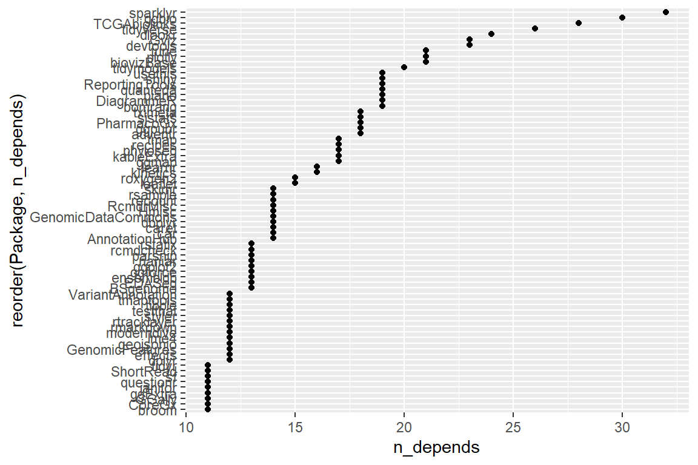


<!--chapter:end:ch02-intro.Rmd-->

# Course Contents {#coursecontents}


## Data Mining Course
This course is about "Exploratory Data Analysis and Initial Data Analysis"

[Wikipedia definition](https://en.wikipedia.org/wiki/Exploratory_data_analysis)

"In statistics, exploratory data analysis (EDA) is an approach to analyzing data sets to summarize their main characteristics, often with visual methods. A statistical model can be used or not, but primarily EDA is for seeing what the data can tell us beyond the formal modeling or hypothesis testing task. Exploratory data analysis was promoted by John Tukey to encourage statisticians to explore the data, and possibly formulate hypotheses that could lead to new data collection and experiments. EDA is different from initial data analysis (IDA),[1] which focuses more narrowly on checking assumptions required for model fitting and hypothesis testing, and handling missing values and making transformations of variables as needed. EDA encompasses IDA"

## Course aims
 
  - EDA is not a formal procedure, getting the right mind set
  - Learn tools in R to GET, CLEAN, EXPLORE and MODEL data
  - Acquire R skills for the complete EDA cycle; object oriented and functional programming  
  - Visualize data
  - Explore assumptions (IDA)
  - Using R for Reproducible Research 
  
## Course contents
Each course masterclass or so-called 'lab' will carry forward a specific theme related to Exploratory Data Analysis. In this course you will exclusively work with the Programming Environment `R` [@R-base] in the Integrated Development Environment `RStudio` [@R-rstudio]. There will be no need to install any software on your laptop, because we will be using a cloud computing solution. This offers flexibility and speed. I will show you where to get the required software. In case that you would be wanting to install your own environment locally.   
  
In this course you will get in-depth knowledge on how to use R in conjunction with RStudio to `IMPORT`, `INVESTIGATE`, `CLEAN`, `VISUALIZE`, `EXPLORE`, `MODEL` and `COMMUNICATE` data and conclusions about data. 
  
To this end, I divided an number of logically connected topics together in seven `labs`. Each lab has several interactive cycles of theory and exercises. During each lab, I will explain a small amount of topics after which the course participants will have the opportunity to practice with exercises.   
  
## BYOD; Bring Your Own Data  
  
During this course you will have the opportunity to bring your own data as case example. Please think about which data you will be able to (freely) share with me and your fellow paticipants. 

## Lab Contents
Below, I will shortly summarize what we will be covering in each lab (seven in total for the complete course).

### Lab 1a: Introduction to RStudio 
Chapter \@ref(lab1aintrorstudio)

 1. Getting the course materials from github.com
 1. Creating objects in R
 1. RStudio introduction

### Lab 1b: Introduction to R  
Chapter \@ref(lab1bintror)

 1. Functional and object oriented programming
 1. Functions
 1. Object Class; vectors, dataframes, lists
 1. Vector types
 1. Getting help
 1. Plots
 1. Data examples

### Lab 1c: Dataframes, lists and matrices  
Chapter \@ref(lab1crecursivevectors)

 1. Dataframes
 1. Lists
 1. Matrices

### Lab 2: Visualize & Explore Data
Chapter \@ref(lab2viz)

 1. Visualizations demo
 1. Build in datasets 
 1. Using the grammar of graphics with `{ggplot2}`
 1. Plot types
 1. `geom_...` and `aes()`
 1. Adding dimensions to a plot 
 1. Solving overplotting
 1. Plot annotation and labels
 1. Saving plots
 1. Examples of `{shiny}` apps

### Lab 3a: Data Wrangling  
Chapter \@ref(lab3awrangling)

 1. Using `{dplyr}` for data wrangling
 1. The `{dplyr}` verbs
 1. Data wrangling in combination with `{ggplot2}`

### Lab 3b: Functional Programming 
Chapter \@ref(lab3bfunctions)

 1. What is a function
 1. Writing function
 1. Function documentation
 1. Loops and `map` family of functions
 1. Scripts and the `source` function
 1. Why write function
 1. Function elements (name/arguments, body, return)
 1. Function documentation, Roxygen comments
 1. Writing error / warning /  messages
 
### Lab 3c: Tidy data
Chapter \@ref(lab3ctidydata)
 
### Lab 4a: Importing data 
Chapter \@ref(lab4aimportingdata)

 1. Paths
 1. Importing data functions
 1. Excel and other 'foreign' formats
 1. Reading from a zipfile/url

### ### Lab 4b: Getting Open Data  
Chapter \@ref(lab4bopendata)

 1. Open data sources
 1. Finding data
 1. Importing data into R (.csv, .tsv, .txt, .json, .xml, .xls(x)
 1. Using APIs (Twitter, Kaggle, Google, CBS)
 1. Accessing databases

### Lab 5: Exploratory Data Analysis _or_ The PPDAC Cycle
Chapter \@ref(lab5eda)

 1. The process of EDA
 1. Problem-Plan-Data-Analysis-Conclusion (PPDAC) Cycle
 1. Missingness
 1. Distibutions
 1. Finding patterns 
 1. Graph types
 1. Multidimensional data
 1. Principal Components
 
### Lab 6a: Exploring Assumptions & Models  
Chapter \@ref(lab6amodels)

 1. Why Assumptions?
 1. Distributions (Gaussian)
 1. Regression
 1. Model output ( `{broom}`)
 
### Lab 6b: Statistics with R (resampling & simple regression) 
Chapter \@ref(lab6bmanymodels)
 
### Lab 7: Statistics with R (multiple regression and ANOVA) 
Chapter \@ref(lab7atextmining)
 
## Exercises
Each masterclass/lab contains a number of exercises. Most lessons have exercises in between the demos and explanations. Usually at the end of each lessons, more exercises are included.

In order for you to get the most out of this course it is important to go over each exercise and try to solve each challenge strictly from within RStudio. 
The easiest way to make an exercise is to copy the text of the exrcise from the Bookdown website into an RMarkdown file and place R-code chunks in between containing the answers or to use the Rmd source documents from Github directly. Store each Rmd file for each lesson seperately in a convenient folder called "exercises" in your course project folder.

During the classes we will also look at the solutions to the exercises together.

The R code containg the demos and the answers will be made available for each lab in the github repository: https://github.com/uashogeschoolutrecht/exploratory_data_masterclasses

<!--chapter:end:ch03-coursecontents.Rmd-->

# Getting Started {#gettingstarted}


## Packages

```r
library(tidyverse)
```


## Preface

This is an R-Markdown document. It is an example of literate programming and it illustrates how we can combine code, text and output. It addresses the issue "Write code for humans, not for computers" very nicely.

Code can be recognized by a code chunck:

_start code chunk_

` ```{r} `

`library(tidyverse)`

`average <- rnorm(1000) %>%` 

  `enframe()`

`average %>%`

  `ggplot(aes(x = value)) +`

  `geom_histogram()`

` ``` `

_end code chunk_

To run the code chunks: set the cursor between the start ` ```{r} ` and the end 
` ``` ` of the chunk and press Ctrl, Shift, Enter, or choose "Run" in the top-right lint.

## To start a new script 
you can look under File -> New File -> RMarkdown or R Script. You will see a lot of other options as well. In this course we will not address these.

## Getting started

## R & RStudio
Throughout this course you will be working with the open source programs R and RStudio. RStudio is an integrated development environment (IDE) that allows you to use R in an interactive (and graphical) way, write your scripts/code and manage your workspace. R and Rstudio are already pre-installed on the course laptops, but for home use can be downloaded for free from http://www.r-project.org and http://www.rstudio.com.

## Github account and setting github credentials in RStudio

 - Create an account for www.github.com
 - Install the package `{gitr}` (M. Teunis, 2019) using the following code:
 

```r
devtools::install_github("uasghogeschoolutrecht/gitr") 
```

## Getting the materials for the course (R scripts):


 1. Go the following url: https://github.com/uashogeschoolutrecht/redamoi
 2. Copy the url address to the clipboard
 3. Start a new RStudio Project `File` -> `New Project`
 4. Select `Version Control` -> `Git` 
 5. Paste the url in the `Repository URL` field
 6. click `Create Project` and let the clone finish
 
**YOU NOW HAVE THE FILES TO START THE FIRST LESSONS** 

The accompanying Bookdown Webpages to this course can be found at:

https://datascience.hu.nl/rsconnect/redamoi

## Cloud server for RStudio
During the course, we will be using a preinstalled version of the RStudio-IDE (integrated development environment). This IDE version runs on a remote UBUNTU 18.04 Linux server and has most of the packages that are needed to follow the course already installed. You can login at the communicated server address and with the credentials supplied at the beginning of the course. The advantage of cloud servers is that you do not need to install the software on their own laptops. 

The address for the server is: https://datascience.hu.nl/rstudio/TMOI-DME-20-21/

To see what the current working directory (wd) is, you can execute the command

`getwd()` 

in the Console window. Try it now!

If all went well the latter half of the working directory will state "/exploratory_data"

## Relative paths
The `getwd()` command gets information on the current wd. Some examples taken from the internet or classical users of R will tell you to use `setwd()` to change the working directory. However, please ignore this advice and always work from an RStudio Project in which you can use relative path. The `{here}` package can help you write clear code to achiev this. See for more details: [`{here}`](https://github.com/jennybc/here_here)

## Creating a new R script
For most analyses/projects, it is best to start by creating an R script file that will contain all the steps taken to get to a certain result. Initially this might be more like a scrapbook to note down what exactly you did. 

Later you can then separate this more cleanly in a workflow (steps taken and/or functions executed) and separate files for function definitions, or even package definitions. 

During this course, we will create special R scripts called RMarkdown (`.Rmd`) for every exercise that contains the steps of that particular exercise. RMarkdown helps you to create a workflow and document your steps. 

Common R scripts contains all functions that can to be reused between different exercises (for instance a file named "functions.R"). 

## Setting up package repositories
Default RStudio has only enabled the CRAN repository, but there are other useful repositories that contain nice R packages. 


```r
setRepositories(graphics=TRUE)
```

## Installing a package from a repository
As an example package (we will be using this later on), we are going to install the "beanplot" package which allows you to easily create so called beanplots. Details of what you can do with them and how to use them, will be provided later during the course. To install the package, go to the Packages window and click on the "install" icon. This will show a popup window where you can type in the name of the package. Type in beanplot and press the "Ok" button. This will download and install the beanplot package.

## Do everything programmatically
The alternative and BETTER WAY is to programmatically install packages:


```r
install.packages("beanplot")
```

To load this library into your workspace, type in library("beanplot") in the Console (or even better, in the R script editor window and then press the "Run" button which will execute the code on that particular line in the R script / or choose `Cntrl` and `Enter` simultaneously).
You can now use the functions defined within this package, for instance to plot a beanplot of (not so useful) random values


```r
library(beanplot)
beanplot(runif(100))
```

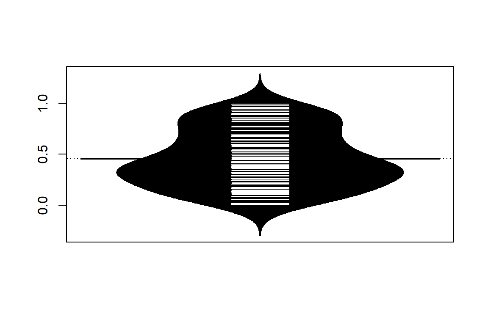

## Getting help
Knowing how to get help, might be one of the most important skills when learning a new programming language. In R, there are various ways to get help. 

A good start, is the overview documentation provided within R. You can get to this by executing help.start() in the Console window. This will show the help documentation in the Help window within Rstudio. There are a number of good manuals provided within this documentation, particularly useful are the "An Introduction to R" and "The R language definition" manuals. Have a quick look at both.

Besides basic documentation, you also can get package specific documentation. The overview of the different packages and corresponding documentation can be found by clicking on the "Packages" link (You can also get here by going to the Packages window directly). How many packages are user specific?
Lookup the documentation for the function sqrt(), what does it do?
Run the examples for the function sqrt(). What does this do?

## A good resource to start
Free material on learning R is very broadly available on the web. You can start your adventuRe at:

http://r4ds.had.co.nz/index.html

the author Hadley Wickham is an excellent data scientist, speaker and developer at RStudio and the brain behind the "tidyverse". Garret Grolemund is an excellent speaker and the lead educator at RStudio. 

<!--chapter:end:ch04-gettingstarted.Rmd-->

---
always_allow_html: true
---

# Case Example {#edacase}

This Chapter illustrates a case example for EDA with real-life data. It takes you through some of the steps of the EDA checklist and illustrates the Problem-Plan-Data-Analysis-Conclusion, shortly 'PPDAC' cycle of EDA. More details on EDA will be discussed in Chapter \@ref(lab5eda)


## Packages needed for the analysis below

```r
library(tidyverse)
library(DiagrammeR)
library(magrittr)
library(ggplot2)
library(ggpubr)
library(ggExtra)
library(captioner)
```

## The curious case of the Frederick Shipman murders

[From Wikipedia](https://en.wikipedia.org/wiki/Harold_Shipman) 

"Harold Frederick Shipman (14 January 1946 – 13 January 2004) was an English general practitioner and is one of the most prolific serial killers in history. On 31 January 2000, a jury found Shipman guilty of the murder of 15 patients under his care. He was sentenced to life imprisonment with the recommendation that he never be released.

The Shipman Inquiry, a two-year-long investigation of all deaths certified by Shipman, which was chaired by Dame Janet Smith, examined Shipman's crimes. _The inquiry identified 215 victims and estimated his total victim count at 250, about 80% of whom were elderly women. His youngest confirmed victim was a 41-year-old man,[4] although "significant suspicion" arose that he had killed patients as young as four_." 

"Thanks to David Spiegelhalter for pointing me to this nice example for my teaching. I am hoping that you will allow me to 'borrow' it from you" [@spiegelhalter2019]

Some of the R-code chunks below were reproduced from the Github repository accompanying [@spiegelhalter2019]

## The PPDAC cycle 
The PPDAC Cycle [@spiegelhalter2019; @mackay2000] is a conceptualization for the iterative EDA process where you: 

 1. Start with a **PROBLEM** (or question)
 1. You devise a **PLAN** to solve the problem (or answer the question)
 1. You collect **DATA** to execute the plan (or perform an experiment)
 1. You **ANALYZE** the data
 1. Finally, you draw a **CONCLUSION** from the analysis
 1. You probably start the cycle again, with a different or slightly different question

<div class="figure">

```{=html}
<div id="htmlwidget-93e34d0853c05b55458a" style="width:768px;height:576px;" class="grViz html-widget"></div>
<script type="application/json" data-for="htmlwidget-93e34d0853c05b55458a">{"x":{"diagram":"\ndigraph rmarkdown {\n  Problem -> Plan\n  Plan -> Data\n  Data -> Analysis\n  Analysis -> Conclusion \n  Conclusion -> Problem\n}\n","config":{"engine":"dot","options":null}},"evals":[],"jsHooks":[]}</script>
```

<p class="caption">(\#fig:unnamed-chunk-2)The PPDAC cycle of Exploratory Data Analysis in a diagram. Please note that sometimes shortcuts are possible and even feasible. [@spiegelhalter2019, @mackay2000]</p>
</div>

## The PPDAC Cycle Starts with a relevant _PROBLEM_.

(ref:shipquestion) The _PROBLEM_ in the case at hand could be: "Did the author of the Wikipedia article above get the facts straight? For example: Is it true that the victims are maninly elderly? Is the statement about the majority of the gender of the victims being female correct? Is the amount of victims right?"

(ref:shipquestion)

## Let's try to come up with a _PLAN_

We already defined our _PROBLEM_, now we need a _PLAN_. When creating a plan it is good to think about what type of information we would need to solve our problem. Think about information in terms of variables in a dataset. In R, we usually work with tabular data in which variables are the columns of our dataset and rows are the observations.

**DISCUSS WITH YOUR NEIGHBOUR**
If we design a datatable that would provide data with which we could answer the problem, which information would we need?

The data would need to include at least:

 - A list with 'suspected' victims
 - The age at deadt of each victim
 - The gender of the victim

With information on these three variables we would be able to solve at least:
 
 1. How many victims Shipman is suspected of having murdered?
 1. What is the gender distribution among victims?
 1. What is the age distribution is among victims? 
 
These three subquestions solve our main question: (ref:shipquestion)
 
## Let's look at the available _DATA_

Now that we defined the problem and we have come up with a plan to solve it, we need _DATA_. When acquiring data you carefully need to take into consideration the quality of it. In this case we rely on the integrity of the author of "The art of Statistics" David Speigelhalter. But it is always good to take a look at the original source of the date and in many cases it is preferrable to do the acquisition of the data directly from the (original) source if possible. In later chapters you will learn techniques like webscraping and accessing databases directly from R to achieve this. 

[Here is a link to the original source](https://webarchive.nationalarchives.gov.uk/20090808221518/http://www.the-shipman-inquiry.org.uk/fr_casesbyyear.asp?year=74&from=r)

## Load the Shipman murders data 
Dataset derived from: https://github.com/dspiegel29/ArtofStatistics [@spiegelhalter2019]

To load the data into R you can run the following command. The datafile is in csv format: 

(ref:csvformat) CSV-format is a non proprietary standard format where columns are seperated by either a `,` (comma) or a `;` (semi-colon). Which is used depends on the region of the World and whether the decimal seperator in that region is a `,` or a `.`. When reading a CSV in R, alway make sure you define the appropriate seperator.

(ref:csvformat)

When loading the data the `data.frame` is stored in the Global Environment of your R-session as `shipman_murders`. You can access this variable by typing its name in the `Console` or inspecting it in the RStudio interactive viewer under the `Environment` tab. 

Run the code below to read the data into R.

```r
shipman_murders <- read_csv(
  here::here(
    "data", 
    "00-1-shipman-confirmed-victims-x.csv"
    )
  )
```

**EXERCISE 1** Study the code above and discuss the following questions with your neighbour.

A) Without looking in the csv file: What type of seperator does the file data: "00-1-shipman-confirmed-victims-x.csv" have? How would you be able to discover this?
_There are multiple options._

**TIPS** 
 
 - Try running `help("read_csv")` and read over the manual for this function.
 - There is also a Linux Terminal solution, do you know which?

B) Can you discover what information is stored in this data by running the command `names(shipman_murders)` in the R Console?

C) How many murdered people are included in the data?

## Analyzing the data
When obtaining the data it is good to review the EDA checklist to see what could be explored.

When perfoming EDA consider:

 1. What question(s) are you trying to solve (or prove wrong)?
 1. Which information do you need and can you come up with a plan to answer the question(s)
 1. What kind of data do you have and how do you treat different types?
 1. What’s missing from the data and how do you deal with it?
 1. Where are the outliers and why should you care about them?
 1. How can you add, change or remove features to get more out of your data?
 1. Do you need additional data from other sources to relate to the dataset under scrutany?
 1. Are underlying statistical assumptions met / how is data distribution looking?
 1. What (exploratory) models apply or fit well to the data?
 1. What is the undelying (experimental) design?
 1. Is there multi-colinearity?

If we review the list above we can already check a number of items from the list that we have taken care of. Let's take a look at the data first


```r
DT::datatable(shipman_murders)
```

```{=html}
<div id="htmlwidget-243dcd5fe6b7056d8ec8" style="width:100%;height:auto;" class="datatables html-widget"></div>
<script type="application/json" data-for="htmlwidget-243dcd5fe6b7056d8ec8">{"x":{"filter":"none","vertical":false,"data":[["1","2","3","4","5","6","7","8","9","10","11","12","13","14","15","16","17","18","19","20","21","22","23","24","25","26","27","28","29","30","31","32","33","34","35","36","37","38","39","40","41","42","43","44","45","46","47","48","49","50","51","52","53","54","55","56","57","58","59","60","61","62","63","64","65","66","67","68","69","70","71","72","73","74","75","76","77","78","79","80","81","82","83","84","85","86","87","88","89","90","91","92","93","94","95","96","97","98","99","100","101","102","103","104","105","106","107","108","109","110","111","112","113","114","115","116","117","118","119","120","121","122","123","124","125","126","127","128","129","130","131","132","133","134","135","136","137","138","139","140","141","142","143","144","145","146","147","148","149","150","151","152","153","154","155","156","157","158","159","160","161","162","163","164","165","166","167","168","169","170","171","172","173","174","175","176","177","178","179","180","181","182","183","184","185","186","187","188","189","190","191","192","193","194","195","196","197","198","199","200","201","202","203","204","205","206","207","208","209","210","211","212","213","214","215"],["17-Mar-75","07-Aug-78","30-Aug-78","07-Dec-78","20-Dec-78","10-Aug-79","28-Nov-79","18-Apr-81","26-Aug-81","04-Jan-83","28-Jun-83","07-Jan-84","08-Feb-84","15-Apr-84","24-Apr-84","21-Sep-84","27-Nov-84","17-Dec-84","18-Dec-84","24-Dec-84","02-Jan-85","01-Feb-85","04-Feb-85","15-Feb-85","22-Feb-85","26-Jun-85","26-Jun-85","23-Aug-85","17-Dec-85","20-Dec-85","31-Dec-85","07-Jan-86","23-Apr-86","06-Jun-86","15-Sep-86","07-Oct-86","17-Nov-86","16-Dec-86","23-Dec-86","30-Mar-87","01-Apr-87","16-Apr-87","08-May-87","14-Sep-87","11-Dec-87","29-Dec-87","30-Dec-87","05-Jan-88","15-Jan-88","09-Feb-88","15-Feb-88","15-Feb-88","16-Feb-88","18-Sep-88","20-Oct-88","06-Nov-88","17-Dec-88","19-Dec-88","31-Jan-89","08-Mar-89","12-May-89","05-Jun-89","06-Jul-89","14-Aug-89","22-Sep-89","26-Sep-89","15-Oct-89","16-Oct-89","18-Oct-89","06-Nov-89","18-Sep-90","30-Dec-90","07-Oct-92","24-Feb-93","24-Feb-93","22-Mar-93","08-Apr-93","17-Apr-93","26-Apr-93","27-Apr-93","02-May-93","04-May-93","12-May-93","13-May-93","22-Jul-93","16-Aug-93","16-Dec-93","22-Dec-93","31-Dec-93","04-Jan-94","13-Jan-94","09-Feb-94","17-May-94","25-May-94","15-Jun-94","17-Jun-94","27-Jul-94","25-Nov-94","30-Nov-94","29-Dec-94","09-Jan-95","01-Mar-95","03-Mar-95","06-Mar-95","07-Mar-95","07-Mar-95","13-Mar-95","21-Mar-95","26-Mar-95","31-Mar-95","10-Apr-95","13-Apr-95","14-Apr-95","21-Apr-95","04-May-95","02-Jun-95","13-Jun-95","17-Jun-95","29-Jun-95","12-Jul-95","31-Jul-95","29-Aug-95","14-Sep-95","26-Sep-95","24-Oct-95","08-Nov-95","22-Nov-95","25-Nov-95","14-Dec-95","14-Dec-95","02-Jan-96","11-Jan-96","21-Feb-96","27-Feb-96","12-Mar-96","18-Apr-96","24-Apr-96","07-May-96","13-May-96","29-May-96","30-May-96","06-Jun-96","10-Jun-96","17-Jun-96","25-Jun-96","25-Jun-96","02-Jul-96","11-Jul-96","16-Jul-96","19-Jul-96","24-Jul-96","29-Jul-96","30-Aug-96","12-Sep-96","20-Sep-96","23-Oct-96","20-Nov-96","23-Nov-96","04-Dec-96","17-Dec-96","02-Jan-97","03-Jan-97","08-Jan-97","20-Jan-97","27-Jan-97","03-Feb-97","04-Feb-97","23-Feb-97","28-Feb-97","22-Mar-97","27-Mar-97","21-Apr-97","25-Apr-97","25-Apr-97","02-May-97","12-May-97","21-May-97","29-May-97","24-Jun-97","07-Jul-97","14-Jul-97","25-Jul-97","28-Jul-97","10-Aug-97","01-Sep-97","22-Sep-97","26-Sep-97","29-Sep-97","10-Nov-97","14-Nov-97","21-Nov-97","24-Nov-97","08-Dec-97","09-Dec-97","10-Dec-97","18-Dec-97","24-Dec-97","22-Jan-98","26-Jan-98","02-Feb-98","09-Feb-98","13-Feb-98","15-Feb-98","18-Feb-98","27-Feb-98","04-Mar-98","06-Mar-98","07-Mar-98","13-Mar-98","17-Mar-98","20-Mar-98","24-Mar-98","11-May-98","12-Jun-98","24-Jun-98"],["Eva Lyons","Sarah Hannah Marsland","Mary Ellen Jordan","Harold Bramwell","Annie Campbell","Alice Maude Gorton","Jack Leslie Shelmerdine","May Slater","Elizabeth Ashworth","Percy Ward","Moira Ashton Fox","Dorothy Tucker","Gladys Roberts","Joseph Bardsley","Winifred Arrowsmith","Mary Winterbottom","Ada Ashworth","Joseph Vincent Everall","Edith Wibberley","Eileen Theresa Cox","Peter Lewis","May Brookes","Ellen Higson","Margaret Ann Conway","Kathleen McDonald","Thomas Moult","Mildred Robinson","Frances Elizabeth Turner","Selina Mackenzie","Vera Bramwell","Fred Kellett","Deborah Middleton","Dorothy Fletcher","Thomas Fowden","Mona Ashton White","Mary Tomlin","Beatrice Toft","Lily Broadbent","James Wood","Frank Halliday","Albert Cheetham","Alice Thomas","Jane Frances Rostron","Nancy Anne Brassington","Margaret Townsend","Nellie Bardsley","Elizabeth Ann Rogers","Elizabeth Fletcher","Alice Mary Jones","Dorothea Hill Renwick","Ann Cooper","Jane Jones","Lavinia Robinson","Rose Ann Adshead","Alice Prestwich","Walter Tingle","Harry Stafford","Ethel Bennett","Wilfred Chappell","Mary Emma Hamer","Beatrice Helen Clee","Josephine Hall","Hilda Fitton","Marion Carradice","Elsie Harrop","Elizabeth Mary Burke","Sarah Jane Williamson","John Charlton","George Edgar Vizor","Joseph Frank Wilcockson","Dorothy Rowarth","Mary Rose Dudley","Monica Rene Sparkes","Olive Heginbotham","Hilda Mary Couzens","Amy Whitehead","Mary Emma Andrew","Sarah Ashworth","Fanny Nichols","Marjorie Parker","Nellie Mullen","Edna May Llewellyn","Emily Morgan","Violet May Bird","Jose Kathleen Diana Richards","Edith Calverley","Joseph Leigh","Eileen Robinson","Charles Edward Brocklehurst","Joan Milray Harding","Christine Hancock","Elsie Platt","Mary Alice Smith","Ronnie Devenport","Cicely Sharples","Alice Christine Kitchen","Maria Thornton","Henrietta Walker","Elizabeth Ellen Mellor","John Bennett Molesdale","Alice Kennedy","Lucy Virgin","Joseph Shaw","Maria West","Netta Ashcroft","Lily Bardsley","Marie Antoinette Fernley","John Crompton","Frank Crompton","Vera Brocklehurst","Angela Philomena Tierney","Edith Scott","Clara Hackney","Renate Eldtraude Overton","Kate Maud Sellors","Clifford Barnes Heapey","Bertha Moss","Brenda Ashworth","Ernest Rudol","Ada Matley Hilton","Irene Aitken","Arthur Henderson Stopford","Geoffrey Bogle","Dora Elizabeth Ashton","Muriel Margaret Ward","Edith Brock","Charles Henry Barlow","Konrad Peter Ovcar-Robinson","Elizabeth Teresa Sigley","Kenneth Wharmby Woodhead","Hilda Mary Hibbert","Erla Copeland","Jane Elizabeth Shelmerdine","John Sheard Greenhalgh","Minnie Doris Irene Galpin","Marjorie Hope Waller","John Stone","Elsie Godfrey","Edith Brady","Valerie Cuthbert","Lilian Cullen","Renee Lacey","Leah Fogg","Gladys Saunders","Nellie Bennett","Margaret Mary Vickers","Tom Balfour Russell","Irene Turner","Carrie Leigh","Marion Elizabeth Higham","Elsie Hannible","Elsie Barker","Sidney Arthur Smith","Dorothy Mary Andrew","Anne Lilian Ralphs","Millicent Garside","Irene Heathcote","Samuel Mills","Thomas Cheetham","Kenneth Ernest Smith","Eileen Daphne Crompton","David Alan Harrison","Elsie Lorna Dean","Irene Brooder","Charlotte Bennison","Charles Henry Killan","Betty Royston","Joyce Woodhead","Lizzie Adams","Rose Garlick","May Lowe","Mary Coutts","Elsie Cheetham","Jean Lilley","Lena Norah Slater","Ethel May Kellett","Doris Earls","Ivy Lomas","Vera Whittingslow","Maureen Lamonnier Jackson","Muriel Grimshaw","John Louden Livesey","Lily Newby Taylor","Dorothy Doretta Hopkins","Nancy Jackson","Mavis Mary Pickup","Bessie Swann","Enid Otter","Florence Lewis","Mary Walls","Elizabeth Mary Baddeley","Marie Quinn","Elizabeth Battersby","Laura Kathleen Wagstaff","Bianka Pomfret","Alice Black","James Joseph King","Mabel Shawcross","Norah Nuttall","Cissie Davies","Pamela Marguerite Hillier","Laura Frances Linn","Irene Berry","Maureen Alice Ward","Joan Edwina Dean","Harold Eddleston","Margaret Anne Waldron","Irene Chapman","Dorothy Long","Lily Higgins","Ada Warburton","Martha Marley","Winifred Mellor","Joan May Melia","Kathleen Grundy"],[70,86,73,73,88,76,77,84,81,90,77,51,78,83,70,76,87,80,76,72,41,74,84,69,73,70,84,85,77,79,79,81,74,81,63,73,59,75,82,76,85,83,78,71,80,69,74,90,83,90,93,83,84,80,69,85,87,80,80,81,78,69,75,80,82,82,82,81,67,85,56,69,72,86,92,82,86,74,84,74,77,68,84,60,74,77,78,54,90,82,53,73,84,57,87,70,78,87,75,81,88,70,88,81,71,88,53,82,86,70,71,85,84,47,75,85,68,63,82,88,65,82,72,87,87,74,88,43,67,75,81,79,80,88,71,79,77,85,72,54,77,63,82,82,86,81,77,67,81,84,85,84,76,85,75,76,76,89,78,73,75,47,69,76,89,90,70,74,77,76,84,80,76,58,68,74,79,63,69,51,76,69,86,72,81,79,79,77,79,78,83,67,70,81,49,73,83,79,64,73,68,83,74,57,75,77,65,74,84,83,77,88,73,73,81],["Own home","Own home","Own home","Own home","Own home","Own home","Hospital","Own home","Own home","Own home","Own home","Own home","Own home","Own home","Own home","Own home","Own home","Own home","Own home","Own home","Own home","Own home","Own home","Own home","Own home","Own home","Own home","Own home","Own home","Own home","Own home","Own home","Residential Home","Own home","Own home","Own home","Own home","Own home","Own home","Own home","Own home","Own home","Own home","Own home","Own home","Own home","Own home","Own home","Own home","Own home","Own home","Own home","Own home","Own home","Own home","Own home","Own home","Own home","Own home","Shipman's surgery","Own home","Own home","Own home","Own home","Own home","Own home","Own home","Own home","Own home","Own home","Own home","Own home","Own home","Own home","Own home","Own home","Own home","Own home","Own home","Own home","Own home","Own home","Own home","Own home","Own home","Own home","Own home","Own home","Own home","Shipman's surgery","Own home","Own home","Own home","Own home","Own home","Own home","Own home","Own home","Own home","Own home","Own home","Own home","Own home","Own home","Own home","Own home","Own home","Own home","Own home","Own home","Own home","Own home","Own home","Hospital","Own home","Nursing home","Shipman's surgery","Own home","Own home","Own home","Own home","Own home","Own home","Shipman's surgery","Own home","Own home","Own home","Own home","Own home","Own home","Own home","Own home","Own home","Own home","Own home","Own home","Own home","Own home","Shipman's surgery","Own home","Own home","Own home","Own home","Own home","Own home","Own home","Own home","Own home","Own home","Own home","Own home","Own home","Own home","Own home","Own home","Own home","Own home","Own home","Own home","Own home","Residential home","Own home","Own home","Own home","Own home","Own home","Own home","Own home","Own home","Own home","Own home","Own home","Own home","Own home","Own home","Own home","Own home","Shipman's surgery","Own home","Own home","Own home","Own home","Own home","Own home","Own home","Own home","Own home","Own home","Own home","Own home","Own home","Own home","Own home","Own home","Own home","Own home","Own home","Own home","Own home","Own home","Own home","Own home","Own home","Own home","Own home","Own home","Own home","Own home","Own home","Own home","Own home","Own home","Own home","Own home","Own home"],["Unlawful killing","Unlawful killing","Unlawful killing","Unlawful killing","Unlawful killing","Unlawful killing","Unlawful killing","Unlawful killing","Unlawful killing","Unlawful killing","Unlawful killing","Unlawful killing","Unlawful killing","Unlawful killing","Unlawful killing","Unlawful killing","Unlawful killing","Unlawful killing","Unlawful killing","Unlawful killing","Unlawful killing","Unlawful killing","Unlawful killing","Unlawful killing","Unlawful killing","Unlawful killing","Unlawful killing","Unlawful killing","Unlawful killing","Unlawful killing","Unlawful killing","Unlawful killing","Unlawful killing","Unlawful killing","Unlawful killing","Unlawful killing","Unlawful killing","Unlawful killing","Unlawful killing","Unlawful killing","Unlawful killing","Unlawful killing","Unlawful killing","Unlawful killing","Unlawful killing","Unlawful killing","Unlawful killing","Unlawful killing","Unlawful killing","Unlawful killing","Unlawful killing","Unlawful killing","Unlawful killing","Unlawful killing","Unlawful killing","Unlawful killing","Unlawful killing","Unlawful killing","Unlawful killing","Unlawful killing","Unlawful killing","Unlawful killing","Unlawful killing","Unlawful killing","Unlawful killing","Unlawful killing","Unlawful killing","Unlawful killing","Unlawful killing","Unlawful killing","Unlawful killing","Unlawful killing","Unlawful killing","Unlawful killing","Unlawful killing","Unlawful killing","Unlawful killing","Unlawful killing","Unlawful killing","Unlawful killing","Unlawful killing","Unlawful killing","Unlawful killing","Unlawful killing","Unlawful killing","Unlawful killing","Unlawful killing","Unlawful killing","Unlawful killing","Unlawful killing","Unlawful killing","Unlawful killing","Unlawful killing","Unlawful killing","Unlawful killing","Unlawful killing","Unlawful killing","Unlawful killing","Unlawful killing","Unlawful killing","Unlawful killing","Unlawful killing","Unlawful killing","Conviction","Unlawful killing","Unlawful killing","Unlawful killing","Unlawful killing","Unlawful killing","Unlawful killing","Unlawful killing","Unlawful killing","Unlawful killing","Unlawful killing","Unlawful killing","Unlawful killing","Unlawful killing","Unlawful killing","Unlawful killing","Unlawful killing","Unlawful killing","Unlawful killing","Unlawful killing","Unlawful killing","Unlawful killing","Unlawful killing","Unlawful killing","Unlawful killing","Unlawful killing","Unlawful killing","Unlawful killing","Unlawful killing","Unlawful killing","Unlawful killing","Unlawful killing","Unlawful killing","Unlawful killing","Unlawful killing","Unlawful killing","Unlawful killing","Unlawful killing","Unlawful killing","Unlawful killing","Unlawful killing","Unlawful killing","Unlawful killing","Unlawful killing","Conviction","Unlawful killing","Unlawful killing","Unlawful killing","Unlawful killing","Unlawful killing","Unlawful killing","Unlawful killing","Unlawful killing","Unlawful killing","Unlawful killing","Unlawful killing","Unlawful killing","Unlawful killing","Unlawful killing","Unlawful killing","Unlawful killing","Unlawful killing","Unlawful killing","Unlawful killing","Unlawful killing","Conviction","Unlawful killing","Unlawful killing","Unlawful killing","Unlawful killing","Conviction","Unlawful killing","Unlawful killing","Unlawful killing","Conviction","Unlawful killing","Unlawful killing","Conviction","Unlawful killing","Unlawful killing","Unlawful killing","Unlawful killing","Unlawful killing","Unlawful killing","Unlawful killing","Unlawful killing","Unlawful killing","Unlawful killing","Conviction","Unlawful killing","Conviction","Conviction","Unlawful killing","Unlawful killing","Unlawful killing","Conviction","Unlawful killing","Conviction","Unlawful killing","Unlawful killing","Conviction","Unlawful killing","Unlawful killing","Unlawful killing","Unlawful killing","Unlawful killing","Unlawful killing","Unlawful killing","Unlawful killing","Conviction","Conviction","Conviction"],[1975,1978,1978,1978,1978,1979,1979,1981,1981,1983,1983,1984,1984,1984,1984,1984,1984,1984,1984,1984,1985,1985,1985,1985,1985,1985,1985,1985,1985,1985,1985,1986,1986,1986,1986,1986,1986,1986,1986,1987,1987,1987,1987,1987,1987,1987,1987,1988,1988,1988,1988,1988,1988,1988,1988,1988,1988,1988,1989,1989,1989,1989,1989,1989,1989,1989,1989,1989,1989,1989,1990,1990,1992,1993,1993,1993,1993,1993,1993,1993,1993,1993,1993,1993,1993,1993,1993,1993,1993,1994,1994,1994,1994,1994,1994,1994,1994,1994,1994,1994,1995,1995,1995,1995,1995,1995,1995,1995,1995,1995,1995,1995,1995,1995,1995,1995,1995,1995,1995,1995,1995,1995,1995,1995,1995,1995,1995,1995,1995,1995,1996,1996,1996,1996,1996,1996,1996,1996,1996,1996,1996,1996,1996,1996,1996,1996,1996,1996,1996,1996,1996,1996,1996,1996,1996,1996,1996,1996,1996,1996,1997,1997,1997,1997,1997,1997,1997,1997,1997,1997,1997,1997,1997,1997,1997,1997,1997,1997,1997,1997,1997,1997,1997,1997,1997,1997,1997,1997,1997,1997,1997,1997,1997,1997,1997,1997,1997,1998,1998,1998,1998,1998,1998,1998,1998,1998,1998,1998,1998,1998,1998,1998,1998,1998,1998],[0,0,0,1,0,0,1,0,0,1,0,0,0,1,0,0,0,1,0,0,1,0,0,0,0,1,0,0,0,0,1,0,0,1,0,0,0,0,1,1,1,0,0,0,0,0,0,0,0,0,0,0,0,0,0,1,1,0,0,0,0,0,0,0,0,0,0,1,1,1,0,0,0,0,0,0,0,0,0,0,0,0,0,0,0,0,0,0,1,0,0,0,0,0,0,0,0,0,0,0,0,0,1,0,0,0,0,1,1,0,0,0,0,0,0,1,0,0,0,0,0,1,1,0,0,0,1,1,0,1,0,0,0,1,0,0,1,0,0,0,0,0,0,0,0,0,1,0,0,0,0,0,1,0,0,0,0,0,1,1,0,1,0,0,0,0,0,0,0,0,0,0,0,0,0,0,0,0,0,0,0,1,0,0,0,0,0,0,0,0,0,0,0,0,0,0,1,0,0,0,0,0,0,0,0,1,0,0,0,0,0,0,0,0,0],[1974.71,1978.1,1978.16,1978.44,1978.47,1979.11,1979.41,1980.8,1981.15,1982.51,1982.99,1983.52,1983.61,1983.79,1983.81,1984.22,1984.41,1984.46,1984.47,1984.48,1984.51,1984.59,1984.6,1984.63,1984.65,1984.99,1984.99,1985.15,1985.46,1985.47,1985.5,1985.52,1985.81,1985.93,1986.21,1986.27,1986.38,1986.46,1986.48,1986.75,1986.75,1986.79,1986.85,1987.21,1987.45,1987.5,1987.5,1987.51,1987.54,1987.61,1987.62,1987.62,1987.63,1988.22,1988.3,1988.35,1988.46,1988.47,1988.59,1988.68,1988.86,1988.93,1989.01,1989.12,1989.23,1989.24,1989.29,1989.29,1989.3,1989.35,1990.22,1990.5,1992.27,1992.65,1992.65,1992.72,1992.77,1992.79,1992.82,1992.82,1992.84,1992.84,1992.86,1992.87,1993.06,1993.13,1993.46,1993.48,1993.5,1993.51,1993.54,1993.61,1993.88,1993.9,1993.96,1993.96,1994.07,1994.4,1994.42,1994.5,1994.53,1994.67,1994.67,1994.68,1994.68,1994.68,1994.7,1994.72,1994.73,1994.75,1994.78,1994.78,1994.79,1994.81,1994.84,1994.92,1994.95,1994.96,1994.99,1995.03,1995.08,1995.16,1995.21,1995.24,1995.32,1995.36,1995.39,1995.4,1995.45,1995.45,1995.5,1995.53,1995.64,1995.66,1995.7,1995.8,1995.81,1995.85,1995.87,1995.91,1995.91,1995.93,1995.94,1995.96,1995.98,1995.98,1996,1996.03,1996.04,1996.05,1996.06,1996.08,1996.16,1996.2,1996.22,1996.31,1996.39,1996.4,1996.43,1996.46,1996.51,1996.51,1996.52,1996.56,1996.58,1996.59,1996.6,1996.65,1996.66,1996.72,1996.74,1996.81,1996.82,1996.82,1996.84,1996.86,1996.89,1996.91,1996.98,1997.02,1997.04,1997.07,1997.07,1997.11,1997.17,1997.23,1997.24,1997.25,1997.36,1997.37,1997.39,1997.4,1997.44,1997.44,1997.44,1997.47,1997.48,1997.56,1997.57,1997.59,1997.61,1997.62,1997.63,1997.64,1997.66,1997.67,1997.68,1997.68,1997.7,1997.71,1997.72,1997.73,1997.86,1997.95,1997.98],["70-74","85-89","70-74","70-74","85-89","75-79","75-79","80-84","80-84","90-94","75-79","50-54","75-79","80-84","70-74","75-79","85-89","80-84","75-79","70-74","40-44","70-74","80-84","65-69","70-74","70-74","80-84","85-89","75-79","75-79","75-79","80-84","70-74","80-84","60-64","70-74","55-59","75-79","80-84","75-79","85-89","80-84","75-79","70-74","80-84","65-69","70-74","90-94","80-84","90-94","90-94","80-84","80-84","80-84","65-69","85-89","85-89","80-84","80-84","80-84","75-79","65-69","75-79","80-84","80-84","80-84","80-84","80-84","65-69","85-89","55-59","65-69","70-74","85-89","90-94","80-84","85-89","70-74","80-84","70-74","75-79","65-69","80-84","60-64","70-74","75-79","75-79","50-54","90-94","80-84","50-54","70-74","80-84","55-59","85-89","70-74","75-79","85-89","75-79","80-84","85-89","70-74","85-89","80-84","70-74","85-89","50-54","80-84","85-89","70-74","70-74","85-89","80-84","45-49","75-79","85-89","65-69","60-64","80-84","85-89","65-69","80-84","70-74","85-89","85-89","70-74","85-89","40-44","65-69","75-79","80-84","75-79","80-84","85-89","70-74","75-79","75-79","85-89","70-74","50-54","75-79","60-64","80-84","80-84","85-89","80-84","75-79","65-69","80-84","80-84","85-89","80-84","75-79","85-89","75-79","75-79","75-79","85-89","75-79","70-74","75-79","45-49","65-69","75-79","85-89","90-94","70-74","70-74","75-79","75-79","80-84","80-84","75-79","55-59","65-69","70-74","75-79","60-64","65-69","50-54","75-79","65-69","85-89","70-74","80-84","75-79","75-79","75-79","75-79","75-79","80-84","65-69","70-74","80-84","45-49","70-74","80-84","75-79","60-64","70-74","65-69","80-84","70-74","55-59","75-79","75-79","65-69","70-74","80-84","80-84","75-79","85-89","70-74","70-74","80-84"],["Women","Women","Women","Men","Women","Women","Men","Women","Women","Men","Women","Women","Women","Men","Women","Women","Women","Men","Women","Women","Men","Women","Women","Women","Women","Men","Women","Women","Women","Women","Men","Women","Women","Men","Women","Women","Women","Women","Men","Men","Men","Women","Women","Women","Women","Women","Women","Women","Women","Women","Women","Women","Women","Women","Women","Men","Men","Women","Women","Women","Women","Women","Women","Women","Women","Women","Women","Men","Men","Men","Women","Women","Women","Women","Women","Women","Women","Women","Women","Women","Women","Women","Women","Women","Women","Women","Women","Women","Men","Women","Women","Women","Women","Women","Women","Women","Women","Women","Women","Women","Women","Women","Men","Women","Women","Women","Women","Men","Men","Women","Women","Women","Women","Women","Women","Men","Women","Women","Women","Women","Women","Men","Men","Women","Women","Women","Men","Men","Women","Men","Women","Women","Women","Men","Women","Women","Men","Women","Women","Women","Women","Women","Women","Women","Women","Women","Men","Women","Women","Women","Women","Women","Men","Women","Women","Women","Women","Women","Men","Men","Women","Men","Women","Women","Women","Women","Women","Women","Women","Women","Women","Women","Women","Women","Women","Women","Women","Women","Women","Women","Women","Men","Women","Women","Women","Women","Women","Women","Women","Women","Women","Women","Women","Women","Women","Women","Men","Women","Women","Women","Women","Women","Women","Women","Women","Men","Women","Women","Women","Women","Women","Women","Women","Women","Women"]],"container":"<table class=\"display\">\n  <thead>\n    <tr>\n      <th> <\/th>\n      <th>DateofDeath<\/th>\n      <th>Name<\/th>\n      <th>Age<\/th>\n      <th>PlaceofDeath<\/th>\n      <th>Decision<\/th>\n      <th>yearOfDeath<\/th>\n      <th>gender<\/th>\n      <th>fractionalDeathYear<\/th>\n      <th>ageBracket<\/th>\n      <th>gender2<\/th>\n    <\/tr>\n  <\/thead>\n<\/table>","options":{"columnDefs":[{"className":"dt-right","targets":[3,6,7,8]},{"orderable":false,"targets":0}],"order":[],"autoWidth":false,"orderClasses":false}},"evals":[],"jsHooks":[]}</script>
```

_If you are viewing this book in a browser you should see an interactive table. Take 5 minutes to study the data and 2 additional minutes to discuss what you see with one of your fellow course participants._

Try accessing the variable called `shipman_murders` by typing it's name in the Console. If all goes well this is what you see:


```
## # A tibble: 215 × 10
##    DateofDeath Name             Age PlaceofDeath Decision     yearOfDeath gender
##    <chr>       <chr>          <dbl> <chr>        <chr>              <dbl>  <dbl>
##  1 17-Mar-75   Eva Lyons         70 Own home     Unlawful ki…        1975      0
##  2 07-Aug-78   Sarah Hannah …    86 Own home     Unlawful ki…        1978      0
##  3 30-Aug-78   Mary Ellen Jo…    73 Own home     Unlawful ki…        1978      0
##  4 07-Dec-78   Harold Bramwe…    73 Own home     Unlawful ki…        1978      1
##  5 20-Dec-78   Annie Campbell    88 Own home     Unlawful ki…        1978      0
##  6 10-Aug-79   Alice Maude G…    76 Own home     Unlawful ki…        1979      0
##  7 28-Nov-79   Jack Leslie S…    77 Hospital     Unlawful ki…        1979      1
##  8 18-Apr-81   May Slater        84 Own home     Unlawful ki…        1981      0
##  9 26-Aug-81   Elizabeth Ash…    81 Own home     Unlawful ki…        1981      0
## 10 04-Jan-83   Percy Ward        90 Own home     Unlawful ki…        1983      1
## # … with 205 more rows, and 3 more variables: fractionalDeathYear <dbl>,
## #   ageBracket <chr>, gender2 <chr>
```

The data consists of 10 columns (called `variables` in R lingo) and 215 rows (or sometimes called `observations`, `cases`,`incidences` or in this case `subjects`)

## How many people did Shipman kill?

Now that we have the data loaded into R, let's see if we can answer the first of our subquestions.

We could just guess from the table that the `Name` variable identifies the victim and considerig that we have 215 observations, can we conclude that there are 215 people in this list? That would indeed lead us to conclude that the number of 215 victims mentioned on the Wiki page is correct. Can you think of one or more important conditions for the data that need to be met in order for this to be the correct conclusion? 

One important condition could be that there are no duplicated names in the dataset. If we want to confirm there are not, we could take a look at all 215 records and try to remember if we see duplicated names. If we look at this list often enough, this would problably work, but takes quite some time and is error prone.

Now that we have the data in R, why not use The Power of R to shed light on this issue.

## Detecting duplicated names:

The following code:

 1. Turns all capitals in the variable names into lower case (I will explain in chapter \@ref(lab5eda)) why this is good idea
 1. Turns all names in the now `name` variable into lowercase. (can you think why this is a good idea)
 1. Removes spaces from all names (assume somebody made a typo)
 1. Removes all leading and trailing white spaces from the names
 1. Tries to find duplicates in the subject names
 

```r
names(shipman_murders) <- names(shipman_murders) %>%
  tolower()

shipman_murders <- shipman_murders %>%
  mutate(name = tolower(name),
         name = str_replace_all(string = name, pattern = " ", replacement = ""),
         names = trimws(name))

## show first five names
shipman_murders$name[1:5]
```

```
## [1] "evalyons"            "sarahhannahmarsland" "maryellenjordan"    
## [4] "haroldbramwell"      "anniecampbell"
```

```r
## now look at duplicates
duplicated(shipman_murders$name) %>% which(arr.ind = TRUE) %>% length()
```

```
## [1] 0
```

Let's conclude from the above, that indeed there are 215 unique names in the dataset and that no duplicates exist. So we can answer the first question on how many people Shipman killed with `215`. This number was mentioned on the Wiki as well. 
_Can you think of an additional check for duplicated names before we move on?_

There are still a number of assumptions that underly this statement and when doing data-analysis it is good practice to clearly and very explicitly state these assumptions. 
We will first look at the other 2 questions remaining. At the end of this chapter, I will summarize some explicit assumptions to the conclusion of the complete analysis and maybe you can add more.

## Lets investigate what the gender distribution was of the victims and what their ages were

We can do this in several ways: 

 - By just counting the number of males and females
 - By plotting a bar graph with the number of females and males
 - By looking at the age distribution by gender

## Inspecting the variables `gender` and `age`
Below we show the first 5 entries for both variables

```r
shipman_murders$gender[1:5]
```

```
## [1] 0 0 0 1 0
```

```r
shipman_murders$age[1:5]
```

```
## [1] 70 86 73 73 88
```

The `gender` variable is a so-called dummy or one-hot encoded variable. Mind that 0 stands for "female" and 1 stand for "male". 

We can recode the variable by doing:

```r
fct_recode(as_factor(shipman_murders$gender), 
           male = "1",
           female = "0"
           )
```

```
##   [1] female female female male   female female male   female female male  
##  [11] female female female male   female female female male   female female
##  [21] male   female female female female male   female female female female
##  [31] male   female female male   female female female female male   male  
##  [41] male   female female female female female female female female female
##  [51] female female female female female male   male   female female female
##  [61] female female female female female female female male   male   male  
##  [71] female female female female female female female female female female
##  [81] female female female female female female female female male   female
##  [91] female female female female female female female female female female
## [101] female female male   female female female female male   male   female
## [111] female female female female female male   female female female female
## [121] female male   male   female female female male   male   female male  
## [131] female female female male   female female male   female female female
## [141] female female female female female female male   female female female
## [151] female female male   female female female female female male   male  
## [161] female male   female female female female female female female female
## [171] female female female female female female female female female female
## [181] female male   female female female female female female female female
## [191] female female female female female female male   female female female
## [201] female female female female female male   female female female female
## [211] female female female female female
## Levels: female male
```

```r
## Writing this in a dplyr pipe:
shipman_murders <- shipman_murders %>%
  mutate(
    gender_recoded = fct_recode(as_factor(gender), 
           male = "1",
           female = "0"
           )

  )

## check recoded factor
shipman_murders$gender_recoded[1:5]
```

```
## [1] female female female male   female
## Levels: female male
```

## Counting males and females 
Now that we recoded the variable to something more meaningful, we can answer the questions, first with a simple table

```r
names(shipman_murders)
```

```
##  [1] "dateofdeath"         "name"                "age"                
##  [4] "placeofdeath"        "decision"            "yearofdeath"        
##  [7] "gender"              "fractionaldeathyear" "agebracket"         
## [10] "gender2"             "names"               "gender_recoded"
```

```r
gender_table <- shipman_murders %>%
  group_by(gender_recoded) %>%
  select(gender_recoded) %>%
  tally()

knitr::kable(gender_table)
```


|gender_recoded |   n|
|:--------------|---:|
|female         | 178|
|male           |  37|
 
From the little table above we can concluded that Shipman indeed murdered more females than males, about 5 times as many  

## Now let's look at a bar graph representing this table

```r
shipman_murders %>%
  group_by(gender_recoded) %>%
  select(gender_recoded) %>%
  tally %>%
  ggplot(aes(x = reorder(gender_recoded, n), y = n)) +
  geom_col() +
  xlab(NULL) +
  ylab("Number of victims") +
  theme_bw()
```

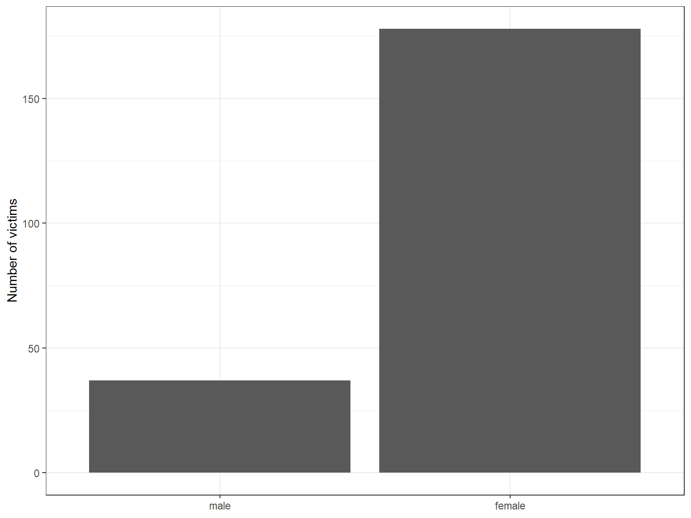

## Let's investigate the age distributions
Firstly, only those of the females and secondly all victims. The dashed blue line indicates the median age, the solid blue line indicates the mean. The graph shows a frequency distribution. 


```r
shipman_murders
```

```
## # A tibble: 215 × 12
##    dateofdeath name             age placeofdeath decision     yearofdeath gender
##    <chr>       <chr>          <dbl> <chr>        <chr>              <dbl>  <dbl>
##  1 17-Mar-75   evalyons          70 Own home     Unlawful ki…        1975      0
##  2 07-Aug-78   sarahhannahma…    86 Own home     Unlawful ki…        1978      0
##  3 30-Aug-78   maryellenjord…    73 Own home     Unlawful ki…        1978      0
##  4 07-Dec-78   haroldbramwell    73 Own home     Unlawful ki…        1978      1
##  5 20-Dec-78   anniecampbell     88 Own home     Unlawful ki…        1978      0
##  6 10-Aug-79   alicemaudegor…    76 Own home     Unlawful ki…        1979      0
##  7 28-Nov-79   jackleslieshe…    77 Hospital     Unlawful ki…        1979      1
##  8 18-Apr-81   mayslater         84 Own home     Unlawful ki…        1981      0
##  9 26-Aug-81   elizabethashw…    81 Own home     Unlawful ki…        1981      0
## 10 04-Jan-83   percyward         90 Own home     Unlawful ki…        1983      1
## # … with 205 more rows, and 5 more variables: fractionaldeathyear <dbl>,
## #   agebracket <chr>, gender2 <chr>, names <chr>, gender_recoded <fct>
```

```r
age_descriptors <- shipman_murders %>%
  group_by(gender_recoded) %>%
  dplyr::select(age, gender_recoded) %>%
  summarise(mean_age = mean(age),
            median_age = median(age),
            sd_age = sd(age))

age_descriptors
```

```
## # A tibble: 2 × 4
##   gender_recoded mean_age median_age sd_age
##   <fct>             <dbl>      <dbl>  <dbl>
## 1 female             76.0         77   9.15
## 2 male               77.2         80  11.7
```

```r
shipman_murders %>%
  dplyr::filter(gender_recoded == "female") %>%
  ggplot(aes(x = age)) +
#  geom_freqpoly(colour = "darkred", size = 1.5) +
  geom_histogram(alpha = 0.5, fill = "black", colour = "darkgreen") +
  geom_vline(aes(xintercept = age_descriptors$median_age[1]), 
             linetype = "dashed", 
             colour = "red", 
             size = 1) +
  geom_vline(aes(xintercept = age_descriptors$mean_age[1]), 
             linetype = "solid", 
             colour = "red", 
             size = 1) +
  theme_bw() +
  ggtitle("Age distributions in females, \n dashed line is the median, solid line the mean age")
```


## Distribution for both genders
Here we include the males into the distribution analysis. We use a frequency distribution represented by a line in stead of a histogram for easier comparison. Red vertical lines are mean (solid) and median (dashed) for the females, blue vertical lines for the males.

```r
shipman_murders %>%
#  dplyr::filter(gender_recoded == "female") %>%
  ggplot(aes(x = age, y = ..scaled..)) +
#  geom_freqpoly(colour = "darkred", size = 1.5) +
  geom_density(aes(colour = gender_recoded)) +
  geom_vline(aes(xintercept = age_descriptors$median_age[1]), 
             linetype = "dashed", 
             colour = "red", 
             size = 1) +
  geom_vline(aes(xintercept = age_descriptors$mean_age[1]), 
             linetype = "solid", 
             colour = "red", 
             size = 1) +
  geom_vline(aes(xintercept = age_descriptors$median_age[2]), 
             linetype = "dashed", 
             colour = "blue", 
             size = 1) +
  geom_vline(aes(xintercept = age_descriptors$mean_age[2]), 
             linetype = "solid", 
             colour = "blue", 
             size = 1) +
  theme_bw()
```

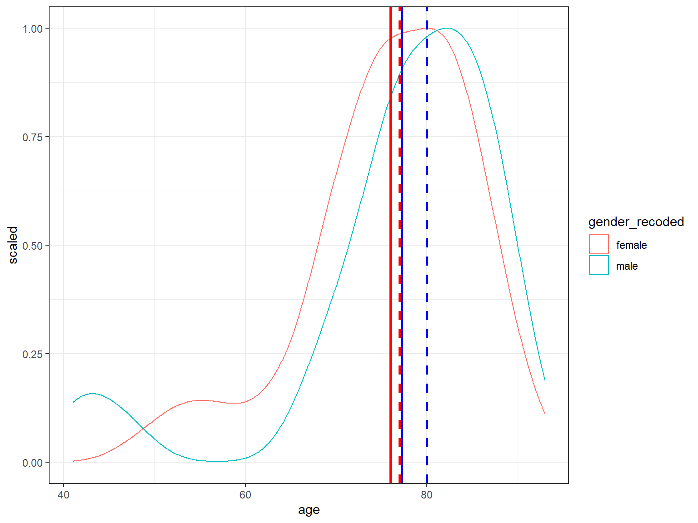

## Boxplots
Another, more condensed and maybe clearer represnetation of the data in the figure above is a box plot showing both genders:


```r
shipman_murders %>%
  ggplot(aes(y = age, x = gender_recoded)) +
  geom_boxplot(aes(group = gender_recoded, colour = gender_recoded)) +
  xlab(NULL) +
  theme_bw()
```

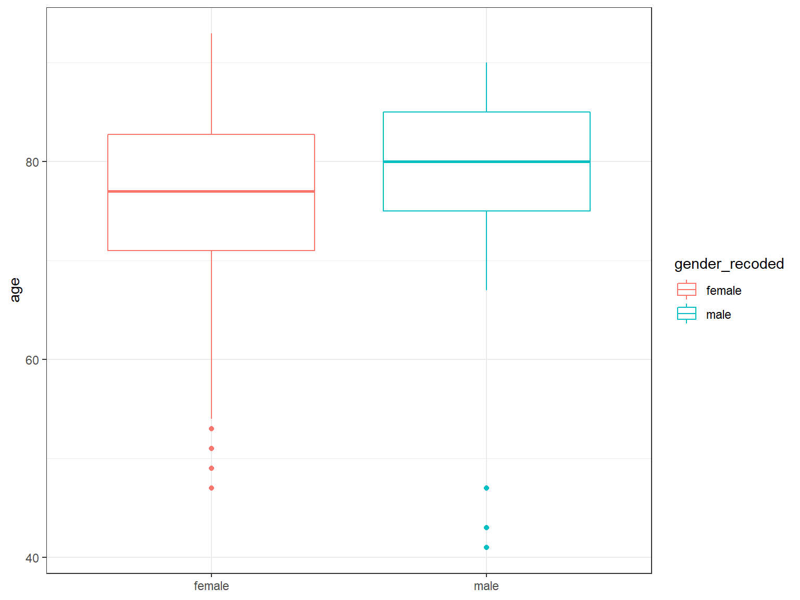

## Date of death
One question that might come to mind is when did Shipman murder all those people and is there a relationship between the age of the victim, the gender and the date on which they died. The last figure of this case example can also be found in [@spiegelhalter2019] and is the culminative graph that sums it all.

Below is a reproduction of figure 0.1 from [@spiegelhalter2019], based on the code for this graph on the accompanying github repo to the book, mentioned above.


```r
plot <- shipman_murders %>%
ggplot(aes(
  x = fractionaldeathyear,
  y = age,
  colour = reorder(gender2, gender)
  )) +      
  geom_point(size = 2) +
  labs(x = "Year", y = "Age of victim") +
  scale_x_continuous(breaks = seq(1975, 1995, 5),
    limits = c(1974, 1998)) +
  scale_y_continuous(breaks = seq(40, 90, 10), limits = c(39, 95)) +
  scale_size_continuous(name = "Size", guide = FALSE) +
  scale_colour_brewer(palette = "Set1")  + 
  theme_bw() +
  theme(
    legend.position = c(0.125, 1.12),
    legend.background = element_rect(colour = "black"),
    legend.title = element_blank()
  ) 

  ggMarginal(plot, type="histogram")
```

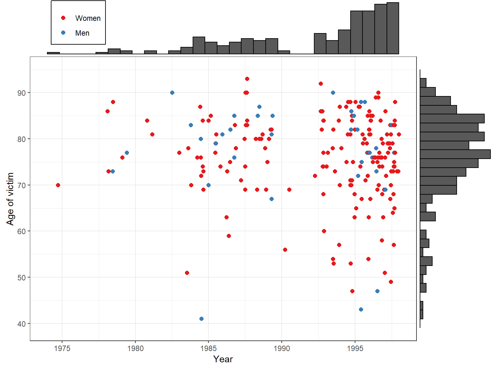

Can you spot something peculiar in the histogram for the `Year` variable?

<!--chapter:end:ch05-edacase.Rmd-->

# Lab 1A; Introduction to RStudio {#lab1aintrorstudio}


## Packages

```r
library(tidyverse)
```

```
## ── Attaching packages ─────────────────────────────────────── tidyverse 1.3.1 ──
```

```
## ✓ ggplot2 3.3.5     ✓ purrr   0.3.4
## ✓ tibble  3.1.4     ✓ dplyr   1.0.7
## ✓ tidyr   1.1.3     ✓ stringr 1.4.0
## ✓ readr   2.0.1     ✓ forcats 0.5.1
```

```
## ── Conflicts ────────────────────────────────────────── tidyverse_conflicts() ──
## x dplyr::filter() masks stats::filter()
## x dplyr::lag()    masks stats::lag()
```


## RStudio IDE
RStudio is an Integrated Development Environment that helps you be more productive with R. To use RStudio you need to first install R itself:

The lastest version of R can be installed from the Comprehensive R Archive Network `CRAN`: 

https://cran.r-project.org/

## Tutorials
Several good tutorials on starting with RStudio:

 - https://www.sitepoint.com/introduction-r-rstudio/\

## Preview releases (daily builds)
For the brave and impatient:
RStudio releases its daily builds (test versions) on:

https://www.rstudio.com/products/rstudio/download/preview/

Here you can review the latest changes and improvements of the IDE.

## Cheatsheets:
Cheatsheets are short comprehensive overviews of an application or package. They are a handy reference resource.
This link will download the pdf of the RStudio cheatsheet:
https://github.com/rstudio/cheatsheets/raw/master/rstudio-ide.pdf

More cheatsheets that can of help to complement the contents of the course:

[cheatsheets](https://www.rstudio.com/resources/cheatsheets/)


## RStudio IDE
Below we will show you a few tricks to be more productive with the RStudio IDE sofware. Figure \@ref(fig:rstudiointerface) shows the RStudio Interface on my computer while writing this website. The four windows that we use to work interactively with R are indicated by the big yellow numbers 1 to 4.


```r
 knitr::include_graphics(path = here::here("images", "rstudio_interface.png"))
```

<div class="figure">

<p class="caption">(\#fig:rstudiointerface)The RStudio IDE interface. You can see the four windows here. They are explained below</p>
</div>


## The RStudio IDE Windows. 

 1. The **Script Editor Window**. If you use the default settings you will see this window appear in position 1 (figure \@ref(fig:rstudiointerface)) Here you can view the contents of files, and open and edit new script files. If no script editor is visible, but you only see something like below:
 
```
 R version 3.6.1 (2019-07-05) -- "Action of the Toes"
 Copyright (C) 2019 The R Foundation for Statistical Computing
 Platform: x86_64-w64-mingw32/x64 (64-bit)

 R is free software and comes with ABSOLUTELY NO WARRANTY.
 You are welcome to redistribute it under certain conditions.
 Type 'license()' or 'licence()' for distribution details.

 R is a collaborative project with many contributors.
 Type 'contributors()' for more information and
 'citation()' on how to cite R or R packages in publications.

 Type 'demo()' for some demos, 'help()' for on-line help, or
 'help.start()' for an HTML browser interface to help.
 Type 'q()' to quit R.

``` 
 
### <mark>**EXERCISE 1; Opening new script files**</mark> {-}

 A) Try openening a new R-Script by clicking `File` -> `New File` -> `R Script`. The new file will open up in the top-left window.
 
 B) Paste the following R code in you script file
 

```r
beaver_telemetry <- datasets::beaver1 %>% 
        ggplot(aes(x = time, y = temp)) +
        geom_point(aes(colour = as_factor(activ))) +
        ggtitle("Body temperature of beavers")

beaver_telemetry
```

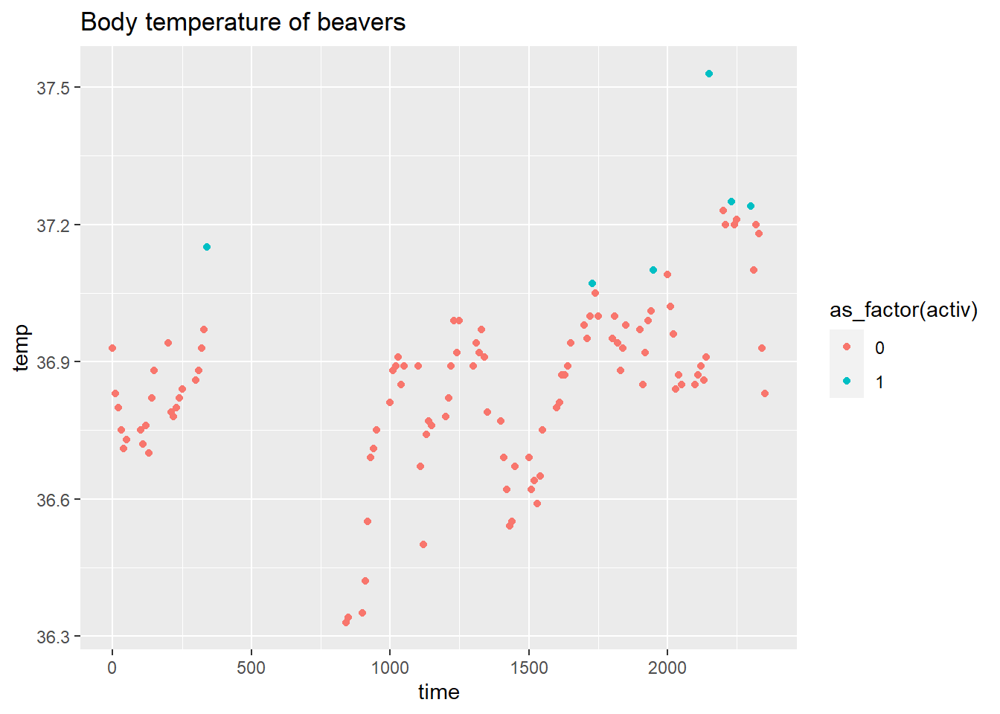
 
C) Save the script as "beavers.R" in the ./code folder
 
D) See what happens if you execute the following code. What do you thinks happended here? How can you use this in an analysis workflow? _Discuss with your neighbour_


```r
## clear environment
rm(list=ls())

## source R script
source(
  here::here(
    "code",
    "beavers.R"
  )
)
```
 
 1. The Next window is the **Development** window to the right (position 2 in figure \@ref(fig:rstudiointerface)) contains the `Environment` and other `Development` tabs (like `Git` and `Build`). This window will show all the named variables that are available in the _current_ RSession. Clicking the little broom-stick icon will clear the environment. Some of the other tabs in this window (e.g. `Build`), we will encounter in chapters \@ref(lab3bfunctions) and \@ref(lab7bdeveloprpackages).
 
 1. The third window is the **Navigation** window. This window shows the files on your local storage (a kind of File Explorer) and we will also access the help documentation from this window. Importantly, plots and interactive views will also appear in window 3 under the `Plots` and `Viewer` tabs, respectively.
 
 1. The fourth window is the **Terminals** window. Mostly we will use the `Console` to either directly give a command to R or view the output of a comand. The tab that is named `Terminal` is actually the `System` terminal. On the server this Terminal provides access to the operating system of the server (Ubuntu 18.04.5 LTS). In the Terminal you can inspect files directly by using the `head` command or execute other `Bash` commands. Having an R Console and a System Terminal available in one application makes RStudio execeptionally suitable for developing packages for R. An additional feature of this window is the `Jobs` pane. This enables you to run R-scripts as background jobs. This allows you to continue working on a script, while executing another script simultaneously, without crashing R or your computer (VM).  

### <mark>**EXERCISE 2; System terminal**</mark> {-}

To start a new `Terminal`: `Tools` -> `Terminal` -> `New Terminal`
A) Try it below and copy (Ctrl + C), paste (Shift + Insert) the following Bash code in your new `Terminal`

For example we can see the first lines of the file alijn.tsv by running the following code in the Linux Terminal:

```
head -30 data/allijn.tsv
```

## Global Settings 
To adapt the appearance of your editor, provide a LaTeX interpreter, or set a mirror for CRAN you go to `Tools` -> `Global Options`

To change the theme: `Tools` -> `Global Options` -> `Appearance` -> Choose an `Editor Theme` that is appealing to you. Dark background is most relaxing for your eyes.

Edit the setting that forces output to inline in RMarkdown documents under the `R Markdown` panel. Uncheck the "Show output in-line for all RMarkdown documents" -> Click `Apply`. 

## Restarting R 
If you are really stuck. If R hangs, restart R by: `Session` -> `Restart R`
If login into the RStudio Server fails, send me an email, I will reset your account for you

## Code style and reformat
Writing computer code needs to adhere to convention, in R specically for humans reading the code. R does not care about indentations or white lines or braces on the wrong line. But adhering to a style convention makes code easier for humans to consume. For more on code style for R: 

[tidyverse style guide](https://style.tidyverse.org/)

If your code looks like a mess: Select your code -> click `Code` and than `Reformat Code`, it will change 'youR' life
 1. If you find the inline output in Rmarkdown files (output will apear under the code chunk) as annoying as me: Click `Tools` -> `Global Options` -> select the `R Markdown` tab, than uncheck the checkbox for "Show output inline for all RMarkdown documents" 

## Shortcut keys
Shortcut keys are very handy, the prevent clicking and increase speed: you can access all by viewing `Tools` -> `Keyboard Shortcuts Help`, modify them with the `Modify Keyboard Shortcuts`

## New File
You can create new files under `File`. Choose from the list the file type that you want to create.

## R-scripts

 - R-script; used to run single actions, functions, cleaning, file-managment, a single graph or automated actions. 
 - Use `source("path_to_r_script") to call an individual script. 
 - Runs begin-to-end, can contain dependencies on other files
 - Exercises have to be made in RMarkdown during the course. 
 - It is a very flexible and multi-pupose format to combine code, text and code-output in one product
 - Suitable to generate different formats: MS Word, MS Power Point, HTML Slide shows, PDF, HTML documents, Websites, Blogs, Books
 - Able to include different types of code chunks: R, Python, Bash, Stan, Perl etc. Out of scope of this course

## The `stick-broom` icon 
You will find the `stick-broom` in other panes in RStudio as well, it clears the object in the `Plots` and the `Viewer` panes respectively.

## Reading data - RStudio help
To read data RStudio has an interactive help: 
Choose `File` -> `Import Dataset` -> `From Text (readr)` or the appropriate file type

 - Choose the file that you want to import under the `Browse` button
 - An interactive Console will appear, choose the right settings such as headers on/off, delimiter etc. 
 - Much like in the import function from Excel you will see a preview of the datatable.  - In the bottom right corner the appropriate R code is displayed. 
 - You can copy that code to the clipboard and paste it into a script.
 - Now execute the script and the datafile loads. 
 - If you want you can first adapt the variable name that is chosen to store the dataframe in


### <mark>**EXERCISE 3; Load data**</mark> {-}

A) Try to load the datafile "/data/kiemingen.xlsx" by the way described above.
Think about why you should copy - paste the R-code to a script o Rmd code chunk to load a file!?

B) Run the command `str(kiemingen)` in the console. What do think this command does and why is it relevant for data load?

### <mark>**EXERCISE 4; Appearance and general settings**</mark> {-}

A) Try adjusting the appearance of you RStudo so that it matches mine (I use the theme `Merbivore`)

B) Create an new .Rmd file. This file contains an example, using the MT cars dataset.
Type 

Click the Run drop-down and select `Run All` button and see what happens. Save this Rmd file as "my_first_rmd.rmd" in the ./code folder

C) In the `global options` unselect the option "Show output inline for all Rmd documents" in the Rmd panel.  

D) Click `Run All` again when you are in the "my_first_rmd.Rmd" file, do you see the difference? where does the output of the R code go now? 

## Git integration
RStudio comes with a build-in integration with Git. This enables collaboration, continuous integration of data-products such as Shiny apps and bookdown websites. Furthermore it increases reproducibility and tracebility of code and data-analysis.

Below we will go over an exercise to learn how to use this integration with Git.
Part of the material for this exercise was taken from:

[Happy Git & Github With R](https://happygitwithr.com/)

### <mark>**EXERCISE 5; Integration with Github.com**</mark> {-}

 1. Create an account on Github, if you did not already do so.
 1. Create a new repository called 'Perceptor', initialize this repo with a README file
 1. From this repository, create a new RStudio Project on the server
 1. Add the file "./code/my_first_rmd.rmd" to this project in the root
 1. Commit you changes in the `Git` panel of the `Development` window
 1. Push the commit to you remote repository on Github
 1. Look at the online (remote) version of the repo
 1. Now go back to the 'Perceptor' RStudio project
 1. Add the following code to your "my_first_rmd.Rmd" in a code chunk at the end.
 
 ```r
 beaver_telemetry <- datasets::beaver1 %>% 
        ggplot(aes(x = time, y = temp)) +
        geom_point(aes(colour = as_factor(activ))) +
        ggtitle("Body temperature of beavers")
 
 beaver_telemetry
 ```
 1. Click the `Knit` button
 1. Commit the changes by looking at the `Git` panel
 1. Puch your commit to yor remote repo
 1. Review the contents of your repo and discuss the changes with your neighbour

## Workflow
The RStudio --> Git --> Github workflow can be summarized in the following graph


```r
DiagrammeR::grViz("
digraph rmarkdown {
  'RStudio Project' -> 'Commit' 
  'RStudio Project' -> 'Local Git repo' 
  'Local Git repo' -> 'Remote Github repo'}")
```

## DiagrammaR
The `{DiagrammaR}` package is a great tool for drawing any type of diagram from within R. Drawing a diagram with code is a good idea because you do not have to wory about formatting and alignment and it let's you recycle parts of your diagram. As always, it will require some upfront investment of time to figure things out, but it will pay back in the end and is more fun than fussing over details in a diagram in PowerPoint.

```r
###
# Perform traversals with conditions
# based on node `label` regex matches
###

library(DiagrammeR)
library(magrittr)

# Create a graph with fruit, vegetables,
# and nuts
df <- data.frame(col1 = c("Cat", "Dog", "Bird"),
                 col2 = c("Feline", "Canis", "Avis"),
                 stringsAsFactors = FALSE)
uniquenodes <- unique(c(df$col1, df$col2))

uniquenodes

library(DiagrammeR)

nodes <- create_node_df(n=length(uniquenodes), 
                        type="number", 
                        label=uniquenodes)
edges <- create_edge_df(from=match(df$col1, uniquenodes), 
                        to=match(df$col2, uniquenodes), 
                        rel="related")
g <- create_graph(nodes_df=nodes, 
                  edges_df=edges)
render_graph(g)
```


<!--chapter:end:ch06-lab1aintrorstudio.Rmd-->

---
always_allow_html: true
---

# Lab 1B; Introduction to R {#lab1bintror}


## Packages for this chapter
For the materials in this chapter we need to load the tidyverse package suite. You will get a warning message stating something about masking of functions. I will explain this in Chapter \@ref(lab3wranglingfunctions) when we discuss writing our own functions in R. 


```r
library(tidyverse)
```

```
## ── Attaching packages ─────────────────────────────────────── tidyverse 1.3.1 ──
```

```
## ✓ ggplot2 3.3.5     ✓ purrr   0.3.4
## ✓ tibble  3.1.4     ✓ dplyr   1.0.7
## ✓ tidyr   1.1.3     ✓ stringr 1.4.0
## ✓ readr   2.0.1     ✓ forcats 0.5.1
```

```
## ── Conflicts ────────────────────────────────────────── tidyverse_conflicts() ──
## x dplyr::filter() masks stats::filter()
## x dplyr::lag()    masks stats::lag()
```

## Example data 

```r
set.seed(1234)
normals <- rnorm(n = 1000, mean = 5, sd = 1.3)
normals_2 <- rnorm(1000, mean = 1.5, sd = 0.2)

df <- tibble(A = normals,
             B = normals_2)

df
```

```
## # A tibble: 1,000 × 2
##        A     B
##    <dbl> <dbl>
##  1  3.43  1.26
##  2  5.36  1.56
##  3  6.41  1.19
##  4  1.95  1.63
##  5  5.56  1.64
##  6  5.66  1.12
##  7  4.25  1.69
##  8  4.29  1.46
##  9  4.27  1.37
## 10  3.84  1.59
## # … with 990 more rows
```

```r
## change number of observations to 10000 and rerun
```

### Plot histogram

```r
df %>% ## pipe `%>%` takes a value an puts it in a function
  ggplot(aes(x = A)) +
  geom_histogram(bins = 70, colour = "red", fill = "red") +
  geom_histogram(aes(x = B), fill = "green")
```

```
## `stat_bin()` using `bins = 30`. Pick better value with `binwidth`.
```

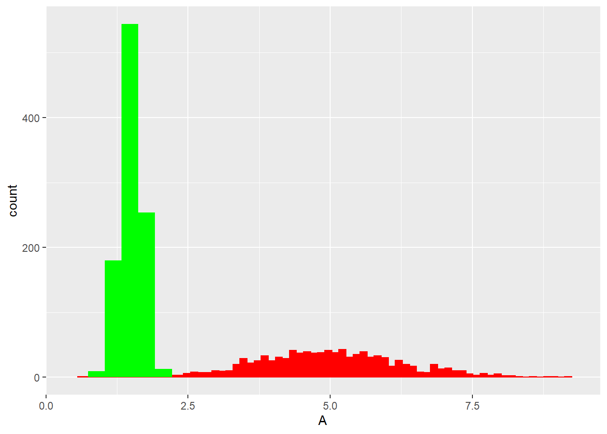

```r
## change the `bins` argument to see what happens
```

### **Discuss with your neighbour:**

 * How would you turn the above plot in a function that takes two arguments: `bins` and `df`?
 * Try it out using this backbone:
 
 ```
plot_histogram <- function(df, bins){

 ## write plot code here, use the example above
 
 plot <- df %>% ggplot(....)
 ...
 ...
 ...

 return(plot)

}
 
```

## General stuff about R

### R is case sensitive

*_Important note: R is case-sensitive, meaning that it will matter whether you use capital or lower case, keep this in mind if you get a cryptic warning or error!_*

### Programming (in R) can be frustrating

 * Writing (R) code can be challenging 
 * You will get mind-boggling errors. 
 * R is extremely picky about capitals and every opening `(`, `[` or `{` must be matched by a closing `)`, `]` or `}`. 

Mind that in R `.` is the default decimal placeholder!  

### The `{tidyverse}` suite of R packages
List of available CRAN packages 
http://cran.r-project.org/web/packages/available_packages_by_date.html

For this course we use the `{tidyverse}` a lot 


```r
# install.packages("tidyverse")
library(tidyverse)
```

### `{tidyverse}`
See: http://tidyverse.tidyverse.org/ for more info
The `{tidyverse}` package includes (among others):

 * Wrangling: `{dplyr}`, `{tidyr}` 
 * Reading data: `{readr}`, `{readxl}`
 * Functional prgramming: `{purrr}`
 * Models: `{broom}`
 * Strings and regular expressions: `{stringr}`
 * Factors: `{forcats}`
 * Time (series): `{lubridate}`

For all full list type `tidyverse_packages()` in the console, try it now!

### 'Biological' Packages
For 'Biological' application go to http://www.bioconductor.org

Installing Bioconductor packages is different from CRAN packages
example: `{affy}` 

Each Bioconductor package has a landing page:

https://www.bioconductor.org/packages/release/bioc/html/affy.html


```r
## installing `{affy}` package
BiocManager::install("affy")
biocLite("affy")

## loading affy package and the vignettes pages of this package
# library(affy)
# browseVignettes("affy")
```

### Vignettes {.build}

 * Vignettes are long explanations and demos of a package
 * A vignette contains examples and a workflow that shows how the package can be used and which (research) questions can be adressed with the functions and datasets in the package
 * It usually is a good place to start for examples
 * It also shows the so-called dependencies of a package
 * It explains which other packages you would need and how the data should look to be able to work with the package the vignette belongs to

### Getting Help examples

```r
#install.packages("dplyr")
library(dplyr)
library(ggplot2)
?dplyr
?ggplot2
?mean
?mean  # goes to the page with functions related to '.mean.'
apropos("mean") # search on more options of or alternatives for a certain function
formals(dplyr::filter)
```

### Examples and demos on functions and packages

```r
example(mean) # to see a worked example
demo(graphics) # demonstration of R functions
```

 * If you're stuck, try the help (`?` or `??` or `help()`) function. 
 * You can get help about any R function by running `?function_name` and `?package_name` 
 * or `??package_name`, skip down to the examples and look for code that matches what you're trying to do.
 * Another great tool is `Google` or `Stack Overflow`: trying googling the error message, as it's likely someone else has had the same problem, and has gotten help online.

## Using functions

### Function arguments
When calling a function you can explicitly `name` an argument by using `=`

```r
seed <- c(1:4)
set.seed(seed = seed) 
q <- rnorm(n = 10000, mean = 20, sd = 2)
hist(q)
```

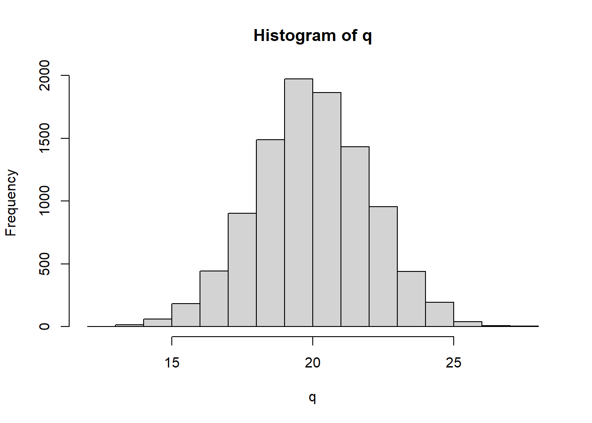

If you ommit naming an argument, the function still works, but the code is harder to read for a human.

```r
set.seed(seed)
qq <- rnorm(10000, 20, 2)
all(q == qq)
```

```
## [1] TRUE
```

__**Write code for humans AND computers, be explicit!**__

### R is a functional programming language
Functional programming is basically programming by the use of functions. Many of the functions you will use are pre-exisiting and present either in the base R installation (R-base) or in add-ons called `packages` in R-lingo.

Every operation in R is a `function call` with which you execute a function on zero or more arguments. As an example we look at the build-in function in R-base called `mean()`. When we want to learn more about this function and how to use it, we can use the `help()` function or the `?` which is a short-cut for the `help()` function. Let's call `help()` on the `mean()` function.

```
help(mean)
```

Running the above code will yield the following information in the `Help` pane of the **Navigation** window.


```
## _A_r_i_t_h_m_e_t_i_c _M_e_a_n
## 
## _D_e_s_c_r_i_p_t_i_o_n:
## 
##      Generic function for the (trimmed) arithmetic mean.
## 
## _U_s_a_g_e:
## 
##      mean(x, ...)
##      
##      ## Default S3 method:
##      mean(x, trim = 0, na.rm = FALSE, ...)
##      
## _A_r_g_u_m_e_n_t_s:
## 
##        x: An R object.  Currently there are methods for numeric/logical
##           vectors and date, date-time and time interval objects.
##           Complex vectors are allowed for 'trim = 0', only.
## 
##     trim: the fraction (0 to 0.5) of observations to be trimmed from
##           each end of 'x' before the mean is computed.  Values of trim
##           outside that range are taken as the nearest endpoint.
## 
##    na.rm: a logical value indicating whether 'NA' values should be
##           stripped before the computation proceeds.
## 
##      ...: further arguments passed to or from other methods.
## 
## _V_a_l_u_e:
## 
##      If 'trim' is zero (the default), the arithmetic mean of the values
##      in 'x' is computed, as a numeric or complex vector of length one.
##      If 'x' is not logical (coerced to numeric), numeric (including
##      integer) or complex, 'NA_real_' is returned, with a warning.
## 
##      If 'trim' is non-zero, a symmetrically trimmed mean is computed
##      with a fraction of 'trim' observations deleted from each end
##      before the mean is computed.
## 
## _R_e_f_e_r_e_n_c_e_s:
## 
##      Becker, R. A., Chambers, J. M. and Wilks, A. R. (1988) _The New S
##      Language_.  Wadsworth & Brooks/Cole.
## 
## _S_e_e _A_l_s_o:
## 
##      'weighted.mean', 'mean.POSIXct', 'colMeans' for row and column
##      means.
## 
## _E_x_a_m_p_l_e_s:
## 
##      x <- c(0:10, 50)
##      xm <- mean(x)
##      c(xm, mean(x, trim = 0.10))
## 
```

If we want to know what the arguments are that can be entered into the function mean we can review the information in the "Arguments" paragraph. Looking at this part of the help documentation we see that `mean()` takes 3 named arguments and an argument called `...` which we explain in more details in Chapter \@ref(wranglingfunctions). The named arguments that can be entered into `mean()` are:

 `x`
 `trim` and
 `na.rm`
 
Let's look at them in detail. 

 The description for `x` states that `x` is defined as an R object. Clearly we do not yet know what kind of R object there are bu from the description of `x` can make out a few examples: `x` can be a numeric, a logical, a date, a date-time or time interval object. Later in this chapter these objects are explained in more detail, but it is rather intuitive that mean at least can take an object consisting of numbers. Below we create an object x, containing 10 random numbers that are sampled from a normal distribution (using a function call to `rnorm()`). 
 

```r
set.seed(123)
x <- rnorm(n = 10)
x
```

```
##  [1] -0.56047565 -0.23017749  1.55870831  0.07050839  0.12928774  1.71506499
##  [7]  0.46091621 -1.26506123 -0.68685285 -0.44566197
```
 
If we want to apply mean to this vector `x` of 10 numbers we can do so by calling `mean()` on `x` 

```r
mean(x)
```

```
## [1] 0.07462564
```

When we look at the second and third argument we can deduce that the second argument `trim` takes any value between 0 and 0.5 and that this argument defines a truncation of the vector `x`, before the mean is calculated. Here, I show what trim = 0.2 does to our average of `x`
The trimmed mean is calculated on an **ordered** (from smallest to largest value) vector `x`  


```r
mean(x, trim = 0.1)
```

```
## [1] 0.03703159
```

Let's simulate what trim does to really understand what is going on:

```r
## an ordered version of x
x_ordered <- x[order(x)]

## trim = 0.1 means 1 observation of 10 from each side so 2 in total. details on what trim exactly does, see below 
mean(x_ordered[2:9]) 
```

```
## [1] 0.03703159
```
Mind that we use `[2:9]` as the syntax to get the 2nd to the 9th element of `x`. We will use this syntax frequently.

The last argument of `mean()` is `na.rm`. If we look at the descrition we can learn that this argument has something to do with misisng values (`NA`) being present in a vector and how the `mean()` function will deal with them.
Below two NA values are added to our vector x at position 3 and 6.


```r
x[c(3,6)] = NA
x
```

```
##  [1] -0.56047565 -0.23017749          NA  0.07050839  0.12928774          NA
##  [7]  0.46091621 -1.26506123 -0.68685285 -0.44566197
```

What happens if we apply `mean()` to our new `x` containing two `NA` values.


```r
mean(x)
```

```
## [1] NA
```

The answer of R is `NA` which seems cryptic but if we think about it: what is the mean of 8 numbers and two missing values. I don't know, because I don't know how to calculate the mean of missing values. R does not either and it let's us know by saying `NA`. It does not know how to handle the `NA` values. By setting the `na.rm` option to `TRUE`, the mean function first removes the `NA` values, before computing the average.


```r
mean(x, na.rm = TRUE)
```

```
## [1] -0.3159396
```

Finaly, looking at the help documentation. At the bottom the examples are usually displayed. Here you can see a demo on how to use a function.

The examples for the `mean()` function can easily be copied-and-pasted for your own use. You will normally look at the examples first, before diving into the rest of the documentation.


```r
# Examples from the documentation for the mean() function:

x <- c(0:10, 50)
xm <- mean(x)
c(xm, mean(x, trim = 0.10))
```

```
## [1] 8.75 5.50
```

Now that we know how to get help for an R function and how to read the help documentation, it is time to explore R further.

From the above example we learnt that knowing the type and class of a dota object is important for using a function on that data object. Therefore, below we will review some of the the most important data objects and how they are interrelated. It is important to generally know about the different data typres and classes. It will save, but not completely prevent you from making common mistakes and errors in R

## R objects
R is also an object oriented language. This means that data-structures are stored in objects. Objects have a `class` and can consist of one (or in some classes) more data `types`. Below I will review different object classes and types. The use of class and type can be confusing. Relevant for scripting is that you understand the basic differences between different objects.

R objects can be devided in basically two categories:

1. Atomic vectors
1. Lists

In Chapter \@ref(lab1aintror) we will mainly look at atomic vectors. In chapter \@ref(lab1brecursivevectors) we will examine lists and dataframes. 

The diagram below also shows us `NULL` which technically is not a vector, but is an atomic value, usually used as 'zero-length' vector. 

```r
DiagrammeR::grViz("
digraph rmarkdown {
  'Atomic' -> 'Vector'
  'List' -> 'Vector' 
  'NULL'
}
", engine = "circo")
```

<div class="figure">

```{=html}
<div id="htmlwidget-b85bf888dc62471906a9" style="width:672px;height:480px;" class="grViz html-widget"></div>
<script type="application/json" data-for="htmlwidget-b85bf888dc62471906a9">{"x":{"diagram":"\ndigraph rmarkdown {\n  \"Atomic\" -> \"Vector\"\n  \"List\" -> \"Vector\" \n  \"NULL\"\n}\n","config":{"engine":"circo","options":null}},"evals":[],"jsHooks":[]}</script>
```

<p class="caption">(\#fig:unnamed-chunk-20)Elementary building blocks in R</p>
</div>

`Atomic vectors` and `Lists` can be subdevided and I will explain below the most important R objects. The graph below shows the main object categories, classes and their types. Lists in R are sometimes  collectively called `Recursive vectors` because they are build from (multiple) atomic vectors.

Below we see the two categories `Atomic` and `Recursive` vectors subdived.

```r
DiagrammeR::grViz("
digraph rmarkdown {
  'Atomic vectors' -> 'Numeric \n (including `Inf`, `-Inf` \n and `NaN`)'
  'NULL'
  'Atomic vectors' -> 'Logical \n (including NA)' 
  'Atomic vectors' -> Character
  'Numeric \n (including `Inf`, `-Inf` \n and `NaN`)' -> Integer
  'Numeric \n (including `Inf`, `-Inf` \n and `NaN`)' -> Double
  'Recursive vectors' -> List
  'List' -> Dataframe
  'Dataframe' -> Tibble 
  'Date' -> 'Double'
  'Date-Time' -> 'Double'
  'Factor' -> 'Integer'
}
", engine = "circo")
```

<div class="figure">

```{=html}
<div id="htmlwidget-88fdd2a34d502a66744b" style="width:672px;height:480px;" class="grViz html-widget"></div>
<script type="application/json" data-for="htmlwidget-88fdd2a34d502a66744b">{"x":{"diagram":"\ndigraph rmarkdown {\n  \"Atomic vectors\" -> \"Numeric \n (including `Inf`, `-Inf` \n and `NaN`)\"\n  \"NULL\"\n  \"Atomic vectors\" -> \"Logical \n (including NA)\" \n  \"Atomic vectors\" -> Character\n  \"Numeric \n (including `Inf`, `-Inf` \n and `NaN`)\" -> Integer\n  \"Numeric \n (including `Inf`, `-Inf` \n and `NaN`)\" -> Double\n  \"Recursive vectors\" -> List\n  \"List\" -> Dataframe\n  \"Dataframe\" -> Tibble \n  \"Date\" -> \"Double\"\n  \"Date-Time\" -> \"Double\"\n  \"Factor\" -> \"Integer\"\n}\n","config":{"engine":"circo","options":null}},"evals":[],"jsHooks":[]}</script>
```

<p class="caption">(\#fig:unnamed-chunk-21)All important R objects in one graph</p>
</div>

Stricking is that a `dataframe` in R is special list. Where R-lists can contain different types of vectors of different lenghts, dataframes can contain different types of vectors with **the same** length; A dataframe is alway rectangular. `Tibble` is just a special dataframe with nice printing options. Matrices and arrays are build on top of atomic vectors. We will later see how this works. Dates, Date-Time and Factors are S3 vectors; a special class of R-objects and named 'S3' for historical reasons.

### Data Types
The most simple objects in R are single values. They can be of different class and type. Single objects are commonly vectors of length 1, consisting of one class and holding one type of data. 

Values can be of class:

 1. Numeric (can be of type "double" or of type "integer")
 1. Integer (is of type "integer")
 1. Logical (is of type "logical")
 1. Date and Date-Time (a special class "POSIXct" "POSIXt" in which dates and date-time information can be stored in R). Working with dates in R can be a pain!
1. Special values are: `NaN` (not a number, but of type 'numeric'), `NA` (R's indication for a missing value, of type 'logical'), `Inf` or `-Inf` (infinite and it's negative counterpart, of type 'numeric'), `NULL` (an empty vector/value, is an 'atomic') 

There are a number of functions that can be used to inspect an object to learn what the class and type is. Below you will see these functions in action. 

Below you will see the different classes of data objects represented by a single value, and there respective types.

### Numeric vector

```r
double_x <- 5.4 # using the `<-` assign function to create an numeric object
class(double_x) # the class = "nummeric"
```

```
## [1] "numeric"
```

```r
typeof(double_x) # the vector type
```

```
## [1] "double"
```

```r
is.numeric(double_x)
```

```
## [1] TRUE
```

### Integer vector

```r
integer_x <- 5L ## integer vector
class(integer_x)
```

```
## [1] "integer"
```

```r
typeof(integer_x)
```

```
## [1] "integer"
```

```r
is.numeric(integer_x)
```

```
## [1] TRUE
```

```r
is.double(integer_x)
```

```
## [1] FALSE
```

### Logical vector

```r
logical_x <- c(TRUE, FALSE, NA) ## logical vector
class(logical_x)
```

```
## [1] "logical"
```

```r
typeof(logical_x)
```

```
## [1] "logical"
```

```r
is.logical(logical_x)
```

```
## [1] TRUE
```

### Date and Date-Time

```r
date_x <- as.POSIXct("02-05-1990",  
                         ## date class
                         tz = "Europe/Amsterdam")
class(date_x)
```

```
## [1] "POSIXct" "POSIXt"
```

```r
typeof(date_x)
```

```
## [1] "double"
```

```r
is.atomic(date_x)
```

```
## [1] TRUE
```

```r
is.recursive(date_x)
```

```
## [1] FALSE
```

```r
date_time_x <- lubridate::dmy_hms("02-05-1990 22:13:00",  
                                  ## date-time class
                                  tz = "Europe/Amsterdam")
class(date_time_x)
```

```
## [1] "POSIXct" "POSIXt"
```

```r
typeof(date_time_x)
```

```
## [1] "double"
```

```r
is.recursive(date_time_x)
```

```
## [1] FALSE
```

### Character vector

```r
string_x <- "character" ## character vector
class(string_x)
```

```
## [1] "character"
```

```r
typeof(string_x)
```

```
## [1] "character"
```

```r
is.numeric(string_x)
```

```
## [1] FALSE
```

### Special values

```r
na_x <- NA ## missing value
class(na_x)
```

```
## [1] "logical"
```

```r
typeof(na_x)
```

```
## [1] "logical"
```

```r
is.vector(na_x)
```

```
## [1] TRUE
```

```r
null <- NULL ## empty value
class(null)
```

```
## [1] "NULL"
```

```r
is.atomic(null)
```

```
## [1] TRUE
```

```r
infinite <- Inf ## infinite number
class(infinite)
```

```
## [1] "numeric"
```

```r
minus_infinite <- -Inf ## minus infinite
not_a_number <- NaN ## not a number
```

### Factors
Factors are special R objects to store information on groups or vectors that contain predefined values. Below we look at an example from the `forcats` package. If a variable is categorical you should use a factor in R. Build on top of `factors` are `ordered factors` that are categorical variables with values that have a certain order. 

Let's assume we have a `month_of_the_year` variable in our data.

**CAN YOU SPOT THE TYPO?**

```r
months_var <- c("Dec", "Apr", "Jam", "Mar")
```

Using a character vector to record this variable has two problems:
There are twelve possible months. Nothing is preventing you from making a typing error. Sorting the variable is not useful.

```r
months_var
```

```
## [1] "Dec" "Apr" "Jam" "Mar"
```

```r
sort(months_var)
```

```
## [1] "Apr" "Dec" "Jam" "Mar"
```

You can solve these problems with a factor. To create a factor, start by creating a list of the valid levels:

```r
month_levels <- c(
  "Jan", "Feb", "Mar", "Apr", "May", "Jun", 
  "Jul", "Aug", "Sep", "Oct", "Nov", "Dec"
)
```
Now you can create a factor:

```r
months_var_valid <- factor(months_var, levels = month_levels)
months_var_valid
```

```
## [1] Dec  Apr  <NA> Mar 
## Levels: Jan Feb Mar Apr May Jun Jul Aug Sep Oct Nov Dec
```

```r
sort(months_var_valid)
```

```
## [1] Mar Apr Dec
## Levels: Jan Feb Mar Apr May Jun Jul Aug Sep Oct Nov Dec
```
And any values not in the set will be silently converted to NA:
You will learn more on factors in Chapter \@ref(factors)

## Manipulating vectors

### Coercion
If we combine values, a vector of length >1 is the result. At the same time there are rules for which type the final product vector will be when combining different types of vector (or values). This is called `coercion` when it happens _implicitely_ like when you use `c()`. We call is `casting` when it happens explicitely when you use a constructor-function like `as.numeric(x)` 

see: https://cran.r-project.org/web/packages/vctrs/vignettes/s3-vector.html and the `{vctrs}` package for more details. This is considered and advanced topic and will not be dealt with in details in this course.

We will see coercion happen as we examine different types of vectors and combining them below.

Combining values (or vectors) or `c`reating them from scratch can be achieved by using the `c()` function. Because combining vactors with `c()` can give suprising results, in Chapter \@ref(lab3wranglingfunctions) we will also learn about using the `vec_c()` function from the `{vctrs}` package for creating 'type-stable' functions. 

### Combining data types
What happens if we combine different types of data in one vector?

```r
vector <- c(1:10, NA, NA, NA,  3, "Python is great!", "R is greater!")
vector
```

```
##  [1] "1"                "2"                "3"                "4"               
##  [5] "5"                "6"                "7"                "8"               
##  [9] "9"                "10"               NA                 NA                
## [13] NA                 "3"                "Python is great!" "R is greater!"
```

```r
is.character(vector)
```

```
## [1] TRUE
```

### Counting missing values (`NA`)

```r
vector_with_true_NAs <- c(TRUE, NA, FALSE, NA, FALSE)

## how many NA
is.na(vector_with_true_NAs) 
```

```
## [1] FALSE  TRUE FALSE  TRUE FALSE
```

```r
sum(is.na(vector_with_true_NAs))
```

```
## [1] 2
```

### Mathematical operations

```r
## Error sum on character
sum(vector) 
```

```
## Error in sum(vector): invalid 'type' (character) of argument
```

You can add/subtract/devide or use other arithmetic functions on numeric vectors

```r
a <- c(1,3,5,7,9)
b <- c(2,4,6,8)

z1 <- a - b
```

```
## Warning in a - b: longer object length is not a multiple of shorter object
## length
```

```r
z1
```

```
## [1] -1 -1 -1 -1  7
```

```r
z2 <- b - a
```

```
## Warning in b - a: longer object length is not a multiple of shorter object
## length
```

```r
z2
```

```
## [1]  1  1  1  1 -7
```

```r
z3 <- a / b
```

```
## Warning in a/b: longer object length is not a multiple of shorter object length
```

```r
z3
```

```
## [1] 0.5000000 0.7500000 0.8333333 0.8750000 4.5000000
```


**DISCUSS** Mind the `Warning message: In a - b : longer object length is not a multiple of shorter object length`. Discuss with your neighbour what this means. Try experimenting with increasing or decreasing the number of elements in the vectors above. What does this warning say about how mathmatical operations work in R?  


```r
z4 <- sum(a)
z4
```

```
## [1] 25
```

```r
z5 <- max(a) - max(b)
z5
```

```
## [1] 1
```

### Make sequences

```r
repetitions <- rep("Luke", times = 10)
saber <- rep("Sword", length.out = 20)
jedi <- c(repetitions, saber) %>% rep(each = 3)
```

## Indices
An index for a vector indicats the position of the vectors element. Indices are much-used tools in each programming language. In R we use two different syntaxes for indices

 1. `[]` For indexing vector elements (this chapter)
 1. `[[]]` for indexing list-elements or dataframes (Chapter \@ref(lab1crecursivevectors))
 1. `[<rows>, <columns>]` for indexing dataframes (Chapter \@ref(lab1crecursivevectors))

Below, I show how to use the `[]` index on atomic vectors

We create a vector containing 100 random normals

```r
set.seed(123)
hundred <- rnorm(100)
## I use the head function to get the first few values
head(hundred)
```

```
## [1] -0.56047565 -0.23017749  1.55870831  0.07050839  0.12928774  1.71506499
```

To get the third and then the first ten elements of the `hundred` vector

```r
hundred[1]
```

```
## [1] -0.5604756
```

```r
hundred[c(1:10)]
```

```
##  [1] -0.56047565 -0.23017749  1.55870831  0.07050839  0.12928774  1.71506499
##  [7]  0.46091621 -1.26506123 -0.68685285 -0.44566197
```
So you see from this example: we can use a vector to index a vector. Let's elaborate on that.

To see what we created we can plot a density polynom (a sort of histogram displaying a line in stead of bars) using the `ggplot2()` package. We will use this plotting package extensively in this course. For now just try to follow what the result of the following code is, we will get into more details on plotting in Chapter \@ref(lab2viz). In order to work with `{ggplot2}` we need to transform the `hundred` vector into a dataframe. This is what the `enframe()` function does. The `%>%` (or the so-called pipe) symbol we saw before in Chapter \@ref(edacase) will be explained in detail in Chapter \@ref(lab2viz)


```r
hundred %>%
  enframe() %>%
  ggplot(aes(x = value)) +
  geom_density()
```

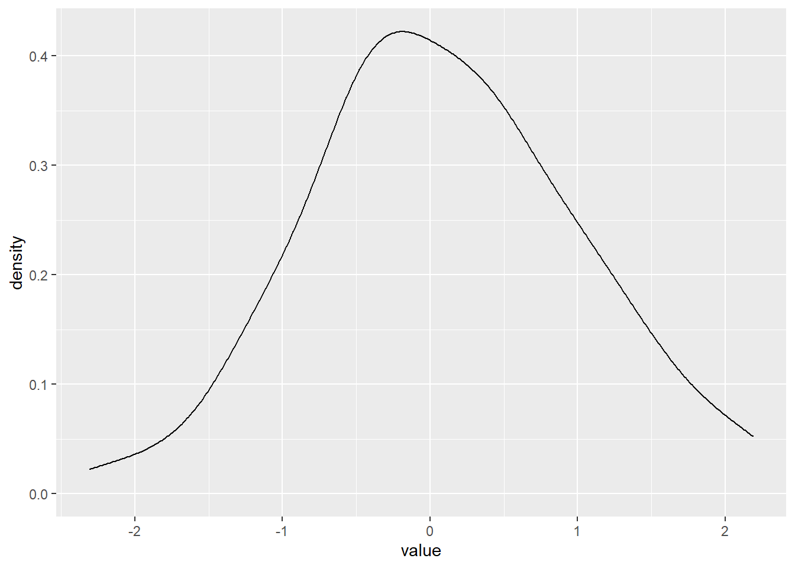

Imagine we want to pull out all numbers from the `hundred` vector that are larger than 0. To do this we can use the index. First we create a vector that has two types of values a `TRUE` at the position of the value in `hundred` that is larger than 0 and a `FALSE` at the positon of the value in `hundred` that is smaller than 0. Can you estimate how many values in `hundred` that are smaller than 0?


```r
logical_smaller_than_zero <- hundred > 0
logical_smaller_than_zero[c(1:10)]
```

```
##  [1] FALSE FALSE  TRUE  TRUE  TRUE  TRUE  TRUE FALSE FALSE FALSE
```

You see here that from the first ten values in `hundred` the 3rd, 4th, 5th, 6th and 7th value are larger than 0. The consecutiveness of this observation is pure coincidence.

Now we can use our logical index to get all values larger than 0 from the `hundred` vector


```r
larger_than_zero_values <- hundred[logical_smaller_than_zero]
## again we ask for the first ten elements of our new >0 vector
larger_than_zero_values[c(1:10)]
```

```
##  [1] 1.55870831 0.07050839 0.12928774 1.71506499 0.46091621 1.22408180
##  [7] 0.35981383 0.40077145 0.11068272 1.78691314
```

We indeed see that these 10 values are all larger than 0. How can we check that all values in `larger_than_zero_values` are larger than zero? By creating different plots. Making plots to check if your code did what you expected is always a good idea. _You can not make too many plots!_


```r
larger_than_zero_values %>%
  enframe() %>%
  ggplot(aes(x = value)) +
  geom_density()
```

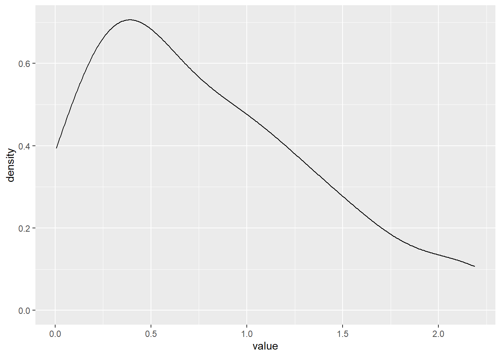

```r
## or a scatter
larger_than_zero_values %>%
  enframe() %>%
  ggplot(aes(x = value, y = name)) +
  geom_point()
```

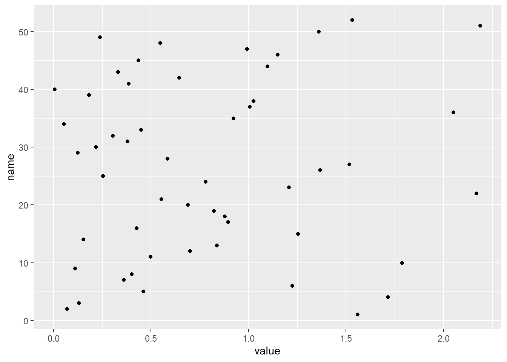

Indeed, no point is equal or smaller than zero.
There is one bordeline case. Can you spot it? **DISCUSS with your neighbour if you can locate it**

We can make it visible by a neat filtering trick: 

```r
df <- larger_than_zero_values %>%
  enframe() 
## the `name` variable is equal to the position of the >0 vector  
df %>%  ggplot(aes(x = value, y = name)) +
  geom_point() +
  ## we add an additional geom_point for the data filtered for name == 40
  geom_point(data = df %>% dplyr::filter(name == 40),
             aes(x = value, y = name),
             fill = "red", 
             size = 4, 
             shape = 21, 
             alpha = 0.6)
```

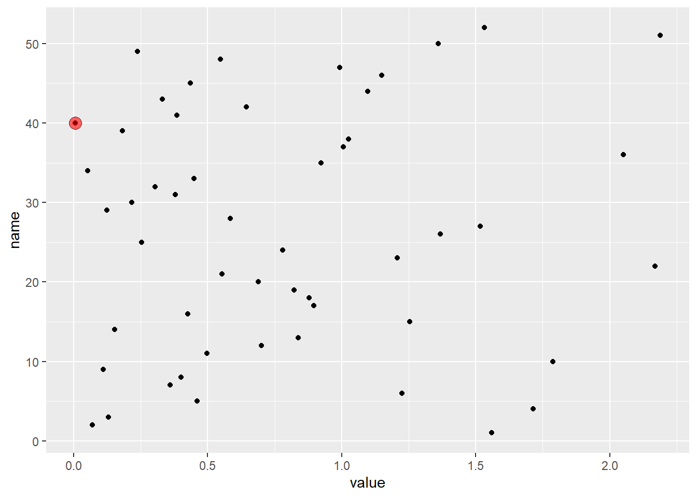

We can pull out this value from the >0 vector by it's position (40th element)  `larger_than_zero_values`

```r
## you see a value that is close to zero, but not equal to zero.
larger_than_zero_values[40]
```

```
## [1] 0.005764186
```

So you see, using the index can be valuable if you want to conditionally subset a vector or pull out specific elements by their position. You can also use the index to get opposite values (in this case lower than zero) or to remove elements from a vector. In the exercises below, I will let you practice with the index on vectors some more. This trick can also be used on dataframes and lists. I will show you how to do this in Chapter \@ref(lab1crecursivevectors). The diadvantage is that using indexes on dataframes can yiled R code that  become difficult to read. The `{tidyverse}` provides tools to make these operations easier to perform and code much easier to read. This will be illustrated in Chapter \@ref(lab3wranglingfunctions)

## EXERCISES {-}


### Packages {-}

```r
library(tidyverse)
```

### 1. Creating some vectors {-}

```r
set.seed(123)
vec_1 <- rnorm(10)
vec_2 <- as.integer(vec_1)
vec_3 <- c(rep(TRUE, 3), c(rep(FALSE, 4)), NA)
vec_4 <- as.numeric(vec_3)
vec_5 <- c("Marc", "Ronald", "Maarten")
```
 1. What does `set.seed(123)` do? Check the documentation!
 1. What does the above `as.integer()` function do? 
 1. And `as.numeric()`?
 1. Check the contents of `vec_2`, `vec_3` and `vec_4`
 1. Determine the `class()` of `vec_1` to `vec_5`
 1. What happens to the data type if we combine (using `c()` vec_1 en vec_2)? Why?
 1. What is the resulting datatype is we combine vec_4 and vec_5? Why?


### 2. R as a calculator {-}

R can be used as a "regular" calculator, we will practice this a bit, just to get familiar with the way R works and displays its information

 1. What is the sum of 3, 12 and 250?
 1. What is the difference between 4902 and 3987?
 1. Calculate 2 to the power of 24
 1. What is 240 divided by 14?
 1. What is the average of 12 and 20?
 1. What is the average of 10.8, 13.7 and 15.9?


### 3. Data types {-}
R has a variety of different data types and structures. Knowing how to work with them is fundamental to learning and using R. The following exercises give a basic introduction to creating and manipulating them.
Using the `c()` function here that `creates` vectors is essential.

 1. Create a vector (`vec_8`) consisting of the numbers 10.5, 20.4, 30.5, 28.9 and 5,4.
 1. Create a vector (`vec_9`) consisting of a decreasing sequence of integers from 50 to -10.
 1. Create a vector (`vec_10`) consisting of an increasing sequence of even integers from -10 to 50. You can use the `seq()` function here.
 1. Add the number 5 to the tail of `vec_10` , and save the result as a new vector (`vec_11`.
 1. Create a vector (`vec_12`) of five hundred alternating zeros and ones. Use the function `rep()` here.
 1. Create a vector (`vec_13`) of a hundred, uniformly distributed, random values between -1 and +1. (Hint: see the function `runif()` )
Use `set.seed(123)` to set the random number generator.
 1. Create a vector (`vec_14`) of hundred random normal distributed numbers with mean = 2 and standard deviation is 0.3. See `?rnorm()` for help.
 1. Create a histogram (use function `hist()`) of vectors `vec_13` and `vec_14`. Can you notice something striking?\
 1. Calculate the average of all values in `vec_14`. (Hint: see the function `mean()`. what did you expect to be the result? Why is the answer not _exactly_ equal to `2`  
 1. Now replace position 5 in vector `vec_14` with NA, use `vec_14[5]` in you call. Confirm your operation on this vector.
 1. Calculate the mean of `vec_14` again. (Hint: make sure you deal with the missing values!). Look at `?mean()` for the solution.


### 4. Vector indices {-}
In this chapter we saw how to use the `[]` on a vector.

 1. Pull out all values that round down to 1.0 in vector `vec_1` **HINT use `as.integer()` than create a logical index, then use the logical index to get to your answer**
 1.


### 5. The Matrix {-}

 1. Create a matrix (`matrix_1`) of four columns and three rows with increasing integers from 1 to 12, left to right and then top to bottom. Use the function `matrix()`. See the help first.
 1.	Create a matrix (`matrix_2`) of four columns and three rows, the first column only containing the value `1`, the second only `2`, the third only `3` and the fourth column only `4`.
 1.	Calculate the sum of `matrix_1`. (Hint: see the function `sum()`)


### 6. From vectors to tibbles {-}

 Create the following items:

 1. A numerical vector named `numbers` consisting of the following numbers: 1.8, 4.5, 10.1, 8.3.
 1. A numerical vector named `prime` consisting of the following integers: 1, 3, 5, 7 and 11
 1. A character vector named `crazy` consisting of the following values: 'abc1', 'foo2', 'bar3', 'app5' and 'yepp7'
 1. A logical vector named `valid`" consisting of: TRUE, FALSE, FALSE, TRUE and FALSE
 1. Try to create a list called `mylist` containing the vectors `numbers`, `prime`, ` crazy` and ` valid`. 
 1. Try to create a `tibble` named `mydata` with the function `tibble()` from the above four vectors. This will fail, why? .
 1. Fix the error you found by creating an extra `NA` value in one of the vectors. Create the dataframe. Also try giving the columns different names. (Hint: see the function `names()` and the function `tibble()`.
 1. What happens if you try to calculate the sum of `mydata`?
 1. When you look at the structure of the tibble using `str()`, you will see that the `crazy` column with the "abc1", "foo2", etc values has a certain data type. Which data type is "name"? Do you think it is the right type? Or do you need to change it? To what other type could you change it?


<!--chapter:end:ch07-lab1bintror.Rmd-->

# Lab 1C; Lists and dataframes {#lab1crecursivevectors}


## Packages

```r
library(tidyverse)
```

```
## ── Attaching packages ─────────────────────────────────────── tidyverse 1.3.1 ──
```

```
## ✓ ggplot2 3.3.5     ✓ purrr   0.3.4
## ✓ tibble  3.1.4     ✓ dplyr   1.0.7
## ✓ tidyr   1.1.3     ✓ stringr 1.4.0
## ✓ readr   2.0.1     ✓ forcats 0.5.1
```

```
## ── Conflicts ────────────────────────────────────────── tidyverse_conflicts() ──
## x dplyr::filter() masks stats::filter()
## x dplyr::lag()    masks stats::lag()
```

## Atomic vectors vs. recursive vectors
The R vectors above are so called `atomic vectors`. They are the 'atoms' of R, the building block of which all other objects can be build. The resulting constituated R objects that can be build from the 'atoms' are called `recursive vectors`. The molecules. With these atoms and molecules we can build really complex data objects.

## Recursive vectors
The recursive vectors are:

 * List
 * Dataframe: as special kind of list
 * Tibble: as special kind of dataframe

Below I will explain the difference

## The Dataframe
The dataframe is the most widely used data structure. If you use R for doing analysis of data, this is the datstructure that you will use the most, by far!

To understand the dataframe we can best look at a named-vector.
An object in R has a value and can have attibutes. One of the most convenient attributes is the name of each element in a vector, which is collectively called the `names` attribute


```r
named_vector_ages <- c("Sofie" = 38, "Marc" = 45, "Marie" = 1.5)
named_vector_ages
```

```
## Sofie  Marc Marie 
##  38.0  45.0   1.5
```

```r
names(named_vector_ages)
```

```
## [1] "Sofie" "Marc"  "Marie"
```

```r
attributes(named_vector_ages)
```

```
## $names
## [1] "Sofie" "Marc"  "Marie"
```

When we call the `attributes` function on our named vactor, we get the names ("Walter", "Marc") of each element of the vector.
Other attributes can be the class and the dimensions and any user-defined attributes.

**Remember "Tidy data!"**   

## Subsetting vectors
To subset vectors we can use the square brackets `[]` in R.
Some examples:

```r
numbers <- c(1:10)

## get the 1st 
numbers[1]
```

```
## [1] 1
```

```r
## get the 1st and 3rd element
numbers[c(1,3)]
```

```
## [1] 1 3
```

```r
## get the second element three times
numbers[c(2,2,2)] #or
```

```
## [1] 2 2 2
```

```r
numbers[rep(2, times = 3)]
```

```
## [1] 2 2 2
```

```r
## remove the 5th element
numbers[-5]
```

```
## [1]  1  2  3  4  6  7  8  9 10
```

```r
## you can go crazy - but expect the unexpected
numbers[c(1:3, c(1,2,(c(3))))]
```

```
## [1] 1 2 3 1 2 3
```


```r
## you can't mix positive and negative indices
numbers[c(-5,5)]
```

## The dataframe
Now that we understand the named vector we can expand this idea by creating several vectors with elements. These are then as the columns of the dataframe. One prerequisite of a `dataframe` is that all columns must have equal `length`. Individual columns of a datframe can have different data types. Remember that a vector can only contain one datatype. 

```r
## indivual vectors
age = c(24, 27, 19, 34)
sex = c("F","F","M", "M")
weight = c(64, 55, 80, 70)
given_names = c("Christa", "Suzan", "Matt", "John")

people_df <- data.frame(
  age,
  sex,
  weight,
  given_names
)

head(people_df)
```

```
##   age sex weight given_names
## 1  24   F     64     Christa
## 2  27   F     55       Suzan
## 3  19   M     80        Matt
## 4  34   M     70        John
```

## Or the 'tidyverse' way

```r
people_tbl <- tibble::tibble(
  age,
  sex,
  weight,
  given_names
)
people_tbl
```

```
## # A tibble: 4 × 4
##     age sex   weight given_names
##   <dbl> <chr>  <dbl> <chr>      
## 1    24 F         64 Christa    
## 2    27 F         55 Suzan      
## 3    19 M         80 Matt       
## 4    34 M         70 John
```

## Viewing the contents of a dataframe

```r
summary(people_df)
table(people_df)

## gives the content of the data frame
head(people_df) 			
names(people_df) 
str(people_df)

## gives the content of the variable "age" from the data frame
people_df$age 
tibble::glimpse(people_tbl)
```

## Using index on dataframes
Using the index "[]" on a dataframe is a bit tricky. The dataframe always consists of rows and columns. Indexing a dataframe goes like:

`dataframe[row number(s), column number(s)]`


```r
## first element of this vector
people_df$age[1] 	

## content of 2nd variable (column) 
people_df[,2]

## content of the 1st row
people_df[1,] 	  
                  # multiple indices
people_df[2:3, c(1,3)] # remember to use c (2nd and 3rd row, 1st and 3rd column)
```

## Lists

The dataframe and the list are the most widely used datastructures when considering experimental data. Where a dataframe is constricted to the columns having all equal length, the elements of a list can be of different length and type. This is what makes the list the most flexible and sometimes the most agonizing datastructure in R.
The elemements of a list can have names, or not. Below we create a list with named elements.

## Create a List

```r
lst <- list(
  first_names = c(male = "Fred", 
                  female = "Mary"), 
                  no.children = 3, 
                  child_ages=c(4,7,16),
  child_names = c("Suzy", 
                  "Marvin", 
                  "Jane"), 
  address = c("Pandamonium Alley 114, Chaosville"),
  marital_status = TRUE)

lst
```

```
## $first_names
##   male female 
## "Fred" "Mary" 
## 
## $no.children
## [1] 3
## 
## $child_ages
## [1]  4  7 16
## 
## $child_names
## [1] "Suzy"   "Marvin" "Jane"  
## 
## $address
## [1] "Pandamonium Alley 114, Chaosville"
## 
## $marital_status
## [1] TRUE
```

## Accessing items in a list

```r
# number of elements in the list
length(lst) 
```

```
## [1] 6
```

```r
lst[1] %>% class # 1st element of list as a list
```

```
## [1] "list"
```

```r
lst[[1]] # 1st element of List
```

```
##   male female 
## "Fred" "Mary"
```

```r
lst[[3]][2] # second item of third element
```

```
## [1] 7
```

```r
names(lst) # named elements in this list
```

```
## [1] "first_names"    "no.children"    "child_ages"     "child_names"   
## [5] "address"        "marital_status"
```

```r
lst$child_names # pull "named" elements from a list using 
```

```
## [1] "Suzy"   "Marvin" "Jane"
```

```r
lst$address
```

```
## [1] "Pandamonium Alley 114, Chaosville"
```

```r
#`$` operator
```

## `str()` also gives you the structure of a list

```r
str(lst) # display structure of lst
```

```
## List of 6
##  $ first_names   : Named chr [1:2] "Fred" "Mary"
##   ..- attr(*, "names")= chr [1:2] "male" "female"
##  $ no.children   : num 3
##  $ child_ages    : num [1:3] 4 7 16
##  $ child_names   : chr [1:3] "Suzy" "Marvin" "Jane"
##  $ address       : chr "Pandamonium Alley 114, Chaosville"
##  $ marital_status: logi TRUE
```
The new RStudio Interface also enables interactive exploration of R-objects (demo)

## Selecting single elements in a list
To select a single element from a variable in a list

```r
lst$child_ages[3] 
```

```
## [1] 16
```

```r
lst[[6]][2] # returns the value of the second element for your variable
```

```
## [1] NA
```

## Looping over lists

```r
purrr::map(lst, is.na)
```

```
## $first_names
##   male female 
##  FALSE  FALSE 
## 
## $no.children
## [1] FALSE
## 
## $child_ages
## [1] FALSE FALSE FALSE
## 
## $child_names
## [1] FALSE FALSE FALSE
## 
## $address
## [1] FALSE
## 
## $marital_status
## [1] FALSE
```

## The matrix
A matrix is a table with only numeric values. An array consists of multiple matices. Below we create a matrix. The difference between a matrix and a dataframe is that a matrix can only hold one type of data, whereas the columns of a dataframe can be of different types of data.

Here we create a numeric matrix of 100 random normals, with 20 rows and 5 columns.

```r
matrix_num <- matrix(data = rnorm(n = 100),
                 nrow = 20,
                 ncol = 5) %>%
  print()
```

```
##               [,1]       [,2]       [,3]         [,4]       [,5]
##  [1,] -2.387557465  1.3101628  0.3394374 -0.475234062  1.1269030
##  [2,] -0.452805227  1.2497113 -1.7236991 -0.091862290  0.7889249
##  [3,]  0.221471915 -0.9779482  0.9604854  1.075795905 -0.0249335
##  [4,]  0.590230319  0.2783864  1.1324359 -1.717947138  1.0481445
##  [5,] -0.879397823  2.8788849 -0.2046521 -0.145988520 -1.9275827
##  [6,]  1.233849694 -0.6950631  0.3247466 -1.768891459 -0.3788129
##  [7,]  0.248560796 -0.1505680  0.2674538  0.437837023 -1.2406324
##  [8,]  0.677715795  0.9506779  0.8919324 -0.319771706 -0.1438146
##  [9,]  1.282950254  1.8101678  1.8135971 -1.087062174 -1.1304569
## [10,]  0.979286431 -0.4473413 -1.5399865  0.592180054 -0.7764974
## [11,]  2.479159867 -0.1353098  0.1898111  0.419422083 -1.3429550
## [12,]  0.396765138 -0.9694851  1.7493291  1.408288472 -1.4745607
## [13,] -1.895056065  1.7218307  1.6879666 -0.546880951  0.7363822
## [14,]  0.521435125  0.1833163 -0.2966554  0.466398918  0.8653424
## [15,] -0.842299913 -0.1751098  3.1104149  0.479574448  1.1027841
## [16,] -0.019958356 -0.5645374  0.3881405  0.241722498  2.1744961
## [17,]  0.003515509 -0.3938497 -0.1274924  0.004172425 -0.1885039
## [18,] -1.159285323  0.7148780 -1.2265692  0.295342144 -1.0208781
## [19,] -0.066216361  0.6446373 -0.5544790  0.271078247 -0.3597509
## [20,] -0.236884676  1.0981041 -0.6663906 -0.236816785  0.2903730
```

You can put any valid R data type in a matrix, but remember, it can only hold one type of data: A matrix with CAPITALS

```r
matrix_chr <- matrix(data = (c(LETTERS, LETTERS)[1:30]),
                     nrow = 5,
                     ncol = 6) %>%
  print()
```

```
##      [,1] [,2] [,3] [,4] [,5] [,6]
## [1,] "A"  "F"  "K"  "P"  "U"  "Z" 
## [2,] "B"  "G"  "L"  "Q"  "V"  "A" 
## [3,] "C"  "H"  "M"  "R"  "W"  "B" 
## [4,] "D"  "I"  "N"  "S"  "X"  "C" 
## [5,] "E"  "J"  "O"  "T"  "Y"  "D"
```

A matrix with logicals

```r
matrix_lgl <- matrix(data = rep(c(TRUE, FALSE, TRUE), times = 20),
                     ncol = 5) %>%
  print()
```

```
##        [,1]  [,2]  [,3]  [,4]  [,5]
##  [1,]  TRUE  TRUE  TRUE  TRUE  TRUE
##  [2,] FALSE FALSE FALSE FALSE FALSE
##  [3,]  TRUE  TRUE  TRUE  TRUE  TRUE
##  [4,]  TRUE  TRUE  TRUE  TRUE  TRUE
##  [5,] FALSE FALSE FALSE FALSE FALSE
##  [6,]  TRUE  TRUE  TRUE  TRUE  TRUE
##  [7,]  TRUE  TRUE  TRUE  TRUE  TRUE
##  [8,] FALSE FALSE FALSE FALSE FALSE
##  [9,]  TRUE  TRUE  TRUE  TRUE  TRUE
## [10,]  TRUE  TRUE  TRUE  TRUE  TRUE
## [11,] FALSE FALSE FALSE FALSE FALSE
## [12,]  TRUE  TRUE  TRUE  TRUE  TRUE
```

A matrix is basically a vector, with attributes that contain it's dimensions

```r
matrix_num[1:10]
```

```
##  [1] -2.3875575 -0.4528052  0.2214719  0.5902303 -0.8793978  1.2338497
##  [7]  0.2485608  0.6777158  1.2829503  0.9792864
```

```r
attributes(matrix_num)
```

```
## $dim
## [1] 20  5
```

## Import data into R

```r
library(tidyverse)
path_to_gender_age_data <- here::here("data", "gender.txt")
gender_age <- read_delim(path_to_gender_age_data,
                         delim = "/")
```

```
## Rows: 17 Columns: 2
```

```
## ── Column specification ────────────────────────────────────────────────────────
## Delimiter: "/"
## chr (1): sex
## dbl (1): age
```

```
## 
## ℹ Use `spec()` to retrieve the full column specification for this data.
## ℹ Specify the column types or set `show_col_types = FALSE` to quiet this message.
```

## read_csv
CSV is a format of a data file that uses commas or semicolons as separators for the columns.


```r
library(readr)
skin <- read_csv(here::here("data", "skincolumns.csv")) 
```

```
## Rows: 15 Columns: 2
```

```
## ── Column specification ────────────────────────────────────────────────────────
## Delimiter: ","
## dbl (2): Genotype A, Genotype B
```

```
## 
## ℹ Use `spec()` to retrieve the full column specification for this data.
## ℹ Specify the column types or set `show_col_types = FALSE` to quiet this message.
```

```r
skin %>% head(3)
```

```
## # A tibble: 3 × 2
##   `Genotype A` `Genotype B`
##          <dbl>        <dbl>
## 1         54.9         30.5
## 2         48.8         24.8
## 3         50.8         24.2
```

## Inspecting the skin dataframe

```r
head(skin)	 # content of the data frame
dim(skin)
attributes(skin)
summary(skin)
## ?read_csv 	 # help on the function
```

## `skin` dataset contains an NA, some functions do not work with NAs:

```r
mean(skin$`Genotype A`)
```

```
## [1] 48.22066
```

```r
mean(skin$`Genotype B`)
```

```
## [1] NA
```

```r
# to remove the NA, take care: consider leaving NAs in and use arguments like na.rm = TRUE
skin_noNA <- na.omit(skin)
mean(skin_noNA$`Genotype B`)
```

```
## [1] 25.72858
```

## Let's clean up the workspace

```r
rm(list=ls())
root <- find_root_file(criterion = is_rstudio_project)
## Note: never use this in code that is meant for others!!!
```

*_The above is an effective way to clear all the items in the Global Environment, but is is not very friendly to use this in code you share with others: can you think of why?_*

## Number notations and rounding

## Scientific notations 

```r
big_numbers <- rnorm(10, mean = 10000000, sd = 2000000)
big_numbers %>% formatC(format = "e", digits = 5)
```

```
##  [1] "1.23114e+07" "1.06826e+07" "1.00449e+07" "1.06656e+07" "1.00943e+07"
##  [6] "1.14829e+07" "8.00660e+06" "1.20127e+07" "7.85147e+06" "9.91910e+06"
```

```r
many_digits <- c(2.55858868688584848)
round(many_digits, digits = 3)
```

```
## [1] 2.559
```

```r
sqrt(many_digits * 1000 /200 * 2^6)  
```

```
## [1] 28.61378
```

## Rounding numbers

```r
small_numbers <- runif(10, min = 0.001, max = 0.1) %>% print()
```

```
##  [1] 0.05816803 0.03312216 0.07387187 0.05087759 0.02891918 0.07747913
##  [7] 0.04642592 0.04246959 0.05535060 0.08014896
```

```r
small_numbers %>% round(digits = 2)
```

```
##  [1] 0.06 0.03 0.07 0.05 0.03 0.08 0.05 0.04 0.06 0.08
```

## Generate R-code from this Rmd

```r
knitr::purl("hands_ons/part1_intro_to_rstudio_and_r.Rmd", output = "./hands_ons/part1_intro_to_rstudio_and_r.R")
```

## Statistics and R {.build}

 * Nowadays R is a versatile language and can be used for various applications, but it was originally designed as a language for performing statistical analyses 
 * This is why very many statistical applications are available for R
 * To start learning about statisics and R, I can highly recommend the book "Discovering Statistics Using R" by Dr. Andy Field:
 
https://uk.sagepub.com/en-gb/eur/discovering-statistics-using-r/book236067%20

## For more on learning R, start e.g. with:

http://www.statsteachr.org/ or

https://www.coursera.org/learn/statistical-inference/home/welcome or

https://www.youtube.com/watch?v=ACWuV16tdhY&index=21&list=PLqzoL9-eJTNBDdKgJgJzaQcY6OXmsXAHU and

https://www.youtube.com/watch?v=kvmSAXhX9Hs&index=29&list=PLqzoL9-eJTNBDdKgJgJzaQcY6OXmsXAHU 

and the rest of Mike Marin's lectures, that are also a really great way to start learning R.
Or try datacamp.com

## **EXERCISES** {-}

```r
options_exercises <- knitr::opts_chunk$set(echo = FALSE,
                                           warning = FALSE,
                                           error = FALSE,
                                           message = FALSE,
                                           results = 'hide',
                                           fig.show = 'hide')
```

## 1. Load example dataset {-}

```r
library(readr)
df <- read_csv(here::here(
"data",
"simple-IO.csv"
))
```
 A.  What are the dimensions of the `df` dataframe?
 A.  What are the column names of `df`?
 A.  What are the data types of the different columns of `df?`


## 2. Inspecting a dataframe {-}

 A.  How do we inspect `df`?
 A.  How many variables does `df` have?
 A.  How many rows?
 A.  Call `summary()` on `df`; In which variable do we observe the highest expression ratio?

## 3. Vector types {-}

 A.  Run the following code 
 A.  Inspect the class of each vector
 A.  Combine vctor a to zz in a list.
 A.  Inspect the contents of this list
 A.  Review the documentation for the `map()` function from the `{purrr}` package
 A.  Using map, find the length of each element in the list you created in this exercise


```r
a <- c("a", "b", "c", NA)
b <- c(1:4)
c <- c(6:8, NA)
d <- c(1.3, 1.6, 6.7)
e <- as.integer(d)
f <- as.integer(a)
g <- as.numeric(a)

(z <- paste(a, b, c))
(zz <- paste0(a, b, c))
```

## Matrices {-}

## 4. Creating a basic matrix {-}

During these exercises, we are going to work with a matrix of 8x10 that mostly contains (randomly generated) numerical values, interspersed with some missing values.

We do this in a number of steps.

A. Create a numerical vector named v using the runif() function consisting of 80 values between -10 and 10. Review the help function for the `runif()` function


B. Assign missing values randomly to this vector using the following R code:


C. How many missing values do you have?


D. Create a matrix named m from this numerical vector that has 8 rows. Check to make sure the dimensions are OK!

**TIP: use the function matrix() to create the matrix**


E. Assign row and column names

number the rows column_1:column_8 and the columns column_1:column_10
use the paste() function, set sep = "_"


## 5. Select statements {-}

The next couple of exercises will take you through some of the basics of selecting data within a matrix given some criteria. These basics will come back in more real life examples during the remainder of the course.

A. From row 4 select all values greater than 3. How many are there?

**TIP:** Subsetting in dataframe or matrix also works with

`df[rows, columns]`


B. What is the average of these numbers?


Did you account for missing values? What happens when you have missing values within your data? Probably not. These also get selected and also affect the outcome of certain functions.

C. Do the same, but now also exclude missing values. How many values did you select now?


## 6. Storing intermediate products as index {-}

Working with implicit logical vectors easily becomes daunting when the logics are more complicated. It is usually better to then first save this vector and then use this (or in combination with another logical vector).
This also avoids mistakes during typing and reuses your code (both of which are good design principles). We are going to create a subselection of the data from rows 1, 4 and 8. To do this, first set up a vector for the rows that selects row 1, 4 and 8 and name this row_ind. Do this twice, first using a numerical vector and than using a character vector.

A. Use this vector to create a new matrix that only contains these rows. Make sure you have a good look at the data structure to ensure you have selected the correct values.


B. For the second row in this new matrix, select all values between -2.5 and 4, excluding missing values. How many are there and what is the average?


## 7. Data frames {-}

A. Make a `data.frame` called `blood` of the table below.  

|subject   |treatment |weight |blood pressure |cholesterol |
|:---------|:---------|:------|:--------------|:-----------|
|human1    |control   |80     |80 / 120       |20          |
|human3 	 |control   |78 	  |78 / 115       |32          |
|human4 	 |50 ng/mg  |76 	  |90 / 125       |45          |
|human5 	 |50 ng/mg  |83 	  |92 / 120       |43          |
|human6 	 |50 ng/mg  |81 	  |87 / 119       |NA          |

B. Convert this `blood` `data.frame` to a tibble.

C. Create a tibble called `combined` from the individual vectors below.

```
nr <- c(1.8, 4.5, 10.1, 8.3, 7.5)
prime <- c(seq(1, 7, 2), 11)
valid <- c(TRUE, FALSE, FALSE, TRUE, FALSE)
name <- c("abc1", "foo2", "bar3", "app5", "bar1")
```


D) Get the values from the `prime` column. Use at least two different ways (there are three). Calculate the root-square of the sum of these values. Use a pipe operator `%>%`


The answer is ``5.1961524``


D. Select the second value of the `nr` column. Use at least two different ways (there are at least 4).


E. Calculate the sum of the `prime` column.


F. Combine the `nr` and `prime` columns (vectors) into a new vector.


## 8 Ordering {-}
The current data.frame has no particular ordering yet. In the next few exercises, we are going to reorder the data.frame based on a particular column. We can order a dataframe by variable by using the order() function

An example to order the mydata dataframe by name

```
mydata <- mydata[order(mydata$name), ]
mydata
```

This statement can be read as "order all variables (columns) of the dataframe by the rows of he variable 'name' in decreasing order". In this case name is a character vector, and order will order the variable according alphabetical order.

You can also order dataframes (or so-called tibbles) with dplyr. We will see how this works with the arrange() function later in the course.

Use this dataframe for the follwing exercises

id| nr   |name    |characters|valid
--|------|--------|----------|-------
1 | 1.8  |     1  |abc1      |TRUE
4 | 8.3  |     7  |app5      |TRUE
5 | 7.5  |     11 |bar1      |FALSE
3 | 10.1 |     5  |bar3      |FALSE
2 | 4.5  |     3  |foo2      |FALSE

A) Order the data.frame based on the `nr` column in increasing order.


B) Order the data.frame alphabetically using the `character` column.


C) Order the data.frame based on the `nr` column in decreasing order.


D) What happens if you use the `valid` column for ordering? Can you explain this?


<!--chapter:end:ch08-lab1crecursivevectors.Rmd-->

# Lab 2a: Visualize & Explore Data {#lab2aviz}


## Introduction
Creating plots is essential for EDA and formal inference or any data-analysis activities. There are a number of arbitrary stages in plot-making, not necessarily in any specific order or consecutiveness and also iterative in nature but these stages can help if you are just starting at it.
Here we talk about EDA and we discuss visualization as a means to generate hypotheses about the data. If information about the data (data-journal) is available, that will help! **So when you generate data: document!** In Chapter \@ref(lab7communicatereproduce) we will talk about this some more.

**The EDA visualization stages:** 

 1. `Characteristics`; Variable types, number of data points, patterns, grouping information etc. Usually this is done by creating plots showing all data available or a random sample if you have really a lot of data. Creating plots for missing values can be a good first step. A next step is creating scatter plots.
 1. `Distributions`; By looking at distributions you can generate hypothesis about the nature of sampling of the data, whether there are outliers, whether distriibutions are skewed or whether a transformation is feasible
 1. `Outliers`; No matter what you hear about removing outliers, never do it whitout solid understanding of your data and the reason why an outlier exists. Outliers can be discovered using box-plots, distribution plots or scatter plots (individual points)
 1. `Sorting`; There can be a logical hierarchy in the data when variables are sorted according others
 1. `Trends`; Trends sometimes require you to subset the data or generate summary data based on grouping variables. This means that part of the data is not visible anymore, but if performed well, it will also reveal new information. Removing data for the sake of summarizing and keeping data for the sake of completeness are in delicate balance. Again this is an interative process 
 1. `Models`; Once hypothesis are generated and patterns have been identified it is time to try some models on the data. Visualizing models and their paramters is part of checking model quality and fit to the data 
 1. `Formal`; Visualizations are usually included in scientific publications, reports, websites etc. The requirements for these are usually different and more formal, from the ones in the previous stages.

<div class="figure">

```{=html}
<div id="htmlwidget-78f7e361d0b7c887f976" style="width:576px;height:480px;" class="grViz html-widget"></div>
<script type="application/json" data-for="htmlwidget-78f7e361d0b7c887f976">{"x":{"diagram":"\ndigraph rmarkdown {\n  \"New DATA\" -> \"Characteristics\"\n  \"Characteristics\" -> \"Distributions\"\n  \"Distributions\" -> \"Outliers\" \n  \"Outliers\" -> \"Sorting\"\n  \"Sorting\" -> \"Trends\"\n  \"Trends\" -> \"Models\"\n  \"Models\" -> \"Formal\"\n  \"Formal\" -> \"Characteristics\"\n}\n","config":{"engine":"dot","options":null}},"evals":[],"jsHooks":[]}</script>
```

<p class="caption">(\#fig:unnamed-chunk-1)Visualizing stages for EDA</p>
</div>

We will demonstrate each stage below

## Prerequisites
We load the packages, the data and get everything ready for creating visualizations

### Packages {-}

```r
library(dslabs)
library(tidyverse)
library(reshape)
library(pastecs)
library(naniar)
library(GGally)
```

### Gapminder {-}
The gapminder dataset is a rich dataset containing data from the World Health Organization on socio-economic parameters worldwide and over time.

To see an animated interactive graph:
https://www.gapminder.org/tools/#$state$time$value=2018;;&chart-type=bubbles 

### Citations {-}
Developers of packages put a lot of effort in their package. If you are using packages for official publications, this is how you cite them in your work.

```r
citation(package = "ggplot2")
citation(package = "tidyverse")
citation(package = "dslabs")
```

### Data package {-}
This demo makes extensive use of the the Gapminder data. One of the packages containing this data is the `{dslabs}` package. It contains a number of other datasets which you can view these sets with

```r
data(package="dslabs") %>% print()
```

### ggplot2 {-}
For this demo on visualizations we will use the ggplot2 package. It was build with the grammar of graphics in mind. It is a versatile and much-used package. Much documentation can be found online and there are many extensions and other packages that build upon `{ggplot2}`. It is one of three plotting systems in R. The other two which we will hardly use in this course are `base` plotting and `{lattice}`.

The ggplot hexagon:


### The grammar of graphics {-}
This informal language is build on the principle that graphs can be commnicated trough a 'natural' language that describes aspects of a graphs in terms of layers, aestetics, geometric forms and attributes or so-called themes. This language has been translated to specific functions in the `{ggplot2}` package.

I will explain the grammar of graphics through a set of graphs, following the different stages of visualizations for EDA.

### Data wrangling scripts {-}
With these commands you can get an insight in how the different datasets were created. It is a nice example on how reproducibility can be implemented using R'packaging system.

```r
list.files(system.file("script", package = "dslabs"))
```

```
##  [1] "make-admissions.R"                   
##  [2] "make-brca.R"                         
##  [3] "make-brexit_polls.R"                 
##  [4] "make-death_prob.R"                   
##  [5] "make-divorce_margarine.R"            
##  [6] "make-gapminder-rdas.R"               
##  [7] "make-greenhouse_gases.R"             
##  [8] "make-historic_co2.R"                 
##  [9] "make-mnist_27.R"                     
## [10] "make-movielens.R"                    
## [11] "make-murders-rda.R"                  
## [12] "make-na_example-rda.R"               
## [13] "make-nyc_regents_scores.R"           
## [14] "make-olive.R"                        
## [15] "make-outlier_example.R"              
## [16] "make-polls_2008.R"                   
## [17] "make-polls_us_election_2016.R"       
## [18] "make-reported_heights-rda.R"         
## [19] "make-research_funding_rates.R"       
## [20] "make-stars.R"                        
## [21] "make-temp_carbon.R"                  
## [22] "make-tissue-gene-expression.R"       
## [23] "make-trump_tweets.R"                 
## [24] "make-weekly_us_contagious_diseases.R"
## [25] "save-gapminder-example-csv.R"
```

### Opening one of the scripts {-}

```r
wrangle_files <- list.files(system.file("script", package = "dslabs"), full.names = TRUE)
wrangle_files[[25]]
```

```
## [1] "/home/marc.teunis/R/x86_64-pc-linux-gnu-library/4.1/dslabs/script/save-gapminder-example-csv.R"
```

### Loading a specific dataset by name {-}

```r
data("gapminder", package = "dslabs")
## ?gapminder for more info on the variables in the dataset
gapminder <- gapminder %>% as_tibble
```

## The EDA visualization stages

The gapminder dataset contains a number of measurements on health and income outcomes for 184 countries from 1960 to 2016. It also includes two character vectors, OECD and OPEC, with the names of OECD and OPEC countries from 2016. 

#### Inspecting the data {-}

```r
gapminder <- gapminder %>% as_tibble()
gapminder %>% head(2)
```

```
## # A tibble: 2 × 9
##   country  year infant_mortality life_expectancy fertility population        gdp
##   <fct>   <int>            <dbl>           <dbl>     <dbl>      <dbl>      <dbl>
## 1 Albania  1960             115.            62.9      6.19    1636054   NA      
## 2 Algeria  1960             148.            47.5      7.65   11124892    1.38e10
## # … with 2 more variables: continent <fct>, region <fct>
```

```r
head(gapminder, 2)
```

```
## # A tibble: 2 × 9
##   country  year infant_mortality life_expectancy fertility population        gdp
##   <fct>   <int>            <dbl>           <dbl>     <dbl>      <dbl>      <dbl>
## 1 Albania  1960             115.            62.9      6.19    1636054   NA      
## 2 Algeria  1960             148.            47.5      7.65   11124892    1.38e10
## # … with 2 more variables: continent <fct>, region <fct>
```

```r
names(gapminder)
```

```
## [1] "country"          "year"             "infant_mortality" "life_expectancy" 
## [5] "fertility"        "population"       "gdp"              "continent"       
## [9] "region"
```

#### Missingness {-}

```r
naniar::vis_miss(gapminder) + 
  toolboxr::rotate_axis_labels(axis = "x", angle = 90)
```

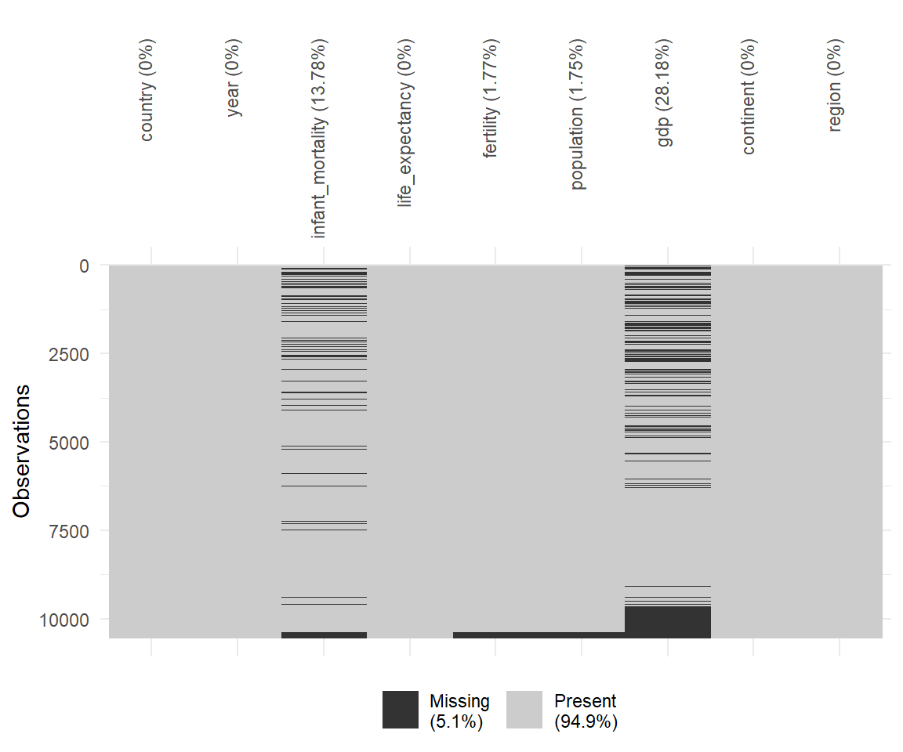

```r
ggsave(filename = "missing_gapminder.svg", height = 11, width = 10)

naniar::gg_miss_var(gapminder) 
```

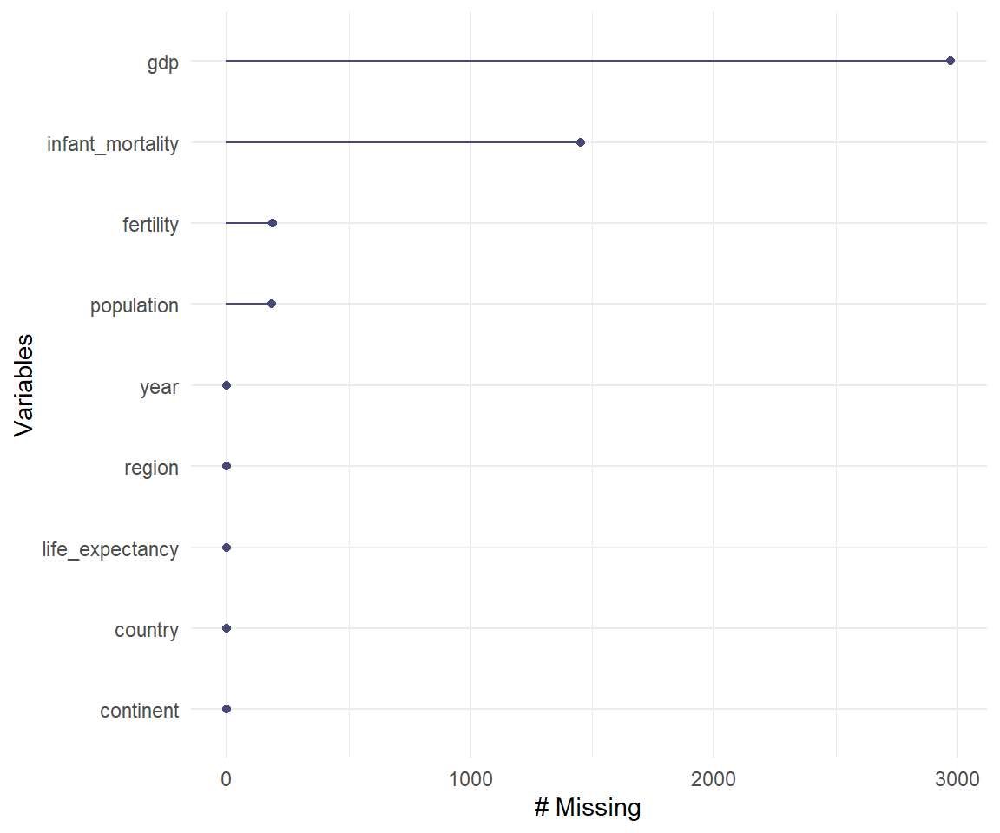

```r
naniar::gg_miss_case(gapminder)
```

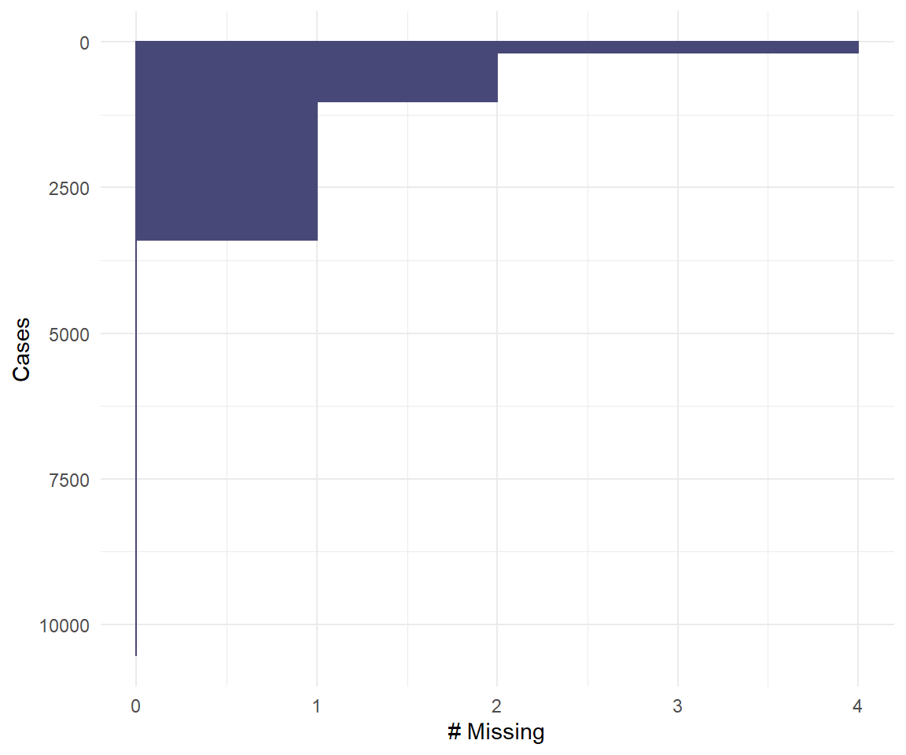

A special ggplot2 plot showing missing values, left from the zero on the x-axis

```r
gapminder %>%
  dplyr::filter(year == 1960 | year == 2000) %>%
  dplyr::filter(continent == "Europe") %>%
  ggplot(aes(x = country,
         y = gdp)) +
  naniar::stat_miss_point() +
  coord_flip() +
  facet_wrap(~year)
```

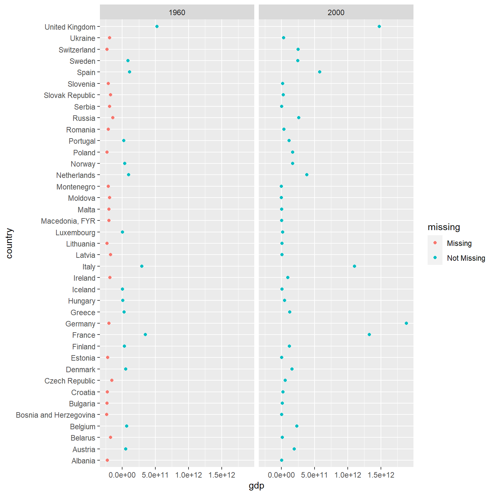

**DISCUSS: What can you can conclude from these plots? What plot would you like to make next to investigate what is going on with the missingness for GDP over time?**

Above we see a typical ggplot2 graph workflow: The data is subsetted for only the years 1960 and 2000 and continent Europe with a call to the `filter()` function from the `{dplyr}` package. Next the aesthetics (`aes()`) are the definitions for which variable should come on which axis of the plot. Then a geometric form (`stat_miss_point()`) is added to the canvas (this is a special geom that also shows missing values left from the zero on the x-axis). Finaly the whole plot is rotated (`coord_flip()`) and panels are created for both years with `facet_wrap(~year)`. You can discover what each element does if you run the code above line-for-line.   

#### Looking at all data {-}
A correlation matrix or a variant thereon can be a good quick way to look at all variables in a dataset. The `{GGaly}` packages has an easy to use function

```r
gapminder %>%
  dplyr::select(-c(country, region)) %>%
ggpairs()
```

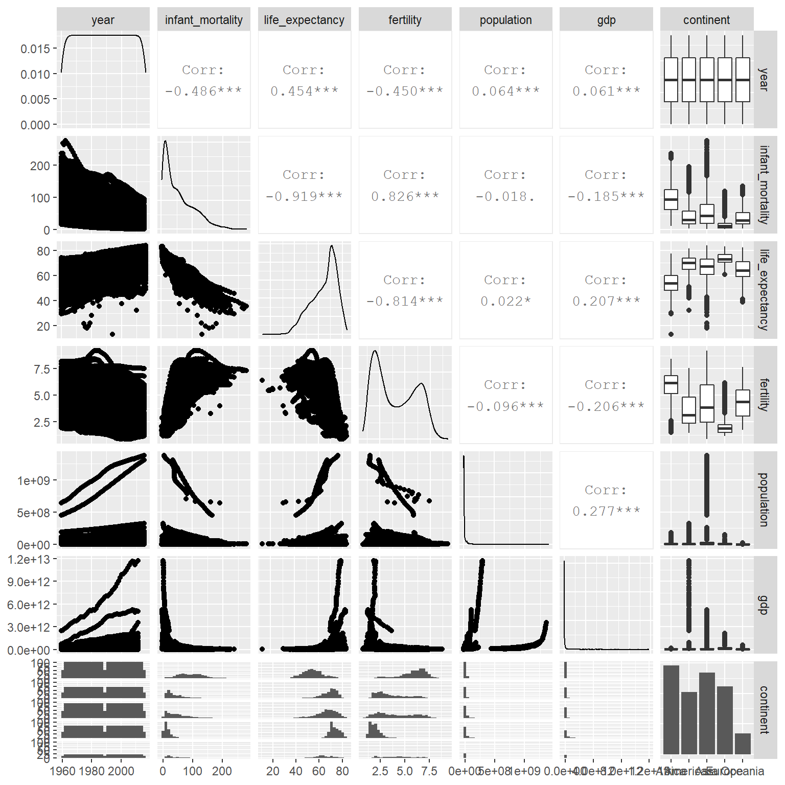

This is a busy graph and for this Gapminder dataset not so informative bu parts of it can be useful as a next step to zoom in at with additional graphs. In Chapter \@ref(lab5eda) we will see further examples of EDA. 

#### Looking at two variables with a scatter plots {-}

```r
gapminder %>% 
  ggplot(aes(x = fertility,
             y = life_expectancy)) +
  geom_point()
```

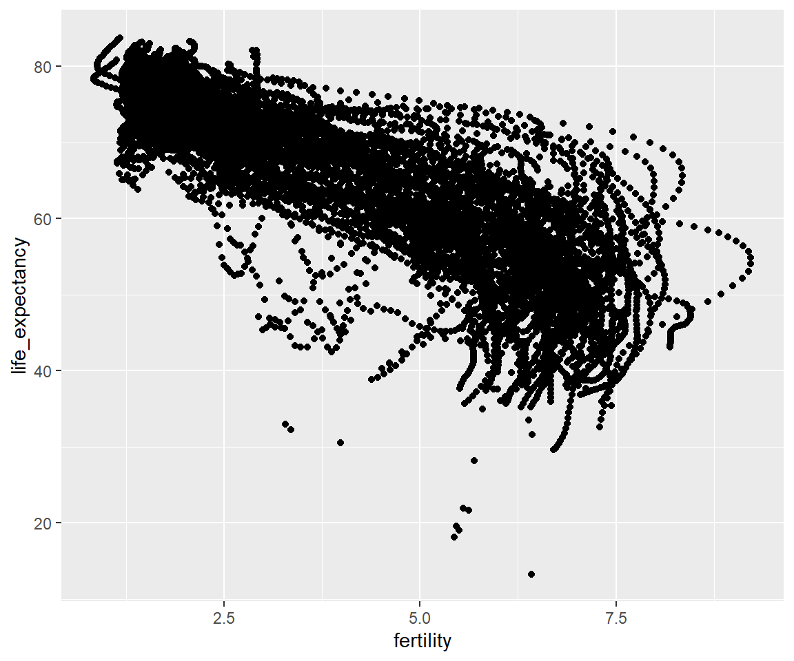

This is a very dense plot showing 'overplotting. We can fix this in several ways:

 1. Reducing the transparency of data points  
 1. Mapping colour to a variable (continuous or categorical)
 1. Reduce the data in the plot
 1. Mapping a shape to a variable
 1. Add noise (`"jitter"`) to points
 1. Facetting - create panels for 'categorical' or so-called 'factor' variables in R
 1. Summarize the data
 1. Displaying a model / relationship that represents the data (and not sho the actual data itself) 
 1. Or any combination of the above strategies
 1. Sometimes choosing a alternative plot-type can also help (for example `geom_tiles()` which can be used for creating heatmaps)

__Basically you map an `aesthetic` (`aes()`) to a variable for instance to map a colour to a categorical variable__
 
Let's go over these solutions to overplotting one by one 

#### A. Reducing transparency (`alpha`) of points or lines in the data {-}

```r
gapminder %>% 
  ggplot(aes(x = fertility,
             y = life_expectancy)) +
  geom_point(alpha = 0.05)
```

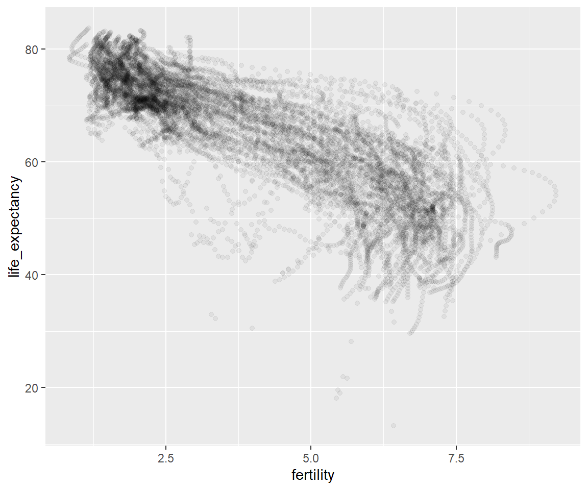

#### B. Mapping colour to a variable {-} 

```r
gapminder %>% 
  ggplot(aes(x = fertility,
             y = life_expectancy)) +
  geom_point(aes(colour = continent))
```

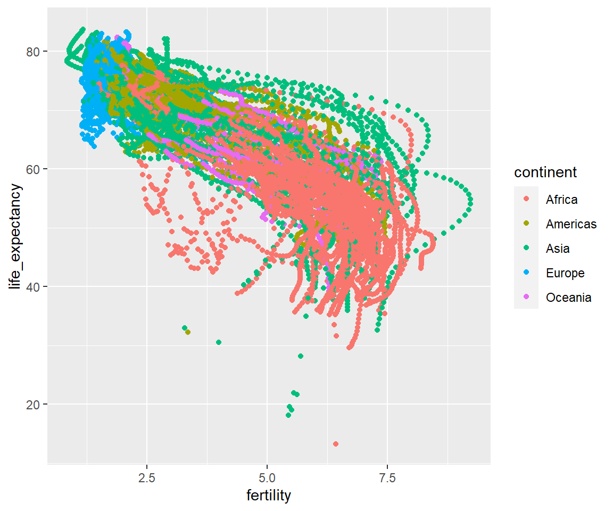

```r
## or combined with transparancy
gapminder %>% 
  ggplot(aes(x = fertility,
             y = life_expectancy)) +
  geom_point(aes(colour = continent), alpha = 0.1) +
  guides(colour = guide_legend(override.aes = list(alpha = 1)))
```

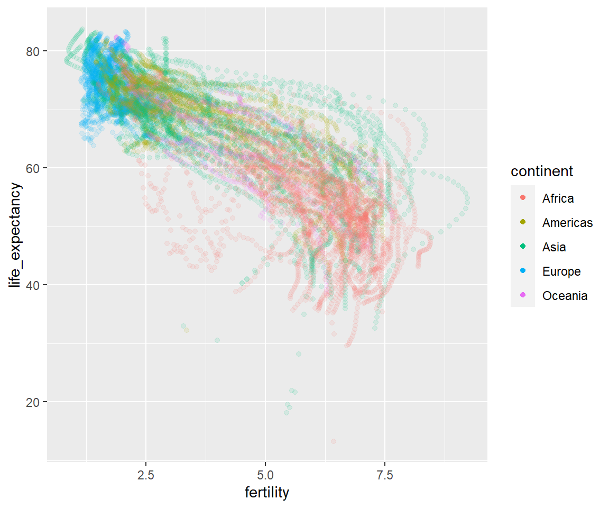

#### C. Reduce the amount of data {-}
Only Africa, using `dplyr::filter()`. Here we use a different set of variables from the `gapminder` dataset to illustrate the options. Mind the log10 transformation in the second graph of this code chunk. What is striking about this figure?

```r
gapminder %>% 
  dplyr::filter(continent == "Africa") %>%
  ggplot(aes(x = year, y = population)) + 
  geom_point() +
  theme(axis.text.x = element_text(angle = 90, hjust = 1))
```

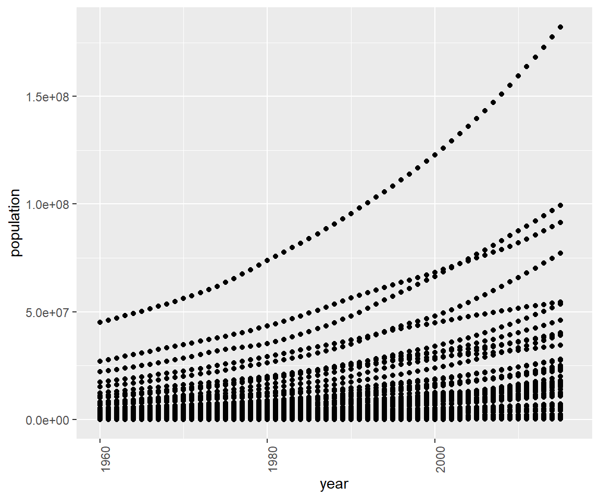

```r
## using a colour for continent
gapminder %>% 
  dplyr::filter(continent == "Africa") %>%
  ggplot(aes(x = year, y = log10(population))) + ## why log10?
  geom_line(aes(group = country, 
                colour = country), 
            show.legend = FALSE, size = 1) +
  theme(axis.text.x = element_text(angle = 90, hjust = 1))
```

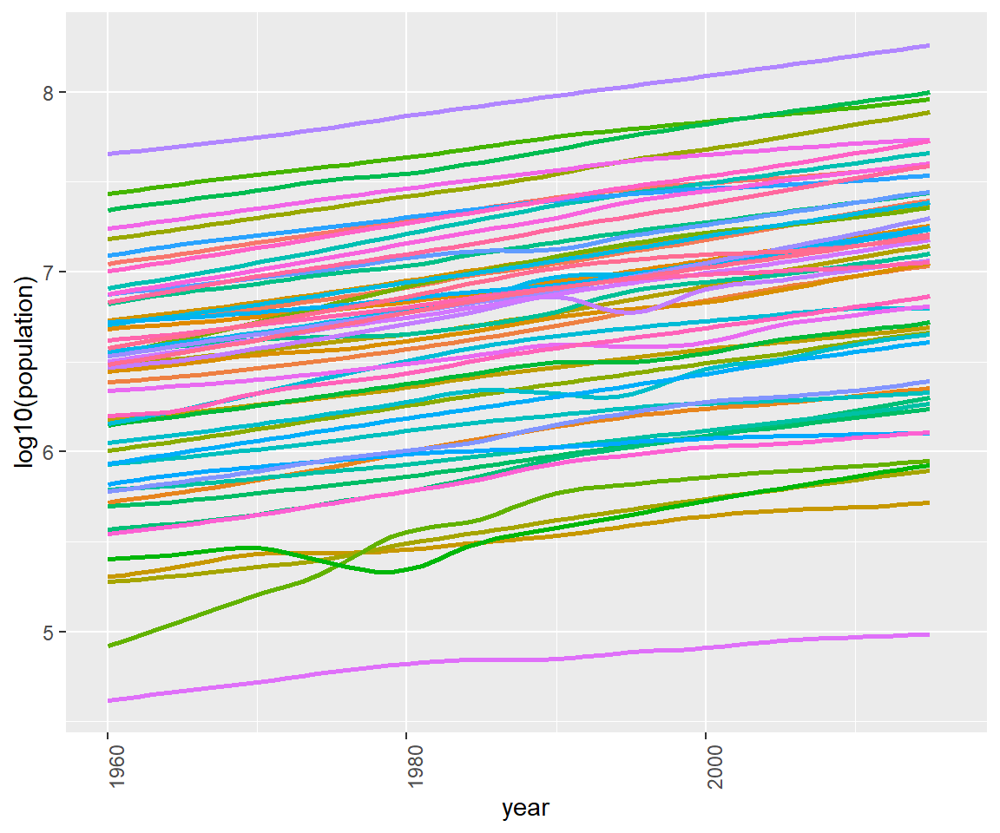

### <mark>**EXERCISE 1; Make a plan**</mark> {-}

A) On the basis of the above picture: Create an EDA plan to investigate whether the population growth rate is different between Africa and Asia in general. How would you approach this? Create a stepwise plan, describe the PPDAC cycle


B) How would you formally 'prove' that growth rates between Africa and Asia in general are the same or different? What statitical model do you think is appropriate. What are the underlying assumptions for your model(s)?


C) How would you, using the same strategy as under 1A) and 1B) subset the data for African countries that have deviating growth rate differences from the overall trend.


D) Can you create a plan to create a graph showing the general overall growth rate over the years for all continents in the `gapminder` dataset? What kind of data-wrangling operation is neccessary to create such a graph (what kind of summary of the data do you need and how would you group the data). Make a conceptual datatable that shows the endproduct. (we will come back to this exercise in Chapters \@ref(lab6amodels) and \@ref(lab3awrangling).

```r
## see above but for every continent, how would you keep all the models built for all countries together?
```

**Extend the filter to exclude more data** 

```r
names(gapminder)
```

```
## [1] "country"          "year"             "infant_mortality" "life_expectancy" 
## [5] "fertility"        "population"       "gdp"              "continent"       
## [9] "region"
```

```r
africa_high_life_exp <- gapminder %>% 
 dplyr::filter(continent == "Africa") %>%
 dplyr::filter(life_expectancy > 60 & fertility < 3) %>%
ggplot(aes(x = year,
             y = life_expectancy)) +
  geom_point(aes(colour = continent)) +
  guides(colour = guide_legend(
    override.aes = list(alpha = 1))) +        
  theme_bw() +
  facet_wrap(~ country) +
  theme(legend.position="none") +
  theme(axis.text.x = element_text(angle = 90, hjust = 1))

africa_high_life_exp
```

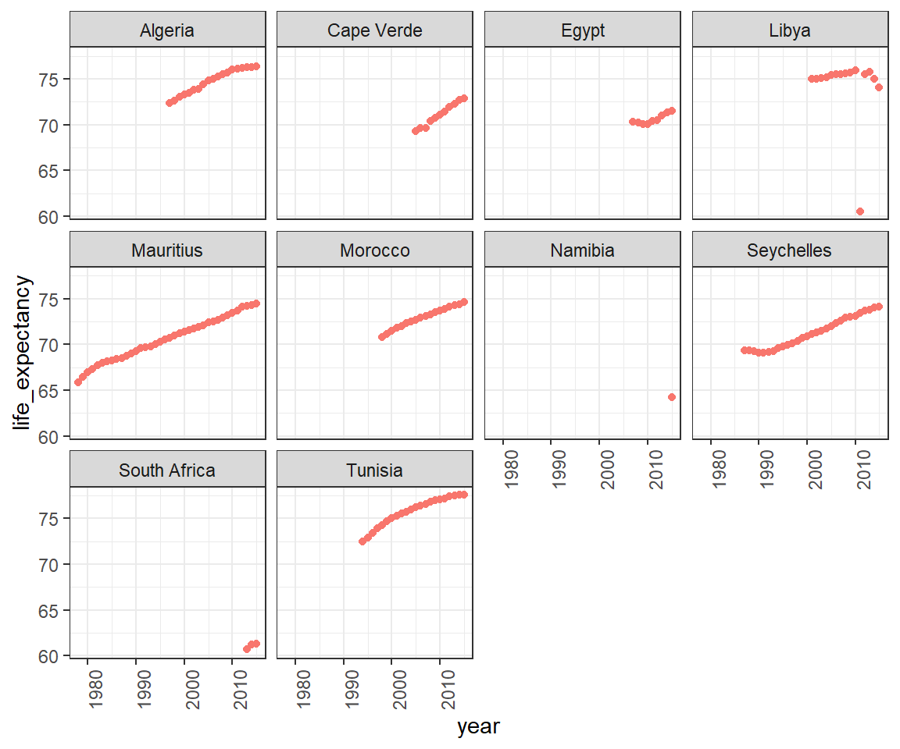

### <mark>**EXERCISE 2; Playing around with the aes() and other ggplot options**</mark> {-}

 - Try adjusting some of the arguments in the previous `ggplot2` call. 
For example, adjust the `alpha = ...` or change the variable in `x = ...`, `y = ...` or `colour = ...`
 - `names(gapminder)` gives you the variable names that you can change
 - Show and discuss the resulting plot with your neighbour
 - What do you think this part does: 
 
 `guides(colour = guide_legend(override.aes = list(alpha = 1)))`
 
 - Try to find out by disabling with `#`
 - Can you find the country that over time showed a very low life expectancy?
 - Play around with the `alpha = 1` setting.

Filter for two continents to see the difference


 - What does the `aes()` part of the `geom_point()` do?
 - Compare the code below with the code above, can you spot the difference, what is the advantage of the code below? Run the code yourself to see it.

#### D. Mapping a shape to a variable {-}

```r
## or e.g. show only two years and map a shape to continent
shape_plot <- gapminder %>% 
  dplyr::filter(continent == "Africa" | continent == "Europe",
         year == "1960" | year == "2010") %>%
  ggplot(aes(x = fertility,
             y = life_expectancy)) +
  geom_point(aes(colour = as_factor(as.character(year)), 
                 shape = continent), 
             alpha = 0.7) +
  theme_bw() +
  guides(colour = guide_legend(override.aes = list(alpha = 1)))
shape_plot
```

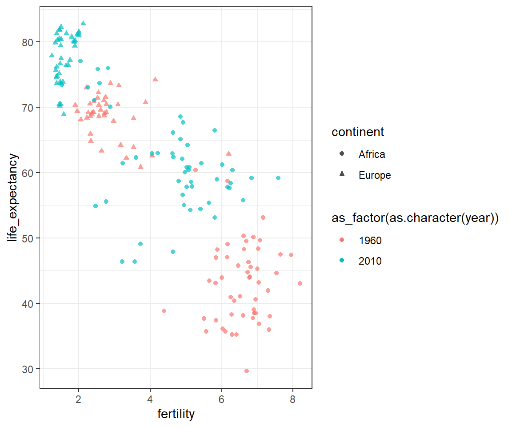

### <mark>**EXERCISE 3; Do it youself**</mark> {-}

 - Try removing the `as_factor(as.character(year))` call and replace this by only `year` above and rerun the plot, what happened?


#### E. Facetting {-}

Create panels for 'categorical' or so-called 'factor' variables in R

```r
facets_plot <- gapminder %>% 
  dplyr::filter(continent == "Africa" | continent == "Europe",
         year == "1960" | year == "2010") %>%
  ggplot(aes(x = fertility,
             y = life_expectancy)) +
  geom_point(aes(colour = continent), alpha = 0.5) +
  facet_wrap(~ year) + 
  guides(colour = guide_legend(override.aes = list(alpha = 1)))

facets_plot
```

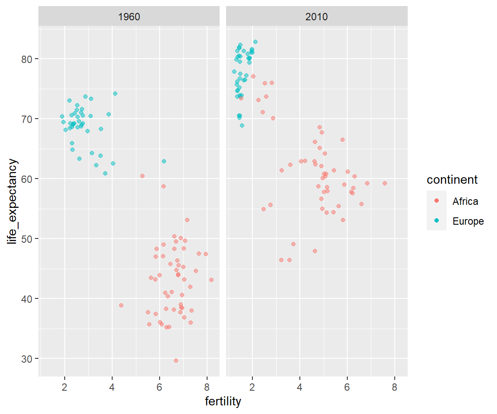

#### F. Summarize the data {-}
Plotting `colour` to one variable, and `shape` to another

```r
library(ggrepel)

years <- c("1960", "1970", "1980", "1990", "2000", "2010")

summarize_plot <- gapminder %>% 
  dplyr::filter(year %in% years) %>%
  group_by(continent, year) %>%
  summarise(mean_life_expectancy = mean(life_expectancy),
            mean_fertility = mean(fertility)) %>%
  ggplot(aes(x = mean_fertility,
             y = mean_life_expectancy)) +
  geom_point(aes(colour = continent, shape = as_factor(year)), alpha = 0.7) +    guides(colour = guide_legend(override.aes = list(alpha = 1)))

summarize_plot
```

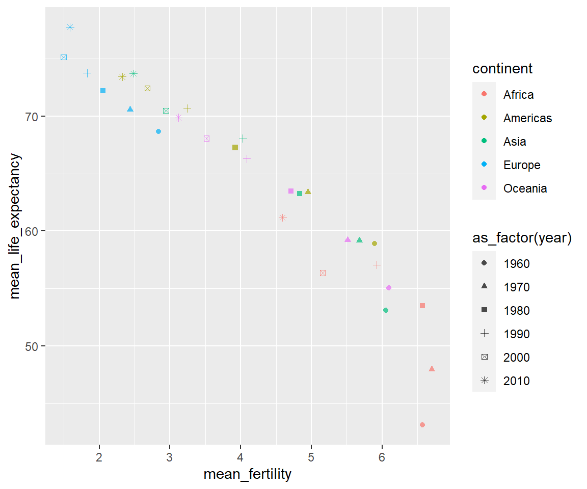

Adding labels to the points with `{ggrepel}`
An alternative to using shape for the year.

```r
library(ggrepel)

years <- c("1960", "1970", "1980", "1990", "2000", "2010")

labels_plot <- gapminder %>% 
  dplyr::filter(year %in% years) %>%
  group_by(continent, year) %>%
  summarise(mean_life_expectancy = mean(life_expectancy),
            mean_fertility = mean(fertility)) %>%
  ggplot(aes(x = mean_fertility,
             y = mean_life_expectancy)) +
  geom_point(aes(colour = continent), alpha = 0.7) +
  geom_label_repel(aes(label=year), size = 2.5, box.padding = .5) +              guides(colour = guide_legend(override.aes = list(alpha = 1)))
  
labels_plot
```

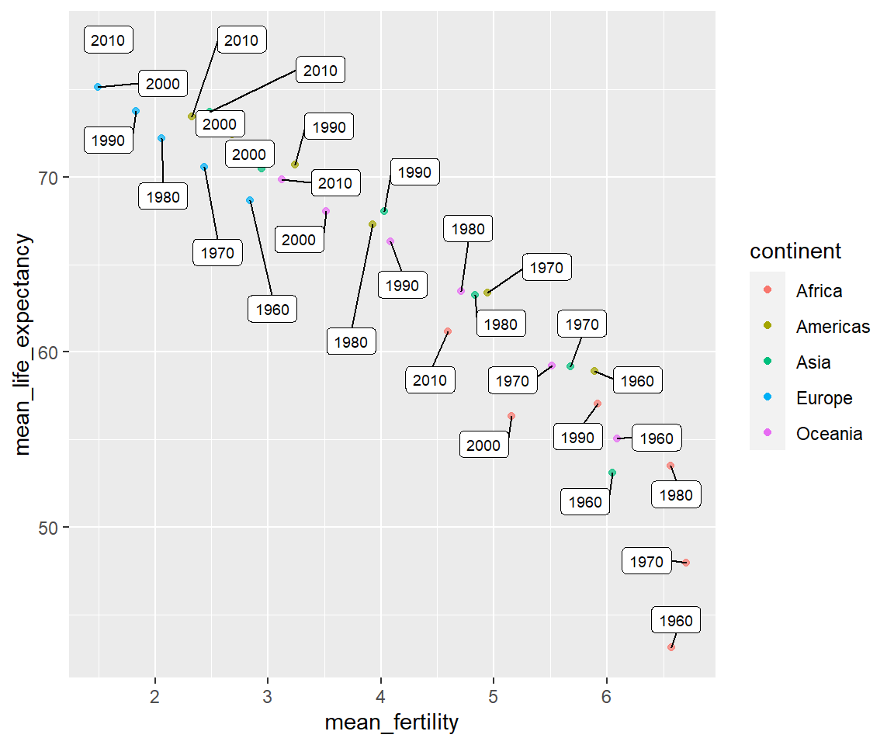

#### G. Displaying a model {-}  

```r
## Model
lm <- gapminder %>% lm(formula = life_expectancy ~ fertility)

correlation <- cor.test(x = gapminder$fertility, y = gapminder$life_expectancy, method = "pearson")

# save predictions of the model in the new data frame 
# together with variable you want to plot against
predicted_df <- data.frame(gapminder_pred = predict(lm, gapminder), 
                           fertility = gapminder$fertility)
```

Add model to plot
In chapter \@ref(lab6amodels) we will see how to create and handle multiple models. For instance: imagine you want to create a model for each country seperately over time. 


### <mark>**EXERCISE 4; Using a model in practice**</mark> {-}
Can you think of an application for such models?
Try to write pseudocode on how you would 
 
 1. Gather the data
 1. Pepare the data for modelling (wrangling)
 1. Preprocess the data (hold-out?)
 1. Build a model
 1. Use the model in practice to ...?


```r
model_plot <- gapminder %>% 
  ggplot(aes(x = fertility,
             y = life_expectancy)) +
  geom_point(alpha = 0.03) +
  geom_line(data = predicted_df, aes(x = fertility, 
                                     y = gapminder_pred),
            colour = "darkred", size = 1)

model_plot
```

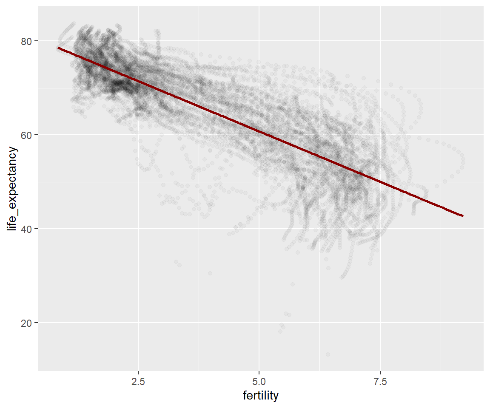

Plotting statistical parameters to the graph with the `{ggpubr}` package
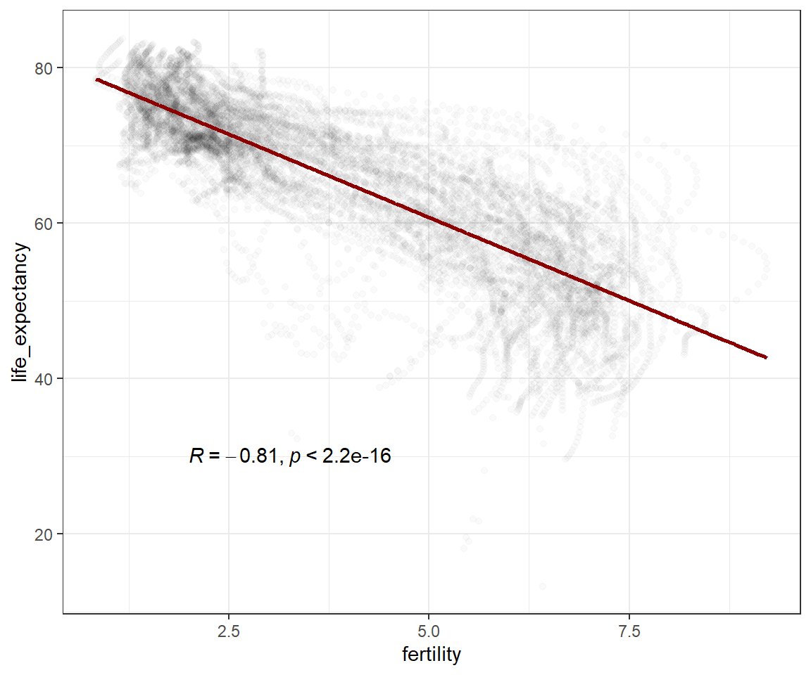

Using a smoother `geom_smooth` to display potential relationships

```r
gapminder %>% 
  ggplot(aes(x = fertility,
             y = life_expectancy)) +
  geom_point(alpha = 0.02) +
  geom_smooth(method = "lm") +
  stat_cor(method = "pearson", label.x = 2, label.y = 30) +
  theme_bw()
```

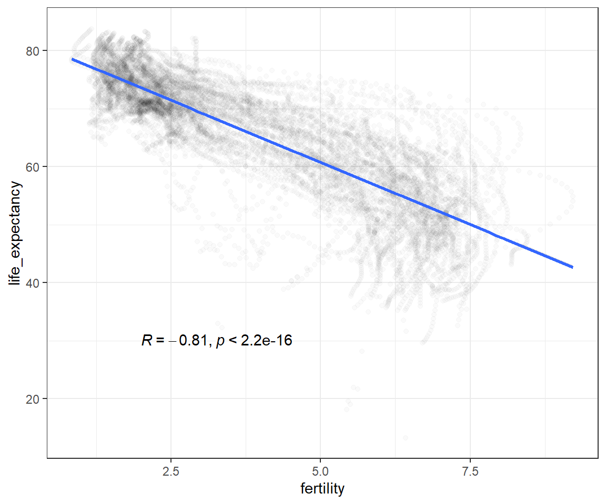

### <mark>**EXERCISE 5; recap - Discuss with your neighbour**</mark> {-}
Which tricks can we use to reduce the dimensionality of the plotted data (prevent overplotting)?

Try listing at least 6 methods:

## A case for history
Let's look at a relevant question and see of we can again go over the 
PPDAC cycle. From the gapminder animation we have learnt that historic events can have a profound effect on life expectancy and income. Most countries show a gradual increase over time for their life expectancy and their income, but we already noticed strong differences between continent. Let's focus on Africa for the next investigation.

The central `PROBLEM` here:
Which African countires show strong fluctuations on their life expectancy and income and which show a gradual increase?

To answer this problem we need a `PLAN`. It seems a good idea to isolate the data for africa and somehow plot trends of life expectancy and income over time. Maybe we can reduce the dimensions by calculation of the product of life expectancy and income. Let's call this metric the `WelfareIndex`. We devide by 10000 to normalise and te get numbers that we can work with. 

$WelfareIndex = \frac{(LifeExpectancy * Income)} {1000}$

### <mark>**EXERCISE 6; DISCUSS: Which `DATA` are we going to use and how are we going to get it?**</mark> {-}

Now we are ready to get going:

#### Getting the right subset of the data
We are focusing on Africa, so it makes sense to subset the data (filter) for those cases that involve Africa. 


```r
africa <- gapminder %>%
  dplyr::filter(continent == "Africa")
```

#### Creating a new variable called `welfare_index`
For each year this index is calculated, we are removing one dimension by catching two variables in one.

```r
africa <- africa %>%
  mutate(welfare_index = (life_expectancy*gdp)/1000)
```

#### Let's make a plot to see if this new metric works out

```r
africa %>%
  ggplot(aes(x = year, y = welfare_index)) +
  geom_line(aes(group = country, colour = country), 
            show.legend = FALSE, size = 1) 
```

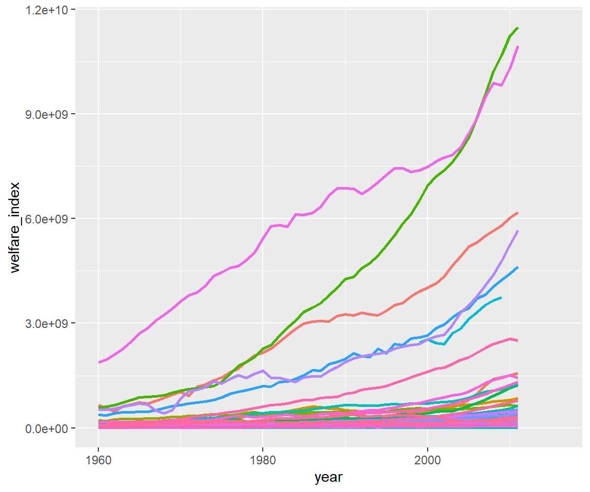

The countries at the bottom are a bit squished up. A transformation of the y-scale could help

```r
africa %>%
  ggplot(aes(x = year, y = log10(welfare_index))) +
  geom_line(aes(group = country, colour = country), 
            show.legend = FALSE, size = 1) 
```

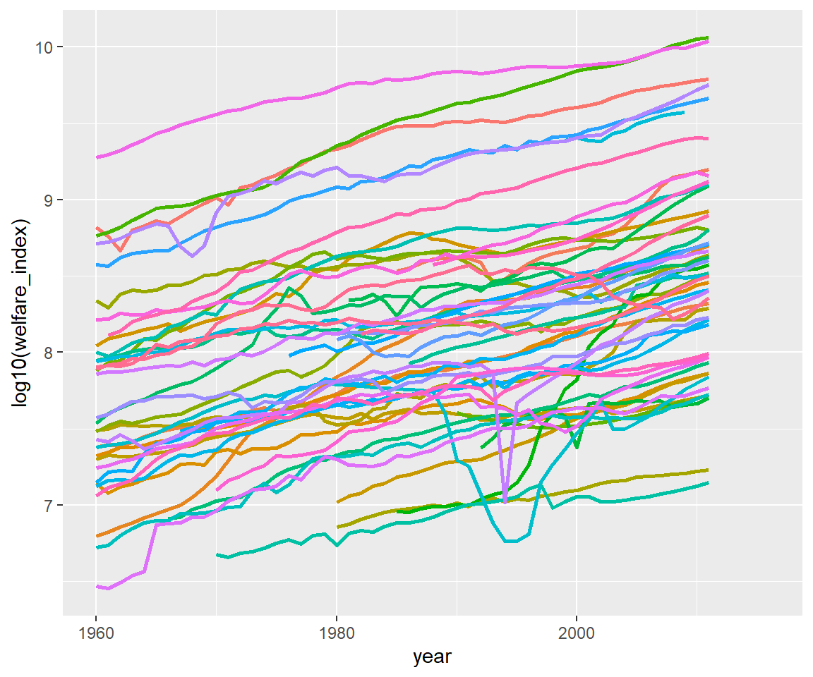

This yields an interesting view on the data: Most countries in Africa follow a comparable upwards trend for the `welfare_index` over time. There a a few exceptions. Think about how you would approach the problem of getting the data for those countries that show a deviating trend from the rest, without having to sift through many lines of data in an Excel file (we will get back to this in Chapter \@ref(lab6amodels). 

## Mapping to continuous variables
So far we have been mapping colours and shapes to categorical variables. You can also map to continuous variables though.

```r
continuous <- gapminder %>%
  dplyr::filter(country == "Netherlands" | 
                country == "China" |
                country == "India") %>%
  dplyr::filter(year %in% years) %>%
  ggplot(aes(x = year,
         y = life_expectancy)) +
  geom_point(aes(size = population, colour = country)) +
  guides(colour = guide_legend(override.aes = list(alpha = 1))) +
  geom_line(aes(group = country, colour = country), size = 1) +
  theme_bw()
continuous
```

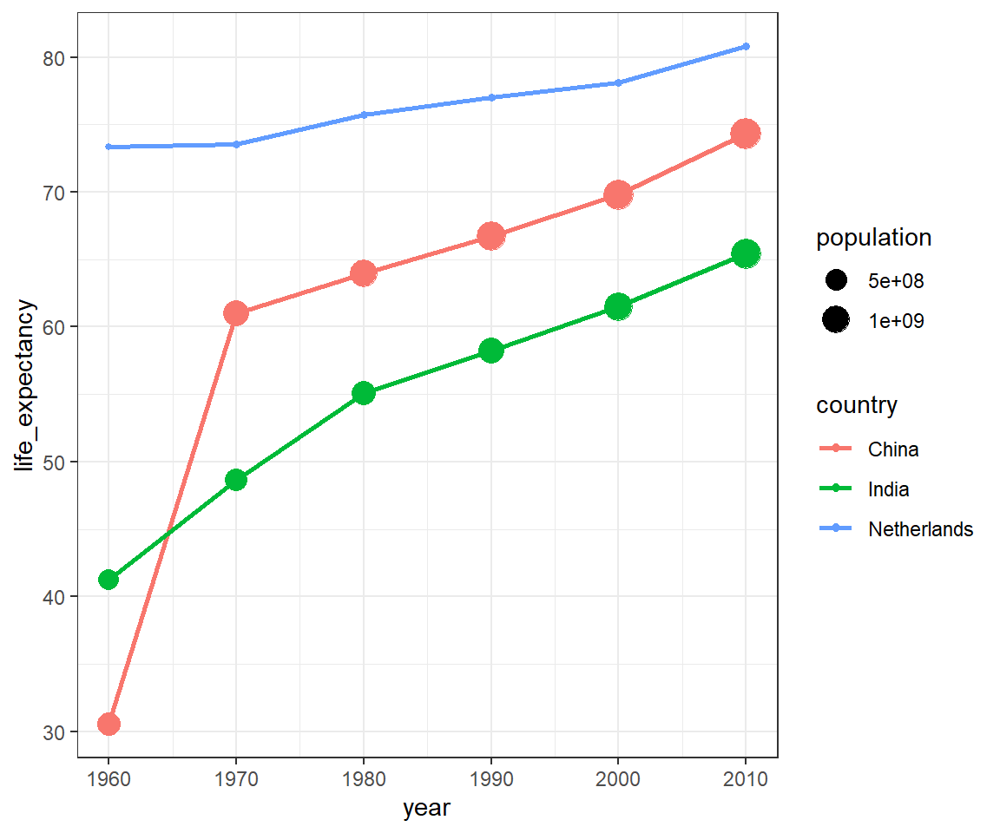

### <mark>**EXERCISE 7; Discuss with your neighbour, and write the R code to:**</mark> {-}

Try plotting the `infant_mortality` against the filtered years for the same countries as the code above (Netherlands, India, China), recycling some of the code above. Discuss the resulting graph in the light of the life_expectancy graph, what do you think about the the developments in China? 

Want to know more? see: https://www.ncbi.nlm.nih.gov/pmc/articles/PMC4331212/
Babxiarz, 2016

### <mark>**EXERCISE 8; Analyzing the code, line by line**</mark> {-}

Analyze the following code chunk: try running line by line to see what happens:

 - How many observations are we plotting here?
 - How many variables are we plotting?
 - Try adding or removing variables to the `group_by()` statement, what happens if you do?

#### Summarize per continent and sum population {-}

```r
population_plot <- gapminder %>% 
  dplyr::group_by(continent, year) %>%
  dplyr::filter(year %in% years) %>%
  summarise(sum_population = sum(population, na.rm = TRUE),
            mean_life_exp = mean(life_expectancy, na.rm = TRUE)) %>% 
  ggplot(aes(x = year, 
             y = log10(sum_population))) +
    geom_point(aes(colour = continent, 
                   size = mean_life_exp,
                   alpha = 0.5)) +
    geom_line(aes(group = continent,
                  colour = continent)) +
    guides(colour = guide_legend(override.aes = list(alpha = 1)))
  
population_plot
```

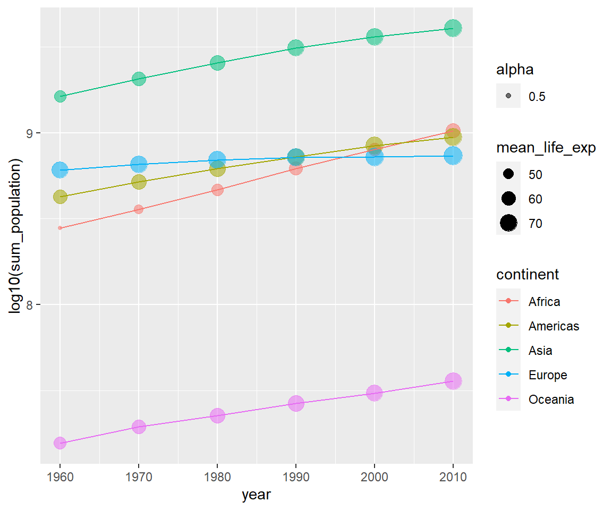

## Ranking data
Sometimes it can be helpful to rank data according a numeric variable if you are plotting numeric values to a categorical variable. Here I show you the gapminder countries in Europe, ranked for the log10 of their respective population sizes. Red dots indicate those countries with more than 1*10E6 (so 10 million) inhabitants

```r
over_10_million <- gapminder %>%
  dplyr::filter(
  continent == "Europe",
  year == 2010, 
  population >= 1e7)

ranking_plot <- gapminder %>%
  dplyr::filter(continent == "Europe",
                year == 2010) %>%
  ggplot(aes(x = reorder(as_factor(country), population),
             y = log10(population))) +
  geom_point() +
  ylab("log10(Population)") +
  xlab("Country") + 
  coord_flip() +
  geom_point(data = over_10_million, colour = "red")

ranking_plot
```

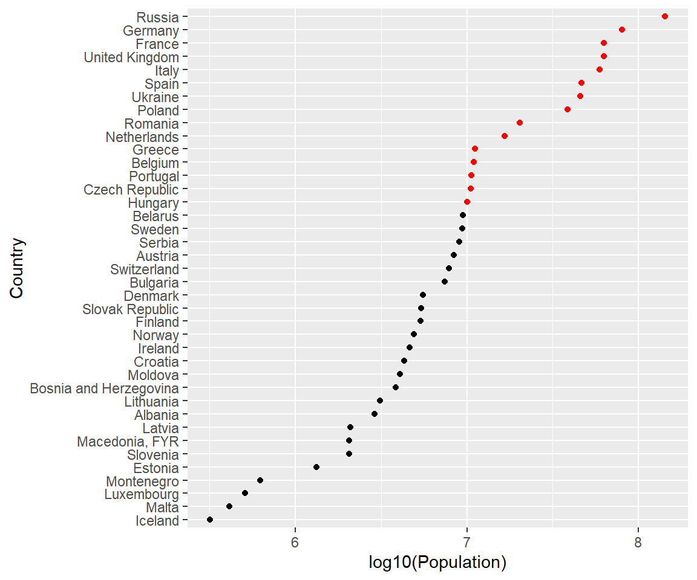

## Time series
We filter for "Americas" and "Oceania" and look at `life_expectancy` over the years.

```r
## without summarizing for countries
gapminder$continent %>% as_factor() %>% levels()
```

```
## [1] "Africa"   "Americas" "Asia"     "Europe"   "Oceania"
```

```r
gapminder %>% 
  dplyr::filter(continent == "Americas" | continent == "Oceania") %>%
  ggplot(aes(x = year,
             y = life_expectancy)) +
  geom_line(aes(group = continent,
                colour = continent))
```

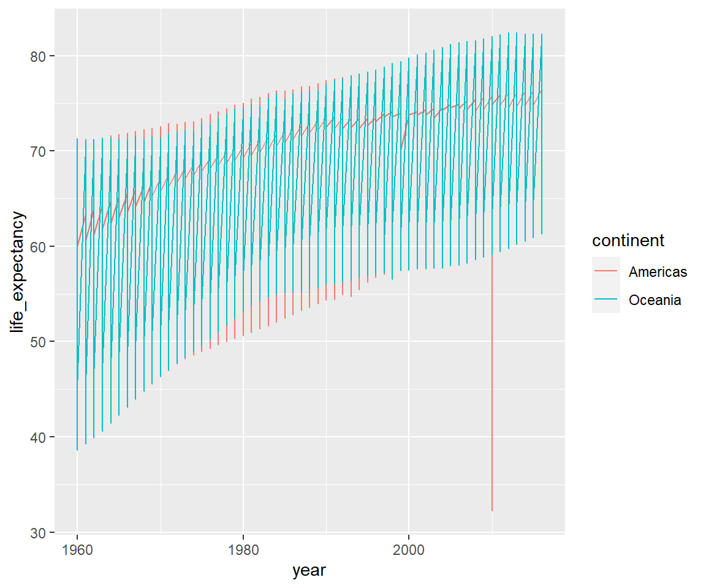

### <mark>**EXERCISE 9; Obviously something went wrong here. Please, discuss with (your neighbour) what you think happened or needs to be done to fix this (without looking ahead ;-) )**</mark> {-}

### Grouping
We can see what happened if we plot individual datapoints

```r
gapminder %>% 
  dplyr::filter(continent == "Americas" | continent == "Oceania") %>%
  ggplot(aes(x = year,
             y = life_expectancy)) +
  geom_point(aes(colour = country)) +
  theme(legend.position="none") +
  facet_wrap( ~ continent) +
  theme(legend.position="none") 
```

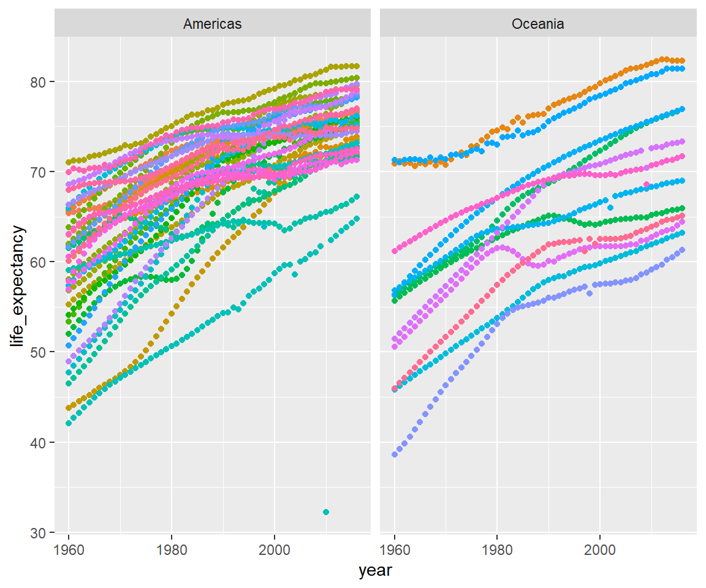

### Summarizing time series data {-}
What happened in 1999/2010? The dat shows a dip.

```r
gapminder$continent %>% as_factor() %>% levels()
```

```
## [1] "Africa"   "Americas" "Asia"     "Europe"   "Oceania"
```

```r
gapminder %>% 
  dplyr::filter(continent == "Americas" | continent == "Oceania") %>%
  group_by(continent, year) %>%
  summarise(mean_life_expectancy = mean(life_expectancy)) %>%
  ggplot(aes(x = year,
             y = mean_life_expectancy)) +
  geom_line(aes(group = continent,
                colour = continent), size = 3) +
  theme(axis.text.x = element_text(angle = 90, hjust = 1))
```

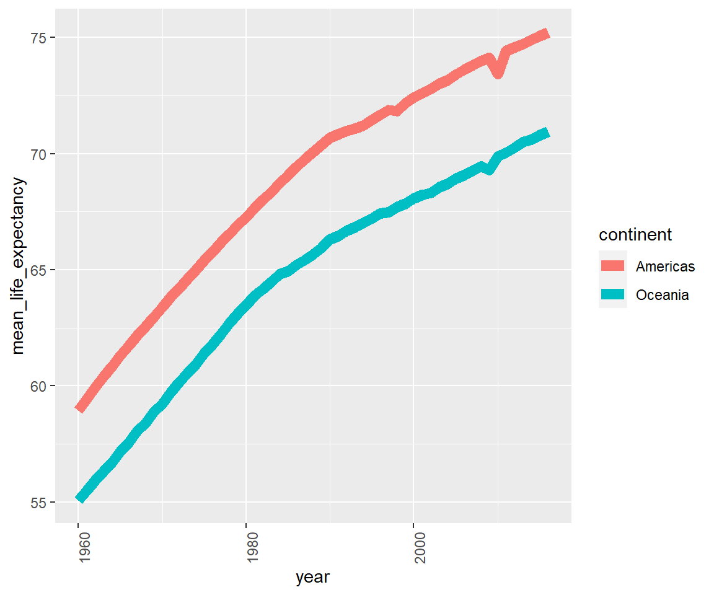

## One more option: categorical values and "jitter"
Sometimes you have overlapping plots and adding transparency with `alpha()` or mapping colour to underlying categorical values is not working because there are simple to many points overlapping

Let's look at an example

```r
gapminder %>% 
  dplyr::filter(continent == "Americas" |
                continent == "Africa") %>%
  group_by(continent) %>%
  dplyr::filter(year %in% years) %>%
  ggplot(aes(x = year,
             y = infant_mortality)) +
  geom_point(aes(colour = country)) +
  theme(legend.position="none")
```

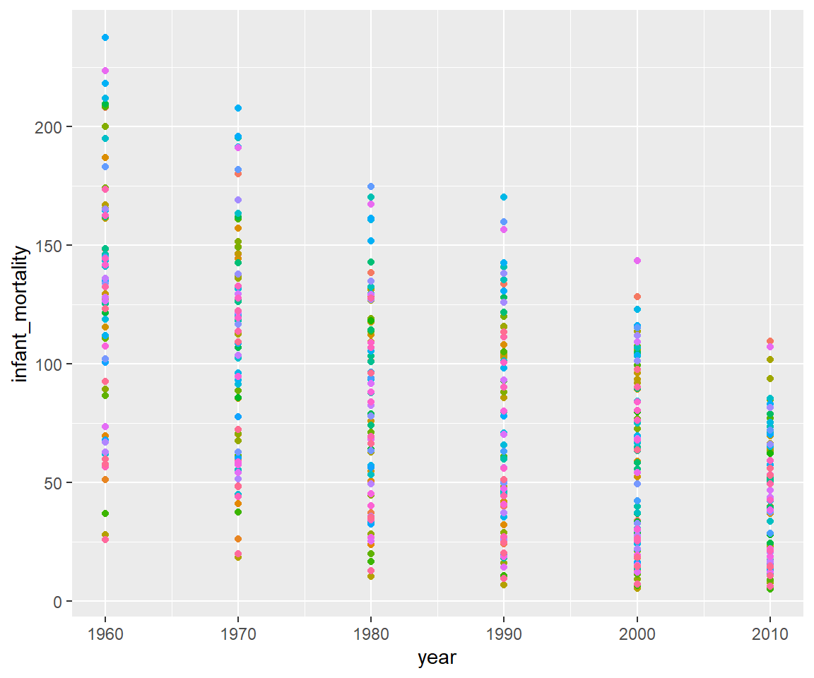

In such cases it can be helpfull to add some noise to the points (`position = "jitter"`) to reduce overlapping. This can be a powerfull approach, especially when combined with setting `alpha()`

```r
gapminder %>% 
  dplyr::filter(continent == "Americas" |
                continent == "Africa") %>%
  dplyr::filter(year %in% years) %>%
    group_by(continent) %>%
  ggplot(aes(x = year,
             y = infant_mortality)) +
  geom_point(aes(colour = continent), position = "jitter") 
```

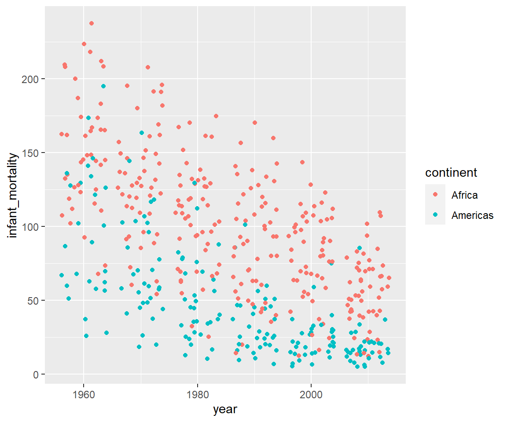

### {-} Adding summary data to an existing plot
Now that we have the mean infant mortality for each year for the two continents, let's add that data to the previous dot plot where we used jitter

```r
mean_inf_mort <- gapminder %>% 
  dplyr::filter(continent == "Americas" |
                continent == "Africa") %>%
  dplyr::filter(year %in% years) %>%
  group_by(continent, year) %>%
  summarise(mean_infant_mortality = mean(infant_mortality, na.rm = TRUE))

gapminder %>% 
  dplyr::filter(continent == "Americas" |
                continent == "Africa") %>%
  dplyr::filter(year %in% years) %>%
    group_by(continent) %>%
  ggplot(aes(x = year,
             y = infant_mortality)) +
  geom_point(aes(colour = continent), position = "jitter") +

## summary data added to previous 
  geom_line(data = mean_inf_mort, aes(x = year, 
                                      y = mean_infant_mortality, 
                                      colour = continent),  size = 2)
```

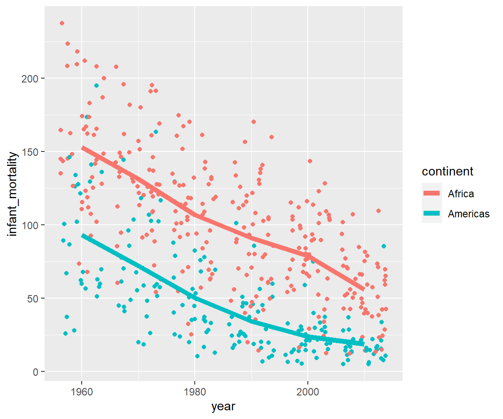

### Interactive visualizations {-}
In the figure above we can observe a number of countries in 'Americas' continent that have a child mortality that are above the average (over the years) of 'Africa'. Which countries are this?


```r
library(ggiraph)

gapminder$country <- 
  str_replace_all(string = gapminder$country, 
                pattern = "'", 
                replacement = "_")


interactive_inf_mort <- gapminder %>% 
  dplyr::filter(continent == "Americas" |
                continent == "Africa") %>%
  dplyr::filter(year %in% years) %>%
    group_by(region, country) %>%
  ggplot(aes(x = year,
             y = infant_mortality)) +
  
  geom_point_interactive(aes(tooltip = country, colour = region), position = "jitter") +
  
#  geom_point(aes(colour = continent), position = "jitter") +

## summary data added to previous 
 geom_line(data = mean_inf_mort, aes(x = year, 
                                      y = mean_infant_mortality, 
                                      colour = continent, group = continent),  size = 2
            )

interactive_inf_mort
```

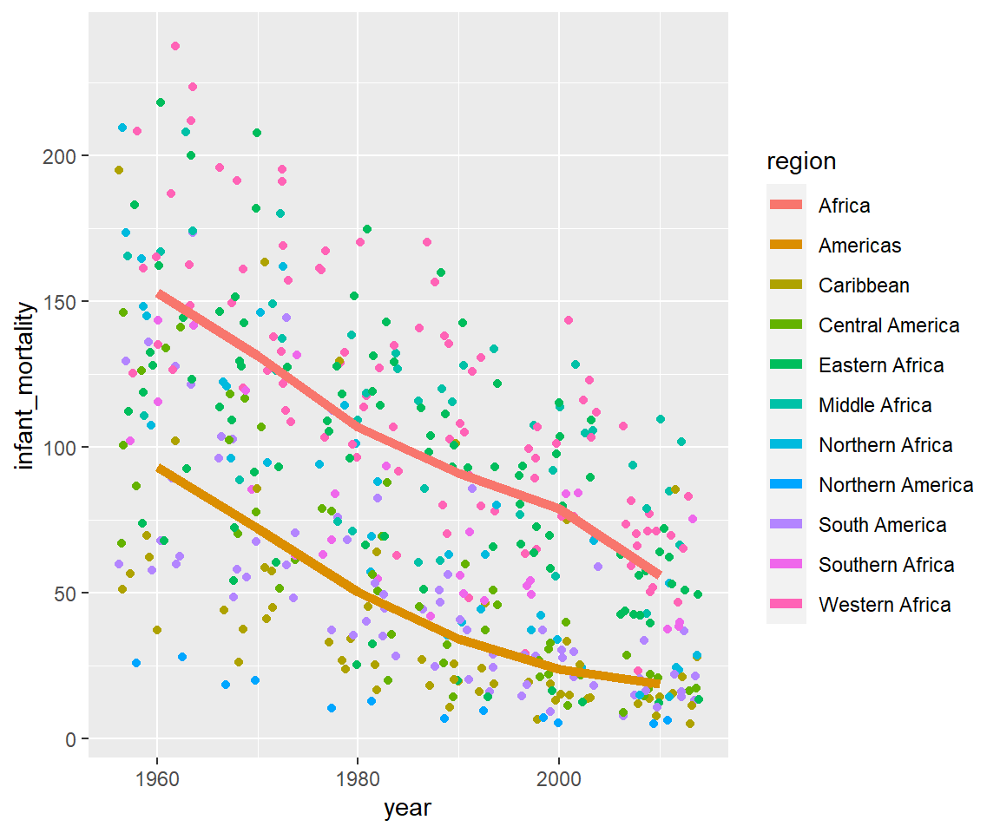

```r
gapminder$country %>% as_factor() %>% levels()
```

```
##   [1] "Albania"                        "Algeria"                       
##   [3] "Angola"                         "Antigua and Barbuda"           
##   [5] "Argentina"                      "Armenia"                       
##   [7] "Aruba"                          "Australia"                     
##   [9] "Austria"                        "Azerbaijan"                    
##  [11] "Bahamas"                        "Bahrain"                       
##  [13] "Bangladesh"                     "Barbados"                      
##  [15] "Belarus"                        "Belgium"                       
##  [17] "Belize"                         "Benin"                         
##  [19] "Bhutan"                         "Bolivia"                       
##  [21] "Bosnia and Herzegovina"         "Botswana"                      
##  [23] "Brazil"                         "Brunei"                        
##  [25] "Bulgaria"                       "Burkina Faso"                  
##  [27] "Burundi"                        "Cambodia"                      
##  [29] "Cameroon"                       "Canada"                        
##  [31] "Cape Verde"                     "Central African Republic"      
##  [33] "Chad"                           "Chile"                         
##  [35] "China"                          "Colombia"                      
##  [37] "Comoros"                        "Congo, Dem. Rep."              
##  [39] "Congo, Rep."                    "Costa Rica"                    
##  [41] "Cote d_Ivoire"                  "Croatia"                       
##  [43] "Cuba"                           "Cyprus"                        
##  [45] "Czech Republic"                 "Denmark"                       
##  [47] "Djibouti"                       "Dominican Republic"            
##  [49] "Ecuador"                        "Egypt"                         
##  [51] "El Salvador"                    "Equatorial Guinea"             
##  [53] "Eritrea"                        "Estonia"                       
##  [55] "Ethiopia"                       "Fiji"                          
##  [57] "Finland"                        "France"                        
##  [59] "French Polynesia"               "Gabon"                         
##  [61] "Gambia"                         "Georgia"                       
##  [63] "Germany"                        "Ghana"                         
##  [65] "Greece"                         "Greenland"                     
##  [67] "Grenada"                        "Guatemala"                     
##  [69] "Guinea"                         "Guinea-Bissau"                 
##  [71] "Guyana"                         "Haiti"                         
##  [73] "Honduras"                       "Hong Kong, China"              
##  [75] "Hungary"                        "Iceland"                       
##  [77] "India"                          "Indonesia"                     
##  [79] "Iran"                           "Iraq"                          
##  [81] "Ireland"                        "Israel"                        
##  [83] "Italy"                          "Jamaica"                       
##  [85] "Japan"                          "Jordan"                        
##  [87] "Kazakhstan"                     "Kenya"                         
##  [89] "Kiribati"                       "South Korea"                   
##  [91] "Kuwait"                         "Kyrgyz Republic"               
##  [93] "Lao"                            "Latvia"                        
##  [95] "Lebanon"                        "Lesotho"                       
##  [97] "Liberia"                        "Libya"                         
##  [99] "Lithuania"                      "Luxembourg"                    
## [101] "Macao, China"                   "Macedonia, FYR"                
## [103] "Madagascar"                     "Malawi"                        
## [105] "Malaysia"                       "Maldives"                      
## [107] "Mali"                           "Malta"                         
## [109] "Mauritania"                     "Mauritius"                     
## [111] "Mexico"                         "Micronesia, Fed. Sts."         
## [113] "Moldova"                        "Mongolia"                      
## [115] "Montenegro"                     "Morocco"                       
## [117] "Mozambique"                     "Namibia"                       
## [119] "Nepal"                          "Netherlands"                   
## [121] "New Caledonia"                  "New Zealand"                   
## [123] "Nicaragua"                      "Niger"                         
## [125] "Nigeria"                        "Norway"                        
## [127] "Oman"                           "Pakistan"                      
## [129] "Panama"                         "Papua New Guinea"              
## [131] "Paraguay"                       "Peru"                          
## [133] "Philippines"                    "Poland"                        
## [135] "Portugal"                       "Puerto Rico"                   
## [137] "Qatar"                          "Romania"                       
## [139] "Russia"                         "Rwanda"                        
## [141] "St. Lucia"                      "St. Vincent and the Grenadines"
## [143] "Samoa"                          "Saudi Arabia"                  
## [145] "Senegal"                        "Serbia"                        
## [147] "Seychelles"                     "Sierra Leone"                  
## [149] "Singapore"                      "Slovak Republic"               
## [151] "Slovenia"                       "Solomon Islands"               
## [153] "South Africa"                   "Spain"                         
## [155] "Sri Lanka"                      "Sudan"                         
## [157] "Suriname"                       "Swaziland"                     
## [159] "Sweden"                         "Switzerland"                   
## [161] "Syria"                          "Tajikistan"                    
## [163] "Tanzania"                       "Thailand"                      
## [165] "Timor-Leste"                    "Togo"                          
## [167] "Tonga"                          "Trinidad and Tobago"           
## [169] "Tunisia"                        "Turkey"                        
## [171] "Turkmenistan"                   "Uganda"                        
## [173] "Ukraine"                        "United Arab Emirates"          
## [175] "United Kingdom"                 "United States"                 
## [177] "Uruguay"                        "Uzbekistan"                    
## [179] "Vanuatu"                        "Venezuela"                     
## [181] "West Bank and Gaza"             "Vietnam"                       
## [183] "Yemen"                          "Zambia"                        
## [185] "Zimbabwe"
```

```r
ggiraph(ggobj = interactive_inf_mort)
```

```{=html}
<div id="htmlwidget-10c2578b183462f7fc2c" style="width:576px;height:480px;" class="girafe html-widget"></div>
<script type="application/json" data-for="htmlwidget-10c2578b183462f7fc2c">{"x":{"html":"<?xml version=\"1.0\" encoding=\"UTF-8\"?>\n<svg xmlns='http://www.w3.org/2000/svg' xmlns:xlink='http://www.w3.org/1999/xlink' id='svg_94a34286-7768-4810-8ea5-b86adf836fe7' viewBox='0 0 432.00 360.00'>\n  <g>\n    <defs>\n      <clipPath id='svg_94a34286-7768-4810-8ea5-b86adf836fe7_cl_1'>\n        <rect x='0.00' y='0.00' width='432.00' height='360.00'/>\n      <\/clipPath>\n    <\/defs>\n    <rect x='0.00' y='0.00' width='432.00' height='360.00' id='svg_94a34286-7768-4810-8ea5-b86adf836fe7_el_1' clip-path='url(#svg_94a34286-7768-4810-8ea5-b86adf836fe7_cl_1)' fill='#FFFFFF' fill-opacity='1' stroke='#FFFFFF' stroke-opacity='1' stroke-width='0.75' stroke-linejoin='round' stroke-linecap='round'/>\n    <defs>\n      <clipPath id='svg_94a34286-7768-4810-8ea5-b86adf836fe7_cl_2'>\n        <rect x='0.00' y='0.00' width='432.00' height='360.00'/>\n      <\/clipPath>\n    <\/defs>\n    <rect x='0.00' y='0.00' width='432.00' height='360.00' id='svg_94a34286-7768-4810-8ea5-b86adf836fe7_el_2' clip-path='url(#svg_94a34286-7768-4810-8ea5-b86adf836fe7_cl_2)' fill='#FFFFFF' fill-opacity='1' stroke='#FFFFFF' stroke-opacity='1' stroke-width='1.07' stroke-linejoin='round' stroke-linecap='round'/>\n    <defs>\n      <clipPath id='svg_94a34286-7768-4810-8ea5-b86adf836fe7_cl_3'>\n        <rect x='40.24' y='5.48' width='263.46' height='322.82'/>\n      <\/clipPath>\n    <\/defs>\n    <rect x='40.24' y='5.48' width='263.46' height='322.82' id='svg_94a34286-7768-4810-8ea5-b86adf836fe7_el_3' clip-path='url(#svg_94a34286-7768-4810-8ea5-b86adf836fe7_cl_3)' fill='#EBEBEB' fill-opacity='1' stroke='none'/>\n    <polyline points='40.24,288.24 303.70,288.24' id='svg_94a34286-7768-4810-8ea5-b86adf836fe7_el_4' clip-path='url(#svg_94a34286-7768-4810-8ea5-b86adf836fe7_cl_3)' fill='none' stroke='#FFFFFF' stroke-opacity='1' stroke-width='0.53' stroke-linejoin='round' stroke-linecap='butt'/>\n    <polyline points='40.24,225.13 303.70,225.13' id='svg_94a34286-7768-4810-8ea5-b86adf836fe7_el_5' clip-path='url(#svg_94a34286-7768-4810-8ea5-b86adf836fe7_cl_3)' fill='none' stroke='#FFFFFF' stroke-opacity='1' stroke-width='0.53' stroke-linejoin='round' stroke-linecap='butt'/>\n    <polyline points='40.24,162.02 303.70,162.02' id='svg_94a34286-7768-4810-8ea5-b86adf836fe7_el_6' clip-path='url(#svg_94a34286-7768-4810-8ea5-b86adf836fe7_cl_3)' fill='none' stroke='#FFFFFF' stroke-opacity='1' stroke-width='0.53' stroke-linejoin='round' stroke-linecap='butt'/>\n    <polyline points='40.24,98.90 303.70,98.90' id='svg_94a34286-7768-4810-8ea5-b86adf836fe7_el_7' clip-path='url(#svg_94a34286-7768-4810-8ea5-b86adf836fe7_cl_3)' fill='none' stroke='#FFFFFF' stroke-opacity='1' stroke-width='0.53' stroke-linejoin='round' stroke-linecap='butt'/>\n    <polyline points='40.24,35.79 303.70,35.79' id='svg_94a34286-7768-4810-8ea5-b86adf836fe7_el_8' clip-path='url(#svg_94a34286-7768-4810-8ea5-b86adf836fe7_cl_3)' fill='none' stroke='#FFFFFF' stroke-opacity='1' stroke-width='0.53' stroke-linejoin='round' stroke-linecap='butt'/>\n    <polyline points='109.85,328.29 109.85,5.48' id='svg_94a34286-7768-4810-8ea5-b86adf836fe7_el_9' clip-path='url(#svg_94a34286-7768-4810-8ea5-b86adf836fe7_cl_3)' fill='none' stroke='#FFFFFF' stroke-opacity='1' stroke-width='0.53' stroke-linejoin='round' stroke-linecap='butt'/>\n    <polyline points='193.07,328.29 193.07,5.48' id='svg_94a34286-7768-4810-8ea5-b86adf836fe7_el_10' clip-path='url(#svg_94a34286-7768-4810-8ea5-b86adf836fe7_cl_3)' fill='none' stroke='#FFFFFF' stroke-opacity='1' stroke-width='0.53' stroke-linejoin='round' stroke-linecap='butt'/>\n    <polyline points='276.28,328.29 276.28,5.48' id='svg_94a34286-7768-4810-8ea5-b86adf836fe7_el_11' clip-path='url(#svg_94a34286-7768-4810-8ea5-b86adf836fe7_cl_3)' fill='none' stroke='#FFFFFF' stroke-opacity='1' stroke-width='0.53' stroke-linejoin='round' stroke-linecap='butt'/>\n    <polyline points='40.24,319.79 303.70,319.79' id='svg_94a34286-7768-4810-8ea5-b86adf836fe7_el_12' clip-path='url(#svg_94a34286-7768-4810-8ea5-b86adf836fe7_cl_3)' fill='none' stroke='#FFFFFF' stroke-opacity='1' stroke-width='1.07' stroke-linejoin='round' stroke-linecap='butt'/>\n    <polyline points='40.24,256.68 303.70,256.68' id='svg_94a34286-7768-4810-8ea5-b86adf836fe7_el_13' clip-path='url(#svg_94a34286-7768-4810-8ea5-b86adf836fe7_cl_3)' fill='none' stroke='#FFFFFF' stroke-opacity='1' stroke-width='1.07' stroke-linejoin='round' stroke-linecap='butt'/>\n    <polyline points='40.24,193.57 303.70,193.57' id='svg_94a34286-7768-4810-8ea5-b86adf836fe7_el_14' clip-path='url(#svg_94a34286-7768-4810-8ea5-b86adf836fe7_cl_3)' fill='none' stroke='#FFFFFF' stroke-opacity='1' stroke-width='1.07' stroke-linejoin='round' stroke-linecap='butt'/>\n    <polyline points='40.24,130.46 303.70,130.46' id='svg_94a34286-7768-4810-8ea5-b86adf836fe7_el_15' clip-path='url(#svg_94a34286-7768-4810-8ea5-b86adf836fe7_cl_3)' fill='none' stroke='#FFFFFF' stroke-opacity='1' stroke-width='1.07' stroke-linejoin='round' stroke-linecap='butt'/>\n    <polyline points='40.24,67.35 303.70,67.35' id='svg_94a34286-7768-4810-8ea5-b86adf836fe7_el_16' clip-path='url(#svg_94a34286-7768-4810-8ea5-b86adf836fe7_cl_3)' fill='none' stroke='#FFFFFF' stroke-opacity='1' stroke-width='1.07' stroke-linejoin='round' stroke-linecap='butt'/>\n    <polyline points='68.24,328.29 68.24,5.48' id='svg_94a34286-7768-4810-8ea5-b86adf836fe7_el_17' clip-path='url(#svg_94a34286-7768-4810-8ea5-b86adf836fe7_cl_3)' fill='none' stroke='#FFFFFF' stroke-opacity='1' stroke-width='1.07' stroke-linejoin='round' stroke-linecap='butt'/>\n    <polyline points='151.46,328.29 151.46,5.48' id='svg_94a34286-7768-4810-8ea5-b86adf836fe7_el_18' clip-path='url(#svg_94a34286-7768-4810-8ea5-b86adf836fe7_cl_3)' fill='none' stroke='#FFFFFF' stroke-opacity='1' stroke-width='1.07' stroke-linejoin='round' stroke-linecap='butt'/>\n    <polyline points='234.68,328.29 234.68,5.48' id='svg_94a34286-7768-4810-8ea5-b86adf836fe7_el_19' clip-path='url(#svg_94a34286-7768-4810-8ea5-b86adf836fe7_cl_3)' fill='none' stroke='#FFFFFF' stroke-opacity='1' stroke-width='1.07' stroke-linejoin='round' stroke-linecap='butt'/>\n    <circle cx='52.48' cy='132.74' r='1.47pt' id='svg_94a34286-7768-4810-8ea5-b86adf836fe7_el_20' clip-path='url(#svg_94a34286-7768-4810-8ea5-b86adf836fe7_cl_3)' fill='#00BADE' fill-opacity='1' stroke='#00BADE' stroke-opacity='1' stroke-width='0.71' stroke-linejoin='round' stroke-linecap='round' title='Algeria'/>\n    <circle cx='52.22' cy='57.26' r='1.47pt' id='svg_94a34286-7768-4810-8ea5-b86adf836fe7_el_21' clip-path='url(#svg_94a34286-7768-4810-8ea5-b86adf836fe7_cl_3)' fill='#00C1A7' fill-opacity='1' stroke='#00C1A7' stroke-opacity='1' stroke-width='0.71' stroke-linejoin='round' stroke-linecap='round' title='Angola'/>\n    <circle cx='77.85' cy='244.21' r='1.47pt' id='svg_94a34286-7768-4810-8ea5-b86adf836fe7_el_22' clip-path='url(#svg_94a34286-7768-4810-8ea5-b86adf836fe7_cl_3)' fill='#B385FF' fill-opacity='1' stroke='#B385FF' stroke-opacity='1' stroke-width='0.71' stroke-linejoin='round' stroke-linecap='round' title='Argentina'/>\n    <circle cx='67.47' cy='255.41' r='1.47pt' id='svg_94a34286-7768-4810-8ea5-b86adf836fe7_el_23' clip-path='url(#svg_94a34286-7768-4810-8ea5-b86adf836fe7_cl_3)' fill='#AEA200' fill-opacity='1' stroke='#AEA200' stroke-opacity='1' stroke-width='0.71' stroke-linejoin='round' stroke-linecap='round' title='Bahamas'/>\n    <circle cx='65.54' cy='232.07' r='1.47pt' id='svg_94a34286-7768-4810-8ea5-b86adf836fe7_el_24' clip-path='url(#svg_94a34286-7768-4810-8ea5-b86adf836fe7_cl_3)' fill='#AEA200' fill-opacity='1' stroke='#AEA200' stroke-opacity='1' stroke-width='0.71' stroke-linejoin='round' stroke-linecap='round' title='Barbados'/>\n    <circle cx='80.79' cy='83.89' r='1.47pt' id='svg_94a34286-7768-4810-8ea5-b86adf836fe7_el_25' clip-path='url(#svg_94a34286-7768-4810-8ea5-b86adf836fe7_cl_3)' fill='#FF63B6' fill-opacity='1' stroke='#FF63B6' stroke-opacity='1' stroke-width='0.71' stroke-linejoin='round' stroke-linecap='round' title='Benin'/>\n    <circle cx='77.22' cy='100.93' r='1.47pt' id='svg_94a34286-7768-4810-8ea5-b86adf836fe7_el_26' clip-path='url(#svg_94a34286-7768-4810-8ea5-b86adf836fe7_cl_3)' fill='#B385FF' fill-opacity='1' stroke='#B385FF' stroke-opacity='1' stroke-width='0.71' stroke-linejoin='round' stroke-linecap='round' title='Bolivia'/>\n    <circle cx='62.25' cy='174.01' r='1.47pt' id='svg_94a34286-7768-4810-8ea5-b86adf836fe7_el_27' clip-path='url(#svg_94a34286-7768-4810-8ea5-b86adf836fe7_cl_3)' fill='#EF67EB' fill-opacity='1' stroke='#EF67EB' stroke-opacity='1' stroke-width='0.71' stroke-linejoin='round' stroke-linecap='round' title='Botswana'/>\n    <circle cx='73.86' cy='156.47' r='1.47pt' id='svg_94a34286-7768-4810-8ea5-b86adf836fe7_el_28' clip-path='url(#svg_94a34286-7768-4810-8ea5-b86adf836fe7_cl_3)' fill='#B385FF' fill-opacity='1' stroke='#B385FF' stroke-opacity='1' stroke-width='0.71' stroke-linejoin='round' stroke-linecap='round' title='Brazil'/>\n    <circle cx='65.33' cy='116.21' r='1.47pt' id='svg_94a34286-7768-4810-8ea5-b86adf836fe7_el_29' clip-path='url(#svg_94a34286-7768-4810-8ea5-b86adf836fe7_cl_3)' fill='#FF63B6' fill-opacity='1' stroke='#FF63B6' stroke-opacity='1' stroke-width='0.71' stroke-linejoin='round' stroke-linecap='round' title='Burkina Faso'/>\n    <circle cx='55.73' cy='136.64' r='1.47pt' id='svg_94a34286-7768-4810-8ea5-b86adf836fe7_el_30' clip-path='url(#svg_94a34286-7768-4810-8ea5-b86adf836fe7_cl_3)' fill='#00BD5C' fill-opacity='1' stroke='#00BD5C' stroke-opacity='1' stroke-width='0.71' stroke-linejoin='round' stroke-linecap='round' title='Burundi'/>\n    <circle cx='79.33' cy='109.11' r='1.47pt' id='svg_94a34286-7768-4810-8ea5-b86adf836fe7_el_31' clip-path='url(#svg_94a34286-7768-4810-8ea5-b86adf836fe7_cl_3)' fill='#00C1A7' fill-opacity='1' stroke='#00C1A7' stroke-opacity='1' stroke-width='0.71' stroke-linejoin='round' stroke-linecap='round' title='Cameroon'/>\n    <circle cx='59.72' cy='284.70' r='1.47pt' id='svg_94a34286-7768-4810-8ea5-b86adf836fe7_el_32' clip-path='url(#svg_94a34286-7768-4810-8ea5-b86adf836fe7_cl_3)' fill='#00A6FF' fill-opacity='1' stroke='#00A6FF' stroke-opacity='1' stroke-width='0.71' stroke-linejoin='round' stroke-linecap='round' title='Canada'/>\n    <circle cx='77.19' cy='110.89' r='1.47pt' id='svg_94a34286-7768-4810-8ea5-b86adf836fe7_el_33' clip-path='url(#svg_94a34286-7768-4810-8ea5-b86adf836fe7_cl_3)' fill='#00C1A7' fill-opacity='1' stroke='#00C1A7' stroke-opacity='1' stroke-width='0.71' stroke-linejoin='round' stroke-linecap='round' title='Central African Republic'/>\n    <circle cx='55.81' cy='158.73' r='1.47pt' id='svg_94a34286-7768-4810-8ea5-b86adf836fe7_el_34' clip-path='url(#svg_94a34286-7768-4810-8ea5-b86adf836fe7_cl_3)' fill='#B385FF' fill-opacity='1' stroke='#B385FF' stroke-opacity='1' stroke-width='0.71' stroke-linejoin='round' stroke-linecap='round' title='Chile'/>\n    <circle cx='70.28' cy='207.08' r='1.47pt' id='svg_94a34286-7768-4810-8ea5-b86adf836fe7_el_35' clip-path='url(#svg_94a34286-7768-4810-8ea5-b86adf836fe7_cl_3)' fill='#B385FF' fill-opacity='1' stroke='#B385FF' stroke-opacity='1' stroke-width='0.71' stroke-linejoin='round' stroke-linecap='round' title='Colombia'/>\n    <circle cx='74.37' cy='67.35' r='1.47pt' id='svg_94a34286-7768-4810-8ea5-b86adf836fe7_el_36' clip-path='url(#svg_94a34286-7768-4810-8ea5-b86adf836fe7_cl_3)' fill='#00BD5C' fill-opacity='1' stroke='#00BD5C' stroke-opacity='1' stroke-width='0.71' stroke-linejoin='round' stroke-linecap='round' title='Comoros'/>\n    <circle cx='72.84' cy='100.17' r='1.47pt' id='svg_94a34286-7768-4810-8ea5-b86adf836fe7_el_37' clip-path='url(#svg_94a34286-7768-4810-8ea5-b86adf836fe7_cl_3)' fill='#00C1A7' fill-opacity='1' stroke='#00C1A7' stroke-opacity='1' stroke-width='0.71' stroke-linejoin='round' stroke-linecap='round' title='Congo, Dem. Rep.'/>\n    <circle cx='61.10' cy='180.19' r='1.47pt' id='svg_94a34286-7768-4810-8ea5-b86adf836fe7_el_38' clip-path='url(#svg_94a34286-7768-4810-8ea5-b86adf836fe7_cl_3)' fill='#00C1A7' fill-opacity='1' stroke='#00C1A7' stroke-opacity='1' stroke-width='0.71' stroke-linejoin='round' stroke-linecap='round' title='Congo, Rep.'/>\n    <circle cx='59.37' cy='210.56' r='1.47pt' id='svg_94a34286-7768-4810-8ea5-b86adf836fe7_el_39' clip-path='url(#svg_94a34286-7768-4810-8ea5-b86adf836fe7_cl_3)' fill='#64B200' fill-opacity='1' stroke='#64B200' stroke-opacity='1' stroke-width='0.71' stroke-linejoin='round' stroke-linecap='round' title='Costa Rica'/>\n    <circle cx='81.95' cy='56.75' r='1.47pt' id='svg_94a34286-7768-4810-8ea5-b86adf836fe7_el_40' clip-path='url(#svg_94a34286-7768-4810-8ea5-b86adf836fe7_cl_3)' fill='#FF63B6' fill-opacity='1' stroke='#FF63B6' stroke-opacity='1' stroke-width='0.71' stroke-linejoin='round' stroke-linecap='round' title='Cote d_Ivoire'/>\n    <circle cx='76.89' cy='273.08' r='1.47pt' id='svg_94a34286-7768-4810-8ea5-b86adf836fe7_el_41' clip-path='url(#svg_94a34286-7768-4810-8ea5-b86adf836fe7_cl_3)' fill='#AEA200' fill-opacity='1' stroke='#AEA200' stroke-opacity='1' stroke-width='0.71' stroke-linejoin='round' stroke-linecap='round' title='Cuba'/>\n    <circle cx='80.47' cy='190.92' r='1.47pt' id='svg_94a34286-7768-4810-8ea5-b86adf836fe7_el_42' clip-path='url(#svg_94a34286-7768-4810-8ea5-b86adf836fe7_cl_3)' fill='#AEA200' fill-opacity='1' stroke='#AEA200' stroke-opacity='1' stroke-width='0.71' stroke-linejoin='round' stroke-linecap='round' title='Dominican Republic'/>\n    <circle cx='68.32' cy='166.55' r='1.47pt' id='svg_94a34286-7768-4810-8ea5-b86adf836fe7_el_43' clip-path='url(#svg_94a34286-7768-4810-8ea5-b86adf836fe7_cl_3)' fill='#B385FF' fill-opacity='1' stroke='#B385FF' stroke-opacity='1' stroke-width='0.71' stroke-linejoin='round' stroke-linecap='round' title='Ecuador'/>\n    <circle cx='56.85' cy='55.22' r='1.47pt' id='svg_94a34286-7768-4810-8ea5-b86adf836fe7_el_44' clip-path='url(#svg_94a34286-7768-4810-8ea5-b86adf836fe7_cl_3)' fill='#00BADE' fill-opacity='1' stroke='#00BADE' stroke-opacity='1' stroke-width='0.71' stroke-linejoin='round' stroke-linecap='round' title='Egypt'/>\n    <circle cx='76.34' cy='160.49' r='1.47pt' id='svg_94a34286-7768-4810-8ea5-b86adf836fe7_el_45' clip-path='url(#svg_94a34286-7768-4810-8ea5-b86adf836fe7_cl_3)' fill='#64B200' fill-opacity='1' stroke='#64B200' stroke-opacity='1' stroke-width='0.71' stroke-linejoin='round' stroke-linecap='round' title='El Salvador'/>\n    <circle cx='56.07' cy='115.31' r='1.47pt' id='svg_94a34286-7768-4810-8ea5-b86adf836fe7_el_46' clip-path='url(#svg_94a34286-7768-4810-8ea5-b86adf836fe7_cl_3)' fill='#00BD5C' fill-opacity='1' stroke='#00BD5C' stroke-opacity='1' stroke-width='0.71' stroke-linejoin='round' stroke-linecap='round' title='Ethiopia'/>\n    <circle cx='77.00' cy='132.49' r='1.47pt' id='svg_94a34286-7768-4810-8ea5-b86adf836fe7_el_47' clip-path='url(#svg_94a34286-7768-4810-8ea5-b86adf836fe7_cl_3)' fill='#FF63B6' fill-opacity='1' stroke='#FF63B6' stroke-opacity='1' stroke-width='0.71' stroke-linejoin='round' stroke-linecap='round' title='Gambia'/>\n    <circle cx='54.28' cy='161.88' r='1.47pt' id='svg_94a34286-7768-4810-8ea5-b86adf836fe7_el_48' clip-path='url(#svg_94a34286-7768-4810-8ea5-b86adf836fe7_cl_3)' fill='#FF63B6' fill-opacity='1' stroke='#FF63B6' stroke-opacity='1' stroke-width='0.71' stroke-linejoin='round' stroke-linecap='round' title='Ghana'/>\n    <circle cx='60.56' cy='135.49' r='1.47pt' id='svg_94a34286-7768-4810-8ea5-b86adf836fe7_el_49' clip-path='url(#svg_94a34286-7768-4810-8ea5-b86adf836fe7_cl_3)' fill='#64B200' fill-opacity='1' stroke='#64B200' stroke-opacity='1' stroke-width='0.71' stroke-linejoin='round' stroke-linecap='round' title='Guatemala'/>\n    <circle cx='52.91' cy='234.33' r='1.47pt' id='svg_94a34286-7768-4810-8ea5-b86adf836fe7_el_50' clip-path='url(#svg_94a34286-7768-4810-8ea5-b86adf836fe7_cl_3)' fill='#B385FF' fill-opacity='1' stroke='#B385FF' stroke-opacity='1' stroke-width='0.71' stroke-linejoin='round' stroke-linecap='round' title='Guyana'/>\n    <circle cx='81.08' cy='73.92' r='1.47pt' id='svg_94a34286-7768-4810-8ea5-b86adf836fe7_el_51' clip-path='url(#svg_94a34286-7768-4810-8ea5-b86adf836fe7_cl_3)' fill='#AEA200' fill-opacity='1' stroke='#AEA200' stroke-opacity='1' stroke-width='0.71' stroke-linejoin='round' stroke-linecap='round' title='Haiti'/>\n    <circle cx='75.79' cy='141.95' r='1.47pt' id='svg_94a34286-7768-4810-8ea5-b86adf836fe7_el_52' clip-path='url(#svg_94a34286-7768-4810-8ea5-b86adf836fe7_cl_3)' fill='#64B200' fill-opacity='1' stroke='#64B200' stroke-opacity='1' stroke-width='0.71' stroke-linejoin='round' stroke-linecap='round' title='Honduras'/>\n    <circle cx='68.93' cy='241.53' r='1.47pt' id='svg_94a34286-7768-4810-8ea5-b86adf836fe7_el_53' clip-path='url(#svg_94a34286-7768-4810-8ea5-b86adf836fe7_cl_3)' fill='#AEA200' fill-opacity='1' stroke='#AEA200' stroke-opacity='1' stroke-width='0.71' stroke-linejoin='round' stroke-linecap='round' title='Jamaica'/>\n    <circle cx='53.44' cy='170.08' r='1.47pt' id='svg_94a34286-7768-4810-8ea5-b86adf836fe7_el_54' clip-path='url(#svg_94a34286-7768-4810-8ea5-b86adf836fe7_cl_3)' fill='#00BD5C' fill-opacity='1' stroke='#00BD5C' stroke-opacity='1' stroke-width='0.71' stroke-linejoin='round' stroke-linecap='round' title='Kenya'/>\n    <circle cx='76.06' cy='138.92' r='1.47pt' id='svg_94a34286-7768-4810-8ea5-b86adf836fe7_el_55' clip-path='url(#svg_94a34286-7768-4810-8ea5-b86adf836fe7_cl_3)' fill='#EF67EB' fill-opacity='1' stroke='#EF67EB' stroke-opacity='1' stroke-width='0.71' stroke-linejoin='round' stroke-linecap='round' title='Lesotho'/>\n    <circle cx='60.81' cy='52.20' r='1.47pt' id='svg_94a34286-7768-4810-8ea5-b86adf836fe7_el_56' clip-path='url(#svg_94a34286-7768-4810-8ea5-b86adf836fe7_cl_3)' fill='#FF63B6' fill-opacity='1' stroke='#FF63B6' stroke-opacity='1' stroke-width='0.71' stroke-linejoin='round' stroke-linecap='round' title='Liberia'/>\n    <circle cx='59.20' cy='112.17' r='1.47pt' id='svg_94a34286-7768-4810-8ea5-b86adf836fe7_el_57' clip-path='url(#svg_94a34286-7768-4810-8ea5-b86adf836fe7_cl_3)' fill='#00BADE' fill-opacity='1' stroke='#00BADE' stroke-opacity='1' stroke-width='0.71' stroke-linejoin='round' stroke-linecap='round' title='Libya'/>\n    <circle cx='66.11' cy='178.41' r='1.47pt' id='svg_94a34286-7768-4810-8ea5-b86adf836fe7_el_58' clip-path='url(#svg_94a34286-7768-4810-8ea5-b86adf836fe7_cl_3)' fill='#00BD5C' fill-opacity='1' stroke='#00BD5C' stroke-opacity='1' stroke-width='0.71' stroke-linejoin='round' stroke-linecap='round' title='Madagascar'/>\n    <circle cx='74.17' cy='44.37' r='1.47pt' id='svg_94a34286-7768-4810-8ea5-b86adf836fe7_el_59' clip-path='url(#svg_94a34286-7768-4810-8ea5-b86adf836fe7_cl_3)' fill='#00BD5C' fill-opacity='1' stroke='#00BD5C' stroke-opacity='1' stroke-width='0.71' stroke-linejoin='round' stroke-linecap='round' title='Malawi'/>\n    <circle cx='70.88' cy='20.15' r='1.47pt' id='svg_94a34286-7768-4810-8ea5-b86adf836fe7_el_60' clip-path='url(#svg_94a34286-7768-4810-8ea5-b86adf836fe7_cl_3)' fill='#FF63B6' fill-opacity='1' stroke='#FF63B6' stroke-opacity='1' stroke-width='0.71' stroke-linejoin='round' stroke-linecap='round' title='Mali'/>\n    <circle cx='62.31' cy='149.39' r='1.47pt' id='svg_94a34286-7768-4810-8ea5-b86adf836fe7_el_61' clip-path='url(#svg_94a34286-7768-4810-8ea5-b86adf836fe7_cl_3)' fill='#FF63B6' fill-opacity='1' stroke='#FF63B6' stroke-opacity='1' stroke-width='0.71' stroke-linejoin='round' stroke-linecap='round' title='Mauritania'/>\n    <circle cx='70.57' cy='234.22' r='1.47pt' id='svg_94a34286-7768-4810-8ea5-b86adf836fe7_el_62' clip-path='url(#svg_94a34286-7768-4810-8ea5-b86adf836fe7_cl_3)' fill='#00BD5C' fill-opacity='1' stroke='#00BD5C' stroke-opacity='1' stroke-width='0.71' stroke-linejoin='round' stroke-linecap='round' title='Mauritius'/>\n    <circle cx='60.97' cy='192.82' r='1.47pt' id='svg_94a34286-7768-4810-8ea5-b86adf836fe7_el_63' clip-path='url(#svg_94a34286-7768-4810-8ea5-b86adf836fe7_cl_3)' fill='#64B200' fill-opacity='1' stroke='#64B200' stroke-opacity='1' stroke-width='0.71' stroke-linejoin='round' stroke-linecap='round' title='Mexico'/>\n    <circle cx='57.06' cy='136.76' r='1.47pt' id='svg_94a34286-7768-4810-8ea5-b86adf836fe7_el_64' clip-path='url(#svg_94a34286-7768-4810-8ea5-b86adf836fe7_cl_3)' fill='#00BADE' fill-opacity='1' stroke='#00BADE' stroke-opacity='1' stroke-width='0.71' stroke-linejoin='round' stroke-linecap='round' title='Morocco'/>\n    <circle cx='59.92' cy='88.81' r='1.47pt' id='svg_94a34286-7768-4810-8ea5-b86adf836fe7_el_65' clip-path='url(#svg_94a34286-7768-4810-8ea5-b86adf836fe7_cl_3)' fill='#00BD5C' fill-opacity='1' stroke='#00BD5C' stroke-opacity='1' stroke-width='0.71' stroke-linejoin='round' stroke-linecap='round' title='Mozambique'/>\n    <circle cx='70.47' cy='191.06' r='1.47pt' id='svg_94a34286-7768-4810-8ea5-b86adf836fe7_el_66' clip-path='url(#svg_94a34286-7768-4810-8ea5-b86adf836fe7_cl_3)' fill='#EF67EB' fill-opacity='1' stroke='#EF67EB' stroke-opacity='1' stroke-width='0.71' stroke-linejoin='round' stroke-linecap='round' title='Namibia'/>\n    <circle cx='57.51' cy='150.66' r='1.47pt' id='svg_94a34286-7768-4810-8ea5-b86adf836fe7_el_67' clip-path='url(#svg_94a34286-7768-4810-8ea5-b86adf836fe7_cl_3)' fill='#64B200' fill-opacity='1' stroke='#64B200' stroke-opacity='1' stroke-width='0.71' stroke-linejoin='round' stroke-linecap='round' title='Nicaragua'/>\n    <circle cx='55.15' cy='111.54' r='1.47pt' id='svg_94a34286-7768-4810-8ea5-b86adf836fe7_el_68' clip-path='url(#svg_94a34286-7768-4810-8ea5-b86adf836fe7_cl_3)' fill='#FF63B6' fill-opacity='1' stroke='#FF63B6' stroke-opacity='1' stroke-width='0.71' stroke-linejoin='round' stroke-linecap='round' title='Nigeria'/>\n    <circle cx='57.45' cy='235.34' r='1.47pt' id='svg_94a34286-7768-4810-8ea5-b86adf836fe7_el_69' clip-path='url(#svg_94a34286-7768-4810-8ea5-b86adf836fe7_cl_3)' fill='#64B200' fill-opacity='1' stroke='#64B200' stroke-opacity='1' stroke-width='0.71' stroke-linejoin='round' stroke-linecap='round' title='Panama'/>\n    <circle cx='68.46' cy='240.77' r='1.47pt' id='svg_94a34286-7768-4810-8ea5-b86adf836fe7_el_70' clip-path='url(#svg_94a34286-7768-4810-8ea5-b86adf836fe7_cl_3)' fill='#B385FF' fill-opacity='1' stroke='#B385FF' stroke-opacity='1' stroke-width='0.71' stroke-linejoin='round' stroke-linecap='round' title='Paraguay'/>\n    <circle cx='81.95' cy='148.27' r='1.47pt' id='svg_94a34286-7768-4810-8ea5-b86adf836fe7_el_71' clip-path='url(#svg_94a34286-7768-4810-8ea5-b86adf836fe7_cl_3)' fill='#B385FF' fill-opacity='1' stroke='#B385FF' stroke-opacity='1' stroke-width='0.71' stroke-linejoin='round' stroke-linecap='round' title='Peru'/>\n    <circle cx='69.92' cy='158.35' r='1.47pt' id='svg_94a34286-7768-4810-8ea5-b86adf836fe7_el_72' clip-path='url(#svg_94a34286-7768-4810-8ea5-b86adf836fe7_cl_3)' fill='#00BD5C' fill-opacity='1' stroke='#00BD5C' stroke-opacity='1' stroke-width='0.71' stroke-linejoin='round' stroke-linecap='round' title='Rwanda'/>\n    <circle cx='63.51' cy='160.38' r='1.47pt' id='svg_94a34286-7768-4810-8ea5-b86adf836fe7_el_73' clip-path='url(#svg_94a34286-7768-4810-8ea5-b86adf836fe7_cl_3)' fill='#FF63B6' fill-opacity='1' stroke='#FF63B6' stroke-opacity='1' stroke-width='0.71' stroke-linejoin='round' stroke-linecap='round' title='Senegal'/>\n    <circle cx='63.91' cy='226.88' r='1.47pt' id='svg_94a34286-7768-4810-8ea5-b86adf836fe7_el_74' clip-path='url(#svg_94a34286-7768-4810-8ea5-b86adf836fe7_cl_3)' fill='#00BD5C' fill-opacity='1' stroke='#00BD5C' stroke-opacity='1' stroke-width='0.71' stroke-linejoin='round' stroke-linecap='round' title='Seychelles'/>\n    <circle cx='71.11' cy='37.55' r='1.47pt' id='svg_94a34286-7768-4810-8ea5-b86adf836fe7_el_75' clip-path='url(#svg_94a34286-7768-4810-8ea5-b86adf836fe7_cl_3)' fill='#FF63B6' fill-opacity='1' stroke='#FF63B6' stroke-opacity='1' stroke-width='0.71' stroke-linejoin='round' stroke-linecap='round' title='Sierra Leone'/>\n    <circle cx='68.60' cy='184.22' r='1.47pt' id='svg_94a34286-7768-4810-8ea5-b86adf836fe7_el_76' clip-path='url(#svg_94a34286-7768-4810-8ea5-b86adf836fe7_cl_3)' fill='#00BADE' fill-opacity='1' stroke='#00BADE' stroke-opacity='1' stroke-width='0.71' stroke-linejoin='round' stroke-linecap='round' title='Sudan'/>\n    <circle cx='76.88' cy='140.94' r='1.47pt' id='svg_94a34286-7768-4810-8ea5-b86adf836fe7_el_77' clip-path='url(#svg_94a34286-7768-4810-8ea5-b86adf836fe7_cl_3)' fill='#EF67EB' fill-opacity='1' stroke='#EF67EB' stroke-opacity='1' stroke-width='0.71' stroke-linejoin='round' stroke-linecap='round' title='Swaziland'/>\n    <circle cx='82.33' cy='137.65' r='1.47pt' id='svg_94a34286-7768-4810-8ea5-b86adf836fe7_el_78' clip-path='url(#svg_94a34286-7768-4810-8ea5-b86adf836fe7_cl_3)' fill='#00BD5C' fill-opacity='1' stroke='#00BD5C' stroke-opacity='1' stroke-width='0.71' stroke-linejoin='round' stroke-linecap='round' title='Tanzania'/>\n    <circle cx='65.96' cy='114.79' r='1.47pt' id='svg_94a34286-7768-4810-8ea5-b86adf836fe7_el_79' clip-path='url(#svg_94a34286-7768-4810-8ea5-b86adf836fe7_cl_3)' fill='#FF63B6' fill-opacity='1' stroke='#FF63B6' stroke-opacity='1' stroke-width='0.71' stroke-linejoin='round' stroke-linecap='round' title='Togo'/>\n    <circle cx='79.61' cy='248.35' r='1.47pt' id='svg_94a34286-7768-4810-8ea5-b86adf836fe7_el_80' clip-path='url(#svg_94a34286-7768-4810-8ea5-b86adf836fe7_cl_3)' fill='#AEA200' fill-opacity='1' stroke='#AEA200' stroke-opacity='1' stroke-width='0.71' stroke-linejoin='round' stroke-linecap='round' title='Trinidad and Tobago'/>\n    <circle cx='71.55' cy='100.92' r='1.47pt' id='svg_94a34286-7768-4810-8ea5-b86adf836fe7_el_81' clip-path='url(#svg_94a34286-7768-4810-8ea5-b86adf836fe7_cl_3)' fill='#00BADE' fill-opacity='1' stroke='#00BADE' stroke-opacity='1' stroke-width='0.71' stroke-linejoin='round' stroke-linecap='round' title='Tunisia'/>\n    <circle cx='61.22' cy='152.80' r='1.47pt' id='svg_94a34286-7768-4810-8ea5-b86adf836fe7_el_82' clip-path='url(#svg_94a34286-7768-4810-8ea5-b86adf836fe7_cl_3)' fill='#00BD5C' fill-opacity='1' stroke='#00BD5C' stroke-opacity='1' stroke-width='0.71' stroke-linejoin='round' stroke-linecap='round' title='Uganda'/>\n    <circle cx='64.82' cy='287.11' r='1.47pt' id='svg_94a34286-7768-4810-8ea5-b86adf836fe7_el_83' clip-path='url(#svg_94a34286-7768-4810-8ea5-b86adf836fe7_cl_3)' fill='#00A6FF' fill-opacity='1' stroke='#00A6FF' stroke-opacity='1' stroke-width='0.71' stroke-linejoin='round' stroke-linecap='round' title='United States'/>\n    <circle cx='72.69' cy='246.95' r='1.47pt' id='svg_94a34286-7768-4810-8ea5-b86adf836fe7_el_84' clip-path='url(#svg_94a34286-7768-4810-8ea5-b86adf836fe7_cl_3)' fill='#B385FF' fill-opacity='1' stroke='#B385FF' stroke-opacity='1' stroke-width='0.71' stroke-linejoin='round' stroke-linecap='round' title='Uruguay'/>\n    <circle cx='70.30' cy='244.18' r='1.47pt' id='svg_94a34286-7768-4810-8ea5-b86adf836fe7_el_85' clip-path='url(#svg_94a34286-7768-4810-8ea5-b86adf836fe7_cl_3)' fill='#B385FF' fill-opacity='1' stroke='#B385FF' stroke-opacity='1' stroke-width='0.71' stroke-linejoin='round' stroke-linecap='round' title='Venezuela'/>\n    <circle cx='71.02' cy='164.30' r='1.47pt' id='svg_94a34286-7768-4810-8ea5-b86adf836fe7_el_86' clip-path='url(#svg_94a34286-7768-4810-8ea5-b86adf836fe7_cl_3)' fill='#00BD5C' fill-opacity='1' stroke='#00BD5C' stroke-opacity='1' stroke-width='0.71' stroke-linejoin='round' stroke-linecap='round' title='Zambia'/>\n    <circle cx='73.92' cy='202.93' r='1.47pt' id='svg_94a34286-7768-4810-8ea5-b86adf836fe7_el_87' clip-path='url(#svg_94a34286-7768-4810-8ea5-b86adf836fe7_cl_3)' fill='#00BD5C' fill-opacity='1' stroke='#00BD5C' stroke-opacity='1' stroke-width='0.71' stroke-linejoin='round' stroke-linecap='round' title='Zimbabwe'/>\n    <circle cx='111.45' cy='135.51' r='1.47pt' id='svg_94a34286-7768-4810-8ea5-b86adf836fe7_el_88' clip-path='url(#svg_94a34286-7768-4810-8ea5-b86adf836fe7_cl_3)' fill='#00BADE' fill-opacity='1' stroke='#00BADE' stroke-opacity='1' stroke-width='0.71' stroke-linejoin='round' stroke-linecap='round' title='Algeria'/>\n    <circle cx='100.56' cy='92.60' r='1.47pt' id='svg_94a34286-7768-4810-8ea5-b86adf836fe7_el_89' clip-path='url(#svg_94a34286-7768-4810-8ea5-b86adf836fe7_cl_3)' fill='#00C1A7' fill-opacity='1' stroke='#00C1A7' stroke-opacity='1' stroke-width='0.71' stroke-linejoin='round' stroke-linecap='round' title='Angola'/>\n    <circle cx='112.76' cy='244.70' r='1.47pt' id='svg_94a34286-7768-4810-8ea5-b86adf836fe7_el_90' clip-path='url(#svg_94a34286-7768-4810-8ea5-b86adf836fe7_cl_3)' fill='#B385FF' fill-opacity='1' stroke='#B385FF' stroke-opacity='1' stroke-width='0.71' stroke-linejoin='round' stroke-linecap='round' title='Argentina'/>\n    <circle cx='108.09' cy='286.97' r='1.47pt' id='svg_94a34286-7768-4810-8ea5-b86adf836fe7_el_91' clip-path='url(#svg_94a34286-7768-4810-8ea5-b86adf836fe7_cl_3)' fill='#AEA200' fill-opacity='1' stroke='#AEA200' stroke-opacity='1' stroke-width='0.71' stroke-linejoin='round' stroke-linecap='round' title='Bahamas'/>\n    <circle cx='116.59' cy='267.90' r='1.47pt' id='svg_94a34286-7768-4810-8ea5-b86adf836fe7_el_92' clip-path='url(#svg_94a34286-7768-4810-8ea5-b86adf836fe7_cl_3)' fill='#AEA200' fill-opacity='1' stroke='#AEA200' stroke-opacity='1' stroke-width='0.71' stroke-linejoin='round' stroke-linecap='round' title='Barbados'/>\n    <circle cx='107.07' cy='231.07' r='1.47pt' id='svg_94a34286-7768-4810-8ea5-b86adf836fe7_el_93' clip-path='url(#svg_94a34286-7768-4810-8ea5-b86adf836fe7_cl_3)' fill='#64B200' fill-opacity='1' stroke='#64B200' stroke-opacity='1' stroke-width='0.71' stroke-linejoin='round' stroke-linecap='round' title='Belize'/>\n    <circle cx='111.68' cy='121.51' r='1.47pt' id='svg_94a34286-7768-4810-8ea5-b86adf836fe7_el_94' clip-path='url(#svg_94a34286-7768-4810-8ea5-b86adf836fe7_cl_3)' fill='#FF63B6' fill-opacity='1' stroke='#FF63B6' stroke-opacity='1' stroke-width='0.71' stroke-linejoin='round' stroke-linecap='round' title='Benin'/>\n    <circle cx='104.60' cy='137.53' r='1.47pt' id='svg_94a34286-7768-4810-8ea5-b86adf836fe7_el_95' clip-path='url(#svg_94a34286-7768-4810-8ea5-b86adf836fe7_cl_3)' fill='#B385FF' fill-opacity='1' stroke='#B385FF' stroke-opacity='1' stroke-width='0.71' stroke-linejoin='round' stroke-linecap='round' title='Bolivia'/>\n    <circle cx='117.57' cy='212.14' r='1.47pt' id='svg_94a34286-7768-4810-8ea5-b86adf836fe7_el_96' clip-path='url(#svg_94a34286-7768-4810-8ea5-b86adf836fe7_cl_3)' fill='#EF67EB' fill-opacity='1' stroke='#EF67EB' stroke-opacity='1' stroke-width='0.71' stroke-linejoin='round' stroke-linecap='round' title='Botswana'/>\n    <circle cx='107.92' cy='190.42' r='1.47pt' id='svg_94a34286-7768-4810-8ea5-b86adf836fe7_el_97' clip-path='url(#svg_94a34286-7768-4810-8ea5-b86adf836fe7_cl_3)' fill='#B385FF' fill-opacity='1' stroke='#B385FF' stroke-opacity='1' stroke-width='0.71' stroke-linejoin='round' stroke-linecap='round' title='Brazil'/>\n    <circle cx='95.92' cy='131.34' r='1.47pt' id='svg_94a34286-7768-4810-8ea5-b86adf836fe7_el_98' clip-path='url(#svg_94a34286-7768-4810-8ea5-b86adf836fe7_cl_3)' fill='#FF63B6' fill-opacity='1' stroke='#FF63B6' stroke-opacity='1' stroke-width='0.71' stroke-linejoin='round' stroke-linecap='round' title='Burkina Faso'/>\n    <circle cx='104.06' cy='135.00' r='1.47pt' id='svg_94a34286-7768-4810-8ea5-b86adf836fe7_el_99' clip-path='url(#svg_94a34286-7768-4810-8ea5-b86adf836fe7_cl_3)' fill='#00BD5C' fill-opacity='1' stroke='#00BD5C' stroke-opacity='1' stroke-width='0.71' stroke-linejoin='round' stroke-linecap='round' title='Burundi'/>\n    <circle cx='109.22' cy='160.49' r='1.47pt' id='svg_94a34286-7768-4810-8ea5-b86adf836fe7_el_100' clip-path='url(#svg_94a34286-7768-4810-8ea5-b86adf836fe7_cl_3)' fill='#00C1A7' fill-opacity='1' stroke='#00C1A7' stroke-opacity='1' stroke-width='0.71' stroke-linejoin='round' stroke-linecap='round' title='Cameroon'/>\n    <circle cx='98.44' cy='296.44' r='1.47pt' id='svg_94a34286-7768-4810-8ea5-b86adf836fe7_el_101' clip-path='url(#svg_94a34286-7768-4810-8ea5-b86adf836fe7_cl_3)' fill='#00A6FF' fill-opacity='1' stroke='#00A6FF' stroke-opacity='1' stroke-width='0.71' stroke-linejoin='round' stroke-linecap='round' title='Canada'/>\n    <circle cx='110.34' cy='177.91' r='1.47pt' id='svg_94a34286-7768-4810-8ea5-b86adf836fe7_el_102' clip-path='url(#svg_94a34286-7768-4810-8ea5-b86adf836fe7_cl_3)' fill='#FF63B6' fill-opacity='1' stroke='#FF63B6' stroke-opacity='1' stroke-width='0.71' stroke-linejoin='round' stroke-linecap='round' title='Cape Verde'/>\n    <circle cx='125.25' cy='146.88' r='1.47pt' id='svg_94a34286-7768-4810-8ea5-b86adf836fe7_el_103' clip-path='url(#svg_94a34286-7768-4810-8ea5-b86adf836fe7_cl_3)' fill='#00C1A7' fill-opacity='1' stroke='#00C1A7' stroke-opacity='1' stroke-width='0.71' stroke-linejoin='round' stroke-linecap='round' title='Central African Republic'/>\n    <circle cx='109.36' cy='148.25' r='1.47pt' id='svg_94a34286-7768-4810-8ea5-b86adf836fe7_el_104' clip-path='url(#svg_94a34286-7768-4810-8ea5-b86adf836fe7_cl_3)' fill='#00C1A7' fill-opacity='1' stroke='#00C1A7' stroke-opacity='1' stroke-width='0.71' stroke-linejoin='round' stroke-linecap='round' title='Chad'/>\n    <circle cx='112.59' cy='234.48' r='1.47pt' id='svg_94a34286-7768-4810-8ea5-b86adf836fe7_el_105' clip-path='url(#svg_94a34286-7768-4810-8ea5-b86adf836fe7_cl_3)' fill='#B385FF' fill-opacity='1' stroke='#B385FF' stroke-opacity='1' stroke-width='0.71' stroke-linejoin='round' stroke-linecap='round' title='Chile'/>\n    <circle cx='96.77' cy='230.93' r='1.47pt' id='svg_94a34286-7768-4810-8ea5-b86adf836fe7_el_106' clip-path='url(#svg_94a34286-7768-4810-8ea5-b86adf836fe7_cl_3)' fill='#B385FF' fill-opacity='1' stroke='#B385FF' stroke-opacity='1' stroke-width='0.71' stroke-linejoin='round' stroke-linecap='round' title='Colombia'/>\n    <circle cx='119.17' cy='128.56' r='1.47pt' id='svg_94a34286-7768-4810-8ea5-b86adf836fe7_el_107' clip-path='url(#svg_94a34286-7768-4810-8ea5-b86adf836fe7_cl_3)' fill='#00BD5C' fill-opacity='1' stroke='#00BD5C' stroke-opacity='1' stroke-width='0.71' stroke-linejoin='round' stroke-linecap='round' title='Comoros'/>\n    <circle cx='102.86' cy='131.71' r='1.47pt' id='svg_94a34286-7768-4810-8ea5-b86adf836fe7_el_108' clip-path='url(#svg_94a34286-7768-4810-8ea5-b86adf836fe7_cl_3)' fill='#00C1A7' fill-opacity='1' stroke='#00C1A7' stroke-opacity='1' stroke-width='0.71' stroke-linejoin='round' stroke-linecap='round' title='Congo, Dem. Rep.'/>\n    <circle cx='112.16' cy='208.09' r='1.47pt' id='svg_94a34286-7768-4810-8ea5-b86adf836fe7_el_109' clip-path='url(#svg_94a34286-7768-4810-8ea5-b86adf836fe7_cl_3)' fill='#00C1A7' fill-opacity='1' stroke='#00C1A7' stroke-opacity='1' stroke-width='0.71' stroke-linejoin='round' stroke-linecap='round' title='Congo, Rep.'/>\n    <circle cx='103.97' cy='242.56' r='1.47pt' id='svg_94a34286-7768-4810-8ea5-b86adf836fe7_el_110' clip-path='url(#svg_94a34286-7768-4810-8ea5-b86adf836fe7_cl_3)' fill='#64B200' fill-opacity='1' stroke='#64B200' stroke-opacity='1' stroke-width='0.71' stroke-linejoin='round' stroke-linecap='round' title='Costa Rica'/>\n    <circle cx='105.77' cy='116.59' r='1.47pt' id='svg_94a34286-7768-4810-8ea5-b86adf836fe7_el_111' clip-path='url(#svg_94a34286-7768-4810-8ea5-b86adf836fe7_cl_3)' fill='#FF63B6' fill-opacity='1' stroke='#FF63B6' stroke-opacity='1' stroke-width='0.71' stroke-linejoin='round' stroke-linecap='round' title='Cote d_Ivoire'/>\n    <circle cx='116.86' cy='272.59' r='1.47pt' id='svg_94a34286-7768-4810-8ea5-b86adf836fe7_el_112' clip-path='url(#svg_94a34286-7768-4810-8ea5-b86adf836fe7_cl_3)' fill='#AEA200' fill-opacity='1' stroke='#AEA200' stroke-opacity='1' stroke-width='0.71' stroke-linejoin='round' stroke-linecap='round' title='Cuba'/>\n    <circle cx='100.02' cy='211.61' r='1.47pt' id='svg_94a34286-7768-4810-8ea5-b86adf836fe7_el_113' clip-path='url(#svg_94a34286-7768-4810-8ea5-b86adf836fe7_cl_3)' fill='#AEA200' fill-opacity='1' stroke='#AEA200' stroke-opacity='1' stroke-width='0.71' stroke-linejoin='round' stroke-linecap='round' title='Dominican Republic'/>\n    <circle cx='111.69' cy='198.62' r='1.47pt' id='svg_94a34286-7768-4810-8ea5-b86adf836fe7_el_114' clip-path='url(#svg_94a34286-7768-4810-8ea5-b86adf836fe7_cl_3)' fill='#B385FF' fill-opacity='1' stroke='#B385FF' stroke-opacity='1' stroke-width='0.71' stroke-linejoin='round' stroke-linecap='round' title='Ecuador'/>\n    <circle cx='119.86' cy='115.31' r='1.47pt' id='svg_94a34286-7768-4810-8ea5-b86adf836fe7_el_115' clip-path='url(#svg_94a34286-7768-4810-8ea5-b86adf836fe7_cl_3)' fill='#00BADE' fill-opacity='1' stroke='#00BADE' stroke-opacity='1' stroke-width='0.71' stroke-linejoin='round' stroke-linecap='round' title='Egypt'/>\n    <circle cx='101.13' cy='185.11' r='1.47pt' id='svg_94a34286-7768-4810-8ea5-b86adf836fe7_el_116' clip-path='url(#svg_94a34286-7768-4810-8ea5-b86adf836fe7_cl_3)' fill='#64B200' fill-opacity='1' stroke='#64B200' stroke-opacity='1' stroke-width='0.71' stroke-linejoin='round' stroke-linecap='round' title='El Salvador'/>\n    <circle cx='124.26' cy='159.12' r='1.47pt' id='svg_94a34286-7768-4810-8ea5-b86adf836fe7_el_117' clip-path='url(#svg_94a34286-7768-4810-8ea5-b86adf836fe7_cl_3)' fill='#00BD5C' fill-opacity='1' stroke='#00BD5C' stroke-opacity='1' stroke-width='0.71' stroke-linejoin='round' stroke-linecap='round' title='Eritrea'/>\n    <circle cx='111.53' cy='139.94' r='1.47pt' id='svg_94a34286-7768-4810-8ea5-b86adf836fe7_el_118' clip-path='url(#svg_94a34286-7768-4810-8ea5-b86adf836fe7_cl_3)' fill='#00BD5C' fill-opacity='1' stroke='#00BD5C' stroke-opacity='1' stroke-width='0.71' stroke-linejoin='round' stroke-linecap='round' title='Ethiopia'/>\n    <circle cx='115.19' cy='160.75' r='1.47pt' id='svg_94a34286-7768-4810-8ea5-b86adf836fe7_el_119' clip-path='url(#svg_94a34286-7768-4810-8ea5-b86adf836fe7_cl_3)' fill='#FF63B6' fill-opacity='1' stroke='#FF63B6' stroke-opacity='1' stroke-width='0.71' stroke-linejoin='round' stroke-linecap='round' title='Gambia'/>\n    <circle cx='124.49' cy='168.19' r='1.47pt' id='svg_94a34286-7768-4810-8ea5-b86adf836fe7_el_120' clip-path='url(#svg_94a34286-7768-4810-8ea5-b86adf836fe7_cl_3)' fill='#FF63B6' fill-opacity='1' stroke='#FF63B6' stroke-opacity='1' stroke-width='0.71' stroke-linejoin='round' stroke-linecap='round' title='Ghana'/>\n    <circle cx='105.08' cy='170.59' r='1.47pt' id='svg_94a34286-7768-4810-8ea5-b86adf836fe7_el_121' clip-path='url(#svg_94a34286-7768-4810-8ea5-b86adf836fe7_cl_3)' fill='#64B200' fill-opacity='1' stroke='#64B200' stroke-opacity='1' stroke-width='0.71' stroke-linejoin='round' stroke-linecap='round' title='Guatemala'/>\n    <circle cx='115.55' cy='73.40' r='1.47pt' id='svg_94a34286-7768-4810-8ea5-b86adf836fe7_el_122' clip-path='url(#svg_94a34286-7768-4810-8ea5-b86adf836fe7_cl_3)' fill='#FF63B6' fill-opacity='1' stroke='#FF63B6' stroke-opacity='1' stroke-width='0.71' stroke-linejoin='round' stroke-linecap='round' title='Guinea'/>\n    <circle cx='113.27' cy='249.88' r='1.47pt' id='svg_94a34286-7768-4810-8ea5-b86adf836fe7_el_123' clip-path='url(#svg_94a34286-7768-4810-8ea5-b86adf836fe7_cl_3)' fill='#B385FF' fill-opacity='1' stroke='#B385FF' stroke-opacity='1' stroke-width='0.71' stroke-linejoin='round' stroke-linecap='round' title='Guyana'/>\n    <circle cx='115.41' cy='113.54' r='1.47pt' id='svg_94a34286-7768-4810-8ea5-b86adf836fe7_el_124' clip-path='url(#svg_94a34286-7768-4810-8ea5-b86adf836fe7_cl_3)' fill='#AEA200' fill-opacity='1' stroke='#AEA200' stroke-opacity='1' stroke-width='0.71' stroke-linejoin='round' stroke-linecap='round' title='Haiti'/>\n    <circle cx='125.56' cy='190.80' r='1.47pt' id='svg_94a34286-7768-4810-8ea5-b86adf836fe7_el_125' clip-path='url(#svg_94a34286-7768-4810-8ea5-b86adf836fe7_cl_3)' fill='#64B200' fill-opacity='1' stroke='#64B200' stroke-opacity='1' stroke-width='0.71' stroke-linejoin='round' stroke-linecap='round' title='Honduras'/>\n    <circle cx='123.26' cy='263.26' r='1.47pt' id='svg_94a34286-7768-4810-8ea5-b86adf836fe7_el_126' clip-path='url(#svg_94a34286-7768-4810-8ea5-b86adf836fe7_cl_3)' fill='#AEA200' fill-opacity='1' stroke='#AEA200' stroke-opacity='1' stroke-width='0.71' stroke-linejoin='round' stroke-linecap='round' title='Jamaica'/>\n    <circle cx='125.40' cy='204.54' r='1.47pt' id='svg_94a34286-7768-4810-8ea5-b86adf836fe7_el_127' clip-path='url(#svg_94a34286-7768-4810-8ea5-b86adf836fe7_cl_3)' fill='#00BD5C' fill-opacity='1' stroke='#00BD5C' stroke-opacity='1' stroke-width='0.71' stroke-linejoin='round' stroke-linecap='round' title='Kenya'/>\n    <circle cx='98.65' cy='153.70' r='1.47pt' id='svg_94a34286-7768-4810-8ea5-b86adf836fe7_el_128' clip-path='url(#svg_94a34286-7768-4810-8ea5-b86adf836fe7_cl_3)' fill='#EF67EB' fill-opacity='1' stroke='#EF67EB' stroke-opacity='1' stroke-width='0.71' stroke-linejoin='round' stroke-linecap='round' title='Lesotho'/>\n    <circle cx='97.75' cy='78.34' r='1.47pt' id='svg_94a34286-7768-4810-8ea5-b86adf836fe7_el_129' clip-path='url(#svg_94a34286-7768-4810-8ea5-b86adf836fe7_cl_3)' fill='#FF63B6' fill-opacity='1' stroke='#FF63B6' stroke-opacity='1' stroke-width='0.71' stroke-linejoin='round' stroke-linecap='round' title='Liberia'/>\n    <circle cx='107.61' cy='198.62' r='1.47pt' id='svg_94a34286-7768-4810-8ea5-b86adf836fe7_el_130' clip-path='url(#svg_94a34286-7768-4810-8ea5-b86adf836fe7_cl_3)' fill='#00BADE' fill-opacity='1' stroke='#00BADE' stroke-opacity='1' stroke-width='0.71' stroke-linejoin='round' stroke-linecap='round' title='Libya'/>\n    <circle cx='111.47' cy='202.17' r='1.47pt' id='svg_94a34286-7768-4810-8ea5-b86adf836fe7_el_131' clip-path='url(#svg_94a34286-7768-4810-8ea5-b86adf836fe7_cl_3)' fill='#00BD5C' fill-opacity='1' stroke='#00BD5C' stroke-opacity='1' stroke-width='0.71' stroke-linejoin='round' stroke-linecap='round' title='Madagascar'/>\n    <circle cx='100.96' cy='57.63' r='1.47pt' id='svg_94a34286-7768-4810-8ea5-b86adf836fe7_el_132' clip-path='url(#svg_94a34286-7768-4810-8ea5-b86adf836fe7_cl_3)' fill='#00BD5C' fill-opacity='1' stroke='#00BD5C' stroke-opacity='1' stroke-width='0.71' stroke-linejoin='round' stroke-linecap='round' title='Malawi'/>\n    <circle cx='100.71' cy='72.77' r='1.47pt' id='svg_94a34286-7768-4810-8ea5-b86adf836fe7_el_133' clip-path='url(#svg_94a34286-7768-4810-8ea5-b86adf836fe7_cl_3)' fill='#FF63B6' fill-opacity='1' stroke='#FF63B6' stroke-opacity='1' stroke-width='0.71' stroke-linejoin='round' stroke-linecap='round' title='Mali'/>\n    <circle cx='111.07' cy='182.85' r='1.47pt' id='svg_94a34286-7768-4810-8ea5-b86adf836fe7_el_134' clip-path='url(#svg_94a34286-7768-4810-8ea5-b86adf836fe7_cl_3)' fill='#FF63B6' fill-opacity='1' stroke='#FF63B6' stroke-opacity='1' stroke-width='0.71' stroke-linejoin='round' stroke-linecap='round' title='Mauritania'/>\n    <circle cx='113.03' cy='243.67' r='1.47pt' id='svg_94a34286-7768-4810-8ea5-b86adf836fe7_el_135' clip-path='url(#svg_94a34286-7768-4810-8ea5-b86adf836fe7_cl_3)' fill='#00BD5C' fill-opacity='1' stroke='#00BD5C' stroke-opacity='1' stroke-width='0.71' stroke-linejoin='round' stroke-linecap='round' title='Mauritius'/>\n    <circle cx='117.11' cy='221.96' r='1.47pt' id='svg_94a34286-7768-4810-8ea5-b86adf836fe7_el_136' clip-path='url(#svg_94a34286-7768-4810-8ea5-b86adf836fe7_cl_3)' fill='#64B200' fill-opacity='1' stroke='#64B200' stroke-opacity='1' stroke-width='0.71' stroke-linejoin='round' stroke-linecap='round' title='Mexico'/>\n    <circle cx='118.14' cy='167.32' r='1.47pt' id='svg_94a34286-7768-4810-8ea5-b86adf836fe7_el_137' clip-path='url(#svg_94a34286-7768-4810-8ea5-b86adf836fe7_cl_3)' fill='#00BADE' fill-opacity='1' stroke='#00BADE' stroke-opacity='1' stroke-width='0.71' stroke-linejoin='round' stroke-linecap='round' title='Morocco'/>\n    <circle cx='115.10' cy='90.21' r='1.47pt' id='svg_94a34286-7768-4810-8ea5-b86adf836fe7_el_138' clip-path='url(#svg_94a34286-7768-4810-8ea5-b86adf836fe7_cl_3)' fill='#00BD5C' fill-opacity='1' stroke='#00BD5C' stroke-opacity='1' stroke-width='0.71' stroke-linejoin='round' stroke-linecap='round' title='Mozambique'/>\n    <circle cx='105.01' cy='240.77' r='1.47pt' id='svg_94a34286-7768-4810-8ea5-b86adf836fe7_el_139' clip-path='url(#svg_94a34286-7768-4810-8ea5-b86adf836fe7_cl_3)' fill='#EF67EB' fill-opacity='1' stroke='#EF67EB' stroke-opacity='1' stroke-width='0.71' stroke-linejoin='round' stroke-linecap='round' title='Namibia'/>\n    <circle cx='103.42' cy='172.63' r='1.47pt' id='svg_94a34286-7768-4810-8ea5-b86adf836fe7_el_140' clip-path='url(#svg_94a34286-7768-4810-8ea5-b86adf836fe7_cl_3)' fill='#64B200' fill-opacity='1' stroke='#64B200' stroke-opacity='1' stroke-width='0.71' stroke-linejoin='round' stroke-linecap='round' title='Nicaragua'/>\n    <circle cx='113.83' cy='146.11' r='1.47pt' id='svg_94a34286-7768-4810-8ea5-b86adf836fe7_el_141' clip-path='url(#svg_94a34286-7768-4810-8ea5-b86adf836fe7_cl_3)' fill='#FF63B6' fill-opacity='1' stroke='#FF63B6' stroke-opacity='1' stroke-width='0.71' stroke-linejoin='round' stroke-linecap='round' title='Niger'/>\n    <circle cx='119.62' cy='106.60' r='1.47pt' id='svg_94a34286-7768-4810-8ea5-b86adf836fe7_el_142' clip-path='url(#svg_94a34286-7768-4810-8ea5-b86adf836fe7_cl_3)' fill='#FF63B6' fill-opacity='1' stroke='#FF63B6' stroke-opacity='1' stroke-width='0.71' stroke-linejoin='round' stroke-linecap='round' title='Nigeria'/>\n    <circle cx='109.33' cy='254.91' r='1.47pt' id='svg_94a34286-7768-4810-8ea5-b86adf836fe7_el_143' clip-path='url(#svg_94a34286-7768-4810-8ea5-b86adf836fe7_cl_3)' fill='#64B200' fill-opacity='1' stroke='#64B200' stroke-opacity='1' stroke-width='0.71' stroke-linejoin='round' stroke-linecap='round' title='Panama'/>\n    <circle cx='95.85' cy='246.60' r='1.47pt' id='svg_94a34286-7768-4810-8ea5-b86adf836fe7_el_144' clip-path='url(#svg_94a34286-7768-4810-8ea5-b86adf836fe7_cl_3)' fill='#B385FF' fill-opacity='1' stroke='#B385FF' stroke-opacity='1' stroke-width='0.71' stroke-linejoin='round' stroke-linecap='round' title='Paraguay'/>\n    <circle cx='102.19' cy='189.27' r='1.47pt' id='svg_94a34286-7768-4810-8ea5-b86adf836fe7_el_145' clip-path='url(#svg_94a34286-7768-4810-8ea5-b86adf836fe7_cl_3)' fill='#B385FF' fill-opacity='1' stroke='#B385FF' stroke-opacity='1' stroke-width='0.71' stroke-linejoin='round' stroke-linecap='round' title='Peru'/>\n    <circle cx='107.77' cy='156.46' r='1.47pt' id='svg_94a34286-7768-4810-8ea5-b86adf836fe7_el_146' clip-path='url(#svg_94a34286-7768-4810-8ea5-b86adf836fe7_cl_3)' fill='#00BD5C' fill-opacity='1' stroke='#00BD5C' stroke-opacity='1' stroke-width='0.71' stroke-linejoin='round' stroke-linecap='round' title='Rwanda'/>\n    <circle cx='117.18' cy='247.23' r='1.47pt' id='svg_94a34286-7768-4810-8ea5-b86adf836fe7_el_147' clip-path='url(#svg_94a34286-7768-4810-8ea5-b86adf836fe7_cl_3)' fill='#AEA200' fill-opacity='1' stroke='#AEA200' stroke-opacity='1' stroke-width='0.71' stroke-linejoin='round' stroke-linecap='round' title='St. Lucia'/>\n    <circle cx='121.77' cy='245.84' r='1.47pt' id='svg_94a34286-7768-4810-8ea5-b86adf836fe7_el_148' clip-path='url(#svg_94a34286-7768-4810-8ea5-b86adf836fe7_cl_3)' fill='#AEA200' fill-opacity='1' stroke='#AEA200' stroke-opacity='1' stroke-width='0.71' stroke-linejoin='round' stroke-linecap='round' title='St. Vincent and the Grenadines'/>\n    <circle cx='108.30' cy='166.19' r='1.47pt' id='svg_94a34286-7768-4810-8ea5-b86adf836fe7_el_149' clip-path='url(#svg_94a34286-7768-4810-8ea5-b86adf836fe7_cl_3)' fill='#FF63B6' fill-opacity='1' stroke='#FF63B6' stroke-opacity='1' stroke-width='0.71' stroke-linejoin='round' stroke-linecap='round' title='Senegal'/>\n    <circle cx='120.20' cy='251.49' r='1.47pt' id='svg_94a34286-7768-4810-8ea5-b86adf836fe7_el_150' clip-path='url(#svg_94a34286-7768-4810-8ea5-b86adf836fe7_cl_3)' fill='#00BD5C' fill-opacity='1' stroke='#00BD5C' stroke-opacity='1' stroke-width='0.71' stroke-linejoin='round' stroke-linecap='round' title='Seychelles'/>\n    <circle cx='108.88' cy='78.71' r='1.47pt' id='svg_94a34286-7768-4810-8ea5-b86adf836fe7_el_151' clip-path='url(#svg_94a34286-7768-4810-8ea5-b86adf836fe7_cl_3)' fill='#FF63B6' fill-opacity='1' stroke='#FF63B6' stroke-opacity='1' stroke-width='0.71' stroke-linejoin='round' stroke-linecap='round' title='Sierra Leone'/>\n    <circle cx='123.08' cy='200.26' r='1.47pt' id='svg_94a34286-7768-4810-8ea5-b86adf836fe7_el_152' clip-path='url(#svg_94a34286-7768-4810-8ea5-b86adf836fe7_cl_3)' fill='#00BADE' fill-opacity='1' stroke='#00BADE' stroke-opacity='1' stroke-width='0.71' stroke-linejoin='round' stroke-linecap='round' title='Sudan'/>\n    <circle cx='115.79' cy='169.20' r='1.47pt' id='svg_94a34286-7768-4810-8ea5-b86adf836fe7_el_153' clip-path='url(#svg_94a34286-7768-4810-8ea5-b86adf836fe7_cl_3)' fill='#EF67EB' fill-opacity='1' stroke='#EF67EB' stroke-opacity='1' stroke-width='0.71' stroke-linejoin='round' stroke-linecap='round' title='Swaziland'/>\n    <circle cx='117.15' cy='158.73' r='1.47pt' id='svg_94a34286-7768-4810-8ea5-b86adf836fe7_el_154' clip-path='url(#svg_94a34286-7768-4810-8ea5-b86adf836fe7_cl_3)' fill='#00BD5C' fill-opacity='1' stroke='#00BD5C' stroke-opacity='1' stroke-width='0.71' stroke-linejoin='round' stroke-linecap='round' title='Tanzania'/>\n    <circle cx='100.22' cy='152.16' r='1.47pt' id='svg_94a34286-7768-4810-8ea5-b86adf836fe7_el_155' clip-path='url(#svg_94a34286-7768-4810-8ea5-b86adf836fe7_cl_3)' fill='#FF63B6' fill-opacity='1' stroke='#FF63B6' stroke-opacity='1' stroke-width='0.71' stroke-linejoin='round' stroke-linecap='round' title='Togo'/>\n    <circle cx='114.44' cy='264.37' r='1.47pt' id='svg_94a34286-7768-4810-8ea5-b86adf836fe7_el_156' clip-path='url(#svg_94a34286-7768-4810-8ea5-b86adf836fe7_cl_3)' fill='#AEA200' fill-opacity='1' stroke='#AEA200' stroke-opacity='1' stroke-width='0.71' stroke-linejoin='round' stroke-linecap='round' title='Trinidad and Tobago'/>\n    <circle cx='121.57' cy='165.55' r='1.47pt' id='svg_94a34286-7768-4810-8ea5-b86adf836fe7_el_157' clip-path='url(#svg_94a34286-7768-4810-8ea5-b86adf836fe7_cl_3)' fill='#00BADE' fill-opacity='1' stroke='#00BADE' stroke-opacity='1' stroke-width='0.71' stroke-linejoin='round' stroke-linecap='round' title='Tunisia'/>\n    <circle cx='105.39' cy='176.52' r='1.47pt' id='svg_94a34286-7768-4810-8ea5-b86adf836fe7_el_158' clip-path='url(#svg_94a34286-7768-4810-8ea5-b86adf836fe7_cl_3)' fill='#00BD5C' fill-opacity='1' stroke='#00BD5C' stroke-opacity='1' stroke-width='0.71' stroke-linejoin='round' stroke-linecap='round' title='Uganda'/>\n    <circle cx='117.91' cy='294.69' r='1.47pt' id='svg_94a34286-7768-4810-8ea5-b86adf836fe7_el_159' clip-path='url(#svg_94a34286-7768-4810-8ea5-b86adf836fe7_cl_3)' fill='#00A6FF' fill-opacity='1' stroke='#00A6FF' stroke-opacity='1' stroke-width='0.71' stroke-linejoin='round' stroke-linecap='round' title='United States'/>\n    <circle cx='116.76' cy='258.45' r='1.47pt' id='svg_94a34286-7768-4810-8ea5-b86adf836fe7_el_160' clip-path='url(#svg_94a34286-7768-4810-8ea5-b86adf836fe7_cl_3)' fill='#B385FF' fill-opacity='1' stroke='#B385FF' stroke-opacity='1' stroke-width='0.71' stroke-linejoin='round' stroke-linecap='round' title='Uruguay'/>\n    <circle cx='98.66' cy='259.08' r='1.47pt' id='svg_94a34286-7768-4810-8ea5-b86adf836fe7_el_161' clip-path='url(#svg_94a34286-7768-4810-8ea5-b86adf836fe7_cl_3)' fill='#B385FF' fill-opacity='1' stroke='#B385FF' stroke-opacity='1' stroke-width='0.71' stroke-linejoin='round' stroke-linecap='round' title='Venezuela'/>\n    <circle cx='114.39' cy='181.84' r='1.47pt' id='svg_94a34286-7768-4810-8ea5-b86adf836fe7_el_162' clip-path='url(#svg_94a34286-7768-4810-8ea5-b86adf836fe7_cl_3)' fill='#00BD5C' fill-opacity='1' stroke='#00BD5C' stroke-opacity='1' stroke-width='0.71' stroke-linejoin='round' stroke-linecap='round' title='Zambia'/>\n    <circle cx='114.63' cy='228.42' r='1.47pt' id='svg_94a34286-7768-4810-8ea5-b86adf836fe7_el_163' clip-path='url(#svg_94a34286-7768-4810-8ea5-b86adf836fe7_cl_3)' fill='#00BD5C' fill-opacity='1' stroke='#00BD5C' stroke-opacity='1' stroke-width='0.71' stroke-linejoin='round' stroke-linecap='round' title='Zimbabwe'/>\n    <circle cx='145.27' cy='192.19' r='1.47pt' id='svg_94a34286-7768-4810-8ea5-b86adf836fe7_el_164' clip-path='url(#svg_94a34286-7768-4810-8ea5-b86adf836fe7_cl_3)' fill='#00BADE' fill-opacity='1' stroke='#00BADE' stroke-opacity='1' stroke-width='0.71' stroke-linejoin='round' stroke-linecap='round' title='Algeria'/>\n    <circle cx='137.54' cy='145.21' r='1.47pt' id='svg_94a34286-7768-4810-8ea5-b86adf836fe7_el_165' clip-path='url(#svg_94a34286-7768-4810-8ea5-b86adf836fe7_cl_3)' fill='#00C1A7' fill-opacity='1' stroke='#00C1A7' stroke-opacity='1' stroke-width='0.71' stroke-linejoin='round' stroke-linecap='round' title='Angola'/>\n    <circle cx='135.23' cy='272.83' r='1.47pt' id='svg_94a34286-7768-4810-8ea5-b86adf836fe7_el_166' clip-path='url(#svg_94a34286-7768-4810-8ea5-b86adf836fe7_cl_3)' fill='#B385FF' fill-opacity='1' stroke='#B385FF' stroke-opacity='1' stroke-width='0.71' stroke-linejoin='round' stroke-linecap='round' title='Argentina'/>\n    <circle cx='166.63' cy='287.98' r='1.47pt' id='svg_94a34286-7768-4810-8ea5-b86adf836fe7_el_167' clip-path='url(#svg_94a34286-7768-4810-8ea5-b86adf836fe7_cl_3)' fill='#AEA200' fill-opacity='1' stroke='#AEA200' stroke-opacity='1' stroke-width='0.71' stroke-linejoin='round' stroke-linecap='round' title='Bahamas'/>\n    <circle cx='136.53' cy='289.75' r='1.47pt' id='svg_94a34286-7768-4810-8ea5-b86adf836fe7_el_168' clip-path='url(#svg_94a34286-7768-4810-8ea5-b86adf836fe7_cl_3)' fill='#AEA200' fill-opacity='1' stroke='#AEA200' stroke-opacity='1' stroke-width='0.71' stroke-linejoin='round' stroke-linecap='round' title='Barbados'/>\n    <circle cx='140.73' cy='256.05' r='1.47pt' id='svg_94a34286-7768-4810-8ea5-b86adf836fe7_el_169' clip-path='url(#svg_94a34286-7768-4810-8ea5-b86adf836fe7_cl_3)' fill='#64B200' fill-opacity='1' stroke='#64B200' stroke-opacity='1' stroke-width='0.71' stroke-linejoin='round' stroke-linecap='round' title='Belize'/>\n    <circle cx='139.58' cy='157.35' r='1.47pt' id='svg_94a34286-7768-4810-8ea5-b86adf836fe7_el_170' clip-path='url(#svg_94a34286-7768-4810-8ea5-b86adf836fe7_cl_3)' fill='#FF63B6' fill-opacity='1' stroke='#FF63B6' stroke-opacity='1' stroke-width='0.71' stroke-linejoin='round' stroke-linecap='round' title='Benin'/>\n    <circle cx='142.62' cy='178.03' r='1.47pt' id='svg_94a34286-7768-4810-8ea5-b86adf836fe7_el_171' clip-path='url(#svg_94a34286-7768-4810-8ea5-b86adf836fe7_cl_3)' fill='#B385FF' fill-opacity='1' stroke='#B385FF' stroke-opacity='1' stroke-width='0.71' stroke-linejoin='round' stroke-linecap='round' title='Bolivia'/>\n    <circle cx='164.28' cy='250.74' r='1.47pt' id='svg_94a34286-7768-4810-8ea5-b86adf836fe7_el_172' clip-path='url(#svg_94a34286-7768-4810-8ea5-b86adf836fe7_cl_3)' fill='#EF67EB' fill-opacity='1' stroke='#EF67EB' stroke-opacity='1' stroke-width='0.71' stroke-linejoin='round' stroke-linecap='round' title='Botswana'/>\n    <circle cx='155.12' cy='224.00' r='1.47pt' id='svg_94a34286-7768-4810-8ea5-b86adf836fe7_el_173' clip-path='url(#svg_94a34286-7768-4810-8ea5-b86adf836fe7_cl_3)' fill='#B385FF' fill-opacity='1' stroke='#B385FF' stroke-opacity='1' stroke-width='0.71' stroke-linejoin='round' stroke-linecap='round' title='Brazil'/>\n    <circle cx='151.78' cy='171.36' r='1.47pt' id='svg_94a34286-7768-4810-8ea5-b86adf836fe7_el_174' clip-path='url(#svg_94a34286-7768-4810-8ea5-b86adf836fe7_cl_3)' fill='#FF63B6' fill-opacity='1' stroke='#FF63B6' stroke-opacity='1' stroke-width='0.71' stroke-linejoin='round' stroke-linecap='round' title='Burkina Faso'/>\n    <circle cx='151.55' cy='154.30' r='1.47pt' id='svg_94a34286-7768-4810-8ea5-b86adf836fe7_el_175' clip-path='url(#svg_94a34286-7768-4810-8ea5-b86adf836fe7_cl_3)' fill='#00BD5C' fill-opacity='1' stroke='#00BD5C' stroke-opacity='1' stroke-width='0.71' stroke-linejoin='round' stroke-linecap='round' title='Burundi'/>\n    <circle cx='158.88' cy='181.97' r='1.47pt' id='svg_94a34286-7768-4810-8ea5-b86adf836fe7_el_176' clip-path='url(#svg_94a34286-7768-4810-8ea5-b86adf836fe7_cl_3)' fill='#00C1A7' fill-opacity='1' stroke='#00C1A7' stroke-opacity='1' stroke-width='0.71' stroke-linejoin='round' stroke-linecap='round' title='Cameroon'/>\n    <circle cx='158.70' cy='306.78' r='1.47pt' id='svg_94a34286-7768-4810-8ea5-b86adf836fe7_el_177' clip-path='url(#svg_94a34286-7768-4810-8ea5-b86adf836fe7_cl_3)' fill='#00A6FF' fill-opacity='1' stroke='#00A6FF' stroke-opacity='1' stroke-width='0.71' stroke-linejoin='round' stroke-linecap='round' title='Canada'/>\n    <circle cx='160.91' cy='240.78' r='1.47pt' id='svg_94a34286-7768-4810-8ea5-b86adf836fe7_el_178' clip-path='url(#svg_94a34286-7768-4810-8ea5-b86adf836fe7_cl_3)' fill='#FF63B6' fill-opacity='1' stroke='#FF63B6' stroke-opacity='1' stroke-width='0.71' stroke-linejoin='round' stroke-linecap='round' title='Cape Verde'/>\n    <circle cx='167.94' cy='170.33' r='1.47pt' id='svg_94a34286-7768-4810-8ea5-b86adf836fe7_el_179' clip-path='url(#svg_94a34286-7768-4810-8ea5-b86adf836fe7_cl_3)' fill='#00C1A7' fill-opacity='1' stroke='#00C1A7' stroke-opacity='1' stroke-width='0.71' stroke-linejoin='round' stroke-linecap='round' title='Central African Republic'/>\n    <circle cx='147.17' cy='159.99' r='1.47pt' id='svg_94a34286-7768-4810-8ea5-b86adf836fe7_el_180' clip-path='url(#svg_94a34286-7768-4810-8ea5-b86adf836fe7_cl_3)' fill='#00C1A7' fill-opacity='1' stroke='#00C1A7' stroke-opacity='1' stroke-width='0.71' stroke-linejoin='round' stroke-linecap='round' title='Chad'/>\n    <circle cx='159.02' cy='284.21' r='1.47pt' id='svg_94a34286-7768-4810-8ea5-b86adf836fe7_el_181' clip-path='url(#svg_94a34286-7768-4810-8ea5-b86adf836fe7_cl_3)' fill='#B385FF' fill-opacity='1' stroke='#B385FF' stroke-opacity='1' stroke-width='0.71' stroke-linejoin='round' stroke-linecap='round' title='Chile'/>\n    <circle cx='138.79' cy='263.49' r='1.47pt' id='svg_94a34286-7768-4810-8ea5-b86adf836fe7_el_182' clip-path='url(#svg_94a34286-7768-4810-8ea5-b86adf836fe7_cl_3)' fill='#B385FF' fill-opacity='1' stroke='#B385FF' stroke-opacity='1' stroke-width='0.71' stroke-linejoin='round' stroke-linecap='round' title='Colombia'/>\n    <circle cx='167.25' cy='169.59' r='1.47pt' id='svg_94a34286-7768-4810-8ea5-b86adf836fe7_el_183' clip-path='url(#svg_94a34286-7768-4810-8ea5-b86adf836fe7_cl_3)' fill='#00BD5C' fill-opacity='1' stroke='#00BD5C' stroke-opacity='1' stroke-width='0.71' stroke-linejoin='round' stroke-linecap='round' title='Comoros'/>\n    <circle cx='156.53' cy='153.18' r='1.47pt' id='svg_94a34286-7768-4810-8ea5-b86adf836fe7_el_184' clip-path='url(#svg_94a34286-7768-4810-8ea5-b86adf836fe7_cl_3)' fill='#00C1A7' fill-opacity='1' stroke='#00C1A7' stroke-opacity='1' stroke-width='0.71' stroke-linejoin='round' stroke-linecap='round' title='Congo, Dem. Rep.'/>\n    <circle cx='156.63' cy='229.92' r='1.47pt' id='svg_94a34286-7768-4810-8ea5-b86adf836fe7_el_185' clip-path='url(#svg_94a34286-7768-4810-8ea5-b86adf836fe7_cl_3)' fill='#00C1A7' fill-opacity='1' stroke='#00C1A7' stroke-opacity='1' stroke-width='0.71' stroke-linejoin='round' stroke-linecap='round' title='Congo, Rep.'/>\n    <circle cx='135.70' cy='294.80' r='1.47pt' id='svg_94a34286-7768-4810-8ea5-b86adf836fe7_el_186' clip-path='url(#svg_94a34286-7768-4810-8ea5-b86adf836fe7_cl_3)' fill='#64B200' fill-opacity='1' stroke='#64B200' stroke-opacity='1' stroke-width='0.71' stroke-linejoin='round' stroke-linecap='round' title='Costa Rica'/>\n    <circle cx='159.72' cy='176.28' r='1.47pt' id='svg_94a34286-7768-4810-8ea5-b86adf836fe7_el_187' clip-path='url(#svg_94a34286-7768-4810-8ea5-b86adf836fe7_cl_3)' fill='#FF63B6' fill-opacity='1' stroke='#FF63B6' stroke-opacity='1' stroke-width='0.71' stroke-linejoin='round' stroke-linecap='round' title='Cote d_Ivoire'/>\n    <circle cx='155.71' cy='298.70' r='1.47pt' id='svg_94a34286-7768-4810-8ea5-b86adf836fe7_el_188' clip-path='url(#svg_94a34286-7768-4810-8ea5-b86adf836fe7_cl_3)' fill='#AEA200' fill-opacity='1' stroke='#AEA200' stroke-opacity='1' stroke-width='0.71' stroke-linejoin='round' stroke-linecap='round' title='Cuba'/>\n    <circle cx='143.78' cy='170.74' r='1.47pt' id='svg_94a34286-7768-4810-8ea5-b86adf836fe7_el_189' clip-path='url(#svg_94a34286-7768-4810-8ea5-b86adf836fe7_cl_3)' fill='#00BD5C' fill-opacity='1' stroke='#00BD5C' stroke-opacity='1' stroke-width='0.71' stroke-linejoin='round' stroke-linecap='round' title='Djibouti'/>\n    <circle cx='167.56' cy='239.01' r='1.47pt' id='svg_94a34286-7768-4810-8ea5-b86adf836fe7_el_190' clip-path='url(#svg_94a34286-7768-4810-8ea5-b86adf836fe7_cl_3)' fill='#AEA200' fill-opacity='1' stroke='#AEA200' stroke-opacity='1' stroke-width='0.71' stroke-linejoin='round' stroke-linecap='round' title='Dominican Republic'/>\n    <circle cx='165.34' cy='233.83' r='1.47pt' id='svg_94a34286-7768-4810-8ea5-b86adf836fe7_el_191' clip-path='url(#svg_94a34286-7768-4810-8ea5-b86adf836fe7_cl_3)' fill='#B385FF' fill-opacity='1' stroke='#B385FF' stroke-opacity='1' stroke-width='0.71' stroke-linejoin='round' stroke-linecap='round' title='Ecuador'/>\n    <circle cx='138.27' cy='175.52' r='1.47pt' id='svg_94a34286-7768-4810-8ea5-b86adf836fe7_el_192' clip-path='url(#svg_94a34286-7768-4810-8ea5-b86adf836fe7_cl_3)' fill='#00BADE' fill-opacity='1' stroke='#00BADE' stroke-opacity='1' stroke-width='0.71' stroke-linejoin='round' stroke-linecap='round' title='Egypt'/>\n    <circle cx='146.29' cy='220.32' r='1.47pt' id='svg_94a34286-7768-4810-8ea5-b86adf836fe7_el_193' clip-path='url(#svg_94a34286-7768-4810-8ea5-b86adf836fe7_cl_3)' fill='#64B200' fill-opacity='1' stroke='#64B200' stroke-opacity='1' stroke-width='0.71' stroke-linejoin='round' stroke-linecap='round' title='El Salvador'/>\n    <circle cx='142.75' cy='175.64' r='1.47pt' id='svg_94a34286-7768-4810-8ea5-b86adf836fe7_el_194' clip-path='url(#svg_94a34286-7768-4810-8ea5-b86adf836fe7_cl_3)' fill='#00BD5C' fill-opacity='1' stroke='#00BD5C' stroke-opacity='1' stroke-width='0.71' stroke-linejoin='round' stroke-linecap='round' title='Eritrea'/>\n    <circle cx='164.84' cy='139.55' r='1.47pt' id='svg_94a34286-7768-4810-8ea5-b86adf836fe7_el_195' clip-path='url(#svg_94a34286-7768-4810-8ea5-b86adf836fe7_cl_3)' fill='#00BD5C' fill-opacity='1' stroke='#00BD5C' stroke-opacity='1' stroke-width='0.71' stroke-linejoin='round' stroke-linecap='round' title='Ethiopia'/>\n    <circle cx='166.28' cy='226.13' r='1.47pt' id='svg_94a34286-7768-4810-8ea5-b86adf836fe7_el_196' clip-path='url(#svg_94a34286-7768-4810-8ea5-b86adf836fe7_cl_3)' fill='#00C1A7' fill-opacity='1' stroke='#00C1A7' stroke-opacity='1' stroke-width='0.71' stroke-linejoin='round' stroke-linecap='round' title='Gabon'/>\n    <circle cx='156.12' cy='189.53' r='1.47pt' id='svg_94a34286-7768-4810-8ea5-b86adf836fe7_el_197' clip-path='url(#svg_94a34286-7768-4810-8ea5-b86adf836fe7_cl_3)' fill='#FF63B6' fill-opacity='1' stroke='#FF63B6' stroke-opacity='1' stroke-width='0.71' stroke-linejoin='round' stroke-linecap='round' title='Gambia'/>\n    <circle cx='167.32' cy='192.42' r='1.47pt' id='svg_94a34286-7768-4810-8ea5-b86adf836fe7_el_198' clip-path='url(#svg_94a34286-7768-4810-8ea5-b86adf836fe7_cl_3)' fill='#FF63B6' fill-opacity='1' stroke='#FF63B6' stroke-opacity='1' stroke-width='0.71' stroke-linejoin='round' stroke-linecap='round' title='Ghana'/>\n    <circle cx='147.21' cy='209.09' r='1.47pt' id='svg_94a34286-7768-4810-8ea5-b86adf836fe7_el_199' clip-path='url(#svg_94a34286-7768-4810-8ea5-b86adf836fe7_cl_3)' fill='#64B200' fill-opacity='1' stroke='#64B200' stroke-opacity='1' stroke-width='0.71' stroke-linejoin='round' stroke-linecap='round' title='Guatemala'/>\n    <circle cx='161.52' cy='104.96' r='1.47pt' id='svg_94a34286-7768-4810-8ea5-b86adf836fe7_el_200' clip-path='url(#svg_94a34286-7768-4810-8ea5-b86adf836fe7_cl_3)' fill='#FF63B6' fill-opacity='1' stroke='#FF63B6' stroke-opacity='1' stroke-width='0.71' stroke-linejoin='round' stroke-linecap='round' title='Guinea'/>\n    <circle cx='156.46' cy='152.55' r='1.47pt' id='svg_94a34286-7768-4810-8ea5-b86adf836fe7_el_201' clip-path='url(#svg_94a34286-7768-4810-8ea5-b86adf836fe7_cl_3)' fill='#FF63B6' fill-opacity='1' stroke='#FF63B6' stroke-opacity='1' stroke-width='0.71' stroke-linejoin='round' stroke-linecap='round' title='Guinea-Bissau'/>\n    <circle cx='163.74' cy='252.64' r='1.47pt' id='svg_94a34286-7768-4810-8ea5-b86adf836fe7_el_202' clip-path='url(#svg_94a34286-7768-4810-8ea5-b86adf836fe7_cl_3)' fill='#B385FF' fill-opacity='1' stroke='#B385FF' stroke-opacity='1' stroke-width='0.71' stroke-linejoin='round' stroke-linecap='round' title='Guyana'/>\n    <circle cx='140.50' cy='156.45' r='1.47pt' id='svg_94a34286-7768-4810-8ea5-b86adf836fe7_el_203' clip-path='url(#svg_94a34286-7768-4810-8ea5-b86adf836fe7_cl_3)' fill='#AEA200' fill-opacity='1' stroke='#AEA200' stroke-opacity='1' stroke-width='0.71' stroke-linejoin='round' stroke-linecap='round' title='Haiti'/>\n    <circle cx='152.95' cy='232.44' r='1.47pt' id='svg_94a34286-7768-4810-8ea5-b86adf836fe7_el_204' clip-path='url(#svg_94a34286-7768-4810-8ea5-b86adf836fe7_cl_3)' fill='#64B200' fill-opacity='1' stroke='#64B200' stroke-opacity='1' stroke-width='0.71' stroke-linejoin='round' stroke-linecap='round' title='Honduras'/>\n    <circle cx='144.03' cy='278.25' r='1.47pt' id='svg_94a34286-7768-4810-8ea5-b86adf836fe7_el_205' clip-path='url(#svg_94a34286-7768-4810-8ea5-b86adf836fe7_cl_3)' fill='#AEA200' fill-opacity='1' stroke='#AEA200' stroke-opacity='1' stroke-width='0.71' stroke-linejoin='round' stroke-linecap='round' title='Jamaica'/>\n    <circle cx='161.07' cy='232.21' r='1.47pt' id='svg_94a34286-7768-4810-8ea5-b86adf836fe7_el_206' clip-path='url(#svg_94a34286-7768-4810-8ea5-b86adf836fe7_cl_3)' fill='#00BD5C' fill-opacity='1' stroke='#00BD5C' stroke-opacity='1' stroke-width='0.71' stroke-linejoin='round' stroke-linecap='round' title='Kenya'/>\n    <circle cx='153.26' cy='201.79' r='1.47pt' id='svg_94a34286-7768-4810-8ea5-b86adf836fe7_el_207' clip-path='url(#svg_94a34286-7768-4810-8ea5-b86adf836fe7_cl_3)' fill='#EF67EB' fill-opacity='1' stroke='#EF67EB' stroke-opacity='1' stroke-width='0.71' stroke-linejoin='round' stroke-linecap='round' title='Lesotho'/>\n    <circle cx='167.86' cy='116.83' r='1.47pt' id='svg_94a34286-7768-4810-8ea5-b86adf836fe7_el_208' clip-path='url(#svg_94a34286-7768-4810-8ea5-b86adf836fe7_cl_3)' fill='#FF63B6' fill-opacity='1' stroke='#FF63B6' stroke-opacity='1' stroke-width='0.71' stroke-linejoin='round' stroke-linecap='round' title='Liberia'/>\n    <circle cx='153.33' cy='247.85' r='1.47pt' id='svg_94a34286-7768-4810-8ea5-b86adf836fe7_el_209' clip-path='url(#svg_94a34286-7768-4810-8ea5-b86adf836fe7_cl_3)' fill='#00BADE' fill-opacity='1' stroke='#00BADE' stroke-opacity='1' stroke-width='0.71' stroke-linejoin='round' stroke-linecap='round' title='Libya'/>\n    <circle cx='136.88' cy='186.75' r='1.47pt' id='svg_94a34286-7768-4810-8ea5-b86adf836fe7_el_210' clip-path='url(#svg_94a34286-7768-4810-8ea5-b86adf836fe7_cl_3)' fill='#00BD5C' fill-opacity='1' stroke='#00BD5C' stroke-opacity='1' stroke-width='0.71' stroke-linejoin='round' stroke-linecap='round' title='Madagascar'/>\n    <circle cx='166.70' cy='128.19' r='1.47pt' id='svg_94a34286-7768-4810-8ea5-b86adf836fe7_el_211' clip-path='url(#svg_94a34286-7768-4810-8ea5-b86adf836fe7_cl_3)' fill='#00BD5C' fill-opacity='1' stroke='#00BD5C' stroke-opacity='1' stroke-width='0.71' stroke-linejoin='round' stroke-linecap='round' title='Malawi'/>\n    <circle cx='137.14' cy='116.33' r='1.47pt' id='svg_94a34286-7768-4810-8ea5-b86adf836fe7_el_212' clip-path='url(#svg_94a34286-7768-4810-8ea5-b86adf836fe7_cl_3)' fill='#FF63B6' fill-opacity='1' stroke='#FF63B6' stroke-opacity='1' stroke-width='0.71' stroke-linejoin='round' stroke-linecap='round' title='Mali'/>\n    <circle cx='152.63' cy='198.24' r='1.47pt' id='svg_94a34286-7768-4810-8ea5-b86adf836fe7_el_213' clip-path='url(#svg_94a34286-7768-4810-8ea5-b86adf836fe7_cl_3)' fill='#FF63B6' fill-opacity='1' stroke='#FF63B6' stroke-opacity='1' stroke-width='0.71' stroke-linejoin='round' stroke-linecap='round' title='Mauritania'/>\n    <circle cx='167.62' cy='279.02' r='1.47pt' id='svg_94a34286-7768-4810-8ea5-b86adf836fe7_el_214' clip-path='url(#svg_94a34286-7768-4810-8ea5-b86adf836fe7_cl_3)' fill='#00BD5C' fill-opacity='1' stroke='#00BD5C' stroke-opacity='1' stroke-width='0.71' stroke-linejoin='round' stroke-linecap='round' title='Mauritius'/>\n    <circle cx='157.27' cy='248.97' r='1.47pt' id='svg_94a34286-7768-4810-8ea5-b86adf836fe7_el_215' clip-path='url(#svg_94a34286-7768-4810-8ea5-b86adf836fe7_cl_3)' fill='#64B200' fill-opacity='1' stroke='#64B200' stroke-opacity='1' stroke-width='0.71' stroke-linejoin='round' stroke-linecap='round' title='Mexico'/>\n    <circle cx='153.03' cy='201.14' r='1.47pt' id='svg_94a34286-7768-4810-8ea5-b86adf836fe7_el_216' clip-path='url(#svg_94a34286-7768-4810-8ea5-b86adf836fe7_cl_3)' fill='#00BADE' fill-opacity='1' stroke='#00BADE' stroke-opacity='1' stroke-width='0.71' stroke-linejoin='round' stroke-linecap='round' title='Morocco'/>\n    <circle cx='139.78' cy='99.41' r='1.47pt' id='svg_94a34286-7768-4810-8ea5-b86adf836fe7_el_217' clip-path='url(#svg_94a34286-7768-4810-8ea5-b86adf836fe7_cl_3)' fill='#00BD5C' fill-opacity='1' stroke='#00BD5C' stroke-opacity='1' stroke-width='0.71' stroke-linejoin='round' stroke-linecap='round' title='Mozambique'/>\n    <circle cx='143.96' cy='240.01' r='1.47pt' id='svg_94a34286-7768-4810-8ea5-b86adf836fe7_el_218' clip-path='url(#svg_94a34286-7768-4810-8ea5-b86adf836fe7_cl_3)' fill='#EF67EB' fill-opacity='1' stroke='#EF67EB' stroke-opacity='1' stroke-width='0.71' stroke-linejoin='round' stroke-linecap='round' title='Namibia'/>\n    <circle cx='152.77' cy='221.59' r='1.47pt' id='svg_94a34286-7768-4810-8ea5-b86adf836fe7_el_219' clip-path='url(#svg_94a34286-7768-4810-8ea5-b86adf836fe7_cl_3)' fill='#64B200' fill-opacity='1' stroke='#64B200' stroke-opacity='1' stroke-width='0.71' stroke-linejoin='round' stroke-linecap='round' title='Nicaragua'/>\n    <circle cx='146.04' cy='149.66' r='1.47pt' id='svg_94a34286-7768-4810-8ea5-b86adf836fe7_el_220' clip-path='url(#svg_94a34286-7768-4810-8ea5-b86adf836fe7_cl_3)' fill='#FF63B6' fill-opacity='1' stroke='#FF63B6' stroke-opacity='1' stroke-width='0.71' stroke-linejoin='round' stroke-linecap='round' title='Niger'/>\n    <circle cx='156.20' cy='159.48' r='1.47pt' id='svg_94a34286-7768-4810-8ea5-b86adf836fe7_el_221' clip-path='url(#svg_94a34286-7768-4810-8ea5-b86adf836fe7_cl_3)' fill='#FF63B6' fill-opacity='1' stroke='#FF63B6' stroke-opacity='1' stroke-width='0.71' stroke-linejoin='round' stroke-linecap='round' title='Nigeria'/>\n    <circle cx='140.81' cy='274.73' r='1.47pt' id='svg_94a34286-7768-4810-8ea5-b86adf836fe7_el_222' clip-path='url(#svg_94a34286-7768-4810-8ea5-b86adf836fe7_cl_3)' fill='#64B200' fill-opacity='1' stroke='#64B200' stroke-opacity='1' stroke-width='0.71' stroke-linejoin='round' stroke-linecap='round' title='Panama'/>\n    <circle cx='140.73' cy='257.45' r='1.47pt' id='svg_94a34286-7768-4810-8ea5-b86adf836fe7_el_223' clip-path='url(#svg_94a34286-7768-4810-8ea5-b86adf836fe7_cl_3)' fill='#B385FF' fill-opacity='1' stroke='#B385FF' stroke-opacity='1' stroke-width='0.71' stroke-linejoin='round' stroke-linecap='round' title='Paraguay'/>\n    <circle cx='139.77' cy='215.80' r='1.47pt' id='svg_94a34286-7768-4810-8ea5-b86adf836fe7_el_224' clip-path='url(#svg_94a34286-7768-4810-8ea5-b86adf836fe7_cl_3)' fill='#B385FF' fill-opacity='1' stroke='#B385FF' stroke-opacity='1' stroke-width='0.71' stroke-linejoin='round' stroke-linecap='round' title='Peru'/>\n    <circle cx='150.18' cy='156.83' r='1.47pt' id='svg_94a34286-7768-4810-8ea5-b86adf836fe7_el_225' clip-path='url(#svg_94a34286-7768-4810-8ea5-b86adf836fe7_cl_3)' fill='#00BD5C' fill-opacity='1' stroke='#00BD5C' stroke-opacity='1' stroke-width='0.71' stroke-linejoin='round' stroke-linecap='round' title='Rwanda'/>\n    <circle cx='166.08' cy='286.09' r='1.47pt' id='svg_94a34286-7768-4810-8ea5-b86adf836fe7_el_226' clip-path='url(#svg_94a34286-7768-4810-8ea5-b86adf836fe7_cl_3)' fill='#AEA200' fill-opacity='1' stroke='#AEA200' stroke-opacity='1' stroke-width='0.71' stroke-linejoin='round' stroke-linecap='round' title='St. Lucia'/>\n    <circle cx='161.53' cy='262.73' r='1.47pt' id='svg_94a34286-7768-4810-8ea5-b86adf836fe7_el_227' clip-path='url(#svg_94a34286-7768-4810-8ea5-b86adf836fe7_cl_3)' fill='#AEA200' fill-opacity='1' stroke='#AEA200' stroke-opacity='1' stroke-width='0.71' stroke-linejoin='round' stroke-linecap='round' title='St. Vincent and the Grenadines'/>\n    <circle cx='140.03' cy='204.05' r='1.47pt' id='svg_94a34286-7768-4810-8ea5-b86adf836fe7_el_228' clip-path='url(#svg_94a34286-7768-4810-8ea5-b86adf836fe7_cl_3)' fill='#FF63B6' fill-opacity='1' stroke='#FF63B6' stroke-opacity='1' stroke-width='0.71' stroke-linejoin='round' stroke-linecap='round' title='Senegal'/>\n    <circle cx='164.79' cy='287.87' r='1.47pt' id='svg_94a34286-7768-4810-8ea5-b86adf836fe7_el_229' clip-path='url(#svg_94a34286-7768-4810-8ea5-b86adf836fe7_cl_3)' fill='#00BD5C' fill-opacity='1' stroke='#00BD5C' stroke-opacity='1' stroke-width='0.71' stroke-linejoin='round' stroke-linecap='round' title='Seychelles'/>\n    <circle cx='165.30' cy='108.62' r='1.47pt' id='svg_94a34286-7768-4810-8ea5-b86adf836fe7_el_230' clip-path='url(#svg_94a34286-7768-4810-8ea5-b86adf836fe7_cl_3)' fill='#FF63B6' fill-opacity='1' stroke='#FF63B6' stroke-opacity='1' stroke-width='0.71' stroke-linejoin='round' stroke-linecap='round' title='Sierra Leone'/>\n    <circle cx='165.58' cy='233.95' r='1.47pt' id='svg_94a34286-7768-4810-8ea5-b86adf836fe7_el_231' clip-path='url(#svg_94a34286-7768-4810-8ea5-b86adf836fe7_cl_3)' fill='#EF67EB' fill-opacity='1' stroke='#EF67EB' stroke-opacity='1' stroke-width='0.71' stroke-linejoin='round' stroke-linecap='round' title='South Africa'/>\n    <circle cx='155.05' cy='208.86' r='1.47pt' id='svg_94a34286-7768-4810-8ea5-b86adf836fe7_el_232' clip-path='url(#svg_94a34286-7768-4810-8ea5-b86adf836fe7_cl_3)' fill='#00BADE' fill-opacity='1' stroke='#00BADE' stroke-opacity='1' stroke-width='0.71' stroke-linejoin='round' stroke-linecap='round' title='Sudan'/>\n    <circle cx='134.83' cy='269.32' r='1.47pt' id='svg_94a34286-7768-4810-8ea5-b86adf836fe7_el_233' clip-path='url(#svg_94a34286-7768-4810-8ea5-b86adf836fe7_cl_3)' fill='#B385FF' fill-opacity='1' stroke='#B385FF' stroke-opacity='1' stroke-width='0.71' stroke-linejoin='round' stroke-linecap='round' title='Suriname'/>\n    <circle cx='164.45' cy='214.03' r='1.47pt' id='svg_94a34286-7768-4810-8ea5-b86adf836fe7_el_234' clip-path='url(#svg_94a34286-7768-4810-8ea5-b86adf836fe7_cl_3)' fill='#EF67EB' fill-opacity='1' stroke='#EF67EB' stroke-opacity='1' stroke-width='0.71' stroke-linejoin='round' stroke-linecap='round' title='Swaziland'/>\n    <circle cx='148.41' cy='182.32' r='1.47pt' id='svg_94a34286-7768-4810-8ea5-b86adf836fe7_el_235' clip-path='url(#svg_94a34286-7768-4810-8ea5-b86adf836fe7_cl_3)' fill='#00BD5C' fill-opacity='1' stroke='#00BD5C' stroke-opacity='1' stroke-width='0.71' stroke-linejoin='round' stroke-linecap='round' title='Tanzania'/>\n    <circle cx='162.03' cy='184.88' r='1.47pt' id='svg_94a34286-7768-4810-8ea5-b86adf836fe7_el_236' clip-path='url(#svg_94a34286-7768-4810-8ea5-b86adf836fe7_cl_3)' fill='#FF63B6' fill-opacity='1' stroke='#FF63B6' stroke-opacity='1' stroke-width='0.71' stroke-linejoin='round' stroke-linecap='round' title='Togo'/>\n    <circle cx='157.58' cy='276.51' r='1.47pt' id='svg_94a34286-7768-4810-8ea5-b86adf836fe7_el_237' clip-path='url(#svg_94a34286-7768-4810-8ea5-b86adf836fe7_cl_3)' fill='#AEA200' fill-opacity='1' stroke='#AEA200' stroke-opacity='1' stroke-width='0.71' stroke-linejoin='round' stroke-linecap='round' title='Trinidad and Tobago'/>\n    <circle cx='150.62' cy='232.46' r='1.47pt' id='svg_94a34286-7768-4810-8ea5-b86adf836fe7_el_238' clip-path='url(#svg_94a34286-7768-4810-8ea5-b86adf836fe7_cl_3)' fill='#00BADE' fill-opacity='1' stroke='#00BADE' stroke-opacity='1' stroke-width='0.71' stroke-linejoin='round' stroke-linecap='round' title='Tunisia'/>\n    <circle cx='156.08' cy='158.62' r='1.47pt' id='svg_94a34286-7768-4810-8ea5-b86adf836fe7_el_239' clip-path='url(#svg_94a34286-7768-4810-8ea5-b86adf836fe7_cl_3)' fill='#00BD5C' fill-opacity='1' stroke='#00BD5C' stroke-opacity='1' stroke-width='0.71' stroke-linejoin='round' stroke-linecap='round' title='Uganda'/>\n    <circle cx='159.99' cy='303.89' r='1.47pt' id='svg_94a34286-7768-4810-8ea5-b86adf836fe7_el_240' clip-path='url(#svg_94a34286-7768-4810-8ea5-b86adf836fe7_cl_3)' fill='#00A6FF' fill-opacity='1' stroke='#00A6FF' stroke-opacity='1' stroke-width='0.71' stroke-linejoin='round' stroke-linecap='round' title='United States'/>\n    <circle cx='140.90' cy='274.99' r='1.47pt' id='svg_94a34286-7768-4810-8ea5-b86adf836fe7_el_241' clip-path='url(#svg_94a34286-7768-4810-8ea5-b86adf836fe7_cl_3)' fill='#B385FF' fill-opacity='1' stroke='#B385FF' stroke-opacity='1' stroke-width='0.71' stroke-linejoin='round' stroke-linecap='round' title='Uruguay'/>\n    <circle cx='144.66' cy='275.35' r='1.47pt' id='svg_94a34286-7768-4810-8ea5-b86adf836fe7_el_242' clip-path='url(#svg_94a34286-7768-4810-8ea5-b86adf836fe7_cl_3)' fill='#B385FF' fill-opacity='1' stroke='#B385FF' stroke-opacity='1' stroke-width='0.71' stroke-linejoin='round' stroke-linecap='round' title='Venezuela'/>\n    <circle cx='156.17' cy='198.50' r='1.47pt' id='svg_94a34286-7768-4810-8ea5-b86adf836fe7_el_243' clip-path='url(#svg_94a34286-7768-4810-8ea5-b86adf836fe7_cl_3)' fill='#00BD5C' fill-opacity='1' stroke='#00BD5C' stroke-opacity='1' stroke-width='0.71' stroke-linejoin='round' stroke-linecap='round' title='Zambia'/>\n    <circle cx='139.66' cy='235.97' r='1.47pt' id='svg_94a34286-7768-4810-8ea5-b86adf836fe7_el_244' clip-path='url(#svg_94a34286-7768-4810-8ea5-b86adf836fe7_cl_3)' fill='#00BD5C' fill-opacity='1' stroke='#00BD5C' stroke-opacity='1' stroke-width='0.71' stroke-linejoin='round' stroke-linecap='round' title='Zimbabwe'/>\n    <circle cx='183.22' cy='269.70' r='1.47pt' id='svg_94a34286-7768-4810-8ea5-b86adf836fe7_el_245' clip-path='url(#svg_94a34286-7768-4810-8ea5-b86adf836fe7_cl_3)' fill='#00BADE' fill-opacity='1' stroke='#00BADE' stroke-opacity='1' stroke-width='0.71' stroke-linejoin='round' stroke-linecap='round' title='Algeria'/>\n    <circle cx='207.45' cy='151.28' r='1.47pt' id='svg_94a34286-7768-4810-8ea5-b86adf836fe7_el_246' clip-path='url(#svg_94a34286-7768-4810-8ea5-b86adf836fe7_cl_3)' fill='#00C1A7' fill-opacity='1' stroke='#00C1A7' stroke-opacity='1' stroke-width='0.71' stroke-linejoin='round' stroke-linecap='round' title='Angola'/>\n    <circle cx='184.94' cy='289.51' r='1.47pt' id='svg_94a34286-7768-4810-8ea5-b86adf836fe7_el_247' clip-path='url(#svg_94a34286-7768-4810-8ea5-b86adf836fe7_cl_3)' fill='#AEA200' fill-opacity='1' stroke='#AEA200' stroke-opacity='1' stroke-width='0.71' stroke-linejoin='round' stroke-linecap='round' title='Antigua and Barbuda'/>\n    <circle cx='186.41' cy='288.99' r='1.47pt' id='svg_94a34286-7768-4810-8ea5-b86adf836fe7_el_248' clip-path='url(#svg_94a34286-7768-4810-8ea5-b86adf836fe7_cl_3)' fill='#B385FF' fill-opacity='1' stroke='#B385FF' stroke-opacity='1' stroke-width='0.71' stroke-linejoin='round' stroke-linecap='round' title='Argentina'/>\n    <circle cx='189.56' cy='294.93' r='1.47pt' id='svg_94a34286-7768-4810-8ea5-b86adf836fe7_el_249' clip-path='url(#svg_94a34286-7768-4810-8ea5-b86adf836fe7_cl_3)' fill='#AEA200' fill-opacity='1' stroke='#AEA200' stroke-opacity='1' stroke-width='0.71' stroke-linejoin='round' stroke-linecap='round' title='Bahamas'/>\n    <circle cx='193.66' cy='299.60' r='1.47pt' id='svg_94a34286-7768-4810-8ea5-b86adf836fe7_el_250' clip-path='url(#svg_94a34286-7768-4810-8ea5-b86adf836fe7_cl_3)' fill='#AEA200' fill-opacity='1' stroke='#AEA200' stroke-opacity='1' stroke-width='0.71' stroke-linejoin='round' stroke-linecap='round' title='Barbados'/>\n    <circle cx='187.67' cy='279.16' r='1.47pt' id='svg_94a34286-7768-4810-8ea5-b86adf836fe7_el_251' clip-path='url(#svg_94a34286-7768-4810-8ea5-b86adf836fe7_cl_3)' fill='#64B200' fill-opacity='1' stroke='#64B200' stroke-opacity='1' stroke-width='0.71' stroke-linejoin='round' stroke-linecap='round' title='Belize'/>\n    <circle cx='178.59' cy='183.48' r='1.47pt' id='svg_94a34286-7768-4810-8ea5-b86adf836fe7_el_252' clip-path='url(#svg_94a34286-7768-4810-8ea5-b86adf836fe7_cl_3)' fill='#FF63B6' fill-opacity='1' stroke='#FF63B6' stroke-opacity='1' stroke-width='0.71' stroke-linejoin='round' stroke-linecap='round' title='Benin'/>\n    <circle cx='209.40' cy='211.76' r='1.47pt' id='svg_94a34286-7768-4810-8ea5-b86adf836fe7_el_253' clip-path='url(#svg_94a34286-7768-4810-8ea5-b86adf836fe7_cl_3)' fill='#B385FF' fill-opacity='1' stroke='#B385FF' stroke-opacity='1' stroke-width='0.71' stroke-linejoin='round' stroke-linecap='round' title='Bolivia'/>\n    <circle cx='201.22' cy='267.04' r='1.47pt' id='svg_94a34286-7768-4810-8ea5-b86adf836fe7_el_254' clip-path='url(#svg_94a34286-7768-4810-8ea5-b86adf836fe7_cl_3)' fill='#EF67EB' fill-opacity='1' stroke='#EF67EB' stroke-opacity='1' stroke-width='0.71' stroke-linejoin='round' stroke-linecap='round' title='Botswana'/>\n    <circle cx='206.70' cy='255.54' r='1.47pt' id='svg_94a34286-7768-4810-8ea5-b86adf836fe7_el_255' clip-path='url(#svg_94a34286-7768-4810-8ea5-b86adf836fe7_cl_3)' fill='#B385FF' fill-opacity='1' stroke='#B385FF' stroke-opacity='1' stroke-width='0.71' stroke-linejoin='round' stroke-linecap='round' title='Brazil'/>\n    <circle cx='188.87' cy='190.43' r='1.47pt' id='svg_94a34286-7768-4810-8ea5-b86adf836fe7_el_256' clip-path='url(#svg_94a34286-7768-4810-8ea5-b86adf836fe7_cl_3)' fill='#FF63B6' fill-opacity='1' stroke='#FF63B6' stroke-opacity='1' stroke-width='0.71' stroke-linejoin='round' stroke-linecap='round' title='Burkina Faso'/>\n    <circle cx='183.48' cy='188.64' r='1.47pt' id='svg_94a34286-7768-4810-8ea5-b86adf836fe7_el_257' clip-path='url(#svg_94a34286-7768-4810-8ea5-b86adf836fe7_cl_3)' fill='#00BD5C' fill-opacity='1' stroke='#00BD5C' stroke-opacity='1' stroke-width='0.71' stroke-linejoin='round' stroke-linecap='round' title='Burundi'/>\n    <circle cx='200.30' cy='211.73' r='1.47pt' id='svg_94a34286-7768-4810-8ea5-b86adf836fe7_el_258' clip-path='url(#svg_94a34286-7768-4810-8ea5-b86adf836fe7_cl_3)' fill='#00C1A7' fill-opacity='1' stroke='#00C1A7' stroke-opacity='1' stroke-width='0.71' stroke-linejoin='round' stroke-linecap='round' title='Cameroon'/>\n    <circle cx='182.00' cy='311.22' r='1.47pt' id='svg_94a34286-7768-4810-8ea5-b86adf836fe7_el_259' clip-path='url(#svg_94a34286-7768-4810-8ea5-b86adf836fe7_cl_3)' fill='#00A6FF' fill-opacity='1' stroke='#00A6FF' stroke-opacity='1' stroke-width='0.71' stroke-linejoin='round' stroke-linecap='round' title='Canada'/>\n    <circle cx='183.51' cy='258.95' r='1.47pt' id='svg_94a34286-7768-4810-8ea5-b86adf836fe7_el_260' clip-path='url(#svg_94a34286-7768-4810-8ea5-b86adf836fe7_cl_3)' fill='#FF63B6' fill-opacity='1' stroke='#FF63B6' stroke-opacity='1' stroke-width='0.71' stroke-linejoin='round' stroke-linecap='round' title='Cape Verde'/>\n    <circle cx='202.40' cy='174.27' r='1.47pt' id='svg_94a34286-7768-4810-8ea5-b86adf836fe7_el_261' clip-path='url(#svg_94a34286-7768-4810-8ea5-b86adf836fe7_cl_3)' fill='#00C1A7' fill-opacity='1' stroke='#00C1A7' stroke-opacity='1' stroke-width='0.71' stroke-linejoin='round' stroke-linecap='round' title='Central African Republic'/>\n    <circle cx='180.37' cy='173.63' r='1.47pt' id='svg_94a34286-7768-4810-8ea5-b86adf836fe7_el_262' clip-path='url(#svg_94a34286-7768-4810-8ea5-b86adf836fe7_cl_3)' fill='#00C1A7' fill-opacity='1' stroke='#00C1A7' stroke-opacity='1' stroke-width='0.71' stroke-linejoin='round' stroke-linecap='round' title='Chad'/>\n    <circle cx='201.94' cy='299.60' r='1.47pt' id='svg_94a34286-7768-4810-8ea5-b86adf836fe7_el_263' clip-path='url(#svg_94a34286-7768-4810-8ea5-b86adf836fe7_cl_3)' fill='#B385FF' fill-opacity='1' stroke='#B385FF' stroke-opacity='1' stroke-width='0.71' stroke-linejoin='round' stroke-linecap='round' title='Chile'/>\n    <circle cx='195.98' cy='283.33' r='1.47pt' id='svg_94a34286-7768-4810-8ea5-b86adf836fe7_el_264' clip-path='url(#svg_94a34286-7768-4810-8ea5-b86adf836fe7_cl_3)' fill='#B385FF' fill-opacity='1' stroke='#B385FF' stroke-opacity='1' stroke-width='0.71' stroke-linejoin='round' stroke-linecap='round' title='Colombia'/>\n    <circle cx='194.65' cy='208.85' r='1.47pt' id='svg_94a34286-7768-4810-8ea5-b86adf836fe7_el_265' clip-path='url(#svg_94a34286-7768-4810-8ea5-b86adf836fe7_cl_3)' fill='#00BD5C' fill-opacity='1' stroke='#00BD5C' stroke-opacity='1' stroke-width='0.71' stroke-linejoin='round' stroke-linecap='round' title='Comoros'/>\n    <circle cx='176.74' cy='168.59' r='1.47pt' id='svg_94a34286-7768-4810-8ea5-b86adf836fe7_el_266' clip-path='url(#svg_94a34286-7768-4810-8ea5-b86adf836fe7_cl_3)' fill='#00C1A7' fill-opacity='1' stroke='#00C1A7' stroke-opacity='1' stroke-width='0.71' stroke-linejoin='round' stroke-linecap='round' title='Congo, Dem. Rep.'/>\n    <circle cx='191.94' cy='242.91' r='1.47pt' id='svg_94a34286-7768-4810-8ea5-b86adf836fe7_el_267' clip-path='url(#svg_94a34286-7768-4810-8ea5-b86adf836fe7_cl_3)' fill='#00C1A7' fill-opacity='1' stroke='#00C1A7' stroke-opacity='1' stroke-width='0.71' stroke-linejoin='round' stroke-linecap='round' title='Congo, Rep.'/>\n    <circle cx='201.55' cy='301.74' r='1.47pt' id='svg_94a34286-7768-4810-8ea5-b86adf836fe7_el_268' clip-path='url(#svg_94a34286-7768-4810-8ea5-b86adf836fe7_cl_3)' fill='#64B200' fill-opacity='1' stroke='#64B200' stroke-opacity='1' stroke-width='0.71' stroke-linejoin='round' stroke-linecap='round' title='Costa Rica'/>\n    <circle cx='199.30' cy='187.39' r='1.47pt' id='svg_94a34286-7768-4810-8ea5-b86adf836fe7_el_269' clip-path='url(#svg_94a34286-7768-4810-8ea5-b86adf836fe7_cl_3)' fill='#FF63B6' fill-opacity='1' stroke='#FF63B6' stroke-opacity='1' stroke-width='0.71' stroke-linejoin='round' stroke-linecap='round' title='Cote d_Ivoire'/>\n    <circle cx='203.81' cy='306.41' r='1.47pt' id='svg_94a34286-7768-4810-8ea5-b86adf836fe7_el_270' clip-path='url(#svg_94a34286-7768-4810-8ea5-b86adf836fe7_cl_3)' fill='#AEA200' fill-opacity='1' stroke='#AEA200' stroke-opacity='1' stroke-width='0.71' stroke-linejoin='round' stroke-linecap='round' title='Cuba'/>\n    <circle cx='197.19' cy='202.77' r='1.47pt' id='svg_94a34286-7768-4810-8ea5-b86adf836fe7_el_271' clip-path='url(#svg_94a34286-7768-4810-8ea5-b86adf836fe7_cl_3)' fill='#00BD5C' fill-opacity='1' stroke='#00BD5C' stroke-opacity='1' stroke-width='0.71' stroke-linejoin='round' stroke-linecap='round' title='Djibouti'/>\n    <circle cx='176.56' cy='261.09' r='1.47pt' id='svg_94a34286-7768-4810-8ea5-b86adf836fe7_el_272' clip-path='url(#svg_94a34286-7768-4810-8ea5-b86adf836fe7_cl_3)' fill='#AEA200' fill-opacity='1' stroke='#AEA200' stroke-opacity='1' stroke-width='0.71' stroke-linejoin='round' stroke-linecap='round' title='Dominican Republic'/>\n    <circle cx='202.25' cy='263.99' r='1.47pt' id='svg_94a34286-7768-4810-8ea5-b86adf836fe7_el_273' clip-path='url(#svg_94a34286-7768-4810-8ea5-b86adf836fe7_cl_3)' fill='#B385FF' fill-opacity='1' stroke='#B385FF' stroke-opacity='1' stroke-width='0.71' stroke-linejoin='round' stroke-linecap='round' title='Ecuador'/>\n    <circle cx='195.78' cy='240.26' r='1.47pt' id='svg_94a34286-7768-4810-8ea5-b86adf836fe7_el_274' clip-path='url(#svg_94a34286-7768-4810-8ea5-b86adf836fe7_cl_3)' fill='#00BADE' fill-opacity='1' stroke='#00BADE' stroke-opacity='1' stroke-width='0.71' stroke-linejoin='round' stroke-linecap='round' title='Egypt'/>\n    <circle cx='195.47' cy='261.85' r='1.47pt' id='svg_94a34286-7768-4810-8ea5-b86adf836fe7_el_275' clip-path='url(#svg_94a34286-7768-4810-8ea5-b86adf836fe7_cl_3)' fill='#64B200' fill-opacity='1' stroke='#64B200' stroke-opacity='1' stroke-width='0.71' stroke-linejoin='round' stroke-linecap='round' title='El Salvador'/>\n    <circle cx='195.90' cy='158.34' r='1.47pt' id='svg_94a34286-7768-4810-8ea5-b86adf836fe7_el_276' clip-path='url(#svg_94a34286-7768-4810-8ea5-b86adf836fe7_cl_3)' fill='#00C1A7' fill-opacity='1' stroke='#00C1A7' stroke-opacity='1' stroke-width='0.71' stroke-linejoin='round' stroke-linecap='round' title='Equatorial Guinea'/>\n    <circle cx='192.36' cy='202.42' r='1.47pt' id='svg_94a34286-7768-4810-8ea5-b86adf836fe7_el_277' clip-path='url(#svg_94a34286-7768-4810-8ea5-b86adf836fe7_cl_3)' fill='#00BD5C' fill-opacity='1' stroke='#00BD5C' stroke-opacity='1' stroke-width='0.71' stroke-linejoin='round' stroke-linecap='round' title='Eritrea'/>\n    <circle cx='198.06' cy='166.31' r='1.47pt' id='svg_94a34286-7768-4810-8ea5-b86adf836fe7_el_278' clip-path='url(#svg_94a34286-7768-4810-8ea5-b86adf836fe7_cl_3)' fill='#00BD5C' fill-opacity='1' stroke='#00BD5C' stroke-opacity='1' stroke-width='0.71' stroke-linejoin='round' stroke-linecap='round' title='Ethiopia'/>\n    <circle cx='182.83' cy='243.43' r='1.47pt' id='svg_94a34286-7768-4810-8ea5-b86adf836fe7_el_279' clip-path='url(#svg_94a34286-7768-4810-8ea5-b86adf836fe7_cl_3)' fill='#00C1A7' fill-opacity='1' stroke='#00C1A7' stroke-opacity='1' stroke-width='0.71' stroke-linejoin='round' stroke-linecap='round' title='Gabon'/>\n    <circle cx='177.56' cy='218.80' r='1.47pt' id='svg_94a34286-7768-4810-8ea5-b86adf836fe7_el_280' clip-path='url(#svg_94a34286-7768-4810-8ea5-b86adf836fe7_cl_3)' fill='#FF63B6' fill-opacity='1' stroke='#FF63B6' stroke-opacity='1' stroke-width='0.71' stroke-linejoin='round' stroke-linecap='round' title='Gambia'/>\n    <circle cx='188.28' cy='219.07' r='1.47pt' id='svg_94a34286-7768-4810-8ea5-b86adf836fe7_el_281' clip-path='url(#svg_94a34286-7768-4810-8ea5-b86adf836fe7_cl_3)' fill='#FF63B6' fill-opacity='1' stroke='#FF63B6' stroke-opacity='1' stroke-width='0.71' stroke-linejoin='round' stroke-linecap='round' title='Ghana'/>\n    <circle cx='179.84' cy='297.07' r='1.47pt' id='svg_94a34286-7768-4810-8ea5-b86adf836fe7_el_282' clip-path='url(#svg_94a34286-7768-4810-8ea5-b86adf836fe7_cl_3)' fill='#AEA200' fill-opacity='1' stroke='#AEA200' stroke-opacity='1' stroke-width='0.71' stroke-linejoin='round' stroke-linecap='round' title='Grenada'/>\n    <circle cx='207.35' cy='244.32' r='1.47pt' id='svg_94a34286-7768-4810-8ea5-b86adf836fe7_el_283' clip-path='url(#svg_94a34286-7768-4810-8ea5-b86adf836fe7_cl_3)' fill='#64B200' fill-opacity='1' stroke='#64B200' stroke-opacity='1' stroke-width='0.71' stroke-linejoin='round' stroke-linecap='round' title='Guatemala'/>\n    <circle cx='177.14' cy='142.07' r='1.47pt' id='svg_94a34286-7768-4810-8ea5-b86adf836fe7_el_284' clip-path='url(#svg_94a34286-7768-4810-8ea5-b86adf836fe7_cl_3)' fill='#FF63B6' fill-opacity='1' stroke='#FF63B6' stroke-opacity='1' stroke-width='0.71' stroke-linejoin='round' stroke-linecap='round' title='Guinea'/>\n    <circle cx='191.54' cy='148.77' r='1.47pt' id='svg_94a34286-7768-4810-8ea5-b86adf836fe7_el_285' clip-path='url(#svg_94a34286-7768-4810-8ea5-b86adf836fe7_cl_3)' fill='#FF63B6' fill-opacity='1' stroke='#FF63B6' stroke-opacity='1' stroke-width='0.71' stroke-linejoin='round' stroke-linecap='round' title='Guinea-Bissau'/>\n    <circle cx='190.56' cy='260.99' r='1.47pt' id='svg_94a34286-7768-4810-8ea5-b86adf836fe7_el_286' clip-path='url(#svg_94a34286-7768-4810-8ea5-b86adf836fe7_cl_3)' fill='#B385FF' fill-opacity='1' stroke='#B385FF' stroke-opacity='1' stroke-width='0.71' stroke-linejoin='round' stroke-linecap='round' title='Guyana'/>\n    <circle cx='201.88' cy='192.32' r='1.47pt' id='svg_94a34286-7768-4810-8ea5-b86adf836fe7_el_287' clip-path='url(#svg_94a34286-7768-4810-8ea5-b86adf836fe7_cl_3)' fill='#AEA200' fill-opacity='1' stroke='#AEA200' stroke-opacity='1' stroke-width='0.71' stroke-linejoin='round' stroke-linecap='round' title='Haiti'/>\n    <circle cx='192.76' cy='262.88' r='1.47pt' id='svg_94a34286-7768-4810-8ea5-b86adf836fe7_el_288' clip-path='url(#svg_94a34286-7768-4810-8ea5-b86adf836fe7_cl_3)' fill='#64B200' fill-opacity='1' stroke='#64B200' stroke-opacity='1' stroke-width='0.71' stroke-linejoin='round' stroke-linecap='round' title='Honduras'/>\n    <circle cx='189.72' cy='287.72' r='1.47pt' id='svg_94a34286-7768-4810-8ea5-b86adf836fe7_el_289' clip-path='url(#svg_94a34286-7768-4810-8ea5-b86adf836fe7_cl_3)' fill='#AEA200' fill-opacity='1' stroke='#AEA200' stroke-opacity='1' stroke-width='0.71' stroke-linejoin='round' stroke-linecap='round' title='Jamaica'/>\n    <circle cx='196.26' cy='236.73' r='1.47pt' id='svg_94a34286-7768-4810-8ea5-b86adf836fe7_el_290' clip-path='url(#svg_94a34286-7768-4810-8ea5-b86adf836fe7_cl_3)' fill='#00BD5C' fill-opacity='1' stroke='#00BD5C' stroke-opacity='1' stroke-width='0.71' stroke-linejoin='round' stroke-linecap='round' title='Kenya'/>\n    <circle cx='188.73' cy='230.44' r='1.47pt' id='svg_94a34286-7768-4810-8ea5-b86adf836fe7_el_291' clip-path='url(#svg_94a34286-7768-4810-8ea5-b86adf836fe7_cl_3)' fill='#EF67EB' fill-opacity='1' stroke='#EF67EB' stroke-opacity='1' stroke-width='0.71' stroke-linejoin='round' stroke-linecap='round' title='Lesotho'/>\n    <circle cx='201.75' cy='105.09' r='1.47pt' id='svg_94a34286-7768-4810-8ea5-b86adf836fe7_el_292' clip-path='url(#svg_94a34286-7768-4810-8ea5-b86adf836fe7_cl_3)' fill='#FF63B6' fill-opacity='1' stroke='#FF63B6' stroke-opacity='1' stroke-width='0.71' stroke-linejoin='round' stroke-linecap='round' title='Liberia'/>\n    <circle cx='181.22' cy='274.98' r='1.47pt' id='svg_94a34286-7768-4810-8ea5-b86adf836fe7_el_293' clip-path='url(#svg_94a34286-7768-4810-8ea5-b86adf836fe7_cl_3)' fill='#00BADE' fill-opacity='1' stroke='#00BADE' stroke-opacity='1' stroke-width='0.71' stroke-linejoin='round' stroke-linecap='round' title='Libya'/>\n    <circle cx='183.77' cy='195.95' r='1.47pt' id='svg_94a34286-7768-4810-8ea5-b86adf836fe7_el_294' clip-path='url(#svg_94a34286-7768-4810-8ea5-b86adf836fe7_cl_3)' fill='#00BD5C' fill-opacity='1' stroke='#00BD5C' stroke-opacity='1' stroke-width='0.71' stroke-linejoin='round' stroke-linecap='round' title='Madagascar'/>\n    <circle cx='179.62' cy='139.93' r='1.47pt' id='svg_94a34286-7768-4810-8ea5-b86adf836fe7_el_295' clip-path='url(#svg_94a34286-7768-4810-8ea5-b86adf836fe7_cl_3)' fill='#00BD5C' fill-opacity='1' stroke='#00BD5C' stroke-opacity='1' stroke-width='0.71' stroke-linejoin='round' stroke-linecap='round' title='Malawi'/>\n    <circle cx='187.81' cy='154.96' r='1.47pt' id='svg_94a34286-7768-4810-8ea5-b86adf836fe7_el_296' clip-path='url(#svg_94a34286-7768-4810-8ea5-b86adf836fe7_cl_3)' fill='#FF63B6' fill-opacity='1' stroke='#FF63B6' stroke-opacity='1' stroke-width='0.71' stroke-linejoin='round' stroke-linecap='round' title='Mali'/>\n    <circle cx='201.58' cy='221.47' r='1.47pt' id='svg_94a34286-7768-4810-8ea5-b86adf836fe7_el_297' clip-path='url(#svg_94a34286-7768-4810-8ea5-b86adf836fe7_cl_3)' fill='#FF63B6' fill-opacity='1' stroke='#FF63B6' stroke-opacity='1' stroke-width='0.71' stroke-linejoin='round' stroke-linecap='round' title='Mauritania'/>\n    <circle cx='180.31' cy='294.67' r='1.47pt' id='svg_94a34286-7768-4810-8ea5-b86adf836fe7_el_298' clip-path='url(#svg_94a34286-7768-4810-8ea5-b86adf836fe7_cl_3)' fill='#00BD5C' fill-opacity='1' stroke='#00BD5C' stroke-opacity='1' stroke-width='0.71' stroke-linejoin='round' stroke-linecap='round' title='Mauritius'/>\n    <circle cx='207.14' cy='272.96' r='1.47pt' id='svg_94a34286-7768-4810-8ea5-b86adf836fe7_el_299' clip-path='url(#svg_94a34286-7768-4810-8ea5-b86adf836fe7_cl_3)' fill='#64B200' fill-opacity='1' stroke='#64B200' stroke-opacity='1' stroke-width='0.71' stroke-linejoin='round' stroke-linecap='round' title='Mexico'/>\n    <circle cx='198.27' cy='240.16' r='1.47pt' id='svg_94a34286-7768-4810-8ea5-b86adf836fe7_el_300' clip-path='url(#svg_94a34286-7768-4810-8ea5-b86adf836fe7_cl_3)' fill='#00BADE' fill-opacity='1' stroke='#00BADE' stroke-opacity='1' stroke-width='0.71' stroke-linejoin='round' stroke-linecap='round' title='Morocco'/>\n    <circle cx='186.26' cy='118.23' r='1.47pt' id='svg_94a34286-7768-4810-8ea5-b86adf836fe7_el_301' clip-path='url(#svg_94a34286-7768-4810-8ea5-b86adf836fe7_cl_3)' fill='#00BD5C' fill-opacity='1' stroke='#00BD5C' stroke-opacity='1' stroke-width='0.71' stroke-linejoin='round' stroke-linecap='round' title='Mozambique'/>\n    <circle cx='184.41' cy='257.20' r='1.47pt' id='svg_94a34286-7768-4810-8ea5-b86adf836fe7_el_302' clip-path='url(#svg_94a34286-7768-4810-8ea5-b86adf836fe7_cl_3)' fill='#EF67EB' fill-opacity='1' stroke='#EF67EB' stroke-opacity='1' stroke-width='0.71' stroke-linejoin='round' stroke-linecap='round' title='Namibia'/>\n    <circle cx='203.60' cy='255.55' r='1.47pt' id='svg_94a34286-7768-4810-8ea5-b86adf836fe7_el_303' clip-path='url(#svg_94a34286-7768-4810-8ea5-b86adf836fe7_cl_3)' fill='#64B200' fill-opacity='1' stroke='#64B200' stroke-opacity='1' stroke-width='0.71' stroke-linejoin='round' stroke-linecap='round' title='Nicaragua'/>\n    <circle cx='200.85' cy='145.48' r='1.47pt' id='svg_94a34286-7768-4810-8ea5-b86adf836fe7_el_304' clip-path='url(#svg_94a34286-7768-4810-8ea5-b86adf836fe7_cl_3)' fill='#FF63B6' fill-opacity='1' stroke='#FF63B6' stroke-opacity='1' stroke-width='0.71' stroke-linejoin='round' stroke-linecap='round' title='Niger'/>\n    <circle cx='181.80' cy='160.88' r='1.47pt' id='svg_94a34286-7768-4810-8ea5-b86adf836fe7_el_305' clip-path='url(#svg_94a34286-7768-4810-8ea5-b86adf836fe7_cl_3)' fill='#FF63B6' fill-opacity='1' stroke='#FF63B6' stroke-opacity='1' stroke-width='0.71' stroke-linejoin='round' stroke-linecap='round' title='Nigeria'/>\n    <circle cx='192.61' cy='287.36' r='1.47pt' id='svg_94a34286-7768-4810-8ea5-b86adf836fe7_el_306' clip-path='url(#svg_94a34286-7768-4810-8ea5-b86adf836fe7_cl_3)' fill='#64B200' fill-opacity='1' stroke='#64B200' stroke-opacity='1' stroke-width='0.71' stroke-linejoin='round' stroke-linecap='round' title='Panama'/>\n    <circle cx='198.13' cy='272.96' r='1.47pt' id='svg_94a34286-7768-4810-8ea5-b86adf836fe7_el_307' clip-path='url(#svg_94a34286-7768-4810-8ea5-b86adf836fe7_cl_3)' fill='#B385FF' fill-opacity='1' stroke='#B385FF' stroke-opacity='1' stroke-width='0.71' stroke-linejoin='round' stroke-linecap='round' title='Paraguay'/>\n    <circle cx='190.74' cy='248.72' r='1.47pt' id='svg_94a34286-7768-4810-8ea5-b86adf836fe7_el_308' clip-path='url(#svg_94a34286-7768-4810-8ea5-b86adf836fe7_cl_3)' fill='#B385FF' fill-opacity='1' stroke='#B385FF' stroke-opacity='1' stroke-width='0.71' stroke-linejoin='round' stroke-linecap='round' title='Peru'/>\n    <circle cx='181.51' cy='202.17' r='1.47pt' id='svg_94a34286-7768-4810-8ea5-b86adf836fe7_el_309' clip-path='url(#svg_94a34286-7768-4810-8ea5-b86adf836fe7_cl_3)' fill='#00BD5C' fill-opacity='1' stroke='#00BD5C' stroke-opacity='1' stroke-width='0.71' stroke-linejoin='round' stroke-linecap='round' title='Rwanda'/>\n    <circle cx='191.49' cy='296.19' r='1.47pt' id='svg_94a34286-7768-4810-8ea5-b86adf836fe7_el_310' clip-path='url(#svg_94a34286-7768-4810-8ea5-b86adf836fe7_cl_3)' fill='#AEA200' fill-opacity='1' stroke='#AEA200' stroke-opacity='1' stroke-width='0.71' stroke-linejoin='round' stroke-linecap='round' title='St. Lucia'/>\n    <circle cx='206.09' cy='294.16' r='1.47pt' id='svg_94a34286-7768-4810-8ea5-b86adf836fe7_el_311' clip-path='url(#svg_94a34286-7768-4810-8ea5-b86adf836fe7_cl_3)' fill='#AEA200' fill-opacity='1' stroke='#AEA200' stroke-opacity='1' stroke-width='0.71' stroke-linejoin='round' stroke-linecap='round' title='St. Vincent and the Grenadines'/>\n    <circle cx='196.96' cy='231.06' r='1.47pt' id='svg_94a34286-7768-4810-8ea5-b86adf836fe7_el_312' clip-path='url(#svg_94a34286-7768-4810-8ea5-b86adf836fe7_cl_3)' fill='#FF63B6' fill-opacity='1' stroke='#FF63B6' stroke-opacity='1' stroke-width='0.71' stroke-linejoin='round' stroke-linecap='round' title='Senegal'/>\n    <circle cx='188.05' cy='301.85' r='1.47pt' id='svg_94a34286-7768-4810-8ea5-b86adf836fe7_el_313' clip-path='url(#svg_94a34286-7768-4810-8ea5-b86adf836fe7_cl_3)' fill='#00BD5C' fill-opacity='1' stroke='#00BD5C' stroke-opacity='1' stroke-width='0.71' stroke-linejoin='round' stroke-linecap='round' title='Seychelles'/>\n    <circle cx='205.69' cy='122.25' r='1.47pt' id='svg_94a34286-7768-4810-8ea5-b86adf836fe7_el_314' clip-path='url(#svg_94a34286-7768-4810-8ea5-b86adf836fe7_cl_3)' fill='#FF63B6' fill-opacity='1' stroke='#FF63B6' stroke-opacity='1' stroke-width='0.71' stroke-linejoin='round' stroke-linecap='round' title='Sierra Leone'/>\n    <circle cx='201.95' cy='259.95' r='1.47pt' id='svg_94a34286-7768-4810-8ea5-b86adf836fe7_el_315' clip-path='url(#svg_94a34286-7768-4810-8ea5-b86adf836fe7_cl_3)' fill='#EF67EB' fill-opacity='1' stroke='#EF67EB' stroke-opacity='1' stroke-width='0.71' stroke-linejoin='round' stroke-linecap='round' title='South Africa'/>\n    <circle cx='176.58' cy='218.94' r='1.47pt' id='svg_94a34286-7768-4810-8ea5-b86adf836fe7_el_316' clip-path='url(#svg_94a34286-7768-4810-8ea5-b86adf836fe7_cl_3)' fill='#00BADE' fill-opacity='1' stroke='#00BADE' stroke-opacity='1' stroke-width='0.71' stroke-linejoin='round' stroke-linecap='round' title='Sudan'/>\n    <circle cx='190.57' cy='268.43' r='1.47pt' id='svg_94a34286-7768-4810-8ea5-b86adf836fe7_el_317' clip-path='url(#svg_94a34286-7768-4810-8ea5-b86adf836fe7_cl_3)' fill='#B385FF' fill-opacity='1' stroke='#B385FF' stroke-opacity='1' stroke-width='0.71' stroke-linejoin='round' stroke-linecap='round' title='Suriname'/>\n    <circle cx='177.83' cy='249.12' r='1.47pt' id='svg_94a34286-7768-4810-8ea5-b86adf836fe7_el_318' clip-path='url(#svg_94a34286-7768-4810-8ea5-b86adf836fe7_cl_3)' fill='#EF67EB' fill-opacity='1' stroke='#EF67EB' stroke-opacity='1' stroke-width='0.71' stroke-linejoin='round' stroke-linecap='round' title='Swaziland'/>\n    <circle cx='200.21' cy='193.08' r='1.47pt' id='svg_94a34286-7768-4810-8ea5-b86adf836fe7_el_319' clip-path='url(#svg_94a34286-7768-4810-8ea5-b86adf836fe7_cl_3)' fill='#00BD5C' fill-opacity='1' stroke='#00BD5C' stroke-opacity='1' stroke-width='0.71' stroke-linejoin='round' stroke-linecap='round' title='Tanzania'/>\n    <circle cx='192.94' cy='205.95' r='1.47pt' id='svg_94a34286-7768-4810-8ea5-b86adf836fe7_el_320' clip-path='url(#svg_94a34286-7768-4810-8ea5-b86adf836fe7_cl_3)' fill='#FF63B6' fill-opacity='1' stroke='#FF63B6' stroke-opacity='1' stroke-width='0.71' stroke-linejoin='round' stroke-linecap='round' title='Togo'/>\n    <circle cx='188.37' cy='285.83' r='1.47pt' id='svg_94a34286-7768-4810-8ea5-b86adf836fe7_el_321' clip-path='url(#svg_94a34286-7768-4810-8ea5-b86adf836fe7_cl_3)' fill='#AEA200' fill-opacity='1' stroke='#AEA200' stroke-opacity='1' stroke-width='0.71' stroke-linejoin='round' stroke-linecap='round' title='Trinidad and Tobago'/>\n    <circle cx='179.86' cy='263.89' r='1.47pt' id='svg_94a34286-7768-4810-8ea5-b86adf836fe7_el_322' clip-path='url(#svg_94a34286-7768-4810-8ea5-b86adf836fe7_cl_3)' fill='#00BADE' fill-opacity='1' stroke='#00BADE' stroke-opacity='1' stroke-width='0.71' stroke-linejoin='round' stroke-linecap='round' title='Tunisia'/>\n    <circle cx='204.90' cy='179.18' r='1.47pt' id='svg_94a34286-7768-4810-8ea5-b86adf836fe7_el_323' clip-path='url(#svg_94a34286-7768-4810-8ea5-b86adf836fe7_cl_3)' fill='#00BD5C' fill-opacity='1' stroke='#00BD5C' stroke-opacity='1' stroke-width='0.71' stroke-linejoin='round' stroke-linecap='round' title='Uganda'/>\n    <circle cx='185.39' cy='307.92' r='1.47pt' id='svg_94a34286-7768-4810-8ea5-b86adf836fe7_el_324' clip-path='url(#svg_94a34286-7768-4810-8ea5-b86adf836fe7_cl_3)' fill='#00A6FF' fill-opacity='1' stroke='#00A6FF' stroke-opacity='1' stroke-width='0.71' stroke-linejoin='round' stroke-linecap='round' title='United States'/>\n    <circle cx='189.24' cy='294.17' r='1.47pt' id='svg_94a34286-7768-4810-8ea5-b86adf836fe7_el_325' clip-path='url(#svg_94a34286-7768-4810-8ea5-b86adf836fe7_cl_3)' fill='#B385FF' fill-opacity='1' stroke='#B385FF' stroke-opacity='1' stroke-width='0.71' stroke-linejoin='round' stroke-linecap='round' title='Uruguay'/>\n    <circle cx='192.78' cy='288.60' r='1.47pt' id='svg_94a34286-7768-4810-8ea5-b86adf836fe7_el_326' clip-path='url(#svg_94a34286-7768-4810-8ea5-b86adf836fe7_cl_3)' fill='#B385FF' fill-opacity='1' stroke='#B385FF' stroke-opacity='1' stroke-width='0.71' stroke-linejoin='round' stroke-linecap='round' title='Venezuela'/>\n    <circle cx='204.83' cy='176.77' r='1.47pt' id='svg_94a34286-7768-4810-8ea5-b86adf836fe7_el_327' clip-path='url(#svg_94a34286-7768-4810-8ea5-b86adf836fe7_cl_3)' fill='#00BD5C' fill-opacity='1' stroke='#00BD5C' stroke-opacity='1' stroke-width='0.71' stroke-linejoin='round' stroke-linecap='round' title='Zambia'/>\n    <circle cx='196.89' cy='255.16' r='1.47pt' id='svg_94a34286-7768-4810-8ea5-b86adf836fe7_el_328' clip-path='url(#svg_94a34286-7768-4810-8ea5-b86adf836fe7_cl_3)' fill='#00BD5C' fill-opacity='1' stroke='#00BD5C' stroke-opacity='1' stroke-width='0.71' stroke-linejoin='round' stroke-linecap='round' title='Zimbabwe'/>\n    <circle cx='238.97' cy='277.00' r='1.47pt' id='svg_94a34286-7768-4810-8ea5-b86adf836fe7_el_329' clip-path='url(#svg_94a34286-7768-4810-8ea5-b86adf836fe7_cl_3)' fill='#00BADE' fill-opacity='1' stroke='#00BADE' stroke-opacity='1' stroke-width='0.71' stroke-linejoin='round' stroke-linecap='round' title='Algeria'/>\n    <circle cx='236.07' cy='157.84' r='1.47pt' id='svg_94a34286-7768-4810-8ea5-b86adf836fe7_el_330' clip-path='url(#svg_94a34286-7768-4810-8ea5-b86adf836fe7_cl_3)' fill='#00C1A7' fill-opacity='1' stroke='#00C1A7' stroke-opacity='1' stroke-width='0.71' stroke-linejoin='round' stroke-linecap='round' title='Angola'/>\n    <circle cx='244.22' cy='302.38' r='1.47pt' id='svg_94a34286-7768-4810-8ea5-b86adf836fe7_el_331' clip-path='url(#svg_94a34286-7768-4810-8ea5-b86adf836fe7_cl_3)' fill='#AEA200' fill-opacity='1' stroke='#AEA200' stroke-opacity='1' stroke-width='0.71' stroke-linejoin='round' stroke-linecap='round' title='Antigua and Barbuda'/>\n    <circle cx='223.34' cy='297.06' r='1.47pt' id='svg_94a34286-7768-4810-8ea5-b86adf836fe7_el_332' clip-path='url(#svg_94a34286-7768-4810-8ea5-b86adf836fe7_cl_3)' fill='#B385FF' fill-opacity='1' stroke='#B385FF' stroke-opacity='1' stroke-width='0.71' stroke-linejoin='round' stroke-linecap='round' title='Argentina'/>\n    <circle cx='240.98' cy='303.39' r='1.47pt' id='svg_94a34286-7768-4810-8ea5-b86adf836fe7_el_333' clip-path='url(#svg_94a34286-7768-4810-8ea5-b86adf836fe7_cl_3)' fill='#AEA200' fill-opacity='1' stroke='#AEA200' stroke-opacity='1' stroke-width='0.71' stroke-linejoin='round' stroke-linecap='round' title='Bahamas'/>\n    <circle cx='242.83' cy='301.12' r='1.47pt' id='svg_94a34286-7768-4810-8ea5-b86adf836fe7_el_334' clip-path='url(#svg_94a34286-7768-4810-8ea5-b86adf836fe7_cl_3)' fill='#AEA200' fill-opacity='1' stroke='#AEA200' stroke-opacity='1' stroke-width='0.71' stroke-linejoin='round' stroke-linecap='round' title='Barbados'/>\n    <circle cx='227.34' cy='293.15' r='1.47pt' id='svg_94a34286-7768-4810-8ea5-b86adf836fe7_el_335' clip-path='url(#svg_94a34286-7768-4810-8ea5-b86adf836fe7_cl_3)' fill='#64B200' fill-opacity='1' stroke='#64B200' stroke-opacity='1' stroke-width='0.71' stroke-linejoin='round' stroke-linecap='round' title='Belize'/>\n    <circle cx='246.09' cy='207.07' r='1.47pt' id='svg_94a34286-7768-4810-8ea5-b86adf836fe7_el_336' clip-path='url(#svg_94a34286-7768-4810-8ea5-b86adf836fe7_cl_3)' fill='#FF63B6' fill-opacity='1' stroke='#FF63B6' stroke-opacity='1' stroke-width='0.71' stroke-linejoin='round' stroke-linecap='round' title='Benin'/>\n    <circle cx='219.51' cy='245.58' r='1.47pt' id='svg_94a34286-7768-4810-8ea5-b86adf836fe7_el_337' clip-path='url(#svg_94a34286-7768-4810-8ea5-b86adf836fe7_cl_3)' fill='#B385FF' fill-opacity='1' stroke='#B385FF' stroke-opacity='1' stroke-width='0.71' stroke-linejoin='round' stroke-linecap='round' title='Bolivia'/>\n    <circle cx='240.42' cy='253.66' r='1.47pt' id='svg_94a34286-7768-4810-8ea5-b86adf836fe7_el_338' clip-path='url(#svg_94a34286-7768-4810-8ea5-b86adf836fe7_cl_3)' fill='#EF67EB' fill-opacity='1' stroke='#EF67EB' stroke-opacity='1' stroke-width='0.71' stroke-linejoin='round' stroke-linecap='round' title='Botswana'/>\n    <circle cx='245.59' cy='284.31' r='1.47pt' id='svg_94a34286-7768-4810-8ea5-b86adf836fe7_el_339' clip-path='url(#svg_94a34286-7768-4810-8ea5-b86adf836fe7_cl_3)' fill='#B385FF' fill-opacity='1' stroke='#B385FF' stroke-opacity='1' stroke-width='0.71' stroke-linejoin='round' stroke-linecap='round' title='Brazil'/>\n    <circle cx='250.81' cy='198.37' r='1.47pt' id='svg_94a34286-7768-4810-8ea5-b86adf836fe7_el_340' clip-path='url(#svg_94a34286-7768-4810-8ea5-b86adf836fe7_cl_3)' fill='#FF63B6' fill-opacity='1' stroke='#FF63B6' stroke-opacity='1' stroke-width='0.71' stroke-linejoin='round' stroke-linecap='round' title='Burkina Faso'/>\n    <circle cx='225.44' cy='201.91' r='1.47pt' id='svg_94a34286-7768-4810-8ea5-b86adf836fe7_el_341' clip-path='url(#svg_94a34286-7768-4810-8ea5-b86adf836fe7_cl_3)' fill='#00BD5C' fill-opacity='1' stroke='#00BD5C' stroke-opacity='1' stroke-width='0.71' stroke-linejoin='round' stroke-linecap='round' title='Burundi'/>\n    <circle cx='241.07' cy='203.79' r='1.47pt' id='svg_94a34286-7768-4810-8ea5-b86adf836fe7_el_342' clip-path='url(#svg_94a34286-7768-4810-8ea5-b86adf836fe7_cl_3)' fill='#00C1A7' fill-opacity='1' stroke='#00C1A7' stroke-opacity='1' stroke-width='0.71' stroke-linejoin='round' stroke-linecap='round' title='Cameroon'/>\n    <circle cx='251.23' cy='313.24' r='1.47pt' id='svg_94a34286-7768-4810-8ea5-b86adf836fe7_el_343' clip-path='url(#svg_94a34286-7768-4810-8ea5-b86adf836fe7_cl_3)' fill='#00A6FF' fill-opacity='1' stroke='#00A6FF' stroke-opacity='1' stroke-width='0.71' stroke-linejoin='round' stroke-linecap='round' title='Canada'/>\n    <circle cx='227.64' cy='283.05' r='1.47pt' id='svg_94a34286-7768-4810-8ea5-b86adf836fe7_el_344' clip-path='url(#svg_94a34286-7768-4810-8ea5-b86adf836fe7_cl_3)' fill='#FF63B6' fill-opacity='1' stroke='#FF63B6' stroke-opacity='1' stroke-width='0.71' stroke-linejoin='round' stroke-linecap='round' title='Cape Verde'/>\n    <circle cx='234.23' cy='176.42' r='1.47pt' id='svg_94a34286-7768-4810-8ea5-b86adf836fe7_el_345' clip-path='url(#svg_94a34286-7768-4810-8ea5-b86adf836fe7_cl_3)' fill='#00C1A7' fill-opacity='1' stroke='#00C1A7' stroke-opacity='1' stroke-width='0.71' stroke-linejoin='round' stroke-linecap='round' title='Central African Republic'/>\n    <circle cx='223.17' cy='186.39' r='1.47pt' id='svg_94a34286-7768-4810-8ea5-b86adf836fe7_el_346' clip-path='url(#svg_94a34286-7768-4810-8ea5-b86adf836fe7_cl_3)' fill='#00C1A7' fill-opacity='1' stroke='#00C1A7' stroke-opacity='1' stroke-width='0.71' stroke-linejoin='round' stroke-linecap='round' title='Chad'/>\n    <circle cx='237.27' cy='308.17' r='1.47pt' id='svg_94a34286-7768-4810-8ea5-b86adf836fe7_el_347' clip-path='url(#svg_94a34286-7768-4810-8ea5-b86adf836fe7_cl_3)' fill='#B385FF' fill-opacity='1' stroke='#B385FF' stroke-opacity='1' stroke-width='0.71' stroke-linejoin='round' stroke-linecap='round' title='Chile'/>\n    <circle cx='228.05' cy='293.02' r='1.47pt' id='svg_94a34286-7768-4810-8ea5-b86adf836fe7_el_348' clip-path='url(#svg_94a34286-7768-4810-8ea5-b86adf836fe7_cl_3)' fill='#B385FF' fill-opacity='1' stroke='#B385FF' stroke-opacity='1' stroke-width='0.71' stroke-linejoin='round' stroke-linecap='round' title='Colombia'/>\n    <circle cx='244.56' cy='228.04' r='1.47pt' id='svg_94a34286-7768-4810-8ea5-b86adf836fe7_el_349' clip-path='url(#svg_94a34286-7768-4810-8ea5-b86adf836fe7_cl_3)' fill='#00BD5C' fill-opacity='1' stroke='#00BD5C' stroke-opacity='1' stroke-width='0.71' stroke-linejoin='round' stroke-linecap='round' title='Comoros'/>\n    <circle cx='241.80' cy='184.23' r='1.47pt' id='svg_94a34286-7768-4810-8ea5-b86adf836fe7_el_350' clip-path='url(#svg_94a34286-7768-4810-8ea5-b86adf836fe7_cl_3)' fill='#00C1A7' fill-opacity='1' stroke='#00C1A7' stroke-opacity='1' stroke-width='0.71' stroke-linejoin='round' stroke-linecap='round' title='Congo, Dem. Rep.'/>\n    <circle cx='218.03' cy='223.12' r='1.47pt' id='svg_94a34286-7768-4810-8ea5-b86adf836fe7_el_351' clip-path='url(#svg_94a34286-7768-4810-8ea5-b86adf836fe7_cl_3)' fill='#00C1A7' fill-opacity='1' stroke='#00C1A7' stroke-opacity='1' stroke-width='0.71' stroke-linejoin='round' stroke-linecap='round' title='Congo, Rep.'/>\n    <circle cx='233.32' cy='305.66' r='1.47pt' id='svg_94a34286-7768-4810-8ea5-b86adf836fe7_el_352' clip-path='url(#svg_94a34286-7768-4810-8ea5-b86adf836fe7_cl_3)' fill='#64B200' fill-opacity='1' stroke='#64B200' stroke-opacity='1' stroke-width='0.71' stroke-linejoin='round' stroke-linecap='round' title='Costa Rica'/>\n    <circle cx='249.15' cy='194.20' r='1.47pt' id='svg_94a34286-7768-4810-8ea5-b86adf836fe7_el_353' clip-path='url(#svg_94a34286-7768-4810-8ea5-b86adf836fe7_cl_3)' fill='#FF63B6' fill-opacity='1' stroke='#FF63B6' stroke-opacity='1' stroke-width='0.71' stroke-linejoin='round' stroke-linecap='round' title='Cote d_Ivoire'/>\n    <circle cx='226.44' cy='311.58' r='1.47pt' id='svg_94a34286-7768-4810-8ea5-b86adf836fe7_el_354' clip-path='url(#svg_94a34286-7768-4810-8ea5-b86adf836fe7_cl_3)' fill='#AEA200' fill-opacity='1' stroke='#AEA200' stroke-opacity='1' stroke-width='0.71' stroke-linejoin='round' stroke-linecap='round' title='Cuba'/>\n    <circle cx='236.10' cy='219.18' r='1.47pt' id='svg_94a34286-7768-4810-8ea5-b86adf836fe7_el_355' clip-path='url(#svg_94a34286-7768-4810-8ea5-b86adf836fe7_cl_3)' fill='#00BD5C' fill-opacity='1' stroke='#00BD5C' stroke-opacity='1' stroke-width='0.71' stroke-linejoin='round' stroke-linecap='round' title='Djibouti'/>\n    <circle cx='233.43' cy='277.75' r='1.47pt' id='svg_94a34286-7768-4810-8ea5-b86adf836fe7_el_356' clip-path='url(#svg_94a34286-7768-4810-8ea5-b86adf836fe7_cl_3)' fill='#AEA200' fill-opacity='1' stroke='#AEA200' stroke-opacity='1' stroke-width='0.71' stroke-linejoin='round' stroke-linecap='round' title='Dominican Republic'/>\n    <circle cx='248.36' cy='283.93' r='1.47pt' id='svg_94a34286-7768-4810-8ea5-b86adf836fe7_el_357' clip-path='url(#svg_94a34286-7768-4810-8ea5-b86adf836fe7_cl_3)' fill='#B385FF' fill-opacity='1' stroke='#B385FF' stroke-opacity='1' stroke-width='0.71' stroke-linejoin='round' stroke-linecap='round' title='Ecuador'/>\n    <circle cx='250.44' cy='273.09' r='1.47pt' id='svg_94a34286-7768-4810-8ea5-b86adf836fe7_el_358' clip-path='url(#svg_94a34286-7768-4810-8ea5-b86adf836fe7_cl_3)' fill='#00BADE' fill-opacity='1' stroke='#00BADE' stroke-opacity='1' stroke-width='0.71' stroke-linejoin='round' stroke-linecap='round' title='Egypt'/>\n    <circle cx='240.49' cy='285.97' r='1.47pt' id='svg_94a34286-7768-4810-8ea5-b86adf836fe7_el_359' clip-path='url(#svg_94a34286-7768-4810-8ea5-b86adf836fe7_cl_3)' fill='#64B200' fill-opacity='1' stroke='#64B200' stroke-opacity='1' stroke-width='0.71' stroke-linejoin='round' stroke-linecap='round' title='El Salvador'/>\n    <circle cx='246.11' cy='187.51' r='1.47pt' id='svg_94a34286-7768-4810-8ea5-b86adf836fe7_el_360' clip-path='url(#svg_94a34286-7768-4810-8ea5-b86adf836fe7_cl_3)' fill='#00C1A7' fill-opacity='1' stroke='#00C1A7' stroke-opacity='1' stroke-width='0.71' stroke-linejoin='round' stroke-linecap='round' title='Equatorial Guinea'/>\n    <circle cx='250.28' cy='246.19' r='1.47pt' id='svg_94a34286-7768-4810-8ea5-b86adf836fe7_el_361' clip-path='url(#svg_94a34286-7768-4810-8ea5-b86adf836fe7_cl_3)' fill='#00BD5C' fill-opacity='1' stroke='#00BD5C' stroke-opacity='1' stroke-width='0.71' stroke-linejoin='round' stroke-linecap='round' title='Eritrea'/>\n    <circle cx='234.86' cy='206.82' r='1.47pt' id='svg_94a34286-7768-4810-8ea5-b86adf836fe7_el_362' clip-path='url(#svg_94a34286-7768-4810-8ea5-b86adf836fe7_cl_3)' fill='#00BD5C' fill-opacity='1' stroke='#00BD5C' stroke-opacity='1' stroke-width='0.71' stroke-linejoin='round' stroke-linecap='round' title='Ethiopia'/>\n    <circle cx='236.51' cy='249.62' r='1.47pt' id='svg_94a34286-7768-4810-8ea5-b86adf836fe7_el_363' clip-path='url(#svg_94a34286-7768-4810-8ea5-b86adf836fe7_cl_3)' fill='#00C1A7' fill-opacity='1' stroke='#00C1A7' stroke-opacity='1' stroke-width='0.71' stroke-linejoin='round' stroke-linecap='round' title='Gabon'/>\n    <circle cx='246.21' cy='239.90' r='1.47pt' id='svg_94a34286-7768-4810-8ea5-b86adf836fe7_el_364' clip-path='url(#svg_94a34286-7768-4810-8ea5-b86adf836fe7_cl_3)' fill='#FF63B6' fill-opacity='1' stroke='#FF63B6' stroke-opacity='1' stroke-width='0.71' stroke-linejoin='round' stroke-linecap='round' title='Gambia'/>\n    <circle cx='221.46' cy='237.88' r='1.47pt' id='svg_94a34286-7768-4810-8ea5-b86adf836fe7_el_365' clip-path='url(#svg_94a34286-7768-4810-8ea5-b86adf836fe7_cl_3)' fill='#FF63B6' fill-opacity='1' stroke='#FF63B6' stroke-opacity='1' stroke-width='0.71' stroke-linejoin='round' stroke-linecap='round' title='Ghana'/>\n    <circle cx='241.17' cy='302.61' r='1.47pt' id='svg_94a34286-7768-4810-8ea5-b86adf836fe7_el_366' clip-path='url(#svg_94a34286-7768-4810-8ea5-b86adf836fe7_cl_3)' fill='#AEA200' fill-opacity='1' stroke='#AEA200' stroke-opacity='1' stroke-width='0.71' stroke-linejoin='round' stroke-linecap='round' title='Grenada'/>\n    <circle cx='238.81' cy='269.43' r='1.47pt' id='svg_94a34286-7768-4810-8ea5-b86adf836fe7_el_367' clip-path='url(#svg_94a34286-7768-4810-8ea5-b86adf836fe7_cl_3)' fill='#64B200' fill-opacity='1' stroke='#64B200' stroke-opacity='1' stroke-width='0.71' stroke-linejoin='round' stroke-linecap='round' title='Guatemala'/>\n    <circle cx='228.45' cy='189.66' r='1.47pt' id='svg_94a34286-7768-4810-8ea5-b86adf836fe7_el_368' clip-path='url(#svg_94a34286-7768-4810-8ea5-b86adf836fe7_cl_3)' fill='#FF63B6' fill-opacity='1' stroke='#FF63B6' stroke-opacity='1' stroke-width='0.71' stroke-linejoin='round' stroke-linecap='round' title='Guinea'/>\n    <circle cx='243.59' cy='184.85' r='1.47pt' id='svg_94a34286-7768-4810-8ea5-b86adf836fe7_el_369' clip-path='url(#svg_94a34286-7768-4810-8ea5-b86adf836fe7_cl_3)' fill='#FF63B6' fill-opacity='1' stroke='#FF63B6' stroke-opacity='1' stroke-width='0.71' stroke-linejoin='round' stroke-linecap='round' title='Guinea-Bissau'/>\n    <circle cx='246.64' cy='272.83' r='1.47pt' id='svg_94a34286-7768-4810-8ea5-b86adf836fe7_el_370' clip-path='url(#svg_94a34286-7768-4810-8ea5-b86adf836fe7_cl_3)' fill='#B385FF' fill-opacity='1' stroke='#B385FF' stroke-opacity='1' stroke-width='0.71' stroke-linejoin='round' stroke-linecap='round' title='Guyana'/>\n    <circle cx='243.01' cy='225.12' r='1.47pt' id='svg_94a34286-7768-4810-8ea5-b86adf836fe7_el_371' clip-path='url(#svg_94a34286-7768-4810-8ea5-b86adf836fe7_cl_3)' fill='#AEA200' fill-opacity='1' stroke='#AEA200' stroke-opacity='1' stroke-width='0.71' stroke-linejoin='round' stroke-linecap='round' title='Haiti'/>\n    <circle cx='219.38' cy='281.30' r='1.47pt' id='svg_94a34286-7768-4810-8ea5-b86adf836fe7_el_372' clip-path='url(#svg_94a34286-7768-4810-8ea5-b86adf836fe7_cl_3)' fill='#64B200' fill-opacity='1' stroke='#64B200' stroke-opacity='1' stroke-width='0.71' stroke-linejoin='round' stroke-linecap='round' title='Honduras'/>\n    <circle cx='245.52' cy='296.18' r='1.47pt' id='svg_94a34286-7768-4810-8ea5-b86adf836fe7_el_373' clip-path='url(#svg_94a34286-7768-4810-8ea5-b86adf836fe7_cl_3)' fill='#AEA200' fill-opacity='1' stroke='#AEA200' stroke-opacity='1' stroke-width='0.71' stroke-linejoin='round' stroke-linecap='round' title='Jamaica'/>\n    <circle cx='235.88' cy='235.85' r='1.47pt' id='svg_94a34286-7768-4810-8ea5-b86adf836fe7_el_374' clip-path='url(#svg_94a34286-7768-4810-8ea5-b86adf836fe7_cl_3)' fill='#00BD5C' fill-opacity='1' stroke='#00BD5C' stroke-opacity='1' stroke-width='0.71' stroke-linejoin='round' stroke-linecap='round' title='Kenya'/>\n    <circle cx='228.99' cy='213.63' r='1.47pt' id='svg_94a34286-7768-4810-8ea5-b86adf836fe7_el_375' clip-path='url(#svg_94a34286-7768-4810-8ea5-b86adf836fe7_cl_3)' fill='#EF67EB' fill-opacity='1' stroke='#EF67EB' stroke-opacity='1' stroke-width='0.71' stroke-linejoin='round' stroke-linecap='round' title='Lesotho'/>\n    <circle cx='228.28' cy='164.53' r='1.47pt' id='svg_94a34286-7768-4810-8ea5-b86adf836fe7_el_376' clip-path='url(#svg_94a34286-7768-4810-8ea5-b86adf836fe7_cl_3)' fill='#FF63B6' fill-opacity='1' stroke='#FF63B6' stroke-opacity='1' stroke-width='0.71' stroke-linejoin='round' stroke-linecap='round' title='Liberia'/>\n    <circle cx='229.80' cy='289.26' r='1.47pt' id='svg_94a34286-7768-4810-8ea5-b86adf836fe7_el_377' clip-path='url(#svg_94a34286-7768-4810-8ea5-b86adf836fe7_cl_3)' fill='#00BADE' fill-opacity='1' stroke='#00BADE' stroke-opacity='1' stroke-width='0.71' stroke-linejoin='round' stroke-linecap='round' title='Libya'/>\n    <circle cx='226.20' cy='231.80' r='1.47pt' id='svg_94a34286-7768-4810-8ea5-b86adf836fe7_el_378' clip-path='url(#svg_94a34286-7768-4810-8ea5-b86adf836fe7_cl_3)' fill='#00BD5C' fill-opacity='1' stroke='#00BD5C' stroke-opacity='1' stroke-width='0.71' stroke-linejoin='round' stroke-linecap='round' title='Madagascar'/>\n    <circle cx='224.22' cy='189.15' r='1.47pt' id='svg_94a34286-7768-4810-8ea5-b86adf836fe7_el_379' clip-path='url(#svg_94a34286-7768-4810-8ea5-b86adf836fe7_cl_3)' fill='#00BD5C' fill-opacity='1' stroke='#00BD5C' stroke-opacity='1' stroke-width='0.71' stroke-linejoin='round' stroke-linecap='round' title='Malawi'/>\n    <circle cx='239.94' cy='173.38' r='1.47pt' id='svg_94a34286-7768-4810-8ea5-b86adf836fe7_el_380' clip-path='url(#svg_94a34286-7768-4810-8ea5-b86adf836fe7_cl_3)' fill='#FF63B6' fill-opacity='1' stroke='#FF63B6' stroke-opacity='1' stroke-width='0.71' stroke-linejoin='round' stroke-linecap='round' title='Mali'/>\n    <circle cx='231.31' cy='223.60' r='1.47pt' id='svg_94a34286-7768-4810-8ea5-b86adf836fe7_el_381' clip-path='url(#svg_94a34286-7768-4810-8ea5-b86adf836fe7_cl_3)' fill='#FF63B6' fill-opacity='1' stroke='#FF63B6' stroke-opacity='1' stroke-width='0.71' stroke-linejoin='round' stroke-linecap='round' title='Mauritania'/>\n    <circle cx='246.32' cy='299.10' r='1.47pt' id='svg_94a34286-7768-4810-8ea5-b86adf836fe7_el_382' clip-path='url(#svg_94a34286-7768-4810-8ea5-b86adf836fe7_cl_3)' fill='#00BD5C' fill-opacity='1' stroke='#00BD5C' stroke-opacity='1' stroke-width='0.71' stroke-linejoin='round' stroke-linecap='round' title='Mauritius'/>\n    <circle cx='236.84' cy='292.53' r='1.47pt' id='svg_94a34286-7768-4810-8ea5-b86adf836fe7_el_383' clip-path='url(#svg_94a34286-7768-4810-8ea5-b86adf836fe7_cl_3)' fill='#64B200' fill-opacity='1' stroke='#64B200' stroke-opacity='1' stroke-width='0.71' stroke-linejoin='round' stroke-linecap='round' title='Mexico'/>\n    <circle cx='227.41' cy='266.52' r='1.47pt' id='svg_94a34286-7768-4810-8ea5-b86adf836fe7_el_384' clip-path='url(#svg_94a34286-7768-4810-8ea5-b86adf836fe7_cl_3)' fill='#00BADE' fill-opacity='1' stroke='#00BADE' stroke-opacity='1' stroke-width='0.71' stroke-linejoin='round' stroke-linecap='round' title='Morocco'/>\n    <circle cx='244.72' cy='174.63' r='1.47pt' id='svg_94a34286-7768-4810-8ea5-b86adf836fe7_el_385' clip-path='url(#svg_94a34286-7768-4810-8ea5-b86adf836fe7_cl_3)' fill='#00BD5C' fill-opacity='1' stroke='#00BD5C' stroke-opacity='1' stroke-width='0.71' stroke-linejoin='round' stroke-linecap='round' title='Mozambique'/>\n    <circle cx='218.81' cy='257.43' r='1.47pt' id='svg_94a34286-7768-4810-8ea5-b86adf836fe7_el_386' clip-path='url(#svg_94a34286-7768-4810-8ea5-b86adf836fe7_cl_3)' fill='#EF67EB' fill-opacity='1' stroke='#EF67EB' stroke-opacity='1' stroke-width='0.71' stroke-linejoin='round' stroke-linecap='round' title='Namibia'/>\n    <circle cx='234.24' cy='278.65' r='1.47pt' id='svg_94a34286-7768-4810-8ea5-b86adf836fe7_el_387' clip-path='url(#svg_94a34286-7768-4810-8ea5-b86adf836fe7_cl_3)' fill='#64B200' fill-opacity='1' stroke='#64B200' stroke-opacity='1' stroke-width='0.71' stroke-linejoin='round' stroke-linecap='round' title='Nicaragua'/>\n    <circle cx='245.35' cy='192.17' r='1.47pt' id='svg_94a34286-7768-4810-8ea5-b86adf836fe7_el_388' clip-path='url(#svg_94a34286-7768-4810-8ea5-b86adf836fe7_cl_3)' fill='#FF63B6' fill-opacity='1' stroke='#FF63B6' stroke-opacity='1' stroke-width='0.71' stroke-linejoin='round' stroke-linecap='round' title='Niger'/>\n    <circle cx='242.22' cy='178.42' r='1.47pt' id='svg_94a34286-7768-4810-8ea5-b86adf836fe7_el_389' clip-path='url(#svg_94a34286-7768-4810-8ea5-b86adf836fe7_cl_3)' fill='#FF63B6' fill-opacity='1' stroke='#FF63B6' stroke-opacity='1' stroke-width='0.71' stroke-linejoin='round' stroke-linecap='round' title='Nigeria'/>\n    <circle cx='230.69' cy='292.17' r='1.47pt' id='svg_94a34286-7768-4810-8ea5-b86adf836fe7_el_390' clip-path='url(#svg_94a34286-7768-4810-8ea5-b86adf836fe7_cl_3)' fill='#64B200' fill-opacity='1' stroke='#64B200' stroke-opacity='1' stroke-width='0.71' stroke-linejoin='round' stroke-linecap='round' title='Panama'/>\n    <circle cx='231.13' cy='284.84' r='1.47pt' id='svg_94a34286-7768-4810-8ea5-b86adf836fe7_el_391' clip-path='url(#svg_94a34286-7768-4810-8ea5-b86adf836fe7_cl_3)' fill='#B385FF' fill-opacity='1' stroke='#B385FF' stroke-opacity='1' stroke-width='0.71' stroke-linejoin='round' stroke-linecap='round' title='Paraguay'/>\n    <circle cx='222.88' cy='282.42' r='1.47pt' id='svg_94a34286-7768-4810-8ea5-b86adf836fe7_el_392' clip-path='url(#svg_94a34286-7768-4810-8ea5-b86adf836fe7_cl_3)' fill='#B385FF' fill-opacity='1' stroke='#B385FF' stroke-opacity='1' stroke-width='0.71' stroke-linejoin='round' stroke-linecap='round' title='Peru'/>\n    <circle cx='238.67' cy='181.97' r='1.47pt' id='svg_94a34286-7768-4810-8ea5-b86adf836fe7_el_393' clip-path='url(#svg_94a34286-7768-4810-8ea5-b86adf836fe7_cl_3)' fill='#00BD5C' fill-opacity='1' stroke='#00BD5C' stroke-opacity='1' stroke-width='0.71' stroke-linejoin='round' stroke-linecap='round' title='Rwanda'/>\n    <circle cx='234.04' cy='300.61' r='1.47pt' id='svg_94a34286-7768-4810-8ea5-b86adf836fe7_el_394' clip-path='url(#svg_94a34286-7768-4810-8ea5-b86adf836fe7_cl_3)' fill='#AEA200' fill-opacity='1' stroke='#AEA200' stroke-opacity='1' stroke-width='0.71' stroke-linejoin='round' stroke-linecap='round' title='St. Lucia'/>\n    <circle cx='229.28' cy='295.57' r='1.47pt' id='svg_94a34286-7768-4810-8ea5-b86adf836fe7_el_395' clip-path='url(#svg_94a34286-7768-4810-8ea5-b86adf836fe7_cl_3)' fill='#AEA200' fill-opacity='1' stroke='#AEA200' stroke-opacity='1' stroke-width='0.71' stroke-linejoin='round' stroke-linecap='round' title='St. Vincent and the Grenadines'/>\n    <circle cx='232.47' cy='233.33' r='1.47pt' id='svg_94a34286-7768-4810-8ea5-b86adf836fe7_el_396' clip-path='url(#svg_94a34286-7768-4810-8ea5-b86adf836fe7_cl_3)' fill='#FF63B6' fill-opacity='1' stroke='#FF63B6' stroke-opacity='1' stroke-width='0.71' stroke-linejoin='round' stroke-linecap='round' title='Senegal'/>\n    <circle cx='237.44' cy='304.26' r='1.47pt' id='svg_94a34286-7768-4810-8ea5-b86adf836fe7_el_397' clip-path='url(#svg_94a34286-7768-4810-8ea5-b86adf836fe7_cl_3)' fill='#00BD5C' fill-opacity='1' stroke='#00BD5C' stroke-opacity='1' stroke-width='0.71' stroke-linejoin='round' stroke-linecap='round' title='Seychelles'/>\n    <circle cx='226.43' cy='138.91' r='1.47pt' id='svg_94a34286-7768-4810-8ea5-b86adf836fe7_el_398' clip-path='url(#svg_94a34286-7768-4810-8ea5-b86adf836fe7_cl_3)' fill='#FF63B6' fill-opacity='1' stroke='#FF63B6' stroke-opacity='1' stroke-width='0.71' stroke-linejoin='round' stroke-linecap='round' title='Sierra Leone'/>\n    <circle cx='220.21' cy='251.64' r='1.47pt' id='svg_94a34286-7768-4810-8ea5-b86adf836fe7_el_399' clip-path='url(#svg_94a34286-7768-4810-8ea5-b86adf836fe7_cl_3)' fill='#EF67EB' fill-opacity='1' stroke='#EF67EB' stroke-opacity='1' stroke-width='0.71' stroke-linejoin='round' stroke-linecap='round' title='South Africa'/>\n    <circle cx='224.51' cy='234.21' r='1.47pt' id='svg_94a34286-7768-4810-8ea5-b86adf836fe7_el_400' clip-path='url(#svg_94a34286-7768-4810-8ea5-b86adf836fe7_cl_3)' fill='#00BADE' fill-opacity='1' stroke='#00BADE' stroke-opacity='1' stroke-width='0.71' stroke-linejoin='round' stroke-linecap='round' title='Sudan'/>\n    <circle cx='222.15' cy='281.68' r='1.47pt' id='svg_94a34286-7768-4810-8ea5-b86adf836fe7_el_401' clip-path='url(#svg_94a34286-7768-4810-8ea5-b86adf836fe7_cl_3)' fill='#B385FF' fill-opacity='1' stroke='#B385FF' stroke-opacity='1' stroke-width='0.71' stroke-linejoin='round' stroke-linecap='round' title='Suriname'/>\n    <circle cx='250.63' cy='213.77' r='1.47pt' id='svg_94a34286-7768-4810-8ea5-b86adf836fe7_el_402' clip-path='url(#svg_94a34286-7768-4810-8ea5-b86adf836fe7_cl_3)' fill='#EF67EB' fill-opacity='1' stroke='#EF67EB' stroke-opacity='1' stroke-width='0.71' stroke-linejoin='round' stroke-linecap='round' title='Swaziland'/>\n    <circle cx='234.59' cy='218.45' r='1.47pt' id='svg_94a34286-7768-4810-8ea5-b86adf836fe7_el_403' clip-path='url(#svg_94a34286-7768-4810-8ea5-b86adf836fe7_cl_3)' fill='#00BD5C' fill-opacity='1' stroke='#00BD5C' stroke-opacity='1' stroke-width='0.71' stroke-linejoin='round' stroke-linecap='round' title='Tanzania'/>\n    <circle cx='245.66' cy='223.62' r='1.47pt' id='svg_94a34286-7768-4810-8ea5-b86adf836fe7_el_404' clip-path='url(#svg_94a34286-7768-4810-8ea5-b86adf836fe7_cl_3)' fill='#FF63B6' fill-opacity='1' stroke='#FF63B6' stroke-opacity='1' stroke-width='0.71' stroke-linejoin='round' stroke-linecap='round' title='Togo'/>\n    <circle cx='224.51' cy='287.85' r='1.47pt' id='svg_94a34286-7768-4810-8ea5-b86adf836fe7_el_405' clip-path='url(#svg_94a34286-7768-4810-8ea5-b86adf836fe7_cl_3)' fill='#AEA200' fill-opacity='1' stroke='#AEA200' stroke-opacity='1' stroke-width='0.71' stroke-linejoin='round' stroke-linecap='round' title='Trinidad and Tobago'/>\n    <circle cx='220.10' cy='286.61' r='1.47pt' id='svg_94a34286-7768-4810-8ea5-b86adf836fe7_el_406' clip-path='url(#svg_94a34286-7768-4810-8ea5-b86adf836fe7_cl_3)' fill='#00BADE' fill-opacity='1' stroke='#00BADE' stroke-opacity='1' stroke-width='0.71' stroke-linejoin='round' stroke-linecap='round' title='Tunisia'/>\n    <circle cx='247.01' cy='206.19' r='1.47pt' id='svg_94a34286-7768-4810-8ea5-b86adf836fe7_el_407' clip-path='url(#svg_94a34286-7768-4810-8ea5-b86adf836fe7_cl_3)' fill='#00BD5C' fill-opacity='1' stroke='#00BD5C' stroke-opacity='1' stroke-width='0.71' stroke-linejoin='round' stroke-linecap='round' title='Uganda'/>\n    <circle cx='247.34' cy='310.83' r='1.47pt' id='svg_94a34286-7768-4810-8ea5-b86adf836fe7_el_408' clip-path='url(#svg_94a34286-7768-4810-8ea5-b86adf836fe7_cl_3)' fill='#00A6FF' fill-opacity='1' stroke='#00A6FF' stroke-opacity='1' stroke-width='0.71' stroke-linejoin='round' stroke-linecap='round' title='United States'/>\n    <circle cx='222.95' cy='301.36' r='1.47pt' id='svg_94a34286-7768-4810-8ea5-b86adf836fe7_el_409' clip-path='url(#svg_94a34286-7768-4810-8ea5-b86adf836fe7_cl_3)' fill='#B385FF' fill-opacity='1' stroke='#B385FF' stroke-opacity='1' stroke-width='0.71' stroke-linejoin='round' stroke-linecap='round' title='Uruguay'/>\n    <circle cx='231.51' cy='296.45' r='1.47pt' id='svg_94a34286-7768-4810-8ea5-b86adf836fe7_el_410' clip-path='url(#svg_94a34286-7768-4810-8ea5-b86adf836fe7_cl_3)' fill='#B385FF' fill-opacity='1' stroke='#B385FF' stroke-opacity='1' stroke-width='0.71' stroke-linejoin='round' stroke-linecap='round' title='Venezuela'/>\n    <circle cx='249.12' cy='196.60' r='1.47pt' id='svg_94a34286-7768-4810-8ea5-b86adf836fe7_el_411' clip-path='url(#svg_94a34286-7768-4810-8ea5-b86adf836fe7_cl_3)' fill='#00BD5C' fill-opacity='1' stroke='#00BD5C' stroke-opacity='1' stroke-width='0.71' stroke-linejoin='round' stroke-linecap='round' title='Zambia'/>\n    <circle cx='235.36' cy='239.65' r='1.47pt' id='svg_94a34286-7768-4810-8ea5-b86adf836fe7_el_412' clip-path='url(#svg_94a34286-7768-4810-8ea5-b86adf836fe7_cl_3)' fill='#00BD5C' fill-opacity='1' stroke='#00BD5C' stroke-opacity='1' stroke-width='0.71' stroke-linejoin='round' stroke-linecap='round' title='Zimbabwe'/>\n    <circle cx='289.18' cy='290.14' r='1.47pt' id='svg_94a34286-7768-4810-8ea5-b86adf836fe7_el_413' clip-path='url(#svg_94a34286-7768-4810-8ea5-b86adf836fe7_cl_3)' fill='#00BADE' fill-opacity='1' stroke='#00BADE' stroke-opacity='1' stroke-width='0.71' stroke-linejoin='round' stroke-linecap='round' title='Algeria'/>\n    <circle cx='278.87' cy='181.45' r='1.47pt' id='svg_94a34286-7768-4810-8ea5-b86adf836fe7_el_414' clip-path='url(#svg_94a34286-7768-4810-8ea5-b86adf836fe7_cl_3)' fill='#00C1A7' fill-opacity='1' stroke='#00C1A7' stroke-opacity='1' stroke-width='0.71' stroke-linejoin='round' stroke-linecap='round' title='Angola'/>\n    <circle cx='281.96' cy='310.07' r='1.47pt' id='svg_94a34286-7768-4810-8ea5-b86adf836fe7_el_415' clip-path='url(#svg_94a34286-7768-4810-8ea5-b86adf836fe7_cl_3)' fill='#AEA200' fill-opacity='1' stroke='#AEA200' stroke-opacity='1' stroke-width='0.71' stroke-linejoin='round' stroke-linecap='round' title='Antigua and Barbuda'/>\n    <circle cx='277.85' cy='303.37' r='1.47pt' id='svg_94a34286-7768-4810-8ea5-b86adf836fe7_el_416' clip-path='url(#svg_94a34286-7768-4810-8ea5-b86adf836fe7_cl_3)' fill='#B385FF' fill-opacity='1' stroke='#B385FF' stroke-opacity='1' stroke-width='0.71' stroke-linejoin='round' stroke-linecap='round' title='Argentina'/>\n    <circle cx='279.29' cy='305.41' r='1.47pt' id='svg_94a34286-7768-4810-8ea5-b86adf836fe7_el_417' clip-path='url(#svg_94a34286-7768-4810-8ea5-b86adf836fe7_cl_3)' fill='#AEA200' fill-opacity='1' stroke='#AEA200' stroke-opacity='1' stroke-width='0.71' stroke-linejoin='round' stroke-linecap='round' title='Bahamas'/>\n    <circle cx='291.55' cy='302.63' r='1.47pt' id='svg_94a34286-7768-4810-8ea5-b86adf836fe7_el_418' clip-path='url(#svg_94a34286-7768-4810-8ea5-b86adf836fe7_cl_3)' fill='#AEA200' fill-opacity='1' stroke='#AEA200' stroke-opacity='1' stroke-width='0.71' stroke-linejoin='round' stroke-linecap='round' title='Barbados'/>\n    <circle cx='275.67' cy='299.21' r='1.47pt' id='svg_94a34286-7768-4810-8ea5-b86adf836fe7_el_419' clip-path='url(#svg_94a34286-7768-4810-8ea5-b86adf836fe7_cl_3)' fill='#64B200' fill-opacity='1' stroke='#64B200' stroke-opacity='1' stroke-width='0.71' stroke-linejoin='round' stroke-linecap='round' title='Belize'/>\n    <circle cx='273.69' cy='230.16' r='1.47pt' id='svg_94a34286-7768-4810-8ea5-b86adf836fe7_el_420' clip-path='url(#svg_94a34286-7768-4810-8ea5-b86adf836fe7_cl_3)' fill='#FF63B6' fill-opacity='1' stroke='#FF63B6' stroke-opacity='1' stroke-width='0.71' stroke-linejoin='round' stroke-linecap='round' title='Benin'/>\n    <circle cx='263.54' cy='273.33' r='1.47pt' id='svg_94a34286-7768-4810-8ea5-b86adf836fe7_el_421' clip-path='url(#svg_94a34286-7768-4810-8ea5-b86adf836fe7_cl_3)' fill='#B385FF' fill-opacity='1' stroke='#B385FF' stroke-opacity='1' stroke-width='0.71' stroke-linejoin='round' stroke-linecap='round' title='Bolivia'/>\n    <circle cx='278.12' cy='269.55' r='1.47pt' id='svg_94a34286-7768-4810-8ea5-b86adf836fe7_el_422' clip-path='url(#svg_94a34286-7768-4810-8ea5-b86adf836fe7_cl_3)' fill='#EF67EB' fill-opacity='1' stroke='#EF67EB' stroke-opacity='1' stroke-width='0.71' stroke-linejoin='round' stroke-linecap='round' title='Botswana'/>\n    <circle cx='275.19' cy='301.12' r='1.47pt' id='svg_94a34286-7768-4810-8ea5-b86adf836fe7_el_423' clip-path='url(#svg_94a34286-7768-4810-8ea5-b86adf836fe7_cl_3)' fill='#B385FF' fill-opacity='1' stroke='#B385FF' stroke-opacity='1' stroke-width='0.71' stroke-linejoin='round' stroke-linecap='round' title='Brazil'/>\n    <circle cx='283.61' cy='231.81' r='1.47pt' id='svg_94a34286-7768-4810-8ea5-b86adf836fe7_el_424' clip-path='url(#svg_94a34286-7768-4810-8ea5-b86adf836fe7_cl_3)' fill='#FF63B6' fill-opacity='1' stroke='#FF63B6' stroke-opacity='1' stroke-width='0.71' stroke-linejoin='round' stroke-linecap='round' title='Burkina Faso'/>\n    <circle cx='280.15' cy='239.27' r='1.47pt' id='svg_94a34286-7768-4810-8ea5-b86adf836fe7_el_425' clip-path='url(#svg_94a34286-7768-4810-8ea5-b86adf836fe7_cl_3)' fill='#00BD5C' fill-opacity='1' stroke='#00BD5C' stroke-opacity='1' stroke-width='0.71' stroke-linejoin='round' stroke-linecap='round' title='Burundi'/>\n    <circle cx='291.73' cy='236.25' r='1.47pt' id='svg_94a34286-7768-4810-8ea5-b86adf836fe7_el_426' clip-path='url(#svg_94a34286-7768-4810-8ea5-b86adf836fe7_cl_3)' fill='#00C1A7' fill-opacity='1' stroke='#00C1A7' stroke-opacity='1' stroke-width='0.71' stroke-linejoin='round' stroke-linecap='round' title='Cameroon'/>\n    <circle cx='283.45' cy='313.62' r='1.47pt' id='svg_94a34286-7768-4810-8ea5-b86adf836fe7_el_427' clip-path='url(#svg_94a34286-7768-4810-8ea5-b86adf836fe7_cl_3)' fill='#00A6FF' fill-opacity='1' stroke='#00A6FF' stroke-opacity='1' stroke-width='0.71' stroke-linejoin='round' stroke-linecap='round' title='Canada'/>\n    <circle cx='288.63' cy='290.39' r='1.47pt' id='svg_94a34286-7768-4810-8ea5-b86adf836fe7_el_428' clip-path='url(#svg_94a34286-7768-4810-8ea5-b86adf836fe7_cl_3)' fill='#FF63B6' fill-opacity='1' stroke='#FF63B6' stroke-opacity='1' stroke-width='0.71' stroke-linejoin='round' stroke-linecap='round' title='Cape Verde'/>\n    <circle cx='260.67' cy='191.43' r='1.47pt' id='svg_94a34286-7768-4810-8ea5-b86adf836fe7_el_429' clip-path='url(#svg_94a34286-7768-4810-8ea5-b86adf836fe7_cl_3)' fill='#00C1A7' fill-opacity='1' stroke='#00C1A7' stroke-opacity='1' stroke-width='0.71' stroke-linejoin='round' stroke-linecap='round' title='Central African Republic'/>\n    <circle cx='291.40' cy='201.65' r='1.47pt' id='svg_94a34286-7768-4810-8ea5-b86adf836fe7_el_430' clip-path='url(#svg_94a34286-7768-4810-8ea5-b86adf836fe7_cl_3)' fill='#00C1A7' fill-opacity='1' stroke='#00C1A7' stroke-opacity='1' stroke-width='0.71' stroke-linejoin='round' stroke-linecap='round' title='Chad'/>\n    <circle cx='271.76' cy='310.20' r='1.47pt' id='svg_94a34286-7768-4810-8ea5-b86adf836fe7_el_431' clip-path='url(#svg_94a34286-7768-4810-8ea5-b86adf836fe7_cl_3)' fill='#B385FF' fill-opacity='1' stroke='#B385FF' stroke-opacity='1' stroke-width='0.71' stroke-linejoin='round' stroke-linecap='round' title='Chile'/>\n    <circle cx='266.19' cy='299.73' r='1.47pt' id='svg_94a34286-7768-4810-8ea5-b86adf836fe7_el_432' clip-path='url(#svg_94a34286-7768-4810-8ea5-b86adf836fe7_cl_3)' fill='#B385FF' fill-opacity='1' stroke='#B385FF' stroke-opacity='1' stroke-width='0.71' stroke-linejoin='round' stroke-linecap='round' title='Colombia'/>\n    <circle cx='263.47' cy='240.14' r='1.47pt' id='svg_94a34286-7768-4810-8ea5-b86adf836fe7_el_433' clip-path='url(#svg_94a34286-7768-4810-8ea5-b86adf836fe7_cl_3)' fill='#00BD5C' fill-opacity='1' stroke='#00BD5C' stroke-opacity='1' stroke-width='0.71' stroke-linejoin='round' stroke-linecap='round' title='Comoros'/>\n    <circle cx='266.11' cy='212.75' r='1.47pt' id='svg_94a34286-7768-4810-8ea5-b86adf836fe7_el_434' clip-path='url(#svg_94a34286-7768-4810-8ea5-b86adf836fe7_cl_3)' fill='#00C1A7' fill-opacity='1' stroke='#00C1A7' stroke-opacity='1' stroke-width='0.71' stroke-linejoin='round' stroke-linecap='round' title='Congo, Dem. Rep.'/>\n    <circle cx='278.93' cy='266.51' r='1.47pt' id='svg_94a34286-7768-4810-8ea5-b86adf836fe7_el_435' clip-path='url(#svg_94a34286-7768-4810-8ea5-b86adf836fe7_cl_3)' fill='#00C1A7' fill-opacity='1' stroke='#00C1A7' stroke-opacity='1' stroke-width='0.71' stroke-linejoin='round' stroke-linecap='round' title='Congo, Rep.'/>\n    <circle cx='267.63' cy='308.55' r='1.47pt' id='svg_94a34286-7768-4810-8ea5-b86adf836fe7_el_436' clip-path='url(#svg_94a34286-7768-4810-8ea5-b86adf836fe7_cl_3)' fill='#64B200' fill-opacity='1' stroke='#64B200' stroke-opacity='1' stroke-width='0.71' stroke-linejoin='round' stroke-linecap='round' title='Costa Rica'/>\n    <circle cx='266.67' cy='222.72' r='1.47pt' id='svg_94a34286-7768-4810-8ea5-b86adf836fe7_el_437' clip-path='url(#svg_94a34286-7768-4810-8ea5-b86adf836fe7_cl_3)' fill='#FF63B6' fill-opacity='1' stroke='#FF63B6' stroke-opacity='1' stroke-width='0.71' stroke-linejoin='round' stroke-linecap='round' title='Cote d_Ivoire'/>\n    <circle cx='267.76' cy='313.62' r='1.47pt' id='svg_94a34286-7768-4810-8ea5-b86adf836fe7_el_438' clip-path='url(#svg_94a34286-7768-4810-8ea5-b86adf836fe7_cl_3)' fill='#AEA200' fill-opacity='1' stroke='#AEA200' stroke-opacity='1' stroke-width='0.71' stroke-linejoin='round' stroke-linecap='round' title='Cuba'/>\n    <circle cx='274.96' cy='241.27' r='1.47pt' id='svg_94a34286-7768-4810-8ea5-b86adf836fe7_el_439' clip-path='url(#svg_94a34286-7768-4810-8ea5-b86adf836fe7_cl_3)' fill='#00BD5C' fill-opacity='1' stroke='#00BD5C' stroke-opacity='1' stroke-width='0.71' stroke-linejoin='round' stroke-linecap='round' title='Djibouti'/>\n    <circle cx='262.30' cy='284.59' r='1.47pt' id='svg_94a34286-7768-4810-8ea5-b86adf836fe7_el_440' clip-path='url(#svg_94a34286-7768-4810-8ea5-b86adf836fe7_cl_3)' fill='#AEA200' fill-opacity='1' stroke='#AEA200' stroke-opacity='1' stroke-width='0.71' stroke-linejoin='round' stroke-linecap='round' title='Dominican Republic'/>\n    <circle cx='290.89' cy='292.90' r='1.47pt' id='svg_94a34286-7768-4810-8ea5-b86adf836fe7_el_441' clip-path='url(#svg_94a34286-7768-4810-8ea5-b86adf836fe7_cl_3)' fill='#B385FF' fill-opacity='1' stroke='#B385FF' stroke-opacity='1' stroke-width='0.71' stroke-linejoin='round' stroke-linecap='round' title='Ecuador'/>\n    <circle cx='282.90' cy='289.12' r='1.47pt' id='svg_94a34286-7768-4810-8ea5-b86adf836fe7_el_442' clip-path='url(#svg_94a34286-7768-4810-8ea5-b86adf836fe7_cl_3)' fill='#00BADE' fill-opacity='1' stroke='#00BADE' stroke-opacity='1' stroke-width='0.71' stroke-linejoin='round' stroke-linecap='round' title='Egypt'/>\n    <circle cx='265.61' cy='298.22' r='1.47pt' id='svg_94a34286-7768-4810-8ea5-b86adf836fe7_el_443' clip-path='url(#svg_94a34286-7768-4810-8ea5-b86adf836fe7_cl_3)' fill='#64B200' fill-opacity='1' stroke='#64B200' stroke-opacity='1' stroke-width='0.71' stroke-linejoin='round' stroke-linecap='round' title='El Salvador'/>\n    <circle cx='264.08' cy='220.21' r='1.47pt' id='svg_94a34286-7768-4810-8ea5-b86adf836fe7_el_444' clip-path='url(#svg_94a34286-7768-4810-8ea5-b86adf836fe7_cl_3)' fill='#00C1A7' fill-opacity='1' stroke='#00C1A7' stroke-opacity='1' stroke-width='0.71' stroke-linejoin='round' stroke-linecap='round' title='Equatorial Guinea'/>\n    <circle cx='265.43' cy='270.06' r='1.47pt' id='svg_94a34286-7768-4810-8ea5-b86adf836fe7_el_445' clip-path='url(#svg_94a34286-7768-4810-8ea5-b86adf836fe7_cl_3)' fill='#00BD5C' fill-opacity='1' stroke='#00BD5C' stroke-opacity='1' stroke-width='0.71' stroke-linejoin='round' stroke-linecap='round' title='Eritrea'/>\n    <circle cx='277.29' cy='255.68' r='1.47pt' id='svg_94a34286-7768-4810-8ea5-b86adf836fe7_el_446' clip-path='url(#svg_94a34286-7768-4810-8ea5-b86adf836fe7_cl_3)' fill='#00BD5C' fill-opacity='1' stroke='#00BD5C' stroke-opacity='1' stroke-width='0.71' stroke-linejoin='round' stroke-linecap='round' title='Ethiopia'/>\n    <circle cx='286.09' cy='265.77' r='1.47pt' id='svg_94a34286-7768-4810-8ea5-b86adf836fe7_el_447' clip-path='url(#svg_94a34286-7768-4810-8ea5-b86adf836fe7_cl_3)' fill='#00C1A7' fill-opacity='1' stroke='#00C1A7' stroke-opacity='1' stroke-width='0.71' stroke-linejoin='round' stroke-linecap='round' title='Gabon'/>\n    <circle cx='264.32' cy='254.54' r='1.47pt' id='svg_94a34286-7768-4810-8ea5-b86adf836fe7_el_448' clip-path='url(#svg_94a34286-7768-4810-8ea5-b86adf836fe7_cl_3)' fill='#FF63B6' fill-opacity='1' stroke='#FF63B6' stroke-opacity='1' stroke-width='0.71' stroke-linejoin='round' stroke-linecap='round' title='Gambia'/>\n    <circle cx='290.91' cy='256.43' r='1.47pt' id='svg_94a34286-7768-4810-8ea5-b86adf836fe7_el_449' clip-path='url(#svg_94a34286-7768-4810-8ea5-b86adf836fe7_cl_3)' fill='#FF63B6' fill-opacity='1' stroke='#FF63B6' stroke-opacity='1' stroke-width='0.71' stroke-linejoin='round' stroke-linecap='round' title='Ghana'/>\n    <circle cx='267.60' cy='304.78' r='1.47pt' id='svg_94a34286-7768-4810-8ea5-b86adf836fe7_el_450' clip-path='url(#svg_94a34286-7768-4810-8ea5-b86adf836fe7_cl_3)' fill='#AEA200' fill-opacity='1' stroke='#AEA200' stroke-opacity='1' stroke-width='0.71' stroke-linejoin='round' stroke-linecap='round' title='Grenada'/>\n    <circle cx='287.95' cy='283.93' r='1.47pt' id='svg_94a34286-7768-4810-8ea5-b86adf836fe7_el_451' clip-path='url(#svg_94a34286-7768-4810-8ea5-b86adf836fe7_cl_3)' fill='#64B200' fill-opacity='1' stroke='#64B200' stroke-opacity='1' stroke-width='0.71' stroke-linejoin='round' stroke-linecap='round' title='Guatemala'/>\n    <circle cx='272.61' cy='229.91' r='1.47pt' id='svg_94a34286-7768-4810-8ea5-b86adf836fe7_el_452' clip-path='url(#svg_94a34286-7768-4810-8ea5-b86adf836fe7_cl_3)' fill='#FF63B6' fill-opacity='1' stroke='#FF63B6' stroke-opacity='1' stroke-width='0.71' stroke-linejoin='round' stroke-linecap='round' title='Guinea'/>\n    <circle cx='271.48' cy='227.13' r='1.47pt' id='svg_94a34286-7768-4810-8ea5-b86adf836fe7_el_453' clip-path='url(#svg_94a34286-7768-4810-8ea5-b86adf836fe7_cl_3)' fill='#FF63B6' fill-opacity='1' stroke='#FF63B6' stroke-opacity='1' stroke-width='0.71' stroke-linejoin='round' stroke-linecap='round' title='Guinea-Bissau'/>\n    <circle cx='267.26' cy='277.49' r='1.47pt' id='svg_94a34286-7768-4810-8ea5-b86adf836fe7_el_454' clip-path='url(#svg_94a34286-7768-4810-8ea5-b86adf836fe7_cl_3)' fill='#B385FF' fill-opacity='1' stroke='#B385FF' stroke-opacity='1' stroke-width='0.71' stroke-linejoin='round' stroke-linecap='round' title='Guyana'/>\n    <circle cx='285.67' cy='211.87' r='1.47pt' id='svg_94a34286-7768-4810-8ea5-b86adf836fe7_el_455' clip-path='url(#svg_94a34286-7768-4810-8ea5-b86adf836fe7_cl_3)' fill='#AEA200' fill-opacity='1' stroke='#AEA200' stroke-opacity='1' stroke-width='0.71' stroke-linejoin='round' stroke-linecap='round' title='Haiti'/>\n    <circle cx='266.75' cy='293.65' r='1.47pt' id='svg_94a34286-7768-4810-8ea5-b86adf836fe7_el_456' clip-path='url(#svg_94a34286-7768-4810-8ea5-b86adf836fe7_cl_3)' fill='#64B200' fill-opacity='1' stroke='#64B200' stroke-opacity='1' stroke-width='0.71' stroke-linejoin='round' stroke-linecap='round' title='Honduras'/>\n    <circle cx='287.95' cy='300.23' r='1.47pt' id='svg_94a34286-7768-4810-8ea5-b86adf836fe7_el_457' clip-path='url(#svg_94a34286-7768-4810-8ea5-b86adf836fe7_cl_3)' fill='#AEA200' fill-opacity='1' stroke='#AEA200' stroke-opacity='1' stroke-width='0.71' stroke-linejoin='round' stroke-linecap='round' title='Jamaica'/>\n    <circle cx='282.89' cy='266.27' r='1.47pt' id='svg_94a34286-7768-4810-8ea5-b86adf836fe7_el_458' clip-path='url(#svg_94a34286-7768-4810-8ea5-b86adf836fe7_cl_3)' fill='#00BD5C' fill-opacity='1' stroke='#00BD5C' stroke-opacity='1' stroke-width='0.71' stroke-linejoin='round' stroke-linecap='round' title='Kenya'/>\n    <circle cx='286.44' cy='224.88' r='1.47pt' id='svg_94a34286-7768-4810-8ea5-b86adf836fe7_el_459' clip-path='url(#svg_94a34286-7768-4810-8ea5-b86adf836fe7_cl_3)' fill='#EF67EB' fill-opacity='1' stroke='#EF67EB' stroke-opacity='1' stroke-width='0.71' stroke-linejoin='round' stroke-linecap='round' title='Lesotho'/>\n    <circle cx='276.73' cy='237.51' r='1.47pt' id='svg_94a34286-7768-4810-8ea5-b86adf836fe7_el_460' clip-path='url(#svg_94a34286-7768-4810-8ea5-b86adf836fe7_cl_3)' fill='#FF63B6' fill-opacity='1' stroke='#FF63B6' stroke-opacity='1' stroke-width='0.71' stroke-linejoin='round' stroke-linecap='round' title='Liberia'/>\n    <circle cx='273.53' cy='301.74' r='1.47pt' id='svg_94a34286-7768-4810-8ea5-b86adf836fe7_el_461' clip-path='url(#svg_94a34286-7768-4810-8ea5-b86adf836fe7_cl_3)' fill='#00BADE' fill-opacity='1' stroke='#00BADE' stroke-opacity='1' stroke-width='0.71' stroke-linejoin='round' stroke-linecap='round' title='Libya'/>\n    <circle cx='291.55' cy='266.66' r='1.47pt' id='svg_94a34286-7768-4810-8ea5-b86adf836fe7_el_462' clip-path='url(#svg_94a34286-7768-4810-8ea5-b86adf836fe7_cl_3)' fill='#00BD5C' fill-opacity='1' stroke='#00BD5C' stroke-opacity='1' stroke-width='0.71' stroke-linejoin='round' stroke-linecap='round' title='Madagascar'/>\n    <circle cx='284.88' cy='247.21' r='1.47pt' id='svg_94a34286-7768-4810-8ea5-b86adf836fe7_el_463' clip-path='url(#svg_94a34286-7768-4810-8ea5-b86adf836fe7_cl_3)' fill='#00BD5C' fill-opacity='1' stroke='#00BD5C' stroke-opacity='1' stroke-width='0.71' stroke-linejoin='round' stroke-linecap='round' title='Malawi'/>\n    <circle cx='278.00' cy='215.16' r='1.47pt' id='svg_94a34286-7768-4810-8ea5-b86adf836fe7_el_464' clip-path='url(#svg_94a34286-7768-4810-8ea5-b86adf836fe7_cl_3)' fill='#FF63B6' fill-opacity='1' stroke='#FF63B6' stroke-opacity='1' stroke-width='0.71' stroke-linejoin='round' stroke-linecap='round' title='Mali'/>\n    <circle cx='264.59' cy='231.30' r='1.47pt' id='svg_94a34286-7768-4810-8ea5-b86adf836fe7_el_465' clip-path='url(#svg_94a34286-7768-4810-8ea5-b86adf836fe7_cl_3)' fill='#FF63B6' fill-opacity='1' stroke='#FF63B6' stroke-opacity='1' stroke-width='0.71' stroke-linejoin='round' stroke-linecap='round' title='Mauritania'/>\n    <circle cx='270.19' cy='302.99' r='1.47pt' id='svg_94a34286-7768-4810-8ea5-b86adf836fe7_el_466' clip-path='url(#svg_94a34286-7768-4810-8ea5-b86adf836fe7_cl_3)' fill='#00BD5C' fill-opacity='1' stroke='#00BD5C' stroke-opacity='1' stroke-width='0.71' stroke-linejoin='round' stroke-linecap='round' title='Mauritius'/>\n    <circle cx='270.27' cy='301.60' r='1.47pt' id='svg_94a34286-7768-4810-8ea5-b86adf836fe7_el_467' clip-path='url(#svg_94a34286-7768-4810-8ea5-b86adf836fe7_cl_3)' fill='#64B200' fill-opacity='1' stroke='#64B200' stroke-opacity='1' stroke-width='0.71' stroke-linejoin='round' stroke-linecap='round' title='Mexico'/>\n    <circle cx='286.90' cy='283.81' r='1.47pt' id='svg_94a34286-7768-4810-8ea5-b86adf836fe7_el_468' clip-path='url(#svg_94a34286-7768-4810-8ea5-b86adf836fe7_cl_3)' fill='#00BADE' fill-opacity='1' stroke='#00BADE' stroke-opacity='1' stroke-width='0.71' stroke-linejoin='round' stroke-linecap='round' title='Morocco'/>\n    <circle cx='269.66' cy='229.04' r='1.47pt' id='svg_94a34286-7768-4810-8ea5-b86adf836fe7_el_469' clip-path='url(#svg_94a34286-7768-4810-8ea5-b86adf836fe7_cl_3)' fill='#00BD5C' fill-opacity='1' stroke='#00BD5C' stroke-opacity='1' stroke-width='0.71' stroke-linejoin='round' stroke-linecap='round' title='Mozambique'/>\n    <circle cx='263.29' cy='272.45' r='1.47pt' id='svg_94a34286-7768-4810-8ea5-b86adf836fe7_el_470' clip-path='url(#svg_94a34286-7768-4810-8ea5-b86adf836fe7_cl_3)' fill='#EF67EB' fill-opacity='1' stroke='#EF67EB' stroke-opacity='1' stroke-width='0.71' stroke-linejoin='round' stroke-linecap='round' title='Namibia'/>\n    <circle cx='267.12' cy='292.02' r='1.47pt' id='svg_94a34286-7768-4810-8ea5-b86adf836fe7_el_471' clip-path='url(#svg_94a34286-7768-4810-8ea5-b86adf836fe7_cl_3)' fill='#64B200' fill-opacity='1' stroke='#64B200' stroke-opacity='1' stroke-width='0.71' stroke-linejoin='round' stroke-linecap='round' title='Nicaragua'/>\n    <circle cx='267.72' cy='236.35' r='1.47pt' id='svg_94a34286-7768-4810-8ea5-b86adf836fe7_el_472' clip-path='url(#svg_94a34286-7768-4810-8ea5-b86adf836fe7_cl_3)' fill='#FF63B6' fill-opacity='1' stroke='#FF63B6' stroke-opacity='1' stroke-width='0.71' stroke-linejoin='round' stroke-linecap='round' title='Niger'/>\n    <circle cx='260.16' cy='216.91' r='1.47pt' id='svg_94a34286-7768-4810-8ea5-b86adf836fe7_el_473' clip-path='url(#svg_94a34286-7768-4810-8ea5-b86adf836fe7_cl_3)' fill='#FF63B6' fill-opacity='1' stroke='#FF63B6' stroke-opacity='1' stroke-width='0.71' stroke-linejoin='round' stroke-linecap='round' title='Nigeria'/>\n    <circle cx='283.40' cy='298.34' r='1.47pt' id='svg_94a34286-7768-4810-8ea5-b86adf836fe7_el_474' clip-path='url(#svg_94a34286-7768-4810-8ea5-b86adf836fe7_cl_3)' fill='#64B200' fill-opacity='1' stroke='#64B200' stroke-opacity='1' stroke-width='0.71' stroke-linejoin='round' stroke-linecap='round' title='Panama'/>\n    <circle cx='288.60' cy='294.04' r='1.47pt' id='svg_94a34286-7768-4810-8ea5-b86adf836fe7_el_475' clip-path='url(#svg_94a34286-7768-4810-8ea5-b86adf836fe7_cl_3)' fill='#B385FF' fill-opacity='1' stroke='#B385FF' stroke-opacity='1' stroke-width='0.71' stroke-linejoin='round' stroke-linecap='round' title='Paraguay'/>\n    <circle cx='290.86' cy='299.21' r='1.47pt' id='svg_94a34286-7768-4810-8ea5-b86adf836fe7_el_476' clip-path='url(#svg_94a34286-7768-4810-8ea5-b86adf836fe7_cl_3)' fill='#B385FF' fill-opacity='1' stroke='#B385FF' stroke-opacity='1' stroke-width='0.71' stroke-linejoin='round' stroke-linecap='round' title='Peru'/>\n    <circle cx='277.44' cy='264.50' r='1.47pt' id='svg_94a34286-7768-4810-8ea5-b86adf836fe7_el_477' clip-path='url(#svg_94a34286-7768-4810-8ea5-b86adf836fe7_cl_3)' fill='#00BD5C' fill-opacity='1' stroke='#00BD5C' stroke-opacity='1' stroke-width='0.71' stroke-linejoin='round' stroke-linecap='round' title='Rwanda'/>\n    <circle cx='283.94' cy='301.98' r='1.47pt' id='svg_94a34286-7768-4810-8ea5-b86adf836fe7_el_478' clip-path='url(#svg_94a34286-7768-4810-8ea5-b86adf836fe7_cl_3)' fill='#AEA200' fill-opacity='1' stroke='#AEA200' stroke-opacity='1' stroke-width='0.71' stroke-linejoin='round' stroke-linecap='round' title='St. Lucia'/>\n    <circle cx='277.23' cy='296.33' r='1.47pt' id='svg_94a34286-7768-4810-8ea5-b86adf836fe7_el_479' clip-path='url(#svg_94a34286-7768-4810-8ea5-b86adf836fe7_cl_3)' fill='#AEA200' fill-opacity='1' stroke='#AEA200' stroke-opacity='1' stroke-width='0.71' stroke-linejoin='round' stroke-linecap='round' title='St. Vincent and the Grenadines'/>\n    <circle cx='264.23' cy='260.83' r='1.47pt' id='svg_94a34286-7768-4810-8ea5-b86adf836fe7_el_480' clip-path='url(#svg_94a34286-7768-4810-8ea5-b86adf836fe7_cl_3)' fill='#FF63B6' fill-opacity='1' stroke='#FF63B6' stroke-opacity='1' stroke-width='0.71' stroke-linejoin='round' stroke-linecap='round' title='Senegal'/>\n    <circle cx='285.16' cy='304.38' r='1.47pt' id='svg_94a34286-7768-4810-8ea5-b86adf836fe7_el_481' clip-path='url(#svg_94a34286-7768-4810-8ea5-b86adf836fe7_cl_3)' fill='#00BD5C' fill-opacity='1' stroke='#00BD5C' stroke-opacity='1' stroke-width='0.71' stroke-linejoin='round' stroke-linecap='round' title='Seychelles'/>\n    <circle cx='273.42' cy='184.75' r='1.47pt' id='svg_94a34286-7768-4810-8ea5-b86adf836fe7_el_482' clip-path='url(#svg_94a34286-7768-4810-8ea5-b86adf836fe7_cl_3)' fill='#FF63B6' fill-opacity='1' stroke='#FF63B6' stroke-opacity='1' stroke-width='0.71' stroke-linejoin='round' stroke-linecap='round' title='Sierra Leone'/>\n    <circle cx='291.44' cy='271.57' r='1.47pt' id='svg_94a34286-7768-4810-8ea5-b86adf836fe7_el_483' clip-path='url(#svg_94a34286-7768-4810-8ea5-b86adf836fe7_cl_3)' fill='#EF67EB' fill-opacity='1' stroke='#EF67EB' stroke-opacity='1' stroke-width='0.71' stroke-linejoin='round' stroke-linecap='round' title='South Africa'/>\n    <circle cx='274.20' cy='252.51' r='1.47pt' id='svg_94a34286-7768-4810-8ea5-b86adf836fe7_el_484' clip-path='url(#svg_94a34286-7768-4810-8ea5-b86adf836fe7_cl_3)' fill='#00BADE' fill-opacity='1' stroke='#00BADE' stroke-opacity='1' stroke-width='0.71' stroke-linejoin='round' stroke-linecap='round' title='Sudan'/>\n    <circle cx='284.56' cy='291.91' r='1.47pt' id='svg_94a34286-7768-4810-8ea5-b86adf836fe7_el_485' clip-path='url(#svg_94a34286-7768-4810-8ea5-b86adf836fe7_cl_3)' fill='#B385FF' fill-opacity='1' stroke='#B385FF' stroke-opacity='1' stroke-width='0.71' stroke-linejoin='round' stroke-linecap='round' title='Suriname'/>\n    <circle cx='261.20' cy='245.21' r='1.47pt' id='svg_94a34286-7768-4810-8ea5-b86adf836fe7_el_486' clip-path='url(#svg_94a34286-7768-4810-8ea5-b86adf836fe7_cl_3)' fill='#EF67EB' fill-opacity='1' stroke='#EF67EB' stroke-opacity='1' stroke-width='0.71' stroke-linejoin='round' stroke-linecap='round' title='Swaziland'/>\n    <circle cx='269.85' cy='266.29' r='1.47pt' id='svg_94a34286-7768-4810-8ea5-b86adf836fe7_el_487' clip-path='url(#svg_94a34286-7768-4810-8ea5-b86adf836fe7_cl_3)' fill='#00BD5C' fill-opacity='1' stroke='#00BD5C' stroke-opacity='1' stroke-width='0.71' stroke-linejoin='round' stroke-linecap='round' title='Tanzania'/>\n    <circle cx='281.05' cy='244.94' r='1.47pt' id='svg_94a34286-7768-4810-8ea5-b86adf836fe7_el_488' clip-path='url(#svg_94a34286-7768-4810-8ea5-b86adf836fe7_cl_3)' fill='#FF63B6' fill-opacity='1' stroke='#FF63B6' stroke-opacity='1' stroke-width='0.71' stroke-linejoin='round' stroke-linecap='round' title='Togo'/>\n    <circle cx='281.45' cy='293.27' r='1.47pt' id='svg_94a34286-7768-4810-8ea5-b86adf836fe7_el_489' clip-path='url(#svg_94a34286-7768-4810-8ea5-b86adf836fe7_cl_3)' fill='#AEA200' fill-opacity='1' stroke='#AEA200' stroke-opacity='1' stroke-width='0.71' stroke-linejoin='round' stroke-linecap='round' title='Trinidad and Tobago'/>\n    <circle cx='260.89' cy='300.98' r='1.47pt' id='svg_94a34286-7768-4810-8ea5-b86adf836fe7_el_490' clip-path='url(#svg_94a34286-7768-4810-8ea5-b86adf836fe7_cl_3)' fill='#00BADE' fill-opacity='1' stroke='#00BADE' stroke-opacity='1' stroke-width='0.71' stroke-linejoin='round' stroke-linecap='round' title='Tunisia'/>\n    <circle cx='266.44' cy='257.32' r='1.47pt' id='svg_94a34286-7768-4810-8ea5-b86adf836fe7_el_491' clip-path='url(#svg_94a34286-7768-4810-8ea5-b86adf836fe7_cl_3)' fill='#00BD5C' fill-opacity='1' stroke='#00BD5C' stroke-opacity='1' stroke-width='0.71' stroke-linejoin='round' stroke-linecap='round' title='Uganda'/>\n    <circle cx='276.65' cy='311.83' r='1.47pt' id='svg_94a34286-7768-4810-8ea5-b86adf836fe7_el_492' clip-path='url(#svg_94a34286-7768-4810-8ea5-b86adf836fe7_cl_3)' fill='#00A6FF' fill-opacity='1' stroke='#00A6FF' stroke-opacity='1' stroke-width='0.71' stroke-linejoin='round' stroke-linecap='round' title='United States'/>\n    <circle cx='280.40' cy='306.41' r='1.47pt' id='svg_94a34286-7768-4810-8ea5-b86adf836fe7_el_493' clip-path='url(#svg_94a34286-7768-4810-8ea5-b86adf836fe7_cl_3)' fill='#B385FF' fill-opacity='1' stroke='#B385FF' stroke-opacity='1' stroke-width='0.71' stroke-linejoin='round' stroke-linecap='round' title='Uruguay'/>\n    <circle cx='285.96' cy='301.74' r='1.47pt' id='svg_94a34286-7768-4810-8ea5-b86adf836fe7_el_494' clip-path='url(#svg_94a34286-7768-4810-8ea5-b86adf836fe7_cl_3)' fill='#B385FF' fill-opacity='1' stroke='#B385FF' stroke-opacity='1' stroke-width='0.71' stroke-linejoin='round' stroke-linecap='round' title='Venezuela'/>\n    <circle cx='263.53' cy='253.04' r='1.47pt' id='svg_94a34286-7768-4810-8ea5-b86adf836fe7_el_495' clip-path='url(#svg_94a34286-7768-4810-8ea5-b86adf836fe7_cl_3)' fill='#00BD5C' fill-opacity='1' stroke='#00BD5C' stroke-opacity='1' stroke-width='0.71' stroke-linejoin='round' stroke-linecap='round' title='Zambia'/>\n    <circle cx='284.23' cy='249.35' r='1.47pt' id='svg_94a34286-7768-4810-8ea5-b86adf836fe7_el_496' clip-path='url(#svg_94a34286-7768-4810-8ea5-b86adf836fe7_cl_3)' fill='#00BD5C' fill-opacity='1' stroke='#00BD5C' stroke-opacity='1' stroke-width='0.71' stroke-linejoin='round' stroke-linecap='round' title='Zimbabwe'/>\n    <polyline points='68.24,126.83 109.85,154.22 151.46,184.88 193.07,204.99 234.68,220.17 276.28,249.07' id='svg_94a34286-7768-4810-8ea5-b86adf836fe7_el_497' clip-path='url(#svg_94a34286-7768-4810-8ea5-b86adf836fe7_cl_3)' fill='none' stroke='#F8766D' stroke-opacity='1' stroke-width='4.27' stroke-linejoin='round' stroke-linecap='butt'/>\n    <polyline points='68.24,202.33 109.85,229.13 151.46,256.33 193.07,276.57 234.68,289.66 276.28,296.28' id='svg_94a34286-7768-4810-8ea5-b86adf836fe7_el_498' clip-path='url(#svg_94a34286-7768-4810-8ea5-b86adf836fe7_cl_3)' fill='none' stroke='#DB8E00' stroke-opacity='1' stroke-width='4.27' stroke-linejoin='round' stroke-linecap='butt'/>\n    <defs>\n      <clipPath id='svg_94a34286-7768-4810-8ea5-b86adf836fe7_cl_4'>\n        <rect x='0.00' y='0.00' width='432.00' height='360.00'/>\n      <\/clipPath>\n    <\/defs>\n    <g clip-path='url(#svg_94a34286-7768-4810-8ea5-b86adf836fe7_cl_4)'>\n      <text x='29.72' y='323.00' id='svg_94a34286-7768-4810-8ea5-b86adf836fe7_el_499' font-size='6.60pt' fill='#4D4D4D' fill-opacity='1' font-family='DejaVu Sans'>0<\/text>\n    <\/g>\n    <g clip-path='url(#svg_94a34286-7768-4810-8ea5-b86adf836fe7_cl_4)'>\n      <text x='24.12' y='259.89' id='svg_94a34286-7768-4810-8ea5-b86adf836fe7_el_500' font-size='6.60pt' fill='#4D4D4D' fill-opacity='1' font-family='DejaVu Sans'>50<\/text>\n    <\/g>\n    <g clip-path='url(#svg_94a34286-7768-4810-8ea5-b86adf836fe7_cl_4)'>\n      <text x='18.53' y='196.78' id='svg_94a34286-7768-4810-8ea5-b86adf836fe7_el_501' font-size='6.60pt' fill='#4D4D4D' fill-opacity='1' font-family='DejaVu Sans'>100<\/text>\n    <\/g>\n    <g clip-path='url(#svg_94a34286-7768-4810-8ea5-b86adf836fe7_cl_4)'>\n      <text x='18.53' y='133.67' id='svg_94a34286-7768-4810-8ea5-b86adf836fe7_el_502' font-size='6.60pt' fill='#4D4D4D' fill-opacity='1' font-family='DejaVu Sans'>150<\/text>\n    <\/g>\n    <g clip-path='url(#svg_94a34286-7768-4810-8ea5-b86adf836fe7_cl_4)'>\n      <text x='18.53' y='70.56' id='svg_94a34286-7768-4810-8ea5-b86adf836fe7_el_503' font-size='6.60pt' fill='#4D4D4D' fill-opacity='1' font-family='DejaVu Sans'>200<\/text>\n    <\/g>\n    <polyline points='37.50,319.79 40.24,319.79' id='svg_94a34286-7768-4810-8ea5-b86adf836fe7_el_504' clip-path='url(#svg_94a34286-7768-4810-8ea5-b86adf836fe7_cl_4)' fill='none' stroke='#333333' stroke-opacity='1' stroke-width='1.07' stroke-linejoin='round' stroke-linecap='butt'/>\n    <polyline points='37.50,256.68 40.24,256.68' id='svg_94a34286-7768-4810-8ea5-b86adf836fe7_el_505' clip-path='url(#svg_94a34286-7768-4810-8ea5-b86adf836fe7_cl_4)' fill='none' stroke='#333333' stroke-opacity='1' stroke-width='1.07' stroke-linejoin='round' stroke-linecap='butt'/>\n    <polyline points='37.50,193.57 40.24,193.57' id='svg_94a34286-7768-4810-8ea5-b86adf836fe7_el_506' clip-path='url(#svg_94a34286-7768-4810-8ea5-b86adf836fe7_cl_4)' fill='none' stroke='#333333' stroke-opacity='1' stroke-width='1.07' stroke-linejoin='round' stroke-linecap='butt'/>\n    <polyline points='37.50,130.46 40.24,130.46' id='svg_94a34286-7768-4810-8ea5-b86adf836fe7_el_507' clip-path='url(#svg_94a34286-7768-4810-8ea5-b86adf836fe7_cl_4)' fill='none' stroke='#333333' stroke-opacity='1' stroke-width='1.07' stroke-linejoin='round' stroke-linecap='butt'/>\n    <polyline points='37.50,67.35 40.24,67.35' id='svg_94a34286-7768-4810-8ea5-b86adf836fe7_el_508' clip-path='url(#svg_94a34286-7768-4810-8ea5-b86adf836fe7_cl_4)' fill='none' stroke='#333333' stroke-opacity='1' stroke-width='1.07' stroke-linejoin='round' stroke-linecap='butt'/>\n    <polyline points='68.24,331.03 68.24,328.29' id='svg_94a34286-7768-4810-8ea5-b86adf836fe7_el_509' clip-path='url(#svg_94a34286-7768-4810-8ea5-b86adf836fe7_cl_4)' fill='none' stroke='#333333' stroke-opacity='1' stroke-width='1.07' stroke-linejoin='round' stroke-linecap='butt'/>\n    <polyline points='151.46,331.03 151.46,328.29' id='svg_94a34286-7768-4810-8ea5-b86adf836fe7_el_510' clip-path='url(#svg_94a34286-7768-4810-8ea5-b86adf836fe7_cl_4)' fill='none' stroke='#333333' stroke-opacity='1' stroke-width='1.07' stroke-linejoin='round' stroke-linecap='butt'/>\n    <polyline points='234.68,331.03 234.68,328.29' id='svg_94a34286-7768-4810-8ea5-b86adf836fe7_el_511' clip-path='url(#svg_94a34286-7768-4810-8ea5-b86adf836fe7_cl_4)' fill='none' stroke='#333333' stroke-opacity='1' stroke-width='1.07' stroke-linejoin='round' stroke-linecap='butt'/>\n    <g clip-path='url(#svg_94a34286-7768-4810-8ea5-b86adf836fe7_cl_4)'>\n      <text x='57.05' y='339.64' id='svg_94a34286-7768-4810-8ea5-b86adf836fe7_el_512' font-size='6.60pt' fill='#4D4D4D' fill-opacity='1' font-family='DejaVu Sans'>1960<\/text>\n    <\/g>\n    <g clip-path='url(#svg_94a34286-7768-4810-8ea5-b86adf836fe7_cl_4)'>\n      <text x='140.27' y='339.64' id='svg_94a34286-7768-4810-8ea5-b86adf836fe7_el_513' font-size='6.60pt' fill='#4D4D4D' fill-opacity='1' font-family='DejaVu Sans'>1980<\/text>\n    <\/g>\n    <g clip-path='url(#svg_94a34286-7768-4810-8ea5-b86adf836fe7_cl_4)'>\n      <text x='223.49' y='339.64' id='svg_94a34286-7768-4810-8ea5-b86adf836fe7_el_514' font-size='6.60pt' fill='#4D4D4D' fill-opacity='1' font-family='DejaVu Sans'>2000<\/text>\n    <\/g>\n    <g clip-path='url(#svg_94a34286-7768-4810-8ea5-b86adf836fe7_cl_4)'>\n      <text x='159.70' y='352.23' id='svg_94a34286-7768-4810-8ea5-b86adf836fe7_el_515' font-size='8.25pt' font-family='DejaVu Sans'>year<\/text>\n    <\/g>\n    <g clip-path='url(#svg_94a34286-7768-4810-8ea5-b86adf836fe7_cl_4)'>\n      <text transform='translate(13.50,210.58) rotate(-90.00)' id='svg_94a34286-7768-4810-8ea5-b86adf836fe7_el_516' font-size='8.25pt' font-family='DejaVu Sans'>infant_mortality<\/text>\n    <\/g>\n    <rect x='314.66' y='58.47' width='111.86' height='216.83' id='svg_94a34286-7768-4810-8ea5-b86adf836fe7_el_517' clip-path='url(#svg_94a34286-7768-4810-8ea5-b86adf836fe7_cl_4)' fill='#FFFFFF' fill-opacity='1' stroke='none'/>\n    <g clip-path='url(#svg_94a34286-7768-4810-8ea5-b86adf836fe7_cl_4)'>\n      <text x='320.14' y='73.12' id='svg_94a34286-7768-4810-8ea5-b86adf836fe7_el_518' font-size='8.25pt' font-family='DejaVu Sans'>region<\/text>\n    <\/g>\n    <rect x='320.14' y='79.74' width='17.28' height='17.28' id='svg_94a34286-7768-4810-8ea5-b86adf836fe7_el_519' clip-path='url(#svg_94a34286-7768-4810-8ea5-b86adf836fe7_cl_4)' fill='#F2F2F2' fill-opacity='1' stroke='none'/>\n    <circle cx='328.78' cy='88.38' r='1.47pt' id='svg_94a34286-7768-4810-8ea5-b86adf836fe7_el_520' clip-path='url(#svg_94a34286-7768-4810-8ea5-b86adf836fe7_cl_4)' fill='#F8766D' fill-opacity='1' stroke='#F8766D' stroke-opacity='1' stroke-width='0.71' stroke-linejoin='round' stroke-linecap='round'/>\n    <line x1='321.87' y1='88.38' x2='335.69' y2='88.38' id='svg_94a34286-7768-4810-8ea5-b86adf836fe7_el_521' clip-path='url(#svg_94a34286-7768-4810-8ea5-b86adf836fe7_cl_4)' stroke='#F8766D' stroke-opacity='1' stroke-width='4.27' stroke-linejoin='round' stroke-linecap='butt' fill='#F8766D' fill-opacity='1'/>\n    <rect x='320.14' y='97.02' width='17.28' height='17.28' id='svg_94a34286-7768-4810-8ea5-b86adf836fe7_el_522' clip-path='url(#svg_94a34286-7768-4810-8ea5-b86adf836fe7_cl_4)' fill='#F2F2F2' fill-opacity='1' stroke='none'/>\n    <circle cx='328.78' cy='105.66' r='1.47pt' id='svg_94a34286-7768-4810-8ea5-b86adf836fe7_el_523' clip-path='url(#svg_94a34286-7768-4810-8ea5-b86adf836fe7_cl_4)' fill='#DB8E00' fill-opacity='1' stroke='#DB8E00' stroke-opacity='1' stroke-width='0.71' stroke-linejoin='round' stroke-linecap='round'/>\n    <line x1='321.87' y1='105.66' x2='335.69' y2='105.66' id='svg_94a34286-7768-4810-8ea5-b86adf836fe7_el_524' clip-path='url(#svg_94a34286-7768-4810-8ea5-b86adf836fe7_cl_4)' stroke='#DB8E00' stroke-opacity='1' stroke-width='4.27' stroke-linejoin='round' stroke-linecap='butt' fill='#DB8E00' fill-opacity='1'/>\n    <rect x='320.14' y='114.30' width='17.28' height='17.28' id='svg_94a34286-7768-4810-8ea5-b86adf836fe7_el_525' clip-path='url(#svg_94a34286-7768-4810-8ea5-b86adf836fe7_cl_4)' fill='#F2F2F2' fill-opacity='1' stroke='none'/>\n    <circle cx='328.78' cy='122.94' r='1.47pt' id='svg_94a34286-7768-4810-8ea5-b86adf836fe7_el_526' clip-path='url(#svg_94a34286-7768-4810-8ea5-b86adf836fe7_cl_4)' fill='#AEA200' fill-opacity='1' stroke='#AEA200' stroke-opacity='1' stroke-width='0.71' stroke-linejoin='round' stroke-linecap='round'/>\n    <line x1='321.87' y1='122.94' x2='335.69' y2='122.94' id='svg_94a34286-7768-4810-8ea5-b86adf836fe7_el_527' clip-path='url(#svg_94a34286-7768-4810-8ea5-b86adf836fe7_cl_4)' stroke='#AEA200' stroke-opacity='1' stroke-width='4.27' stroke-linejoin='round' stroke-linecap='butt' fill='#AEA200' fill-opacity='1'/>\n    <rect x='320.14' y='131.58' width='17.28' height='17.28' id='svg_94a34286-7768-4810-8ea5-b86adf836fe7_el_528' clip-path='url(#svg_94a34286-7768-4810-8ea5-b86adf836fe7_cl_4)' fill='#F2F2F2' fill-opacity='1' stroke='none'/>\n    <circle cx='328.78' cy='140.22' r='1.47pt' id='svg_94a34286-7768-4810-8ea5-b86adf836fe7_el_529' clip-path='url(#svg_94a34286-7768-4810-8ea5-b86adf836fe7_cl_4)' fill='#64B200' fill-opacity='1' stroke='#64B200' stroke-opacity='1' stroke-width='0.71' stroke-linejoin='round' stroke-linecap='round'/>\n    <line x1='321.87' y1='140.22' x2='335.69' y2='140.22' id='svg_94a34286-7768-4810-8ea5-b86adf836fe7_el_530' clip-path='url(#svg_94a34286-7768-4810-8ea5-b86adf836fe7_cl_4)' stroke='#64B200' stroke-opacity='1' stroke-width='4.27' stroke-linejoin='round' stroke-linecap='butt' fill='#64B200' fill-opacity='1'/>\n    <rect x='320.14' y='148.86' width='17.28' height='17.28' id='svg_94a34286-7768-4810-8ea5-b86adf836fe7_el_531' clip-path='url(#svg_94a34286-7768-4810-8ea5-b86adf836fe7_cl_4)' fill='#F2F2F2' fill-opacity='1' stroke='none'/>\n    <circle cx='328.78' cy='157.50' r='1.47pt' id='svg_94a34286-7768-4810-8ea5-b86adf836fe7_el_532' clip-path='url(#svg_94a34286-7768-4810-8ea5-b86adf836fe7_cl_4)' fill='#00BD5C' fill-opacity='1' stroke='#00BD5C' stroke-opacity='1' stroke-width='0.71' stroke-linejoin='round' stroke-linecap='round'/>\n    <line x1='321.87' y1='157.50' x2='335.69' y2='157.50' id='svg_94a34286-7768-4810-8ea5-b86adf836fe7_el_533' clip-path='url(#svg_94a34286-7768-4810-8ea5-b86adf836fe7_cl_4)' stroke='#00BD5C' stroke-opacity='1' stroke-width='4.27' stroke-linejoin='round' stroke-linecap='butt' fill='#00BD5C' fill-opacity='1'/>\n    <rect x='320.14' y='166.14' width='17.28' height='17.28' id='svg_94a34286-7768-4810-8ea5-b86adf836fe7_el_534' clip-path='url(#svg_94a34286-7768-4810-8ea5-b86adf836fe7_cl_4)' fill='#F2F2F2' fill-opacity='1' stroke='none'/>\n    <circle cx='328.78' cy='174.78' r='1.47pt' id='svg_94a34286-7768-4810-8ea5-b86adf836fe7_el_535' clip-path='url(#svg_94a34286-7768-4810-8ea5-b86adf836fe7_cl_4)' fill='#00C1A7' fill-opacity='1' stroke='#00C1A7' stroke-opacity='1' stroke-width='0.71' stroke-linejoin='round' stroke-linecap='round'/>\n    <line x1='321.87' y1='174.78' x2='335.69' y2='174.78' id='svg_94a34286-7768-4810-8ea5-b86adf836fe7_el_536' clip-path='url(#svg_94a34286-7768-4810-8ea5-b86adf836fe7_cl_4)' stroke='#00C1A7' stroke-opacity='1' stroke-width='4.27' stroke-linejoin='round' stroke-linecap='butt' fill='#00C1A7' fill-opacity='1'/>\n    <rect x='320.14' y='183.42' width='17.28' height='17.28' id='svg_94a34286-7768-4810-8ea5-b86adf836fe7_el_537' clip-path='url(#svg_94a34286-7768-4810-8ea5-b86adf836fe7_cl_4)' fill='#F2F2F2' fill-opacity='1' stroke='none'/>\n    <circle cx='328.78' cy='192.06' r='1.47pt' id='svg_94a34286-7768-4810-8ea5-b86adf836fe7_el_538' clip-path='url(#svg_94a34286-7768-4810-8ea5-b86adf836fe7_cl_4)' fill='#00BADE' fill-opacity='1' stroke='#00BADE' stroke-opacity='1' stroke-width='0.71' stroke-linejoin='round' stroke-linecap='round'/>\n    <line x1='321.87' y1='192.06' x2='335.69' y2='192.06' id='svg_94a34286-7768-4810-8ea5-b86adf836fe7_el_539' clip-path='url(#svg_94a34286-7768-4810-8ea5-b86adf836fe7_cl_4)' stroke='#00BADE' stroke-opacity='1' stroke-width='4.27' stroke-linejoin='round' stroke-linecap='butt' fill='#00BADE' fill-opacity='1'/>\n    <rect x='320.14' y='200.70' width='17.28' height='17.28' id='svg_94a34286-7768-4810-8ea5-b86adf836fe7_el_540' clip-path='url(#svg_94a34286-7768-4810-8ea5-b86adf836fe7_cl_4)' fill='#F2F2F2' fill-opacity='1' stroke='none'/>\n    <circle cx='328.78' cy='209.34' r='1.47pt' id='svg_94a34286-7768-4810-8ea5-b86adf836fe7_el_541' clip-path='url(#svg_94a34286-7768-4810-8ea5-b86adf836fe7_cl_4)' fill='#00A6FF' fill-opacity='1' stroke='#00A6FF' stroke-opacity='1' stroke-width='0.71' stroke-linejoin='round' stroke-linecap='round'/>\n    <line x1='321.87' y1='209.34' x2='335.69' y2='209.34' id='svg_94a34286-7768-4810-8ea5-b86adf836fe7_el_542' clip-path='url(#svg_94a34286-7768-4810-8ea5-b86adf836fe7_cl_4)' stroke='#00A6FF' stroke-opacity='1' stroke-width='4.27' stroke-linejoin='round' stroke-linecap='butt' fill='#00A6FF' fill-opacity='1'/>\n    <rect x='320.14' y='217.98' width='17.28' height='17.28' id='svg_94a34286-7768-4810-8ea5-b86adf836fe7_el_543' clip-path='url(#svg_94a34286-7768-4810-8ea5-b86adf836fe7_cl_4)' fill='#F2F2F2' fill-opacity='1' stroke='none'/>\n    <circle cx='328.78' cy='226.62' r='1.47pt' id='svg_94a34286-7768-4810-8ea5-b86adf836fe7_el_544' clip-path='url(#svg_94a34286-7768-4810-8ea5-b86adf836fe7_cl_4)' fill='#B385FF' fill-opacity='1' stroke='#B385FF' stroke-opacity='1' stroke-width='0.71' stroke-linejoin='round' stroke-linecap='round'/>\n    <line x1='321.87' y1='226.62' x2='335.69' y2='226.62' id='svg_94a34286-7768-4810-8ea5-b86adf836fe7_el_545' clip-path='url(#svg_94a34286-7768-4810-8ea5-b86adf836fe7_cl_4)' stroke='#B385FF' stroke-opacity='1' stroke-width='4.27' stroke-linejoin='round' stroke-linecap='butt' fill='#B385FF' fill-opacity='1'/>\n    <rect x='320.14' y='235.26' width='17.28' height='17.28' id='svg_94a34286-7768-4810-8ea5-b86adf836fe7_el_546' clip-path='url(#svg_94a34286-7768-4810-8ea5-b86adf836fe7_cl_4)' fill='#F2F2F2' fill-opacity='1' stroke='none'/>\n    <circle cx='328.78' cy='243.90' r='1.47pt' id='svg_94a34286-7768-4810-8ea5-b86adf836fe7_el_547' clip-path='url(#svg_94a34286-7768-4810-8ea5-b86adf836fe7_cl_4)' fill='#EF67EB' fill-opacity='1' stroke='#EF67EB' stroke-opacity='1' stroke-width='0.71' stroke-linejoin='round' stroke-linecap='round'/>\n    <line x1='321.87' y1='243.90' x2='335.69' y2='243.90' id='svg_94a34286-7768-4810-8ea5-b86adf836fe7_el_548' clip-path='url(#svg_94a34286-7768-4810-8ea5-b86adf836fe7_cl_4)' stroke='#EF67EB' stroke-opacity='1' stroke-width='4.27' stroke-linejoin='round' stroke-linecap='butt' fill='#EF67EB' fill-opacity='1'/>\n    <rect x='320.14' y='252.54' width='17.28' height='17.28' id='svg_94a34286-7768-4810-8ea5-b86adf836fe7_el_549' clip-path='url(#svg_94a34286-7768-4810-8ea5-b86adf836fe7_cl_4)' fill='#F2F2F2' fill-opacity='1' stroke='none'/>\n    <circle cx='328.78' cy='261.18' r='1.47pt' id='svg_94a34286-7768-4810-8ea5-b86adf836fe7_el_550' clip-path='url(#svg_94a34286-7768-4810-8ea5-b86adf836fe7_cl_4)' fill='#FF63B6' fill-opacity='1' stroke='#FF63B6' stroke-opacity='1' stroke-width='0.71' stroke-linejoin='round' stroke-linecap='round'/>\n    <line x1='321.87' y1='261.18' x2='335.69' y2='261.18' id='svg_94a34286-7768-4810-8ea5-b86adf836fe7_el_551' clip-path='url(#svg_94a34286-7768-4810-8ea5-b86adf836fe7_cl_4)' stroke='#FF63B6' stroke-opacity='1' stroke-width='4.27' stroke-linejoin='round' stroke-linecap='butt' fill='#FF63B6' fill-opacity='1'/>\n    <g clip-path='url(#svg_94a34286-7768-4810-8ea5-b86adf836fe7_cl_4)'>\n      <text x='342.90' y='91.59' id='svg_94a34286-7768-4810-8ea5-b86adf836fe7_el_552' font-size='6.60pt' font-family='DejaVu Sans'>Africa<\/text>\n    <\/g>\n    <g clip-path='url(#svg_94a34286-7768-4810-8ea5-b86adf836fe7_cl_4)'>\n      <text x='342.90' y='108.87' id='svg_94a34286-7768-4810-8ea5-b86adf836fe7_el_553' font-size='6.60pt' font-family='DejaVu Sans'>Americas<\/text>\n    <\/g>\n    <g clip-path='url(#svg_94a34286-7768-4810-8ea5-b86adf836fe7_cl_4)'>\n      <text x='342.90' y='126.15' id='svg_94a34286-7768-4810-8ea5-b86adf836fe7_el_554' font-size='6.60pt' font-family='DejaVu Sans'>Caribbean<\/text>\n    <\/g>\n    <g clip-path='url(#svg_94a34286-7768-4810-8ea5-b86adf836fe7_cl_4)'>\n      <text x='342.90' y='143.43' id='svg_94a34286-7768-4810-8ea5-b86adf836fe7_el_555' font-size='6.60pt' font-family='DejaVu Sans'>Central America<\/text>\n    <\/g>\n    <g clip-path='url(#svg_94a34286-7768-4810-8ea5-b86adf836fe7_cl_4)'>\n      <text x='342.90' y='160.71' id='svg_94a34286-7768-4810-8ea5-b86adf836fe7_el_556' font-size='6.60pt' font-family='DejaVu Sans'>Eastern Africa<\/text>\n    <\/g>\n    <g clip-path='url(#svg_94a34286-7768-4810-8ea5-b86adf836fe7_cl_4)'>\n      <text x='342.90' y='177.99' id='svg_94a34286-7768-4810-8ea5-b86adf836fe7_el_557' font-size='6.60pt' font-family='DejaVu Sans'>Middle Africa<\/text>\n    <\/g>\n    <g clip-path='url(#svg_94a34286-7768-4810-8ea5-b86adf836fe7_cl_4)'>\n      <text x='342.90' y='195.27' id='svg_94a34286-7768-4810-8ea5-b86adf836fe7_el_558' font-size='6.60pt' font-family='DejaVu Sans'>Northern Africa<\/text>\n    <\/g>\n    <g clip-path='url(#svg_94a34286-7768-4810-8ea5-b86adf836fe7_cl_4)'>\n      <text x='342.90' y='212.55' id='svg_94a34286-7768-4810-8ea5-b86adf836fe7_el_559' font-size='6.60pt' font-family='DejaVu Sans'>Northern America<\/text>\n    <\/g>\n    <g clip-path='url(#svg_94a34286-7768-4810-8ea5-b86adf836fe7_cl_4)'>\n      <text x='342.90' y='229.83' id='svg_94a34286-7768-4810-8ea5-b86adf836fe7_el_560' font-size='6.60pt' font-family='DejaVu Sans'>South America<\/text>\n    <\/g>\n    <g clip-path='url(#svg_94a34286-7768-4810-8ea5-b86adf836fe7_cl_4)'>\n      <text x='342.90' y='247.11' id='svg_94a34286-7768-4810-8ea5-b86adf836fe7_el_561' font-size='6.60pt' font-family='DejaVu Sans'>Southern Africa<\/text>\n    <\/g>\n    <g clip-path='url(#svg_94a34286-7768-4810-8ea5-b86adf836fe7_cl_4)'>\n      <text x='342.90' y='264.39' id='svg_94a34286-7768-4810-8ea5-b86adf836fe7_el_562' font-size='6.60pt' font-family='DejaVu Sans'>Western Africa<\/text>\n    <\/g>\n  <\/g>\n<\/svg>","js":null,"uid":"svg_94a34286-7768-4810-8ea5-b86adf836fe7","ratio":1.2,"settings":{"tooltip":{"css":".tooltip_SVGID_ { padding:5px;background:black;color:white;border-radius:2px 2px 2px 2px;text-align:left; ; position:absolute;pointer-events:none;z-index:999;}\n","placement":"doc","offx":10,"offy":0,"use_cursor_pos":true,"opacity":0.9,"usefill":false,"usestroke":false,"delay":{"over":200,"out":500}},"hover":{"css":".hover_SVGID_ { fill:orange;stroke:gray; }","reactive":false},"hoverkey":{"css":".hover_key_SVGID_ { stroke:red; }","reactive":false},"hovertheme":{"css":".hover_theme_SVGID_ { fill:green; }","reactive":false},"hoverinv":{"css":""},"zoom":{"min":1,"max":1},"capture":{"css":".selected_SVGID_ { fill:red;stroke:gray; }","type":"multiple","only_shiny":true,"selected":[]},"capturekey":{"css":".selected_key_SVGID_ { stroke:gray; }","type":"single","only_shiny":true,"selected":[]},"capturetheme":{"css":".selected_theme_SVGID_ { stroke:gray; }","type":"single","only_shiny":true,"selected":[]},"toolbar":{"position":"top","saveaspng":false,"pngname":"diagram"},"sizing":{"rescale":true,"width":0.75}}},"evals":[],"jsHooks":[]}</script>
```
 
## Bar charts 
It would be nice to know what the mean child mortality is for both continents

```r
gapminder %>% 
  dplyr::filter(continent == "Americas" |
                continent == "Africa") %>%
  dplyr::filter(year %in% years) %>%
  group_by(continent, year) %>%
  summarise(mean_infant_mortality = mean(infant_mortality, na.rm = TRUE)) %>% 
  ggplot(aes(x = year,
             y = mean_infant_mortality)) +
  geom_col(aes(fill = continent), position = "dodge") 
```

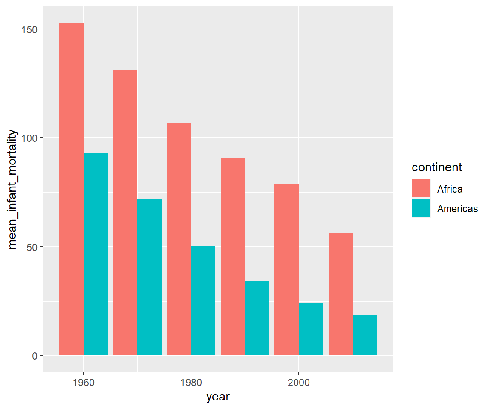

## Publication quality graphs
With ggplot2 you can create a publication quality graph that can be tweaked to finest details.

```r
## A more complicated example (for showing the capabilities of ggplot2)

west <- c("Western Europe","Northern Europe","Southern Europe",
          "Northern America","Australia and New Zealand")

pub_plot <- gapminder <- gapminder %>%
  mutate(group = case_when(
    region %in% west ~ "The West",
    region %in% c("Eastern Asia", "South-Eastern Asia") ~ "East Asia",
    region %in% c("Caribbean", "Central America", "South America") ~ "Latin America",
    continent == "Africa" & region != "Northern Africa" ~ "Sub-Saharan Africa",
    TRUE ~ "Others"))
gapminder <- gapminder %>%
  mutate(group = factor(group, levels = rev(c("Others", "Latin America", "East Asia","Sub-Saharan Africa", "The West"))))

dplyr::filter(gapminder, year%in%c(1962, 2013) & !is.na(group) &
         !is.na(fertility) & !is.na(life_expectancy)) %>%
  mutate(population_in_millions = population/10^6) %>%
  ggplot( aes(fertility, y=life_expectancy, col = group, size = population_in_millions)) +
  geom_point(alpha = 0.8) +
  guides(size=FALSE) +
  theme(plot.title = element_blank(), legend.title = element_blank()) +
  coord_cartesian(ylim = c(30, 85)) +
  xlab("Fertility rate (births per woman)") +
  ylab("Life Expectancy") +
  geom_text(aes(x=7, y=82, label=year), cex=7, color="grey") +
  facet_grid(. ~ year) +
  theme(strip.background = element_blank(),
        strip.text.x = element_blank(),
        strip.text.y = element_blank(),
   legend.position = "top")
```

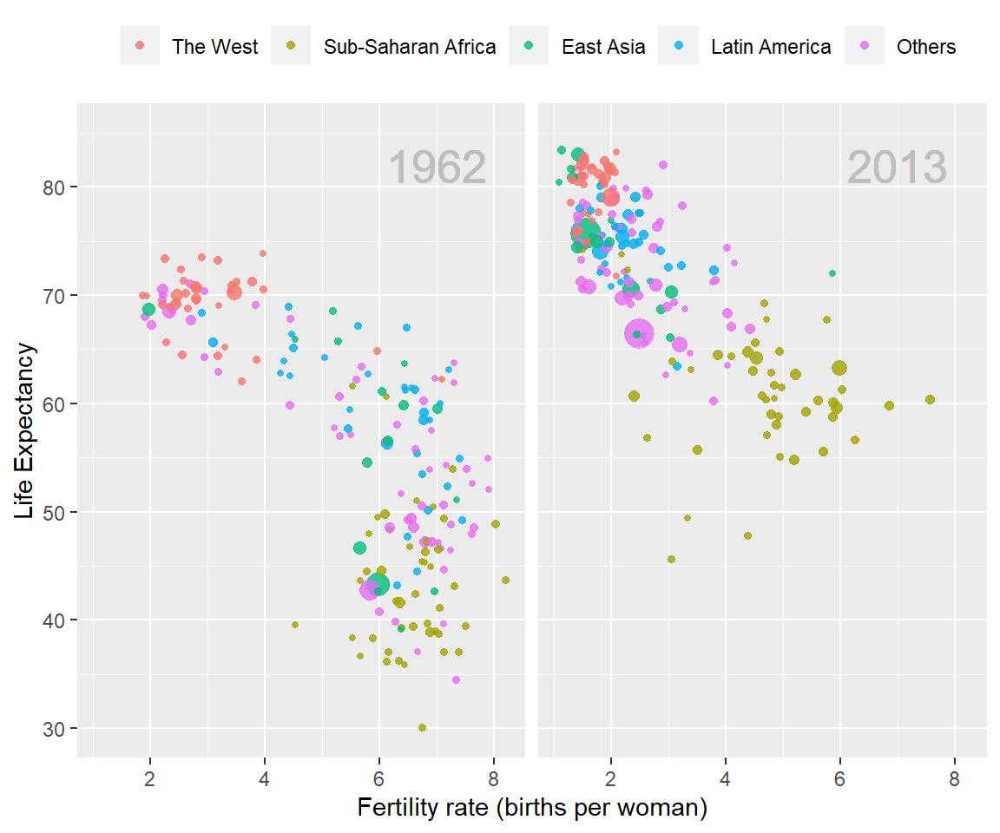

```r
pub_plot
```

```
## # A tibble: 10,545 × 10
##    country   year infant_mortality life_expectancy fertility population      gdp
##    <chr>    <int>            <dbl>           <dbl>     <dbl>      <dbl>    <dbl>
##  1 Albania   1960            115.             62.9      6.19    1636054 NA      
##  2 Algeria   1960            148.             47.5      7.65   11124892  1.38e10
##  3 Angola    1960            208              36.0      7.32    5270844 NA      
##  4 Antigua…  1960             NA              63.0      4.43      54681 NA      
##  5 Argenti…  1960             59.9            65.4      3.11   20619075  1.08e11
##  6 Armenia   1960             NA              66.9      4.55    1867396 NA      
##  7 Aruba     1960             NA              65.7      4.82      54208 NA      
##  8 Austral…  1960             20.3            70.9      3.45   10292328  9.67e10
##  9 Austria   1960             37.3            68.8      2.7     7065525  5.24e10
## 10 Azerbai…  1960             NA              61.3      5.57    3897889 NA      
## # … with 10,535 more rows, and 3 more variables: continent <fct>, region <fct>,
## #   group <chr>
```

## Data Distributions & Outliers

### Detecting outliers {-}
For this part we use a different and more simple dataset
This dataset contains 1192 observations on self-reported:

 - `height` (inch)
 - `earn` ($)
 - `sex` (gender)
 - `ed` (currently unannotated)
 - `age` (years)
 - `race` 
 

```r
heights_data <- read_csv(file = here::here("data",
                                           "heights_outliers.csv"))

heights_data
```

```
## # A tibble: 1,192 × 6
##     earn height sex       ed   age race    
##    <dbl>  <dbl> <chr>  <dbl> <dbl> <chr>   
##  1 50000   74.4 male      16    45 white   
##  2 60000   65.5 female    16    58 white   
##  3 30000   63.6 female    16    29 white   
##  4 50000   63.1 female    16    91 other   
##  5 51000   63.4 female    17    39 white   
##  6  9000   64.4 female    15    26 white   
##  7 29000   61.7 female    12    49 white   
##  8 32000   72.7 male      17    46 white   
##  9  2000   72.0 male      15    21 hispanic
## 10 27000   72.2 male      12    26 white   
## # … with 1,182 more rows
```

### Data characteristics {-}
We will focus on the variable `height` here

```r
summary_heights_data <- heights_data %>%
  group_by(sex, age) %>%
  summarise(mean_height = mean(height, na.rm = TRUE),
            min_height = min(height),
            max_height = max(height)) %>%
  arrange(desc(mean_height))

summary_heights_data[c(1:4),]
```

```
## # A tibble: 4 × 5
## # Groups:   sex [2]
##   sex      age mean_height min_height max_height
##   <chr>  <dbl>       <dbl>      <dbl>      <dbl>
## 1 female    55       141.        61.9      664. 
## 2 male      39       134.        66.6      572. 
## 3 male      55        73.2       71.7       74.8
## 4 male      91        73.1       73.1       73.1
```

From the above summary we can conclude that there are two outliers (presumably entry errors).

### <mark>**EXERCISE 10; Calculate the height in meters for each outlier in the `Console`**</mark> {-}

1 inch = 0,0254 meters

**Please discuss the solution with your neighbour** 

### Checking the frequency distribution {-}

```r
heights_data %>%
  ggplot(aes(x = height)) +
  geom_histogram(aes(stat = "identity"), bins = 200)
```

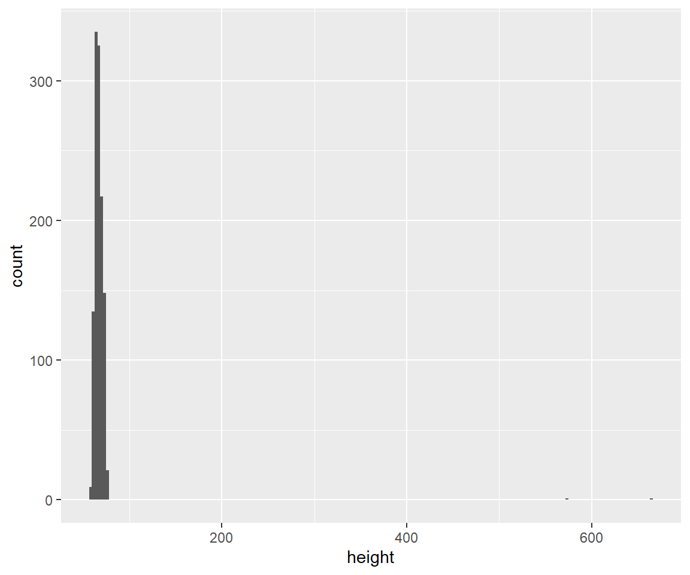

This distribution looks odd. 
When you see a large x-axis with no data plotted on it, it usually means there is an outlier. If you look carefully, you will spot two outliers around 600

### Boxplots to detect outliers {-}

```r
heights_data %>%
  ggplot(aes(y = log10(height))) +
  geom_boxplot()
```

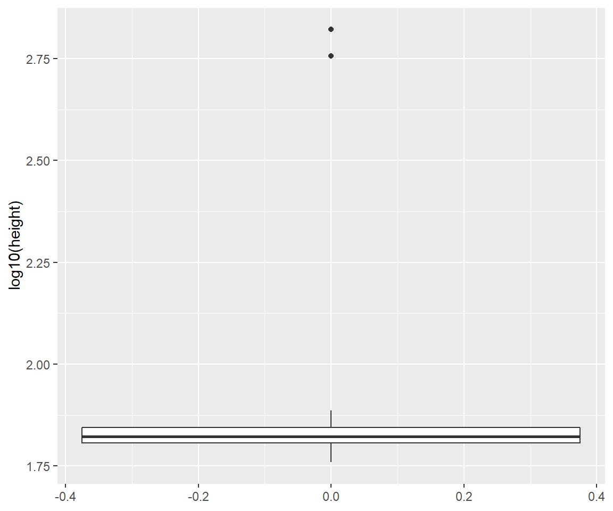

So apparantly there are two data points that are way off from the rest of the distribution. Let's remove these, using `filter()` from the `{dplyr}` package like we did before on the `gapminder` dataset.

### Identify the outliers {-}

```r
heights_data %>%
  dplyr::filter(height > 100)
```

```
## # A tibble: 2 × 6
##    earn height sex       ed   age race 
##   <dbl>  <dbl> <chr>  <dbl> <dbl> <chr>
## 1  7000   664. female    12    55 black
## 2 15000   572. male      12    39 white
```

### Boxplot with outliers removed {-}

```r
heights_data %>%
  dplyr::filter(height < 100) %>%
  ggplot(aes(y = height)) +
  geom_boxplot()
```

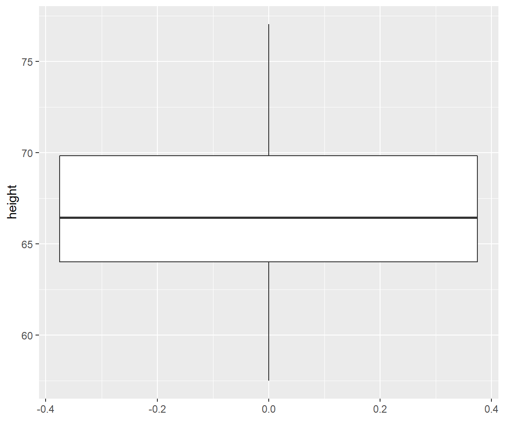

### By sex {-}

```r
heights_data %>%
  dplyr::filter(height < 100) %>%
  ggplot(aes(y = height, x = sex)) +
  geom_boxplot()
```

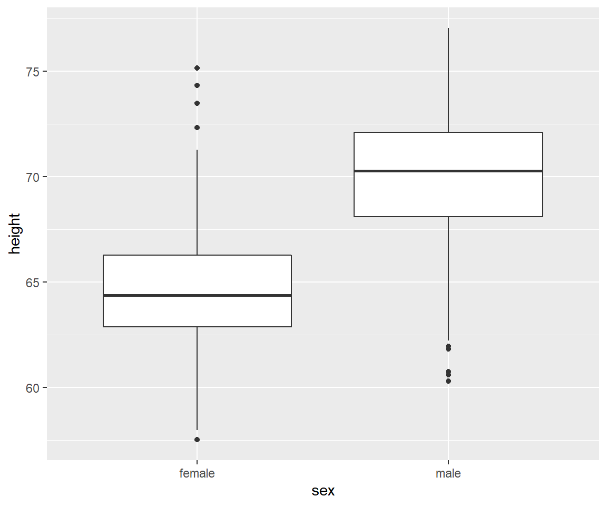

### New frequency distribution
Now let's plot a new distribution plot, this time we plot density, leaving the outlier out

```r
heights_data %>%
  dplyr::filter(height < 100) %>%
  ggplot(aes(height)) +
  geom_density(aes(y = ..density..))
```

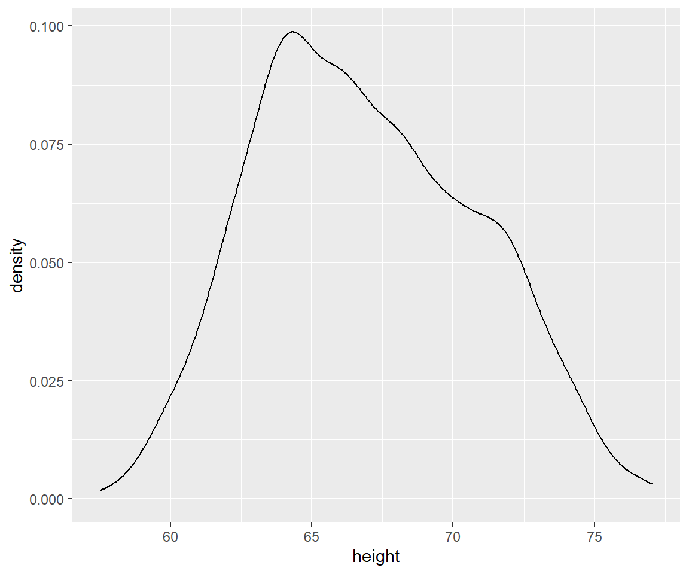

## By sex

```r
heights_data %>%
  dplyr::filter(height < 100) %>%
  ggplot(aes(height)) +
  geom_density(aes(y = ..density.., colour = sex), size = 1.5)
```

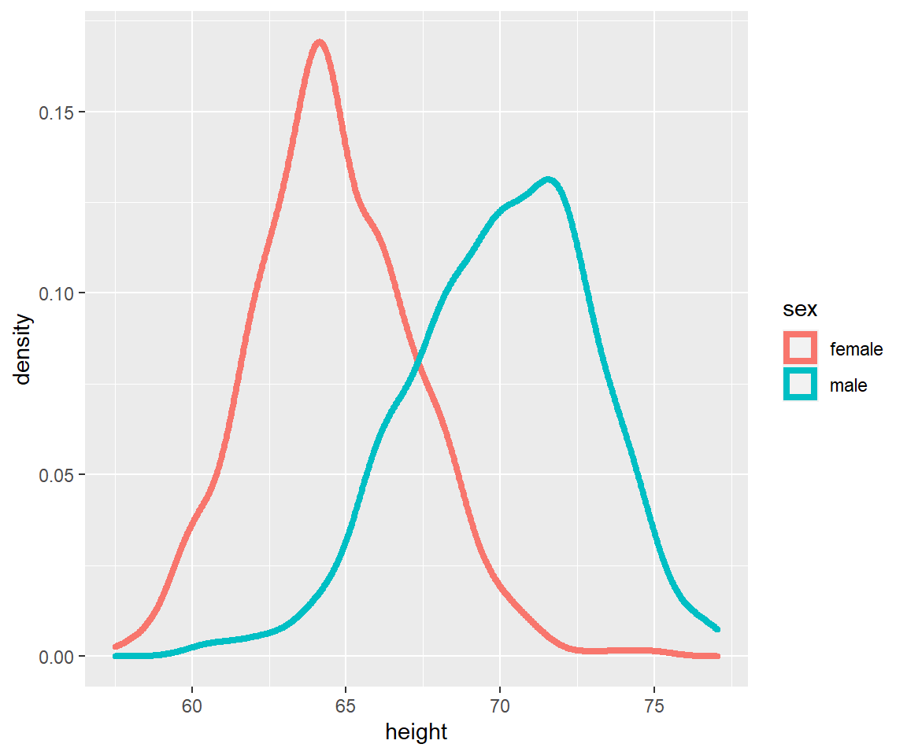


## CHAPTER EXERCISES {-}


**Generate a new RMarkdown file containing the answers to all questions below and render it to HTML. Save the file in your ./exercises/ folder under the corresponding chapter** 

### Packages {-}


### `{ggplot2}` {-}
As shown in the demo, the {ggplot2} package is a very strong tool to make plots. It is somewhat more difficult to master than other plotting systems in R, but it is much stronger and much, much more versatile.

In order to force you to study ggplot syntax, you will have to create plots in this exercise using {ggplot2} syntax only!!

### Introduction {-}
In most cases, plotting is the main tool by which you get a ‘feel’ for the data. In many cases, the plots require some work on the data first, so we will have to process the data as well. A very important part of your preliminary analysis involves knowing the distribution of the data. That is, what are its typical values, and how do they relate to one another or to another data set. Probably the easiest plotting tool for this is the histogram. This is available as the `geom_histogram()` or `geom_freypoly()` in {ggplot2}. Alternatively you can use `geom_boxplot()` to create boxplots. 

### <mark>**EXERCISE 11. Airquality data**</mark> {-}

In this exercise we will use a build-in dataset from the {datasets} package. The data can be loaded by typing 
```
airq <- datasets::airquality
```
in your script. Try it now!

You will see a new object called chicks in you Global Environment.


11A) Inspect the data

 - Are there any missing values, if yes how many? (`sum(is.na()`)
 - What types of variables do we have? (use the `str()` command)
 - Convert to a tibble with `as_tibble()`
 - Are all the variables of the right type?
 - Which variables are categorical?
 - Which are numeric?
 - Change grouping/categorical variables to facors if neccesary
 


11B) Change all variable names to lower type case

Write a line of code that changes all `names()` of the variables to lower-case. Also, replace the dot in the variable name `sola.r` for an "_". Look at the help function for the function `str_replace` from the `{stringr}` package to do this.


1C) Scatter plot of all the data

Create a plot in your Rmd script that shows all the data points. Plot the variable `month` on the x-axis and the variable `wind` on the y-axis.


11D) Overplotting

You will see that the plot contains many points that are overlaid (how do we know that they are overlaid?). How can you solve this "overplotting" problem? Write a few lines of code that shows your solution.

**TIPs**

 - Look-up overplotting in the "R for Data Science" book  or review Chapter \@ref(lab2viz) of this reader)
 - What does `alpha()` do?
 - Maybe use position = "jitter" as an extra layer in your graph
 (look at `?position = "jitter"`)


11E) Plot the relationship between wind and month with a straight line 


11F) Wind Velocity
summarize the wind velocity per month (call this `mean_month`) in a bar plot. Plot the relationship between `month` and `mean_wind`. Plot error bars on the bars
Try looking up the solution for the error bars, using Google.


### <mark>**EXERCISE 12. Overplotting solved by colours**</mark> {-}

For this exercise we wil use a new dataset "tb_burden":

The file: "/data/messy/TB_data_dictionary_2016-12-08.csv" contains additional info on the variables in the datafile.

12A) Import data
Read the file "/data/messy/TB_burden_countries_2016-12-08_messy.csv" into R with the following code:

```r
tb_burden <- read.csv(
  file = here::here(
    "data",
    "messy",
    "TB_burden_countries_2016-12-08_messy.csv"))


names(tb_burden)
```

12B) Selection of relevant variables
For the subsequent analysis we will use the following variables:
 
 `country`
 `iso3`
 `g_whoregion`
 `year`
 `e_inc_num`
 `e_mort_exc_tbhiv_num`
 `e_pop_num`
 
 Select the above variables from the dataset.
 

 
12C) Data dictionary
Load the data dictionary into R ("/data/messy/TB_data_dictionary_2016-12-08_messy.csv")

Use `dplyr::filter()` together with the `%in%` operator to pull out the descriptions of the variables from the data dictionary. Do all the variables have a discription?


```r
dictionary <- read_csv("./data/messy/TB_data_dictionary_2016-12-08.csv")

## filter solution
dplyr::filter(dictionary, variable_name %in% names(tb_data_selected))
```

### <mark>**EXERCISE 13. Exploratory graphs**</mark> {-}
Use the tuberculosis dataset from exercise 2.

13A) All data {-}
Plot the total number of Tuberculosis cases (y axis), for each country, for each year (x axis. Think about how to solve the overplotting this creates. How do you display country?

Which country has the highest number of annual TB cases?


13B) Calculate incidence per 1.000
Calculate the incidence of TB per 1.000 inhabitants, per country, per year. Plot the incendence (y axis) for each country and each year (x axis), for only those countries that have a higer incidence of more than 5 per 1000 inhabitants.


13C) Filtering from graph
Which country had the highest incidence of TB in the year 2010?


13D) Average incidence per WHO region
Show the relationship over years, between the WHO regions and the median TB incidence/1000 per region with a plot.


### <mark>**EXERCISE 14; Tubercolosis data**</mark> {-}

14A Calculate the overall TB incidence per 1000 people for each WHO region

Plot the relationship between this overall incidence and the WHO region, over the years. Compare this result with your plot under 3D.  
To study the relationship between TB incidence and socio-economical and/or geographical characteristics we will use the TB Burden data (selection of the variables) together with the Geographical/Socio-economical dataset of the World (from `{tmap}`, `data("World")`)

14B) Load World data
Load the World data from the `{tmap}` package (`data("World")`) and combine (left_join the world data to the TB_burden data (with selected variables)). Be sure to indicate the keys for the join (join by ISO3 which is present in both datasets)


```r
library(tmap)
data("World") # from the tmap package
names(World)
names(tb_burden)

World <- World %>%
  dplyr::rename(iso3 = iso_a3)

joined_data <- left_join(World, tb_data_selected, by = "iso3")
names(joined_data)

joined_data <- joined_data %>%
  mutate(incidence_1e3 = (e_inc_num/e_pop_num)*1000)
```

14C) Facets for year
Plot the relationship between the median income per capita (gdp_cap_est) per WHO region and the median TB incidence per WHO region, use facets and `alpha` to handle the years and overplotting.


### <mark>**EXERCISE 15. Histograms**</mark> {-}

15A) Two histograms 
Create histograms of the following variables of the joined data:
`incidence_1e3`
`gdp_cap_est`

Account for `g_whoregion` in your plot. Take all years together in the histograms.


15B) Turn the code of the histgrams into code that plots frequency polynomes
Maybe do a log transformation on the incidence and/or gdp? Use factes for the years.

**TIPS**
 
 - Investigate the difference between `geom_density()` and `geom_freqpoly()`


### <mark>**EXERCISE 16. Treatment Effect Relations**</mark> {-}
In this exercise we will use a build-in dataset from the {datasets} package. The data can be loaded by typing 
```
chicks <- datasets::ChickWeight
```
in your script. Try it now!

You will see a new object called chicks in you Global Environment.

```r
## load dataset ChickWeights
chicks <- datasets::ChickWeight 
```

16A) Inspect the data

 - Are there any missing values, if yes how many? (`sum(is.na()`)
 - What types of variables do we have? (use the `str()` command)
 - Convert to a tibble with `as_tibble()`
 - Are all the variables of the right type?
 - Which variables are categorical?
 - Which are numeric?
 - Change grouping/categorical variables to factors if necessary(`chicks$var <- as_factor(chicks$var)`)
 


16B) Change all variable names to lower type case

Write a line of code that changes all `names()` of the variables to lower-case. 


16C) Scatter plot of all the data

Create a plot in your Rmd script that shows all the data points. Plot the variable `time` on the x-axis and the variable `weight` on the y-axis.


16D) Overplotting

You will see that the plot contains many points that are overlaid. How can you solve this "overplotting" problem?

**TIPs**

 - Look-up overplotting in the "R for Data Science" book
 - What does `alpha()` do?
 - Maybe use geom_jitter() as an extra layer in your graph
 (look at `?geom_jitter`)


16E) Overplotting solved by colours
We could also solve the overplotting problem by using colour for each diet.
Add, `colour = diet` to the plot in such a way that you can see the diffences between the diets in one plot.

__Can you determine from this plot which diet has the strongest effect on the weight-gain per time on the chicks?__


16F) Combining "jitter" with group colours
Combining "jitter" with colours to reduce overplotting even more 
Combine adding "jitter" to the plot with asigning colours to diet.

**TIPs** 

 - Remember to `set.seed(1234)` to get a reproducible result.


16G) Solving overplotting by reducing data dimensionality: summarizing data
From the above plot it is still hard to see the trends in the data.

 - Summarize the data for each diet and make a plot on the summarized data. 
 - Again put `time` on the x-axis and the mean of the chick weight on the y-axis. 
 - Add appropriate labels to the plot, and a title.
 - Add regression curves (`geom_smooth(method = "lm"`) to the plot.

__Draw a conclusion: Which diet do you think shows the strongest effect on weight-gain over time in the investigated chicks?__

**TIPs**

 - For this you will need `dplyr::group_by()` and `dplyr::summarize`
 - call the new summarized dataframe: "chicks_summary"
 - Use `%>%` to create the "chicks_summary"
 - For this to work you will have to specify all the `aes()` arguments within the `ggplot()` call.
 


### <mark>**EXERCISE 17. Excel files - load and visualize**</mark> {-}
 
17A) Loading an Excel file
 
The data for this exercise can be found in:
`"./data/Animals.xls"`

It is an Miscrosoft Excel file containing brain and body weight of a number of animals: http://mste.illinois.edu/malcz/DATA/BIOLOGY/Animals.html 

DESCRIPTION:
Average brain and body weights for 27 species of land animals.

VARIABLES:

 - body: body weight in kg
 - brain: brain weight in g 

SIZE: 

 - Observations = 27; 
 - Variables = 2

SOURCE:
Rousseeuw, P.J. & Leroy, A.M. (1987) Robust Regression and Outlier Detection. Wiley, p. 57.

Write a code chunk that loads the file `"./data/Animals.xls"` into R. 
You may use any function you like, but you are not allowed to transform the data in any way using e.g. Excel. Name the dataframe `animals` as a datatable/dataframe/tibble in R. 

**TIPs** 
 
 - You can use the `readxl::read_excel()` function to solve this question.
 - Rember to use `library` to load the required package(s)
 - The first row that contains data is the "Mountain Beaver" observation
 - Remember that in some functions you can also set `header = FALSE`
 - The variables in this dataset need to be `animal`, `body_weigth` and `brain_weigth` and IN THAT ORDER! These are the so-called `names` of the dataframe and can be set or checked using the function `names()`
 - Remember `dplyr::select`, `dplyr::filter()`, `dplyr::group_by`, `dplyr::summarize()`
 


17B) Variable names
The `names` of a dataframe can be found or set with `names(dataframe)`. Try setting the names for the `animal` dataframe to `animal`, `body_weigth` and `brain_weigth` and IN THAT ORDER. 


17C) Subsetting
The `animals` data can be subsetted and explored by using the subsetting functions from `dplyr`.

  - Which animal has a body weight of 6654.000 kg and a brain weight of 5712.0 g?
  - Write a few lines of code that extract this information from the dataframe.


17D) Filtering
Which animal has the smallest brain weight? 
Write code that confirms this finding  
 
 **TIPs**
 
 - Use `dplyr::filter()` and `%>%` to find the answer.
 - You can also use `min(vector, na.rm = TRUE)` to find the answer. 
 - Try to write a few lines of code that answer this question with the correct output in the `Console` 


17E) Plots 
Create a plot that shows the realtionship between `body_weigth` and `brain_weight`. Create a dot plot, that shows this relationship.

**TIPs**
 
 - Remember `ggplot2` from the "Visualizations" class
 - Remember `geom_point()`
 - Remember `geom_smooth()`
 - Remember using `%>%` in conjunction with `ggplot()` and the `dplyr` verbs
 


17F) Removing ouliers 
On the basis of the plot above, construct a new plot that eliminates the data point for the animal "Brachiosaurus". What can you conclude from the relationship between body weigth and brain weigth, from this new plot? 


 From the plot, what can you conclude about the relationship. Are there any outliers?

17G) Data Transformation
Plot the relationship of the full dataset (including "Brachiosaurus"), between body weight and brain weight.
Transform the body_weight variable to a log10 scale


17H) What can you conclude from the 17G plot {-}
What happens to the relation between body_weigt and brain_weight if you excluse all dinosaurs ("Brachiosaurus", "Diplodocus" and "Triceratops") from the dataset?
**Write a short conclusion on this plot.**


<!--chapter:end:ch09-lab2aviz.Rmd-->

# Lab 2b; Literate Programming with RMarkdown {#rmarkdown}

_This chapter is best read in the source RMarkdown file_

## Credits:
https://nceas.github.io/sasap-training/materials/reproducible_research_in_r_fairbanks/index.html

## Introduction

Plain text is a great way to write information down. Plain text has some major advantages:

- Works regardless of what time you're trying to read the file, i.e. computers have and will continue to speak plain text
- Works perfectly with version control software like git. 
- Easy to read, easy to write

Markdown is a plain text format that allows for common typesetting features including:

- Text formatting (bold, italic, etc.)
- Links
- Tables
- In-line images

Without the need for spending time typesetting which is tedious and usually unnecessary. So if we want those kinds of things, we might want to use Markdown.

RMarkdown allows us to produce an output document (PDF, DOCX, website) based upon a mix of Markdown and R code.
This lets us write analyses in R as we already do but also write our reports/papers/etc. in R.
Instead of the usual loop:

- Run analysis
- Edit/update report
- Commit changes to Git-repository
- Push to Github

The loop becomes:

- Edit RMarkdown doc
- Commit changes to Git-repository
- Push to Github

This workflow fits in a 'continuous integration' workflow

...

## Good resources:

- [http://rmarkdown.rstudio.com/](http://rmarkdown.rstudio.com/)
- [http://kbroman.org/knitr_knutshell/](http://kbroman.org/knitr_knutshell/)

## Learning Outcomes

- Gain an awareness of Markdown and RMarkdown
- Author a simple RMarkdown document in RStudio

## RMarkdown Principles:

### Chunks

Chunks take options, see: https://yihui.name/knitr/options/

#### Echo and Include {-}

When writing a report, it's common to not want the R code to actually show up in the final document.
Use the `echo` chunk option to do this:

or if you want the code to run but not show anything, use `include`


#### Eval {-}

Sometimes you may just want to show some R code with nice syntax highlighting but not evaluate it:


```r
will_it_eval <- "eval?"
```

#### Cache {-}

If you know a chunk will not need to change as other parts of the document are knitted, you can cache a chunk that contains a potentially long-running or slow command or commands:


```r
library(ggplot2)
ggplot(mpg, aes(displ, hwy, color = class)) + 
  geom_point() # Some really slow plot
```

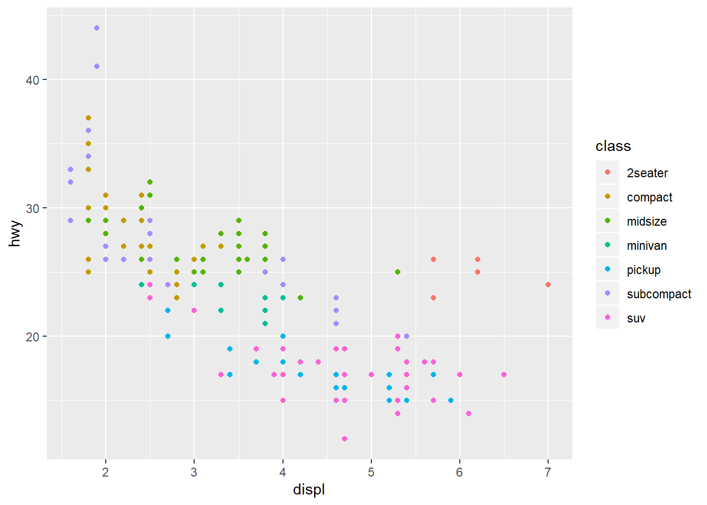

### Inline expressions in prose

You can include inline r-code in this way:

4

It evaluates to: 2 + 2 = 4

### Plots

Base graphics: Just run `plot(1:10)`
ggplot2: Run `ggplot(...))`

Customize output sizing with chunk options: `fig.width`, `fig.height`, `dpi`, `out.width`

### Tables

If you search around, there are tons of ways to do this. The most basic way and the way I almost always use is with the `kable` function from the `knitr` package:


```r
library(ggplot2)
data("mpg")
knitr::kable(head(mpg))
```


|manufacturer |model | displ| year| cyl|trans      |drv | cty| hwy|fl |class   |
|:------------|:-----|-----:|----:|---:|:----------|:---|---:|---:|:--|:-------|
|audi         |a4    |   1.8| 1999|   4|auto(l5)   |f   |  18|  29|p  |compact |
|audi         |a4    |   1.8| 1999|   4|manual(m5) |f   |  21|  29|p  |compact |
|audi         |a4    |   2.0| 2008|   4|manual(m6) |f   |  20|  31|p  |compact |
|audi         |a4    |   2.0| 2008|   4|auto(av)   |f   |  21|  30|p  |compact |
|audi         |a4    |   2.8| 1999|   6|auto(l5)   |f   |  16|  26|p  |compact |
|audi         |a4    |   2.8| 1999|   6|manual(m5) |f   |  18|  26|p  |compact |

or an interactive table

```r
library(ggplot2)
data("mpg")
DT::datatable(head(mpg))
```

```{=html}
<div id="htmlwidget-7ee92377092ed85a488a" style="width:100%;height:auto;" class="datatables html-widget"></div>
<script type="application/json" data-for="htmlwidget-7ee92377092ed85a488a">{"x":{"filter":"none","vertical":false,"data":[["1","2","3","4","5","6"],["audi","audi","audi","audi","audi","audi"],["a4","a4","a4","a4","a4","a4"],[1.8,1.8,2,2,2.8,2.8],[1999,1999,2008,2008,1999,1999],[4,4,4,4,6,6],["auto(l5)","manual(m5)","manual(m6)","auto(av)","auto(l5)","manual(m5)"],["f","f","f","f","f","f"],[18,21,20,21,16,18],[29,29,31,30,26,26],["p","p","p","p","p","p"],["compact","compact","compact","compact","compact","compact"]],"container":"<table class=\"display\">\n  <thead>\n    <tr>\n      <th> <\/th>\n      <th>manufacturer<\/th>\n      <th>model<\/th>\n      <th>displ<\/th>\n      <th>year<\/th>\n      <th>cyl<\/th>\n      <th>trans<\/th>\n      <th>drv<\/th>\n      <th>cty<\/th>\n      <th>hwy<\/th>\n      <th>fl<\/th>\n      <th>class<\/th>\n    <\/tr>\n  <\/thead>\n<\/table>","options":{"columnDefs":[{"className":"dt-right","targets":[3,4,5,8,9]},{"orderable":false,"targets":0}],"order":[],"autoWidth":false,"orderClasses":false}},"evals":[],"jsHooks":[]}</script>
```

https://rmarkdown.rstudio.com/lesson-7.html

## Output formats

RMarkdown documents can be converted into many formats, most often:

- PDF
- HTML
- Microsoft Word
- ioslides
- beamer

See more info here: http://rmarkdown.rstudio.com/lesson-9.html

You can specifically choose which output format to render to with the RStudio "Knit" button in the toolbar, or with:

```
rmarkdown::render(...)
```

We can control which output format(s) knitting will produce and even customize the options for each format separately.
To customize each output format, change the YAML frontmatter:

e.g. customize HTML and PDF output

```
---
title: "My document"
output:
  html_document:
    toc: true
    toc_float: true
  pdf_document:
    fig_caption: false
---

```

## Summary

- Markdown is a simple plain text format suitable for authoring rich documents
- RMarkdown is a slight extention of the Markdown syntax that lets us mix code and prose together
- RMarkdown is a key part of the R reproducible science scene
- RStudio is a great way to author RMarkdown documents
- Later on in this workshop, we'll see how to deal with citations so we can write academic manuscripts

### <mark>**EXERCISE 1; Create a short report**</mark> {-}

 1. Find a relevant dataset  that you recently found or are busy with at the moment*
 1. Write a short Rmd report where you LOAD and VISUALIZE (create at least 3 different graphs) the data in an Rmd report.
 1. Go over this tutorial: [RStudio Params in Rmd](https://rmarkdown.rstudio.com/developer_parameterized_reports.html%23parameter_types%2F#overview)
 1. Define one parameter in your analysis
 1. Knit two different reports of your parameterized Rmd (with two different values for one paramter defined) and sent them to the teacher
 
*If you do nog have a dataset, you can use this one:
"./data/API_AG.LND.FRST.K2_DS2_en_csv_v2_716262"

**Please send me the your report for feedback by email, or place it on you github account and send me the link.**


<!--chapter:end:ch10-lab2brmarkdown.Rmd-->

# Lab 3A: Data Wrangling {#lab3awrangling}


## Packages

```r
library(tidyverse)
library(dslabs)
```

## Citations

```r
citation(package = "tidyverse")
citation(package = "dplyr")
```

## Case Data

 * Pertussis outbreaks from The World Health Organization
 * http://data.euro.who.int/cisid/?TabID=463987
 * http://ecdc.europa.eu/sites/portal/files/documents/Pertussis%20AER.pdf
 * The data used in this presentation has been constructed from the interactive database tool hosted at: http://data.euro.who.int/cisid/ 
 * A selection was made for all available countries and all available years, for the number of cases reported to the WHO for Whooping Cough - pertussis infections
 * The file is avaialble in `./data/CISID_pertussis_10082018.csv`
 * The values included here in the dataset are the total reported cases, per country per year
 * At the start of the file there are remarks and metadata indicated by `#`
 * Missing values are indicated with an empty string

## Linux `Terminal` command from R
You can call Linux Terminal commands from the R Console using the R function `system()`. You need to wrap you Terminal command inside character quotes. This is especially helpful if you want to inspect a very large file. Here I show it with the pertussis dataset for demo puposes.

```r
system("head -20 
       data/CISID_pertussis_10082018.csv", 
       intern = TRUE) %>% 
  enframe %>%
  head(20)
```

The delimeter is `,` and we indeed see the comments at the start of the file. 

### Read data {-}

```r
pertussis_data <- read_csv(
  file = here::here( 
                  "data", 
                  "CISID_pertussis_10082018.csv"),
                           comment = "#", 
                           na = c("", " ")
  )
```

### Inspect data {-}

```r
pertussis_data
```

```
## # A tibble: 54 × 41
##     ...1 ...2     `1980` `1981` `1982` `1983` `1984` `1985` `1986` `1987` `1988`
##    <dbl> <chr>    <lgl>  <lgl>  <lgl>  <lgl>  <lgl>  <lgl>  <lgl>  <lgl>  <lgl> 
##  1     2 Albania  NA     NA     NA     NA     NA     NA     NA     NA     NA    
##  2     5 Andorra  NA     NA     NA     NA     NA     NA     NA     NA     NA    
##  3    10 Armenia  NA     NA     NA     NA     NA     NA     NA     NA     NA    
##  4    13 Austria  NA     NA     NA     NA     NA     NA     NA     NA     NA    
##  5    14 Azerbai… NA     NA     NA     NA     NA     NA     NA     NA     NA    
##  6    19 Belarus  NA     NA     NA     NA     NA     NA     NA     NA     NA    
##  7    20 Belgium  NA     NA     NA     NA     NA     NA     NA     NA     NA    
##  8    26 Bosnia … NA     NA     NA     NA     NA     NA     NA     NA     NA    
##  9    31 Bulgaria NA     NA     NA     NA     NA     NA     NA     NA     NA    
## 10    51 Croatia  NA     NA     NA     NA     NA     NA     NA     NA     NA    
## # … with 44 more rows, and 30 more variables: 1989 <lgl>, 1990 <dbl>,
## #   1991 <dbl>, 1992 <dbl>, 1993 <dbl>, 1994 <dbl>, 1995 <dbl>, 1996 <dbl>,
## #   1997 <dbl>, 1998 <dbl>, 1999 <dbl>, 2000 <dbl>, 2001 <dbl>, 2002 <dbl>,
## #   2003 <dbl>, 2004 <dbl>, 2005 <dbl>, 2006 <dbl>, 2007 <dbl>, 2008 <dbl>,
## #   2009 <dbl>, 2010 <dbl>, 2011 <dbl>, 2012 <dbl>, 2013 <dbl>, 2014 <lgl>,
## #   2015 <lgl>, 2016 <lgl>, 2017 <lgl>, 2018 <lgl>
```

```r
names(pertussis_data)
```

```
##  [1] "...1" "...2" "1980" "1981" "1982" "1983" "1984" "1985" "1986" "1987"
## [11] "1988" "1989" "1990" "1991" "1992" "1993" "1994" "1995" "1996" "1997"
## [21] "1998" "1999" "2000" "2001" "2002" "2003" "2004" "2005" "2006" "2007"
## [31] "2008" "2009" "2010" "2011" "2012" "2013" "2014" "2015" "2016" "2017"
## [41] "2018"
```

### Prepare the data with `{tidyr}` and `{dplyr}` {-}
The data will be prepared for Exploratory Data Analysis using two core packages of the tidyverse. `{tidyr}` is for reshaping data, `{dplyr}` is for wrangling data.

### Characteristics of the pertussis dataset {-}

- The first few lines of the file have comments indicated with `#`
- There are 53 countries in the dataset
- There is no data for the years 1980-1989 and 2014-2018
- The data is not in `tidy` format
- Missing values are indicated with __empty cells__
- It is not a good idea to have a column name starting with a digit; why?


```r
pertussis_data
```

```
## # A tibble: 54 × 41
##     ...1 ...2     `1980` `1981` `1982` `1983` `1984` `1985` `1986` `1987` `1988`
##    <dbl> <chr>    <lgl>  <lgl>  <lgl>  <lgl>  <lgl>  <lgl>  <lgl>  <lgl>  <lgl> 
##  1     2 Albania  NA     NA     NA     NA     NA     NA     NA     NA     NA    
##  2     5 Andorra  NA     NA     NA     NA     NA     NA     NA     NA     NA    
##  3    10 Armenia  NA     NA     NA     NA     NA     NA     NA     NA     NA    
##  4    13 Austria  NA     NA     NA     NA     NA     NA     NA     NA     NA    
##  5    14 Azerbai… NA     NA     NA     NA     NA     NA     NA     NA     NA    
##  6    19 Belarus  NA     NA     NA     NA     NA     NA     NA     NA     NA    
##  7    20 Belgium  NA     NA     NA     NA     NA     NA     NA     NA     NA    
##  8    26 Bosnia … NA     NA     NA     NA     NA     NA     NA     NA     NA    
##  9    31 Bulgaria NA     NA     NA     NA     NA     NA     NA     NA     NA    
## 10    51 Croatia  NA     NA     NA     NA     NA     NA     NA     NA     NA    
## # … with 44 more rows, and 30 more variables: 1989 <lgl>, 1990 <dbl>,
## #   1991 <dbl>, 1992 <dbl>, 1993 <dbl>, 1994 <dbl>, 1995 <dbl>, 1996 <dbl>,
## #   1997 <dbl>, 1998 <dbl>, 1999 <dbl>, 2000 <dbl>, 2001 <dbl>, 2002 <dbl>,
## #   2003 <dbl>, 2004 <dbl>, 2005 <dbl>, 2006 <dbl>, 2007 <dbl>, 2008 <dbl>,
## #   2009 <dbl>, 2010 <dbl>, 2011 <dbl>, 2012 <dbl>, 2013 <dbl>, 2014 <lgl>,
## #   2015 <lgl>, 2016 <lgl>, 2017 <lgl>, 2018 <lgl>
```

**Discuss the output with you neighbour**

Try solving the questions:

 - Are the rows observations?
 - Are the columns variables?
 - Is there a single value in each cell?

## Tidy data 
To tidy the pertussis data we need to `gather` the `year` columns. We create a long formatted dataframe containing all the years in one column, all the `annual_pertussis_cases` in another, and all the countries in a seperate column. Each combination will be repated over the new columns automatically.


```r
## try the code below, why does it fail?
pertussis_data_tidy <- pertussis_data %>% 
  gather(1980:2018, key = "year", value = "annual_pertussis_cases")
```

To reference names that contain 'digits' or other 'special characters'

``` ` ``` 


```r
pertussis_data_tidy <- pertussis_data %>% 
  gather(`1980`:`2018`, key = "year", 
                        value = "annual_pertussis_cases") %>%
  mutate(annual_pertussis_cases = as.numeric(annual_pertussis_cases
                                             ))
pertussis_data_tidy
```

```
## # A tibble: 2,106 × 4
##     ...1 ...2                   year  annual_pertussis_cases
##    <dbl> <chr>                  <chr>                  <dbl>
##  1     2 Albania                1980                      NA
##  2     5 Andorra                1980                      NA
##  3    10 Armenia                1980                      NA
##  4    13 Austria                1980                      NA
##  5    14 Azerbaijan             1980                      NA
##  6    19 Belarus                1980                      NA
##  7    20 Belgium                1980                      NA
##  8    26 Bosnia and Herzegovina 1980                      NA
##  9    31 Bulgaria               1980                      NA
## 10    51 Croatia                1980                      NA
## # … with 2,096 more rows
```

## The pipe or "%>%"


### Pipes {-}

 - The pipe, `%>%`, comes from the __magrittr__ package by Stefan Milton Bache
 - Load it explicitly:


```r
library(magrittr)
```

### Using the pipe (`%>%`) {-}

No pipe:

`variable_new <- do_something(variable_old)`

Pipe:

`variable_new <- variable_old %>% 
  do_something(.)`

or the same:

`variable_new <- variable_old %>% 
  do_something()`

The `.` (dot) is a placeholder for the 'old' variable. If you need to explicitely refer to something inside `variable_old` e.g. a column in dataframe you can use `.$colum_name` 

## The `{dplyr}` package in detail

_Subsetting, filtering, selecting, summarizing, sorting data(frames)_

### the {dplyr} package {-}
The dplyr package makes these steps fast and easy:

* dplyr simplifies how you can think about common data manipulation tasks.
* Simple "verbs", functions that correspond to the most common data manipulation tasks, to help you translate those thoughts into code.
* It uses efficient data storage backends, so you spend less time waiting for the computer.

### Data bases can be connected to dplyr {-}

 * Besides in-memory data frames
 * {dplyr} also connects to out-of-memory, remote databases. 
 * By translating your R code into the appropriate SQL
 * Allows you to work with both types of data using the same set of tools.

__dplyr can work with data frames as is, but if you're dealing with large data, it's worthwhile to convert them to a `tbl_df`: this is a wrapper around a data frame that won't accidentally print a lot of data to the screen.__

### Verbs {-}

`{dplyr}` aims to provide a function for each basic verb of data manipulation:

* `select()` (and `rename()`)
* `left_join()` (`full_join()`, `anti_join()`, `right_join()`)
* `filter()` (and `slice()`)
* `arrange()`
* `distinct()`
* `mutate()` (and `transmute()`)
* `summarise()`
* `sample_n()` (and `sample_frac()`)


#### `dplyr::rename()` & `dplyr::select()` {-}
For Renaming variables (`rename()`)

```r
names(pertussis_data_tidy)
```

```
## [1] "...1"                   "...2"                   "year"                  
## [4] "annual_pertussis_cases"
```

```r
## we can `rename()` a variable and `select()` variables
pertussis_data_tidy <- pertussis_data_tidy %>%
  dplyr::rename(some_strange_index = `...1`,
       country = `...2`)

pertussis_data_tidy %>% head(2)
```

```
## # A tibble: 2 × 4
##   some_strange_index country year  annual_pertussis_cases
##                <dbl> <chr>   <chr>                  <dbl>
## 1                  2 Albania 1980                      NA
## 2                  5 Andorra 1980                      NA
```

Dropping the column "some_strange_index (`select()`)

```r
pertussis_data_tidy <- pertussis_data_tidy %>%
  dplyr::select(country,
          year,
          annual_pertussis_cases)

pertussis_data_tidy %>% head(2)
```

```
## # A tibble: 2 × 3
##   country year  annual_pertussis_cases
##   <chr>   <chr>                  <dbl>
## 1 Albania 1980                      NA
## 2 Andorra 1980                      NA
```

Using `-` to drop specific column(s) will also work

```r
only_cases <- pertussis_data_tidy %>%
  dplyr::select(-c(country, year))

pertussis_data_tidy %>% head(2)

## When selecting multiple columns, construct a vector with `c()`
## like select(-c(columns_1, columns_2, column_3))
```

#### -- INTERMEZZO -- Creating a joined table {-}
Before we start playing with the other `{dplyr}` verbs I would like for  you to have a more complex dataset to practice with. Here we create one joining the `gapminder` and our `pertussis` data.

## Join pertussis with gapminder data
Here we join the pertussis data with the `gapminder` data though an `inner_join()`. `{dplyr}` has many join function, which we will not go into detail here. For more information and a tutorial see:
http://stat545.com/bit001_dplyr-cheatsheet.html


```r
data("gapminder", package = "dslabs")
gapminder <- gapminder %>% as_tibble()
```

#### Using `inner_join()` from `{dplyr}` {-}
When joining tables you need at least one shared variable, that has the same name in all tables you want to join. We call this variable (or variables) the (primary) `key`s. Here we use `country` and `year` as key to join only those observations that are fully shared for both `key`s in both datasets (`inner_join`) 


```r
# pertussis_data_tidy
# gapminder
gapminder$year <- as.character(gapminder$year)
gapminder$country <- as.character(gapminder$country)
pertussis_data_tidy$country <- as.character(pertussis_data_tidy$country)

join <-   dplyr::inner_join (gapminder, pertussis_data_tidy, by = c("country", "year")) %>%
  na.omit()
join
```

```
## # A tibble: 861 × 10
##    country   year  infant_mortality life_expectancy fertility population     gdp
##    <chr>     <chr>            <dbl>           <dbl>     <dbl>      <dbl>   <dbl>
##  1 Albania   1990              35.1            73.3      2.97    3281453 3.22e 9
##  2 Armenia   1990              42.5            70.1      2.54    3544695 2.82e 9
##  3 Austria   1990               8              75.7      1.46    7706571 1.47e11
##  4 Azerbaij… 1990              75.5            65.6      2.97    7216503 8.95e 9
##  5 Belarus   1990              13.5            70.5      1.89   10231983 1.44e10
##  6 Belgium   1990               8.3            76        1.58    9978241 1.87e11
##  7 Bulgaria  1990              18.4            71.4      1.77    8821111 1.46e10
##  8 Croatia   1990              11.2            72.6      1.67    4776374 2.51e10
##  9 Cyprus    1990               9.9            76.8      2.41     766611 6.19e 9
## 10 Czech Re… 1990              12.7            71.8      1.82   10323701 5.63e10
## # … with 851 more rows, and 3 more variables: continent <fct>, region <fct>,
## #   annual_pertussis_cases <dbl>
```
*Now we are ready to start exploring and manipulating this dataset and maybe create some visualizations as we go along!*

#### `dplyr::filter()` {-}
Subsetting data with `filter()`. Filter all data for the country 'The Netherlands'

```r
# join$year %>% as_factor %>% levels()
# join$country %>% as_factor() %>% levels()
netherlands <- join %>%
  dplyr::filter(country == "Netherlands")
netherlands
```

```
## # A tibble: 20 × 10
##    country     year  infant_mortality life_expectancy fertility population     gdp
##    <chr>       <chr>            <dbl>           <dbl>     <dbl>      <dbl>   <dbl>
##  1 Netherlands 1990               6.8            77        1.62   14915139 2.82e11
##  2 Netherlands 1991               6.5            77.2      1.61   15019184 2.89e11
##  3 Netherlands 1992               6.3            77.3      1.59   15128288 2.94e11
##  4 Netherlands 1993               6.1            77.2      1.57   15239262 2.97e11
##  5 Netherlands 1994               5.8            77.5      1.57   15347792 3.06e11
##  6 Netherlands 1995               5.7            77.6      1.53   15450803 3.16e11
##  7 Netherlands 1996               5.5            77.6      1.53   15546647 3.27e11
##  8 Netherlands 1997               5.3            77.9      1.56   15636131 3.41e11
##  9 Netherlands 1998               5.3            78.1      1.63   15721627 3.54e11
## 10 Netherlands 1999               5.2            78        1.65   15806771 3.70e11
## 11 Netherlands 2000               5.1            78.1      1.72   15894016 3.85e11
## 12 Netherlands 2001               5              78.3      1.71   15984365 3.92e11
## 13 Netherlands 2002               4.9            78.5      1.73   16076427 3.93e11
## 14 Netherlands 2004               4.6            79.1      1.73   16253397 4.03e11
## 15 Netherlands 2005               4.5            79.6      1.71   16331646 4.11e11
## 16 Netherlands 2006               4.3            79.9      1.72   16401105 4.25e11
## 17 Netherlands 2007               4.2            80.2      1.72   16463031 4.42e11
## 18 Netherlands 2008               4              80.3      1.77   16519862 4.50e11
## 19 Netherlands 2009               3.8            80.6      1.79   16575173 4.34e11
## 20 Netherlands 2011               3.6            80.9      1.76   16689863 4.46e11
## # … with 3 more variables: continent <fct>, region <fct>,
## #   annual_pertussis_cases <dbl>
```

#### Booleans {-}
Boolans such as `AND`, `OR` and `NOT` can be used to call multiple filter argument. You need to be explicit if you use them:

Using booleans with `filter()`

```r
#join$year %>% as_factor %>% levels()
#join$country %>% as_factor() %>% levels()

booleans_demo <- join %>%
  dplyr::filter(country == "Netherlands" |
         country == "Belarus" &
         year == "1990" |                 ## | is OR in R
         year == "1995" &                 ## & is AND in R   
         !annual_pertussis_cases < 100)   ## ! is NOT in R (not smaller                                                             than 100)
booleans_demo
```

```
## # A tibble: 40 × 10
##    country   year  infant_mortality life_expectancy fertility population     gdp
##    <chr>     <chr>            <dbl>           <dbl>     <dbl>      <dbl>   <dbl>
##  1 Belarus   1990              13.5            70.5      1.89   10231983 1.44e10
##  2 Netherla… 1990               6.8            77        1.62   14915139 2.82e11
##  3 Netherla… 1991               6.5            77.2      1.61   15019184 2.89e11
##  4 Netherla… 1992               6.3            77.3      1.59   15128288 2.94e11
##  5 Netherla… 1993               6.1            77.2      1.57   15239262 2.97e11
##  6 Netherla… 1994               5.8            77.5      1.57   15347792 3.06e11
##  7 Albania   1995              29.1            73.7      2.72    3106727 2.83e 9
##  8 Belarus   1995              14.4            68.2      1.47   10159731 9.38e 9
##  9 Bosnia a… 1995              12.3            67        1.53    3879278 1.62e 9
## 10 Croatia   1995               8.7            73        1.52    4616762 1.82e10
## # … with 30 more rows, and 3 more variables: continent <fct>, region <fct>,
## #   annual_pertussis_cases <dbl>
```

Conditional filtering. Conditions such as:

 - `>` or `>=` (larger than, or larger or eual to), 
 - `<` or `<=` (smaller than, or smaller or equal to) 
 - `==` (equal to) 
 - `!=` (not qual to)

Can be built into a `filter()` or `select()` call as we have seen above.
Let's apply this to our dataset in more detail. To match multiple filter statements you can use 

`%in%`

This shorthand is synonym for `match()` and takes a vector of values and a table (variable names in our case). 

Look at `?%in%` for more detail amd help

#### Example for using `%in%` (match) {-}

```r
numbers <- tribble(
  ~number_1, ~number_2,
  1,          2,
  3,          4,
  5,          6
)  

match_vector <- c(1,3)
numbers %>% dplyr::filter(number_1 %in% match_vector)
```

```
## # A tibble: 2 × 2
##   number_1 number_2
##      <dbl>    <dbl>
## 1        1        2
## 2        3        4
```

Generalized `%in%` looks like
```
values_you_want_to_match_against (variable name) %in% values_to_match (vector)
```

**Discuss with you neighbour**
Write a filter statement using the `join` data that:

 - filters only those countries that have more than 3000 annual cases for pertussis infection. 
 - Use only data between year 1990 and 2010 
 - The resulting table must only contain the variables `year`, `country` and `annual_pertussis_cases` in that order
 - Create a plot that shows that your code has worked


```r
## first define the values to match against
years <- c(1990:2010) %>% as.character()
## than do the filtering using %in%
join_filtered <- join %>%
  dplyr::filter(annual_pertussis_cases > 3000 &
         year %in% years) %>%
  dplyr::select(year,
         country,
         annual_pertussis_cases)

join_filtered %>%
  ggplot(aes(x = year,
             y = annual_pertussis_cases)) +
  geom_point(aes(colour = country)) +
  geom_line(aes(group = country, colour = country)) +
  theme(axis.text.x = element_text(angle = -90, hjust = 1))
```


#### `dplyr::arrange()` {-}
Sorting data with `arrange()`

 - Sort(rank) your data ascending or descending  
 - `{dplyr}` verb to use is `arrange()`, 
 - In conjunction with the `desc()` function if you want to rank in descending order 
 - `arrange()` takes one or multiple variable names for which you want to sort

#### Example `arrange()` {-}

```r
## ascending
join_filtered %>%
  arrange(annual_pertussis_cases)
```

```
## # A tibble: 61 × 3
##    year  country annual_pertussis_cases
##    <chr> <chr>                    <dbl>
##  1 2002  Norway                    3170
##  2 1992  Ukraine                   3363
##  3 1997  Italy                     3364
##  4 1994  Ukraine                   3374
##  5 2000  Norway                    3417
##  6 2010  Norway                    3565
##  7 1996  Spain                     3577
##  8 1998  Italy                     3632
##  9 1995  Spain                     3741
## 10 1999  Italy                     3797
## # … with 51 more rows
```

```r
## descending
join_filtered %>%
  arrange(desc(annual_pertussis_cases))
```

```
## # A tibble: 61 × 3
##    year  country     annual_pertussis_cases
##    <chr> <chr>                        <dbl>
##  1 1994  Switzerland                  26000
##  2 1995  Switzerland                  20000
##  3 1991  Italy                        19356
##  4 1990  Italy                        16992
##  5 1995  Italy                        14359
##  6 1994  Italy                        13360
##  7 1994  Sweden                       13187
##  8 1997  Switzerland                  13000
##  9 1998  Switzerland                  13000
## 10 1993  Sweden                       11542
## # … with 51 more rows
```
Apparently the worst `pertussis` year was 1994 in Switzerland?

#### `dplyr::mutate()` {-}
Changing variables on the basis of a computation (`mutate()`)
Sometimes you want to change a variable by mutation e.g.:

 - Change type of the variable
 - Compute a new variable using two exisiting ones
 - Do a mathmatical transformation (e.g. `log10()` of `log2()`)
 - ... something else that mutates a variable
 
You can do two things:
 
 1) Overwrite an existing variable with the newly mutated one
 2) Add a newly mutated variable to the existing data
 
#### Example `mutate()` {-}
The annual pertussis cases is reported as an absolulte number per year. Using the population size from the `gapminder` dataset, we can calculate the number of pertussis cases per 100.000 people in a country with `mutate()`  

```r
join_new <- join %>% 
  dplyr::mutate(incidence = 
                  (annual_pertussis_cases/population)*100000) %>%
  dplyr::select(incidence, 
         annual_pertussis_cases, 
         country, year) %>%
  arrange(desc(incidence))
join_new 
```

```
## # A tibble: 861 × 4
##    incidence annual_pertussis_cases country     year 
##        <dbl>                  <dbl> <chr>       <chr>
##  1      374.                  26000 Switzerland 1994 
##  2      285.                  20000 Switzerland 1995 
##  3      183.                  13000 Switzerland 1997 
##  4      183.                  13000 Switzerland 1998 
##  5      169.                   7737 Norway      2004 
##  6      163.                  11500 Switzerland 1996 
##  7      154.                  11000 Switzerland 1999 
##  8      150.                  13187 Sweden      1994 
##  9      141.                   6587 Norway      2006 
## 10      133.                  11432 Sweden      1991 
## # … with 851 more rows
```

Plotting the cases/100.000

```r
pop_size_corrected <- join_new %>%
  dplyr::filter(country == "Netherlands" | country == "Norway") %>%
  ggplot(aes(x = year, 
             y = incidence)) +
  geom_line(aes(group = country, colour = country)) +
  theme(axis.text.x = element_text(angle = -90, hjust = 1))
```

Let's see the difference between correcting for population size or not

```r
pop_size_uncorrected <- join %>%
  dplyr::filter(country == "Netherlands" | country == "Norway") %>%
  ggplot(aes(x = year, 
             y = annual_pertussis_cases)) +
  geom_line(aes(group = country, colour = country)) +
  theme(axis.text.x = element_text(angle = -90, hjust = 1))
```

Plotting two graphs in a panel

```r
cowplot::plot_grid(pop_size_uncorrected,
                   pop_size_corrected)
```

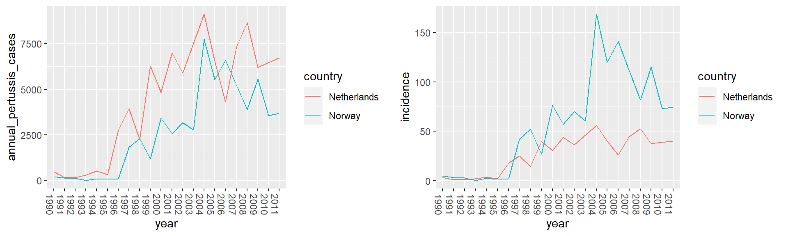

**Discuss with you neighbour**

Using `dplyr::mutate()`

 - Calculate the log10 of the population in a new variable called `log10_pop`
 - Add this new variable to the `join` dataset  
 - Create a plot using this new `log10_pop` variable


```r
join %>% 
  dplyr::mutate(log10_pop = log10(population)) %>%
  ggplot(aes(x = gdp,
             y = log10_pop)) +
  geom_point(aes(colour = continent)) 
```


```r
#+
 # facet_wrap(~year)
```
 
#### Summarize data with `dplyr::summarise()` {-}
Summarizing data is an important step in Exploratory Data Analysis. Especially if you have high deminsional data, summarizing might lead you to interesting findings. It comes at a price howver, you also discard information, so beware!

#### Example `dplyr::summarise()` {-}

```r
summary_plot <- join %>%
  group_by(country) %>%
  summarise(total_pertussis_cases = sum(annual_pertussis_cases)) %>%
  ggplot(aes(x = reorder(as_factor(country), total_pertussis_cases),
             y = total_pertussis_cases)) +
  geom_point() +
  coord_flip() +
  ylab("Total pertussis cases from 1990 - 2013") +
  xlab("Country")
summary_plot
```

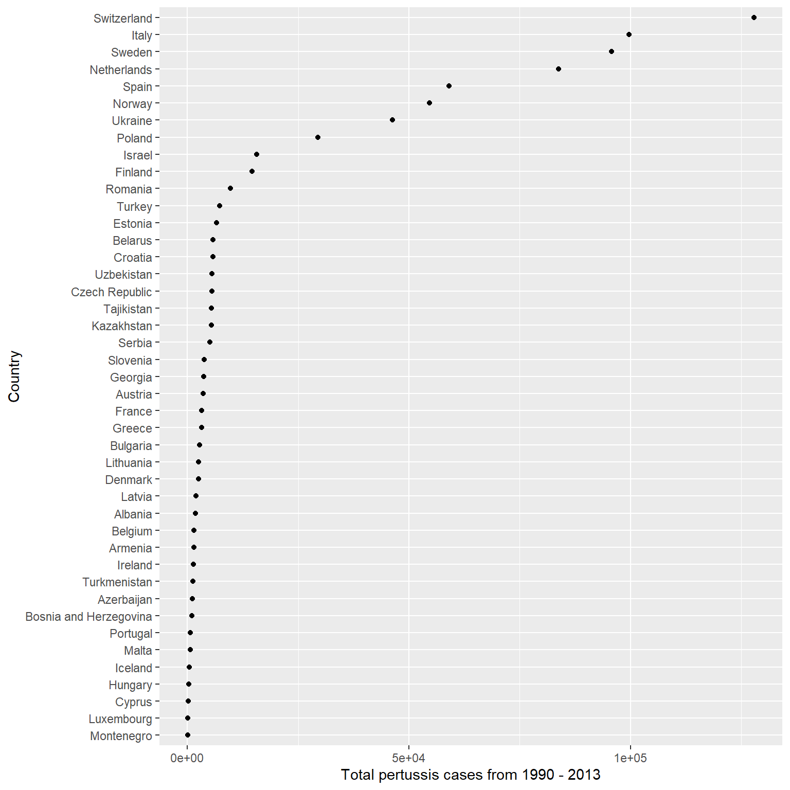

### Case 1; Which country has the highest total number of pertussis cases, over the years?

Create a code chuk below that:
 
 - Groups the data by `gdp`, `continent` and `year` (use the `gapminder` dataset)
 - Calculate the total population and the total gdp for each continent and each year
 - Plot the data in a graph that shows the relationship between year, continent, total gdp per continent and total population per continent.
 
**TIP** You might want to map population-size to the size of the datapoints 


```r
## your answer goes here --->
```


```r
plot <- gapminder %>%
  group_by(year, continent) %>%
  summarise(total_population = sum(population),
            total_gdp = sum(gdp), na.rm = TRUE) %>%
    ggplot(aes(x = year,
               y = total_gdp)) +
  geom_point(aes(colour = continent, size = total_population)) +
  coord_flip()
plot
```

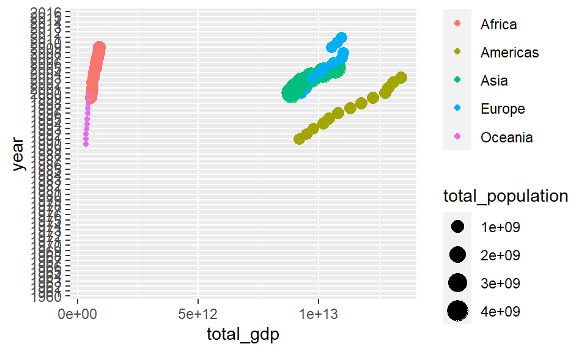
 
### Case 2; Is there a relationship between infant mortality and pertussis cases?  

**Write a code chunk below:**
 
 - Using `{ggplot2}`
 - Plot `annual_pertussis_cases` againt `infant_mortality`
 - Filter only for "Belarus" and "Netherlands"
 - Use all available data for these countries
 - Do not scroll ahead
 - What do you think is going on with this relationship?
 - Try using `colour = year` in your code
 - Try using `facet`s
 
## **ONE POSSIBLE SOLUTION**

```r
names(join)
```

```
##  [1] "country"                "year"                   "infant_mortality"      
##  [4] "life_expectancy"        "fertility"              "population"            
##  [7] "gdp"                    "continent"              "region"                
## [10] "annual_pertussis_cases"
```

```r
join %>%
  dplyr::filter(country == "Netherlands" |
         country == "Belarus") %>%
      ggplot(aes(x = annual_pertussis_cases,
               y = infant_mortality)) +
      geom_point(aes(colour = year)) +
  geom_smooth(method = "lm") +
  facet_wrap(~ country, scales = "free")
```

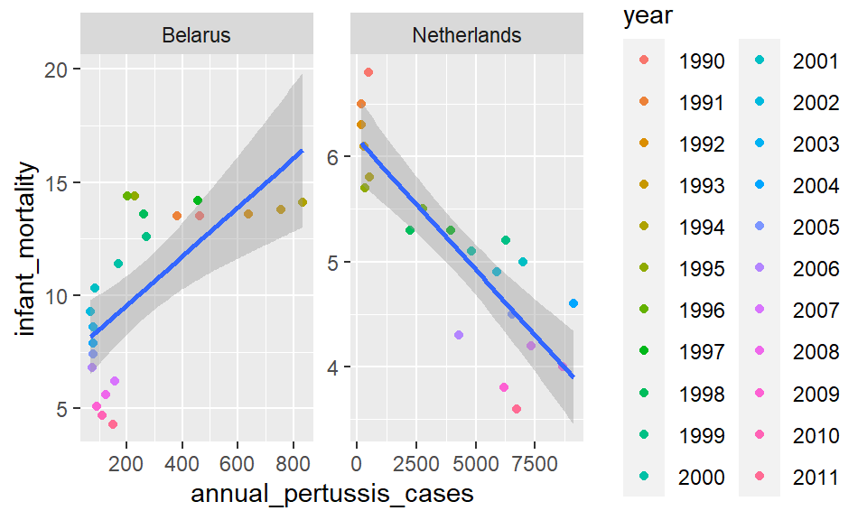

## Other data sources
dplyr works with data that is stored in other ways, like data tables, databases and multidimensional arrays.

To see a tutorial: https://db.rstudio.com/dplyr/ 

## EXERCISES {-}


__Write an Rmd file, containing code chunks (if applicable) and answer all the questions below. Store the file in a folder called: "./answers_exercises" in your course project folder. Give this file the same name as the title of the current Rmd file__

## The exercise data {-}

For this exercise we use the "heights" dataset.
This dataset contains heights, weights, income and ethnicity information. The information for the variables that are needed for this exercise are in the file "annotations_height.txt".

It was downloaded from:

https://github.com/rstudio/webinars/tree/master/15-RStudio-essentials/4-Projects

Load the data with the following code

```r
library(tidyverse)

heights_file <- here::here("data", "heights.RDS")
heights <- read_rds(file = heights_file)
head(heights)
heights
heights_tib <- as_tibble(heights)
```

### <mark>**Exercise 1; Data inspection**</mark> {-}

1A) `head()` and `tail()`
Use the `head` and `tail` functions. The datset contains 3988 observations.   

 - What types of variables are present in the data.
 - Focus on the variables `id` `income`, `height`, `weight`, `sex` and `race`


1B) Call the function `summary()` on the data. {-}
What do you notice when you look at the max. and min. value for the `height`. For nicer printing (in an Rmd output file) you can use `pander::pander()` or `knitr::kable()`


1C) Missing values
Are there any missing values in the data? Determine the number of missing values. Try creating a plots using the `{naniar}` package.

 
### <mark>**Exercise 2; Selecting variables with {dplyr} and missing values**</mark> {-}

Subsetting data with the {dplyr} verbs `select()` and `filter()` is convenient for creating slices of the data that are of interest.

For this exercise we will use the variables: 

`id`, `income`, `height`, `weight`, `sex` and `race`

2A) Subsetting
Generate a subset of the `heights` dataframe containing only these variables. Call this new dataframe `heights_selected`
 
 - Use `dplyr::select()`
 - Use `%>%` 
 - To find NAs, use `sum(is.na(dataframe))`


2B) Check the amount of NAs that you have left in the dataset


2C) Complete cases
To complete the data-inspection and do a bit of cleaning we can look at the records in the `heigths_selected` dataset that are complete. This means, for which we have data points for all 5 variables.

use the function `complete.cases()` from the {stats} package. Look at `?complete.cases()` to see how to use this function. Create a new data frame with complete case that you call `heights_complete`

 - Remember that you can use data.frame[rows, columns] to subset a dataframe with a logical vector
 


2D) NAs in complete cases
How many NAs are present in the `heights_complete` dataset that you just created under 2C? What did you expect?


### <mark>**Exercise 3; Filtering**</mark> {-}

For the next assignment you can use the `filter()` command from {dplyr}

3A) Filter all people that have a weight of over 200 lbs {-}


3B) Who is most overweighted?
What is the most frequent ethnicity in the group of people that have a weight over 200 lbs   

 - Think about how you can answer this question: you want to have some sort of tabular summary! Discuss with your neighbour. And/or look on the internet. 


3C) Filter to extract the top 5 tallest hispanic males in the dataset   
What is their respective weight? 
What is their average height?

 - This one is already a bit more complicated:
 - Use `%>%`
 - Use `filter()`
 - Use `arrange()` to sort in descending order


3D) Finding individual datapoints
Find the two tallest women in the data. See if you can find two men that match the weight and heigt of these women.


### **<mark>Exercise 4; Creating new variables**</mark> {-}

The units of the data in the `heights` dataset is somewhat difficult to interpret because of the use of non-SI notation (so basically non-scientific units). The weights are in `lbs` or also called pounds and the height is in `inches`.

 * 1 inch = 2.54 cm
 * 1 lbs = 0.45359237 kg

4A) Convert the `height` and the `weight` variable to SI units (so meters, and kg, respectively)
 
 Add the new variables to the exsting `heigths_complete` dataset. Call the new columns: `height_m` and `weight_kg`
 
  - Use `dplyr::mutate()` to solve this question 
  - Round the `height_m` and `weight_kg` to decimals that make sense
 


4B) Body-mass index
The body-mass index or BMI can be calculated from the weight and the height of a person. 
 
 The formula for determining the BMI is
 
 Bodyweight in kilograms divided by height in meters squared
 
 or in formula form:
 
$BMI=\frac{bodyweight(kg)}{height(meters)^2}$
 
4C) Calculate a new variale called `bmi` for the `heights_complete` dataset


### <mark>**Exercise 5; Grouping and summarizing**</mark> {-}
When we have multiple observations per unit or groups of units, it makes sense to be able to group the data accordingly.

Here we need to take a closer look at `dplyr::group_by` and `dplyr::summarize` to group, summarize and generate new summary variables of the (cleaned) data. 

5A) Summarize the data

 - Group the data by `race`, and `sex`, drop the `id`, variable
 - Call the new summarized dataframe: `heights_summary`
 - Make a `summary` dataframe with new summary variables with the `dplyr::summary()`function 
 - Call the new summary variables `mean_height_in`, `mean_weight_lbs`, `mean_height_m`, `mean_weight_kg`, `mean_bmi` and `mean_income`
 - Rank (`dplyr::arrange()`) the data according income from high to low (`arrange(desc(variable_for_which_to_rank)`)
 


5B) Which race has the highest income?


5C) Gender difference in mean income?

Is there a difference between males and females. For which race is this difference the biggest? Also create a plot to confirm this observation.


<!--chapter:end:ch11-lab3awrangling.Rmd-->

# Lab 3B: Functional Programming {#lab3bfunctions}

## Packages

```r
library(tidyverse)
```

```
## ── Attaching packages ─────────────────────────────────────── tidyverse 1.3.1 ──
```

```
## ✓ ggplot2 3.3.5     ✓ purrr   0.3.4
## ✓ tibble  3.1.4     ✓ dplyr   1.0.7
## ✓ tidyr   1.1.3     ✓ stringr 1.4.0
## ✓ readr   2.0.1     ✓ forcats 0.5.1
```

```
## ── Conflicts ────────────────────────────────────────── tidyverse_conflicts() ──
## x dplyr::filter() masks stats::filter()
## x dplyr::lag()    masks stats::lag()
```


## A case example

**DISCUSS WITH YOUR NEIGHBOUR**

 1. What does the following piece of code do?
 1. Can you find the 'mistakes' that were made in this code?
 1. How would you avoid these mistakes?


```r
df$var_a[df$var_a ==  999] <- NA
df$var_b[df$var_b == -999] <- NA
df$var_h[df$var_h == -999] <- NA
df$var_i[df$var_j == -989] <- NA
df$var_j[df$var_j == -999] <- NA
df$var_o[df$var_n == -988] <- "NA"
## there are at least 5 errors in this code
```
Reference: Example (adapted from): Hadley Wickham, "Expressing yourself_ with R" Lecture  - https://richmedia.lse.ac.uk/methodologyinstitute/20170814_ExpressYourselfUsingR.mp4

When working with R you can:

 - Solve each problem separately (and spend a lot of time debugging and copying pasting)
 - Write small pieces of code (`functions`) that are generalisible to future problems

Let's create some example data and put it in a special data `object` called a data-frame (or a tibble below). A tibble is just a data-frame that prints nicely to the Console. We call the data-frame `df`. The `<-` means that we are `assigning` the tibble on the right to the `variable` on the left.
Always use the `<-` (left-arrow assignment sign) to assign values to a variable. Do not use the `=` sign for this (you will encounter R code that uses the `=` nonetheless. It works but not always).


```r
df <- tibble(a = c(1:9, -999), 
             b = c(1:5, -999, -999, 8:10),
             c = LETTERS[1:10])
df
```

```
## # A tibble: 10 × 3
##        a     b c    
##    <dbl> <dbl> <chr>
##  1     1     1 A    
##  2     2     2 B    
##  3     3     3 C    
##  4     4     4 D    
##  5     5     5 E    
##  6     6  -999 F    
##  7     7  -999 G    
##  8     8     8 H    
##  9     9     9 I    
## 10  -999    10 J
```

Writing a function that replaces 
`a designated number or string` for `NA` (the R-way of indicating a missing value)


```r
## dummies
x <- c(999, 7767, 999, -999)
na_indicator <- "test"

replace_x_for_na <- function(x, na_indicator){
  
  x[x == na_indicator] <- NA
 # string <- "done!"
  return(x)

  
}

test <- c(999, -999, 7, 8)

replace_x_for_na(x = test, na_indicator = 999)
```

```
## [1]   NA -999    7    8
```

Apply this function to one column of our data-frame `df`

```r
df$a
```

```
##  [1]    1    2    3    4    5    6    7    8    9 -999
```

```r
replace_x_for_na(df$a, na_indicator = "-999")
```

```
##  [1]  1  2  3  4  5  6  7  8  9 NA
```

Apply our function to our whole `df`

```r
## or using the pipe %>%
df_new_pipe <- df %>%
  purrr::modify_if(is.numeric, replace_x_for_na, na_indicator = "-999") 
df_new_pipe
```

```
## # A tibble: 10 × 3
##        a     b c    
##    <dbl> <dbl> <chr>
##  1     1     1 A    
##  2     2     2 B    
##  3     3     3 C    
##  4     4     4 D    
##  5     5     5 E    
##  6     6    NA F    
##  7     7    NA G    
##  8     8     8 H    
##  9     9     9 I    
## 10    NA    10 J
```

Good functions

 * Do one thing good
 * Have no 'side-effects'
 * `class(input) = class(output)` (to make the function 'pipe-able')

## EXERCISES {-}

__Write an Rmd file, containing code chunks (if applicable) and answer all the questions below__

## General function model

A function in R takes the general form of:

_`So it takes a function to create a function in R and the R-function it takes is called 'function()'`_

```
some_descriptive_function_name <- function(function_arguments, ...){

 if(some_condition_on_the_argument(s)){ 
   message("some message telling that some condition does 
   meet, concerning the argument")
 } else {
   warning/stop("condition does not meet criteria for agument")
 }
 
  * some operations on the function arguments
  * some more calculations, 
  * maybe reshaping the object or looping or transforming

  return(whatever_the_function_returns)

}
```

## Writing functions is difficult
Note that writing functions is difficult. It has a steep learning curve and it is an essential part of working with R. Spend time on this and you will reward yourself for it in the future if you want to work with (other) programming languages.

## Do not repeat yourself.
Remember! If you find yourself typing the same thing more than two times in R: write a function!!`

### **EXERCISE 1 Write a function that can calculate the "mean()" of a numeric (vector).** {-}
 
 - You are not allowed to use the build-in function `mean()`
 - You may use the preexisting function `sum()` 
 - The function has to provide a `stop()` if the argument is non-numeric and a message if the argument is numeric.
 - Test the function with the two vectors below
 - Name your function: "`calculate_mean()`"


```r
set.seed(1234)
test_numeric <- rnorm(100)
test_non_numeric <- c("Wolf", "Deer", "Coyote", "Tiger")
```

**MODEL**

```r
calculate_mean <- function(numeric_vector){
  
  # step 1: test if argument is numeric, `stop()` if not

    # model for step 1
  if(is.numeric(numeric_vector)){
    message("write a clear message what the function is doing with the input here")
  } else {
    stop("write the error stop message here")
  }

  # step 2: calculate the sum of 'numeric_vector'
  # step 3: determine the length of 'numeric_vector'
  # step 4: divide sum by length 
  # step 5: return result of the function with `return(result)`

}
```


Extending a function with additional options

1B) Build onto the function created at 1A: The function has to return the mean and has to state whether the input is an integer, a numeric  or a logical vector. 

And if the input is character, it has to stop and display an error message

 - Tip, use multiple `if()` statements and an `else()` to accomplish this
 - Maybe use `if()` and `else if()`?
 - Use the following format
 - Note: you can calculate the mean of a logical vector: Each TRUE in the vector will be automatically converted to a 1, each FALSE will be converted to a 0.
 - Use the following vectors to test your extended function
 - Call your function `calculate_mean_extended()`

```
vector_1 <- c(1:4)
vector_2 <- c("Tiger", "Wolf", "Zebra")
vector_3 <- c(1.3, 1.6, 4.6, 7.8)
vector_4 <- as.logical(c(0,1,1,1,1,1,0,0,0,0,0,1,0))
vector_5 <- c(TRUE, FALSE, FALSE, TRUE, TRUE)
``` 

**`if()` MODEL**
```
if(is.numeric(vector)){ 
message("argument is numeric, calculating mean")
}

The if statment will be evaluated, if the statement is TRUE, the message will be displayed  
```


### **EXERCISE 2 Functions with multiple vector arguments** {-}

2A) Create a function that will return the (vectorized) sum of 2 integers.

 * Add a warning for integers that do not have the same length, the function does not need to stop at this.


2B) Create a function that will return TRUE if a given integer is inside a vector.

 * Use is `integer()`
 * Use `lapply()` look up the help on this function with `?lapply`
 * Write a `stopifnot()` if the argument is a character vector  
 

```r
is_integer_present <- function(vector, integer){

  stopifnot(!is.character(vector))
  
  integer_present <- vector == integer
  true_false <- any(integer_present)

  return(true_false)
  }

is_integer_present(vector = c(1:40), integer = 39)
```

```
## [1] TRUE
```

## Function with data.frame input
3) Create a function (called: `print_colnames_and_types()`)that given a data frame, will print to screen the name of the columns and the class of data (in each column) it contains (e.g. Variable1 is Numeric).

 - Remember `typof()`, it can be used to get the type/class of a vector
 - The function `names()` returns the names of a vector, list or data-frame
 - Use `lapply()` and `typeof()` to tackle multiple columns 
 - You can use `unlist()` to unlist the result of `lapply()`
 - Use `tibble()` to generate the final result
 - Do you need a warning or an error message to check the class of the input?
 


### **EXERCISE 4 Understanding what functions do** {-}

4) Read the source code for each of the following three functions, puzzle out what they do, discuss with your neighbor and then brainstorm better names.
    

```r
f1 <- function(string, prefix) {
  substr(string, 1, nchar(prefix)) == prefix
}

f2 <- function(x) {
  if (length(x) <= 1) return(NULL)
  x[-length(x)]
}

f3 <- function(x, y) {
  rep(y, length.out = length(x))
}
```

### **EXERCISE 5 Conditional functions** {-}

Write a greeting function that says "good morning", "good afternoon",
or "good evening", depending on the time of day. (Hint: use a time
argument that defaults to `lubridate::now()`. That will make it 
easier to test your function.)

 - Look at `?lubridate::now()` 
 - Use `lubridate::now(tzone = "UTC-2:00")` to get the current local time
 - Use `if()` and `else()`
 - First write working code and than put the code in a function
 - Call your function `greetings()`
 - If you use `libridate::now()` you will get the date and the time of day. How could you split the vector in two? Maybe use `stringr::str_split`? Look at the help for `str_split()`.


### **BONUS EXERCISE 6** {-}

More conditional calculations

Implement a `fizzbuzz` function. It takes a single number as input. If the number is divisible by three, it returns "fizz". If it's divisible by five it returns "buzz". If it's divisible by three and five, it returns "fizzbuzz". Otherwise, it returns the number. Make sure you first write working code before you create the function.

Below is a hint of code that could help you to a solution


```r
x <- 1:50
 case_when(
   x %% 35 == 0 ~ "fizz buzz",
   x %% 5 == 0 ~ "fizz",
   x %% 7 == 0 ~ "buzz",
   TRUE ~ as.character(x)
)
```

```
##  [1] "1"         "2"         "3"         "4"         "fizz"      "6"        
##  [7] "buzz"      "8"         "9"         "fizz"      "11"        "12"       
## [13] "13"        "buzz"      "fizz"      "16"        "17"        "18"       
## [19] "19"        "fizz"      "buzz"      "22"        "23"        "24"       
## [25] "fizz"      "26"        "27"        "buzz"      "29"        "fizz"     
## [31] "31"        "32"        "33"        "34"        "fizz buzz" "36"       
## [37] "37"        "38"        "39"        "fizz"      "41"        "buzz"     
## [43] "43"        "44"        "fizz"      "46"        "47"        "48"       
## [49] "buzz"      "fizz"
```


 -- END EXERCISES --

## Function documentation

Let's consider this function:

```
rotate_axis_labels <- function(axis, angle, hjust, ...){
  
  if(axis == "x" | axis == "X"){
  theme <- theme(axis.text.x = element_text(angle = angle, hjust = 1), ...)
    }
  if(axis == "y" | axis == "Y"){
  theme <- theme(axis.text.y = element_text(angle = angle, hjust = 1), ...)
    }
  return(theme)
}
```

**DISCUSS WITH YOUR NEIGHBOUR**

 - What do you think this function does??
What should be the data type of the arguments `axis`, `angle` and `h_just` and `v_just`?
What does the `...` do?

## Try out
The code below illustrates what this function does. Running the following chunk adds the function to the Global Environment. 

```r
rotate_axis_labels <- function(axis = NULL, 
                               angle = NULL, 
                               h_just = 1,
                               v_just = 1,
                               ...){
  
  if(axis == "x" | axis == "X"){
  theme <- theme(axis.text.x = element_text(angle = angle, 
                                            hjust = h_just,
                                            vjust = v_just,
                                            ...))
    }
  if(axis == "y" | axis == "Y"){
  theme <- theme(axis.text.y = element_text(angle = angle, 
                                            hjust = h_just,
                                            vjust = v_just,
                                            ...))
    }
  return(theme)
}

## you will see the function rotate_axis_labels under "Functions"
```

Example plot from gapminder data
Notice the scrunched op x-axis labels

```r
gapminder::gapminder %>%
  dplyr::filter(continent == "Europe", year == 1972) %>%
  ggplot(aes(x = country,
             y = lifeExp)) +
  geom_point()
```

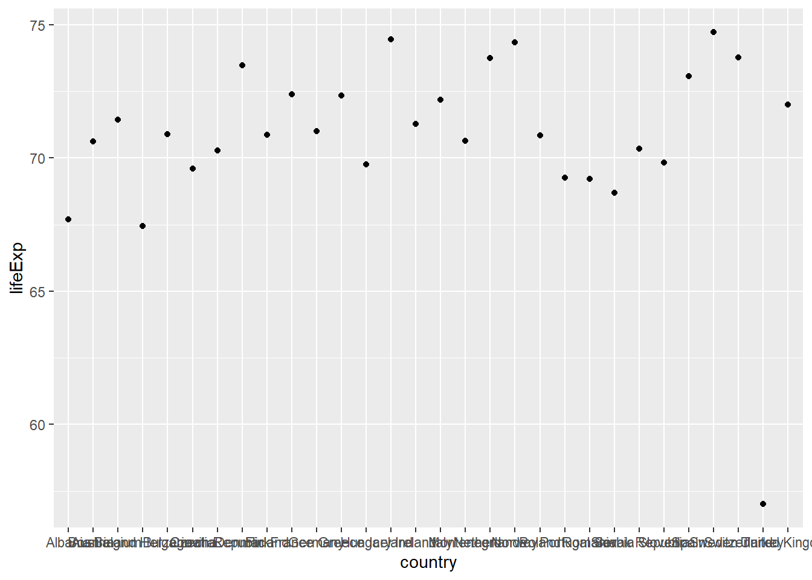

The official ggplot2 solution to rotate the labels is
```
p + theme(axis.text.x = element_text(angle = 90))
```
I cannot remember this, and many people struggle with this logic, so I wrote my own function (the one above called `rotate_axis_labels()`). It has an argument for which axis the rotation must be applied to (`axis`), an argument for the `angle` to rotate. The arguments `h_just` and `v_just` control the horizontal and vertical displacement of the labels respectively. Finally, the `...` means that you can pass any additional arguments to the ggplot2 function `element_text()`, these will be parsed from the function call to the `element_text()` call through `...`

See the function at work:

```r
## use default label offset

gapminder::gapminder %>%
  dplyr::filter(continent == "Europe", year == 1972) %>%
  ggplot(aes(x = country,
             y = lifeExp)) +
  geom_point() +
  rotate_axis_labels(axis = "X", 
                     angle = 60)
```

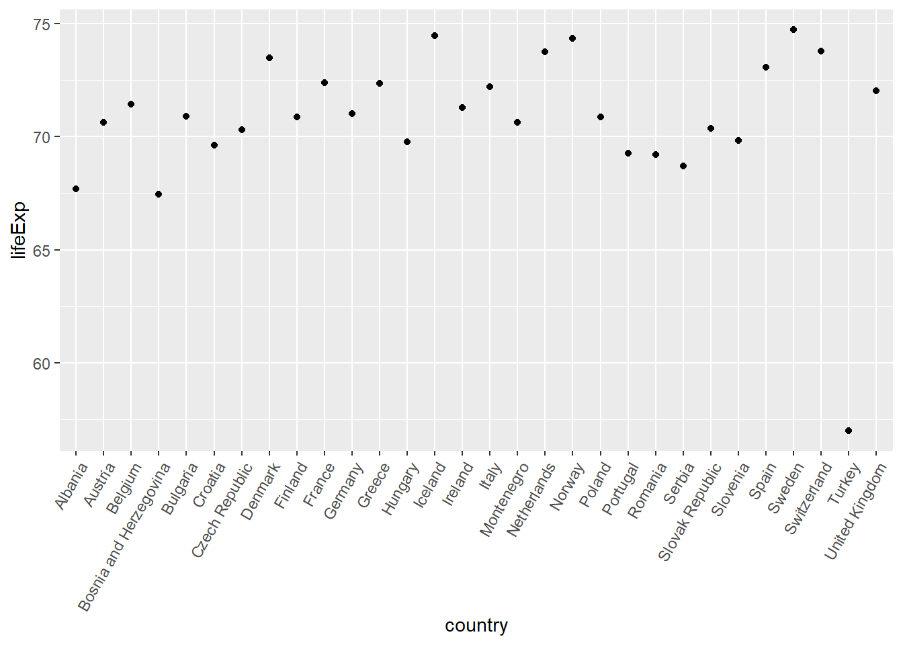

```r
## adapt label offset and use ... to change colour and font face to bold

plot_gapminder_le_vs_country <- function(continent, year){

gapminder::gapminder %>%
  dplyr::filter(continent == continent, year == year) %>%
  ggplot(aes(x = country,
             y = lifeExp)) +
  geom_point() +
  rotate_axis_labels(axis = "X", 
                     angle = 90,
                     h_just = 1, 
                     v_just = 0.11, colour = "red", size = 9, face = "bold")

}

plot_gapminder_le_vs_country(continent = "Africa", year = 1972)
```

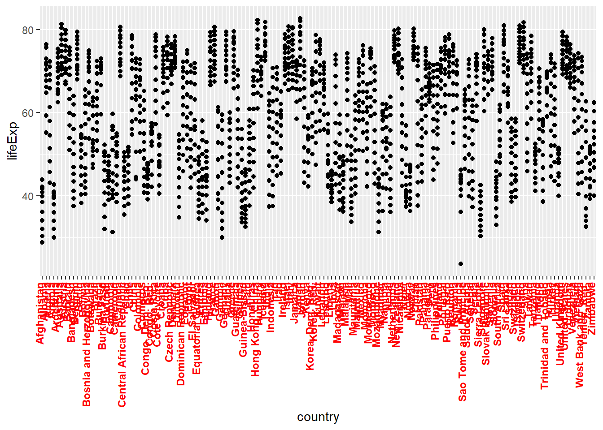

```r
plot_gapminder_le_vs_country(continent = "Europe", year = 1972)
```


Note that I demonstrate the use of `...` in the code above, with:

```
colour = "red", size = 11, face = "bold"

```
How does this work? See also `?ggplot2::element_text` for more info.

## Documenting a function
Now that we have an idea on what this function does and what the data type of the arguments that go inside the function call should be we can start writing the documentation for our 'self-written' function.
Documenting a function is extremely important for reproducibility and robustness of you code. If you don't know what goes in a function, you will have difficulty operating the function and obtaining the correct output.
The R-package system and the Comprehensive R-Archiving Network, as well as BIOCONDUCTOR, as such a great success because of their rigorous check on documentation for packages that are submitted there. So writing functions, and their documentation could be you first step to writing a package and publishing it so that other people might enjoy your innovations.

### Identifying what elements are in the documentation for a function
Let's examine the output for the well documented function `mean` from the `base` package


```r
library(dplyr)
source(
  here::here(
  "code",
  "render_help_to_console.R"))
help_console(mean)
```

```
## _A_r_i_t_h_m_e_t_i_c _M_e_a_n
## 
## _D_e_s_c_r_i_p_t_i_o_n:
## 
##      Generic function for the (trimmed) arithmetic mean.
## 
## _U_s_a_g_e:
## 
##      mean(x, ...)
##      
##      ## Default S3 method:
##      mean(x, trim = 0, na.rm = FALSE, ...)
##      
## _A_r_g_u_m_e_n_t_s:
## 
##        x: An R object.  Currently there are methods for numeric/logical
##           vectors and date, date-time and time interval objects.
##           Complex vectors are allowed for 'trim = 0', only.
## 
##     trim: the fraction (0 to 0.5) of observations to be trimmed from
##           each end of 'x' before the mean is computed.  Values of trim
##           outside that range are taken as the nearest endpoint.
## 
##    na.rm: a logical value indicating whether 'NA' values should be
##           stripped before the computation proceeds.
## 
##      ...: further arguments passed to or from other methods.
## 
## _V_a_l_u_e:
## 
##      If 'trim' is zero (the default), the arithmetic mean of the values
##      in 'x' is computed, as a numeric or complex vector of length one.
##      If 'x' is not logical (coerced to numeric), numeric (including
##      integer) or complex, 'NA_real_' is returned, with a warning.
## 
##      If 'trim' is non-zero, a symmetrically trimmed mean is computed
##      with a fraction of 'trim' observations deleted from each end
##      before the mean is computed.
## 
## _R_e_f_e_r_e_n_c_e_s:
## 
##      Becker, R. A., Chambers, J. M. and Wilks, A. R. (1988) _The New S
##      Language_.  Wadsworth & Brooks/Cole.
## 
## _S_e_e _A_l_s_o:
## 
##      'weighted.mean', 'mean.POSIXct', 'colMeans' for row and column
##      means.
## 
## _E_x_a_m_p_l_e_s:
## 
##      x <- c(0:10, 50)
##      xm <- mean(x)
##      c(xm, mean(x, trim = 0.10))
## 
```

So how would we adapt this documentation to our `rotate_axis_labels()` function?

The elements of the documentation are standardized and each function can be annotated with so-called Roxygen comments (`'#`). These comments can be used to indicate specific fields for documentation and are automatically translated to R-documentation files (`.Rd`) if you are using them in a package-development workflow. 
To help you in adopting the process of writing R-packages yourself, it is good practice to write Roxygen-documentation for each function you write. Normally you would store each function in it's own `.R` file. For tracebility reasons, it is a good idea to give this file the same name as the name of the function it contains. Mind that this file must only contain the function and it's documentation, nothing else. So testing etc. is performed outside this `.R` file.

Below you see an example of the function definition + documentation for our `rotate_axis_labels()` function. I have included this function in an R-package called `{toolboxr}`. The structure of this package and how to to build your own R package will be discussed in chapter \@ref(lab7bcommunicatereproduce)

```
#' @title Rotate the x or y axis labels of a ggplot graph
#' 
#' @param axis A character string `x`, `X`, `Y` or `y` indicating 
#' for which axis in the plot the labels need to be rotated 
#' @param angle A single nummeric value indicating the angle 
#' of ration. Posive value rotate the label counterclockwise, 
#' negative values provide a clockwise rotation (which is not recommended)  
#' @param ... Any addiontional paramters passed to `element_text`. 
#' See `?element_text` for more options
#' 
#' @return An theme element (see ?ggplot::theme for more details)
#' 
#' @examples 
#' library(ggplot2)
#' library(tidyverse)
#' 
#' ## default settings
#' data(package = "datasets", dataset ="mtcars")
#' mtcars %>% 
#' mutate(brand = rownames(.)) %>%
#'  ggplot(aes(x = reorder(as_factor(brand), mpg),
#'             y = mpg)) +
#'  geom_point() +
#'  rotate_axis_labels(axis = "x", 
#'                     angle = 90) 
#' 
#' ## with use of ... and setting v_just
#' mtcars %>% 
#' mutate(brand = rownames(.)) %>%
#'   ggplot(aes(x = reorder(as_factor(brand), mpg),
#'              y = mpg)) +
#'   geom_point() +
#'   rotate_axis_labels(axis = "x", 
#'                      angle = 90, 
#'                      v_just = 0.1, 
#'                      colour = "purple",
#'                      face = "bold) 
#' 
#' 
#' @export

rotate_axis_labels <- function(axis = NULL, 
                               angle = NULL, 
                               h_just = 1, 
                               v_just = 1, ...){
  
  if(axis == "x" | axis == "X"){
    theme <- theme(axis.text.x = element_text(angle = angle, 
                                              hjust = h_just,
                                              vjust = v_just,
                                              ...))
  }
  if(axis == "y" | axis == "Y"){
    theme <- theme(axis.text.y = element_text(angle = angle, 
                                              hjust = h_just,
                                              vjust = v_just,
                                              ...))
  }
  return(theme)
}


```

### **EXERCISE 7; Roxygen Documentation** {-}

Follow the steps below:

 1. Create an empty R-script called "is_integer_present.R"
 1. Copy the function definition for the function `is_integer_present()` from exercise 2B into this R script.
 1. Create a new folder in your RStudio `Home` called `minions`
 1. Save the R-script "is_integer_present.R" in the folder "./minions/R"
 1. Set up a new RStudio project from the Existing "./minions" folder
 1. Open the new RStudio project called "minions"
 1. Open the R-script "is_integer_present.R" inside the "minions" project
 1. Annotate the function `is_integer_present()` with appropriate Roxygen comments, use at least the fields: `@title`, `@param`, `@return`, `@example`, `@export`
 1. Save the function definition file
 1. Return to the edamoi bookdown project/website.
 

<!--chapter:end:ch12-lab3bfunctions.Rmd-->

# Lab 3C; Tidy Data {#lab3ctidydata}

## Credits
The contents of this chapter are (partly) reproduced from [@r4ds]

## Introduction

 * In this lesson, you will learn a consistent way to structure your data in R, in a framework called __tidy data__. 
 * Getting your data into this format requires some upfront work, but that work pays off in the long term. 
 * Once you have tidy data and the tidy tools provided by packages in the tidyverse and others, you will spend much less time munging data from one representation to another, allowing you to spend more time on the analytic questions at hand.

## `{tidyr}` package

 * This lesson will give you a practical introduction to tidy data and the accompanying tools in the __tidyr__ package. 

If you'd like to learn more about the underlying theory, you might enjoy the *Tidy Data* paper published in the Journal of Statistical Software, <http://www.jstatsoft.org/v59/i10/paper>.

## Prerequisites
In this chapter we'll focus on tidyr, a package that provides a bunch of tools to help tidy up your messy datasets. tidyr is a member of the core tidyverse.


```r
library(tidyverse)
```


## Tidy data rules


 * Each variable goes in it's own column
 * Each observation goes in a singe row
 * Each cell contains only one value

__**You will need them in (almost) every analysis!**__

## Examples 

 * This dataset concerns tuberculosis incidence in multiple countries over 2 years
 * Each dataset shows the same values of four variables *country*, *year*, *population*, and *cases*
 * Ask yourself: "How are the following tables different?"
 * Check if, and how the table complies to the tidy data rules

## Example 1

```r
head(table1, 6)
```

```
## # A tibble: 6 × 4
##   country      year  cases population
##   <chr>       <int>  <int>      <int>
## 1 Afghanistan  1999    745   19987071
## 2 Afghanistan  2000   2666   20595360
## 3 Brazil       1999  37737  172006362
## 4 Brazil       2000  80488  174504898
## 5 China        1999 212258 1272915272
## 6 China        2000 213766 1280428583
```

## Example 2

```r
head(table2, 6)
```

```
## # A tibble: 6 × 4
##   country      year type           count
##   <chr>       <int> <chr>          <int>
## 1 Afghanistan  1999 cases            745
## 2 Afghanistan  1999 population  19987071
## 3 Afghanistan  2000 cases           2666
## 4 Afghanistan  2000 population  20595360
## 5 Brazil       1999 cases          37737
## 6 Brazil       1999 population 172006362
```

## Example 3

```r
head(table3, 6)
```

```
## # A tibble: 6 × 3
##   country      year rate             
##   <chr>       <int> <chr>            
## 1 Afghanistan  1999 745/19987071     
## 2 Afghanistan  2000 2666/20595360    
## 3 Brazil       1999 37737/172006362  
## 4 Brazil       2000 80488/174504898  
## 5 China        1999 212258/1272915272
## 6 China        2000 213766/1280428583
```

## Data can be spread across multiple files/tables

```r
head(table4a, 3)  # cases
```

```
## # A tibble: 3 × 3
##   country     `1999` `2000`
##   <chr>        <int>  <int>
## 1 Afghanistan    745   2666
## 2 Brazil       37737  80488
## 3 China       212258 213766
```

```r
head(table4b, 3)  # population
```

```
## # A tibble: 3 × 3
##   country         `1999`     `2000`
##   <chr>            <int>      <int>
## 1 Afghanistan   19987071   20595360
## 2 Brazil       172006362  174504898
## 3 China       1272915272 1280428583
```

## One winner!
In the previous example, only `table1` is tidy. It's the only representation where each column is a variable. 


```r
head(table1)
```

```
## # A tibble: 6 × 4
##   country      year  cases population
##   <chr>       <int>  <int>      <int>
## 1 Afghanistan  1999    745   19987071
## 2 Afghanistan  2000   2666   20595360
## 3 Brazil       1999  37737  172006362
## 4 Brazil       2000  80488  174504898
## 5 China        1999 212258 1272915272
## 6 China        2000 213766 1280428583
```

## Why tidy data?
Why ensure that your data is tidy? There are two main advantages:

 1. There's a general advantage to picking one consistent way of storing data. If you have a consistent data structure, it's easier to learn the tools that work with it because they have an underlying uniformity.
    
 2. There's a specific advantage to placing variables in columns because they are vectors. Most built-in R functions work with vectors of values.

## Packages from the tidyverse are designed for tidy data 

Example plot from `table1`

```r
# Compute rate per 10,000
table1 %>% 
  mutate(rate = cases / population * 10000)
```

```
## # A tibble: 6 × 5
##   country      year  cases population  rate
##   <chr>       <int>  <int>      <int> <dbl>
## 1 Afghanistan  1999    745   19987071 0.373
## 2 Afghanistan  2000   2666   20595360 1.29 
## 3 Brazil       1999  37737  172006362 2.19 
## 4 Brazil       2000  80488  174504898 4.61 
## 5 China        1999 212258 1272915272 1.67 
## 6 China        2000 213766 1280428583 1.67
```

## Compute cases per year

```r
table1 %>% 
  count(year, wt = cases)
```

```
## # A tibble: 2 × 2
##    year      n
##   <int>  <int>
## 1  1999 250740
## 2  2000 296920
```

### <mark>**EXERCISE 1 Visualize changes over time**</mark> {-}

A) Create a plot from `table1` tuberculosis data, showing the number of cases from each country.

B) Now plot the incidence (number of cases per 10,000 people) for each country.

C) What can you conclude from the plots in exercise 1A) and 1B)


## Gathering

When some of the column names are not names of variables, but _values_ of a variable. Take `table4a`: the column names `1999` and `2000` represent values of the `year` variable, and each row represents two observations, not one.


```r
table4a
```

```
## # A tibble: 3 × 3
##   country     `1999` `2000`
## * <chr>        <int>  <int>
## 1 Afghanistan    745   2666
## 2 Brazil       37737  80488
## 3 China       212258 213766
```

## Gathering a set of value columns

To tidy a dataset like this, we need to __gather__ those columns into a new pair of variables. To describe that operation we need three parameters:

* The set of columns that represent values, not variables. In this example, 
  those are the columns `1999` and `2000`.
* The name of the variable whose values form the column names. I call that
  the `key`, and here it is `year`.
* The name of the variable whose values are spread over the cells. I call 
  that `value`, and here it's the number of `cases`.
  
## "gather()"  

```r
table4a %>% 
  gather(`1999`, `2000`, key = "year", value = "cases")
```

```
## # A tibble: 6 × 3
##   country     year   cases
##   <chr>       <chr>  <int>
## 1 Afghanistan 1999     745
## 2 Brazil      1999   37737
## 3 China       1999  212258
## 4 Afghanistan 2000    2666
## 5 Brazil      2000   80488
## 6 China       2000  213766
```

## The actions "gather()" performs
<div class="figure">

<p class="caption">(\#fig:tidy-gather)Gathering `table4` into a tidy form.</p>
</div>

## Tidy table 4b

```r
table4b %>% 
  gather(`1999`, `2000`, key = "year", value = "population")
```

```
## # A tibble: 6 × 3
##   country     year  population
##   <chr>       <chr>      <int>
## 1 Afghanistan 1999    19987071
## 2 Brazil      1999   172006362
## 3 China       1999  1272915272
## 4 Afghanistan 2000    20595360
## 5 Brazil      2000   174504898
## 6 China       2000  1280428583
```

### <mark>**EXERCISE 2 Gathering columns**</mark> {-}
The data file "./data/messy_excel.xlsx" is not very tidy. Open the file in Excel. Discuss with you neighbour how you would tidy the data in this file, without changing anything in the Excel file. Write down your plan. try to develop a stepwise protocol that includes code-snippets and/or pseudo code.

**TIPS**
 
 1. You can define a range to be parsed in the readxl package
 1. You will need gather some columns in the data
 1. You might want to parse the file 2 times with different ranges to get all the data into R
 1. First try to parse the file as it is to see what R makes of the file and try to design (in Excel if you want) the end result that you would like to achieve.

_This is a difficult exercise and it will take you some time to figure out how to achieve this, take the time to look for additional online information_


## Joining tables
To combine the tidied versions of `table4a` and `table4b` into a single tibble, we need to use `dplyr::left_join()`

```r
tidy4a <- table4a %>% 
  gather(`1999`, `2000`, key = "year", value = "cases")
tidy4b <- table4b %>% 
  gather(`1999`, `2000`, key = "year", value = "population")
joined_4a_4b <- left_join(tidy4a, tidy4b)
joined_4a_4b
```

```
## # A tibble: 6 × 4
##   country     year   cases population
##   <chr>       <chr>  <int>      <int>
## 1 Afghanistan 1999     745   19987071
## 2 Brazil      1999   37737  172006362
## 3 China       1999  212258 1272915272
## 4 Afghanistan 2000    2666   20595360
## 5 Brazil      2000   80488  174504898
## 6 China       2000  213766 1280428583
```

## Spreading
Spreading is the opposite of gathering. You use it when an observation is scattered across multiple rows. For example, take `table2`: an observation is a country in a year, but each observation is spread across two rows.


```r
table2
```

```
## # A tibble: 12 × 4
##    country      year type            count
##    <chr>       <int> <chr>           <int>
##  1 Afghanistan  1999 cases             745
##  2 Afghanistan  1999 population   19987071
##  3 Afghanistan  2000 cases            2666
##  4 Afghanistan  2000 population   20595360
##  5 Brazil       1999 cases           37737
##  6 Brazil       1999 population  172006362
##  7 Brazil       2000 cases           80488
##  8 Brazil       2000 population  174504898
##  9 China        1999 cases          212258
## 10 China        1999 population 1272915272
## 11 China        2000 cases          213766
## 12 China        2000 population 1280428583
```

To tidy this up, we first analyse the representation in similar way to `gather()`. This time, however, we only need two parameters:

* The column that contains variable names, the `key` column. Here, it's 
  `type`.
* The column that contains values forms multiple variables, the `value`
  column. Here it's `count`.

## "spread()"

```r
spread(table2, key = type, value = count)
```

```
## # A tibble: 6 × 4
##   country      year  cases population
##   <chr>       <int>  <int>      <int>
## 1 Afghanistan  1999    745   19987071
## 2 Afghanistan  2000   2666   20595360
## 3 Brazil       1999  37737  172006362
## 4 Brazil       2000  80488  174504898
## 5 China        1999 212258 1272915272
## 6 China        2000 213766 1280428583
```

## The action "spread()" performs
<div class="figure">

<p class="caption">(\#fig:tidy-spread)Spreading `table2` makes it tidy</p>
</div>

## "gather()" and "spread()" are complementary
As you might have guessed from the common `key` and `value` arguments, `spread()` and `gather()` are complements. `gather()` makes wide tables narrower and longer; `spread()` makes long tables shorter and wider.

## Separating and uniting

`table3` has a different problem: we have one column (`rate`) that contains two variables (`cases` and `population`). To fix this problem, we'll need the `separate()` function. You'll also learn about the complement of `separate()`: `unite()`, which you use if a single variable is spread across multiple columns.

## "separate()"

`separate()` pulls apart one column into multiple columns, by splitting wherever a separator character appears. Take `table3`:


```r
table3
```

```
## # A tibble: 6 × 3
##   country      year rate             
## * <chr>       <int> <chr>            
## 1 Afghanistan  1999 745/19987071     
## 2 Afghanistan  2000 2666/20595360    
## 3 Brazil       1999 37737/172006362  
## 4 Brazil       2000 80488/174504898  
## 5 China        1999 212258/1272915272
## 6 China        2000 213766/1280428583
```

## Separating rate into cases and population

```r
table3 %>% 
  separate(rate, into = c("cases", "population"))
```

```
## # A tibble: 6 × 4
##   country      year cases  population
##   <chr>       <int> <chr>  <chr>     
## 1 Afghanistan  1999 745    19987071  
## 2 Afghanistan  2000 2666   20595360  
## 3 Brazil       1999 37737  172006362 
## 4 Brazil       2000 80488  174504898 
## 5 China        1999 212258 1272915272
## 6 China        2000 213766 1280428583
```

## The action "separate()" performs
<div class="figure">

<p class="caption">(\#fig:tidy-separate)Separating `table3` makes it tidy</p>
</div>

## Unite
`unite()` is the inverse of `separate()`: it combines multiple columns into a single column. 

Look at `?tidyrt::unite()` to see the help and examples

## Missing values

Changing the representation of a dataset brings up an important subtlety of missing values. Surprisingly, a value can be missing in one of two possible ways:

* __Explicitly__, i.e. flagged with `NA`.
* __Implicitly__, i.e. simply not present in the data.

Let's illustrate this idea with a very simple data set:


```r
stocks <- tibble(
  year   = c(2015, 2015, 2015, 2015, 2016, 2016, 2016),
  qtr    = c(   1,    2,    3,    4,    2,    3,    4),
  return = c(1.88, 0.59, 0.35,   NA, 0.92, 0.17, 2.66)
)
```

## The stocks dataframe

```r
stocks
```

```
## # A tibble: 7 × 3
##    year   qtr return
##   <dbl> <dbl>  <dbl>
## 1  2015     1   1.88
## 2  2015     2   0.59
## 3  2015     3   0.35
## 4  2015     4  NA   
## 5  2016     2   0.92
## 6  2016     3   0.17
## 7  2016     4   2.66
```

## There are two missing values in this dataset:

 * The return for the fourth quarter of 2015 is explicitly missing, because the cell where its value should be instead contains `NA`.
 * The return for the first quarter of 2016 is implicitly missing, because it simply does not appear in the dataset.

## Making implicit missing values explicit
The way that a dataset is represented can make implicit values explicit. For example, we can make the implicit missing value explicit by putting years in the columns:


```r
stocks %>% 
  spread(year, return)
```

```
## # A tibble: 4 × 3
##     qtr `2015` `2016`
##   <dbl>  <dbl>  <dbl>
## 1     1   1.88  NA   
## 2     2   0.59   0.92
## 3     3   0.35   0.17
## 4     4  NA      2.66
```

## "na.rm = TRUE"
Because these explicit missing values may not be important in other representations of the data, you can set `na.rm = TRUE` in `gather()` to turn explicit missing values implicit:


```r
stocks %>% 
  spread(year, return) %>% 
  gather(year, return, `2015`:`2016`, na.rm = TRUE)
```

```
## # A tibble: 6 × 3
##     qtr year  return
##   <dbl> <chr>  <dbl>
## 1     1 2015    1.88
## 2     2 2015    0.59
## 3     3 2015    0.35
## 4     2 2016    0.92
## 5     3 2016    0.17
## 6     4 2016    2.66
```

## Explicit missing values "complete()"
Another important tool for making missing values explicit in tidy data is `complete()`:


```r
stocks %>% 
  complete(year, qtr)
```

```
## # A tibble: 8 × 3
##    year   qtr return
##   <dbl> <dbl>  <dbl>
## 1  2015     1   1.88
## 2  2015     2   0.59
## 3  2015     3   0.35
## 4  2015     4  NA   
## 5  2016     1  NA   
## 6  2016     2   0.92
## 7  2016     3   0.17
## 8  2016     4   2.66
```


## The "complete()" function
`complete()` takes a set of columns, and finds all unique combinations. It then ensures the original dataset contains all those values, filling in explicit `NA`s where necessary.

## Forward carrying
Sometimes when a data source has primarily been used for data entry, missing values indicate that the previous value should be carried forward:

## Carry-forward example

```r
(treatment <- tribble(
  ~ person,            ~ treatment, ~response,
  "Hans Anders",       1,           7,
  NA,                  2,           10,
  NA,                  3,           9,
  "Alber Heijn",       1,           4,
  NA,                  2,           8,
  NA,                  3,           12
))
```

```
## # A tibble: 6 × 3
##   person      treatment response
##   <chr>           <dbl>    <dbl>
## 1 Hans Anders         1        7
## 2 <NA>                2       10
## 3 <NA>                3        9
## 4 Alber Heijn         1        4
## 5 <NA>                2        8
## 6 <NA>                3       12
```

## Filling in the 'missing values'
You can fill in these missing values with `fill()`. It takes a set of columns where you want missing values to be replaced by the most recent non-missing value (sometimes called last observation carried forward).


```r
treatment %>% 
  fill(person)
```

```
## # A tibble: 6 × 3
##   person      treatment response
##   <chr>           <dbl>    <dbl>
## 1 Hans Anders         1        7
## 2 Hans Anders         2       10
## 3 Hans Anders         3        9
## 4 Alber Heijn         1        4
## 5 Alber Heijn         2        8
## 6 Alber Heijn         3       12
```


### <mark>**EXERCISE 3 Inspecting tidyness**</mark> {-}

3A) Describe how the variables and observations are organised in each of the sample tables: 
`table1`, `table2`, `table3`, `table4a`, `table4b`.

3B) Compute the `rate` for `table2`, and `table4a` + `table4b`. 

**STEPS**

You will need to perform four operations:

 1.  Extract the number of TB cases per country per year.
 2.  Extract the matching population per country per year.
 3.  Divide cases by population, and multiply by 10000.
 4.  Store back in the appropriate place.
 5.  Sort the data according year (ascending)
 
**TIPS**
 
 - You will need {tidyr} and {dplyr}
 - You will also need `mutate()` to calculate the rate
 - Use the pipe `%>%` 
 - Rember `gather()` collects observations in columns into variable columns (from wide to stacked) and `spread()` unstacks variables into variable columns (from stacked to wide)
 - Table 4a contains the cases, table 4b contains the populations
 - For joining the tables 4a and 4b you can use the `dplyr::left_join()` function. See `help("dplyr")` or `?dplyr` for more information.

table2


table 4a + 4b


Which representation is easiest to work with? Which is hardest? Why?

### <mark>**EXERCISE 4: Plotting tidy data**</mark> {-}

4A)  Recreate the plot showing change in cases over time using `table2`
instead of `table1`. What do you need to do first?


4B) Why does the code below fail, can you fix it?

```r
    table4a %>% 
      gather(1999, 2000, key = "year", value = "cases")
```

```
## Error: Can't subset columns that don't exist.
## x Locations 1999 and 2000 don't exist.
## ℹ There are only 3 columns.
```

### <mark>**EXERCISE 5: Wide to long; Spreading and Gathering**</mark> {-}

5A)  Tidy the simple tibble below. Do you need to spread or gather it?


5B) Calculate the percentage of females that are pregnant, of all females in the dataset. 


5C) How many males are there in the dataset? How many of them are pregnant ;-)


### <mark>**EXERCISE 6: Additional operations**</mark> {-}

6A) What do the `extra` and `fill` arguments do in `separate()`? Experiment with the various options for the following two toy datasets.
    

```r
tibble(x = c("a,b,c", "d,e,f,g", "h,i,j")) %>% 
separate(x, c("one", "two", "three"))

tibble(x = c("a,b,c", "d,e", "f,g,i")) %>% 
separate(x, c("one", "two", "three"))
```

6B) Compare and contrast the functions `separate()` and `extract()`.  Why are there three variations of separation (by position, by separator, and with groups), but only one unite?

### <mark>**EXERCISE 7: A Case**</mark> {-}

7A) Tidy the following dataset: "./data/messydata_5a.xlsx"
The data represents Mariages during the four seasons for a number of years in regions in Germany. 

Note: Germany has 16 states. When you load the data you will notice that the coding of the factor variable "State" is not consistent. You will need to correct tihs coding in order for the data to be tidy.
Use the function from {forcats} `forcats::fct_recode()` to achieve this. This file "./data/germany_states.txt" contains information on the states. How can you load this file into R?


**TIPS**
 
 - Use the code below to read all the sheets of the excel file, look at the help function first.
 - Which parameter of `read_excel()` controls the sheets to read? 
 - To read multiple sheets, a for loop is used
 - The Excel file contains 7 sheets 
 - Check spelling and values: are they consistent. 
 - Read the chapter "
 - Think about `gather()` or `spread()`, which do you need?
 - To convert a list of dataframes to one dataframe look at:
 the help for the function `dplyr::bind_rows()`. You will have to use this to convert the list of sheets into one dataframe.
- The first two sheets of the Excel file contain mistakes and errors

### Read data {-}

```r
library(readxl)

# path to data file
path_to_messy_mariages <- file.path(
  here::here(
    "data", 
    "messydata_5a.xlsx"))

# load messy data in empty list with loop and read_excel
messy_mariages <- list()

for(i in 1:7){
  messy_mariages[[i]] <- read_excel(path = path_to_messy_mariages, 
                                    sheet = i)
  messy_mariages[[i]]$timestamp <- i
}
```

```
## New names:
## * `` -> ...3
## * `` -> ...5
## * `` -> ...6
## * `` -> ...7
## * `` -> ...8
```


7B) Start analyzing your tidy data

 - How many marriages are there per year in each German "Bundesland"?
 - Visualize your findings in a plot
 


7C) Visual analysis
Compare the marriages of 1990, 2003 and 2014 and colour them by season

**TIPS:**
 - Filter data by the years 1990, 2003 and 2014
 - Group it by year and season and add up the values


<!--chapter:end:ch13-lab3ctidydata.Rmd-->

# Lab 4A; Importing data {#lab4aimportingdata}


## Packages

```r
library(tidyverse)
```

## Importing data into R

## Don't be absolute!

 * You could point to a file with an absolute path: 
 The file for the "allijn" dataset in my RStudio Desktop Home folder is located at:

```r
"D://r_projects/edamoi_site_remake/data/allijn.tsv"
```

```
## [1] "D://r_projects/edamoi_site_remake/data/allijn.tsv"
```

There is a very good chance that this folder does not exist on your local machines. 

*__Using absolute paths probably makes the code break almost every time__*

## Be relative!!

There are a few things you should do to increase portability of you R project:

 * ALWAYS work in an RStudio project. 
 * Also when you are playing (call your project "play" or "sandbox" or something)!
 * ONLY use relative paths, they prevent code from breaking in the future
 * Use the `{here}` package to create relative paths, especially in RMarkdown files
 

### <mark>**EXERCISE 1 - Construct a path to a data file**</mark> {-}

To make the code as reproducible as possible
 
 1) Construct a `file.path` to the data file you want to import
 2) Use this `file.path` as argumnent for the call in your import function. Construct the `file.path` relative to the current working directory
 3) use the function `here()` from the `{here}`

A) Construct a full path to the `DP_LIVE_06112019150508524.csv` file located in the `/data` folder, using the `here()` function.
 


B) Read the `DP_LIVE_06112019150508524.csv` file into R using the `{readr}` package. Consult  help("readr") for tips. Try to think about what type of file this can be. Open the file in the Viewer choose 'View file' in the Files pane of RStudio, click on the file.    


--- END EXERCISE ---

## Getting started with importing files
Most of readr's functions are concerned with turning flat files into data frames:

* `read_csv()` reads comma delimited files, 
* `read_csv2()` reads semicolon
  separated files (common in countries where "`,`" is used as the decimal place),
* `read_tsv()` reads tab delimited files, and 
* `read_delim()` reads in files with any delimiter.
* `read_fwf()` reads fixed width files. You can specify fields either by their
  widths with `fwf_widths()` or their position with `fwf_positions()`.
* `read_table()` reads a common variation of fixed width files where columns are separated by white space.

## CSV as the golden standard

* Convert Excel files to CSV files
* Use CSV as much as possible
* The delimiter in CSV can be different: "," or ";"
* `read_csv` works with ","
* `read_csv2` works with ";"

## General syntax
The first argument to `read_csv()` is the most important: it's the path to the file to read.

```
path_to_file <- here::here("subfolder", "datafile")
read_...(file = path_to_file, ...)

## ... = aditional options

```

### <mark>**EXERCISE 2 - parser message in `{readr}`**</mark> {-}

A) Read the file "heigts.csv" in the "/data" folder into R, unsing the `{readr}` package.
If all goes well you will see the following message: 

```
## Rows: 1192 Columns: 6
```

```
## ── Column specification ────────────────────────────────────────────────────────
## Delimiter: ","
## chr (2): sex, race
## dbl (4): earn, height, ed, age
```

```
## 
## ℹ Use `spec()` to retrieve the full column specification for this data.
## ℹ Specify the column types or set `show_col_types = FALSE` to quiet this message.
```

**Parser message**
When you run `read_csv()` it prints out a column specification that gives the name and type of each column. That's an important part of readr, which we'll come back to in [parsing a file].

B) Experiment with readr
You can also supply an inline csv file. This is useful for experimenting with readr and for creating reproducible examples to share with others:
Run the code below, discuss with your neighbour what you think happened and why this works.

```r
read_csv("a,b,c
1,2,3
4,5,6")
```

```
## # A tibble: 2 × 3
##       a     b     c
##   <dbl> <dbl> <dbl>
## 1     1     2     3
## 2     4     5     6
```

```r
# each new line results in a new row of observations
```

--- END EXERCISE ---

## Changing default behaviour
In both cases `read_csv()` uses the first line of the data for the column names, which is a very common convention. There are two cases where you might want to tweak this behaviour:

## Skipping lines (usually at the top of the file)
Sometimes there are a few lines of metadata at the top of the file. You can
use `skip = n` to skip the first `n` lines; or use `comment = "$$"` to drop
all lines that start with (e.g.) `$$`.
    

```r
## no options
read_csv("The first line of metadata
The second line of metadata
x,y,z
1,2,3
4,6,8")
```

```
## # A tibble: 4 × 1
##   `The first line of metadata`
##   <chr>                       
## 1 The second line of metadata 
## 2 x,y,z                       
## 3 1,2,3                       
## 4 4,6,8
```

```r
## skip lines
read_csv("The first line of metadata
The second line of metadata
x,y,z
1,2,3
4,6,8", skip = 2)
```

```
## # A tibble: 2 × 3
##       x     y     z
##   <dbl> <dbl> <dbl>
## 1     1     2     3
## 2     4     6     8
```

```r
## define comment
read_csv("#The first line of metadata
#The second line of metadata
x,y,z
1,2,3
4,6,8", comment = "#")
```

```
## # A tibble: 2 × 3
##       x     y     z
##   <dbl> <dbl> <dbl>
## 1     1     2     3
## 2     4     6     8
```

### <mark>**EXERCISE 3 - comments and skipping lines**</mark> {-}

A) Parse the "allijn.tsv" file in the "/data". This file has comments at the top of the file in the first 22 lines. Each comment is indicated by either a double pound sign "##"


B) Can you come up with a way that would prevent opening this file first in RStudio in the viewer and still learn how the first few lines of the file look. 

**TIP: The solution to the above challenge requires you to think about a Linux Terminal command. You can exacute Terminal command from inside R with the `system()` function.

```r
system("head -25 data/allijn.tsv")
```

--- END EXERCISE ---

## No headers / column names    
The data might not have column names. You can use `col_names = FALSE` to
tell `read_csv()` not to treat the first row as headings, and instead
label them sequentially from `X1` to `Xn`:
    

```r
read_csv("1,2,3 \n 4,5,6", col_names = FALSE)
```

```
## # A tibble: 2 × 3
##      X1    X2    X3
##   <dbl> <dbl> <dbl>
## 1     1     2     3
## 2     4     5     6
```
    
(`"\n"` is a convenient shortcut for adding a new line)

## Setting column names for `readr`    
Alternatively you can pass `col_names` a character vector which will be
used as the column names:
    

```r
read_csv("1,2,3\n4,5,6", col_names = c("var_1", "var_2", "var_3"))
```

```
## # A tibble: 2 × 3
##   var_1 var_2 var_3
##   <dbl> <dbl> <dbl>
## 1     1     2     3
## 2     4     5     6
```


### <mark>**EXERCISE 4 - Missing values**</mark> {-}
Another option that commonly needs tweaking is `na`: this specifies the value (or values) that are used to represent missing values in your file:


```r
read_csv("a,b,c \n 1,2,.", na = ".")
```

```
## # A tibble: 1 × 3
##       a     b c    
##   <dbl> <dbl> <lgl>
## 1     1     2 NA
```

A) Read the file "John.csv" in the "/data/diet" folder.
Try fixing the different annotations for missing values used in this file by setting the `na = c(...)` option in your readr function call.


B) What happens to the type of the variables when you do not set the `na` option?


C) The folder "./data/diet" contains a number of csv files. How would you go about if you want to join all these files in one big dataframe? First write pseudocode, than write the full code.

**TIPS** 

 - use the function `list.files()`, set the option `full.names = TRUE` and `pattern = "\\.csv"`
 - use the function `map_df()` to loop over the list of file paths, in conjuction with `read_csv()`
 - you will need to set `na = c("?", "not recorded", "missing", "", " ")`
 - think about also setting the parser for your calls to read_csv
 - build a pipe (using `%>%`) that does the full processing of all steps and outputs the combined dataframe
 
 


-- **END EXERCISE** --

## Examples to learn more
You can also easily adapt what you've learned to read tab separated files with

 * `read_tsv()` and 
 * fixed width files with `read_fwf()`
 * you can even have more control over which delimiter was used (to seperate the columns in the file) with `read_delim()`

### <mark>**EXERCISE 5 - delimiters**</mark> {-} 

A) Parse the file "gender.txt" in the "/data" folder. Remember that a quick inspection in the Linux terminal is a good idea before trying to read any file into R.

B) Which function of readr did you use? Why?

--- **END EXERCISE** ---

## Challenging variable types 
To read in more challenging files, you'll need to learn more about how readr parses each column, turning them into R vectors. This is an advanced operation and will be addressed during exercises, when we need it

1.  `parse_logical()` and `parse_integer()` parse logicals and integers
    respectively. There's basically nothing that can go wrong with these
    parsers so I won't describe them here further.
    
2.  `parse_double()` is a strict numeric parser, and `parse_number()` 
    is a flexible numeric parser. These are more complicated than you might
    expect because different parts of the world write numbers in different
    ways.
    
3.  `parse_character()` seems so simple that it shouldn't be necessary. But
    one complication makes it quite important: character encodings.

4.  `parse_factor()` create factors, the data structure that R uses to represent
    categorical variables with fixed and known values.

5.  `parse_datetime()`, `parse_date()`, and `parse_time()` allow you to
    parse various date & time specifications. These are the most complicated
    because there are so many different ways of writing dates.

We will adress only the most important parsers

## Numbers
It seems like it should be straightforward to parse a number, but three problems make it tricky:

* People write numbers differently in different parts of the world. For example, some countries use `.` as a decimal placeholder, others use `,`.
* Numbers are often surrounded by other characters that provide some context, like "$8,-" or "99.9%".
* Numbers often contain "grouping" characters to make them easier to read, like "1,000,000", and these grouping characters vary around the world.

## Overiding the default `decimal_mark`
You can override the default value of `.` (dot) by creating a new locale and setting the `decimal_mark` argument:

**Remember, R is US centric, so by default it regards the `.` as a decimal**


```r
parse_double("8.78")
```

```
## [1] 8.78
```

```r
parse_double("8,78", locale = locale(decimal_mark = ","))
```

```
## [1] 8.78
```

```r
# in Some countries "," is used as a decimal place holder
```

## Numbers parsing
`parse_number()` addresses the second problem: it ignores non-numeric characters before and after the number. This is particularly useful for currencies and percentages, but also works to extract numbers embedded in text.

It can be especially helpful if you are trying to parse an Excel or Excel-derived file, because Excel users often apply some additional formatting to the contents of a workbook.


```r
parse_number("$8,-")
```

```
## [1] 8
```

```r
parse_number("99.9%")
```

```
## [1] 99.9
```

## Grouping marks
The final problem is addressed by the combination of `parse_number()` and the locale as `parse_number()` will ignore the "grouping mark":

### <mark>**EXERCISE 6 - grouping marks**</mark> {-}

A) Review the documentation for `locale()`

B) Try parsing the following strings as an appropriate number:

 1. "$123,456,789"
 1. "$123.456.789"
 1. "123'456''789" (used for example in time annotations or GPS coordinates)


--- **END EXERCISE** ---

## Parsing factors 
R uses factors to represent categorical variables that have a known set of possible values. Give `parse_factor()` a vector of known `levels` to generate a warning whenever an unexpected value is present:


```r
autobots <- c("Optimus Prime", "Perceptor", "Arcee")
parse_factor(c(
  "Optimus Prime", "Perceptor", "Arcee", "Soundwave", "Starscream" 
), levels = autobots)
```

```
## [1] Optimus Prime Perceptor     Arcee         <NA>          <NA>         
## attr(,"problems")
## # A tibble: 2 × 4
##     row   col expected           actual    
##   <int> <int> <chr>              <chr>     
## 1     4    NA value in level set Soundwave 
## 2     5    NA value in level set Starscream
## Levels: Optimus Prime Perceptor Arcee
```

But if you have many problematic entries, it's often easier to leave as character vectors and then use the tools you'll learn about in [strings] and [factors] to clean them up.

## Dates, date-times, and times

We already saw dates and date-times in vectors \@ref(lab1bintror)

## Datetime

* `parse_datetime()` expects an ISO8601 date-time. ISO8601 is an international standard in which the components of a date are organised from biggest to smallest: 

year, month, day, hour, minute, second.
    

```r
## 7 November 1973 at 10 minutes and zero seconds past eight in the evening 
parse_datetime("1973-11-07T2010")
```

```
## [1] "1973-11-07 20:10:00 UTC"
```

```r
# If time is omitted, it will be set to midnight
parse_datetime("19731107")
```

```
## [1] "1973-11-07 UTC"
```
    
This is the most important date/time standard, and if you work with
dates and times frequently, I recommend reading
<https://en.wikipedia.org/wiki/ISO_8601>

## Date

 * `parse_date()` expects a four digit year, a `-` or `/`, the month, a `-` or `/`, then the day:
    

```r
parse_date("2010-10-01")
```

```
## [1] "2010-10-01"
```

## Time

* `parse_time()` expects the hour, `:`, minutes, optionally `:` and seconds, and an optional am/pm specifier:
  

```r
library(hms)
parse_time("01:10 am")
```

```
## 01:10:00
```

```r
parse_time("20:10:01")
```

```
## 20:10:01
```
    
## Build your own time format

The best way to figure out the correct format is to create a few examples in a character vector, and test with one of the parsing functions. For example:


```r
parse_date("01/02/15", "%m/%d/%y")
```

```
## [1] "2015-01-02"
```

```r
parse_date("01/02/15", "%d/%m/%y")
```

```
## [1] "2015-02-01"
```

```r
parse_date("01/02/15", "%y/%m/%d")
```

```
## [1] "2001-02-15"
```

### <mark>**EXERCISE 7 - Parsing a file**</mark> {-}
To parse a file succesfully, you can define the column type in the call to readr

A) Parse the file "vl5_dummy.csv"
Be sure to:

 - parse factors in the data as factors (`Group` and `Class` variable)
 - use the `cols()` function together with the `col_types = ` argument in your call
 - to appropriately parse the Date variable (the format is "year'month'day")


--- **END EXERCISE** ---

## Parsing dates is hard
People are (always) inconsistent in data-entry ;-)
Here I demonstrate what a regular expression can do to fix this. There is a inappropriate trailing `'` in the fifth observation of this data. We need to remove it

```r
## the dollar sign ($) signifies the end of a string
str_view(pattern = "\\'$", string = "14'05'17'")
```

```{=html}
<div id="htmlwidget-68b125ca4504d194df06" style="width:960px;height:100%;" class="str_view html-widget"></div>
<script type="application/json" data-for="htmlwidget-68b125ca4504d194df06">{"x":{"html":"<ul>\n  <li>14'05'17<span class='match'>'<\/span><\/li>\n<\/ul>"},"evals":[],"jsHooks":[]}</script>
```

```r
# correcting the row 5 faulty date entry
data_class <- data_class %>% 
  mutate(Date_new = 
    str_replace_all(
      pattern = "\\'$", 
      replacement = "", 
      string = Date
      )
)
data_class
```

```
## # A tibble: 6 × 7
##   Group Surname StudentID Class Score Date      Date_new
##   <fct> <chr>       <dbl> <fct> <dbl> <chr>     <chr>   
## 1 1     vip          7789 vl5a     20 17'10'07  17'10'07
## 2 1     oeps         5567 vl5a     60 18'10'07  18'10'07
## 3 1     swer         1111 vl5a      5 12'02'04  12'02'04
## 4 2     hee          7786 vl5b     10 13'12'31  13'12'31
## 5 2     soof         1112 vl5b     30 14'05'17' 14'05'17
## 6 2     lien         1253 vl5b     45 12'09'12  12'09'12
```


## Other types of data
To get other types of data into R, we recommend starting with the tidyverse packages listed below. They're certainly not perfect, but they are a good place to start. For rectangular data:

* {haven} reads SPSS, Stata, and SAS files.

* {readxl} reads excel files (both `.xls` and `.xlsx`).

* {DBI}, along with a database specific backend (e.g. __RMySQL__, __RSQLite__, __RPostgreSQL__ etc) allows you to run SQL queries against a database and return a data frame.

For hierarchical data: use __jsonlite__ (by Jeroen Ooms) for json, and __xml2__ for XML. Jenny Bryan has some excellent worked examples at <https://jennybc.github.io/purrr-tutorial/examples.html>.

For other file types, try the [R data import/export manual](https://cran.r-project.org/doc/manuals/r-release/R-data.html) and the [__rio__](https://github.com/leeper/rio) package.


### <mark>**EXERCISE 8**</mark> {-}

8A) What function-call would you use to read a file where fields were separated with  
"|"?

    

    
8B) Apart from `file`, `skip`, and `comment`, what other arguments do
    `readr::read_csv()` and `readr::read_tsv()` have in common?


8C) What are the most important arguments to `read_fwf()`?

```r
#?readr::read_fwf
```
   
8D) Sometimes strings in a CSV file contain commas. To prevent them from causing problems they need to be surrounded by a quoting character, like `"` or `'`. By convention, `read_csv()` assumes that the quoting character will be `"`, and if you want to change it you'll need to
use `read_delim()` instead. What arguments do you need to specify to read the following text into a data frame?
    

```r
x <- "x,y\n1,'a,b'"
```


    
8E) Identify what is wrong with each of the following inline CSV files. What happens when you run the code?
Write a code chunk that corrects the code:

CSV 1

```r
read_csv("a,b\n1,2,3\n4,5,6")
```

```
## # A tibble: 2 × 2
##       a     b
##   <dbl> <dbl>
## 1     1    23
## 2     4    56
```


CSV 2

```r
read_csv("a,b,c\n1,2\n1,2,3,4")
```

```
## # A tibble: 2 × 3
##       a     b     c
##   <dbl> <dbl> <dbl>
## 1     1     2    NA
## 2     1     2    34
```


CSV 3

```r
read_csv("a,b\n\"1")
```

```
## # A tibble: 0 × 2
## # … with 2 variables: a <chr>, b <chr>
```


### <mark>**EXERCISE 9 Data types**</mark> {-}

MS Excel is still a frequently used file format: `*.xls` or the "newer" format `*.xlsx` 

9A) List three reasons why you should avoid MS Excel formats for your data

9B) Which functions and packages in R (you are allowed to google) can you use to read `xls`  or `xlsx`  files?

9C) What does `CSV` mean?

9D) What type of delimiters (to seperate columns) can be used in datafiles?  List at least 3.


## <mark>**EXERCISE 10 Loading datafiles**</mark> {-}
For this exercise we are going to load and inspect a number of files

## Loading Microsoft Office Excel files. 

10A) Loading an Excel file
 
In the `"./data"` folder of your project you wille find several example datafiles that we are going to work on during the exercises.

The first set we are going to work on is a rather simple example

"./data/Animals.xls". 

It is an Miscrosoft Excel file containing brain and body weight of a number of animals: http://mste.illinois.edu/malcz/DATA/BIOLOGY/Animals.html 

DESCRIPTION:
Average brain and body weights for 27 species of land animals.

VARIABLES:

 - body: body weight in kg
 - brain: brain weight in g 

SIZE: 

 - Observations = 27; 
 - Variables = 2

SOURCE:
Rousseeuw, P.J. & Leroy, A.M. (1987) Robust Regression and Outlier Detection. Wiley, p. 57.

Write a code chunk that loads the file `"./data/Animals.xls"` into R. 
You may use any function you like, but you are not allowed to transform the data in any way. Name the file `animals` as a datatable/dataframe/tibble in R 


**TIPs** 
 
 - You can use the `readr::readxl` function to solve this question.
 - Rember to use `library` to load the required package(s)
 - The first row that contains data is the "Mountain Beaver" observation
 - Remember that in some functions you can also set `header = FALSE`
 - The variables in this dataset need to be `animal`, `body_weigth` and `brain_weigth` and IN THAT ORDER!. These are the so-called `names` of the dataframe and can be set or checked using the function `names()`
 - Remember `dplyr::select`, `dplyr::filter()`, `dplyr::group_by`, `dplyr::summarize()`
 

```r
# tidyverse solution
# readxl::readxl solution
library(readxl)
path_to_file <- here::here("data", "Animals.xls")
animals_readxl <- readxl::read_excel(path = path_to_file, sheet = 1,
                              skip = 1, trim_ws = TRUE)

animals_readxl <- na.omit(animals_readxl)
animals_readxl <- animals_readxl[-1,] 


#?readxl
## something went wrong, we need to skip a line 
## the names are not correct, change if neccessary, see 2C
```


10B) Variable names.
The `names` of a dataframe can be found or set with `names(dataframe)`. Try setting the names for the `animal` dataframe to `animal`, `body_weigth` and `brain_weigth` and IN THAT ORDER. 


10C) Subsetting.
The `animals` data can be subsetted and explored by using the subsetting functions from `dplyr`.

  - Which animal has a body weight of 6654.000 kg and a brain weight of 5712.0 g?
  - Write a few lines of code that extract this information from the dataframe.


10D) Filtering.
Which animal has the smallest brain weight? 
Write code that confirms this finding  
 
 **TIPs**
 
 - Use `dplyr::filter()` and `%>%` to find the answer.
 - You can also use `min(vector, na.rm = TRUE)` to find the answer. 
 - Try to write a few lines of code that answer this question with the correct output in the `Console` 


10E) Plots; 
Create a plot that shows the realtionship between `body_weigth` and `brain_weight`. Create a dot plot, that shows this relationship.

**TIPs**
 
 - Remember `ggplot2` from the "Visualizations" class
 - Remember `geom_point()`
 - Remember `geom_smooth()`
 - Remember using `%>%` in conjunction with `ggplot()` and the `dplyr` verbs
 


10F) Removing oulier. 
On the basis of the plot above, construct a new plot that eliminates the data point for the animal "Brachiosaurus". What can you conclude from the relationship between body weigth and brain weigth, from this new plot? 


 From the plot, what can you conclude about the relationship. Are there any outliers?

10G) Data Transformation.
Plot the relationship of the full dataset (including "Brachiosaurus"), between body weight and brain weight.
Transform the body_weight variable to a log10 scale


10H) What can you conclude from the 3G plot? 
What happens to the relation between body_weigt and brain_weight if you excluse all dinosaurs ("Brachiosaurus", "Diplodocus" and "Triceratops") from the dataset?
**Write a short conclusion on this plot.**


### <mark>**EXERCISE 11 STORMS DATASET**</mark> {-}

11A) Many times data files are compressed. To uncompress a file it depends on the type of archive which function to use. Here we will try to extract the file from ".bz2" archive. This file is in "/data/storm_data_csv.bz2". You will need the package `{R.utils}` and the function from that package `bunzip2()`. Set the `remove` option to FALSE to keep the original archive. This file is big, so it can take a while to load it. 
Information on this data can be viewed in the data dictionary "./data/supporting/data_dictionary_storm_data.csv.bz2.txt"
The zipped data is in "./data/strom_data.csv.bz2"

 **TIPS** 
 - You should know that many times when a files is compressed it is big. How would you inspect the file to know what the delimeter is of the file, without reading the full file into R? Maybe use the Linux Terminal? 
 - There will be some parsing error, you can ignore those for this exercise


11B) Inspect the storm data. What types of variables are included. Think of a way to get started with a first interesting observation in a visualization. 


11C) Preprocessing the data
This dataset is rather large (almost a million datapoints). For the sake of speed we will clean up the data in the chunk below. Go over the different steps and discribe in your own words what each step does


```r
types <- unique(storm$EVTYPE) %>% 
  enframe()

## step 1.
names(storm) <- names(storm) %>% 
  tolower() 
names(storm)
```

```
##  [1] "state__"    "bgn_date"   "bgn_time"   "time_zone"  "county"    
##  [6] "countyname" "state"      "evtype"     "bgn_range"  "bgn_azi"   
## [11] "bgn_locati" "end_date"   "end_time"   "county_end" "countyendn"
## [16] "end_range"  "end_azi"    "end_locati" "length"     "width"     
## [21] "f"          "mag"        "fatalities" "injuries"   "propdmg"   
## [26] "propdmgexp" "cropdmg"    "cropdmgexp" "wfo"        "stateoffic"
## [31] "zonenames"  "latitude"   "longitude"  "latitude_e" "longitude_"
## [36] "remarks"    "refnum"
```

```r
## step 2.
storm %>%
  mutate(evtype = str_trim(evtype),                                             
         year = format(strptime(bgn_date,
         format="%m/%d/%Y %T"), format="%Y")) %>%
  select(
    state__,
    bgn_date,
    bgn_time,
    state,
    year,
    evtype,
    f,
    fatalities,
    injuries, 
    mag,
    propdmg,
    propdmgexp,
    cropdmg,
    cropdmgexp) -> storm_cleaned
```

11D) Try to answer these question from the storms data:
 
1) Which weather events were most harmful to the population health
2) Which weather events had the greatest economic consequences. 

_Harm to population health is measured in terms of injuries and fatalities, while economic consequences are measured in terms of dollar amounts._
 
**TIPs**

 - Remember ggplot's `aes(group = ...)` and/or `aes(color = ...` and `facet_wrap()`
 - This dataset is quite big, try some summarizing before plotting first


11E) Which state has the most Tornados? 


11F) Which state has the most injuries


11G) In which year was the worst Tornado with the most casualties
 Check if you graph is a close representation of the information in this [wiki](https://en.wikipedia.org/wiki/Tornado_records)


<!--chapter:end:ch14-lab4aimportingdata.Rmd-->

# Lab 4B; Open data & Getting data {#lab4bopendata}


## Packages

```r
library(tidyverse)
library(rattle.data)
library(mlbench)
```


## Aims

This lesson is about getting data. We already saw in Chapter \@ref(lab4aimportingdata) that external data (contained in data files) can be read into R in a number of different ways. Here we focus on data that is not generated by yourself or available as a local data file. This chapter focusses on getting your hands on Open Data or externally available data. For a shortlist op popular Open Data sources see:

[Open Data](https://www.freecodecamp.org/news/https-medium-freecodecamp-org-best-free-open-data-sources-anyone-can-use-a65b514b0f2d/)

To get Open Data data into R you can use a number of methods.
Depending on the aim or nature of your problem or challenge you can either use: 
 
  1. Data in R packages
  1. Download files from a website or other internet source
  1. Repositories: Data-repos / Github
  1. Scientific Databases
  1. Data Science Contests (Kaggle)
  1. Amazon WebServices - S3 buckets
  1. Dedicated API's
  1. Through scraping of websites
  
## Open Science

Open Data is an an important prerequisite and concept contained within the Open Science framework. Tih sframework shortly entails the following concepts: 

 - Information (meta data), data and analysis (code and tools) are combined and stored _together_
 - Freely available (under e.g. CC-BY-NC 4.0 LICENCE)
 - Share scientific information before and during study, not only when finished
 - Open during the whole process and in every step of doing science
 - Reproducibility is key
 - Share data, methods and code on open platforms (e.g. Github.com)

In this chapter we will go over an example for each of these methods.

## Data in R packages
  
### <mark>**EXERCISE 1 - base R `{datasets}`**</mark> {-} 

The R base installation comes with a package called `{datasets}`. This package is loaded when you start RStudio. 

A) Type `?datasets` in the Console.

B) List all datasets from the `{datasets}` package


C) Load the `Titanic` dataset from the `{datasets}` package


### <mark>**EXERCISE 2 - Access data included in R packages**</mark> {-}

Often, data is included in R packages for examples on how to use methods proposed in the package or to illustrate statistical principles.

Load the dataset "BostonHousing" from the `{mlbench}` package


### Data only packages {-}
Sometimes all a package is, is data. For example the full human genome sequence can be downloaded as a bioconductor package. Or some machine learning datasets from other packages are available as a datapackage.
Here we load the `wine` dataset from the `{rattle.data}` package.


```r
data(package = "rattle.data")
help(wine, package = "rattle.data")
```

Or the full standardized human genome with: 
We show 101 nucleotides from chromosome 1, location 30,000 - 30,100

```r
# BiocManager::install("BSgenome.Hsapiens.UCSC.hg38")
library(BSgenome.Hsapiens.UCSC.hg38)
BSgenome.Hsapiens.UCSC.hg38$chr1[30000:30100]
```

### The `wine` dataset
The `wine` dataset is an example dataset, used for teaching and discovering machine learning. We will come back to this dataset in Chapter \@ref(lab6assumptionsmodels)

### <mark>**EXERCISE 3; Wine**</mark> {-}

Load the wine dataset from the `{ratlle.data}` package

```r
data(package = "rattle.data", "wine")
```

### <mark>**EXERCISE 4: Exploring the `wine` data with PCA**</mark> {-}

When exploring data like the wine dataset that has numerous numeric features to decribe or classify an observation, we can perform a Principal Component Analysis (PCA).

A) Review a demo on PCA here: http://huboqiang.cn/2016/03/03/RscatterPlotPCA
Using the information from this demo, perform and plot a PCA analysis (plot only PC1 vs PC2 en PC1 vs PC3). Remember that for principal component analysis you best transform the data by scaling and centering.


B) Add colour to the points for the `Type` variable {-}
Write a piece of code that generates the following graph
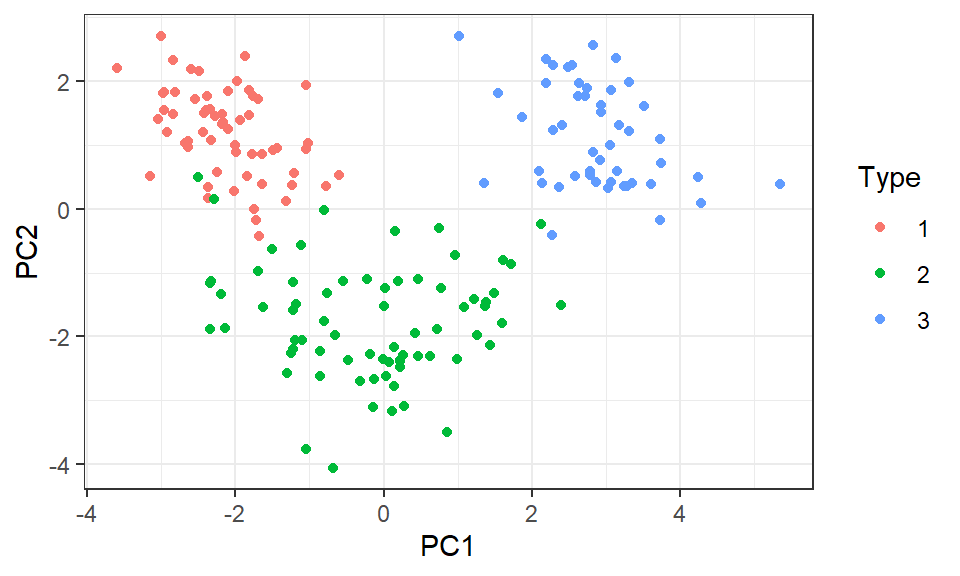

--- EXERCISE END ---

## Download files from a website or other internet source

Many files are downloadable as tab-seperated or comma-separated values. Often these files are hosted on a website of open-data repository. They can be downloaded directly from the url.

Visit the following page:
[Meldingen openbare ruimte Utrecht](https://ckan.dataplatform.nl/dataset/mor-utrecht/resource/e16e9af3-8dbc-4f82-aecf-1c69b628c81d)

### Download from an url with `download.file()`
The code below downloads the `.csv` of the above webpage file to the `/data` dir.


```r
url <- "https://ckan.dataplatform.nl/dataset/7dc70520-1653-49f6-a251-c95939bb6962/resource/e16e9af3-8dbc-4f82-aecf-1c69b628c81d/download/meldingen2015open-data.csv"

download.file(url = url, destfile = here::here(
  "data",
  "meldingen2015open-data.csv"
))
```

### Loading this dataset from Utrecht, The Netherlands into R


```r
meldingen2015open_data <- read_csv(here::here(
  "data",
  "meldingen2015open-data.csv"
))
```

### How many and which notifications (main categories) per Utrecht area?


```r
names(meldingen2015open_data)
```

```
##  [1] "Soort nelding"              "Omschrijving soort melding"
##  [3] "Registratie datum"          "Eind datum"                
##  [5] "Kanaal"                     "Hoofdcategorie"            
##  [7] "Sub- en sub-sub-categorie"  "Postcode"                  
##  [9] "Wijk"                       "Buurt"                     
## [11] "Status"                     "Resultaat"                 
## [13] "Anoniem (J/N)"
```

```r
meldingen2015open_data %>%
  group_by(Hoofdcategorie, Wijk) %>%
  tally() %>%
  ggplot(aes(x = reorder(as_factor(Hoofdcategorie), n), y = n)) +
  geom_point(aes(colour = Wijk), position = "jitter") +
    coord_flip() +
  toolboxr::rotate_axis_labels("x", 90) +
  xlab(NULL) +
  ylab(NULL)
```

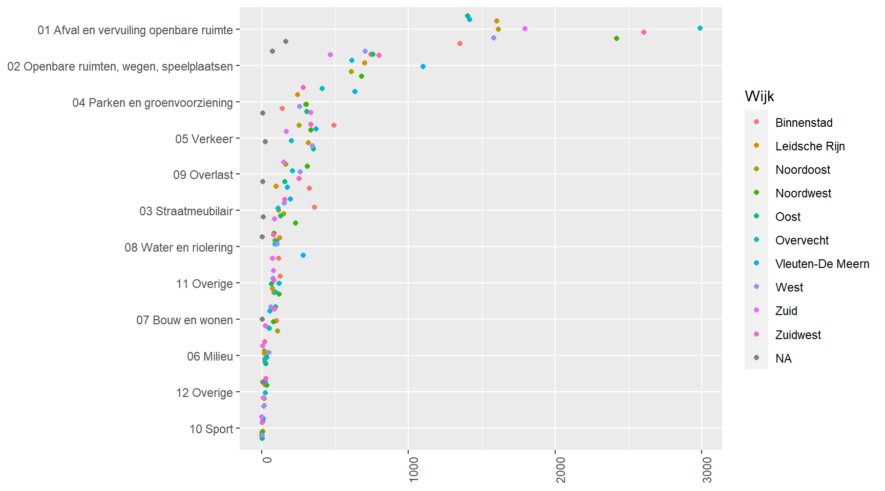

## Repositories: Data-repos

There are many (too many to mention all here) dedicated datasources in the form of data repositories. I will show three examples here: Google datasets / Amazon S3 Buckets and KAGGLE as valuable sources for data.

## Via Google Datasets

I entered the search terms "Canis lupus" AND "Europe"
One of the hits was this link:

[download link](https://journals.plos.org/plosone/article?id=10.1371/journal.pone.0194711#sec010)

The Citation for the data:
```
https://journals.plos.org/plosone/article?id=10.1371/journal.pone.0194711#sec010
```

### Exploring this dataset {-}

```r
wolves <- readxl::read_xlsx(
  here::here("data",
             "S1Table.xlsx")
) %>%
  as_tibble()

wolves
```

```
## # A tibble: 72 × 7
##    Species `Population esti… `Gross domestic … `Compensation s… `Land area (km2…
##    <chr>               <dbl>             <dbl>            <dbl>            <dbl>
##  1 WOLF                  225              4109                0            27398
##  2 WOLF                    5             49581                1            82445
##  3 WOLF                  650              4447                0            51187
##  4 WOLF                 1000              7287                0           108489
##  5 WOLF                  200             13227                1            55974
##  6 WOLF                  230             16316                1            42388
##  7 WOLF                  155             46316                1           303815
##  8 WOLF                  100             42522                1           640427
##  9 WOLF                  150             41514                1           317021
## 10 WOLF                  700             22083                1           130647
## # … with 62 more rows, and 2 more variables: Forest area (km2) <dbl>,
## #   Country group <chr>
```

```r
names(wolves)
```

```
## [1] "Species"                                
## [2] "Population estimate"                    
## [3] "Gross domestic product per capita (USD)"
## [4] "Compensation system"                    
## [5] "Land area (km2)"                        
## [6] "Forest area (km2)"                      
## [7] "Country group"
```

### <mark>**Exercise 5 - Wolves**</mark> {-}

A) Plot the relationship between the variables "Gross domestic product per capita (USD)" and "Population estimate". 
B) Transform both axes to a log10 scale

C) Add a linear relationship (`geom_smooth`, straight line)

D) Add a colour for each "Country group"

E) Now plot a linear relationship (straight line) for each "Country group"


F) Calculate the land area per "Country group" and plot this against the population estimate, what is your conclusion, considering the previous graph and this graph?

```r
wolves %>%
  group_by(`Country group`) %>%
  summarize(total_surface = sum(`Land area (km2)`),
            total_pop = sum(`Population estimate`)) %>%
  ggplot(aes(x = total_surface,
             y = total_pop)) +
  geom_col(aes(fill = `Country group`))
```

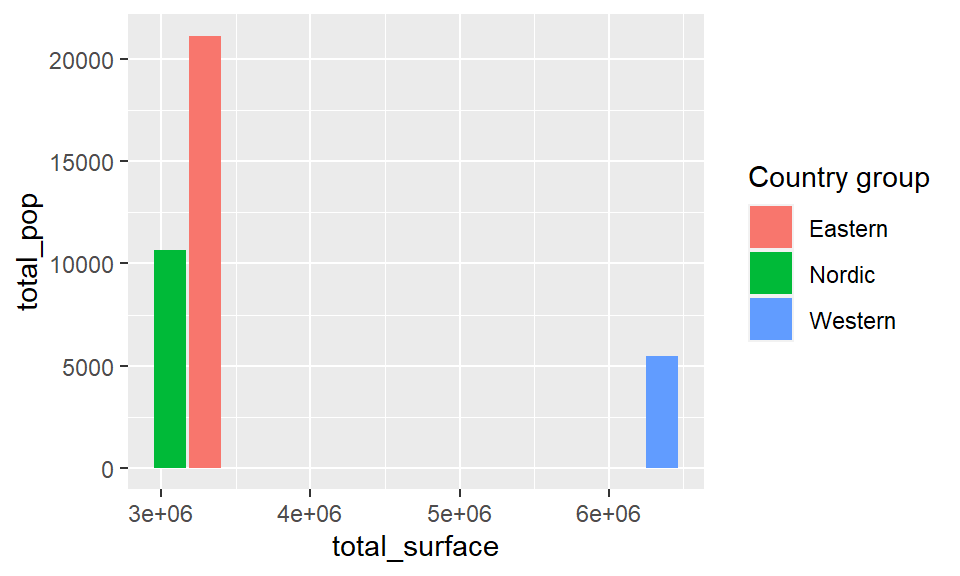

## Scientific Databases

There are many dedicated databases fro scientific data.

For example https://doi.org/10.3334/ORNLDAAC/1275
How to read netCDF files into R:
http://geog.uoregon.edu/bartlein/courses/geog490/week04-netCDF.html

### <mark>**EXERCISE 6 - Annual averages for temperature**</mark> {-}

A) Load the above data from georg into R.
You need to manually download the netcdf file first

```r
library(ncdf4)
# url <- "http://geog.uoregon.edu/GeogR/data/raster/cru10min30_tmp.nc"
# download.file(url = url, destfile = "test.nc", mode = "wb")
ncin <- nc_open(
  here::here(
  "data",  
  "test.nc"))
ncin
```

B) Follow the tutorial at: http://geog.uoregon.edu/bartlein/courses/geog490/week04-netCDF.html. Read until (not including) paragraph: "4 Data frame-to-array conversion(rectangular to raster)"

C) Get the annual mean per monthfor all longitudes and latitudes, for the complete dataset, no missing values


D) What is the temperature pattern (make a graph) for lon = "4.75", lat =	"52.25"
You will need to use 'gather()' to reshape the data first to a stacked format


E) Review the chapter ["Factors"](https://r4ds.had.co.nz/factors.html) of "R for Data Science" and reorder the factor levels so that data per month follows the right order. Create a new graph, displaying the right order of months and corresponding temperature

**Tips:**
 
 - Maybe it is a good idea to strip the 'tmp' part from the month variable names
 - Use dplyr to create a new ordered factor for month.
 - create a vector with the proper month levels as your first step (these will be the new intended levels for the month variable)
 - use the dataframe `tmp_df03` from the step at for this question.
 - maybe use `forcats::fct_relevel()` in conjunction with `dplyr::mutate()`?
 


F) Where on the planet was this measured (tip: Google is you friend) - find the address. Remember, this is an annual average ...

## Opening a .json format

```r
## http://www.programmingr.com/examples/reading-json-data/
library(jsonlite)
# r web / r json - get json data from url
json_file <- "https://ckan.dataplatform.nl/dataset/fcd7fb40-e11d-4200-8d69-6aef6dbd8e0a/resource/79298c25-76fe-4e2a-b2ce-193944abdc89/download/panden-json.zip"

download.file(json_file, destfile = "json.zip")
unzip("json.zip")
data <- fromJSON("panden-json.json")

df <- data$features %>% as_tibble
df
```

## Data Science Contests (Kaggle)

Kaggle is a great resource for learning Data Science

### <mark>**Exercise 7; KAGGLE**</mark> {-} 

A) Create a Kaggle account
B) Go over the analysis at https://www.kaggle.com/kailex/education-languages-and-salary 
C) What is the most preferred programming language on Kaggle 

## Amazon WebServices - S3 buckets

Amazon has many open datasets. The NO-SQL S3 system of Amazon and an API are easy to use for getting this data. Some datasets are quite big, so getting them could take a while (around 5 minutes). A Spark backend is used to speed things up. Here, we explore a dataset called "New York City Taxi and Limousine Commission (TLC) Trip Record Data". This dataset is a record of movements and pick-up-and-drop-off timestamps for major Taxi-services in New York City.

<mark>**Downloading the data takes a while (at least 5 minutes, so be patient when executing the final step of the code below). To prevent downloading the data each time: save the final dataset to a csv at the end.**</mark>


```r
## get data from 
## Bike Share 
# https://s3.amazonaws.com/capitalbikeshare-data/index.html
# Amazon open data buckets
# https://registry.opendata.aws/
library(aws.s3)
library(sparklyr)
library(dplyr)

nyc_tlc_bucket <- get_bucket(bucket = "nyc-tlc")
key <- nyc_tlc_bucket[[3]]$Key
nyc_tlc_csv <- aws.s3::s3read_using(
  read_csv, 
  object = key, 
  bucket = "nyc-tlc")
```

### Enhance performace with Spark (through `{sparklyr}` in R)
Connecting you local Spark engine to an online resource can be quite difficult but will yield speed. So if you'are downloading big datasets, often, it might be worth the hassle.
For illustration puposes: [here you can find how to connect your RStudio Spark (via the R-package `{sparklyr}`) to Amazon AWS S3:]( https://spark.rstudio.com/guides/aws-s3/) 
I will not get into details on this during the course.

### <mark>**EXERCISE 8; Time span?**</mark> {-}
Try to figure out what time span the data covers. hink carefully about how you will answer this question. Write steps in psudo-code first and then try to write the corresponding R code that provides the answer. 

### <mark>**If you are looking for a dataset to use for your capstone project, the TLC dataset is a good candidate. Maybe use `{sparklyr}`, as mentioned above?**</mark> {-}

## Air quality data - AWS
Another example for getting Open Data from AWS Amazon. The OpenAQ data can be retrieved in full from AWS S3 buckets the same way as we retrieved the TLC trip data records above. The full AWS S3 OpenAQ S3 Bucket is located [here:](https://registry.opendata.aws/openaq/)  

However, because of the size of this dataset we will use a slimmed-down version of the data. We can obtain part of the OpenAQ data throught the R-package `{ropenaq}` which is hosted on CRAN and on [Github](https://github.com/ropensci/ropenaq) 

## To get the the 'daily' bucket 

```r
openaq_bucket <- get_bucket(bucket = "openaq-fetches")
key <- openaq_bucket[[3]]$Key
openaq_aws <- aws.s3::s3read_using(
  read_csv, 
  object = key, 
  bucket = "openaq-fetches",
  col_names = FALSE)
```

The full list of all OpenAQ data can be reviewed [here](https://openaq-fetches.s3.amazonaws.com/index.html)

### Using the `{ropenaq}` package from [ROpenSci](https://ropensci.org/). This example was reproduced [from](https://docs.ropensci.org/ropenaq/articles/ropenaq.html). Execute `browseVignettes("ropenaq")` to get more documentation on `{ropenaq}` and what you can do with this package and data. 

**<mark>At time of writing the server seems to be down</mark>**
So the code below does not work at the moment.


```r
## https://github.com/ropensci/ropenaq
# devtools::install_github("ropensci/ropenaq")
library(ropenaq)
library(knitr)

## get countries
countries_table <- aq_countries()
kable(countries_table)

# get metadata on the query (important for reproducubility)
attr(countries_table, "meta")
attr(countries_table, "timestamp")

cities_table_mx <- aq_cities(country="MX")
kable(cities_table_mx)

locations_table_mx <- aq_locations(country = "MX", city = "MEXICO+STATE", limit = 10, page = 1)
kable(locations_table_mx)

## only locations that have data for paramter pm25
all_pm25_mx <- locations_table_mx %>%
  dplyr::filter(pm25 == TRUE)

locations <- unique(all_pm25_mx$locationURL)
cities <- unique(all_pm25_mx$cityURL)

## get data for one location
results_table <- aq_latest(country = "MX", location = locations[2])
kable(results_table)
```

### <mark>**If you are looking for a dataset to use for your capstone project, the OpenAQ dataset is a good candidate**</mark> {-}

### <mark>**EXERCISE 9; OpenAQ data (Airquality)**</mark> {-}

A) Which cities of the Netherlands are represented in the data

B) If you want to create maps from the OpenAQ data, where would you look for information on how to do this (in R)? Can you find and run a good example?

## Dedicated API's
The Open Data API from the Centraal Bureau voor de Statistiek in the Netherlands is a good example of a well-documented API that we can use to get valuable datasets. During the course a demo will be provided on the use of this API/portal.

## Scraping of websites

Climbing accidents

```r
library(rvest)
library(tidyverse)

url_accidents <- read_html("https://www.klimongevallen.nl/ongevallen/")

accidents_page <- url_accidents %>%
  html_nodes("#ongevallentable") 

table <- accidents_page[[1]] %>%
  html_table() %>%
as_tibble()

table
```

```
## # A tibble: 293 × 7
##    Datum      Locatie Activiteit Klimstijl `Omschrijving i… Letsel `Vermoedelijke …
##    <chr>      <chr>   <chr>      <chr>     <chr>            <chr>  <chr>           
##  1 2021-08-12 Tautav… Sportklim… Voorklim… Ongezekerd voor… ""     Onderschatting …
##  2 2021-08-01 Boulde… Boulderen  Boulderen Arm gebroken na… "Arm … Verkeerd terech…
##  3 2021-07-29 Klimha… Sportklim… Naklimmen Niet vastgemaak… "Beid… Niet vastgemaak…
##  4 2021-07-28 Val d'… Sportklim… Voorklim… Setje hangt zic… "Geen" Tot grote verba…
##  5 2021-06-21 Fourne… Sportklim… Voorklim… Voorklimval doo… "Meer… Foutieve inscha…
##  6 2021-06-14 Klimha… Sportklim… Naklimmen Kleine brandwon… "Klei… Te weinig inzic…
##  7 2021-06-09 Boulde… Boulderen  Boulderen Bij dyno val op… "Elle… Dyno wel gehaal…
##  8 2021-03-30 Klimha… Sportklim… Naklimmen Toprope examen,… "Geen… Combi gewichtsv…
##  9 2020-12-13 Klimha… Sportklim… Naklimmen Vergeten in te … "Pols… Vergeten in te …
## 10 2020-12-08 Boulde… Boulderen  Boulderen Ongelukkige lan… "Heef… Voet bleef hang…
## # … with 283 more rows
```

```r
names(table)
```

```
## [1] "Datum"                 "Locatie"               "Activiteit"           
## [4] "Klimstijl"             "Omschrijving incident" "Letsel"               
## [7] "Vermoedelijke oorzaak"
```

```r
ind <- str_detect(string = table$Letsel, 
           pattern = regex("overleden", ignore_case = TRUE))

deaths <- table[ind, ]

deaths 
```

```
## # A tibble: 4 × 7
##   Datum      Locatie Activiteit Klimstijl `Omschrijving i… Letsel `Vermoedelijke …
##   <chr>      <chr>   <chr>      <chr>     <chr>            <chr>  <chr>           
## 1 2013-07-14 Nidegg… Sportklim… Aanloop   Val van 10 m to… Overl… Uit balans gera…
## 2 2011-09-15 Klimha… Sportklim… Naklimmen Klimmer valt to… Overl… Het touw is uit…
## 3 2008-05-13 Klimha… Sportklim… Naklimmen Dodelijke val b… Overl… Een moment van …
## 4 2002-08-27 Klimha… Sportklim… Naklimmen Dodelijke val b… Overl… Een moment van …
```

```r
ind <- str_detect(string = table$Letsel, 
                  pattern = regex("zwaar gewond", ignore_case = TRUE))


severe <- table[ind,]


deaths_severe <- dplyr::bind_rows(deaths, severe) 
deaths_severe %>%
  mutate(datum_new = lubridate::ymd(Datum)) %>%
  arrange(desc(datum_new)) %>%
  select(Datum, Activiteit, Locatie, Letsel) %>% knitr::kable()
```


|Datum      |Activiteit   |Locatie             |Letsel        |
|:----------|:------------|:-------------------|:-------------|
|2015-04-06 |Sportklimmen |Klimhal Nederland   |Zwaar gewond. |
|2013-07-14 |Sportklimmen |Nideggen, Duitsland |Overleden.    |
|2011-09-15 |Sportklimmen |Klimhal Nederland   |Overleden.    |
|2008-05-13 |Sportklimmen |Klimhal Nederland   |Overleden.    |
|2002-08-27 |Sportklimmen |Klimhal Nederland   |Overleden.    |

```r
injuries <- unique(table$Letsel) %>%
  enframe()


table_new <- table %>%
  mutate(Datum_new = lubridate::ymd(Datum)) %>%
  mutate(year = lubridate::floor_date(Datum_new, unit = "years")) %>%
  mutate(letsel_new = 
           str_replace_all(string = Letsel, pattern = regex("Geen.|Geen"),
                           replacement = NA_character_)) %>%
  na.omit()


stats <- table_new %>%
#  dplyr::filter() %>%
  group_by(Activiteit, year) %>%
  tally() %>%
  arrange(desc(n))
 

plot1 <- stats %>%
  ggplot(aes(x = year, y = n)) +
  geom_point(aes(colour = Activiteit), size = 3) +
  geom_smooth(aes(group = Activiteit,
                  colour = Activiteit), 
              method = "lm") +
#  citrulliner::theme_individual() +
  ggtitle("Gerapporteerd ongelukken per jaar")

ggsave(plot = plot1, filename = "years.svg",
       width = 18, height = 8, dpi = 300)
ggsave(plot = plot1, filename = "years.png",
       width = 18, height = 8, dpi = 300)

stats <- table %>%
  #  dplyr::filter() %>%
  group_by(Activiteit, Letsel) %>%
  tally() %>%
  arrange(desc(n))

stats
```

```
## # A tibble: 208 × 3
## # Groups:   Activiteit [3]
##    Activiteit                             Letsel                               n
##    <chr>                                  <chr>                            <int>
##  1 Sportklimmen                           "Geen letsel."                      73
##  2 Sportklimmen                           "Geen"                               4
##  3 Sportklimmen                           "Geen letsel"                        4
##  4 Sportklimmen                           "Overleden."                         4
##  5 Sportklimmen                           ""                                   3
##  6 Boulderen                              "Gebroken arm."                      2
##  7 Sportklimmen                           "Verstuikte enkel"                   2
##  8 Adventure klimmen/traditioneel klimmen "Breuk van de binnenknobbel van…     1
##  9 Adventure klimmen/traditioneel klimmen "Enkelbanden gescheurd, zowel b…     1
## 10 Adventure klimmen/traditioneel klimmen "Gebrokken pols"                     1
## # … with 198 more rows
```

```r
plot_def <- stats %>%
arrange(desc(n)) %>%
  na.omit() %>%
#  dplyr::filter(n > 1) %>%
  mutate(letsel_trunc = str_trunc(string = Letsel, width = 12)) %>%
  ggplot(aes(x = letsel_trunc, y = n)) +
  geom_point(aes(colour = Activiteit), position = "jitter") +
  coord_flip()

plot_def
```

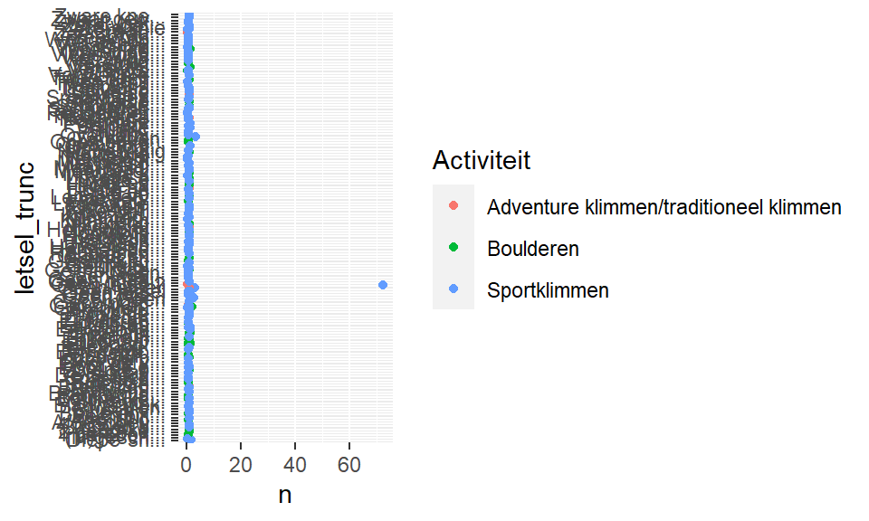


### <mark>**EXERCISE 10; CBS - Open Data**</mark> {-}

https://www.cbs.nl/nl-nl/onze-diensten/open-data/statline-als-open-data/snelstartgids

### <mark>**If you are looking for a source to find dataset to use for your capstone project, the CBS Open Data API/Platform is a good place to look**</mark> {-}

A. Follow the installation instrunctions for the R package `{cbsopendataR}`

```r
# install.packages("cbsodataR")
library(cbsodataR)
```

B. Print a table (to an Excel file, containing all avaiable datasets). Use a pipe, `{readxl}` and the function `cbs_get_toc()`

```r
toc <- cbs_get_toc()
head(toc)
```

```
## # A tibble: 6 × 25
##   Updated             Identifier Title   ShortTitle  ShortDescription   Summary 
##   <dttm>              <chr>      <chr>   <chr>       <chr>              <chr>   
## 1 2020-12-14 00:00:00 84669NED   "Banen… Banen; int… "\nDeze tabel bev… "werkne…
## 2 2020-11-19 00:00:00 83583NED   "Banen… Banen van … "\nDeze tabel gee… "Gemidd…
## 3 2020-11-19 00:00:00 83582NED   "Banen… Banen van … "\nDeze tabel gee… "Gemidd…
## 4 2021-03-04 00:00:00 83628NED   "Banen… Woon-werka… "\nDeze tabel bre… "Banen …
## 5 2021-03-04 00:00:00 83658NED   "Banen… Woon-werka… "\nDeze tabel bre… "Banen …
## 6 2021-03-05 00:00:00 84826NED   "Ontsl… Ontslagen … "\nDeze tabel bev… "ontsla…
## # … with 19 more variables: Modified <dttm>, MetaDataModified <dttm>,
## #   ReasonDelivery <chr>, ExplanatoryText <chr>, OutputStatus <chr>,
## #   Source <chr>, Language <chr>, Catalog <chr>, Frequency <chr>, Period <chr>,
## #   SummaryAndLinks <chr>, ApiUrl <chr>, FeedUrl <chr>,
## #   DefaultPresentation <chr>, DefaultSelection <chr>, GraphTypes <chr>,
## #   RecordCount <int>, ColumnCount <int>, SearchPriority <chr>
```

```r
toc$ShortTitle[1:10]
```

```
##  [1] "Banen; internationalisering bedrijven"   
##  [2] "Banen van werknemers; bedrijfsgrootte"   
##  [3] "Banen van werknemers; SBI2008, regio"    
##  [4] "Woon-werkafstand werknemers; regio"      
##  [5] "Woon-werkafstand; geslacht, leeftijd"    
##  [6] "Ontslagen werknemers door faillissement" 
##  [7] "Flexibele schil;bedr.kenmerken,2007-2017"
##  [8] "Flexibele schil;pers.kenmerken,2007-2017"
##  [9] "Flexibele schil; woonregio, 2007-2017"   
## [10] "Openstaande vacatures; SBI 2008, regio"
```

```r
# Downloaden van gehele tabel (kan een halve minuut duren)
data <- cbs_get_data("83765NED")
head(data)
```

```
## # A tibble: 6 × 109
##   WijkenEnBuurten Gemeentenaam_1     SoortRegio_2 Codering_3  Indelingswijzigin…
##   <chr>           <chr>              <chr>        <chr>       <chr>             
## 1 "NL00      "    "Nederland       … "Land      " "NL00     … .                 
## 2 "GM1680    "    "Aa en Hunze     … "Gemeente  " "GM1680   … .                 
## 3 "WK168000  "    "Aa en Hunze     … "Wijk      " "WK168000 … 1                 
## 4 "BU16800000"    "Aa en Hunze     … "Buurt     " "BU1680000… 1                 
## 5 "BU16800009"    "Aa en Hunze     … "Buurt     " "BU1680000… 1                 
## 6 "WK168001  "    "Aa en Hunze     … "Wijk      " "WK168001 … 1                 
## # … with 104 more variables: AantalInwoners_5 <int>, Mannen_6 <int>,
## #   Vrouwen_7 <int>, k_0Tot15Jaar_8 <int>, k_15Tot25Jaar_9 <int>,
## #   k_25Tot45Jaar_10 <int>, k_45Tot65Jaar_11 <int>, k_65JaarOfOuder_12 <int>,
## #   Ongehuwd_13 <int>, Gehuwd_14 <int>, Gescheiden_15 <int>,
## #   Verweduwd_16 <int>, WestersTotaal_17 <int>, NietWestersTotaal_18 <int>,
## #   Marokko_19 <int>, NederlandseAntillenEnAruba_20 <int>, Suriname_21 <int>,
## #   Turkije_22 <int>, OverigNietWesters_23 <int>, GeboorteTotaal_24 <int>, …
```

```r
# Downloaden van metadata
metadata <- cbs_get_meta("83765NED")

typeof(metadata)
```

```
## [1] "list"
```

```r
metadata$DataProperties
```

```
##               odata.type  ID Position ParentID       Type
## 1    Cbs.OData.GeoDetail   0        0       NA  GeoDetail
## 2   Cbs.OData.TopicGroup   1       NA       NA TopicGroup
## 3        Cbs.OData.Topic   2        1        1      Topic
## 4        Cbs.OData.Topic   3        2        1      Topic
## 5        Cbs.OData.Topic   4        3        1      Topic
## 6        Cbs.OData.Topic   5        4        1      Topic
## 7   Cbs.OData.TopicGroup   6       NA       NA TopicGroup
## 8        Cbs.OData.Topic   7        5        6      Topic
## 9   Cbs.OData.TopicGroup   8       NA        6 TopicGroup
## 10       Cbs.OData.Topic   9        6        8      Topic
## 11       Cbs.OData.Topic  10        7        8      Topic
## 12  Cbs.OData.TopicGroup  11       NA        6 TopicGroup
## 13       Cbs.OData.Topic  12        8       11      Topic
## 14       Cbs.OData.Topic  13        9       11      Topic
## 15       Cbs.OData.Topic  14       10       11      Topic
## 16       Cbs.OData.Topic  15       11       11      Topic
## 17       Cbs.OData.Topic  16       12       11      Topic
## 18  Cbs.OData.TopicGroup  17       NA        6 TopicGroup
## 19       Cbs.OData.Topic  18       13       17      Topic
## 20       Cbs.OData.Topic  19       14       17      Topic
## 21       Cbs.OData.Topic  20       15       17      Topic
## 22       Cbs.OData.Topic  21       16       17      Topic
## 23  Cbs.OData.TopicGroup  22       NA        6 TopicGroup
## 24       Cbs.OData.Topic  23       17       22      Topic
## 25  Cbs.OData.TopicGroup  24       NA       22 TopicGroup
## 26       Cbs.OData.Topic  25       18       24      Topic
## 27       Cbs.OData.Topic  26       19       24      Topic
## 28       Cbs.OData.Topic  27       20       24      Topic
## 29       Cbs.OData.Topic  28       21       24      Topic
## 30       Cbs.OData.Topic  29       22       24      Topic
## 31       Cbs.OData.Topic  30       23       24      Topic
## 32  Cbs.OData.TopicGroup  31       NA        6 TopicGroup
## 33       Cbs.OData.Topic  32       24       31      Topic
## 34       Cbs.OData.Topic  33       25       31      Topic
## 35       Cbs.OData.Topic  34       26       31      Topic
## 36       Cbs.OData.Topic  35       27       31      Topic
## 37  Cbs.OData.TopicGroup  36       NA        6 TopicGroup
## 38       Cbs.OData.Topic  37       28       36      Topic
## 39       Cbs.OData.Topic  38       29       36      Topic
## 40       Cbs.OData.Topic  39       30       36      Topic
## 41       Cbs.OData.Topic  40       31       36      Topic
## 42       Cbs.OData.Topic  41       32       36      Topic
## 43       Cbs.OData.Topic  42       33        6      Topic
## 44  Cbs.OData.TopicGroup  43       NA       NA TopicGroup
## 45       Cbs.OData.Topic  44       34       43      Topic
## 46       Cbs.OData.Topic  45       35       43      Topic
## 47  Cbs.OData.TopicGroup  46       NA       43 TopicGroup
## 48       Cbs.OData.Topic  47       36       46      Topic
## 49       Cbs.OData.Topic  48       37       46      Topic
## 50  Cbs.OData.TopicGroup  49       NA       43 TopicGroup
## 51       Cbs.OData.Topic  50       38       49      Topic
## 52       Cbs.OData.Topic  51       39       49      Topic
## 53  Cbs.OData.TopicGroup  52       NA       43 TopicGroup
## 54       Cbs.OData.Topic  53       40       52      Topic
## 55  Cbs.OData.TopicGroup  54       NA       52 TopicGroup
## 56       Cbs.OData.Topic  55       41       54      Topic
## 57       Cbs.OData.Topic  56       42       54      Topic
## 58       Cbs.OData.Topic  57       43       54      Topic
## 59       Cbs.OData.Topic  58       44       52      Topic
## 60  Cbs.OData.TopicGroup  59       NA       43 TopicGroup
## 61       Cbs.OData.Topic  60       45       59      Topic
## 62       Cbs.OData.Topic  61       46       59      Topic
## 63  Cbs.OData.TopicGroup  62       NA       NA TopicGroup
## 64  Cbs.OData.TopicGroup  63       NA       62 TopicGroup
## 65       Cbs.OData.Topic  64       47       63      Topic
## 66  Cbs.OData.TopicGroup  65       NA       63 TopicGroup
## 67       Cbs.OData.Topic  66       48       65      Topic
## 68       Cbs.OData.Topic  67       49       65      Topic
## 69       Cbs.OData.Topic  68       50       65      Topic
## 70       Cbs.OData.Topic  69       51       65      Topic
## 71       Cbs.OData.Topic  70       52       65      Topic
## 72  Cbs.OData.TopicGroup  71       NA       63 TopicGroup
## 73       Cbs.OData.Topic  72       53       71      Topic
## 74       Cbs.OData.Topic  73       54       71      Topic
## 75  Cbs.OData.TopicGroup  74       NA       62 TopicGroup
## 76       Cbs.OData.Topic  75       55       74      Topic
## 77  Cbs.OData.TopicGroup  76       NA       74 TopicGroup
## 78       Cbs.OData.Topic  77       56       76      Topic
## 79       Cbs.OData.Topic  78       57       76      Topic
## 80       Cbs.OData.Topic  79       58       76      Topic
## 81       Cbs.OData.Topic  80       59       76      Topic
## 82       Cbs.OData.Topic  81       60       76      Topic
## 83  Cbs.OData.TopicGroup  82       NA       74 TopicGroup
## 84       Cbs.OData.Topic  83       61       82      Topic
## 85       Cbs.OData.Topic  84       62       82      Topic
## 86       Cbs.OData.Topic  85       63       74      Topic
## 87  Cbs.OData.TopicGroup  86       NA       NA TopicGroup
## 88  Cbs.OData.TopicGroup  87       NA       86 TopicGroup
## 89       Cbs.OData.Topic  88       64       87      Topic
## 90       Cbs.OData.Topic  89       65       87      Topic
## 91       Cbs.OData.Topic  90       66       87      Topic
## 92       Cbs.OData.Topic  91       67       87      Topic
## 93       Cbs.OData.Topic  92       68       87      Topic
## 94       Cbs.OData.Topic  93       69       87      Topic
## 95  Cbs.OData.TopicGroup  94       NA       86 TopicGroup
## 96       Cbs.OData.Topic  95       70       94      Topic
## 97       Cbs.OData.Topic  96       71       94      Topic
## 98       Cbs.OData.Topic  97       72       94      Topic
## 99       Cbs.OData.Topic  98       73       94      Topic
## 100 Cbs.OData.TopicGroup  99       NA       NA TopicGroup
## 101      Cbs.OData.Topic 100       74       99      Topic
## 102      Cbs.OData.Topic 101       75       99      Topic
## 103      Cbs.OData.Topic 102       76       99      Topic
## 104      Cbs.OData.Topic 103       77       99      Topic
## 105 Cbs.OData.TopicGroup 104       NA       NA TopicGroup
## 106      Cbs.OData.Topic 105       78      104      Topic
## 107 Cbs.OData.TopicGroup 106       NA      104 TopicGroup
## 108      Cbs.OData.Topic 107       79      106      Topic
## 109      Cbs.OData.Topic 108       80      106      Topic
## 110      Cbs.OData.Topic 109       81      106      Topic
## 111      Cbs.OData.Topic 110       82      106      Topic
## 112      Cbs.OData.Topic 111       83      106      Topic
## 113      Cbs.OData.Topic 112       84      106      Topic
## 114      Cbs.OData.Topic 113       85      106      Topic
## 115 Cbs.OData.TopicGroup 114       NA       NA TopicGroup
## 116 Cbs.OData.TopicGroup 115       NA      114 TopicGroup
## 117      Cbs.OData.Topic 116       86      115      Topic
## 118 Cbs.OData.TopicGroup 117       NA      115 TopicGroup
## 119      Cbs.OData.Topic 118       87      117      Topic
## 120      Cbs.OData.Topic 119       88      117      Topic
## 121 Cbs.OData.TopicGroup 120       NA      115 TopicGroup
## 122      Cbs.OData.Topic 121       89      120      Topic
## 123      Cbs.OData.Topic 122       90      120      Topic
## 124      Cbs.OData.Topic 123       91      115      Topic
## 125      Cbs.OData.Topic 124       92      115      Topic
## 126      Cbs.OData.Topic 125       93      114      Topic
## 127 Cbs.OData.TopicGroup 126       NA       NA TopicGroup
## 128      Cbs.OData.Topic 127       94      126      Topic
## 129      Cbs.OData.Topic 128       95      126      Topic
## 130      Cbs.OData.Topic 129       96      126      Topic
## 131 Cbs.OData.TopicGroup 130       NA      126 TopicGroup
## 132      Cbs.OData.Topic 131       97      130      Topic
## 133      Cbs.OData.Topic 132       98      130      Topic
## 134 Cbs.OData.TopicGroup 133       NA       NA TopicGroup
## 135      Cbs.OData.Topic 134       99      133      Topic
## 136      Cbs.OData.Topic 135      100      133      Topic
## 137      Cbs.OData.Topic 136      101      133      Topic
## 138 Cbs.OData.TopicGroup 137       NA       NA TopicGroup
## 139      Cbs.OData.Topic 138      102      137      Topic
## 140      Cbs.OData.Topic 139      103      137      Topic
## 141 Cbs.OData.TopicGroup 140       NA       NA TopicGroup
## 142      Cbs.OData.Topic 141      104      140      Topic
## 143      Cbs.OData.Topic 142      105      140      Topic
## 144 Cbs.OData.TopicGroup 143       NA       NA TopicGroup
## 145      Cbs.OData.Topic 144      106      143      Topic
## 146      Cbs.OData.Topic 145      107      143      Topic
## 147      Cbs.OData.Topic 146      108      143      Topic
##                                          Key
## 1                            WijkenEnBuurten
## 2                                           
## 3                             Gemeentenaam_1
## 4                               SoortRegio_2
## 5                                 Codering_3
## 6        IndelingswijzigingWijkenEnBuurten_4
## 7                                           
## 8                           AantalInwoners_5
## 9                                           
## 10                                  Mannen_6
## 11                                 Vrouwen_7
## 12                                          
## 13                            k_0Tot15Jaar_8
## 14                           k_15Tot25Jaar_9
## 15                          k_25Tot45Jaar_10
## 16                          k_45Tot65Jaar_11
## 17                        k_65JaarOfOuder_12
## 18                                          
## 19                               Ongehuwd_13
## 20                                 Gehuwd_14
## 21                             Gescheiden_15
## 22                              Verweduwd_16
## 23                                          
## 24                          WestersTotaal_17
## 25                                          
## 26                      NietWestersTotaal_18
## 27                                Marokko_19
## 28             NederlandseAntillenEnAruba_20
## 29                               Suriname_21
## 30                                Turkije_22
## 31                      OverigNietWesters_23
## 32                                          
## 33                         GeboorteTotaal_24
## 34                       GeboorteRelatief_25
## 35                          SterfteTotaal_26
## 36                        SterfteRelatief_27
## 37                                          
## 38                      HuishoudensTotaal_28
## 39                 Eenpersoonshuishoudens_29
## 40              HuishoudensZonderKinderen_30
## 41                 HuishoudensMetKinderen_31
## 42           GemiddeldeHuishoudensgrootte_32
## 43                    Bevolkingsdichtheid_33
## 44                                          
## 45                         Woningvoorraad_34
## 46                 GemiddeldeWoningwaarde_35
## 47                                          
## 48              PercentageEengezinswoning_36
## 49             PercentageMeergezinswoning_37
## 50                                          
## 51                      PercentageBewoond_38
## 52                    PercentageOnbewoond_39
## 53                                          
## 54                           Koopwoningen_40
## 55                                          
## 56                     HuurwoningenTotaal_41
## 57                InBezitWoningcorporatie_42
## 58              InBezitOverigeVerhuurders_43
## 59                       EigendomOnbekend_44
## 60                                          
## 61                       BouwjaarVoor2000_45
## 62                      BouwjaarVanaf2000_46
## 63                                          
## 64                                          
## 65  GemiddeldElektriciteitsverbruikTotaal_47
## 66                                          
## 67                            Appartement_48
## 68                           Tussenwoning_49
## 69                             Hoekwoning_50
## 70                  TweeOnderEenKapWoning_51
## 71                      VrijstaandeWoning_52
## 72                                          
## 73                             Huurwoning_53
## 74                            EigenWoning_54
## 75                                          
## 76         GemiddeldAardgasverbruikTotaal_55
## 77                                          
## 78                            Appartement_56
## 79                           Tussenwoning_57
## 80                             Hoekwoning_58
## 81                  TweeOnderEenKapWoning_59
## 82                      VrijstaandeWoning_60
## 83                                          
## 84                             Huurwoning_61
## 85                            EigenWoning_62
## 86   PercentageWoningenMetStadsverwarming_63
## 87                                          
## 88                                          
## 89               AantalInkomensontvangers_64
## 90   GemiddeldInkomenPerInkomensontvanger_65
## 91             GemiddeldInkomenPerInwoner_66
## 92          k_40PersonenMetLaagsteInkomen_67
## 93          k_20PersonenMetHoogsteInkomen_68
## 94                       Actieven1575Jaar_69
## 95                                          
## 96       k_40HuishoudensMetLaagsteInkomen_70
## 97       k_20HuishoudensMetHoogsteInkomen_71
## 98           HuishoudensMetEenLaagInkomen_72
## 99         HuishOnderOfRondSociaalMinimum_73
## 100                                         
## 101     PersonenPerSoortUitkeringBijstand_74
## 102           PersonenPerSoortUitkeringAO_75
## 103           PersonenPerSoortUitkeringWW_76
## 104          PersonenPerSoortUitkeringAOW_77
## 105                                         
## 106             BedrijfsvestigingenTotaal_78
## 107                                         
## 108            ALandbouwBosbouwEnVisserij_79
## 109                 BFNijverheidEnEnergie_80
## 110                      GIHandelEnHoreca_81
## 111     HJVervoerInformatieEnCommunicatie_82
## 112     KLFinancieleDienstenOnroerendGoed_83
## 113            MNZakelijkeDienstverlening_84
## 114     RUCultuurRecreatieOverigeDiensten_85
## 115                                         
## 116                                         
## 117                   PersonenautoSTotaal_86
## 118                                         
## 119           PersonenautoSJongerDan6Jaar_87
## 120             PersonenautoS6JaarEnOuder_88
## 121                                         
## 122         PersonenautoSBrandstofBenzine_89
## 123         PersonenautoSOverigeBrandstof_90
## 124            PersonenautoSPerHuishouden_91
## 125          PersonenautoSNaarOppervlakte_92
## 126                          Motorfietsen_93
## 127                                         
## 128          AfstandTotHuisartsenpraktijk_94
## 129             AfstandTotGroteSupermarkt_95
## 130           AfstandTotKinderdagverblijf_96
## 131                                         
## 132                      AfstandTotSchool_97
## 133                      ScholenBinnen3Km_98
## 134                                         
## 135                     OppervlakteTotaal_99
## 136                      OppervlakteLand_100
## 137                     OppervlakteWater_101
## 138                                         
## 139             MeestVoorkomendePostcode_102
## 140                   Dekkingspercentage_103
## 141                                         
## 142                 MateVanStedelijkheid_104
## 143           Omgevingsadressendichtheid_105
## 144                                         
## 145      TotaalDiefstalUitWoningSchuurED_106
## 146  VernielingMisdrijfTegenOpenbareOrde_107
## 147          GeweldsEnSeksueleMisdrijven_108
##                                        Title
## 1                          Wijken en buurten
## 2                            Regioaanduiding
## 3                               Gemeentenaam
## 4                                Soort regio
## 5                                   Codering
## 6       Indelingswijziging wijken en buurten
## 7                                  Bevolking
## 8                            Aantal inwoners
## 9                                   Geslacht
## 10                                    Mannen
## 11                                   Vrouwen
## 12                          Leeftijdsgroepen
## 13                             0 tot 15 jaar
## 14                            15 tot 25 jaar
## 15                            25 tot 45 jaar
## 16                            45 tot 65 jaar
## 17                          65 jaar of ouder
## 18                         Burgerlijke staat
## 19                                  Ongehuwd
## 20                                    Gehuwd
## 21                                Gescheiden
## 22                                 Verweduwd
## 23      Personen met een migratieachtergrond
## 24                            Westers totaal
## 25                              Niet-westers
## 26                       Niet-westers totaal
## 27                                   Marokko
## 28             Nederlandse Antillen en Aruba
## 29                                  Suriname
## 30                                   Turkije
## 31                       Overig niet-westers
## 32                       Geboorte en sterfte
## 33                           Geboorte totaal
## 34                         Geboorte relatief
## 35                            Sterfte totaal
## 36                          Sterfte relatief
## 37                  Particuliere huishoudens
## 38                        Huishoudens totaal
## 39                    Eenpersoonshuishoudens
## 40               Huishoudens zonder kinderen
## 41                  Huishoudens met kinderen
## 42             Gemiddelde huishoudensgrootte
## 43                       Bevolkingsdichtheid
## 44                                     Wonen
## 45                            Woningvoorraad
## 46                   Gemiddelde woningwaarde
## 47                        Woningen naar type
## 48                Percentage eengezinswoning
## 49               Percentage meergezinswoning
## 50                    Woningen naar bewoning
## 51                        Percentage bewoond
## 52                      Percentage onbewoond
## 53                    Woningen naar eigendom
## 54                              Koopwoningen
## 55                              Huurwoningen
## 56                       Huurwoningen totaal
## 57                 In bezit woningcorporatie
## 58              In bezit overige verhuurders
## 59                         Eigendom onbekend
## 60                    Woningen naar bouwjaar
## 61                        Bouwjaar voor 2000
## 62                       Bouwjaar vanaf 2000
## 63                                   Energie
## 64          Gemiddeld elektriciteitsverbruik
## 65   Gemiddeld elektriciteitsverbruik totaal
## 66                           Naar woningtype
## 67                               Appartement
## 68                              Tussenwoning
## 69                                Hoekwoning
## 70                 Twee-onder-één-kap-woning
## 71                        Vrijstaande woning
## 72                             Naar eigendom
## 73                                Huurwoning
## 74                              Eigen woning
## 75                 Gemiddeld aardgasverbruik
## 76          Gemiddeld aardgasverbruik totaal
## 77                           Naar woningtype
## 78                               Appartement
## 79                              Tussenwoning
## 80                                Hoekwoning
## 81                 Twee-onder-één-kap-woning
## 82                        Vrijstaande woning
## 83                             Naar eigendom
## 84                                Huurwoning
## 85                              Eigen woning
## 86   Percentage woningen met stadsverwarming
## 87                                   Inkomen
## 88                      Inkomen van personen
## 89               Aantal inkomensontvangers  
## 90  Gemiddeld inkomen per inkomensontvanger 
## 91            Gemiddeld inkomen per inwoner 
## 92          40% personen met laagste inkomen
## 93          20% personen met hoogste inkomen
## 94                       Actieven 15-75 jaar
## 95                   Inkomen van huishoudens
## 96       40% huishoudens met laagste inkomen
## 97       20% huishoudens met hoogste inkomen
## 98          Huishoudens met een laag inkomen
## 99      Huish. onder of rond sociaal minimum
## 100                        Sociale zekerheid
## 101   Personen per soort uitkering; Bijstand
## 102         Personen per soort uitkering; AO
## 103         Personen per soort uitkering; WW
## 104        Personen per soort uitkering; AOW
## 105            Bedrijfsvestigingen, SBI 2008
## 106               Bedrijfsvestigingen totaal
## 107      Bedrijfsvestigingen naar activiteit
## 108          A Landbouw, bosbouw en visserij
## 109                B-F Nijverheid en energie
## 110                     G+I Handel en horeca
## 111  H+J Vervoer, informatie en communicatie
## 112  K-L Financiële diensten, onroerend goed
## 113            M-N Zakelijke dienstverlening
## 114 R-U Cultuur, recreatie, overige diensten
## 115                          Motorvoertuigen
## 116                           Personenauto's
## 117                    Personenauto's totaal
## 118                 Personenauto's; leeftijd
## 119        Personenauto's; jonger dan 6 jaar
## 120          Personenauto's; 6 jaar en ouder
## 121            Personenauto's; brandstoftype
## 122        Personenauto's; brandstof benzine
## 123        Personenauto's; overige brandstof
## 124            Personenauto's per huishouden
## 125          Personenauto's naar oppervlakte
## 126                             Motorfietsen
## 127                  Nabijheid voorzieningen
## 128           Afstand tot huisartsenpraktijk
## 129             Afstand tot grote supermarkt
## 130            Afstand tot kinderdagverblijf
## 131                           Basisonderwijs
## 132                       Afstand tot school
## 133                      Scholen binnen 3 km
## 134                              Oppervlakte
## 135                       Oppervlakte totaal
## 136                         Oppervlakte land
## 137                        Oppervlakte water
## 138                                 Postcode
## 139               Meest voorkomende postcode
## 140                       Dekkingspercentage
## 141                            Stedelijkheid
## 142                   Mate van stedelijkheid
## 143               Omgevingsadressendichtheid
## 144                            Criminaliteit
## 145   Totaal diefstal uit woning/schuur/e.d.
## 146 Vernieling, misdrijf tegen openbare orde
## 147          Gewelds- en seksuele misdrijven
##                                                                                                                                                                                                                                                                                                                                                                                                                                                                                                                                                                                                                                                                                                                                                                                                                                                                                                                                                                                                                                                                                                                                                                                                                                                                                                                                                                                                                                                                                                                                                                                                                                                                                                                                                                                                                                                                                                                                                                                                                                                                                                                                                                                                                                                                                                                                                                                                                                                                                                                                                                                                                                                                                                                                                                                                                                                                                                                                                                                                                                                                                                                                                                   Description
## 1                                                                                                                                                                                                                                                                                                                                                                                                                                                                                                                                                                                                                                                                                                                                                                                                                                                                                                                                                                                                                                                                                                                                                                                                                                                                                                                                                                                                                                                                                                                                                                                                                                                                                                                                                                                                                                                                                                                                                                                                                                                                                                                                                                                                                                                                                                                                                                                                                                                                                                                                                                                                                                                                                                                                                                                                                                                                                                                                                                                                                                                                                                                                                                            
## 2                                                                                                                                                                                                                                                                                                                                                                                                                                                                                                                                                                                                                                                                                                                                                                                                                                                                                                                                                                                                                                                                                                                                                                                                                                                                                                                                                                                                                                                                                                                                                                                                                                                                                                                                                                                                                                                                                                                                                                                                                                                                                                                                                                                                                                                                                                   De gemeenten in Nederland zijn onderverdeeld in wijken en buurten. Buurten vormen het laagste regionale niveau. Wijken zijn optellingen van één of meer aaneengesloten buurten. De gemeente bepaalt zelf de indeling in wijken en buurten. Het CBS coördineert landelijk deze indeling.\r\n\r\nWijk:\r\nOnderdeel van een gemeente waarin een bepaalde vorm van bodemgebruik of bebouwing overheerst. Bijvoorbeeld: industriegebied, woongebied met hoogbouw of laagbouw. Een wijk bestaat uit één of meerdere buurten. \r\n\r\nBuurt:\r\nOnderdeel van een gemeente, dat vanuit bebouwingsoogpunt of sociaaleconomische structuur homogeen is afgebakend. Homogeen wil zeggen dat één functie dominant is, bijvoorbeeld woonfunctie (woongebied), werkfunctie (industriegebied) of recreatieve functie (natuurgebied). Functies kunnen echter ook gemengd voorkomen.\r\n
## 3                                                                                                                                                                                                                                                                                                                                                                                                                                                                                                                                                                                                                                                                                                                                                                                                                                                                                                                                                                                                                                                                                                                                                                                                                                                                                                                                                                                                                                                                                                                                                                                                                                                                                                                                                                                                                                                                                                                                                                                                                                                                                                                                                                                                                                                                                                                                                                                                                                                                                                                                                                                                                                                                                                                                                                                                                                                                                                                                                                                                                                                                                            De naam van de bestuurlijke gemeente. Deze naam volgt de officiële schrijfwijze.
## 4                                                                                                                                                                                                                                                                                                                                                                                                                                                                                                                                                                                                                                                                                                                                                                                                                                                                                                                                                                                                                                                                                                                                                                                                                                                                                                                                                                                                                                                                                                                                                                                                                                                                                                                                                                                                                                                                                                                                                                                                                                                                                                                                                                                                                                                                                                                                                                                                                                                                                                                                                                                                                                                                                                                                                                                                                                                                                                                                                                                                                                                                                                                De gekozen regioaanduiding betreft: Gemeente, Wijk of Buurt.
## 5                                                                                                                                                                                                                                                                                                                                                                                                                                                                                                                                                                                                                                                                                                                                                                                                                                                                                                                                                                                                                                                                                                                                                                                                                                                                                                                                                                                                                                                                                                                                                                                                                                                                                                                                                                                                                                                                                                                                                                                                                                                                                                                                                                                                                                                                                                                                                                                                                                                                                                                                                                                                                                                                                                                                                                                                                                                                                                                       Gemeentecode heeft 4 posities, voorafgegaan door ‘GM’.\r\nWijkcode heeft 6 posities: gemeentecode (4) + wijkcode (2), voorafgegaan door ‘WK’.\r\nBuurtcode heeft 8 posities: gemeentecode (4) + wijkcode (2) + buurtcode (2), voorafgegaan door ‘BU’.
## 6                                                                                                                                                                                                                                                                                                                                                                                                                                                                                                                                                                                                                                                                                                                                                                                                                                                                                                                                                                                                                                                                                                                                                                                                                                                                                                                                                                                                                                                                                                                 Deze indicator geeft per wijk en buurt aan of de cijfers uit deze tabel zonder problemen kunnen worden gekoppeld aan en vergeleken met de cijfers van een jaar eerder, of dat er wijzigingen in de Wijk- en Buurtindeling zijn waardoor dit niet kan. Detailinformatie over wijzigingen in de Wijk- en Buurtindeling kan worden verkregen door de wijk- en buurtkaart van twee opeenvolgende jaren met elkaar te vergelijken.\r\n\r\nDe indicator kent drie mogelijke waarden:\r\n1: De codering en afbakening van deze wijk/buurt is ongewijzigd ten opzichte van het voorgaande jaar. Het is wel mogelijk dat een naamswijziging heeft plaatsgevonden. De cijfers kunnen worden gekoppeld en vergeleken met die van het voorgaande jaar.\r\n2: De codering van de wijk/buurt is veranderd ten opzichte van het voorgaande jaar. De afbakening is ongewijzigd. Om te kunnen koppelen met cijfers van het voorgaande jaar zal eerst moeten worden achterhaald wat de codering van het voorgaande jaar was. Is de koppeling eenmaal geslaagd dan kunnen de cijfers alsnog met elkaar worden vergeleken.\r\n3: De afbakening van de wijk/buurt is veranderd ten opzichte van het voorgaande jaar. Dit kan gepaard zijn gegaan met een gewijzigde codering. De cijfers kunnen niet zonder meer worden vergeleken met die van het voorgaande jaar. Verschillen kunnen immers samenhangen met de verandering in de afbakening van de wijk of buurt.\r\n\r\nVoor een wijk of buurt wordt alleen een wijziging in de afbakening geconstateerd wanneer een grens circa 5 meter of meer is verlegd. Kleinere grenswijzigingen worden niet als significant beschouwd.
## 7                                                                                                                                                                                                                                                                                                                                                                                                                                                                                                                                                                                                                                                                                                                                                                                                                                                                                                                                                                                                                                                                                                                                                                  De bevolking van Nederland op 1 januari.\r\n\r\nBevolking:\r\nDe inwoners van Nederland.\r\nIn de bevolkingsaantallen zijn uitsluitend personen begrepen die zijn opgenomen in het bevolkingsregister van een Nederlandse gemeente. \r\nIn principe wordt iedereen die voor onbepaalde tijd in Nederland woont, opgenomen in het bevolkingsregister van de woongemeente. Personen die tot de bevolking van Nederland behoren, maar voor wie geen vaste woonplaats valt aan te wijzen, zijn opgenomen in het bevolkingsregister van de gemeente 's-Gravenhage.\r\nIn de bevolkingsregisters zijn niet opgenomen de in Nederland wonende personen waarvoor uitzonderingsregels gelden met betrekking tot opneming in de bevolkingsregisters (bijvoorbeeld diplomaten en NAVO militairen) en personen die niet legaal in Nederland verblijven.\r\n\r\nOm redenen van statistische geheimhouding zijn de aantallen op wijk- en buurtniveau aselect afgerond op veelvouden van 5. \r\nBij aselect afronden wordt door loten bepaald of een getal naar boven of naar beneden wordt afgerond. De daarbij gehanteerde kansen zijn omgekeerd evenredig met de afrondverschillen. Gemiddeld wordt een getal hierdoor op zichzelf afgerond. Het gemiddelde afrondverschil per getal is evenwel groter dan het geval is bij afronding op het dichtstbijzijnde veelvoud van 5. Door afrondverschillen is de som van afgeronde getallen niet altijd gelijk aan de afgeronde som. Hierdoor kan het voorkomen dat wanneer een wijk uit één buurt bestaat of een gemeente uit één wijk, dit afgerond niet overeenkomt.\r\n\r\nHet komt voor dat van inwoners wel bekend is binnen welke gemeente ze geregistreerd zijn, maar niet exact waar ze verblijven. Deze inwoners zijn daarom wel meegeteld in de gemeentecijfers, maar niet in de cijfers per wijk en buurt. De cijfers per gemeente kunnen daardoor afwijken van de onderliggende wijken of buurten, zelfs wanneer een gemeente slechts uit één wijk bestaat.\r\n
## 8                                                                                                                                                                                                                                                                                                                                                                                                                                                                                                                                                                                                                                                                                                                                                                                                                                                                                                                                                                                                                                                                                                                                                                                                                                                                                                                                                                                                                                                                                                                                                                                                                                                                                                                                                                                                                                                                                                                                                                                                                                                                                                                                                                                                                                                                                                                                                                                                                                                                                                                                                                                                                                                                                                                                                                                                                                                                                                                                                                                                                                                                                                                                                                        <NA>
## 9                                                                                                                                                                                                                                                                                                                                                                                                                                                                                                                                                                                                                                                                                                                                                                                                                                                                                                                                                                                                                                                                                                                                                                                                                                                                                                                                                                                                                                                                                                                                                                                                                                                                                                                                                                                                                                                                                                                                                                                                                                                                                                                                                                                                                                                                                                                                                                                                                                                                                                                                                                                                                                                                                                                                                                                                                                                                                                                                                                                                                                                                                                                                                                        <NA>
## 10                                                                                                                                                                                                                                                                                                                                                                                                                                                                                                                                                                                                                                                                                                                                                                                                                                                                                                                                                                                                                                                                                                                                                                                                                                                                                                                                                                                                                                                                                                                                                                                                                                                                                                                                                                                                                                                                                                                                                                                                                                                                                                                                                                                                                                                                                                                                                                                                                                                                                                                                                                                                                                                                                                                                                                                                                                                                                                                                                                                                                                                                                                                                                                       <NA>
## 11                                                                                                                                                                                                                                                                                                                                                                                                                                                                                                                                                                                                                                                                                                                                                                                                                                                                                                                                                                                                                                                                                                                                                                                                                                                                                                                                                                                                                                                                                                                                                                                                                                                                                                                                                                                                                                                                                                                                                                                                                                                                                                                                                                                                                                                                                                                                                                                                                                                                                                                                                                                                                                                                                                                                                                                                                                                                                                                                                                                                                                                                                                                                                                       <NA>
## 12                                                                                                                                                                                                                                                                                                                                                                                                                                                                                                                                                                                                                                                                                                                                                                                                                                                                                                                                                                                                                                                                                                                                                                                                                                                                                                                                                                                                                                                                                                                                                                                                                                                                                                                                                                                                                                                                                                                                                                                                                                                                                                                                                                                                                                                                                                                                                                                                                                                                                                                                                                                                                                                                                                                                                                                                                                                                                                                                                                                                                                                                                                                                                                       <NA>
## 13                                                                                                                                                                                                                                                                                                                                                                                                                                                                                                                                                                                                                                                                                                                                                                                                                                                                                                                                                                                                                                                                                                                                                                                                                                                                                                                                                                                                                                                                                                                                                                                                                                                                                                                                                                                                                                                                                                                                                                                                                                                                                                                                                                                                                                                                                                                                                                                                                                                                                                                                                                                                                                                                                                                                                                                                                                                                                                                                                                                                                                                                                                                     Aantal inwoners dat op 1 januari 0 tot 15 jaar oud is.
## 14                                                                                                                                                                                                                                                                                                                                                                                                                                                                                                                                                                                                                                                                                                                                                                                                                                                                                                                                                                                                                                                                                                                                                                                                                                                                                                                                                                                                                                                                                                                                                                                                                                                                                                                                                                                                                                                                                                                                                                                                                                                                                                                                                                                                                                                                                                                                                                                                                                                                                                                                                                                                                                                                                                                                                                                                                                                                                                                                                                                                                                                                                                                    Aantal inwoners dat op 1 januari 15 tot 25 jaar oud is.
## 15                                                                                                                                                                                                                                                                                                                                                                                                                                                                                                                                                                                                                                                                                                                                                                                                                                                                                                                                                                                                                                                                                                                                                                                                                                                                                                                                                                                                                                                                                                                                                                                                                                                                                                                                                                                                                                                                                                                                                                                                                                                                                                                                                                                                                                                                                                                                                                                                                                                                                                                                                                                                                                                                                                                                                                                                                                                                                                                                                                                                                                                                                                                    Aantal inwoners dat op 1 januari 25 tot 45 jaar oud is.
## 16                                                                                                                                                                                                                                                                                                                                                                                                                                                                                                                                                                                                                                                                                                                                                                                                                                                                                                                                                                                                                                                                                                                                                                                                                                                                                                                                                                                                                                                                                                                                                                                                                                                                                                                                                                                                                                                                                                                                                                                                                                                                                                                                                                                                                                                                                                                                                                                                                                                                                                                                                                                                                                                                                                                                                                                                                                                                                                                                                                                                                                                                                                                    Aantal inwoners dat op 1 januari 45 tot 65 jaar oud is.
## 17                                                                                                                                                                                                                                                                                                                                                                                                                                                                                                                                                                                                                                                                                                                                                                                                                                                                                                                                                                                                                                                                                                                                                                                                                                                                                                                                                                                                                                                                                                                                                                                                                                                                                                                                                                                                                                                                                                                                                                                                                                                                                                                                                                                                                                                                                                                                                                                                                                                                                                                                                                                                                                                                                                                                                                                                                                                                                                                                                                                                                                                                                                                      Aantal inwoners dat op 1 januari 65 jaar of ouder is.
## 18                                                                                                                                                                                                                                                                                                                                                                                                                                                                                                                                                                                                                                                                                                                                                                                                                                                                                                                                                                                                                                                                                                                                                                                                                                                                                                                                                                                                                                                                                                                                                                                                                                                                                                                                                                                                                                                                                                                                                                                                                                                                                                                                                                                                                                                                                                                                                                                                                                                                                                                                                                                                                                                                                                                                                                                                                                                                                                                                                                                                                                                                                                                                                                       <NA>
## 19                                                                                                                                                                                                                                                                                                                                                                                                                                                                                                                                                                                                                                                                                                                                                                                                                                                                                                                                                                                                                                                                                                                                                                                                                                                                                                                                                                                                                                                                                                                                                                                                                                                                                                                                                                                                                                                                                                                                                                                                                                                                                                                                                                                                                                                                                                                                                                                                                                                                                                                                                                                                                                                                                                                                                                                                                                                                                                                                                                            Het aantal inwoners dat op 1 januari ongehuwd is. De burgerlijke staat ongehuwd geeft aan dat een persoon nog nooit een huwelijk heeft gesloten of een geregistreerd partnerschap is aangegaan.
## 20                                                                                                                                                                                                                                                                                                                                                                                                                                                                                                                                                                                                                                                                                                                                                                                                                                                                                                                                                                                                                                                                                                                                                                                                                                                                                                                                                                                                                                                                                                                                                                                                                                                                                                                                                                                                                                                                                                                                                                                                                                                                                                                                                                                                                                                                                                                                                                                                                                                                                                                                                                                                                                                                                                                                                                                                                                                                                   Het aantal inwoners dat op 1 januari gehuwd is. De burgerlijke staat gehuwd ontstaat na sluiting van een huwelijk of het aangaan van een geregistreerd partnerschap. Tot de gehuwden worden ook personen gerekend die gescheiden zijn van tafel en bed, want zij blijven formeel gehuwd.
## 21                                                                                                                                                                                                                                                                                                                                                                                                                                                                                                                                                                                                                                                                                                                                                                                                                                                                                                                                                                                                                                                                                                                                                                                                                                                                                                                                                                                                                                                                                                                                                                                                                                                                                                                                                                                                                                                                                                                                                                                                                                                                                                                                                                                                                                                                                                                                                                                                                                                                                                                                                                                                                                                                                                                                                                                                                                           Het aantal inwoners dat op 1 januari gescheiden is. De burgerlijke staat gescheiden ontstaat na ontbinding van een huwelijk door echtscheiding of na ontbinding van een geregistreerd partnerschap anders dan door het overlijden van de partner. Personen die gescheiden zijn van tafel en bed worden tot de gehuwden gerekend.
## 22                                                                                                                                                                                                                                                                                                                                                                                                                                                                                                                                                                                                                                                                                                                                                                                                                                                                                                                                                                                                                                                                                                                                                                                                                                                                                                                                                                                                                                                                                                                                                                                                                                                                                                                                                                                                                                                                                                                                                                                                                                                                                                                                                                                                                                                                                                                                                                                                                                                                                                                                                                                                                                                                                                                                                                                                                                                                                                                                                                                    Het aantal inwoners dat op 1 januari verweduwd is. De burgerlijke staat verweduwd ontstaat na ontbinding van een huwelijk of geregistreerd partnerschap door overlijden van de partner.
## 23                                                                                                                                                                                                                                                                                                                                                                                                                                                                                                                                                                                                                                                                                                                                                                                                                                                                                                                                                                                                                                                                                                                                                                                                                                                                                                                                                                                                                                                                                                                                                                                                                                                                                                                                                                                                                                                                                                                                                                                                                                                  Het aantal personen met een migratieachtergrond op 1 januari. \r\n\r\nPersoon met een migratieachtergrond:\r\nPersoon van wie ten minste één ouder in het buitenland is geboren.\r\nPersoon met een eerste generatie migratieachtergrond:\r\nPersoon die in het buitenland is geboren met ten minste één in het buitenland geboren ouder.\r\nPersoon met een tweede generatie migratieachtergrond:\r\nPersoon die in Nederland is geboren met ten minste één in het buitenland geboren ouder.\r\n\r\nPersonen met een migratieachtergrond worden onderverdeeld in westers en niet-westers op grond van hun geboorteland. Tot de categorie 'niet-westers' behoren personen met een migratieachtergrond uit Turkije, Afrika, Latijns-Amerika en Azië met uitzondering van Indonesië en Japan. Op grond van hun sociaaleconomische en sociaal-culturele positie worden personen met een migratieachtergrond uit deze twee landen tot personen met een westerse migratieachtergrond gerekend. Het gaat vooral om mensen die in voormalig Nederlands Indië zijn geboren en werknemers van Japanse bedrijven met hun gezin.\r\n
## 24                                                                                                                                                                                                                                                                                                                                                                                                                                                                                                                                                                                                                                                                                                                                                                                                                                                                                                                                                                                                                                                                                                                                                                                                                                                                                                                                                                                                                                                                                                                                                                                                                                                                                                                                                                                                                                                                                                                                                                                                                                                                                                                                                                                                                                                                                                                                                                                                                                                                                                                                                                                                                                                   Persoon met een migratieachtergrond met als herkomstgroepering een van de landen in de werelddelen Europa (exclusief Turkije), Noord-Amerika en Oceanië of Indonesië of Japan.\r\nOp grond van hun sociaaleconomische en sociaal-culturele positie worden personen met een migratieachtergrond uit Indonesië en Japan tot de westerse personen met een migratieachtergrond gerekend. Het gaat vooral om mensen die in het voormalig Nederlands-Indië zijn geboren en werknemers van Japanse bedrijven met hun gezin.\r\n
## 25                                                                                                                                                                                                                                                                                                                                                                                                                                                                                                                                                                                                                                                                                                                                                                                                                                                                                                                                                                                                                                                                                                                                                                                                                                                                                                                                                                                                                                                                                                                                                                                                                                                                                                                                                                                                                                                                                                                                                                                                                                                                                                                                                                                                                                                                                                                                                                                                                                                                                                                                                                                                                                                    Persoon met een migratieachtergrond met als herkomstgroepering een van de landen in de werelddelen Afrika, Latijns-Amerika en Azië (exclusief Indonesië en Japan) of Turkije.\r\nOp grond van hun sociaaleconomische en sociaal-culturele positie worden personen met een migratieachtergrond uit Indonesië en Japan tot de westerse personen met een migratieachtergrond gerekend. Het gaat vooral om mensen die in het voormalig Nederlands-Indië zijn geboren en werknemers van Japanse bedrijven met hun gezin.\r\n
## 26                                                                                                                                                                                                                                                                                                                                                                                                                                                                                                                                                                                                                                                                                                                                                                                                                                                                                                                                                                                                                                                                                                                                                                                                                                                                                                                                                                                                                                                                                                                                                                                                                                                                                                                                                                                                                                                                                                                                                                                                                                                                                                                                                                                                                                                                                                                                                                                                                                                                                                                                                                                                                                                                                                                                                                                                                                                                                                                                                                                                                                                                                                                                                                       <NA>
## 27                                                                                                                                                                                                                                                                                                                                                                                                                                                                                                                                                                                                                                                                                                                                                                                                                                                                                                                                                                                                                                                                                                                                                                                                                                                                                                                                                                                                                                                                                                                                                                                                                                                                                                                                                                                                                                                                                                                                                                                                                                                                                                                                                                                                                                                                                                                                                                                                                                                                                                                                                                                                                                                                                                                                                                                                                                                                                                                                                                                                                                                                                                                                                                       <NA>
## 28                                                                                                                                                                                                                                                                                                                                                                                                                                                                                                                                                                                                                                                                                                                                                                                                                                                                                                                                                                                                                                                                                                                                                                                                                                                                                                                                                                                                                                                                                                                                                                                                                                                                                                                                                                                                                                                                                                             (voormalige) Nederlandse Antillen en Aruba\r\nBetreft een samentelling van de eilanden die tot het grondgebied van de Nederlandse Antillen en Aruba van vóór 10 oktober 2010 behoorden.\r\nHet gaat om de eilanden Bonaire, Curaçao, Saba, Sint-Eustatius, Sint-Maarten en Aruba.\r\n\r\nVanaf 10 oktober 2010 zijn de Nederlandse Antillen ontbonden. Het Koninkrijk der Nederlanden bestaat dan uit vier landen: Nederland, Aruba, Curaçao en Sint Maarten. Alle eilanden hebben een nieuwe status. Curaçao en Sint Maarten zijn nieuwe landen binnen het Koninkrijk. Met een 'Status aparte' binnen het Koninkrijk zijn Curaçao en Sint Maarten autonome landen. De landen hebben een zelfstandig bestuur en zijn niet meer afhankelijk van Nederland. De openbare lichamen Bonaire, Sint Eustatius en Saba, ook wel Caribisch Nederland, hebben een diepere band met Nederland en functioneren als bijzondere gemeente van Nederland.\r\n\r\nOp 1 januari 1986 werd Aruba afgescheiden van de Nederlandse Antillen. Sinds die datum is Aruba een nieuw land binnen het Koninkrijk de Nederlanden. Met een 'Status aparte' binnen het Koninkrijk is Aruba een autonoom land. Aruba heeft een zelfstandig bestuur en is niet meer afhankelijk van Nederland.
## 29                                                                                                                                                                                                                                                                                                                                                                                                                                                                                                                                                                                                                                                                                                                                                                                                                                                                                                                                                                                                                                                                                                                                                                                                                                                                                                                                                                                                                                                                                                                                                                                                                                                                                                                                                                                                                                                                                                                                                                                                                                                                                                                                                                                                                                                                                                                                                                                                                                                                                                                                                                                                                                                                                                                                                                                                                                                                                                                                                                                                                                                                                                                                                                       <NA>
## 30                                                                                                                                                                                                                                                                                                                                                                                                                                                                                                                                                                                                                                                                                                                                                                                                                                                                                                                                                                                                                                                                                                                                                                                                                                                                                                                                                                                                                                                                                                                                                                                                                                                                                                                                                                                                                                                                                                                                                                                                                                                                                                                                                                                                                                                                                                                                                                                                                                                                                                                                                                                                                                                                                                                                                                                                                                                                                                                                                                                                                                                                                                                                                                       <NA>
## 31                                                                                                                                                                                                                                                                                                                                                                                                                                                                                                                                                                                                                                                                                                                                                                                                                                                                                                                                                                                                                                                                                                                                                                                                                                                                                                                                                                                                                                                                                                                                                                                                                                                                                                                                                                                                                                                                                                                                                                                                                                                                                                                                                                                                                                                                                                                                                                                                                                                                                                                                                                                                                                                                                                                                                                                                                                                                                                                                                                                                                                                                        Totaal niet-westers minus Marokko, (voormalige) Nederlandse Antillen en Aruba, Suriname en Turkije.
## 32                                                                                                                                                                                                                                                                                                                                                                                                                                                                                                                                                                                                                                                                                                                                                                                                                                                                                                                                                                                                                                                                                                                                                                                                                                                                                                                                                                                                                                                                                                                                                                                                                                                                                                                                                                                                                                                                                                                                                                                                                                                                                                                                                                                                                                                                                                                                                                                                                                                                                                                                                                                                                                                                                                                                                                                                                                                                                                                                                                                                                                                                                                                                                                       <NA>
## 33                                                                                                                                                                                                                                                                                                                                                                                                                                                                                                                                                                                                                                                                                                                                                                                                                                                                                                                                                                                                                                                                                                                                                                                                                                                                                                                                                                                                                                                                                                                                                                                                                                                                                                                                                                                                                                                                                                                                                                                                                                                                                                                                                                                                                                                                                                                                                                                                                                                                                                                                                                                                                                                                                                                                                                                                                                                                                                                                                               Het aantal levendgeborenen van 1 januari tot en met 31 december van het betreffende jaar. Levendgeborenen zijn kinderen die na geboorte enig teken van leven hebben vertoond, ongeacht de zwangerschapsduur.
## 34                                                                                                                                                                                                                                                                                                                                                                                                                                                                                                                                                                                                                                                                                                                                                                                                                                                                                                                                                                                                                                                                                                                                                                                                                                                                                                                                                                                                                                                                                                                                                                                                                                                                                                                                                                                                                                                                                                                                                                                                                                                                                                                                                                                                                                                                                                                                                                                                                                                                                                                                                                   Het aantal levendgeborenen van 1 januari tot en met 31 december, per 1 000 inwoners op 1 januari van het betreffende jaar.\r\nHet relatieve aantal geboorten kan hoger uitvallen dan verwacht op basis van het inwonertal. Het relatieve cijfer betreft namelijk het aantal geboorten gedurende het jaar ten opzichte van het aantal inwoners op 1 januari. In nieuwbouwwijken kan het aantal inwoners sterk groeien in een jaar. Zo kunnen er in 1 jaar 10 kinderen geboren worden in een wijk waarin op 1 januari slechts 10 inwoners wonen, maar aan het eind van het jaar bijvoorbeeld 200 inwoners.
## 35                                                                                                                                                                                                                                                                                                                                                                                                                                                                                                                                                                                                                                                                                                                                                                                                                                                                                                                                                                                                                                                                                                                                                                                                                                                                                                                                                                                                                                                                                                                                                                                                                                                                                                                                                                                                                                                                                                                                                                                                                                                                                                                                                                                                                                                                                                                                                                                                                                                                                                                                                                                                                                                                                                                                                                                                                                                                                                                                                                                                                            Alle overledenen van 1 januari tot en met 31 december van het betreffende jaar waarbij een bevoegde arts een overlijdensakte heeft ondertekend.
## 36                                                                                                                                                                                                                                                                                                                                                                                                                                                                                                                                                                                                                                                                                                                                                                                                                                                                                                                                                                                                                                                                                                                                                                                                                                                                                                                                                                                                                                                                                                                                                                                                                                                                                                                                                                                                                                                                                                                                                                                                                                                                                                                                                                                                                                                                                                                                                                                                                                                                                              Het aantal overledenen van 1 januari tot en met 31 december, per 1 000 inwoners op 1 januari van het betreffende jaar.\r\nHet relatieve aantal overledenen kan hoger uitvallen dan verwacht op basis van het inwonertal. Het relatieve cijfer betreft namelijk het aantal overledenen gedurende het jaar ten opzichte van het aantal inwoners op 1 januari. In een buurt met een verpleeghuis kunnen op 1 januari 100 mensen wonen, maar door overlijdensgevallen komen er steeds nieuwe inwoners (bewoners van het verpleeghuis). Zo kan het aantal overlijdensgevallen ook 100 zijn, terwijl er inmiddels al vele mensen in die buurt (of dat verpleeghuis) hebben gewoond.
## 37                                                                                                                                                                                                                                                                                                                                                                                                                                                                                                                                                                                                                                                                                                                                                                                                                                                                                                                                                                                                                                                                                                                                                                                                                                                                                                                                                                                                                                                                                                                                                                                                                                                                                                                                                                                                                                                                                                                                                                                                                                                                                                                                                                                                                                                                                                                                                                                                                                                                                                                                                                                                                                                                                              Betreft de huishoudens op 1 januari. \r\nParticuliere huishoudens bestaan uit één of meer personen die alleen of samen in een woonruimte zijn gehuisvest en zelf in hun dagelijks onderhoud voorzien. Naast eenpersoonshuishoudens onderscheiden we meerpersoonshuishoudens (niet-gehuwde paren, niet-gehuwde paren met kinderen, echtparen, echtparen met kinderen, eenouderhuishoudens en overige huishoudens). De institutionele huishoudens worden hiertoe niet gerekend.
## 38                                                                                                                                                                                                                                                                                                                                                                                                                                                                                                                                                                                                                                                                                                                                                                                                                                                                                                                                                                                                                                                                                                                                                                                                                                                                                                                                                                                                                                                                                                                                                                                                                                                                                                                                                                                                                                                                                                                                                                                                                                                                                                                                                                                                                                                                                                                                                                                                                                                                                                                                                                                                                                                                                                                                                                                                                                                                                                                                                                                                                                                                                                                                           Totaal particuliere huishoudens.
## 39                                                                                                                                                                                                                                                                                                                                                                                                                                                                                                                                                                                                                                                                                                                                                                                                                                                                                                                                                                                                                                                                                                                                                                                                                                                                                                                                                                                                                                                                                                                                                                                                                                                                                                                                                                                                                                                                                                                                                                                                                                                                                                                                                                                                                                                                                                                                                                                                                                                                                                                                                                                                                                                                                                                                                                                                                                                                                                                                                                                                                                                                                                                      Een particulier huishouden bestaande uit één persoon.
## 40                                                                                                                                                                                                                                                                                                                                                                                                                                                                                                                                                                                                                                                                                                                                                                                                                                                                                                                                                                                                                                                                                                                                                                                                                                                                                                                                                                                                                                                                                                                                                                                                                                                                                                                                                                                                                                                                                                                                                                                                                                                                                                                                                                                                                                                                                                                                                                                                                                                                                                                                                                                                                                                                                                                                                                                                                                                                                                                                                                                                                                  Meerpersoonshuishoudens zonder kinderen bestaan uit niet-gehuwde paren zonder kinderen, echtparen zonder kinderen en overige huishoudens.
## 41                                                                                                                                                                                                                                                                                                                                                                                                                                                                                                                                                                                                                                                                                                                                                                                                                                                                                                                                                                                                                                                                                                                                                                                                                                                                                                                                                                                                                                                                                                                                                                                                                                                                                                                                                                                                                                                                                                                                                                                                                                                                                                                                                                                                                                                                                                                                                                                                                                                                                                                                                                                                                                                                                                                                                                                                                                                                                                                                                                                                                                           Meerpersoonshuishoudens met kinderen bestaan uit niet-gehuwde paren met kinderen, echtparen met kinderen en eenouderhuishoudens.
## 42                                                                                                                                                                                                                                                                                                                                                                                                                                                                                                                                                                                                                                                                                                                                                                                                                                                                                                                                                                                                                                                                                                                                                                                                                                                                                                                                                                                                                                                                                                                                                                                                                                                                                                                                                                                                                                                                                                                                                                                                                                                                                                                                                                                                                                                                                                                                                                                                                                                                                                                                                                                                                                                                                                                                                                                                                                                                                                                                                                                                                                   Dit gemiddelde is berekend als het aantal in particuliere huishoudens levende personen gedeeld door het aantal particuliere huishoudens.
## 43                                                                                                                                                                                                                                                                                                                                                                                                                                                                                                                                                                                                                                                                                                                                                                                                                                                                                                                                                                                                                                                                                                                                                                                                                                                                                                                                                                                                                                                                                                                                                                                                                                                                                                                                                                                                                                                                                                                                                                                                                                                                                                                                                                                                                                                                                                                                                                                                                                                                                                                                                                                                                                                                                                                                                                                                                                                                                                Het (niet afgeronde) aantal inwoners per km² land is bepaald door het (niet afgeronde) aantal inwoners op 1 januari te delen door de (niet afgeronde) landoppervlakte. \r\nDe bevolkingsdichtheid is opgenomen indien er 10 of meer inwoners in de buurt voorkomen.\r\n\r\n
## 44                                                                                                                                                                                                                                                                                                                                                                                                                                                                                                                                                                                                                                                                                                                                                                                                                                                                                                                                                                                                                                                                                                                                                                                                                                                                                                                                                                                                                                                                                                                                                                                                                                                                                                                                                                                                                                                                                                                                                                                                                                                                                                                                                                                                                                                                                                                                                                                                                                                                                                                                                                                                                                                                                                                                                                                                                                                                                                                                                                                                                                                                                                                                                                       <NA>
## 45                                                                                                                                                                                                                                                                                                                                                                                                                                                                                                                                                                                                                                                                                                                                                                                                                                                                                                                                                                                                                                                                                                                                                                                                                                                                                                                                                                                                                                                                                                                                                                                                                                                                                                                                                                                                                                                                                                                                                                                                                                                                                                                                                                                                                                                                                                                                                                                                                                                                                                                                                                                                                                                                                                                                                                                                                                                                                                                                                                                      Het totale aantal woningen op 1 januari van het desbetreffende jaar. Een woning is een verblijfsobject met minimaal een woonfunctie en eventueel één of meer andere gebruiksfuncties.
## 46                                                                                                                                                                                                                                                                                                                                                                                                                                                                                                                                                                                                                                                                                                                                                                                                                                                                                                                                                                                                                                                                                                                                                                                                                                                                                                                                                                                                                                                                                                                                                                                                                                                                                                                                                                                                                                                                                                                                                                                                                                                                                                                                                                                                                                                                                                                                                                                                                                                                         De gemiddelde waarde onroerende zaken van woonobjecten gebaseerd op de Wet Waardering Onroerende Zaken (WOZ-waarde).\r\nVoor de bepaling van de gemiddelde woningwaarde wordt alleen gebruik gemaakt van die WOZ-objecten omschreven als woningen dienend tot hoofdverblijf (WOZ-objectcode 10) en woningen met praktijkruimte (WOZ-objectcode 11) met een waarde groter dan nul euro.\r\n\r\nDe (voorlopig) gemiddelde woningwaarde wordt bepaald met de waardepeildatum van voorgaand jaar, bijv:\r\n- 2017: waardepeildatum 1 januari 2016\r\n\r\nWanneer de woningvoorraad kleiner is dan 20 woningen of het aantal WOZ-objecten kleiner is dan 50 wordt er geen WOZ-waarde opgenomen.\r\n\r\n
## 47                                                                                                                                                                                                                                                                                                                                                                                                                                                                                                                                                                                                                                                                                                                                                                                                                                                                                                                                                                                                                                                                                                                                                                                                                                                                                                                                                                                                                                                                                                                                                                                                                                                                                                                                                                                                                                                                                                                                                                                                                                                                                                                                                                                                                                                                                                                                                                                                                                                                                                                                                                                                                                                                                                                  Er worden twee typen woningen onderscheiden, eengezins en meergezins. Een woning heeft het type meergezins wanneer het samen met andere woningen of (bedrijfs)ruimten een geheel pand vormt. Hieronder vallen flats, galerij-, portiek-, beneden- en bovenwoningen, appartementen en woningen boven bedrijfsruimten, voorzover deze zijn voorzien van een buiten de bedrijfsruimte gelegen toegangsdeur. Alle overige woningen hebben het type eengezins.
## 48                                                                                                                                                                                                                                                                                                                                                                                                                                                                                                                                                                                                                                                                                                                                                                                                                                                                                                                                                                                                                                                                                                                                                                                                                                                                                                                                                                                                                                                                                                                                                                                                                                                                                                                                                                                                                                                                                                                                                                                                                                                                                                                                                                                                                                                                                                                                                                                                                                                                                                                                                                                                                                                                                                                                       Peildatum: 1 januari van het desbetreffende jaar.\r\nHet aantal eengezinswoningen is vermeld als percentage van de totale woningvoorraad en wordt alleen vermeld bij minimaal 20 woningen.\r\nEengezinswoning: Elke woning die tevens een geheel pand vormt. Hieronder vallen vrijstaande woningen, aaneengebouwde woningen, zoals twee onder één kap gebouwde hele huizen, boerderijen met woningen en voorts alle rijenhuizen.\r\n
## 49                                                                                                                                                                                                                                                                                                                                                                                                                                                                                                                                                                                                                                                                                                                                                                                                                                                                                                                                                                                                                                                                                                                                                                                                                                                                                                                                                                                                                                                                                                                                                                                                                                                                                                                                                                                                                                                                                                                                                                                                                                                                                                                                                                                                                                                                                                                                                                                                                                                                                                                                                                                                                                            Peildatum: 1 januari van het desbetreffende jaar.\r\nHet aantal meergezinswoningen is vermeld als percentage van de totale woningvoorraad en wordt alleen vermeld bij minimaal 20 woningen.\r\nMeergezinswoning : Elke woning die samen met andere woonruimten c.q. bedrijfsruimten een geheel pand vormt. Hieronder vallen flats, galerij-, portiek-, beneden- en bovenwoningen, appartementen en woningen boven bedrijfsruimten, voor zover deze zijn voorzien van een buiten de bedrijfsruimte gelegen toegangsdeur.\r\n\r\n
## 50                                                                                                                                                                                                                                                                                                                                                                                                                                                                                                                                                                                                                                                                                                                                                                                                                                                                                                                                                                                                                                                                                                                                                                                                                                                                                                                                                                                                                                                                                                                                                                                                                                                                                                                                                                                                                                                                                                                                                                                                                                                                                                                                                                                                                                                                                                                                                                                                                                                                                                                                                                                                                                                                                                                                                                                                                                                                                                             Een woning is bewoond als er volgens de Basisregistratie Personen (BRP) op peildatum 1 januari minimaal 1 persoon stond ingeschreven op het bijbehorende adres. Alle overige woningen, die wel voor bewoning beschikbaar zijn, worden beschouwd als onbewoond.
## 51                                                                                                                                                                                                                                                                                                                                                                                                                                                                                                                                                                                                                                                                                                                                                                                                                                                                                                                                                                                                                                                                                                                                                                                                                                                                                                                                                                                                                                                                                                                                                                                                                                                                                                                                                                                                                                                                                                                                                                                                                                                                                                                                                                                                                                                                                                                                                                                                                                                                                                                                                                                                                                                                                                                                                                                                                                  Peildatum: 1 januari van het desbetreffende jaar.\r\nHet aantal bewoonde woningen is vermeld als percentage van de totale woningvoorraad en wordt alleen vermeld bij minimaal 20 woningen.\r\nBewoonde woningen: Woningen waar op de peildatum 1 januari minimaal 1 persoon stond ingeschreven in de Basisregistratie Personen (BRP).\r\n
## 52                                                                                                                                                                                                                                                                                                                                                                                                                                                                                                                                                                                                                                                                                                                                                                                                                                                                                                                                                                                                                                                                                                                                                                                                                                                                                                                                                                                                                                                                                                                                                                                                                                                                                                                                                                                                                                                                                                                                                                                                                                                                                                                                                                                                                                                                                                                                                                                                                                                                                                                                                                                                                                                                                                                                                                                                                                 Peildatum: 1 januari van het desbetreffende jaar.\r\nHet aantal leegstaande woningen is vermeld als percentage van de totale woningvoorraad en wordt alleen vermeld bij minimaal 20 woningen.\r\nNiet-bewoonde woningen: Woningen waar op de peildatum 1 januari niemand stond ingeschreven in de Basisregistratie Personen (BRP).\r\n\r\n
## 53                                                                                                                                                                                                                                                                                                                                                                                                                                                                                                                                                                                                                                                                                                                                                                                                                                                                                                                                                                                                                                                                                                                                                                                                                                                                                                                                                                                                                                                                                                                                                                                                                                                                                                                                                                                                                                                                                                                                                                                                                                                                                                                                                                                                                                                                                                                                                                                                                                                                                                                                                                                                                                                                                                                                                                                                                                                                                                                                                                                                                                                                   Informatie over huur- en koopwoningen wordt samengesteld uit een koppeling tussen verschillende bronnen.
## 54                                                                                                                                                                                                                                                                                                                                                                                                                                                                                                                                                                                                                                                                                                                                                                                                                                                                                                                                                                                                                                                                                                                                                                                                                                                                                                                                                                                                                                                                                                                                                                                                                                                                                                                                                                                                                                                                                                                                                                                                                                                                                                                                                                                                                                                                                                                                                                                                                                                                                                                                                                                                                                                                                                                                                                                                      Woningen die eigendom zijn van de (toekomstige) bewoner(s) of in gebruik als tweede woning. \r\n\r\nPeildatum: 1 januari van het desbetreffende jaar.\r\nHet aantal is vermeld als percentage van het totaal aantal woningen en vermeld bij 20 woningen of meer per buurt en wanneer het aandeel woningen met eigendom onbekend 50 procent of minder bedroeg.\r\n\r\n
## 55                                                                                                                                                                                                                                                                                                                                                                                                                                                                                                                                                                                                                                                                                                                                                                                                                                                                                                                                                                                                                                                                                                                                                                                                                                                                                                                                                                                                                                                                                                                                                                                                                                                                                                                                                                                                                                                                                                                                                                                                                                                                                                                                                                                                                                                                                                                                                                                                                                                                                                                                                                                                                                                                                                                                                                                                                                                                                                                                                              Woningen die niet bewoond worden door de eigenaar van de woning. Bij woningen waar geen bewoner geregistreerd is, gaat het om woningen waarvan het aannemelijk is dat de woning bestemd is voor de huurmarkt.
## 56                                                                                                                                                                                                                                                                                                                                                                                                                                                                                                                                                                                                                                                                                                                                                                                                                                                                                                                                                                                                                                                                                                                                                                                                                                                                                                                                                                                                                                                                                                                                                                                                                                                                                                                                                                                                                                                                                                                                                                                                                                                                                                                                                                                                                                                                                                                                                                                                                                                                                                                                                                                                                                                                                                                                                                                                                                                                                                              Peildatum: 1 januari van het desbetreffende jaar.\r\nHet aantal is vermeld als percentage van het totaal aantal woningen en vermeld bij 20 woningen of meer per buurt en wanneer het aandeel woningen met eigendom onbekend 50 procent of minder bedroeg.\r\n
## 57                                                                                                                                                                                                                                                                                                                                                                                                                                                                                                                                                                                                                                                                                                                                                                                                                                                                                                                                                                                                                                                                                                                                                                                                                                                                                                                                                                                                                                                                                                                                                                                                                                                                                                                                                                                                                                                                                                                                                                                                                                                                                                                                                                                                                                                                                                                                                                                    Huurwoningen in eigendom van 'toegelaten instellingen volkshuisvesting'. Het betreft het aantal huurwoningen waarvan is vastgesteld dat de eigenaar een toegelaten instelling is. Het betreft niet het aantal sociale huurwoningen, omdat er alleen is vastgesteld wie de eigenaar is en er niet is gekeken naar de hoogte van de huurprijs.\r\nToegelaten instellingen: woningbouwvereniging, woningstichting, woningcorporatie. \r\nSociale huurwoningen: woningen met een huur onder de liberalisatiegrens.\r\n\r\nPeildatum: 1 januari van het desbetreffende jaar.\r\nHet aantal is vermeld als percentage van het totaal aantal woningen en vermeld bij 20 woningen of meer per buurt en wanneer het aandeel woningen met eigendom onbekend 50 procent of minder bedroeg.\r\n\r\n
## 58                                                                                                                                                                                                                                                                                                                                                                                                                                                                                                                                                                                                                                                                                                                                                                                                                                                                                                                                                                                                                                                                                                                                                                                                                                                                                                                                                                                                                                                                                                                                                                                                                                                                                                                                                                                                                                                                                                                                                                                                                                                                                                                                                                                                                                                                                                                                                                               Een huurwoning in eigendom van onder andere bedrijven, particulieren en institutionele beleggers. Huurwoningen waarvan het eigendom wel kon worden vastgesteld maar de eigenaar niet vallen hier ook onder. \r\nBedrijven: alle instellingen met een bedrijfsmatig karakter zoals bv's en nv's, zelfstandige ondernemers, makelaars en vastgoedhandelsmaatschappijen.\r\nParticulieren: alle natuurlijke personen.\r\nInstitutionele beleggers: pensioenfondsen, beurs-, beleggings- en verzekeringsmaatschappijen.\r\n\r\nPeildatum: 1 januari van het desbetreffende jaar.\r\nHet aantal is vermeld als percentage van het totaal aantal woningen en vermeld bij 20 woningen of meer per buurt en wanneer het aandeel woningen met eigendom onbekend 50 procent of minder bedroeg.\r\n\r\n
## 59                                                                                                                                                                                                                                                                                                                                                                                                                                                                                                                                                                                                                                                                                                                                                                                                                                                                                                                                                                                                                                                                                                                                                                                                                                                                                                                                                                                                                                                                                                                                                                                                                                                                                                                                                                                                                                                                                                                                                                                                                                                                                                                                                                                                                                                                                                                                                                                                                                                                                                                                                                                                                                                                                                                                     Woningen waarvan het eigendom niet afgeleid kon worden op basis van diverse registraties zoals het WOZ-register, Personenregister en het woningbestand Kadaster. \r\n\r\nPeildatum: 1 januari van het desbetreffende jaar.\r\nHet aantal is vermeld als percentage van het totaal aantal woningen en vermeld bij 20 woningen of meer per buurt en wanneer het aandeel woningen met eigendom onbekend 50 procent of minder bedroeg.\r\n
## 60                                                                                                                                                                                                                                                                                                                                                                                                                                                                                                                                                                                                                                                                                                                                                                                                                                                                                                                                                                                                                                                                                                                                                                                                                                                                                                                                                                                                                                                                                                                                                                                                                                                                                                                                                                                                                                                                                                                                                                                                                                                                                                                                                                                                                                                                                                                                                                                                                                                                                                                                                                                                                                                                                                                       De aanduiding van het bouwjaar van een pand, waarin een woning zich bevindt. Oorspronkelijk als het pand bouwkundig gereed is of wordt opgeleverd. Latere wijziging aan een pand leidt niet tot wijziging van het bouwjaar. Bij een verblijfobject dat in meerdere panden is gelegen, wordt het oudste bouwjaar genomen.\r\nDe bouwjaarklasse heeft hier twee waarden: \r\n1) in of na het jaar 2000 gebouwd; \r\n2) vóór het jaar 2000 gebouwd.\r\n
## 61                                                                                                                                                                                                                                                                                                                                                                                                                                                                                                                                                                                                                                                                                                                                                                                                                                                                                                                                                                                                                                                                                                                                                                                                                                                                                                                                                                                                                                                                                                                                                                                                                                                                                                                                                                                                                                                                                                                                                                                                                                                                                                                                                                                                                                                                                                                                                                                                                                                                                                                                                                                                                                                                                                                                                                                                                                                                                                                                             Peildatum: 1 januari van het desbetreffende jaar.\r\nHet aantal woningen met bouwjaar vóór 2000, uitgedrukt in hele procenten van het totaal aantal woningen. Het percentage is vermeld bij 20 woningen of meer per buurt.\r\n
## 62                                                                                                                                                                                                                                                                                                                                                                                                                                                                                                                                                                                                                                                                                                                                                                                                                                                                                                                                                                                                                                                                                                                                                                                                                                                                                                                                                                                                                                                                                                                                                                                                                                                                                                                                                                                                                                                                                                                                                                                                                                                                                                                                                                                                                                                                                                                                                                                                                                                                                                                                                                                                                                                                                                                                                                                                                                                                                                                                         Peildatum: 1 januari van het desbetreffende jaar.\r\nHet aantal woningen met bouwjaar 2000 of later, uitgedrukt in hele procenten van het totaal aantal woningen. Het percentage is vermeld bij 20 woningen of meer per buurt.\r\n
## 63                                                                                                                                                                                                                                                                                                                                                                                                                                                                                                                                                                                                                                                                                                                                                                                                                                                                                                                                                                                                                                                                                                                                                                                                                                                                                                                                                                                                                                                                                                                                                                                                                                                                                                                                                                                                                                                                                                                                                                                                                                                                                                                                                                                                                                                                                                                                                                                                                                                                                                                                                                                                                                                                                                                                                                                                                                                                                                                                                                                                                                                                                                                                                                       <NA>
## 64                                                                                                                                                                                                                                                                                                                                                                                                                                                                                                                                                                                                                                                                                                                                                                                                                                                                                                                                                                                                                                                                                                                                                                                                                                                                                                                                                                                                                                                                                                                                                                                                                                                                                                                                                                                                                                                                                                                                                                                                                                                                                                                                                                                                                                                                                                                                                                                                                                                                                                                                                                      Het gemiddeld jaarverbruik voor elektriciteit op individuele aansluitingen van particuliere woningen, zoals berekend vanuit de aansluitingenregisters van de energienetbedrijven. De eigen opwekking van elektriciteit, bijvoorbeeld met zonnepanelen, is niet bekend en dus ook niet inbegrepen in het gemiddelde jaarverbruik. Ook collectieve verbruiken van bijvoorbeeld liftinstallaties of hal-/galerijverlichting zijn niet meegeteld bij de berekening. \r\n\r\nDe cijfers zijn afgerond op vijftigtallen en vermeld bij zes of meer (bewoonde) woningen per woningtype of type eigendom.\r\n
## 65                                                                                                                                                                                                                                                                                                                                                                                                                                                                                                                                                                                                                                                                                                                                                                                                                                                                                                                                                                                                                                                                                                                                                                                                                                                                                                                                                                                                                                                                                                                                                                                                                                                                                                                                                                                                                                                                                                                                                                                                                                                                                                                                                                                                                                                                                                                                                                                                                                                                                                                                                                                                                                                                                                                                                                                                                                                                                                                                                                                                                                                                                                          Het gemiddeld elektriciteitsverbruik voor alle woningtypen samen.
## 66                                                                                                                                                                                                                                                                                                                                                                                                                                                                                                                                                                                                                                                                                                                                                                                                                                                                                                                                                                                                                                                                                                                                                                                                                                                                                                                                                                                                                                                                                                                                                                                                                                                                                                                                                                                                                                                                                                                                                                                                                                                                                                                                                                                                                                                                                                                                                                                                                                                                                                                                                                                                                                                                                                                                                                                                                                                                                                                                                                                       De volgende typen worden onderscheiden: appartement, tussenwoning, hoekwoning, twee-onder-één-kap-woning en vrijstaande woning. \r\nDe typering wordt bepaald door het Kadaster.\r\n
## 67                                                                                                                                                                                                                                                                                                                                                                                                                                                                                                                                                                                                                                                                                                                                                                                                                                                                                                                                                                                                                                                                                                                                                                                                                                                                                                                                                                                                                                                                                                                                                                                                                                                                                                                                                                                                                                                                                                                                                                                                                                                                                                                                                                                                                                                                                                                                                                                                                                                                                                                                                                                                                                                                                                                                                                                                                                                           Een geheel van bij elkaar horende vertrekken als afzonderlijke woongelegenheid binnen een grotere woning waarbij de opdeling van het gebouw heeft plaatsgevonden volgens het appartementsrecht. Een bovenwoning of flat die geen appartement is wordt niet meegenomen bij het berekenen van de verbruikscijfers.
## 68                                                                                                                                                                                                                                                                                                                                                                                                                                                                                                                                                                                                                                                                                                                                                                                                                                                                                                                                                                                                                                                                                                                                                                                                                                                                                                                                                                                                                                                                                                                                                                                                                                                                                                                                                                                                                                                                                                                                                                                                                                                                                                                                                                                                                                                                                                                                                                                                                                                                                                                                                                                                                                                                                                                                                                                                                                                                                                                                                                                                                                                                                                                                                                       <NA>
## 69                                                                                                                                                                                                                                                                                                                                                                                                                                                                                                                                                                                                                                                                                                                                                                                                                                                                                                                                                                                                                                                                                                                                                                                                                                                                                                                                                                                                                                                                                                                                                                                                                                                                                                                                                                                                                                                                                                                                                                                                                                                                                                                                                                                                                                                                                                                                                                                                                                                                                                                                                                                                                                                                                                                                                                                                                                                                                                                                                                                                                                                                                                                                                                       <NA>
## 70                                                                                                                                                                                                                                                                                                                                                                                                                                                                                                                                                                                                                                                                                                                                                                                                                                                                                                                                                                                                                                                                                                                                                                                                                                                                                                                                                                                                                                                                                                                                                                                                                                                                                                                                                                                                                                                                                                                                                                                                                                                                                                                                                                                                                                                                                                                                                                                                                                                                                                                                                                                                                                                                                                                                                                                                                                                                                                                                                                                                                                                                                                                                                                       <NA>
## 71                                                                                                                                                                                                                                                                                                                                                                                                                                                                                                                                                                                                                                                                                                                                                                                                                                                                                                                                                                                                                                                                                                                                                                                                                                                                                                                                                                                                                                                                                                                                                                                                                                                                                                                                                                                                                                                                                                                                                                                                                                                                                                                                                                                                                                                                                                                                                                                                                                                                                                                                                                                                                                                                                                                                                                                                                                                                                                                                                                                                                                                                                                                                                                       <NA>
## 72                                                                                                                                                                                                                                                                                                                                                                                                                                                                                                                                                                                                                                                                                                                                                                                                                                                                                                                                                                                                                                                                                                                                                                                                                                                                                                                                                                                                                                                                                                                                                                                                                                                                                                                                                                                                                                                                                                                                                                                                                                                                                                                                                                                                                                                                                                                                                                                                                                                                                                                                                                                                                                                                                                                                                                                                                                                                                                                    De volgende typen worden onderscheiden: huur- of koopwoning.  Deze informatie wordt samengesteld uit een koppeling tussen de Basisregistratie Adressen en Gebouwen (BAG) en het WOZ-register met een aanvulling uit het woningbestand van het Kadaster.
## 73                                                                                                                                                                                                                                                                                                                                                                                                                                                                                                                                                                                                                                                                                                                                                                                                                                                                                                                                                                                                                                                                                                                                                                                                                                                                                                                                                                                                                                                                                                                                                                                                                                                                                                                                                                                                                                                                                                                                                                                                                                                                                                                                                                                                                                                                                                                                                                                                                                                                                                                                                                                                                                                                                                                                                                                                                                                                                                                                                                                                           Woningen in eigendom van 'toegelaten instellingen' (woningcorporaties), van institutionele beleggers of van particulieren die de woning verhuren aan de bewoner.
## 74                                                                                                                                                                                                                                                                                                                                                                                                                                                                                                                                                                                                                                                                                                                                                                                                                                                                                                                                                                                                                                                                                                                                                                                                                                                                                                                                                                                                                                                                                                                                                                                                                                                                                                                                                                                                                                                                                                                                                                                                                                                                                                                                                                                                                                                                                                                                                                                                                                                                                                                                                                                                                                                                                                                                                                                                                                                                                                                                                                                                                                                                                                        Woningen die eigendom zijn of worden van de (toekomstige) bewoners.
## 75                                                                                                                                                                                                                                                                                                                                                                                                                                                                                                                                                                                                                                                                                                                                                                                                                                                                                                                                                                                                                                                                                                                                                                                                                                                                                                                                                                                                                                                                                                                                                                                                                                                                                                                                                                                                                                                                                                                                                                                                                                                                                                                                                                                                                                                                                                                                                                                                                                                                                                                                                                                                        Het gemiddeld jaarverbruik voor aardgas van particuliere woningen, zoals berekend uit de aansluitingenregisters van de energienetbedrijven.\r\nBij de berekening van het gemiddeld aardgasverbruik zijn woningen met een zeer laag of zelfs nulverbruik meegeteld indien er sprake is van stadsverwarming. Hierdoor valt in gebieden waar stadsverwarming aanwezig is het gemiddeld aardgasverbruik van woningen laag uit.\r\n\r\nDe cijfers zijn afgerond op vijftigtallen en vermeld bij zes of meer (bewoonde) woningen per woningtype of type eigendom.\r\n\r\n
## 76                                                                                                                                                                                                                                                                                                                                                                                                                                                                                                                                                                                                                                                                                                                                                                                                                                                                                                                                                                                                                                                                                                                                                                                                                                                                                                                                                                                                                                                                                                                                                                                                                                                                                                                                                                                                                                                                                                                                                                                                                                                                                                                                                                                                                                                                                                                                                                                                                                                                                                                                                                                                                                                                                                                                                                                                                                                                                                                                                                                                                                                                                                                 Het gemiddeld aardgasverbruik voor alle woningtypen samen.
## 77                                                                                                                                                                                                                                                                                                                                                                                                                                                                                                                                                                                                                                                                                                                                                                                                                                                                                                                                                                                                                                                                                                                                                                                                                                                                                                                                                                                                                                                                                                                                                                                                                                                                                                                                                                                                                                                                                                                                                                                                                                                                                                                                                                                                                                                                                                                                                                                                                                                                                                                                                                                                                                                                                                                                                                                                                                                                                                                                                                                               De volgende typen worden onderscheiden: appartement, tussenwoning, hoekwoning, twee-onder-één-kap-woning en vrijstaande woning. De typering wordt bepaald door het Kadaster.
## 78                                                                                                                                                                                                                                                                                                                                                                                                                                                                                                                                                                                                                                                                                                                                                                                                                                                                                                                                                                                                                                                                                                                                                                                                                                                                                                                                                                                                                                                                                                                                                                                                                                                                                                                                                                                                                                                                                                                                                                                                                                                                                                                                                                                                                                                                                                                                                                                                                                                                                                                                                                                                                                                                                                                                                                                                                                                           Een geheel van bij elkaar horende vertrekken als afzonderlijke woongelegenheid binnen een grotere woning waarbij de opdeling van het gebouw heeft plaatsgevonden volgens het appartementsrecht. Een bovenwoning of flat die geen appartement is wordt niet meegenomen bij het berekenen van de verbruikscijfers.
## 79                                                                                                                                                                                                                                                                                                                                                                                                                                                                                                                                                                                                                                                                                                                                                                                                                                                                                                                                                                                                                                                                                                                                                                                                                                                                                                                                                                                                                                                                                                                                                                                                                                                                                                                                                                                                                                                                                                                                                                                                                                                                                                                                                                                                                                                                                                                                                                                                                                                                                                                                                                                                                                                                                                                                                                                                                                                                                                                                                                                                                                                                                                                                                                       <NA>
## 80                                                                                                                                                                                                                                                                                                                                                                                                                                                                                                                                                                                                                                                                                                                                                                                                                                                                                                                                                                                                                                                                                                                                                                                                                                                                                                                                                                                                                                                                                                                                                                                                                                                                                                                                                                                                                                                                                                                                                                                                                                                                                                                                                                                                                                                                                                                                                                                                                                                                                                                                                                                                                                                                                                                                                                                                                                                                                                                                                                                                                                                                                                                                                                       <NA>
## 81                                                                                                                                                                                                                                                                                                                                                                                                                                                                                                                                                                                                                                                                                                                                                                                                                                                                                                                                                                                                                                                                                                                                                                                                                                                                                                                                                                                                                                                                                                                                                                                                                                                                                                                                                                                                                                                                                                                                                                                                                                                                                                                                                                                                                                                                                                                                                                                                                                                                                                                                                                                                                                                                                                                                                                                                                                                                                                                                                                                                                                                                                                                                                                       <NA>
## 82                                                                                                                                                                                                                                                                                                                                                                                                                                                                                                                                                                                                                                                                                                                                                                                                                                                                                                                                                                                                                                                                                                                                                                                                                                                                                                                                                                                                                                                                                                                                                                                                                                                                                                                                                                                                                                                                                                                                                                                                                                                                                                                                                                                                                                                                                                                                                                                                                                                                                                                                                                                                                                                                                                                                                                                                                                                                                                                                                                                                                                                                                                                                                                       <NA>
## 83                                                                                                                                                                                                                                                                                                                                                                                                                                                                                                                                                                                                                                                                                                                                                                                                                                                                                                                                                                                                                                                                                                                                                                                                                                                                                                                                                                                                                                                                                                                                                                                                                                                                                                                                                                                                                                                                                                                                                                                                                                                                                                                                                                                                                                                                                                                                                                                                                                                                                                                                                                                                                                                                                                                                                                                                                                                                                                                    De volgende typen worden onderscheiden: huur- of koopwoning.  Deze informatie wordt samengesteld uit een koppeling tussen de Basisregistratie Adressen en Gebouwen (BAG) en het WOZ-register met een aanvulling uit het woningbestand van het Kadaster.
## 84                                                                                                                                                                                                                                                                                                                                                                                                                                                                                                                                                                                                                                                                                                                                                                                                                                                                                                                                                                                                                                                                                                                                                                                                                                                                                                                                                                                                                                                                                                                                                                                                                                                                                                                                                                                                                                                                                                                                                                                                                                                                                                                                                                                                                                                                                                                                                                                                                                                                                                                                                                                                                                                                                                                                                                                                                                                                                                                                                                                                           Woningen in eigendom van 'toegelaten instellingen' (woningcorporaties), van institutionele beleggers of van particulieren die de woning verhuren aan de bewoner.
## 85                                                                                                                                                                                                                                                                                                                                                                                                                                                                                                                                                                                                                                                                                                                                                                                                                                                                                                                                                                                                                                                                                                                                                                                                                                                                                                                                                                                                                                                                                                                                                                                                                                                                                                                                                                                                                                                                                                                                                                                                                                                                                                                                                                                                                                                                                                                                                                                                                                                                                                                                                                                                                                                                                                                                                                                                                                                                                                                                                                                                                                                                                                        Woningen die eigendom zijn of worden van de (toekomstige) bewoners.
## 86                                                                                                                                                                                                                                                                                                                                                                                                                                                                                                                                                                                                                                                                                                                                                                                                                                                                                                                                                                                                                                                                                                                                                                                                                                                                                                                                                                                                                                                                                                                                                                                                                                                                                                                                                                                                                                                                                                                                                                                                                                                                                                                                                                                                                                                                                                                                                                                                                                                            Het percentage woningen dat is aangesloten op stadsverwarming. \r\n\r\nStadsverwarming is een verwarmingssysteem waarbij de woningen in een wijk worden verwarmd via een ondergronds netwerk van warmwaterleidingen. In veel gevallen maakt stadsverwarming gebruik van restwarmte van bijvoorbeeld elektriciteitscentrales. Het aardgasverbruik van deze woningen is in veel gevallen zeer laag of zelfs nul. De hoeveelheid warmte die door aangesloten woningen in een jaar wordt afgenomen van de stadsverwarming is niet beschikbaar. Het percentage is vermeld bij tien of meer (bewoonde) woningen. Voor de gemeentes is een percentage van minder dan vijf of groter dan 95 afgerond op vijftallen.\r\n
## 87                                                                                                                                                                                                                                                                                                                                                                                                                                                                                                                                                                                                                                                                                                                                                                                                                                                                                                                                                                                                                                                                                                                                                                                                                                                                                                                                                                                                                                                                                                                                                                                                                                                                                                                                                                                                                                                                                                                          Deze tabel geeft informatie over het persoonlijk inkomen van personen in particuliere huishoudens waarvan het inkomen is waargenomen en het inkomen van particuliere huishoudens met een waargenomen inkomen. De gegevens komen uit de Integrale Inkomens- en Vermogensstatistiek (IIVS) met als populatie de bevolking van Nederland op 1 januari van het verslagjaar met het inkomen over het verslagjaar. \r\n\r\nDe Integrale Inkomens- en Vermogensstatistiek van het CBS is voornamelijk gebaseerd op registers afkomstig van het Ministerie van Financiën (de fiscale registers) en de bevolkingsregisters van de Nederlandse gemeenten (Basisregistratie personen). De Basisregistratie personen is een register waarin alle inwoners van een gemeente behoren te zijn ingeschreven. Uitgezonderd zijn:\r\n- Inwoners van Nederland die gebruik maken van uitzonderingsregels die gelden met betrekking tot opneming in de bevolkingsregisters (niet-Nederlandse diplomaten en niet-Nederlandse NAVO militairen). Zij mogen zelf bepalen of zij in de bevolkingsregisters ingeschreven worden of niet.\r\n- Asielzoekers die korter dan zes maanden in de centrale opvang verblijven en nog geen verblijfsvergunning hebben gekregen.\r\n
## 88                                                                                                                                                                                                                                                                                                                                                                                                                                                                                                                                                                                                                                                                                                                                                                                                                                                                                                                                                                                                                                                                                                                                                                                                                                                                                                                                                                                                                                                                                                                                                                                                                                                                                                                                                                                                                                                                                                                                                                                                                                                                                                                                                                                                                                                                                                                                                                                                                                                                                                                                                                                                                                                                                                                        De doelpopulatie bestaat uit personen behorende tot particuliere huishoudens waarvan het inkomen is waargenomen.\r\n \r\nDe inkomensgegevens zijn gebaseerd op het persoonlijk inkomen. Dit omvat de volgende bestanddelen van het bruto-inkomen van een persoon:\r\n- inkomen uit arbeid;\r\n- inkomen uit eigen onderneming;\r\n- uitkering inkomensverzekeringen;\r\n- uitkering sociale voorzieningen (met uitzondering van kinderbijslag).\r\n
## 89                                                                                                                                                                                                                                                                                                                                                                                                                                                                                                                                                                                                                                                                                                                                                                                                                                                                                                                                                                                                                                                                                                                                                                                                                                                                                                                                                                                                                                                                                                                                                                                                                                                                                                                                                                                                                                                                                                                                                                                                                                                                                                                                                                                                                                                                                                                                                                                                                                                                                                                                                                                                                                                                                                                                                                                                                                                                                                                                                                                                                                                           Personen met persoonlijk inkomen in particuliere huishoudens. \r\nDe cijfers zijn afgerond op honderdtallen.\r\n
## 90                                                                                                                                                                                                                                                                                                                                                                                                                                                                                                                                                                                                                                                                                                                                                                                                                                                                                                                                                                                                                                                                                                                                                                                                                                                                                                                                                                                                                                                                                                                                                                                                                                                                                                                                                                                                                                                                                                                                                                                                                                                                                                                                                                                                                                                                                                                                                                                                                                                                                                                                                                                                                                                                                                                                                                                                                                                                                                   Het rekenkundig gemiddeld persoonlijk inkomen per persoon op basis van personen met persoonlijk inkomen die deel uitmaken van particuliere huishoudens.\r\nDe waarde is vermeld bij minimaal 100 personen met persoonlijk inkomen in particuliere huishoudens per regio.
## 91                                                                                                                                                                                                                                                                                                                                                                                                                                                                                                                                                                                                                                                                                                                                                                                                                                                                                                                                                                                                                                                                                                                                                                                                                                                                                                                                                                                                                                                                                                                                                                                                                                                                                                                                                                                                                                                                                                                                                                                                                                                                                                                                                                                                                                                                                                                                                                                                                                                                                                                                                                                                                                                                                                                                                                                                                                                                                                                                                           Het rekenkundig gemiddeld persoonlijk inkomen per persoon op basis van de totale bevolking in particuliere huishoudens.\r\nDe waarde is vermeld bij minimaal 100 personen in particuliere huishoudens per regio.
## 92                                                                                                                                                                                                                                                                                                                                                                                                                                                                                                                                                                                                                                                                                                                                                                                                                                                                                                                                                                                                                                                                                                                                                                                                                                                                                                                                                                                                                                                                                                                                                                                                                                                                                                                                                                                                                                                                                                                                                                                                                                                                                                                                                                                                                                                                                                                                                      Aandeel personen in particuliere huishoudens die behoren tot de landelijke 40% personen met het laagste persoonlijk inkomen.\r\nPersonen met persoonlijk inkomen in particuliere huishoudens zijn ingedeeld naar hoogte van het persoonlijk inkomen. \r\nDe indeling vindt plaats nadat alle personen landelijk zijn gerangschikt van laag naar hoog persoonlijk inkomen. Tot de laagste 40-procent-groep worden de veertig procent personen met het laagste persoonlijk inkomen gerekend.\r\nHet persoonlijk inkomen omvat inkomen uit arbeid, inkomen uit eigen onderneming, uitkering inkomensverzekeringen en uitkering sociale voorzieningen (met uitzondering van kinderbijslag).\r\nHet percentage is vermeld bij minimaal 100 personen met persoonlijk inkomen in particuliere huishoudens per regio.\r\n\r\n
## 93                                                                                                                                                                                                                                                                                                                                                                                                                                                                                                                                                                                                                                                                                                                                                                                                                                                                                                                                                                                                                                                                                                                                                                                                                                                                                                                                                                                                                                                                                                                                                                                                                                                                                                                                                                                                                                                                                                                                                                                                                                                                                                                                                                                                                                                                                                                                                          Aandeel personen in particuliere huishoudens die behoren tot de landelijke 20% personen met het hoogste persoonlijk inkomen.\r\nPersonen met persoonlijk inkomen in particuliere huishoudens zijn ingedeeld naar hoogte van het persoonlijk inkomen. \r\nDe indeling vindt plaats nadat alle personen landelijk zijn gerangschikt van laag naar hoog persoonlijk inkomen. Tot de hoogste 20-procent-groep worden de twintig procent personen met het hoogste persoonlijk inkomen gerekend.\r\nHet persoonlijk inkomen omvat inkomen uit arbeid, inkomen uit eigen onderneming, uitkering inkomensverzekeringen en uitkering sociale voorzieningen (met uitzondering van kinderbijslag).\r\nHet percentage is vermeld bij minimaal 100 personen met persoonlijk inkomen in particuliere huishoudens per regio.\r\n
## 94                                                                                                                                                                                                                                                                                                                                                                                                                                                                                                                                                                                                                                                                                                                                                                                                                                                                                                                                                                                                                                                                                                                                                                                                                                                                                                                                                                                                                                                                                                                                                                                                                                                                                                                                                                                                                                                                                                                                                                                                                                                                                                                                                                                                                                                                                                                                                                                                                                                                                                                                                                                                                                                                                                                                                                      Het aandeel personen van 15 tot 75 jaar in particuliere huishuishoudens met als persoonlijke voornaamste inkomensbron inkomen uit arbeid of inkomen uit eigen onderneming, uitgedrukt in hele procenten van het totale aantal personen van 15 tot 75 jaar in particuliere huishoudens.\r\nHet percentage is vermeld bij minimaal 100 personen van 15 tot 75 jaar in particuliere huishoudens.\r\n\r\n
## 95                                                                                                                                                                                                                                                                                                                                                                                                                                                                                                                                                                                                                                                                                                                                                                                                                                                                                                                                                                                                                                                                                                                                                                                                                                                                                                                                                                                                                                                                                                                                                                                                                                                                                                                                                                                                                                                                                                                                                                                                                                                                                                                                                                                                                                                                                                                                                                                                                                                                                                                                                                                                                                                                                                                                                                                                                                                                                                                                                                                                                                                                                  De doelpopulatie bestaat uit particuliere huishoudens waarvan het inkomen is waargenomen.
## 96                                                                                                                                                                                                                                                                                                                                                                                                                                                                                                                                                                                                                                                                                                                                                                                                                                                                                                                                                                                                                                                                                                                                                                                                                                                                                                                                                                                                                                                                                                                                                                                                                                                                                                                                                                                                                                                                                                                                                                                                                                                                                                          Aandeel particuliere huishoudens die behoren tot de landelijke 40% huishoudens met het laagste huishoudensinkomen.\r\nParticuliere huishoudens zijn ingedeeld naar hoogte van het besteedbaar huishoudensinkomen. \r\nDe indeling vindt plaats nadat huishoudens landelijk zijn gerangschikt van laag naar hoog besteedbaar huishoudensinkomen. Tot de laagste 40-procent-groep worden de veertig procent huishoudens met het laagste besteedbaar inkomen gerekend.\r\nHet percentage is vermeld bij minimaal 100 particuliere huishoudens per regio. \r\n\r\nHet besteedbaar inkomen van particuliere huishoudens bestaat uit het bruto-inkomen verminderd met: \r\n- betaalde inkomensoverdrachten, zoals alimentatie van de ex-echtgeno(o)t(e);\r\n- premies inkomensverzekeringen zoals premies betaald voor sociale verzekeringen, volksverzekeringen en particuliere verzekeringen in verband met werkloosheid, arbeidsongeschiktheid en ouderdom en nabestaanden;\r\n- premies ziektekostenverzekeringen;\r\n- belastingen op inkomen en vermogen.\r\n\r\n
## 97                                                                                                                                                                                                                                                                                                                                                                                                                                                                                                                                                                                                                                                                                                                                                                                                                                                                                                                                                                                                                                                                                                                                                                                                                                                                                                                                                                                                                                                                                                                                                                                                                                                                                                                                                                                                                                                                                                                                                                                                                                                                                                              Aandeel particuliere huishoudens die behoren tot de landelijke 20% huishoudens met het hoogste huishoudensinkomen.\r\nParticuliere huishoudens zijn ingedeeld naar hoogte van het besteedbaar huishoudensinkomen. \r\nDe indeling vindt plaats nadat huishoudens landelijk zijn gerangschikt van laag naar hoog besteedbaar huishoudensinkomen. Tot de hoogste 20-procent-groep worden de twintig procent huishoudens met het hoogste besteedbaar inkomen gerekend.\r\nHet percentage is vermeld bij minimaal 100 particuliere huishoudens per regio. \r\n\r\nHet besteedbaar inkomen van particuliere huishoudens bestaat uit het bruto-inkomen verminderd met: \r\n- betaalde inkomensoverdrachten, zoals alimentatie van de ex-echtgeno(o)t(e);\r\n- premies inkomensverzekeringen zoals premies betaald voor sociale verzekeringen, volksverzekeringen en particuliere verzekeringen in verband met werkloosheid, arbeidsongeschiktheid en ouderdom en nabestaanden;\r\n- premies ziektekostenverzekeringen;\r\n- belastingen op inkomen en vermogen.\r\n
## 98                                                                                                                                                                                                                                                                                                                                                                                                                                                                                                                                                                                                                                                                                                                                                                                                                                                                                                                                                                                                                                                                                                                                                                                                                                                                                                                                                                                                                                                                                                                                                                                                                                                                                                                                                                                                                                                                                                                                                                                                                                                                           Bij de bepaling van laag inkomen is van de particuliere huishoudens een aantal groepen niet meegenomen. Dit betreft enerzijds studentenhuishoudens en anderzijds huishoudens met een onvolledig jaarinkomen. De doelpopulatie bestaat dan ook uit particuliere huishoudens waarvan de hoofdkostwinner (of eventuele partner) het gehele jaar inkomen heeft en niet afhankelijk is van studiefinanciering.\r\n\r\nOm te bepalen of een huishouden een laag inkomen heeft, wordt het inkomen van een huishouden omgerekend tot het gestandaardiseerde inkomen (exclusief eventueel ontvangen huurtoeslag). Vervolgens wordt dit gestandaardiseerde inkomen (met het prijsindexcijfer) herleid naar het prijspeil in 2000. Het resulterende gestandaardiseerde en gedefleerde inkomen is laag wanneer het minder is dan 9249 euro. Deze grens komt ongeveer overeen met de koopkracht van een bijstandsuitkering voor een alleenstaande in 1979 toen deze op zijn hoogst was. \r\nHet percentage is vermeld bij minimaal 100 particuliere huishoudens behorende tot de doelpopulatie per regio.\r\n
## 99                                                                                                                                                                                                                                                                                                                                                                                                                                                                                                                                                                                                                                                                                                                                                                                                                                                                                                                                                                                                                                                                                                                                                                                                                                                                                                                                                                                                                                                                                                                                                                  Huishoudens onder of rond het sociaal minimum.\r\nBij de bepaling van het sociaal minimum is van de particuliere huishoudens een aantal groepen niet meegenomen. Dit betreft enerzijds studentenhuishoudens en anderzijds huishoudens met een onvolledig jaarinkomen. De doelpopulatie bestaat dan ook uit particuliere huishoudens waarvan de hoofdkostwinner (of eventuele partner) het gehele jaar inkomen heeft en niet afhankelijk is van studiefinanciering.\r\n\r\nHet sociaal minimum is het wettelijk bestaansminimum zoals dat in de politieke besluitvorming is vastgesteld. Om te kunnen beoordelen hoe het inkomen zich verhoudt tot het minimum, is aan de hand van de regelgeving vastgesteld welke norm voor het desbetreffende huishouden van toepassing is. De norm voor een (echt)paar met uitsluitend minderjarige kinderen is bijvoorbeeld gelijkgesteld aan de bijstandsuitkering van een echtpaar, aangevuld met de (leeftijdsafhankelijke) kinderbijslag. Bij 65-plussers is het bedrag aan AOW-pensioen als norm gekozen.\r\nHet waargenomen inkomen van huishoudens, die uitsluitend op een bijstandsuitkering zijn aangewezen, wijkt in veel gevallen in geringe mate af van de vastgestelde normbedragen. Zouden de normbedragen als inkomensgrens worden gehanteerd, dan komt een deel van deze huishoudens met hun inkomen net boven het sociale minimum uit. Daarom is niet 100%, maar 101% van het sociaal minimum als inkomensgrens gehanteerd.\r\nHet percentage is vermeld bij minimaal 100 particuliere huishoudens behorende tot de doelpopulatie per regio.\r\n\r\n
## 100                                                                                                                                                                                                                                                                                                                                                                                                                                                                                                                                                                                                                                                                                                                                                                                                                                                                                                                                                                                                                                                                                                                                                                                                                                                                                                                                                                                                                                                                                                                                                                                                                                                                                                                                                                                                                                                                                                                                                                                                                                                                                                                                                                            Deze variabelen geven per gemeente, wijk en buurt inzicht in het aantal personen dat een uitkering ontvangt op grond van arbeidsongeschiktheid, bijstand, werkloosheid en ouderdom.\r\nHet is mogelijk dat een persoon aanspraak maakt op meer dan één uitkering. Dat kunnen uitkeringen zijn van eenzelfde soort (bijvoorbeeld twee uitkeringen op grond van de Wet op de arbeidsongeschiktheidsverzekering (WAO)) of twee uitkeringen van verschillende soort (zoals een uitkering op grond van de Werkloosheidswet en een bijstandsuitkering). In het laatste geval wordt de persoon bij beide soorten uitkeringen meegeteld, in het eerste geval slechts één keer (bij de WAO).\r\n\r\nOp het gebied van sociale zekerheid vinden er regelmatig revisies plaats. In deze KWB-tabel zijn de cijfers van 30 oktober 2020 opgenomen, bij latere revisies zullen deze niet meer aangepast worden. Later gereviseerde cijfers zijn te vinden via het thema sociale zekerheid in StatLine.  \r\n
## 101                                                                                                                                                                                                                                                                                                                                                                                                                                                                                                                                                                                                                                                                                                                                                                                                                                                                                                                                                                                                                                                                                                                                                                                                                                                                                                                                                                                                                                                                                                                                                                                                                                                                                                                                                                                                                                                                                                 Personen die een bijstandsuitkering op grond van de Participatiewet ontvangen.\r\nPersonen met een uitkering die verblijven in een instelling, de elders verzorgden, zijn niet inbegrepen. Ook dak- en thuislozen met bijstand zijn niet inbegrepen. \r\n\r\nParticipatiewet\r\nDe Participatiewet vervangt sinds 1 januari 2015 de Wet werk en bijstand (WWB), de Wet Sociale Werkvoorziening (WsW) en een groot deel van de Wet werk en arbeidsondersteuning jonggehandicapten (wet Wajong).De Participatiewet komt vrijwel overeen met de WWB, maar nog sterker wordt de nadruk gelegd op participatie aan het arbeidsproces.\r\nDe wet regelt in Nederland de ondersteuning bij arbeidsinschakeling en het verlenen van bijstand door gemeenten voor mensen die weinig of geen ander inkomen (waaronder andere uitkeringen) hebben en ook weinig of geen vermogen. Gemeenten voeren de wet uit en bepalen, binnen de wettelijke grenzen, hun eigen beleid.\r\n\r\nOp het gebied van sociale zekerheid vinden er regelmatig revisies plaats. In deze KWB-tabel zijn de cijfers van 30 oktober 2020 opgenomen, bij latere revisies zullen deze niet meer aangepast worden. Later gereviseerde cijfers zijn te vinden via het thema sociale zekerheid in StatLine.  \r\n
## 102 Personen die een arbeidsongeschiktheidsuitkering ontvangen op grond van de Wet op de arbeidsongeschiktheidsverzekering (WAO), de Wet arbeidsongeschiktheidsverzekering zelfstandigen (WAZ), Wet werk en arbeidsondersteuning jonggehandicapten (wet Wajong) en de Wet werk en Inkomen naar arbeidsvermogen (WIA).\r\n\r\nWet op de arbeidsongeschiktheidsverzekering (WAO)\r\nWet die als doel heeft om personen in loondienst te verzekeren van een loonvervangende uitkering bij langdurige arbeidsongeschiktheid. De WAO is met ingang van 29 december 2005 vervangen door de Wet werk en inkomen naar arbeidsvermogen (WIA), maar blijft bestaan voor mensen die al een WAO-uitkering hadden of binnen 5 jaar na het beëindigen van de uitkering opnieuw arbeidsongeschikt worden door dezelfde oorzaak.\r\n\r\nWet arbeidsongeschiktheidsverzekering zelfstandigen (WAZ)\r\nEen verplichte verzekering voor zelfstandigen, beroepsbeoefenaren, directeuren-grootaandeelhouders en meewerkende echtgenoten tegen de financiële gevolgen van langdurige arbeidsongeschiktheid. \r\nDe WAZ is met ingang van 1 augustus 2004 geblokkeerd, maar blijft bestaan voor mensen die al een WAZ-uitkering hadden.\r\n\r\nWet werk en arbeidsondersteuning jonggehandicapten (wet Wajong)\r\nWettelijke voorziening in de financiële gevolgen van langdurige arbeidsongeschiktheid van mensen die geen aanspraak kunnen maken op de WAO/WIA omdat er geen arbeidsverleden is opgebouwd. \r\nDit zijn mensen die arbeidsongeschikt zijn voor de dag dat zij 17 jaar worden of na hun 17e jaar arbeidsongeschikt worden en een opleiding of studie volgen.\r\n\r\nMet ingang van 1 januari 2010 is de Wet werk en arbeidsondersteuning jonggehandicapten (Wet Wajong) in werking getreden, ter vervanging van de oude Wajong. \r\nIn tegenstelling tot de 'oude' Wajong hebben jongeren met een ziekte of handicap in de eerste plaats recht op hulp bij het vinden en houden van werk. Daaraan gekoppeld kunnen ze een inkomensondersteuning krijgen. De 'oude' Wajong blijft gelden voor jongeren die voor 1 januari 2010 een uitkering hebben aangevraagd.\r\n\r\nWet werk en inkomen naar arbeidsvermogen (WIA)\r\nDe wet geeft werknemers die na een wachttijd van twee jaar nog minstens 35 procent arbeidsongeschikt zijn, recht op een uitkering.\r\nDe wet is zo opgezet dat een persoon gestimuleerd wordt om naar vermogen te werken.\r\nDe WIA kent twee regelingen: de regeling inkomensvoorziening volledig arbeidsongeschikten (IVA) en de regeling werkhervatting gedeeltelijk arbeidsgeschikten (WGA).\r\nDe IVA regelt een loonvervangende uitkering voor werknemers die volledig en duurzaam arbeidsongeschikt zijn.\r\nDe WGA regelt een aanvulling op het met arbeid verdiende inkomen of een minimumuitkering als men niet of onvoldoende werkt.\r\n\r\nOp het gebied van sociale zekerheid vinden er regelmatig revisies plaats. In deze KWB-tabel zijn de cijfers van 30 oktober 2020 opgenomen, bij latere revisies zullen deze niet meer aangepast worden. Later gereviseerde cijfers zijn te vinden via het thema sociale zekerheid in StatLine.  \r\n
## 103                                                                                                                                                                                                                                                                                                                                                                                                                                                                                                                                                                                                                                                                                                                                                                                                                                                                                                                                                                                                                                                                                                                                                                                                                                                                                                                                                                                                                                                                                                                                                                                                                                                                                                                                                                                                                                                                                                                                                                                                                                                                                                                                                                                                                                                                                                                                  Personen die een uitkering ontvangen op grond van de Werkloosheidswet (WW).\r\n\r\nWerkloosheidswet (WW)\r\nDe wet heeft tot doel werknemers te verzekeren tegen de financiële gevolgen van werkloosheid. \r\nDe wet voorziet in een uitkering die gerelateerd is aan het laatstverdiende inkomen uit dienstbetrekking. De duur van de uitkering is afhankelijk van het arbeidsverleden van de verzekerde. Het Uitvoeringsinstituut Werknemersverzekeringen (UWV) beoordeelt of men voor een WW-uitkering in aanmerking komt.\r\n\r\nOp het gebied van sociale zekerheid vinden er regelmatig revisies plaats. In deze KWB-tabel zijn de cijfers van 30 oktober 2020 opgenomen, bij latere revisies zullen deze niet meer aangepast worden. Later gereviseerde cijfers zijn te vinden via het thema sociale zekerheid in StatLine.  \r\n
## 104                                                                                                                                                                                                                                                                                                                                                                                                                                                                                                                                                                                                                                                                                                                                                                                                                                                                                                                                                                                                                                                                                                                                                                       Personen die een basispensioen van de Rijksoverheid ontvangen op grond van de Algemene Ouderdomswet (AOW).\r\n\r\nAlgemene Ouderdomswet (AOW)\r\nDe AOW is een algemene, de gehele bevolking omvattende, verplichte verzekering die personen vanaf de AOW-gerechtigde leeftijd een inkomen garandeert. In het Nederlandse sociale zekerheidsstelsel is dit een volksverzekering. \r\nIn principe is iedereen die nog niet de AOW-gerechtige leeftijd heeft bereikt en in Nederland woont, verzekerd voor de AOW. \r\nOok degenen die niet in Nederland wonen, maar in Nederland in dienstbetrekking arbeid verrichten waarover loonbelasting wordt betaald, zijn verzekerd. \r\nVoor perioden die men in het buitenland woont, kan men zich verzekeren tegen verlies van aanspraak op een AOW-uitkering. \r\nEen uitkering kan, binnen het kader van de wet Beperking export uitkeringen (wet BEU), naar het buitenland worden overgemaakt.\r\n\r\nAOW-gerechtigde leeftijd (AOW-leeftijd) \r\nDe AOW-leeftijd is de leeftijd waarop het AOW-pensioen ingaat. De AOW-leeftijd is tot en met 2021 als volgt:\r\n\r\nTot 2013: 65 jaar\r\n2013: 65 jaar en 1 maand\r\n2014: 65 jaar en 2 maanden\r\n2015: 65 jaar en 3 maanden\r\n2016: 65 jaar en 6 maanden\r\n2017: 65 jaar en 9 maanden\r\n2018: 66 jaar \r\n2019-2021: 66 jaar en 4 maanden. \r\n\r\nNa 2021, tussen 2022 en 2024, kan de AOW-leeftijd geleidelijk oplopen naar 67 jaar. Na 2024 wordt beoogd de AOW-leeftijd langzamer te laten stijgen dan de levensverwachting. Dit betekent dat elk jaar levenswinst wordt vertaald in gemiddeld acht maanden langer doorwerken en gemiddeld vier maanden langer AOW-pensioen.\r\n\r\nOp het gebied van sociale zekerheid vinden er regelmatig revisies plaats. In deze KWB-tabel zijn de cijfers van 30 oktober 2020 opgenomen, bij latere revisies zullen deze niet meer aangepast worden. Later gereviseerde cijfers zijn te vinden via het thema sociale zekerheid in StatLine.  \r\n\r\n
## 105                                                                                                                                                                                                                                                                                                                                                                                                                                                                                                                                                                                                                                                                                                                                                                                                              Bedrijfsvestigingen naar activiteit op 1 januari (SBI 2008), exclusief bedrijfsvestigingen in de sectoren overheid, onderwijs en zorg\r\n \r\nDeze tabel bevat gegevens over het aantal vestigingen van bedrijven naar economische activiteit, gebaseerd op de Standaard Bedrijfsindeling 2008 (SBI 2008). De vestigingen zijn voorts ingedeeld naar de gemeentelijke indeling per 1 januari van het verslagjaar, naar wijken en naar buurten. \r\n\r\nStatus van de cijfers: \r\nDe cijfers hebben een voorlopig karakter.\r\n\r\nVestiging:\r\nElke afzonderlijk gelegen ruimte, terrein of complex van ruimten of terreinen, benut door een bedrijf voor uitoefening van de activiteiten. Ieder bedrijf bestaat uit ten minste één vestiging. Meerdere locaties van een bedrijf binnen één postcodegebied worden als één vestiging beschouwd.\r\n\r\nStandaard Bedrijfsindeling 2008 (SBI 2008): \r\nDe Nederlandse hiërarchische indeling van economische activiteiten die door het CBS wordt gebruikt om bedrijfseenheden in te delen naar hun hoofdactiviteit. De SBI 2008 is de versie die vanaf 2008 gebruikt wordt.\r\n\r\nIn deze tabel is gekozen voor de hoofdactiviteit (SBI) van de vestiging. Niet iedere vestiging van een bedrijf houdt zich bezig met de hoofdactiviteit (SBI) van het bedrijf als geheel. Om te weten welke activiteiten worden uitgevoerd in een regio is de hoofdactiviteit (SBI) van de vestiging gebruikt. In de tabel zijn de vestigingen (naast de totalen) ook naar de volgende zeven sectoren onderverdeeld:\r\nA  Landbouw, bosbouw en visserij\r\nB-F  Nijverheid en energie\r\nG+I  Handel en horeca\r\nH+J  Vervoer, informatie en communicatie\r\nK-L  Financiële diensten, onroerend goed\r\nM-N  Zakelijke dienstverlening \r\nR-U  Cultuur, recreatie, overige diensten\r\n\r\nDe sectoren overheid, onderwijs en zorg zijn niet opgenomen vanwege de onbetrouwbaarheid van deze gegevens.\r\n \r\nHet aantal vestigingen is afgerond op een veelvoud van vijf. In geval van afrondingen kan het voorkomen, dat de totalen niet precies overeenstemmen met de som der opgetelde getallen. \r\nIn geval de wijk of buurt van het bedrijf onbekend is, wordt dit bedrijf alleen op gemeentelijk niveau meegeteld. De onderverdeling naar sectoren is alleen vermeld bij 20 of meer bedrijven per buurt.\r\n
## 106                                                                                                                                                                                                                                                                                                                                                                                                                                                                                                                                                                                                                                                                                                                                                                                                                                                                                                                                                                                                                                                                                                                                                                                                                                                                                                                                                                                                                                                                                                                                                                                                                                                                                                                                                                                                                                                                                                                                                                                                                                                                                                                                                                                                                                                                                                                                                                                                                                                                                                                                                                                                                                                                                                                                                                                                                                                                                                                                                                                                                                                                                                                                           Het betreft voorlopige cijfers.
## 107                                                                                                                                                                                                                                                                                                                                                                                                                                                                                                                                                                                                                                                                                                                                                                                                                                                                                                                                                                                                                                                                                                                                                                                                                                                                                                                                                                                                                                                                                                                                                                                                                                                                                                                                                                                                                                                                                                                                                                                                                                                                                                                                                                                                                                                                                                                                                                                                                                                                                                                                                                                                                                                                                                                                                                                                                                                                                                                                                                                                                                                                                                                                                                      <NA>
## 108                                                                                                                                                                                                                                                                                                                                                                                                                                                                                                                                                                                                                                                                                                                                                                                                                                                                                                                                                                                                                                                                                                                                                                                                                                                                                                                                                                                                                                                                                                                                                                                                                                                                                                                                                                                                                                                                                                                                                                                                                                                                                                                                                                                                                                                                                                                                                                                                                                                                                                                                                                                                                                                                                                                                                                                                                                                                                                                                                                                                                                                                                                                                           Het betreft voorlopige cijfers.
## 109                                                                                                                                                                                                                                                                                                                                                                                                                                                                                                                                                                                                                                                                                                                                                                                                                                                                                                                                                                                                                                                                                                                                                                                                                                                                                                                                                                                                                                                                                                                                                                                                                                                                                                                                                                                                                                                                                                                                                                                                                                                                                                                                                                                                                                                                                                                                                                                                                                                                                                                                                                                                                                                                                                                                                                                                                                                                                                                                                                                                                                                                                                                                           Het betreft voorlopige cijfers.
## 110                                                                                                                                                                                                                                                                                                                                                                                                                                                                                                                                                                                                                                                                                                                                                                                                                                                                                                                                                                                                                                                                                                                                                                                                                                                                                                                                                                                                                                                                                                                                                                                                                                                                                                                                                                                                                                                                                                                                                                                                                                                                                                                                                                                                                                                                                                                                                                                                                                                                                                                                                                                                                                                                                                                                                                                                                                                                                                                                                                                                                                                                                                                                           Het betreft voorlopige cijfers.
## 111                                                                                                                                                                                                                                                                                                                                                                                                                                                                                                                                                                                                                                                                                                                                                                                                                                                                                                                                                                                                                                                                                                                                                                                                                                                                                                                                                                                                                                                                                                                                                                                                                                                                                                                                                                                                                                                                                                                                                                                                                                                                                                                                                                                                                                                                                                                                                                                                                                                                                                                                                                                                                                                                                                                                                                                                                                                                                                                                                                                                                                                                                                                                           Het betreft voorlopige cijfers.
## 112                                                                                                                                                                                                                                                                                                                                                                                                                                                                                                                                                                                                                                                                                                                                                                                                                                                                                                                                                                                                                                                                                                                                                                                                                                                                                                                                                                                                                                                                                                                                                                                                                                                                                                                                                                                                                                                                                                                                                                                                                                                                                                                                                                                                                                                                                                                                                                                                                                                                                                                                                                                                                                                                                                                                                                                                                                                                                                                                                                                                                                                                                                                                           Het betreft voorlopige cijfers.
## 113                                                                                                                                                                                                                                                                                                                                                                                                                                                                                                                                                                                                                                                                                                                                                                                                                                                                                                                                                                                                                                                                                                                                                                                                                                                                                                                                                                                                                                                                                                                                                                                                                                                                                                                                                                                                                                                                                                                                                                                                                                                                                                                                                                                                                                                                                                                                                                                                                                                                                                                                                                                                                                                                                                                                                                                                                                                                                                                                                                                                                                                                                                                                           Het betreft voorlopige cijfers.
## 114                                                                                                                                                                                                                                                                                                                                                                                                                                                                                                                                                                                                                                                                                                                                                                                                                                                                                                                                                                                                                                                                                                                                                                                                                                                                                                                                                                                                                                                                                                                                                                                                                                                                                                                                                                                                                                                                                                                                                                                                                                                                                                                                                                                                                                                                                                                                                                                                                                                                                                                                                                                                                                                                                                                                                                                                                                                                                                                                                                                                                                                                                                                                           Het betreft voorlopige cijfers.
## 115                                                                                                                                                                                                                                                                                                                                                                                                                                                                                                                                                                                                                                                                                                                                                                                                                                                                                                                                                                                                                                                                                                                                                                                                                                                                                                                                                                                                                                                                                                                                                                                                                                                                                                                                                                                                                                                                                                                                                                                                                                                                                                                                                 De motorvoertuigen betreffen personenauto's, bedrijfsauto’s en motortweewielers op 1 januari. Aanhangwagens en opleggers zijn niet meegerekend.\r\nDe gegevens zijn ontleend aan de Statistiek van de Motorvoertuigen. Deze gegevens zijn gebaseerd op de kentekenregistratie van de Rijksdienst voor het Wegverkeer (RDW). Met behulp van deze registratie zijn tellingen gemaakt van alle voertuigen met actuele, houderschapsplichtige kentekens die op 1 januari in het kentekenbestand voorkomen.\r\nHet aantal geregistreerde motorvoertuigen is inclusief voertuigen van lease- en verhuurbedrijven. Deze motorvoertuigen staan geregistreerd op het adres van het lease- of verhuurbedrijf. De motorvoertuigen die staan ingeschreven op postbusadressen zijn niet meegeteld bij de aantallen van de wijken en buurten, maar wel in de gemeentelijke totalen. De wijken en buurten tellen daarom niet altijd op tot gemeenten. De gemeentelijke totalen komen overeen met de Regionale Kerncijfers Nederland.\r\n
## 116                                                                                                                                                                                                                                                                                                                                                                                                                                                                                                                                                                                                                                                                                                                                                                                                                                                                                                                                                                                                                                                                                                                                                                                                                                                                                                                                                                                                                                                                                                                                                                                                                                                                                                                                                                                                                                                                                                                                                                                                                                                                                                                                                                                                                                                                                                                                                                                                                                                                                                                                                                                                                                                                                                                                                                                                                                                                                                                                                                                                                                                                                                                                                                      <NA>
## 117                                                                                                                                                                                                                                                                                                                                                                                                                                                                                                                                                                                                                                                                                                                                                                                                                                                                                                                                                                                                                                                                                                                                                                                                                                                                                                                                                                                                                                                                                                                                                                                                                                                                                                                                                                                                                                                                                                                                                                                                                                                                                                                                                                                                                                                                                                                                                                                                             Personenauto\r\nMotorvoertuig voor personenvervoer over de weg, exclusief brom- en motorfietsen, met maximaal negen zitplaatsen (met inbegrip van de bestuurdersplaats).\r\n\r\nHieronder vallen personenauto's, bestelwagens ontworpen voor en voornamelijk gebruikt voor het vervoer van reizigers, taxi's, huurauto's, ziekenwagens en campers. Lichte wegvoertuigen voor goederenvervoer over de weg, touringcars, autobussen en minibussen vallen hier niet onder.\r\nHet begrip personenauto omvat ook taxi's en huurauto's met minder dan tien zitplaatsen. Vanaf 1 mei 2009 worden campers gekentekend als personenauto of als bus afhankelijk van het aantal zitplaatsen. Vóór die datum zijn campers geregistreerd als speciale voertuigen.\r\n\r\n
## 118                                                                                                                                                                                                                                                                                                                                                                                                                                                                                                                                                                                                                                                                                                                                                                                                                                                                                                                                                                                                                                                                                                                                                                                                                                                                                                                                                                                                                                                                                                                                                                                                                                                                                                                                                                                                                                                                                                                                                                                                                                                                                                                                                                                                                                                                                                                                                                                                                                                                                                                                                                                                                                                                                                                                                                                                                                                                                                                                                                                                                                                                                                                                                                      <NA>
## 119                                                                                                                                                                                                                                                                                                                                                                                                                                                                                                                                                                                                                                                                                                                                                                                                                                                                                                                                                                                                                                                                                                                                                                                                                                                                                                                                                                                                                                                                                                                                                                                                                                                                                                                                                                                                                                                                                                                                                                                                                                                                                                                                                                                                                                                                                                                                                                                                                                                                                                                                                                                                                                                                                                                                                                                                                                                                                                                                                                                                                                                                 Het aantal personenauto's jonger dan 6 jaar. Deze leeftijd is afgeleid van het bouwjaar van het voertuig.
## 120                                                                                                                                                                                                                                                                                                                                                                                                                                                                                                                                                                                                                                                                                                                                                                                                                                                                                                                                                                                                                                                                                                                                                                                                                                                                                                                                                                                                                                                                                                                                                                                                                                                                                                                                                                                                                                                                                                                                                                                                                                                                                                                                                                                                                                                                                                                                                                                                                                                                                                                                                                                                                                                                                                                                                                                                                                                                                                                                                                                                                                                               Het aantal personenauto's van 6 jaar en ouder. Deze leeftijd is afgeleid van het bouwjaar van het voertuig.
## 121                                                                                                                                                                                                                                                                                                                                                                                                                                                                                                                                                                                                                                                                                                                                                                                                                                                                                                                                                                                                                                                                                                                                                                                                                                                                                                                                                                                                                                                                                                                                                                                                                                                                                                                                                                                                                                                                                                                                                                                                                                                                                                                                                                                                                                                                                                                                                                                                                                                                                                                                                                                                                                                                                                                                                                                                                                                                                                                                                                                                                                                                                                                                                                      <NA>
## 122                                                                                                                                                                                                                                                                                                                                                                                                                                                                                                                                                                                                                                                                                                                                                                                                                                                                                                                                                                                                                                                                                                                                                                                                                                                                                                                                                                                                                                                                                                                                                                                                                                                                                                                                                                                                                                                                                                                                                                                                                                                                                                                                                                                                                                                                                                                                                                                                                                                                                                                                                                                                                                                                                                                                                                                                                                                                                                                                                                                                                                                                                                                             Het aantal personenauto's rijdend op benzine.
## 123                                                                                                                                                                                                                                                                                                                                                                                                                                                                                                                                                                                                                                                                                                                                                                                                                                                                                                                                                                                                                                                                                                                                                                                                                                                                                                                                                                                                                                                                                                                                                                                                                                                                                                                                                                                                                                                                                                                                                                                                                                                                                                                                                                                                                                                                                                                                                                                                                                                                                                                                                                                                                                                                                                                                                                                                                                                                                                                                                                                                                            Het aantal personenauto's met overige brandstof. Hieronder vallen: diesel, LPG, elektriciteit (incl. Hybride), waterstof, alcohol, LNG en CNG.
## 124                                                                                                                                                                                                                                                                                                                                                                                                                                                                                                                                                                                                                                                                                                                                                                                                                                                                                                                                                                                                                                                                                                                                                                                                                                                                                                                                                                                                                                                                                                                                                                                                                                                                                                                                                                                                                                                                                                                                                                                                                                                                                                                                                                                                                                                                                                                                                                                                                                                                                                                                                                                                                                                                                                                     Het aantal personenauto's per (particulier) huishouden op 1 januari. De personenauto's worden regionaal ingedeeld met behulp van de kentekenregistratie. Personenauto's die geregistreerd staan op het adres van het lease- of verhuurbedrijf vertekenen daarom de autodichtheid per huishouden.\r\nHet aantal personenauto's per huishouden is vermeld bij minimaal 50 huishoudens en bij een waarde van maximaal 2,5 personenauto's per huishouden.
## 125                                                                                                                                                                                                                                                                                                                                                                                                                                                                                                                                                                                                                                                                                                                                                                                                                                                                                                                                                                                                                                                                                                                                                                                                                                                                                                                                                                                                                                                                                                                                                                                                                                                                                                                                                                                                                                                                                                                                                                                                                                                                                                                                                                                                                                                                                                                                                                                                                                                                                                                                                                                                                                                         Het aantal personenauto's per km² land op 1 januari. De personenauto's worden regionaal ingedeeld met behulp van de kentekenregistratie. Personenauto's die geregistreerd staan op het adres van het lease- of verhuurbedrijf vertekenen daarom de autodichtheid per oppervlakte.\r\nHet aantal personenauto's naar oppervlakte is vermeld als ook het aantal personenauto's per huishouden is gepubliceerd. Dat is bij minimaal 50 huishoudens en bij een waarde van maximaal 2,5 personenauto's per huishouden.
## 126                                                                                                                                                                                                                                                                                                                                                                                                                                                                                                                                                                                                                                                                                                                                                                                                                                                                                                                                                                                                                                                                                                                                                                                                                                                                                                                                                                                                                                                                                                                                                                                                                                                                                                                                                                                                                                                                                                                                                                                                                                                                                                                                                                                                                                                                                                                                                                                                                                                                                                                                                                                                                                                                                                                                                                                                                          Motorfiets\r\nVoertuig voor het wegverkeer op twee, drie of vier wielen met een onbeladen gewicht van maximaal 400 kg. Dergelijke motorvoertuigen met een cilinderinhoud van meer dan 50 cm³ vallen hieronder, alsook motorvoertuigen met een cilinderinhoud van minder dan 50 cm³ die niet aan de definitie van bromfiets beantwoorden.\r\n\r\n
## 127                                                                                                                                                                                                                                                                                                                                                                                                                                                                                                                                                                                                                                                                                                                                                                                                                                                                                                                                                                                                                                                                                                                                                                                                                                                                                                                                                                                                                                                                                                                                                                                                                                                                                                                                                                                                                                                                                                                                                                                                                                                                                                                                                                                                                                                                                                                                                                                                                                                                                                                                                                                                                                                                                                                             Locatie die bezocht kan worden door personen. De locatie sluit aan bij het gebruik in het dagelijks leven.\r\n\r\nDe afstand tot een voorziening is berekend over verharde, door auto's te gebruiken wegen, dus niet over fiets- en voetpaden. Overtochten via veerboten zijn hierbij inbegrepen. Er wordt geen rekening gehouden met éénrichtingsverkeer en overige inrijverboden van toegangswegen tot rijks- of provinciale wegen.\r\n\r\n
## 128                                                                                                                                                                                                                                                                                                                                                                                                                                                                                                                                                                                                                                                                                                                                                                                                                                                                                                                                                                                                                                                                                                                                                                                                                                                                                                                                                                                                                                                                                                                                                                                                                                                                                                                                                                                                                                                                                                                                                                                                                                                                                                                                                                                                                                                                                                                                                                                                                                                                                                             De gemiddelde afstand van alle inwoners in een gebied tot de dichtstbijzijnde huisartsenpraktijk, berekend over de weg. \r\n.\r\nDe gemiddelde afstand is opgenomen wanneer van 90 procent of meer van de inwoners in de buurt de exacte ligging (x,y-coördinaat) van het adres kon worden vastgesteld. Daarnaast geldt dat het gemiddelde alleen is vermeld bij minimaal 10 inwoners per buurt.\r\n\r\nHuisartsenpraktijk: Pand of ruimte waarin een of meer huisartsen (samen) werken.\r\n\r\nHuisarts:\r\nDe huisarts is verantwoordelijk voor de algemene medische zorg. Hij/zij geeft persoonlijke en continue zorg aan een vaste praktijkpopulatie.\r\n
## 129                                                                                                                                                                                                                                                                                                                                                                                                                                                                                                                                                                                                                                                                                                                                                                                                                                                                                                                                                                                                                                                                                                                                                                                                                                                                                                                                                                                                                                                                                                                                                                                                                                                                                                                                                                                                                                                                                                                                                                                                                                                                                                                                                                                                                                                                                                                                                                                                                                                                                                                                                                                                                                                     De gemiddelde afstand van alle inwoners in een gebied tot de dichtstbijzijnde grote supermarkt, berekend over de weg.\r\n\r\nDe gemiddelde afstand is opgenomen wanneer van 90 procent of meer van de inwoners in de buurt de exacte ligging (x,y-coördinaat) van het adres kon worden vastgesteld. Daarnaast geldt dat het gemiddelde alleen is vermeld bij minimaal 10 inwoners per buurt.\r\n\r\nGrote supermarkt:\r\nWinkel met meerdere soorten dagelijkse artikelen en een minimale oppervlakte van 150 m2.\r\n
## 130                                                                                                                                                                                                                                                                                                                                                                                                                                                                                                                                                                                                                                                                                                                                                                                                                                                                                                                                                                                                                                                                                                                                                                                                                                                                                                                                                                                                                                                                                                                                                                                                                                                                                                                                                                                                                                                                                                                                                                                                                                                                                                                                                                                                                                                                                                                                                                                                                                                                                          De gemiddelde afstand van alle inwoners in een gebied tot het dichtstbijzijnde kinderdagverblijf, berekend over de weg. \r\n.\r\nDe gemiddelde afstand is opgenomen wanneer van 90 procent of meer van de inwoners in de buurt de exacte ligging (x,y-coördinaat) van het adres kon worden vastgesteld. Daarnaast geldt dat het gemiddelde alleen is vermeld bij minimaal 10 inwoners per buurt.\r\n\r\nKinderdagverblijf:\r\nPlaats waar kinderen van 0 tot 4 jaar gedurende één of meer dagdelen per week het hele jaar door worden opgevangen. Er kan voor meer dan 5 uur per dag van het kinderdagverblijf gebruik gemaakt worden en voor maximaal 10 dagdelen per week.\r\n
## 131                                                                                                                                                                                                                                                                                                                                                                                                                                                                                                                                                                                                                                                                                                                                                                                                                                                                                                                                                                                                                                                                                                                                                                                                                                                                                                                                                                                                                                                                                                                                                                                                                                                                                                                                                                                                                                                                                                                                                                                                                                                      Het basisonderwijs omvat naast de reguliere basisscholen ook de scholen voor kinderen van mensen zonder vaste woon- of verblijfplaats, de zogenaamde rijdende scholen en de ligplaatsscholen voor varende kleuters. Het speciaal basisonderwijs en de speciale scholen zijn niet meegenomen.\r\n\r\nIn Nederland zijn er ongeveer 10 rijdende scholen. Deze scholen hebben allen als officiële vestigingsgemeente Geldermalsen. Het aantal basisscholen in Geldermalsen is hierdoor hoog, vooral in het oostelijke deel. Ook in buurten van de omliggende gemeenten Buren, Culemborg en Neerijnen is het effect van deze scholen nog zichtbaar.\r\n\r\nDe cijfers vermeld bij het jaar:\r\n- 2017 betreffen schooljaar 2016/'17;\r\n\r\nDe cijfers zijn gebaseerd op het adressenbestand van het Ministerie van Onderwijs, Cultuur en Wetenschap met vestigingen van basisscholen. Als bekend is dat er onderwijs gevolgd kan worden op een dependance en dit een effect heeft van meer dan 500 meter op de berekende gemiddelde afstand, zijn deze gegevens van de buurten en wijken aanvullend geheim gemaakt.\r\n
## 132                                                                                                                                                                                                                                                                                                                                                                                                                                                                                                                                                                                                                                                                                                                                                                                                                                                                                                                                                                                                                                                                                                                                                                                                                                                                                                                                                                                                                                                                                                                                                                                                                                                                                                                                                                                                                                                                                                                                                                                                                                                                                                                                                                                                                                                                                                                                                                                                                                                                                                                                                                                                                                                                                                                                                                                   De gemiddelde afstand van alle inwoners in een gebied tot de dichtstbijzijnde school, berekend over de weg. \r\n\r\nDe gemiddelde afstand is opgenomen wanneer van 90 procent of meer van de inwoners in de buurt de exacte ligging (x,y-coördinaat) van het adres kon worden vastgesteld. Daarnaast geldt dat het gemiddelde alleen is vermeld bij minimaal 10 inwoners per buurt.\r\n
## 133                                                                                                                                                                                                                                                                                                                                                                                                                                                                                                                                                                                                                                                                                                                                                                                                                                                                                                                                                                                                                                                                                                                                                                                                                                                                                                                                                                                                                                                                                                                                                                                                                                                                                                                                                                                                                                                                                                                                                                                                                                                                                                                                                                                                                                                                                                                                                                                                                                                                                                                                                                                                                                                                                                                                                                                                 Het gemiddeld aantal scholen binnen 3 kilometer over de weg voor alle inwoners van een gebied.\r\n\r\nHet gemiddelde aantal is opgenomen wanneer van 90 procent of meer van de inwoners in de buurt de exacte ligging (x,y-coördinaat) van het adres kon worden vastgesteld. Daarnaast geldt dat het gemiddelde alleen is vermeld bij minimaal 10 inwoners per buurt.\r\n
## 134                                                                                                                                                                                                                                                                                                                                                                                                                                                                                                                                                                                                                                                                                                                                                                                                                                                                                                                                                                                                                                                                                                                                                                                                                                                                                                                                                                                                                                                                                                                                                                                                                                                                                                                                                                                                                                                                                                                                                                                                                                                                                                                    Voor de bepaling van oppervlaktecijfers is voor de gemeentegrenzen gebruik gemaakt van het digitale gemeentegrenzenbestand van het Kadaster en voor de wijk- en buurtgrenzen binnen de gemeenten van het digitale wijk- en buurtgrenzenbestand van het CBS. \r\nHet bestand Burgerlijke gemeentegrenzen van het Kadaster wordt gebruikt als basis voor de gemeentegrenzen.\r\nVanwege kleine grensverschillen tussen beide gemeentegrenzen-bestanden zullen daarom kleine afwijkingen in oppervlakte voor bijna alle gemeenten gerapporteerd worden, ook voor gemeenten waarvan de gemeentegrenzen niet officieel gewijzigd zijn.\r\nMet totale oppervlakte per gemeente wordt de oppervlakte inclusief het gemeentelijk ingedeeld buitenwater bedoeld. Bij oppervlaktecijfers over wijken en buurten is de oppervlakte land en water opgenomen exclusief buitenwater. Door dit laatste kan de optelling van de wijken of buurten verschillen met de gepubliceerde totalen per gemeente. Deze verschillen doen zich vooral voor bij kustgemeenten.\r\n
## 135                                                                                                                                                                                                                                                                                                                                                                                                                                                                                                                                                                                                                                                                                                                                                                                                                                                                                                                                                                                                                                                                                                                                                                                                                                                                                                                                                                                                                                                                                                                                                                                                                                                                                                                                                                                                                                                                                                                                                                                                                                                                                                                                                                                                                                                                                                                                                                                                                                                                                                                                                                                                                                                                                                                                                                                                                                                                                                                                                                                                                                                                                 De totale oppervlakte is de som van de oppervlakten water en land in hele hectaren (ha.).
## 136                                                                                                                                                                                                                                                                                                                                                                                                                                                                                                                                                                                                                                                                                                                                                                                                                                                                                                                                                                                                                                                                                                                                                                                                                                                                                                                                                                                                                                                                                                                                                                                                                                                                                                                                                                                                                                                                                                                                                                                                                                                                                                                                                                                                                                                                                                                                                                                                                                                                                                                                                                                                                                                                                                                                                                                                                                                           De oppervlakte land is bepaald door het meest recente digitale bestand Bodemgebruik te combineren met het digitale bestand van gemeente-, wijk- en buurtgrenzen. \r\nVoor het jaar 2017 is uitgegaan van het bestand Bodemgebruik 2012.\r\n\r\nDe oppervlakte land wordt uitgedrukt in hele hectaren (ha.).\r\n
## 137                                                                                                                                                                                                                                                                                                                                                                                                                                                                                                                                                                                                                                                                                                                                                                                                                                                                                                                                                                                                                                                                                                                                                                                                                                                                                                                                                                                                                                                                                                                                                                                                                                                                                                                                                                                                                                                                                                                                                                                                                                                                                                                                                                                                                                                                                                                      Oppervlakte water omvat zowel binnen- als buitenwater. Tot binnenwater wordt gerekend alle water niet onderhevig aan getijden en breder dan 6 meter, zoals het IJsselmeer, Markermeer, Randmeren, sloten, rivieren, kanalen en dergelijke. Onder het buitenwater valt alle water onderhevig aan getijden, zoals de Waddenzee, Oosterschelde, Westerschelde en het gemeentelijk ingedeelde gedeelte van de Noordzee.\r\nDe oppervlakte water is bepaald door het meest recente digitale bestand Bodemgebruik te combineren met het digitale bestand van gemeente-, wijk- en buurtgrenzen.\r\nVoor het jaar 2017 is uitgegaan van het bestand Bodemgebruik 2012.\r\n\r\nHet buitenwater is alleen op gemeenteniveau vermeld, water per wijk of buurt bestaat alleen uit binnenwater. De oppervlakte water wordt uitgedrukt in hele hectaren (ha.).\r\n
## 138                                                                                                                                                                                                                                                                                                                                                                                                                                                                                                                                                                                                                                                                                                                                                                                                                                                                                                                                                                                                                                                                                                                                                                                                                                                                                                                                                                                                                                                                                                                                                                                                                                                                                                                                                                                                                                                                                                                                                                                                                                                                                                                                                                                                                                                                                                                                                                                                                                                                                                                                                                                                                                                                                                                                                                                                                                                                                                                                                                                                                                                                                                                                                                      <NA>
## 139                                                                                                                                                                                                                                                                                                                                                                                                                                                                                                                                                                                                                                                                                                                                                                                                                                                                                                                                                                                                                                                                                                                                                                                                                                                                                                                                                                                                                                                                                                                                                                                                                                                                                                                                                                                                                                                                                                                                                                                                                                                                                                                                                                                                                                                                                                                                                                                                                                                                                                                                                                                                                                                                                                                                                                                                                                                                                                                                                                                                             Meest voorkomende numerieke postcode in een buurt, op grond van het aantal adressen in het Geografisch Basisregister (GBR, definitieve versie) per 1 januari.
## 140                                                                                                                                                                                                                                                                                                                                                                                                                                                                                                                                                                                                                                                                                                                                                                                                                                                                                                                                                                                                                                                                                                                                                                                                                                                                                                                                                                                                                                                                                                                                                                                                                                                                                                                                                                                                                                                                                                                                                                                                                                                                                                                                                                                                                                                                                                                                                                                                                                                              Indicatie (in zes klassen) van het percentage adressen in een buurt met de meest voorkomende postcode. Dit percentage is ontleend aan het Geografisch Basisregister (GBR, definitieve versie).\r\nDe volgende klassenindeling is gehanteerd:\r\n1: > 90% van de adressen heeft dezelfde vermelde numerieke postcode;\r\n2: 81-90% van de adressen heeft dezelfde vermelde numerieke postcode;\r\n3: 71-80% van de adressen heeft dezelfde vermelde numerieke postcode;\r\n4: 61-70% van de adressen heeft dezelfde vermelde numerieke postcode;\r\n5: 51-60% van de adressen heeft dezelfde vermelde numerieke postcode;\r\n6: 50% of minder van de adressen heeft dezelfde vermelde numerieke postcode.\r\n
## 141                                                                                                                                                                                                                                                                                                                                                                                                                                                                                                                                                                                                                                                                                                                                                                                                                                                                                                                                                                                                                                                                                                                                                                                                                                                                                                                                                                                                                                                                                                                                                                                                                                                                                                                                                                                                                                                                                                                                                                                                                                                                                                                                                                                                                                                                                                                                                                                                                                                                                                                                                                                                                                                                                                                                                                                                                                                                                                                                                                                                                                                                                                                                                                      <NA>
## 142                                                                                                                                                                                                                                                                                                                                                                                                                                                                                                                                                                                                                                                                                                                                                                                                                                                                                                                                                                                                                                                                                                                                                                                                                                                                                                                                                                                                                                                                                                                                                                                                                                                                                                                                                                                                                                                                                                                                                                                                                                                                                                                                                                                                                                                                                                                                                                                                                                                                                                                                                                                                                                                                                                                                       Op grond van de omgevingsadressendichtheid is aan iedere buurt, wijk of gemeente een stedelijkheidsklasse toegekend. De volgende klassenindeling is gehanteerd:\r\n1: zeer sterk stedelijk >= 2 500 adressen per km²\r\n2: sterk stedelijk 1 500 -  2 500 adressen per km²\r\n3: matig stedelijk 1 000 - 1 500 adressen per km²\r\n4: weinig stedelijk 500 - 1 000 adressen per km²\r\n5: niet stedelijk < 500 adressen per km²\r\n
## 143                                                                                                                                                                                                                                                                                                                                                                                                                                                                                                                                                                                                                                                                                                                                                                                                                                                                                                                                                                                                                                                                                                                                                                                                                                                                                                                                                                                                                                                                                                                                                                                                                                                                                                                                                                                                                                                               De omgevingsadressendichtheid (OAD) van een buurt, wijk of gemeente is het gemiddeld aantal adressen per vierkante kilometer binnen een cirkel met een straal van één kilometer op 1 januari.\r\nDe OAD beoogt de mate van concentratie van menselijke activiteiten (wonen, werken, schoolgaan, winkelen, uitgaan etc.) weer te geven. Het CBS gebruikt de OAD om de stedelijkheid van een bepaald gebied te bepalen.\r\nVoor de berekening hiervan wordt eerst voor ieder adres de OAD vastgesteld. Daarna is het gemiddelde berekend van de omgevingsadressendichtheden van alle afzonderlijke adressen binnen het beschouwde gebied. De adressen zijn afkomstig uit het Geografisch Basisregister van het betreffende jaar (definitieve versie). Dit register bevat alle adressen van Nederland die zijn voorzien van een postcode, gemeentecode en wijk- en buurtcode.\r\nDe gemeentelijke OAD in deze publicatie wijkt af van de gemeentelijke OAD in de Regionale Kerncijfers Nederland (RKN). In deze laatste publicatie wordt de OAD berekend zonder gegevens over de nieuwe adressen van het betreffende kalenderjaar. Het gemeentelijk cijfer van de OAD in deze publicatie komt overeen met de definitieve OAD in de publicatie Maatstaven ruimtelijke gegevens Financiële verhoudingswet (Fvw).
## 144                                                                                                                                                                                                                                                                                                                                                                                                                                                                                                                                                                                                                                                                                                                                                                                                                                                                                                                                                                                                                                                                                                                                                                                                                                                                                                                                                                                                                                                                                                                                                                                                                                                                                                                                                                                                                                                                                                                                                                                                                                                                                                                                                                                                                                                                                                                                                                                                                                                                                                                                                                                                                                                                                                                                                                                                                                            Bevat cijfers over vermogensmisdrijven die door de politie zijn geregistreerd, per type misdrijf uitgedrukt in aantallen per 1000 inwoners. De cijfers zijn uitgesplitst naar gemeente van plegen, wijk en buurt. Misdrijven waarvan de pleeglocatie niet aan een buurt is toe te kennen, worden in deze tabel niet meegeteld.
## 145                                                                                                                                                                                                                                                                                                                                                                                                                                                                                                                                                                                                                                                                                                                                                                                                                                                                                                                                                                                                                                                                                                                                                                                                                                                                                                                                                                                                                                                                                                                                                                                                                                                                                                                                                                                                                                                                                                                                                                                                                                                                                                                                                                                                                                                                                                                                                                                                                                                                                                                                                                                                                                                                                                                                                                                                                                                                                                                                                                                                                                                      Deze regel geeft het totaal weer van 'Diefstal/inbraak uit woning' en 'Diefstal/inbraak uit schuur/garage/tuinhuis'.
## 146                                                                                                                                                                                                                                                                                                                                                                                                                                                                                                                                                                                                                                                                                                                                                                                                                                                                                                                                                                                                                                                                                                                                                                                                                                                                                                                                                                                                                                                                                                                                                                                                                                                                                                                                                                                                                                                                                                                                                                                                                                                                                                                                                                                                                                                                                                                                                                                                                                                                                                                                                                                                                                                                                                                                                                                                                                                                                                                                                                                                                                                                                                                                                                      <NA>
## 147                                                                                                                                                                                                                                                                                                                                                                                                                                                                                                                                                                                                                                                                                                                                                                                                                                                                                                                                                                                                                                                                                                                                                                                                                                                                                                                                                                                                                                                                                                                                                                                                                                                                                                                                                                                                                                                                                                                                                                                                                                                                                                                                                                                                                                                                                                                                                                                                                                                                                                                                                                                                                                                                                                                                                                                                                                                                                                                                                                                                                                                                                                                                                                      <NA>
##     MapYear Datatype                    Unit Decimals    Default
## 1      2017     <NA>                    <NA>       NA       <NA>
## 2        NA     <NA>                    <NA>       NA       <NA>
## 3        NA   String                    naam        0 Impossible
## 4        NA   String            omschrijving        0 Impossible
## 5        NA   String                    code        0 Impossible
## 6        NA   String                    code        0 Impossible
## 7        NA     <NA>                    <NA>       NA       <NA>
## 8        NA     Long                  aantal        0 Impossible
## 9        NA     <NA>                    <NA>       NA       <NA>
## 10       NA     Long                  aantal        0 Impossible
## 11       NA     Long                  aantal        0 Impossible
## 12       NA     <NA>                    <NA>       NA       <NA>
## 13       NA     Long                  aantal        0 Impossible
## 14       NA     Long                  aantal        0 Impossible
## 15       NA     Long                  aantal        0 Impossible
## 16       NA     Long                  aantal        0 Impossible
## 17       NA     Long                  aantal        0 Impossible
## 18       NA     <NA>                    <NA>       NA       <NA>
## 19       NA     Long                  aantal        0 Impossible
## 20       NA     Long                  aantal        0 Impossible
## 21       NA     Long                  aantal        0 Impossible
## 22       NA     Long                  aantal        0 Impossible
## 23       NA     <NA>                    <NA>       NA       <NA>
## 24       NA     Long                  aantal        0 Impossible
## 25       NA     <NA>                    <NA>       NA       <NA>
## 26       NA     Long                  aantal        0 Impossible
## 27       NA     Long                  aantal        0 Impossible
## 28       NA     Long                  aantal        0 Impossible
## 29       NA     Long                  aantal        0 Impossible
## 30       NA     Long                  aantal        0 Impossible
## 31       NA     Long                  aantal        0 Impossible
## 32       NA     <NA>                    <NA>       NA       <NA>
## 33       NA     Long                  aantal        0 Impossible
## 34       NA     Long      per 1 000 inwoners        0 Impossible
## 35       NA     Long                  aantal        0 Impossible
## 36       NA     Long      per 1 000 inwoners        0 Impossible
## 37       NA     <NA>                    <NA>       NA       <NA>
## 38       NA     Long                  aantal        0 Impossible
## 39       NA     Long                  aantal        0 Impossible
## 40       NA     Long                  aantal        0 Impossible
## 41       NA     Long                  aantal        0 Impossible
## 42       NA   Double                  aantal        1 Impossible
## 43       NA     Long aantal inwoners per km²        0 Impossible
## 44       NA     <NA>                    <NA>       NA       <NA>
## 45       NA     Long                  aantal        0 Impossible
## 46       NA     Long            x 1 000 euro        0 Impossible
## 47       NA     <NA>                    <NA>       NA       <NA>
## 48       NA     Long                       %        0 Impossible
## 49       NA     Long                       %        0 Impossible
## 50       NA     <NA>                    <NA>       NA       <NA>
## 51       NA     Long                       %        0 Impossible
## 52       NA     Long                       %        0 Impossible
## 53       NA     <NA>                    <NA>       NA       <NA>
## 54       NA     Long                       %        0 Impossible
## 55       NA     <NA>                    <NA>       NA       <NA>
## 56       NA     Long                       %        0 Impossible
## 57       NA     Long                       %        0 Impossible
## 58       NA     Long                       %        0 Impossible
## 59       NA     Long                       %        0 Impossible
## 60       NA     <NA>                    <NA>       NA       <NA>
## 61       NA     Long                       %        0 Impossible
## 62       NA     Long                       %        0 Impossible
## 63       NA     <NA>                    <NA>       NA       <NA>
## 64       NA     <NA>                    <NA>       NA       <NA>
## 65       NA     Long                     kWh        0 Impossible
## 66       NA     <NA>                    <NA>       NA       <NA>
## 67       NA     Long                     kWh        0 Impossible
## 68       NA     Long                     kWh        0 Impossible
## 69       NA     Long                     kWh        0 Impossible
## 70       NA     Long                     kWh        0 Impossible
## 71       NA     Long                     kWh        0 Impossible
## 72       NA     <NA>                    <NA>       NA       <NA>
## 73       NA     Long                     kWh        0 Impossible
## 74       NA     Long                     kWh        0 Impossible
## 75       NA     <NA>                    <NA>       NA       <NA>
## 76       NA     Long                      m³        0 Impossible
## 77       NA     <NA>                    <NA>       NA       <NA>
## 78       NA     Long                      m³        0 Impossible
## 79       NA     Long                      m³        0 Impossible
## 80       NA     Long                      m³        0 Impossible
## 81       NA     Long                      m³        0 Impossible
## 82       NA     Long                      m³        0 Impossible
## 83       NA     <NA>                    <NA>       NA       <NA>
## 84       NA     Long                      m³        0 Impossible
## 85       NA     Long                      m³        0 Impossible
## 86       NA   Double                       %        1 Impossible
## 87       NA     <NA>                    <NA>       NA       <NA>
## 88       NA     <NA>                    <NA>       NA       <NA>
## 89       NA     Long                  aantal        0 Impossible
## 90       NA   Double            x 1 000 euro        1 Impossible
## 91       NA   Double            x 1 000 euro        1 Impossible
## 92       NA   Double                       %        1 Impossible
## 93       NA   Double                       %        1 Impossible
## 94       NA   Double                       %        1 Impossible
## 95       NA     <NA>                    <NA>       NA       <NA>
## 96       NA   Double                       %        1 Impossible
## 97       NA   Double                       %        1 Impossible
## 98       NA   Double                       %        1 Impossible
## 99       NA   Double                       %        1 Impossible
## 100      NA     <NA>                    <NA>       NA       <NA>
## 101      NA     Long                  aantal        0 Impossible
## 102      NA     Long                  aantal        0 Impossible
## 103      NA     Long                  aantal        0 Impossible
## 104      NA     Long                  aantal        0 Impossible
## 105      NA     <NA>                    <NA>       NA       <NA>
## 106      NA     Long                  aantal        0 Impossible
## 107      NA     <NA>                    <NA>       NA       <NA>
## 108      NA     Long                  aantal        0 Impossible
## 109      NA     Long                  aantal        0 Impossible
## 110      NA     Long                  aantal        0 Impossible
## 111      NA     Long                  aantal        0 Impossible
## 112      NA     Long                  aantal        0 Impossible
## 113      NA     Long                  aantal        0 Impossible
## 114      NA     Long                  aantal        0 Impossible
## 115      NA     <NA>                    <NA>       NA       <NA>
## 116      NA     <NA>                    <NA>       NA       <NA>
## 117      NA     Long                  aantal        0 Impossible
## 118      NA     <NA>                    <NA>       NA       <NA>
## 119      NA     Long                  aantal        0    Missing
## 120      NA     Long                  aantal        0    Missing
## 121      NA     <NA>                    <NA>       NA       <NA>
## 122      NA     Long                  aantal        0    Missing
## 123      NA     Long                  aantal        0    Missing
## 124      NA   Double          per huishouden        1 Impossible
## 125      NA     Long                 per km²        0 Impossible
## 126      NA     Long                  aantal        0 Impossible
## 127      NA     <NA>                    <NA>       NA       <NA>
## 128      NA   Double                      km        1 Impossible
## 129      NA   Double                      km        1 Impossible
## 130      NA   Double                      km        1 Impossible
## 131      NA     <NA>                    <NA>       NA       <NA>
## 132      NA   Double                      km        1 Impossible
## 133      NA   Double                  aantal        1 Impossible
## 134      NA     <NA>                    <NA>       NA       <NA>
## 135      NA     Long                      ha        0 Impossible
## 136      NA     Long                      ha        0 Impossible
## 137      NA     Long                      ha        0 Impossible
## 138      NA     <NA>                    <NA>       NA       <NA>
## 139      NA   String                    code        0 Impossible
## 140      NA  Integer                    code        0 Impossible
## 141      NA     <NA>                    <NA>       NA       <NA>
## 142      NA  Integer                    code        0 Impossible
## 143      NA     Long                 per km²        0 Impossible
## 144      NA     <NA>                    <NA>       NA       <NA>
## 145      NA     Long      per 1 000 inwoners        0 Impossible
## 146      NA     Long      per 1 000 inwoners        0 Impossible
## 147      NA     Long      per 1 000 inwoners        0 Impossible
##     PresentationType
## 1               <NA>
## 2               <NA>
## 3                   
## 4                   
## 5                   
## 6                   
## 7               <NA>
## 8           Absolute
## 9               <NA>
## 10          Absolute
## 11          Absolute
## 12              <NA>
## 13          Absolute
## 14          Absolute
## 15          Absolute
## 16          Absolute
## 17          Absolute
## 18              <NA>
## 19          Absolute
## 20          Absolute
## 21          Absolute
## 22          Absolute
## 23              <NA>
## 24          Absolute
## 25              <NA>
## 26          Absolute
## 27          Absolute
## 28          Absolute
## 29          Absolute
## 30          Absolute
## 31          Absolute
## 32              <NA>
## 33          Absolute
## 34          Relative
## 35          Absolute
## 36          Relative
## 37              <NA>
## 38          Absolute
## 39          Absolute
## 40          Absolute
## 41          Absolute
## 42          Absolute
## 43          Relative
## 44              <NA>
## 45          Absolute
## 46          Relative
## 47              <NA>
## 48          Relative
## 49          Relative
## 50              <NA>
## 51          Relative
## 52          Relative
## 53              <NA>
## 54          Relative
## 55              <NA>
## 56          Relative
## 57          Relative
## 58          Relative
## 59          Relative
## 60              <NA>
## 61          Relative
## 62          Relative
## 63              <NA>
## 64              <NA>
## 65          Absolute
## 66              <NA>
## 67          Absolute
## 68          Absolute
## 69          Absolute
## 70          Absolute
## 71          Absolute
## 72              <NA>
## 73          Absolute
## 74          Absolute
## 75              <NA>
## 76          Absolute
## 77              <NA>
## 78          Absolute
## 79          Absolute
## 80          Absolute
## 81          Absolute
## 82          Absolute
## 83              <NA>
## 84          Absolute
## 85          Absolute
## 86          Relative
## 87              <NA>
## 88              <NA>
## 89          Absolute
## 90          Relative
## 91          Relative
## 92          Relative
## 93          Relative
## 94          Relative
## 95              <NA>
## 96          Relative
## 97          Relative
## 98          Relative
## 99          Relative
## 100             <NA>
## 101         Absolute
## 102         Absolute
## 103         Absolute
## 104         Absolute
## 105             <NA>
## 106         Absolute
## 107             <NA>
## 108         Absolute
## 109         Absolute
## 110         Absolute
## 111         Absolute
## 112         Absolute
## 113         Absolute
## 114         Absolute
## 115             <NA>
## 116             <NA>
## 117         Absolute
## 118             <NA>
## 119         Absolute
## 120         Absolute
## 121             <NA>
## 122         Absolute
## 123         Absolute
## 124         Absolute
## 125         Relative
## 126         Absolute
## 127             <NA>
## 128         Absolute
## 129         Absolute
## 130         Absolute
## 131             <NA>
## 132         Absolute
## 133         Absolute
## 134             <NA>
## 135         Absolute
## 136         Absolute
## 137         Absolute
## 138             <NA>
## 139                 
## 140         Absolute
## 141             <NA>
## 142         Absolute
## 143         Relative
## 144             <NA>
## 145         Relative
## 146         Relative
## 147         Relative
```

```r
head(metadata$TableInfos %>% as_tibble())
```

```
## # A tibble: 1 × 21
##      ID Title    ShortTitle    Identifier Summary       Modified  ReasonDelivery
##   <int> <chr>    <chr>         <chr>      <chr>         <chr>     <chr>         
## 1     0 Kerncij… Kerncijfers … 83765NED   "Kerncijfers… 2020-11-… Correctie     
## # … with 14 more variables: ExplanatoryText <chr>, Language <chr>,
## #   Catalog <chr>, Frequency <chr>, Period <chr>, ShortDescription <chr>,
## #   Description <chr>, DefaultPresentation <chr>, DefaultSelection <chr>,
## #   GraphTypes <chr>, OutputStatus <chr>, Source <chr>, MetaDataModified <chr>,
## #   SearchPriority <chr>
```

### <mark>**EXERCISE 11; Download a dataset via `{rdryad}`**</mark> {-}

*PRACTICE FOR CAPSTONE*

https://github.com/ropensci/rdryad

Create 4 valuable visualizations for this data. You may freely choose your dataset and the visualizations as long as you formulate a relevant research (complete the full PPDAC cycle). This is good practice for the capstone, but do not spend too much time... You may send a rendered Rmd to HTML file via the email to me to get feedback. 
Good luck!

<!--chapter:end:ch15-lab4bopendata.Rmd-->

# Lab 5; Exploratory Data Analysis {#lab5eda}


## Packages

```r
library(tidyverse)
```

```
## ── Attaching packages ─────────────────────────────────────── tidyverse 1.3.1 ──
```

```
## ✓ ggplot2 3.3.5     ✓ purrr   0.3.4
## ✓ tibble  3.1.4     ✓ dplyr   1.0.7
## ✓ tidyr   1.1.3     ✓ stringr 1.4.0
## ✓ readr   2.0.1     ✓ forcats 0.5.1
```

```
## ── Conflicts ────────────────────────────────────────── tidyverse_conflicts() ──
## x dplyr::filter() masks stats::filter()
## x dplyr::lag()    masks stats::lag()
```

```r
library(naniar)
library(ggplot2)
```

## Exploratory Data Analysis

 * Use visualisation and transformations to explore your data in a systematic way
 * A task that statisticians call exploratory data analysis, or EDA for short. 
 
## EDA is an iterative cycle; you:

 1) Generate questions about your data.
 2) Search for answers by visualising, transforming, and modelling your data.
 3) Use what you learn to refine your questions and/or generate new questions.

__You do not need to know statistics for EDA, but it helps if you do!__

## EDA is not a formal process with a strict set of rules. 

 * EDA is a state of mind. 
 * Should feel free to investigate every idea that occurs to you. 
 * Some of these ideas will pan out, and some will be dead ends. 
 * As your exploration continues, you will home in on a few particularly productive areas that you'll eventually write up and communicate to others.

## EDA Steps
We already saw the 'non-formal' EDA steps (PPDAC cycle) in the EDA case example in Chapter \@ref(edacase)

 1. Start with a **PROBLEM** (or question)
 1. You devise a **PLAN** to solve the problem (or answer the question)
 1. You collect **DATA** to execute the plan (or perform an experiment)
 1. You **ANALYZE** the data
 1. Finally, you draw a **CONCLUSION** from the analysis
 1. You probably start the cycle again

## EDA and R programming


To do data analysis, you'll need to deploy all the tools of EDA: visualisation, transformation, and modelling.

## Prerequisites

In this lesson we'll combine what you've learned about dplyr and ggplot2 to interactively ask questions, answer them with data, and then ask new questions.


```r
library(tidyverse)
```

## When perfoming EDA consider:

 1. What question(s) are you trying to solve (or prove wrong)?
 1. Which information do you need and can you come up with a plan to answer the question(s)
 1. What kind of data do you have and how do you treat different types?
 1. What’s missing from the data and how do you deal with it?
 1. Where are the outliers and why should you care about them?
 1. How can you add, change or remove features to get more out of your data?
 1. Do you need additional data from other sources to relate to the dataset under scrutany?
 1. Are underlying statitical assumptions met / how is data distribution looking?
 1. What (exploratory) models apply or fit well to the data?
 1. What is the undelying (experimental) design?
 1. Is there multi-colinearity?
 
We will address each of these questions with an example dataset in the demo that follows.
 
## Definitions

 * A __variable__ is a quantity, quality, or property that you can measure. 
 * A __value__ is the state of a variable when you measure it. The value of a variable may change from measurement to measurement.
 * An __observation__ is a set of measurements made under similar conditions. An observation will contain several values, each associated with a different variable. I'll sometimes refer to an observation as a data point.
 * Tables: __Tabular data__ is a set of values, each associated with a variable and an observation. 
 * Tabular data is _tidy_ if each value is placed in its own "cell", each variable in its own column, and each observation in its own row. 
 * In real-life, most data isn't tidy, as we've seen in __tidy data__.

## Variation

**Variation** is the tendency of the values of a variable to change from measurement to measurement. 

 * Categorical variables can also vary if you measure across different subjects (e.g. the eye colors of different people), or different times (e.g. the energy levels of an electron at different moments). 
 
 * Every variable has its own pattern of variation, which can reveal interesting information. The best way to understand that pattern is to visualise the distribution of the variable's values.

## Categorical variables

 * A variable is **categorical** if it can only take one of a small set of values.   
 * In R, categorical variables are usually saved as factors or character vectors. 
 * To examine the distribution of a categorical variable, use a bar chart:

## Demo from "R for Data Science" by Hadley Wickham & Garret Grolemund 

This demo was partly reproduced from the R4DS book by Grolemund and Wickham and involves an example on how to answer questions using EDA on the `diamonds` dataset that is an example dataset and part of the R-package `{ggplot2}`

### General questions?

 1. Which information do you need and can you come up with a plan to answer the question(s) (PP)
 1. What kind of data do you have and how do you treat different types? (D)

Here we already have the data: The infamous 'diamonds' dataset, build into the `{ggplot2}` package

The description of the data can be reviewed with

```r
# ?ggplot2::diamonds
```

From this description we could come up with a rather simple research question:
"Is `carat`, the weight of a diamond, correlated with the `price` of a diamond." Below we will address this question.

## Missingness & Outliers 

 1. What’s missing from the data and how do you deal with it?
 1. Where are the outliers and why should you care about them?

Are there any missing data in the diamonds dataset?

```r
data("diamonds")
naniar::vis_miss(diamonds)
```

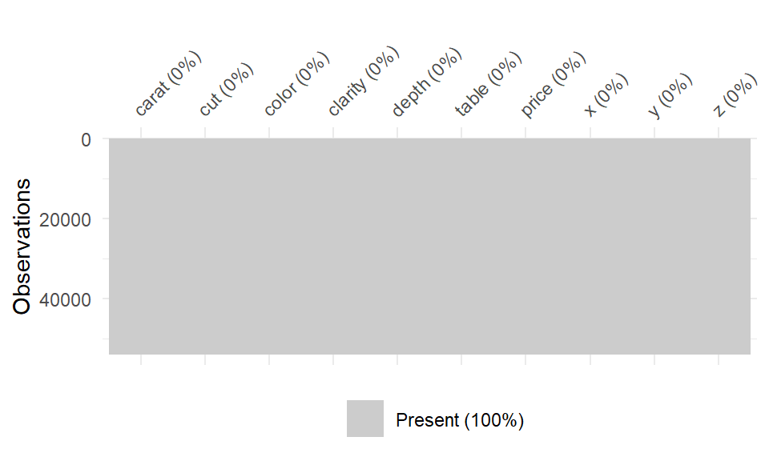

```r
sum(is.na(diamonds))
```

```
## [1] 0
```

```r
diamonds$depth[1:10000] <- NA 
```

There seem to be no apparant missingness in any of the variables in the diamonds dataset. 

## EXERCISE 1: "Missingness" {-} 
Checking for missingness is a crucial first step to avoid problems later in the analysis (for example when deriving summary statistics)

 A) List two potential problems that can occur if missingness is not properly inspected and subsequently dealt with
 B) Read this article: https://medium.com/coinmonks/dealing-with-missing-data-using-r-3ae428da2d17 Summarize the different types of missingness and how you could deal with them. Create a table in your Rmd file (see: https://rmarkdown.rstudio.com/lesson-7.html)

## --- END OF EXERCISE --- {-}


### Distributions: The bar chart
To get an idea on the binning of a categorical variable (how many observations belong to which category?)

```r
ggplot(data = diamonds) +
  geom_bar(mapping = aes(x = cut))
```

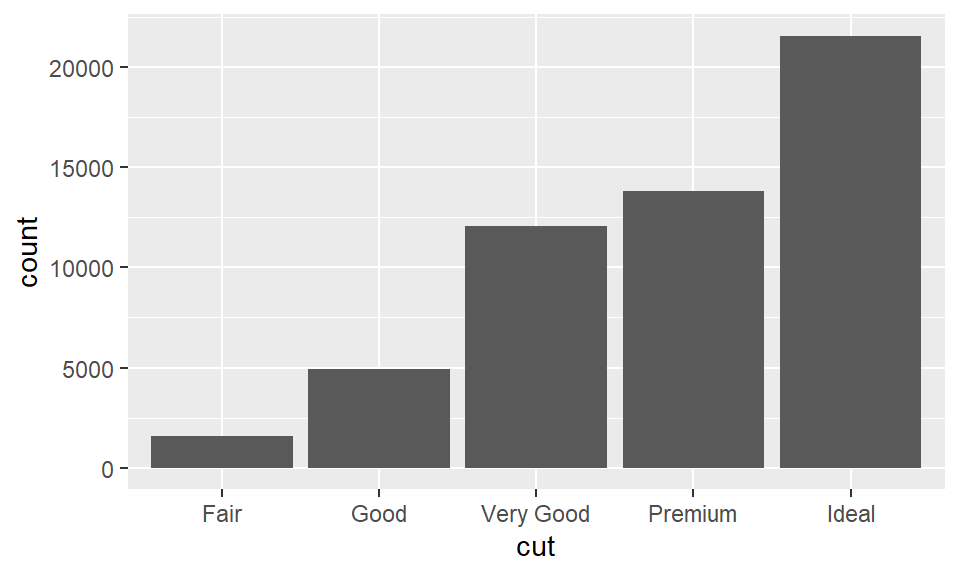

### Count can also compute frequencies for categorical values 

```r
diamonds %>% 
  count(cut) ## the sort argument (set to TRUE will show the largest on top)
```

```
## # A tibble: 5 × 2
##   cut           n
##   <ord>     <int>
## 1 Fair       1610
## 2 Good       4906
## 3 Very Good 12082
## 4 Premium   13791
## 5 Ideal     21551
```

### Continuous variables
 
 * A variable is **continuous** if it can take any of an infinite set of ordered values. 
 * Numbers and date-times are two examples of continuous variables. To examine the distribution of a continuous variable, use a histogram:

### The histogram

```r
ggplot(data = diamonds) +
  geom_histogram(mapping = aes(x = carat), binwidth = 0.01)
```

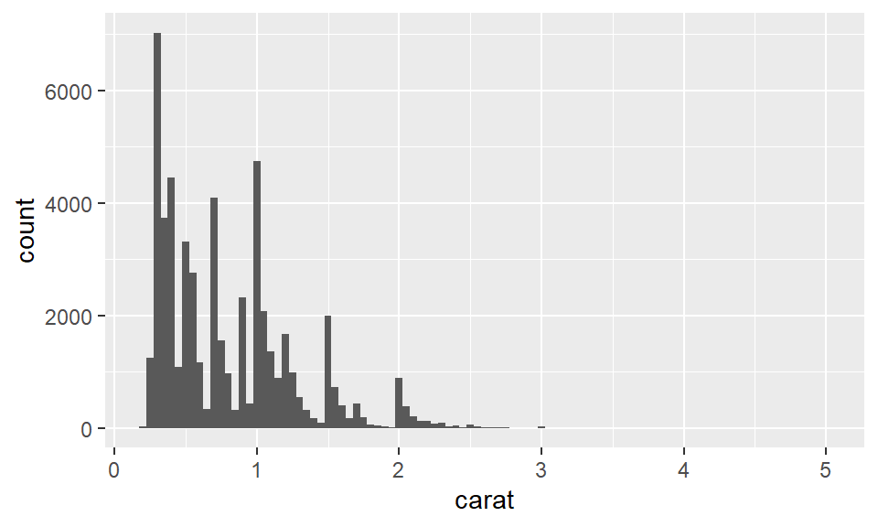

What do you notice from this plot?

### Frequency calculation by 'hand'
You can compute this by hand by combining `dplyr::count()` and `ggplot2::cut_width()`:

```r
diamonds %>% 
  count(cut_width(carat, 0.05))
```

```
## # A tibble: 65 × 2
##    `cut_width(carat, 0.05)`     n
##    <fct>                    <int>
##  1 [0.175,0.225]               26
##  2 (0.225,0.275]             1245
##  3 (0.275,0.325]             7021
##  4 (0.325,0.375]             3732
##  5 (0.375,0.425]             4455
##  6 (0.425,0.475]             1087
##  7 (0.475,0.525]             3310
##  8 (0.525,0.575]             2752
##  9 (0.575,0.625]             1159
## 10 (0.625,0.675]              343
## # … with 55 more rows
```

### Experiment with `binwidth =` 

 * Always explore a variety of binwidths when working with histograms, as different binwidths can reveal different patterns. 


```r
smaller <- diamonds %>% 
  dplyr::filter(carat < 3)
  
smaller %>%
  ggplot(aes(x = carat)) +
    geom_histogram(binwidth = 0.1)
```

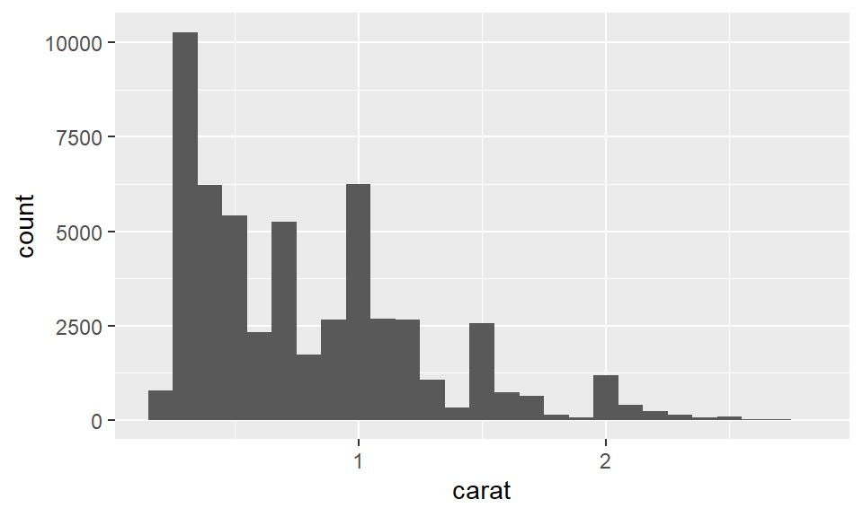

### Multiple histograms in one plot: `geom_freqpoly()`

```r
smaller %>%
  ggplot(aes(x = carat, colour = cut)) +
    geom_freqpoly(binwidth = 0.1) +
    theme_bw() ## set to bw for better contrast
```

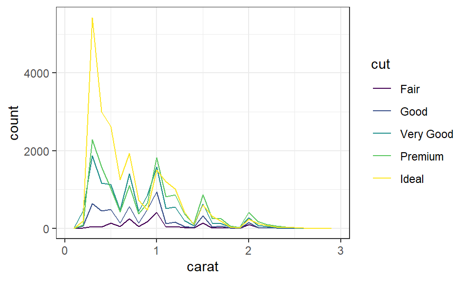

### Subsequent questions
 
 * Rely on your curiosity (What do you want to learn more about?) 
 * As well as your skepticism (How could this be misleading? Does something seem odd?)

### Typical values

look for anything unexpected:

* Which values are the most common? Why?
* Which values are rare? Why? Does that match your expectations?
* Can you see any unusual patterns? What might explain them?

### This plot can be explored with a couple of questions

```r
ggplot(data = smaller, mapping = aes(x = carat)) +
  geom_histogram(binwidth = 0.01)
```

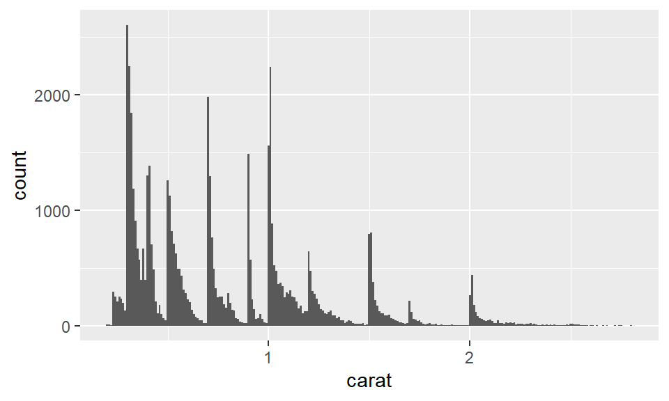

### Exploratory questions

* Why are there more diamonds at whole carats and common fractions of carats?
* Why are there more diamonds slightly to the right of each peak than there 
  are slightly to the left of each peak?
* Why are there no diamonds bigger than 3 carats?

### Understanding clusters in your data

* How are the observations within each cluster similar to each other?
* How are the observations in separate clusters different from each other?
* How can you explain or describe the clusters?
* Why might the appearance of clusters be misleading?

### Generate a plot that shows clusters takes experimentation and practice
This is the famous data from the 'faithful' dataset, showing timings of eruptions of the "Old Faithful" Geyser in Yellowstone National Park, USA

```r
ggplot(data = faithful, mapping = aes(x = eruptions)) + 
  geom_histogram(binwidth = 0.25)
```

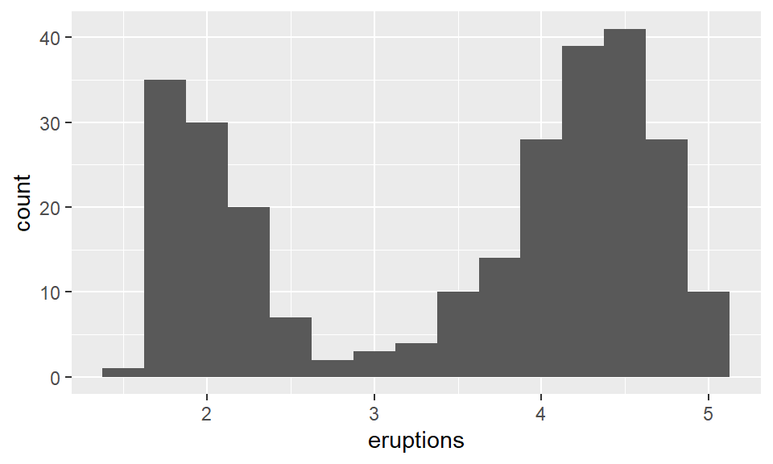

```r
ggplot(data = faithful, mapping = aes(y = eruptions)) + 
  geom_boxplot()
```


```r
faithful %>% as_tibble()
```

```
## # A tibble: 272 × 2
##    eruptions waiting
##        <dbl>   <dbl>
##  1      3.6       79
##  2      1.8       54
##  3      3.33      74
##  4      2.28      62
##  5      4.53      85
##  6      2.88      55
##  7      4.7       88
##  8      3.6       85
##  9      1.95      51
## 10      4.35      85
## # … with 262 more rows
```

```r
## ?faithful for more details on the data


faithful %>%
  ggplot(aes(x = eruptions, y = waiting)) +
  geom_point(position = "jitter", shape = 1)
```


### Unusual values or outliers

 * Outliers are observations that are unusual; 
 * Data points that don't seem to fit the pattern. 
 * Sometimes outliers are data entry errors; 
 * Other times outliers suggest important new science.
 * Outliers are sometimes difficult to see in a histogram.  

## Histogram to spot outliers
When you see a histogram with an extraordinary large x-axis, you have to be vigilant about outliers 

```r
ggplot(diamonds) + 
  geom_histogram(mapping = aes(x = y), binwidth = 0.5)
```

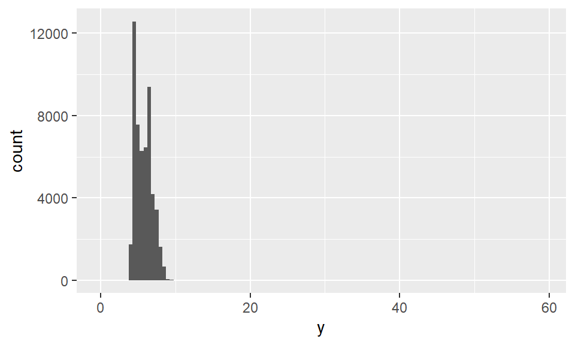

```r
ggplot(diamonds, aes(y = y)) + 
  geom_boxplot()
```


```r
ggplot(diamonds, aes(y = log(y))) + 
  geom_boxplot()
```

```
## Warning: Removed 7 rows containing non-finite values (stat_boxplot).
```


### Zooming in on your data

To make it easy to see the unusual values, we need to zoom into to small values of the y-axis with `coord_cartesian()`:
This truncates the y-axis

```r
ggplot(diamonds) + 
  geom_histogram(mapping = aes(x = y), binwidth = 0.5) +
  coord_cartesian(ylim = c(0, 50))
```

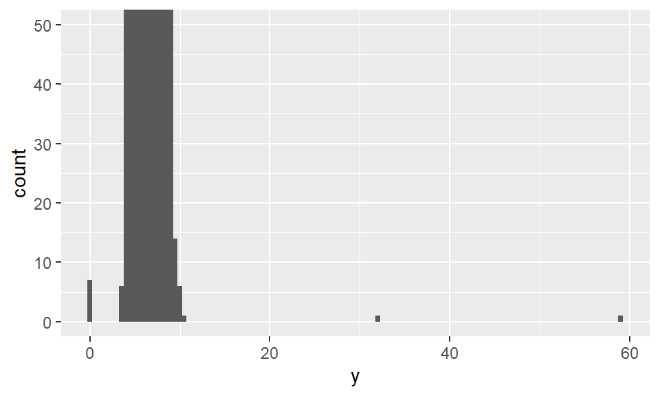

### Zoomed in
This allows us to see that there are three unusual values: 0, ~30, and ~60. We pluck them out with dplyr: 


```r
unusual <- diamonds %>% 
  dplyr::filter(y < 3 | y > 20) %>% 
  arrange(y)
unusual
```

```
## # A tibble: 9 × 10
##   carat cut       color clarity depth table price     x     y     z
##   <dbl> <ord>     <ord> <ord>   <dbl> <dbl> <int> <dbl> <dbl> <dbl>
## 1  1    Very Good H     VS2      63.3    53  5139  0      0    0   
## 2  1.14 Fair      G     VS1      57.5    67  6381  0      0    0   
## 3  1.56 Ideal     G     VS2      62.2    54 12800  0      0    0   
## 4  1.2  Premium   D     VVS1     62.1    59 15686  0      0    0   
## 5  2.25 Premium   H     SI2      62.8    59 18034  0      0    0   
## 6  0.71 Good      F     SI2      64.1    60  2130  0      0    0   
## 7  0.71 Good      F     SI2      64.1    60  2130  0      0    0   
## 8  0.51 Ideal     E     VS1      61.8    55  2075  5.15  31.8  5.12
## 9  2    Premium   H     SI2      58.9    57 12210  8.09  58.9  8.06
```

### Do not throw away your data ligthly

 * Repeat your analysis with and without the outliers
 * If they have minimal effect on the results, and you can't figure out why they're there, replace them with missing values
 * If they have a substantial effect on your results, you shouldn't drop them without justification
 * Figure out what caused them (e.g. a data entry error) and disclose that you removed them in your report.

### Boxplot

```r
diamonds %>%
  ggplot(aes(x = cut, y = y)) +
  geom_boxplot()
```

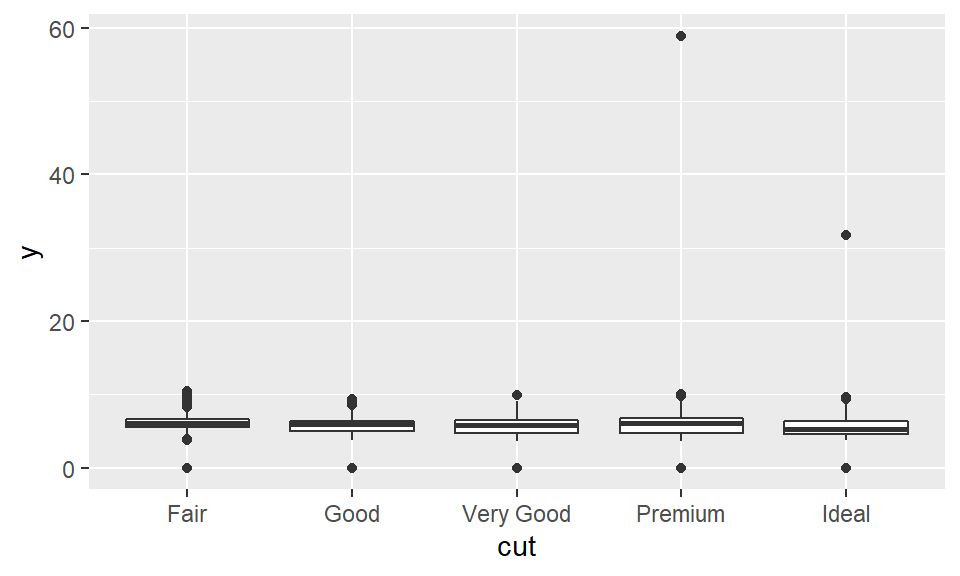

## Missing values

If you've encountered unusual values in your dataset, and simply want to move on to the rest of your analysis, you have two options.

Drop the entire row with the strange values:

```r
diamonds2 <- diamonds %>% 
  dplyr::filter(between(y, 3, 20))
```
    
I don't recommend this option

## Better!

Replacing the unusual values with missing values.

### **EXERCISE 2: Replace outliers for missing values**

A) Replace the values smaller than 3 and larger than 20 for missing values


## Missing values warning in ggplot2
Like R, ggplot2 subscribes to the philosophy that missing values should never silently go missing. It's not obvious where you should plot missing values, so ggplot2 doesn't include them in the plot, but it does warn that they've been removed:

B) Plot the x and y variables of the `diamonds2` dataset that you have created above in a scatter plot, write down the warning message.


C) What is bad about the plot below?
List a few points and try to correct the plot (there are a number of ways that you could solve this).

```r
nycflights13::flights %>% 
  mutate(cancelled = is.na(dep_time),
         sched_hour = sched_dep_time %/% 100,
         sched_min = sched_dep_time %% 100,
         sched_dep_time = sched_hour + sched_min / 60) %>%
  ggplot(mapping = aes(sched_dep_time)) + 
  geom_freqpoly(mapping = aes(colour = cancelled), binwidth = 1/4) 
```

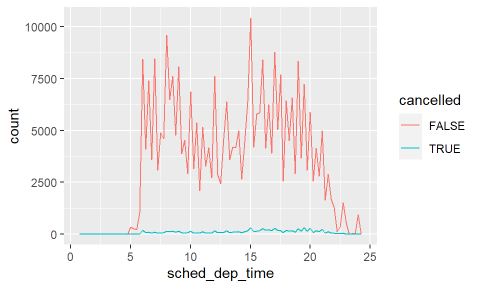


## Covariation

 * Variation describes the behavior _within_ a variable
 * Covariation describes the behavior _between_ variables. 
 * **Covariation** is the tendency for the values of two or more variables to vary together in a related way. 
 * Best way to spot covariation is to visualise the relationship between two or more variables. 
 * How you do that should again depend on the type of variables involved.

### **EXERCISE 3: A categorical and continuous variable**

A) Create a plot showing the relationship between `price` and `cut` of the `diamonds` data. Use a frequency polynom to display the counts in each level for `cut` 


It's hard to see the difference in distribution because the overall counts differ so much:

B) Create a bar graph displying the same information as in A) above. Did this improve the comparison?


C) Create the same plot as in A) but now use `density` in stead of counts on the y-axis. Google for a solution if necessary.


## The boxplot
A **boxplot** is a type of visual shorthand for a distribution of values that is popular among statisticians. Each boxplot consists of:


## **EXERCISE 4: Diamonds boxplot

A) Create a boxplot for the distribution of price by cut using `geom_boxplot()`


B) Now log10 transform the `price` variable, what happens?


## Factors or "grouping"  variables

`cut` is an ordered factor: fair is worse than good, which is worse than very good and so on. Many categorical variables don't have such an intrinsic order, so you might want to reorder them to make a more informative display. One way to do that is with the `reorder()` function.

## Reorder the factor levels
For example, take the `class` variable in the `mpg` dataset. You might be interested to know how highway mileage varies across classes:


```r
ggplot(data = mpg, mapping = aes(x = class, y = hwy)) +
  geom_boxplot()
```

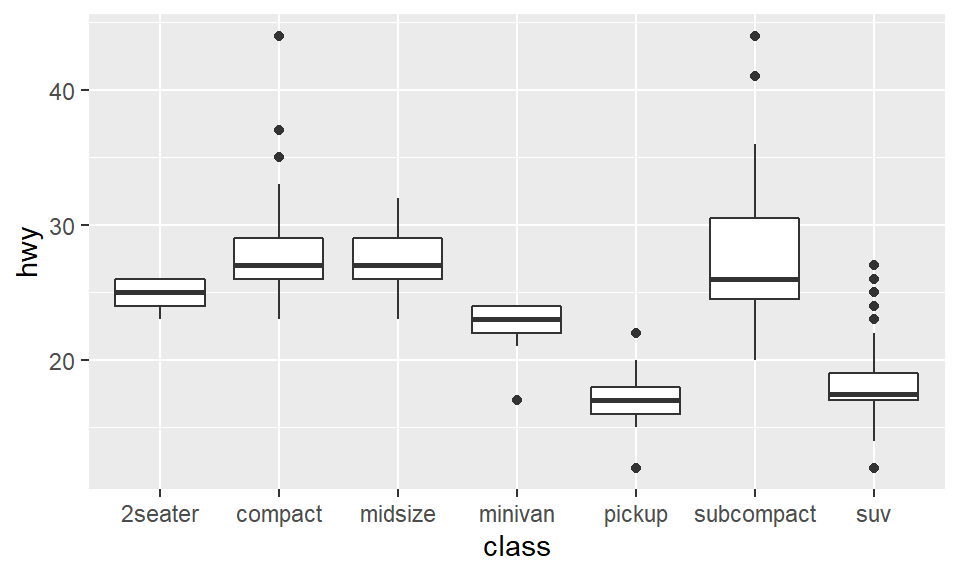

## **EXERCISE: Reordering by continuous variable**

A) To make the trend easier to see, reorder by `class` based on the median value of `hwy`:


## Positioning labels on axis, or flip the axis
If you have long variable names, `geom_boxplot()` will work better if you flip it 90°. You can do that with `coord_flip()`.


```r
ggplot(data = mpg) +
  geom_boxplot(mapping = aes(x = reorder(class, hwy, FUN = median), y = hwy)) +
  coord_flip() + xlab("Class")
```

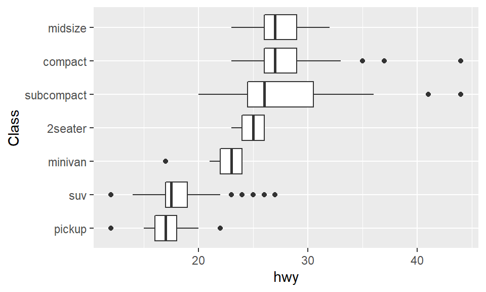

## Two categorical variables
To visualise the covariation between categorical variables, you'll need to count the number of observations for each combination. One way to do that is to rely on the built-in `geom_count()`:


```r
ggplot(data = diamonds) +
  geom_count(mapping = aes(x = cut, y = color))
```

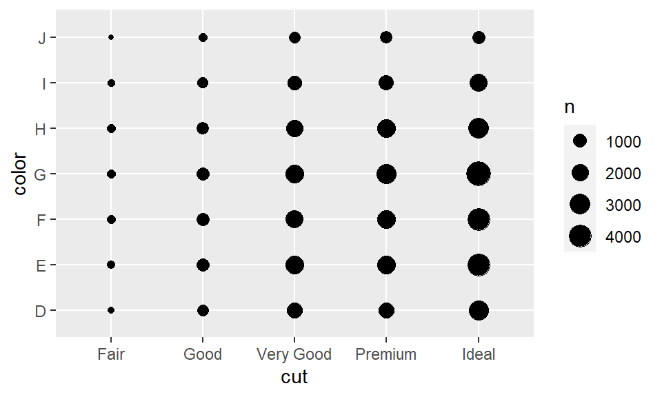

## Circles

* The size of each circle in the plot displays how many observations occurred at each combination of values. 

* Covariation will appear as a strong correlation between specific x values and specific y values. 

## Two continuous variables

```r
ggplot(data = diamonds) +
  geom_point(mapping = aes(x = carat, y = price))
```

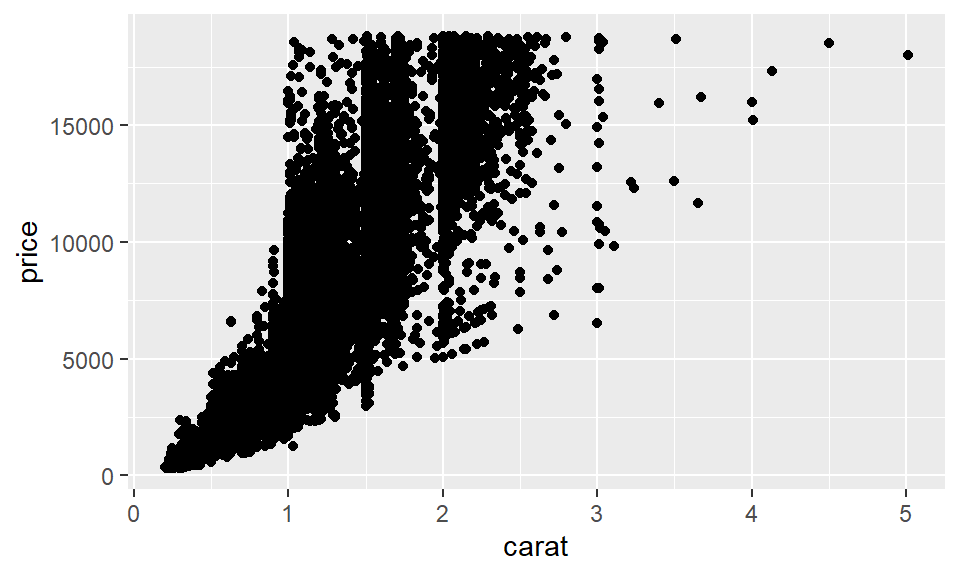

## Fix overplotting by setting transparency
You've already seen one way to fix the problem: using the `alpha` aesthetic to add transparency.


```r
ggplot(data = diamonds) + 
  geom_point(mapping = aes(x = carat, y = price), alpha = 3 / 100) +
  geom_smooth(aes(x = carat, y = price), method = "lm", fullrange = FALSE )
```

```
## `geom_smooth()` using formula 'y ~ x'
```

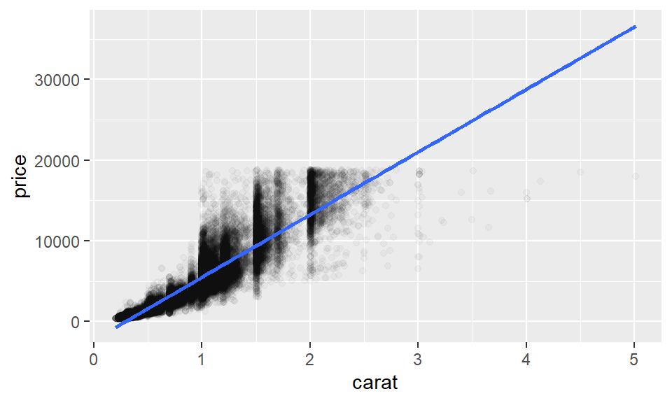

## Fixing overplotting with binning

```r
# install.packages("hexbin")
ggplot(data = smaller) +
  geom_hex(mapping = aes(x = carat, y = price))
```

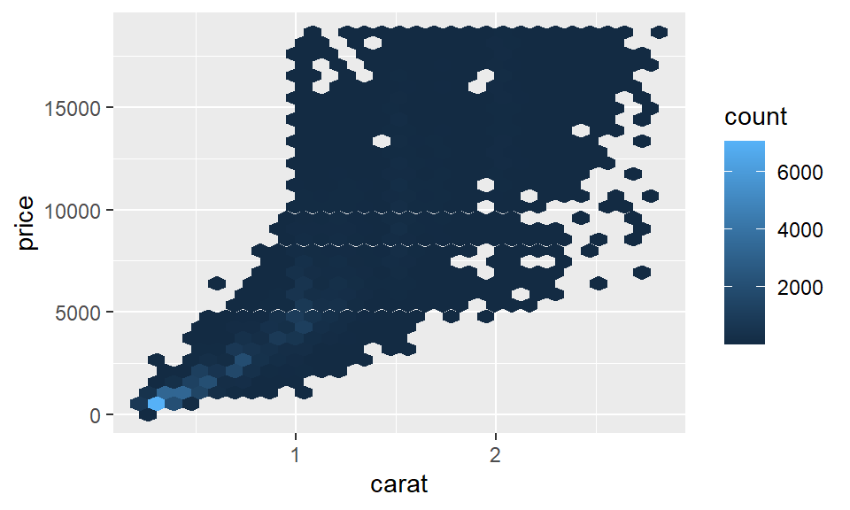

## Use bin to one continuous variable
Another option is to bin one continuous variable so it acts like a categorical variable. Then you can use one of the techniques for visualising the combination of a categorical and a continuous variable that you learned about. For example, you could bin `carat` and then for each group, display a boxplot:


```r
ggplot(data = smaller, mapping = aes(x = carat, y = price)) + 
  geom_boxplot(mapping = aes(group = cut_width(carat, 0.1)))
```

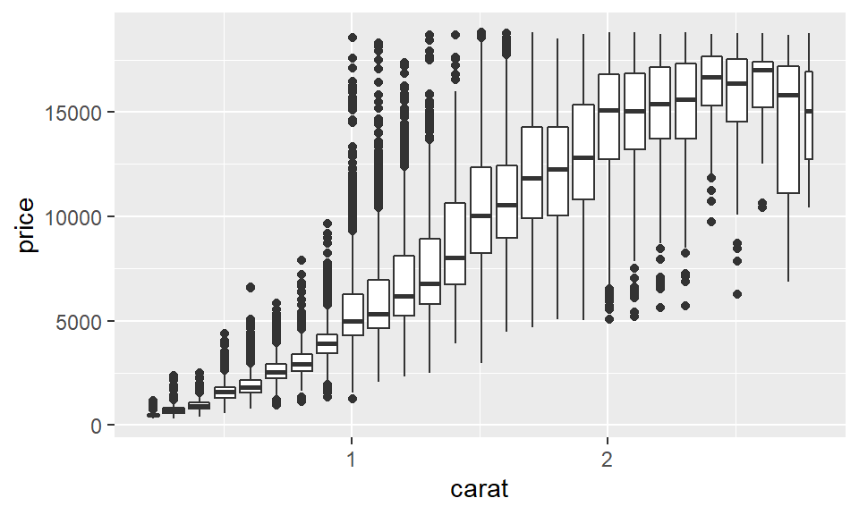

## Now we can visualise the relationship between price and carat more clearly


```r
ggplot(data = smaller, mapping = aes(x = carat, y = price)) + 
  geom_boxplot(mapping = aes(group = cut_width(carat, 0.1))) +
  geom_smooth(method = "auto")
```

```
## `geom_smooth()` using method = 'gam' and formula 'y ~ s(x, bs = "cs")'
```

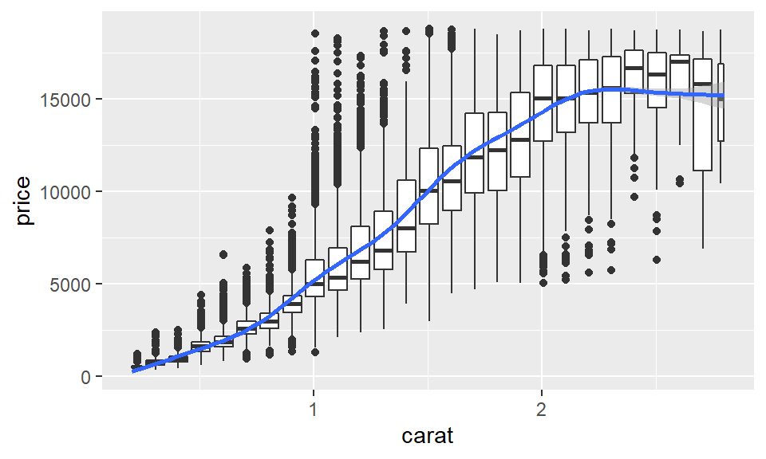

## Methods of modelling

 * This is no statitics course, but:
 * Models are important
 * Look at `?geom_smooth`
 * The `method` argument has several options
 * The graph above shows a smoother with the model `method = "gam"`
 * More methods are available
 * See what happens if you change `method` to "lm"
 * Models help you understand relationships and are food for further formal statistical inference.
 * We could ask: 
 __"Is the relationships between price and carat really sigmoidal"?__

## cut_number

```r
ggplot(data = smaller, mapping = aes(x = carat, y = price)) + 
  geom_boxplot(mapping = aes(group = cut_number(carat, 20)))
```

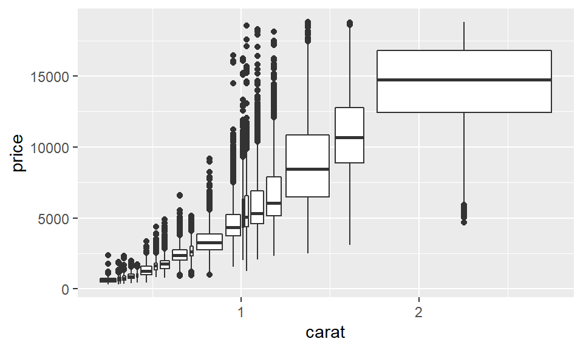

https://d396qusza40orc.cloudfront.net/exdata%2Fdata%2Fhousehold_power_consumption.zip

## EXERCISES

## Data
The dataset that we are going to use for these exercises here is the 'household_power_consumption' dataset.
The data can be downloaded from here:
https://github.com/rdpeng/ExData_Plotting1 

The information about this dataset can also be found here: https://www.kaggle.com/uciml/electric-power-consumption-data-set

We will concentrate on the first three months of the year 2006, 2007, 2008.

## EXERCISE 1: Power consumption {-}

**TIPS**

 - You probable need to filter and aggregate the data first before you can answer the questions below
 - First create quick and dirty graphs, later refine your code and you graph
 

 A) Execute the following steps in a code chunk:
 
 - Unzip the downloaded energy consumption file
 - Read the file into R, you should get a dataframe with 2,075,259 rows and 


 
B) Check if there are missing values anywhere in the data


C) Create a visualization of the variables `Global_active_power` and `Date` that is meaningful and shows a clear pattern of power consumption of the year 2008

D) Show a number of visualization that show the relationship between the time of day and power consumption

E) Did power consumption over rhe years 2006, 2007 and 2008 show difference in patterns over the months? 

## EXERCISE 2: Missingness {-}

A) Load the dataset called `riskfactors` into your R session


B) Inspect the missingness in this data, use the naniar package to get an idea on where the missingness is located.


C) Which variables would you consider removing from the dataset on the basis of their missingness?

D) Write a function that calculates the percentage of missingness for a each variable in a dataset

E) Use this function to filter each variable that has a missingness that exceeds 80%, use this rule to generate a new version of the data with these variable (>80% mssingness) removed. 

F) Create a number of visualization to show the relationship between the variable `health_general` and a number of other variables that you think are relevant to investigate.


```r
riskfactors %>%
  ggplot(aes(x = drink_average, y = health_general)) +
  geom_point(aes(colour = sex), position = "jitter")
```

```
## Warning: Removed 135 rows containing missing values (geom_point).
```

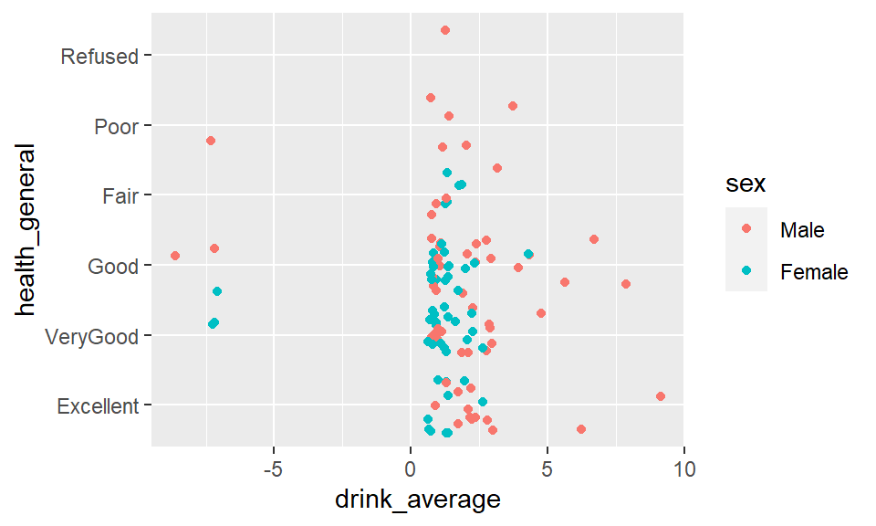

```r
riskfactors %>%
  ggplot(aes(x = smoke_days, y = health_general)) +
  geom_point(aes(colour = sex), position = "jitter")
```

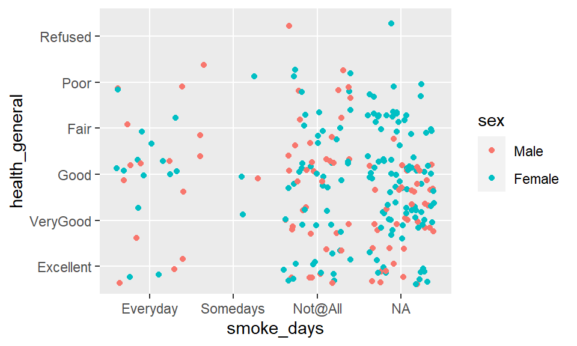

As you see, it might prove really difficult to tell anything about risk factors when we have so little data. Here we typically have a dataset that relative large P (predictors) and relatively small N (number of observations). In the next EXERCISE, we will use a different dataset that has a much larger N. This problem of large P, small N is common for Biology or Health Science related data.

## EXERCISE 3; Cocktails {-}

A) Load the cocktails dataset from here https://raw.githubusercontent.com/rfordatascience/tidytuesday/master/data/2020/2020-05-26/boston_cocktails.csv into R as `cocktails`


B) For this exercises we focus on the `ingredient` variable. How many unique ingredients are included in the `cocktails` dataset 


```r
cocktails$ingredient %>%
  unique() %>% 
  length()
```

```
## [1] 569
```


C) Retrieve the top 30 most common ingredients


```r
top_30 <- cocktails %>%
  count(ingredient, sort = TRUE) %>%
  head(30)
top_30
```

```
## # A tibble: 30 × 2
##    ingredient                 n
##    <chr>                  <int>
##  1 Gin                      176
##  2 Fresh lemon juice        138
##  3 Simple Syrup             115
##  4 Vodka                    114
##  5 Light Rum                113
##  6 Dry Vermouth             107
##  7 Fresh Lime Juice         107
##  8 Triple Sec               107
##  9 Powdered Sugar            90
## 10 Grenadine                 85
## 11 Sweet Vermouth            83
## 12 Brandy                    80
## 13 Lemon Juice               70
## 14 Blanco tequila            69
## 15 Egg White                 67
## 16 Angostura Bitters         63
## 17 Juice of a Lemon          60
## 18 Pineapple Juice           47
## 19 Bourbon whiskey           38
## 20 Orange Bitters            38
## 21 Juice of a Lime           35
## 22 Bitters                   31
## 23 Orange juice              31
## 24 Whole Egg                 31
## 25 Old Mr. Boston Dry Gin    30
## 26 Benedictine               28
## 27 Dark rum                  27
## 28 Maraschino liqueur        26
## 29 White creme de cacao      26
## 30 Dubonnet                  25
```

```r
## restore setting for tibble printing
options(tibble.print_max = 10, tibble.print_min = 10)
```

C) The data shows a `name` and a `row_id` variable. Are `name` and `row_id` equivalent? 


```r
cocktails %>% count(name)
```

```
## # A tibble: 989 × 2
##    name                          n
##    <chr>                     <int>
##  1 1626                          5
##  2 19th Century                  4
##  3 A. J.                         2
##  4 Absinthe Cocktail             4
##  5 Absinthe Drip Cocktail        2
##  6 Absinthe Special Cocktail     3
##  7 Academic Review               6
##  8 Acapulco                      5
##  9 Adam and Eve                  4
## 10 Adderly Cocktail              4
## # … with 979 more rows
```

```r
cocktails %>% count(row_id)
```

```
## # A tibble: 989 × 2
##    row_id     n
##     <dbl> <int>
##  1      1     4
##  2      2     4
##  3      3     2
##  4      4     3
##  5      5     5
##  6      6     5
##  7      7     3
##  8      8     4
##  9      9     2
## 10     10     3
## # … with 979 more rows
```

```r
cocktails %>%
  group_by(name) %>%
  summarise(ids = n_distinct(row_id)) %>%
  filter(ids > 1)
```

```
## # A tibble: 0 × 2
## # … with 2 variables: name <chr>, ids <int>
```

```r
# Yes, they are
```


D) How many ingredients are in each cocktail? ------------------------------

```r
cocktails %>%
  count(name) %>%
  count(n)
```

```
## Storing counts in `nn`, as `n` already present in input
## ℹ Use `name = "new_name"` to pick a new name.
```

```
## # A tibble: 6 × 2
##       n    nn
##   <int> <int>
## 1     1    31
## 2     2   118
## 3     3   292
## 4     4   297
## 5     5   194
## 6     6    57
```

```r
# These 1-ingredient cocktails suggest that non-alcoholic ingredients
# are not included
cocktails %>%
  group_by(name) %>%
  filter(n() == 1)
```

```
## # A tibble: 31 × 6
## # Groups:   name [31]
##    name                  category   row_id ingredient_numb… ingredient   measure
##    <chr>                 <chr>       <dbl>            <dbl> <chr>        <chr>  
##  1 Brandy and Soda       Cocktail …    149                1 Brandy       2 oz   
##  2 Vodka and Tonic       Vodka         156                1 Vodka        2 oz   
##  3 Vodka and Apple Juice Vodka         162                1 Vodka        2 oz   
##  4 Limestone             Cocktail …    164                1 Bourbon      1 1/2 …
##  5 Bourbon On The Rocks  Cocktail …    170                1 Bourbon      2 oz   
##  6 Saronno Mist          Cocktail …    183                1 Amaretto di… 1 1/2 …
##  7 Mandarine Mist        Cocktail …    195                1 Mandarine N… 1 1/2 …
##  8 Hill Billy Highball   Cocktail …    216                1 Georgia Moo… 2 oz   
##  9 Cafe di Saronno       Cocktail …    274                1 Amaretto di… 1 oz   
## 10 Bourbon Highball      Whiskies      296                1 Bourbon whi… 2 oz   
## # … with 21 more rows
```

```r
cocktails %>%
  group_by(name) %>%
  filter(n() == 2)
```

```
## # A tibble: 236 × 6
## # Groups:   name [118]
##    name                  category   row_id ingredient_number ingredient  measure
##    <chr>                 <chr>       <dbl>             <dbl> <chr>       <chr>  
##  1 Apple Pie             Cordials …      3                 1 Apple schn… 3 oz   
##  2 Apple Pie             Cordials …      3                 2 Cinnamon s… 1 oz   
##  3 Caribbean Champagne   Cocktail …      9                 1 Light Rum   1/2 oz 
##  4 Caribbean Champagne   Cocktail …      9                 2 Creme de b… 1/2 oz 
##  5 Amaretto Stinger      Cordials …     17                 1 Amaretto    1 1/2 …
##  6 Amaretto Stinger      Cordials …     17                 2 White crem… 3/4 oz 
##  7 Amaretto And Cream    Cordials …     44                 1 Amaretto    1 1/2 …
##  8 Amaretto And Cream    Cordials …     44                 2 half-and-h… 1 1/2 …
##  9 Montreal Club Bouncer Cocktail …     50                 1 Gin         1 1/2 …
## 10 Montreal Club Bouncer Cocktail …     50                 2 Anisette    1/2 oz 
## # … with 226 more rows
```

E) How big (`measure`) is each cocktail? 


```r
cocktails %>% count(measure, sort = TRUE)
```

```
## # A tibble: 42 × 2
##    measure       n
##    <chr>     <int>
##  1 1 oz       1102
##  2 1/2 oz      776
##  3 1 1/2 oz    494
##  4 2 oz        426
##  5 3/4 oz      416
##  6 1/4 oz      214
##  7 3 oz         67
##  8 4 oz         23
##  9 1 1/4 oz     21
## 10 For glass    19
## # … with 32 more rows
```

```r
non_spirit <- c("Chilled Champagne", "Water", "Orange Juice", "Cranberry Juice", "Light Cream (if desired)", "Fresh orange juice", "Orange juice")
```


F) Correct the `measure` variable in an SI unit (milliliters) 
# Have removed all cocktails with ounces of bitters - that is most
# likely a data entry error (it certainly doesn't give me much confidence
# in the quality of this data)

```r
sizes <- cocktails %>%
  filter(str_detect(measure, "oz")) %>%
  filter(!str_detect(ingredient, fixed("bitters", ignore_case = TRUE))) %>%
  filter(!ingredient %in% non_spirit) %>%
  mutate(oz = str_replace(measure, " oz", "")) %>%
  mutate(oz = str_replace(oz, " ?1/2", ".5")) %>%
  mutate(oz = str_replace(oz, " ?1/4", ".25")) %>%
  mutate(oz = str_replace(oz, " ? ?3/4", ".75")) %>%
  mutate(oz = str_replace(oz, " ?1/3", ".33")) %>%
  mutate(oz = str_replace(oz, " ?2/3", ".33")) %>%
  mutate(oz = as.numeric(oz))

filter(sizes, oz > 3)
```

```
## # A tibble: 28 × 7
##    name             category  row_id ingredient_numb… ingredient   measure    oz
##    <chr>            <chr>      <dbl>            <dbl> <chr>        <chr>   <dbl>
##  1 Jocose Julep     Whiskies      21                5 Fresh mint … 5 oz        5
##  2 Incider Cocktail Whiskies      62                2 Apple cider  4 oz        4
##  3 Greyhound        Cocktail…     74                2 Grapefruit … 5 oz        5
##  4 Buddy's Favorite Cocktail…    169                2 Cold Water   6 oz        6
##  5 Tea Saronno      Cocktail…    229                1 Hot Tea      6 oz        6
##  6 Salty Dog        Vodka        257                3 Grapefruit … 5 oz        5
##  7 Redhead Martini  Vodka        277                1 Strawberrie… 4 oz        4
##  8 Bloody Scotsman  Whiskies     304                1 Smoky Scotc… 24 oz      24
##  9 Bloody Scotsman  Whiskies     304                2 Tomato Juice 24 oz      24
## 10 Bloody Scotsman  Whiskies     304                3 V8 cocktail… 24 oz      24
## # … with 18 more rows
```

```r
filter(sizes, oz > 10)
```

```
## # A tibble: 3 × 7
##   name            category row_id ingredient_number ingredient     measure    oz
##   <chr>           <chr>     <dbl>             <dbl> <chr>          <chr>   <dbl>
## 1 Bloody Scotsman Whiskies    304                 1 Smoky Scotch … 24 oz      24
## 2 Bloody Scotsman Whiskies    304                 2 Tomato Juice   24 oz      24
## 3 Bloody Scotsman Whiskies    304                 3 V8 cocktail j… 24 oz      24
```

```r
total_size <- sizes %>% group_by(name) %>% summarise(n = n(), oz = sum(oz))

total_size %>% filter(oz > 20)
```

```
## # A tibble: 1 × 3
##   name                n    oz
##   <chr>           <int> <dbl>
## 1 Bloody Scotsman     5    78
```

```r
total_size %>%
  filter(oz < 20) %>%
  ggplot(aes(oz)) +
  geom_histogram(binwidth = 0.5)
```

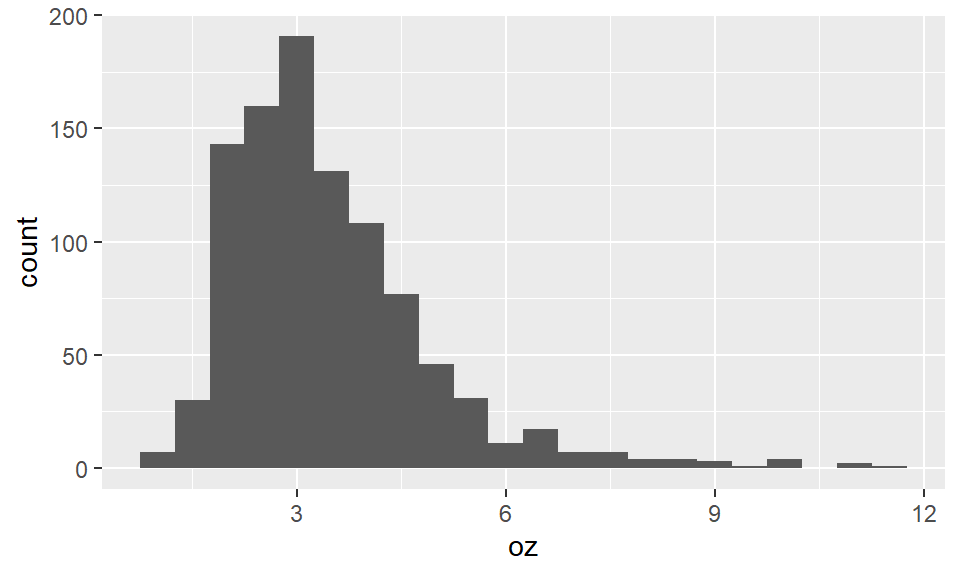

```r
total_size %>%
  filter(oz > 6) %>%
  semi_join(cocktails, ., by = "name") 
```

```
## # A tibble: 258 × 6
##    name              category          row_id ingredient_numb… ingredient measure
##    <chr>             <chr>              <dbl>            <dbl> <chr>      <chr>  
##  1 Casa Blanca       Cocktail Classics      8                1 Light Rum  2 oz   
##  2 Casa Blanca       Cocktail Classics      8                2 Lime Juice 1 1/2 …
##  3 Casa Blanca       Cocktail Classics      8                3 Triple Sec 1 1/2 …
##  4 Casa Blanca       Cocktail Classics      8                4 Maraschino 1 1/2 …
##  5 Jocose Julep      Whiskies              21                1 Bourbon w… 2 1/2 …
##  6 Jocose Julep      Whiskies              21                2 Green cre… 1/2 oz 
##  7 Jocose Julep      Whiskies              21                3 Fresh Lim… 1 oz   
##  8 Jocose Julep      Whiskies              21                4 Simple Sy… 1/2 oz 
##  9 Jocose Julep      Whiskies              21                5 Fresh min… 5 oz   
## 10 Pollyanna Cocktai Cocktail Classics     45                1 Orange     3 oz   
## # … with 248 more rows
```

```r
cocktails %>%
  filter(str_detect(ingredient, "bitters"))
```

```
## # A tibble: 21 × 6
##    name                  category row_id ingredient_number ingredient    measure
##    <chr>                 <chr>     <dbl>             <dbl> <chr>         <chr>  
##  1 High Cotton           Whiskies    129                 4 Peach bitters 2 oz   
##  2 Jack Maples           Brandy      154                 3 Aromatic bit… 1 oz   
##  3 Gilchrist             Whiskies    185                 5 Grapefruit b… 2 oz   
##  4 Trident               Vodka       201                 4 Peach bitters 2 oz   
##  5 Gotham                Brandy      239                 3 Peach bitters 3 oz   
##  6 Cotton Club Flip      Whiskies    248                 5 Rhubarb bitt… 2 oz   
##  7 Character Development Whiskies    266                 4 Grapefruit b… 2 oz   
##  8 Academic Review       Whiskies    426                 6 Mole bitters… 2 oz   
##  9 El Profesor           Brandy      513                 4 Aromatic bit… 2 oz   
## 10 Georgia Mule          Vodka       542                 4 Peach bitters 2 oz   
## # … with 11 more rows
```

```r
sizes %>%
  group_by(ingredient) %>%
  summarise(n = n(), oz = mean(oz)) %>%
  filter(n > 5) %>%
  arrange(desc(oz), sort = TRUE)
```

```
## # A tibble: 96 × 3
##    ingredient               n    oz
##    <chr>                <int> <dbl>
##  1 Bourbon whiskey         38  1.79
##  2 Bourbon                 11  1.70
##  3 Anejo tequila            6  1.67
##  4 Irish Whiskey           15  1.65
##  5 Blended whiskey         18  1.61
##  6 Straight rye whiskey    22  1.60
##  7 Reposado tequila        10  1.6 
##  8 Cognac                   6  1.58
##  9 Dark rum                27  1.57
## 10 Mr. Boston Gin           8  1.57
## # … with 86 more rows
```

```r
# What are the primary ingredients ----------------------------------------

cocktails <- cocktails %>% mutate(ingredient = tolower(ingredient))

cocktails %>%
  count(ingredient = tolower(ingredient), sort = TRUE) %>%
  head(20)
```

```
## # A tibble: 20 × 2
##    ingredient            n
##    <chr>             <int>
##  1 gin                 176
##  2 fresh lemon juice   138
##  3 simple syrup        115
##  4 vodka               114
##  5 light rum           113
##  6 dry vermouth        107
##  7 fresh lime juice    107
##  8 triple sec          107
##  9 powdered sugar       92
## 10 grenadine            85
## # … with 10 more rows
```

```r
standard_ingredients <- tribble(
  ~ ingredient,        ~ standard_name,
  "fresh lemon juice", "lemon juice",
  "juice of a lemon",  "lemon juice",
  "fresh lime juice",  "lime juice",
  "juice of a lime",   "lime juice",
  "bitters",           "angostura bitters"
)

ingredient_changes <- cocktails %>%
  select(name, ingredient_number, ingredient) %>%
  right_join(standard_ingredients) %>%
  select(name, ingredient_number, ingredient = standard_name)
```

```
## Joining, by = "ingredient"
```

```r
cocktails %>%
  rows_update(ingredient_changes, by = c("name", "ingredient_number")) %>%
  count(ingredient, sort = TRUE) %>%
  head(20)
```

```
## # A tibble: 20 × 2
##    ingredient            n
##    <chr>             <int>
##  1 lemon juice         268
##  2 gin                 176
##  3 lime juice          153
##  4 simple syrup        115
##  5 vodka               114
##  6 light rum           113
##  7 dry vermouth        107
##  8 triple sec          107
##  9 angostura bitters    96
## 10 powdered sugar       92
## # … with 10 more rows
```


 

 


<!--chapter:end:ch16-lab5eda.Rmd-->

# Lab 6a - Probability 

Alyanne De Haan, PhD


```r
knitr::include_graphics(
  here::here(
    "images",
    "cluedo.jpg"
  )
)
```


## Learning objectives

After this lesson you can:

- explain interpretations of probability
- perform some basic probability calculations
- evaluate what you need to pay attention to when using probability calculations in inductive statistics

## Introduction

In life sciences, things are more often than not uncertain. We can be pretty sure that 2x2 equals 4, but how certain are we exactly of how our latest experiment reflects the real world? If the latest improvement of Parkinson treatments will improve the life of patients? If the acidity of the surface water we just measured at the Uithof differs from the average in the Netherlands? Will a stricter lockdown in case of a pandemic help or crash our society? The world is a lot messier than 2x2.

As most things in life (sciences) are uncertain, we have to do a lot of decisions on incomplete information. We are actually quite used to this, on a daily basis we roughly estimate stuff like the probability of catching the train if we stay for a few more minutes, or passing the exam with the current amount of effort.


<div id="tip">
We are discussing a few related but distinct terms here:

- Uncertainty: situations involving imperfect or unknown information (for instance, when taking a sample (steekproef), you do not have information on the complete population.)
- probability: how likely it is that something will happen
- probability theory: as you may have guessed, you can get into quite a discussion on what "likely" means in this context. Depending on how you define probability, you get a different set of rules on calculating probability mathematically: probability theory.

</div>

<div class="question">
##### Exercise 5 {#labelvraagbay}
What would you say "probable" means?
</div>

<details><summary>Click for the answer</summary>

Well, it's up to you really, people (including statisticians) disagree. However, defining "probability" is actually rather important if you are working with experimental designs.

Roughly, there are two main ways researchers think about probability:
Frequentists argue that something is more probable if it happens more often in a framework of repeatable experiments.
Bayesians argue that probability is how likely I think it is something will happen, which may depend on other factors than purely the frequency of the event. For example, it allows for information from previous experiments to influence the current probability of an outcome.

At the moment, as the frequentist is the dominant view, and you have learned several statistical methods that are based upon this (calculating p-values for example).

</details>

However, when analysing data on an important research question, you don't want to "roughly estimate", you will want to use a reliable, principled manner to quantify the uncertainty of events and make your decisions. You have been trained in using one such a method when doing hypothesis testing:

1. pinpoint a specific research question
1. set up a null hypothesis and alternative hypothesis
1. with your data, calculate a test statistic (e.g. a t-value)
1. calculate a p-value
1. make a decision based on the p-value

in R: you can do such a *hypothesis test* quite easily, as you have seen in DAUR1.
Suppose you think you take more than 15 minutes to get to the Uithof by bike. 
You measured this for 20 days:


```r
# one sample t-test, one-sided
bike_duration <-  c(15.0, 15.3, 15.3, 14.2, 15.0, 14.4, 14.8, 14.9, 15.9, 15.5, 
                    15.2, 14.9, 15.5, 15.3, 15.1, 15.1, 16.2, 15.8, 15.0, 15.7)

bike_duration %>% enframe() %>%
  ggplot(aes(x = name, y = value)) +
  geom_point() +
  geom_hline(yintercept = 15, linetype = "dashed", colour = "red")
```


```r
testbike <- t.test(bike_duration, mu=15, alternative = "greater")

#install.packages("schoRsch")
library(schoRsch) #install first as needed: 

# use this function from the schoRsch package to have R format the output:
t_out(testbike, n.equal = TRUE,
	welch.df.exact = TRUE, d.corr = FALSE, print = TRUE)
```

```
##                 Test                          Results
## 1 One Sample t-test: t(19) = 1.90, p = .036, d = 0.42
## 
## NOTE: Reporting unadjusted estimate for Cohen's d.
```

Pretty nice, the t-test tells us that the p-value is 0.036, which is rather low, so we may conclude that it is **likely** we indeed take longer than 15 minutes to reach the uithof. Note that this test takes the mean duration as a model for duration. You will learn more about this in the next lesson, but generally, this is based on the idea that all your measurements will depend on the mean duration reflecting the "true" duration of getting to the Uithof by bike + some noise due to everything else (weather, traffic lights, differences in you pressing the stopwatch, etc). In general terms:

$$ \text{ observation} =  model + residual$$

So, the average duration is the model. Sometimes your bike duration will be a bit shorter than average ( residual = negative), sometimes it will be a bit longer (residual = positive). More on this in the next lesson.

## Probability
The p in p-value stands for probability. In this case, the probability of finding the observed or even more extreme results, when the null hypothesis would be true. Make note of the words signalling uncertainty in the interpretation above:  it was **likely**. We are not absolutely certain, but we have a strong indication: we calculated a probability of finding these measurements when in reality we take no more than 15 minutes to reach the Uithof, and this probability is lower than a certain cut-off that is generally agreed upon (0.05). The fact that we did all this probability calculations is reflected in how we correctly write a conclusion based on the test above:

" we found that the average travel duration to the Uithof by bike was **significantly** higher than 15 minutes (one sample t-test, one-sided,  *p*=0.036) with a mean duration of 15.2 minutes."

(compare this to the situation in which there is no uncertainty: you have measured every single time in your life you drove your bike to the Uithof. In other words: you measured the whole population. You will know exactly whether the average duration up until now (!) is longer than 15 minutes or not, there is no need to calculate any probabilities. You can't be certain about the future though..)

## Calculating probability
This probability calculation is a bit easier to understand in a binomial situation ( binomial = there are 2 possible outcomes): 

Consider you want to investigate if a monkey can see the difference between a bunch of 3 bananas or 5 bananas. You let her choose between the two options, and the monkey chooses the bunch of 5 bananas. Now what is the probability that the monkey can differentiate between 3 and 5? 

Well, that is kind of hard to answer. First of all, we are now asking for the probability of a hypothesis being true, considering the current data. While this makes perfect sense, it is not how the most used school of statistics, frequentist statistics, works. With frequentist statistics, we can however do the opposite: calculate the probability of the monkey choosing 5 bananas, *if the monkey had no clue whatsoever about the difference between the two bunches *(H0). You will intuitively know that this probability (p-value) would be 0.5, or 50%. 

This generalises to:


$$ \text{ probability of an event} =   \frac{\text{number of ways it can happen}}{\text{total number of possible outcomes}}$$
In case of our monkey, she had 1 possible way of choosing the 5 bananas, out of 2 possible choices: 1 / 2 = 0.5. 

Do we think this is a **low enough probability** to consider the alternative hypothesis: that the monkey **did** in fact see the difference between 3 and 5? Probably not. The example does clearly show however why frequentist statistics is called frequentist: it is based on counting frequencies of events in the data. The idea is that if something happened more often, it is more likely. 


Let's try this with dice, which offer a bit more possible outcomes.

<div class="question">
##### Exercise 5

You throw 2 six-sided dice. What is the probability of the sum of the dice being 3?
</div>

<details><summary>Click for the answer</summary>

number of ways it can happen: 2 (1+2 and 2+1)

number of possible outcomes: 36 (both dice are six-sided, so we have combinations: 1+1, 1+2, 1+3, 1+4, 1+5, 1+6, 2+1, 2+2, etc all the way up to 6+6)

probability = 2/36 = $$ \frac{1}{18}$$

</details>


<div class="question">
##### Exercise 5

Suppose you flip a fair coin 3 times. 
What is the probability of the middle throw having a different result than the first and last? 

</div>

<details><summary>Click for the answer</summary>

The possible outcomes are:

HHH, HHT, **HTH**, HTT, 
TTT, TTH, **THT**, THH

2 of which meet the requirements. So the probability is 2/8

</details>

<div class="question">
##### Exercise 5

What does a probability of 1 mean? And a probability of 0?
</div>

<details><summary>Click for the answer</summary>

probability = 1 --> it is certain the event will happen

probability = 0 --> it is certain the event will **not** happen

</details>


## Results vs hypotheses

Now, back to our monkey. We could easily calculate the probability of a certain result. Possible results here are mutually exclusive (if the monkey chooses the 5 bananas, she does not choose the 3 bananas) and all probabilities add up to 1 (in this case 0.5+0.5). This is why we can do the calculations above: dividing the number of results that are in line with a certain condition by the total possible number of results.

Now, what can we say about our hypothesis that the monkey may be able to differentiate between 3 and 5? Unlike results, hypotheses are not mutually exclusive, or always add up to 1. Usually we set up our null hypothesis and alternative hypothesis so that they seem to add up to 1 (if one isn't true, the other must be true), but in fact there may be some factors in play that we have not considered. If a monkey repeatedly chooses 5 over 3 bananas, this is a result with a very low **probability** if it were to be completely due to chance. Does that mean she can differentiate between the numbers? Well, maybe. She might instead be differentiating on basis of overall size. Or any other alternative hypothesis you can come up with. It does however indicate that the **likelihood** of the monkey being able to see the difference between 3 and 5 is high.

<div class="question">
##### Exercise 5

Suppose you flip a coin 100 times. It comes up head 77 times.
Would you say the likelihood of the coin being fair is high or low (you don't need to compute it)?

</div>

<details><summary>Click for the answer</summary>

Without any calculations, you can estimate that the likelihood is pretty low.

You could of course use R to calculate a **probability** (not the likelihood) for this **result** if the coin was fair:


```r
probability <- 0.5
successes <- 77
totalFlips <- 100
pbinom(successes, totalFlips, probability) 
```

```
## [1] 1
```

```r
# a binomial distribution is the one used for situations in which you have two possible outcomes.
```
</details>

## Probability distributions
Let's use the example in the previous question to plot the probabilities of all different "total number of heads" - situations when flipping a coin 10 times (so the probability of 0 head and 10 tails, the probability of 1 head and 9 tails, the probability of 2 head and 8 tails, etc.)

<div class="question">
##### Exercise 5

Before doing so however, what would be the sum of all these 10 probabilities?

</div>

<details><summary>Click for the answer</summary>

1, the sum of the probabilities of all possible outcomes will always equal 1.

If you don't understand this yet, think about the first few exercises in this lesson: you used this idea:
$$ \text{ probability of an event} =   \frac{\text{number of ways it can happen}}{\text{total number of possible outcomes}}$$
to calculate a few probabilities. I think you all agreed that this was intuitive, given the example with the monkey.

Let's use it to answer the question what the sum of all probabilities will be in this exercise:

$$ \frac{\text{# of ways to get 0 head, 10 tails}}{\text{total # possible outcomes}} +  
   \frac{\text{# of ways to get 1 head, 9 tails}}{\text{total # possible outcomes}} + $$
   
$$..etc...+  
   \frac{\text{# of ways to get 10 head, 0 tails}}{\text{total # possible outcomes}} = 
   \frac{\text{all possible outcomes}}{\text{total # possible outcomes}} = 1$$

</details>

Now we will calculate the probabilities:


```r
probability <- .5
timeshead <- c(0:10)
totalFlips <- 10
probabilities = tibble(heads = timeshead, 
                       prob = dbinom(timeshead, totalFlips, prob = 0.5))
probabilities
```

```
## # A tibble: 11 × 2
##    heads     prob
##    <int>    <dbl>
##  1     0 0.000977
##  2     1 0.00977 
##  3     2 0.0439  
##  4     3 0.117   
##  5     4 0.205   
##  6     5 0.246   
##  7     6 0.205   
##  8     7 0.117   
##  9     8 0.0439  
## 10     9 0.00977 
## 11    10 0.000977
```

```r
probabilities$prob %>% hist()
```


As expected, the chance of getting 5 heads and 5 tails is the highest, and the distribution of probabilities is symmetrical: the probability of getting 1 head and 9 tails, is the same as the probability of getting 1 tail and 9 heads. This makes perfect sense, as heads and tails are equally likely in a fair coin. A probability distribution here is basically just a list of possible outcomes and their probabilities.

Let's plot the **probability distribution**:


```r
probabilities %>% ggplot(aes(x = factor(heads), y = prob, )) +
  geom_col(fill="#00BFC4") +
  labs(title = "Probability distribution",
       subtitle = "for #heads in 10 fair coin flips",
       x = "heads",y = "probability") + 
  theme_classic()+
  theme(text = element_text(size=20))
```


Now say we want to know the probability of getting at least 7 heads. This would just be the sum of the probabilities for 7, 8, 9 and 10 heads, which looks like the area under the right part of the graph (red):


```r
probabilities %>% mutate(colour = if_else(heads>6, ">6 heads", "=<6 heads")) %>% 
  ggplot(aes(x = factor(heads), y = prob, )) +
  geom_col(aes(fill=colour)) +
  labs(title = "Probability distribution",
       subtitle = "for #heads in 10 fair coin flips",
       x = "heads",y = "probability") + 
  theme_classic()+
  theme(text = element_text(size=20))+
  scale_fill_manual(values=c("#00BFC4", "#D55E00"))
```


We can calculate this chance manually

```r
sum(probabilities$prob)
```

```
## [1] 1
```

```r
sum(probabilities$prob[7:10])
```

```
## [1] 0.3759766
```

```r
## chance to observe 6 heads or less
1-sum(probabilities$prob[7:10])
```

```
## [1] 0.6240234
```

It would be tedious to write out all these chances for every 'bin'in our distributions

In R, you can use different but related functions to do calculations involving common probability distributions. See [also](https://www.stat.umn.edu/geyer/old/5101/rlook.html)

We used `rnorm()` before to generate a random sample from a normal distribution.


```r
set.seed(123)
rnorm(50, mean=600, sd=24)
```

```
##  [1] 586.5486 594.4757 637.4090 601.6922 603.1029 641.1616 611.0620 569.6385
##  [9] 583.5155 589.3041 629.3780 608.6355 609.6185 602.6564 586.6598 642.8859
## [17] 611.9484 552.8012 616.8325 588.6530 574.3722 594.7686 575.3759 582.5066
## [25] 584.9991 559.5194 620.1069 603.6810 572.6847 630.0916 610.2351 592.9183
## [33] 621.4830 621.0752 619.7179 616.5274 613.2940 598.5141 592.6569 590.8687
## [41] 583.3270 595.0100 569.6305 652.0549 628.9911 573.0454 590.3308 588.8003
## [49] 618.7192 597.9991
```

```r
rnorm(50, mean=600, sd=24) %>% hist()
```


We used `dnorm()` before to generate a normal probability distribution

```r
dnorm(c(500:700), mean=600, sd=24)
dnorm(c(500:700), mean=600, sd=24) %>% hist()
```

You can use `pnorm` to find area's under the curve for such a probability function : the cumulative density function

More on this later

And finally, `qnorm()` can give you quantiles (this is the reverse of the cumulative density function )

```r
# What is the Z-score of the 96th quantile of the normal distribution?
qnorm(.96)
```

```
## [1] 1.750686
```

```r
# Suppose IQ scores are normally distributed with mean 100 and standard deviation 15. 
# What is the 95th percentile of the distribution of IQ scores?
# (95% of the distribution is below this score)
qnorm(0.95, mean=100, sd=15)
```

```
## [1] 124.6728
```

You can use the same format for calculations involving other distributions, for example:

`rbinom()` will give you random samples from a binomial distribution.

`dpois()` will give you probabilities using a poisson distribution.

| Prefix   	    | meaning Continuous 	| meaning Discrete  	|
|-------------	|-------------------	|-------------------	|
| **d**        	| density           	| probability (pmf) 	|
| **p**        	| probability (cdf) 	| probability (cdf) 	|
| **q**        	| quantile          	| quantile          	|
| **r**        	| random            	| random            	|


| Distribution 	| Root  	    |
|--------------	|------------	|
| Binomial     	| **binom** 	|
| Poisson      	| **pois**  	|
| Normal       	| **norm**  	|
| t            	| **t**     	|
| F            	| **F**     	|
| uniform      	| **unif**    |


You can combine these any way you like.
So `runif()` will give you random samples from a uniform distribution:


```r
# 10 random numbers in the interval 1 to 10
runif(10, 1, 10)
```

```
##  [1] 3.148534 9.661230 6.412292 5.635268 4.623160 8.922219 4.276827 3.594154
##  [9] 2.535807 2.549546
```

```r
# looks pretty uniform
plot(1:1000, runif(1000, 0, 1))
```


```r
# indeed, pretty uniform
hist(runif(1000, 0, 1))
```


<div class="question">
##### Exercise 5

In the example, you have seen that we can take samples from any hypothetical distribution.

Take 1500 samples from a normal distribution with a mean of 5 and a sd of 1.

check that the distribution looks normal by plotting a histogram of the numbers.
</div>

<details><summary>Click for the answer</summary>


```r
sample1 <- rnorm(1500, mean=5, sd=1)

# plot
df_sample1 <- tibble(nums=sample1)
ggplot(df_sample1, aes(x=nums)) + geom_histogram()
```

```
## `stat_bin()` using `bins = 30`. Pick better value with `binwidth`.
```


```r
#alternative plot
hist(sample1)
```


</details>


<div class="question">
##### Exercise 5

You are the lottery fairy! Everyday, 10 out of 80 unique numbers are drawn. You have to draw today's numbers.

`sample()` can be used to draw random numbers without replacement, see ?sample.

Which probability distribution would this be?
</div>

<details><summary>Click for the answer</summary>
Uniform distribution: each number between 1 and 80 is equally likely to be one of today's numbers.


```r
# without replacement (zonder terugleggen)
sample(1:80, size = 10, replace=FALSE)
```

```
##  [1]  2 38 14  1 57 63 61 58 20 47
```

```r
# example if numbers were not necessarily unique (so with replacement, met terugleggen):
sample(1:80, size = 10, replace=TRUE)
```

```
##  [1] 43 39 57 59 58 22 44 57 36 70
```

```r
# or use runif() for a uniform distribution
# use floor() rather than round() because otherwise people with 
# the number 1 on their lottery card have a slight disadvantage.
# --> Use max=81 as floor() will round down and it will never actually exactly equal 81
floor(runif(10, min=1, max=81))
```

```
##  [1] 51 36 75 49  6 42 56 39 50 39
```

</details>


<div class="question">
##### Exercise 5

Simulate 50 flips with an unfair coin (probability heads = P(head) = 0.8).

look at ?rbinom()

size=1, so that the results will be either a 1 (heads) or a 0 (tails)

</div>


<details><summary>Click for the answer</summary>

```r
# let's say we call heads 1 and tails 0
set.seed(123)
rbinom(n = 50,  size = 1, prob = 0.8)
```

```
##  [1] 1 1 1 0 0 1 1 0 1 1 0 1 1 1 1 0 1 1 1 0 0 1 1 0 1 1 1 1 1 1 0 0 1 1 1 1 1 1
## [39] 1 1 1 1 1 1 1 1 1 1 1 0
```

```r
## create a meaningful plot
set.seed(123)
rbinom(n = 50,  size = 1, prob = 0.8)
```

```
##  [1] 1 1 1 0 0 1 1 0 1 1 0 1 1 1 1 0 1 1 1 0 0 1 1 0 1 1 1 1 1 1 0 0 1 1 1 1 1 1
## [39] 1 1 1 1 1 1 1 1 1 1 1 0
```

</details>


## Familiar distributions
Hopefully, this is starting to look familiar. You have met probability distributions before in the normal distribution, the z-distribution and the t-distribution. They are a bit different, in that if we are for instance measuring ear length in rabbits, we cannot just come up with a list of say 10 possible outcomes, and calculate their probability. Instead, you can use a function to describe probabilities: a probability density function. 


```r
#generate 10^5 standard normal random numbers and plot a normal distribution
set.seed(12345)
somedata <- rnorm(1e5)

hist(somedata, freq=FALSE, breaks=50)
curve(dnorm(x),col="red", lwd = 2,add=TRUE)
```


You can use R to plot normal distributions based on the formula for a normal distribution:


```r
curve(dnorm(x), xlim=c(-3,3),lwd = 2)
```


```r
#or ggplot:

ggplot(data = data.frame(x = c(-3, 3)), aes(x)) +
  stat_function(fun = dnorm, n = 101, args = list(mean = 0, sd = 1), size=2) + ylab("")+
  theme_classic()+
  ylab("dnorm(x)")
```


Now suppose we are back at situations such as our bike trips to the Uithof and are interested in the probability of getting a t-value at least as extreme as the one we found with our data, if the null hypothesis was correct. This is the p-value in a t-test, [as you have learned in *statistiek&excel*]. Compare the situation to the example above of getting at least 7 heads when flipping a fair coin. We again want to look at the area under the probability distribution that is further from the mean than our value of interest.

We use the t-distribution for situations with few datapoints, which resembles a normal distribution, but has fatter tails with lower degrees of freedom (in this case sample size -1), as can be seen in this plot:


```r
# thanks to Yuk Tung Liu for the graph
curve(dt(x,1),xlim=c(-5,5),ylim=c(0,0.4),ylab="Student's t Density")
curve(dt(x,2),col="red",lty=2,add=TRUE)
curve(dt(x,5),col="blue",lty=3,add=TRUE)
curve(dt(x,20),col="dark green",lty=4,add=TRUE)
curve(dnorm(x),col="brown",lty=5,add=TRUE)
legend(2,0.38,c("df=1","df=2","df=5","df=20","normal curve"),
       col=c("black","red","blue","dark green","brown"),lty=1:5)
```


```r
# the bike trip data in case it is no longer available:
bike_duration <-  c(15.0, 15.3, 15.3, 14.2, 15.0, 14.4, 14.8, 14.9, 15.9, 15.5, 
                    15.2, 14.9, 15.5, 15.3, 15.1, 15.1, 16.2, 15.8, 15.0, 15.7)

bike_mean <- mean(bike_duration)
bike_sd <- sd(bike_duration) 

# t-lookup: https://i.ytimg.com/vi/bt3YqSHNwg4/maxresdefault.jpg
# -> 1.729133

# plot t distribution with cut-off
twaarde <- t.test(bike_duration, mu=15, alternative = "greater")$statistic
critical_t <-qt(p=.05, df=19, lower.tail=FALSE)
dfreedom <- length(bike_duration)-1

ggplot(data.frame(x = c(-4, 4)), aes(x = x)) +
  stat_function(fun = dt, args = list(df = dfreedom),size=1)+
  stat_function(fun = dt, args = list(df = dfreedom),
    geom = "area",fill = "grey", alpha = .8, xlim  = c(critical_t, 4))+
  geom_vline(xintercept = twaarde, size=1)+
  labs(title = "Student t distribution with test statistic",
              subtitle = "Alternative hypothesis: greater",
              caption = "alpha = 0.05")+
  xlab("t-distribution with 19 degrees of freedom")+
  theme_classic()+
  theme(text = element_text(size=20))
```


If we plot the t-distribution and add a vertical line for the t-value we found, you can see that the t-value is further from the mean than the critical t-value (shaded area). The area under the curve to the right of the vertical line (not the complete shaded area) is the p-value for this test.

The exact form of a probability distribution depends on what you are measuring. There are a couple of probability distributions that are often used in life sciences, some of them being discrete, some continuous:

discrete: probability distributions about a countable number of values, for example:

- Poisson distribution: probability of a given number of events occurring in a fixed interval of time or space (example: counting cells on a plate)
- binomial distribution (our coin tossing)

continuous:probability distributions about non-countable data, for example:

- the uniform distribution (in which all outcomes are equally likely)
- the normal distribution (for mathematical reasons often used to represent variables whose distributions are not known)
- Z-distribution (just a standard normal distribution with mean=0 and standard deviation=1)
- Student's t-distribution (has a bit heavier tails than the normal distribution to account for smaller sample sizes)


<div class="question">
##### Exercise 5

You have used a Z-table in the 1th year course on *statistiek & excel*, to calculate probabilities. You were presented with exercises such as the following:
The length of the population of female ILC students follows a normal distribution, with a mean of 172 cm and a standard deviation of 6.70 cm. What percentage of female ILC students have a length of more than 180 cm?

Use R to make a graph of this distribution. Make the area under the curve above 180 cm on the x-axis red.


</div>

<details><summary>Click for the answer</summary>

(a)

```r
ggplot(data = data.frame(x = c(150, 200)), aes(x)) +
  stat_function(fun = dnorm, n = 101, args = list(mean = 172, sd = 6.70), size=1) + ylab("")+
  theme_classic()+
  ylab("dnorm(x)")+
  stat_function(args = list(mean = 172, sd = 6.70),
    fun = dnorm,geom = "area", fill = "red", alpha = 1,xlim  = c(180, 200)) +
  labs(title = "Distribution of height of female ILC students")+
  xlab("heigth (cm)")+
  theme_classic()+
  theme(text = element_text(size=14))
```


</details>


<div class="question">
##### Exercise 5

You want to know what percentage of female ILC students have a length of more than 180 cm.
Calculate the Z-score for 180 cm (if you forgot how to do this, Google is your friend.)

</div>

<details><summary>Click for the answer</summary>

(a)

```r
x <- 180 # height in cm 
x_z <- (x - 172)/6.70 # z-transformation
```

</details>


R doesn't need to look up the area under the normal distribution in a table, it can just calculate it for you with the `pnorm()` function. 

The pnorm() function is written as `pnorm(q, mean = 0, sd = 1, lower.tail = TRUE, log.p = FALSE)`. But you can also feed it z-scores: `pnorm(z-score)`.

<div class="question">
##### Exercise 5
For this particular example you can accept all default argument values for the pnorm() function.

(a)
Use `pnorm()` to calculate the percentage of female ILC students have a length of more than 180 cm using the z-score you just calculated.

(b) 
Now do the same using the population mean and standard deviation you know.

(c)
are both probabilities the same? Should they be?

</div>

<details><summary>Click for the answer</summary>

(a)

```r
# lower.tail=false, because we are trying to find the area to the right of 180
# the lower tail is the one on the left (the lower one)
pnorm(x_z,lower.tail = FALSE) %>% round(2)
```

```
## [1] 0.12
```

(b)

```r
pnorm(180, mean = 172, sd = 6.70,lower.tail = FALSE) %>% round(2)
```

```
## [1] 0.12
```

(c)
hopefully you found the same probabilities.

</details>


<div class="question">
##### Exercise 5

Again consider the bike duration data. We previously calculated the t-value for finding a sample with a mean of 15.205 minutes with the null hypothesis that the population mean would be 15 minutes by using:

> twaarde <- t.test(bike_duration, mu=15, alternative = "greater")$statistic

(a)
calculate the t-statistic by hand using the formula you learned in *statistiek & excel*:

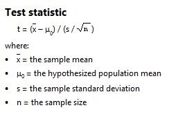

(b)
Use the qt() function to see how high the t-statistic would have to be to meet an alpha of 0.05 (critical t-value) and check whether our calculated t-statistic exceeds this.

(c)
Use the pt() function to calculate the probability for the t-statistic being this far from the expected value would the null hypothesis be true. What is this probability called? Check with the results from t.test() whether you calculated it correctly.

</div>

<details><summary>Click for the answer</summary>

(a)

```r
twaarde <- t.test(bike_duration, mu=15, alternative = "greater")$statistic
twaarde 
```

```
##        t 
## 1.898752
```

```r
twaarde_handmatig <- (mean(bike_duration)-15)/(sd(bike_duration)/sqrt(length(bike_duration)))
twaarde_handmatig 
```

```
## [1] 1.898752
```

(b)

```r
qt(0.95,19)
```

```
## [1] 1.729133
```

```r
twaarde_handmatig > qt(0.95,19)
```

```
## [1] TRUE
```


(c)

```r
# probability of t-statistic being this extreme:
pt(twaarde_handmatig, df = 19, lower.tail=FALSE)
```

```
## [1] 0.03644556
```

```r
# which is the same p-value as t.test() have you earlier:
t.test(bike_duration, mu=15, alternative = "greater")$p.value
```

```
## [1] 0.03644556
```

```r
# note: would you have had a two-sided t-test (H1=average bike duration is different from 15 minutes) 
# you would need twice this number as you are looking for the probability of 
# twaarde_handmatig being this far to the right OR -twaarde_handmatig being this far to the left:
2 * pt(twaarde_handmatig, df = 19, lower.tail=FALSE)
```

```
## [1] 0.07289112
```

```r
t.test(bike_duration, mu=15, alternative = "two.sided")$p.value
```

```
## [1] 0.07289112
```
</details>


***BREAK FOR NEXT WEEK***


## Rejecting the null hypothesis

Now this seems to paint a rather clear picture for our common experimental situation. If :

A) a p-value in a null hypothesis test gives you the probability of getting the current data or more extreme ( = more different from what we would expect if the null hypothesis was true) if the null hypothesis was true.

B) we mostly agree on how small this probability needs to be before we consider the data so unlikely that we reject our null hypothesis.

C) these probabilities can be calculated in R (or SPSS or by hand, etc)

We have reached a clear method and can go about doing proper, objective science, right?

Well, in fact, you may have noticed the situation is a bit weird to begin with:

We have a certain hypothesis about the world (I take longer than 15 minutes to reach the Uithof). Next, we test a *different* hypothesis (the null hypothesis: I take no more than 15 minutes). If we find that the data we acquired has a very low probability if this nullhypothesis was true, we dump the null hypothesis and accept the alternative one (p<0.05, so I take significantly longer than 15 minutes). Without ever testing the actual hypothesis we are interested in against the data. So we calculated the probability of the data given a different hypothesis, rather than the probability of our hypothesis given the data.

Here is where we meet the two schools of thought again, you met in question 5.1: some people say: "well, this is bullshit. Let's do it the other way around. I might need big computers though and I am going to need to make some assumptions" (Bayesians). Other people say: "Yes, this is counterintuitive, but it seems to be the most objective way of handling inductive statistics, so we just have to be careful" (frequentists).

As the latter is still the most popular approach in experimental settings, we will follow this route.

However, the "just have to be careful"-part is no joke. We will focus this lesson on how you can be careful, and what can go wrong if you don't.

<div class="question">
##### Exercise 5

A p-value in a null hypothesis test gives you the probability of getting the current data or more extreme ( = more different from what we would expect if the null hypothesis was true) if the null hypothesis was true.
Suppose we do such a hypothesis test because we wonder whether cadmium concentration in mg/kg of the soil at the Uithof differs from that in Utrecht city.

We will simulate this experiment. Generate the data by using the following code:

> cd_uithof <- rnorm(50,mean=0.52,sd=0.2)

> cd_stad <- rnorm(50,mean=0.51,sd=0.2)

(a)
Calculate the p-value you are looking for (of course, first inspect the data and test the assumptions)

(b)
If we found a p-value > 0.05, can we say we **proved** there is **no difference** in cadmium concentration?

</div>

<details><summary>Click for the answer to (a) </summary>

(a)


```r
cd_uithof <- rnorm(50,mean=0.52,sd=0.2)
cd_stad <- rnorm(50,mean=0.51,sd=0.2)

# inspect the data
cd_data <- data.frame( location = rep(c("Uithof", "Stad"), each = 50),
                        cadmium = c(cd_uithof,  cd_stad))

cd_data %>% group_by(location) %>%
  summarise(  count = n(),
              mean = mean(cadmium, na.rm = TRUE),
                sd = sd(cadmium, na.rm = TRUE)
  )
```

```
## # A tibble: 2 × 4
##   location count  mean    sd
##   <chr>    <int> <dbl> <dbl>
## 1 Stad        50 0.472 0.153
## 2 Uithof      50 0.524 0.236
```

```r
# visually inspect it as well:
cd_data %>% ggplot(aes(x=as.factor(location), y=cadmium)) + 
    geom_boxplot(fill="slateblue", alpha=0.2) + 
    xlab("location") + ylab("[cadmium] in mg/kg")
```


```r
# we already know, as we generated the data ourselves.
# but let's check for normality:
cd_data %>%
  group_by(location) %>%
  summarise(statistic = shapiro.test(cadmium)$statistic,
            p.value = shapiro.test(cadmium)$p.value)
```

```
## # A tibble: 2 × 3
##   location statistic p.value
##   <chr>        <dbl>   <dbl>
## 1 Stad         0.965   0.142
## 2 Uithof       0.987   0.841
```

```r
# and equal variance:
#library(car)
leveneTest(cadmium ~ as.factor(location), data = cd_data, center = mean)
```

```
## Levene's Test for Homogeneity of Variance (center = mean)
##       Df F value  Pr(>F)  
## group  1  5.2308 0.02434 *
##       98                  
## ---
## Signif. codes:  0 '***' 0.001 '**' 0.01 '*' 0.05 '.' 0.1 ' ' 1
```

```r
# and finally the p-value
cd_ttest <- t.test(cd_uithof, cd_stad, alternative = "two.sided", var.equal = TRUE)
cd_ttest
```

```
## 
## 	Two Sample t-test
## 
## data:  cd_uithof and cd_stad
## t = 1.3203, df = 98, p-value = 0.1898
## alternative hypothesis: true difference in means is not equal to 0
## 95 percent confidence interval:
##  -0.02642853  0.13149470
## sample estimates:
## mean of x mean of y 
## 0.5244788 0.4719457
```
</details>

<details><summary>Click for the answer to (b) </summary>

(b)

No. We can say we **found no significant difference** in cadmium concentration. However, we did not "prove" the alternative hypothesis. 
There was not enough statistical evidence to reject the null hypothesis that there is no difference in cadmium concentration between the soil at the Uithof and Utrecht city. However, failing to reject it, is not the same as proving it is false.

Suppose someone is charged with murder and has to stand trial in a court of law. They are considered innocent until reasonably proven otherwise. The court concludes that there is not enough evidence to convict the defendant as all the clues gathered by the police are reasonably compatible with the defendant being innocent. Does that prove the defendant is innocent? No.

Now suppose the police found the defendants DNA all over the murder scene while the defendant argued he has never even been in the same city. This would be very unlikely if the defendant was innocent, and while it does again not prove they are guilty, at some point the court (or researcher) will argue that the defendant gets a guilty verdict.

</details>

<div class="question">


##### Exercise 5

Can a p-value be negative? why?

</div>

<details><summary>Click for the answer</summary>

No, it cannot. Suppose you get a p-value of zero. This means that the gathered data is impossible if the null hypothesis was true. It can't get any more impossible than impossible.

</details>


## Statistics gone wrong 

In 1998, Andrew Wakefield and co-authors published a study linking the *bof-mazelen-rode hond-vaccinatie* to autism.

There were so many things wrong with the paper it is hard to sum it up. There was no control group, the data was not blinded, there was a really small sample size, and most of the subjects in his study did not in fact have an official autism diagnosis. Several children showed behavioural symptoms though, before even receiving the vaccination. Data was altered and a former graduate student even testified that Wakefield ignored any data that did not match his hypothesis. 
Apart from that, Wakefield was by no means a neutral scientist in this story, as he had previously received £400,000 by a group that would benefit from such a paper. Participants were recruited through anti-vax campaigners. It is as if they were trying to build a textbook example of how not to do science.

The paper was rapidly retracted, but a lot of damage had already been done. Now 20 years later, a significant percentage of people seriously consider not getting a vaccination for the new coronavirus variant that has caused a huge pandemic, and vaccination rates for previously almost wiped out (in the Netherlands) viruses such as polio, have decreased to dangerously low levels. Which may not be caused entirely by Wakefield, but it has had a huge influence.

Most people have heard of a few of these famous scientific frauds. In life science, inadequacies can have serious consequences. But actually, most researchers are normal honest people and the thing to watch out for is not suddenly becoming am fraudulent and deceitful evil scientist. **Most errors in science are committed unintentionally.**

### Sample size

We have seen that it is quite easy to misinterpret a null result: if we fail to reject a null hypothesis, this does not automatically mean our alternative hypothesis is not true. We just did not find enough evidence to reject the H0.

One directly problem with p-values, is that p-values depend on how much data you have gathered. Suppose you hypothesize that the average Dutch cat weights about 5 kilo's. Your null hypothesis would be that the population average μ ≠ 5 kg. You measure three cats: one of yours and two of a friendly neighbour. They are 3.8, 4.1 and 4.8 kg. Now, is this data unlikely if μ = 5? Well, not really, probably..

You decide that 3 is a bit low for a sample size, and organise a village-wide cat measuring day. You gather 80 datapoints, all between 3.8 and 4.8 kilos. Now, would you say this data is unlikely if μ = 5? Definitely more unlikely that with 3 datapoints! Your p-value will be lower, even though you did a very similar experiment (weighing neighbourhood cats) within the same population, with the same null hypothesis. 

This is why studies generally start with doing a power analysis: a calculated estimate of how many datapoints should be gathered. If you gather too little data, you may miss effects that are really there (e.g. 3 cats with a sample mean $\bar{x}$ of 4.2). If you gather really a lot of data, you may find that whatever little unimportant difference turns up significant in your null hypothesis tests (e.g. 300.000 cats with a  $\bar{x}$ of 4.95).

However, you can only do power analyses if you already have some evidence on what the population looks like, so if there are previous studies on cat weight you can look at. This becomes really hard when you are the first person to investigate a certain phenomenon.

<div class="question">
##### Exercise 5

You have used the PlantGrowth dataset in DAUR1. This dataset contains the results from an experiment to compare yields (as measured by dried weight of plants) obtained under a control and two different treatment conditions. In DAUR1 we found that the data in all 3 treatment groups were normally distributed. Also you can assume equal variance in the groups. 


(a) 
Take a random sample of 5 plants from each group in the **PlantGrowth** dataset, using the `sample_n()` function (google or look at the help for examples). On this subset, test whether there is a difference in weight  between the three conditions.

(b)
Now test again on the whole PlantGrowth dataset. Compare the p-values for (a) and (b), are they the same?


</div>

<details><summary>Click for the answer</summary>

(a)


```r
# take sample
plantgrowth_sample <- PlantGrowth %>% group_by(group) %>% sample_n(size = 5)

# ANOVA on sample
plant_weight_sample <- aov(weight ~ group, plantgrowth_sample)
summary.aov(plant_weight_sample)
```

```
##             Df Sum Sq Mean Sq F value Pr(>F)
## group        2  1.046  0.5230   1.417   0.28
## Residuals   12  4.430  0.3692
```

(b)

```r
#ANOVA on full dataset
plant_weight <- aov(weight ~ group, PlantGrowth)
summary.aov(plant_weight)
```

```
##             Df Sum Sq Mean Sq F value Pr(>F)  
## group        2  3.766  1.8832   4.846 0.0159 *
## Residuals   27 10.492  0.3886                 
## ---
## Signif. codes:  0 '***' 0.001 '**' 0.01 '*' 0.05 '.' 0.1 ' ' 1
```

rerun the code for question (a) a few times. See what happens with the p-value. Taking a new sample also changes the calculated p-value.
Note that the PlantGrowth dataset is also a sample. If you did the experiment again, using the exact same methods, with exactly as many plants, you will get a different p-value. 

As you can see, it is totally possible to miss real effects because you did not collect enough data.


<div class="question">
##### Exercise 5

Now let's do the opposite. You previously analysed generated data on cadmium concentration in the soil at the Uithof and Utrecht city. You found significant difference with a t-test on 50 datapoints per location.
Suppose we go completely beserk and collect (generate) 50.000 datapoints per location. What happens to the p-value?

</div>

<details><summary>Click for the answer</summary>

(a)

```r
# previous t-test on 50 datapoints/location:
cd_ttest
```

```
## 
## 	Two Sample t-test
## 
## data:  cd_uithof and cd_stad
## t = 1.3203, df = 98, p-value = 0.1898
## alternative hypothesis: true difference in means is not equal to 0
## 95 percent confidence interval:
##  -0.02642853  0.13149470
## sample estimates:
## mean of x mean of y 
## 0.5244788 0.4719457
```

```r
# beserk mode
cd_uithof2 <- rnorm(50000,mean=0.52,sd=0.2)
cd_stad2 <- rnorm(50000,mean=0.51,sd=0.2)

 t.test(cd_uithof2, cd_stad2, alternative = "two.sided", var.equal = TRUE)
```

```
## 
## 	Two Sample t-test
## 
## data:  cd_uithof2 and cd_stad2
## t = 9.3579, df = 99998, p-value < 2.2e-16
## alternative hypothesis: true difference in means is not equal to 0
## 95 percent confidence interval:
##  0.009379991 0.014350196
## sample estimates:
## mean of x mean of y 
## 0.5203225 0.5084574
```

You can see that it is just as possible to have every tiny little difference between conditions show up significant because you gathered an exorbitant amount of data. Would you warn the local government or Rijkswaterstaat per priority e-mail that there is a significant difference in cadmium concentration (0.52 vs 0.51 mg/kg soil) going on? Probably not.

</details>


### just a little p hacking
It can be quite tempting to alter your study design a bit after you get the results (maybe don't include this group after all...), stop collecting data once your p-value drops below 0.05 or maybe lower the threshold for something being an outlier, so that you can find a p-value below 0.05 and publish your result... The times are changing, but it used to be very, very common for journals to only accept studies rejecting the null hypothesis, because you cannot prove the null hypothesis being correct as we have seen previously. So if you fail to reject the null hypothesis, you have little to tell. As a result, p-values just under 0.05 are extremely over-represented in published studies...

Some solutions are preregistration of studies (the journal will accept studies based on the credibility of the design, and will publish the results no matter what they will be), making your data publicly available along with the results, so that everyone can see for themselves what they think of it, and changing to different kinds of statistics that do not rely on p-values.


Go to the following website by fivethirtyeight :[fivethirtyeight](https://projects.fivethirtyeight.com/p-hacking/) 

And see how easily you can p-hack your way to significant results. Can you get republicans or democrats to show both a positive as a negative effect on the economy depending on which factors and which politicians you include? (hint: yes, you can)


### misinterpreting p-values

Now can we dismiss half of modern research (or perhaps 5%?), sit back and criticize every slightly overinterpreted correlation or p-value we can find? 


Well, you could. But it is not very constructive. These errors do not automatically make the research stupid and the conclusions wrong. Just less supported by the data. 

You will hopefully have realised that analysing your data is a lot more than selecting "the right test" and checking a p-value. It also relies on choices for instance in data manipulation, experimental design, what you think about probability, presentation of your data...

We have seen that p-values can get really low for differences between conditions that are not at all interesting (the Cadmium concentration in the soil example). This shows that p-values are a probability for finding the data, not an effect size. So if your p-value is very low, this does not mean there is a larger difference between groups. 

## Do I have a 5% risk of being wrong?

Also, one often heard misinterpretation is that there is a 5% chance that your conclusion is wrong because of the alpha=0.05 (the threshold for the p-value for rejecting the null hypothesis).

This stems from mixing two ideas about p-values. a) That they can provide you with an indication of how surprising a dataset is and b) that they can be used to reject or accept hypotheses with a guaranteed long-run false positive rate. If your p-value in a null hypothesis test is 0.03, this does not mean that there is a 3% chance of wrongly rejecting the null hypothesis. It means that if your null hypothesis was true, there is only a 3% chance of finding your data, which you could consider low enough to say that you think the null hypothesis may be wrong.

Is 5% of literature wrong then?

In the long run, if every study in the world used frequentist statistics with null hypothesis testing (they don't) and everybody uses it correctly (they don't either), and studies with p-values above 0.05 are just as likely to be published as studies with p-values below 0.05, you would guarantee not wrongly rejecting null hypotheses more than 5% of the time, likely even a lot less. So also the idea that 5% of studies in the library is wrong, is untrue, we simply do not really know. Some particular overconfident but incompetent researchers may have a much higher false rejection rate. And by nature, studies that have trouble finding enough data will have the opposite and will often wrongly not reject the null hypothesis (remember the plantgrowth example). For instance, studies on rare cancer types in children, will have a higher than average probability of wrongly **not** rejecting the null hypothesis, because they don't have that much data (and to be honest, we wouldn't want them to be able to collect more data). 

## multiple comparisons

That said, suppose the following example:

A friend and you flip a coin on who gets the last piece of chocolate. She wins, and you are so angry you accuse her of using an unfair coin. You take the coin home, and record yourself flipping the coin 5 times in a row. 

The first time you record yourself, it ends up heads 3 times and tails 2 times. What would you say is the probability of getting this result if the coin was fair? Hmn, pretty good actually. But you are angry, so you try another time. And another. And another.
After 40 tries, the coin lands heads up all 5 times. Ha! the probability is 1/32 (remember this?:) 
$$ \text{ probability of an event} =   \frac{\text{number of ways it can happen}}{\text{total number of possible outcomes}}$$

1/32 is below 0.05, so we can reject the null hypothesis that the coin is fair!

Let's angrily call your friend that she cheated. You send her the last recording as proof: there is significant evidence of fraud at the 5% level!

However, you would expect to sometimes land a coin on heads 5 times in a row, and you can expect, if you redo a particular experiment enough times that it may by coincidence give you a dataset that is rather unlikely under the null hypothesis, even if the null hypothesis is actually true. Similarly, if you do a whole bunch of related null hypothesis tests, you will by coincidence find somep-values below 0.05.

XKCD, as usual explains very well how this may happen in real life: [click](https://xkcd.com/882/). It also nicely illustrates the publication bias: the large number of insignificant results will likely never get published, The one significant result will.

There are several ways to prevent making the mistakes above, most famously is *correcting for multiple comparisons*. So, if you do multiple similar t-tests within an experiment, you will lower the threshold the p-value needs to drop below before you would reject the null hypothesis.

You can lower it for instance from $\alpha $ = 0.05 to $\alpha $ = 0.05/number_of_tests, or, essentially the same, correct the p-value for multiple comparisons by multiplying it with the number of tests. This is called the Bonferroni correction. This correction does very well at decreasing the chance of a type 1 error (wrongly rejecting the H0), but at the cost of increasing the type 2 error rate (not rejecting the H0 when you should have). It may lead to a very high rate of false negatives.

As a example, let's look at the left frontpaw length in cm of some hypothetical rats in 3 groups:


```r
set.seed(1235)
frontpaws.df <- tibble(
  group = as.factor(rep(c("A","B","C"),each=10)),
  pawlength = c(rnorm(10,3.4,1),rnorm(10,5.5,1),rnorm(10,5,1))
)

# there are 3 levels in group:
levels(frontpaws.df$group)
```

```
## [1] "A" "B" "C"
```

```r
# they seem to have different lengths:
group_by(frontpaws.df, group) %>%
  summarise(
    count = n(),
    mean = mean(pawlength, na.rm = TRUE),
    sd = sd(pawlength, na.rm = TRUE)
  )
```

```
## # A tibble: 3 × 4
##   group count  mean    sd
##   <fct> <int> <dbl> <dbl>
## 1 A        10  3.74 0.902
## 2 B        10  5.34 0.708
## 3 C        10  4.74 0.895
```

```r
# let's check for normality:
frontpaws.df %>%
  group_by(group) %>%
  summarise(statistic = shapiro.test(pawlength)$statistic,
            p.value = shapiro.test(pawlength)$p.value)
```

```
## # A tibble: 3 × 3
##   group statistic p.value
##   <fct>     <dbl>   <dbl>
## 1 A         0.973   0.919
## 2 B         0.892   0.178
## 3 C         0.974   0.927
```

```r
# and equality of variance:

library(car) 
lm.paw1<-lm(pawlength~group,data=frontpaws.df) 
leveneTest(lm.paw1)
```

```
## Levene's Test for Homogeneity of Variance (center = median)
##       Df F value Pr(>F)
## group  2  0.1303 0.8784
##       27
```

```r
# Plot weight by group and color by group
ggplot(frontpaws.df, aes(x = group, y = pawlength)) + 
        geom_boxplot(aes(fill = group)) + 
        geom_jitter(position=position_jitter(0.2)) +
        theme_bw(base_size = 14) +
        xlab("group") +
        ylab("left front paw length") +
        scale_fill_discrete(guide = guide_legend(title = "group"))
```


```r
# so we want to do an ANOVA:

pawlength_aov<- aov(pawlength ~ group, frontpaws.df)
summary.aov(pawlength_aov)
```

```
##             Df Sum Sq Mean Sq F value   Pr(>F)    
## group        2  13.03   6.515   9.236 0.000879 ***
## Residuals   27  19.05   0.705                     
## ---
## Signif. codes:  0 '***' 0.001 '**' 0.01 '*' 0.05 '.' 0.1 ' ' 1
```

there is a significant difference between the groups in paw length! But between which groups exactly?
We can do some post-hoc t-tests, comparing A to B, A to C and B to C. But this is starting to look like the jelly beans situation in the XKCD comic. So we will correct for multiple comparisons:


```r
p.AB <- frontpaws.df %>% filter(group!="C") %>%
 summarise(pval = t.test(pawlength ~ group, var.equal = TRUE)$p.value)
p.AC <- frontpaws.df %>% filter(group!="B") %>%
 summarise(pval = t.test(pawlength ~ group, var.equal = TRUE)$p.value)
p.BC <- frontpaws.df %>% filter(group!="A") %>%
 summarise(pval = t.test(pawlength ~ group, var.equal = TRUE)$p.value)

p.ABC <- tibble(comparison =c("AB", "AC", "BC"), p.value=  c(p.AB$pval, p.AC$pval, p.BC$pval))
p.ABC
```

```
## # A tibble: 3 × 2
##   comparison  p.value
##   <chr>         <dbl>
## 1 AB         0.000343
## 2 AC         0.0225  
## 3 BC         0.117
```


Unadjusted, we see a significant difference in left frontpaw length between group A and B, and between group A and C.


After correcting for multiple comparisons, we fail to reject the null hypothesis for the comparison between group A and C:

```r
p.adjust(p.ABC$p.value,method="bonferroni",n=length(p.ABC$p.value))
```

```
## [1] 0.001028824 0.067546494 0.351174766
```

```r
# should be the same in this case as:
p.ABC$p.value*3
```

```
## [1] 0.001028824 0.067546494 0.351174766
```

This can be done easier:


```r
# compare unadjusted
pairwise.t.test(frontpaws.df$pawlength, frontpaws.df$group,
                p.adjust.method="none", 
                paired=FALSE, pool.sd=F,var.eq=T) 
```

```
## 
## 	Pairwise comparisons using t tests with non-pooled SD 
## 
## data:  frontpaws.df$pawlength and frontpaws.df$group 
## 
##   A       B      
## B 0.00034 -      
## C 0.02252 0.11706
## 
## P value adjustment method: none
```

```r
# to adjusted:
pairwise.t.test(frontpaws.df$pawlength, frontpaws.df$group,
                p.adjust.method="bonferroni", 
                paired=FALSE, pool.sd=F,var.eq=T) 
```

```
## 
## 	Pairwise comparisons using t tests with non-pooled SD 
## 
## data:  frontpaws.df$pawlength and frontpaws.df$group 
## 
##   A     B    
## B 0.001 -    
## C 0.068 0.351
## 
## P value adjustment method: bonferroni
```


So we would have to conclude that there is a significant difference in paw length between group A and group B.

Note that this example shows that failing to reject the null hypothesis is not the same as proving the null hypothesis is correct.

1. We find a significant difference in paw length between group A and B (H0 is rejected)

2. We find no significant difference in paw length between group B and C (H0 is not rejected)

3. We find no significant difference in paw length between group A and C (H0 is not rejected)

If statement 2. would mean that we **prove** there is no difference whatsoever in paw length between group B and C, they were sampled from one and the same population, we should have gotten a significant difference in paw length between group A and C, because we found a significant difference between group A and B. This is not the case. Perhaps there is a difference between gorup B and C that we just have not enough prove for. Perhaps there is no difference between group B and C, and the fact that we find no significant difference between A and C is a type 2 error. 


<!--chapter:end:ch17-lab6a-probability.Rmd-->

# Lab 6b - Basic regression


## Resources and justification 
This chapter was adapted from chapter 5 and 6 of

"ModerDive, Statistical Inference via Data Science, A ModernDive into R and the Tidyverse", by Chester Ismay and Albert Y. Kim
Foreword by Kelly S. McConville
Version: February 05, 2021

The full book and source can be found 

 - [bookdown project](https://moderndive.com/) and 
 - [github repo](https://github.com/moderndive/ModernDive_book )
 - [R package](https://github.com/moderndive/moderndive)
 - [exercises](https://github.com/moderndive/moderndive_labs/tree/master/static)

To install the `{moderndive}` R package we will install the latest development version, using `{remotes}`.


```{.r .Rchunk}
remotes::install_github("https://github.com/moderndive/moderndive")
```

In the Data Analysis Using R (DAUR-1) course you acquired the skills to import, wrangle and visualize data and you learned the concept of a "tidy" data format. In Lesson "Probability" you also learned the basic principles for using statistical models and how they work. It is now time to start to do the actual modeling of data. The fundamental premise of data modeling is to make explicit the relationship between:

* an *outcome variable* $y$, also called a *dependent variable* or response variable, \index{variables!response / outcome / dependent} and
* an *explanatory/predictor variable* $x$, also called an *independent variable* or \index{variables!explanatory / predictor / independent} covariate.

Another way to state this is using mathematical terminology: we will model the outcome variable $y$ "as a function" of the explanatory/predictor variable $x$. When we say "function" here, we aren't referring to functions in R like the `ggplot()` function, but rather as a mathematical function. But, why are there two labels, explanatory and predictor, for the variable $x$? Because, even though the two terms are used interchangeably, data modeling mainly serves one of two purposes:

 1. **Modeling for explanation**: When you want to explicitly describe and quantify the relationship between the outcome variable $y$ and a set of explanatory variables $x$, determine the significance of any relationships, have measures summarizing these relationships, and possibly identify any *causal* relationships between the variables. 
 1. **Modeling for prediction**: When you want to predict an outcome variable $y$ based on the information contained in a set of predictor variables $x$. Unlike modeling for explanation, however, you don't care so much about understanding how all the variables relate and interact with one another, but rather only whether you can make good predictions about $y$ using the information in $x$.

## Example from ModernDive
For example, say you are interested in an outcome variable $y$ of whether patients develop lung cancer and information $x$ on their risk factors, such as smoking habits, age, and socioeconomic status. If we are modeling for explanation, we would be interested in both describing and quantifying the effects of the different risk factors. One reason could be that you want to design an intervention to reduce lung cancer incidence in a population, such as targeting smokers of a specific age group with advertising for smoking cessation programs. If we are modeling for prediction, however, we wouldn't care so much about understanding how all the individual risk factors contribute to lung cancer, but rather only whether we can make good predictions of which people will contract lung cancer.

In this lesson, we'll focus on modeling for explanation and hence refer to $x$ as *explanatory variables*. Here we'll focus on one particular technique: *linear regression*. Linear regression is one of the most commonly-used approaches to modeling.

Linear regression involves a *numerical* outcome variable $y$ and explanatory variables $x$ that are either *numerical* or *categorical*. Furthermore, the relationship between $y$ and $x$ is assumed to be linear, or in other words, a line. However, we'll see that how a "line" is defined, will vary depending on the nature of your explanatory variables $x$.

During this lesson, we'll only consider models with a single explanatory variable $x$. In the first part, the explanatory variable will be numerical. This scenario is known as *simple linear regression*. In the second part of this lesson, the explanatory variable will be categorical.

Let's now begin with basic regression, which refers to linear regression models with a single explanatory variable $x$. We'll also discuss important statistical concepts like the *correlation coefficient*, that "correlation isn't necessarily causation," and what it means for a line to be "best-fitting."

### Needed packages 
Let's load the necessary packages for this Lesson

```{.r .Rchunk}
library(dagitty)
library(tidyverse)
library(moderndive)
library(skimr)
library(gapminder)
library(mvtnorm)
library(broom)
library(kableExtra)
library(patchwork)
library(RNHANES)
library(HSAUR3)
library(rethinking)
```

If you did not install "rethinking" before, see [here](https://www.rdocumentation.org/packages/rethinking/versions/1.59)

## One numerical explanatory variable {#model1}

[Why do some professors and instructors at universities and colleges receive high [teaching evaluations scores from students while others receive lower ones? Are there [differences in teaching evaluations between instructors of different demographic [groups? Could there be an impact due to student biases? These are all questions that [are of interest to university/college administrators, as teaching evaluations are [among the many criteria considered in determining which instructors and professors [get promoted.


To start with simple regression, we will look at a dataset from the [`{HSAUR3}`](https://cran.r-project.org/package=HSAUR3) package, which is the accompanying R package to the book: "A Handbook of Statistical Analyses Using R", (3rd Edition), by Torsten Hothorn.

The data was published in the paper: J. D. Robertson and P. Armitage (1959) Comparison of Two Hypotensive Agents, Anaesthesia, 14(1), 53–64. 

```{.r .Rchunk}
## data from HSAUR3
data(package = "HSAUR3", dataset = "bp")

bp <- bp %>% 
  as_tibble()
```

In this section, we'll keep things simple for now and try to explain differences in drug dose as a function of one numerical variable: the average systolic blood pressure in mmHg (millimeters of mercury). The study intended to compare the effectiveness of two hypotensive (blood pressure lowering) drugs. 

Let's look at the variables in the data that matter for this basic regression analysis. We need 

1. A numerical outcome variable $y$ (blood pressure: `bloodp`) and
1. A single numerical explanatory variable $x$ (the log10 of the drug dose: `logdose`).

## Exploratory data analysis

Let's `select()` only the subset of the variables we'll consider in this chapter, and save this data in a new data frame called `bp_simple`:


```{.r .Rchunk}
bp_simple <- bp %>%
  dplyr::select(bloodp, logdose)
bp_simple
```

```{.Rout}
## # A tibble: 53 × 2
##    bloodp logdose
##     <dbl>   <dbl>
##  1     66    2.26
##  2     52    1.81
##  3     72    1.78
##  4     67    1.54
##  5     69    2.06
##  6     71    1.74
##  7     88    2.56
##  8     68    2.29
##  9     59    1.8 
## 10     73    2.32
## # … with 43 more rows
```

A crucial step before doing any kind of analysis or modeling is performing an *exploratory data analysis*, or EDA for short. EDA gives you a sense of the distributions of the individual variables in your data, whether any potential relationships exist between variables, whether there are outliers and/or missing values, and (most importantly) how to build your model. Here are common steps in an EDA:

1. Most crucially, looking at the raw data values.
1. Creating an initial visualization, showing _all_ the data (sometimes you have so many data points that you are better off taking a random sample first).
1. Computing summary statistics, such as means, medians, and interquartile ranges.
1. More visualizations (e.g. to explore statistical model assumptions - which you saw in the DAUR1 course)

**STEP1; Looking at your data**
Let's perform the first common step in an exploratory data analysis: looking at the raw data values. Because this step seems so trivial, unfortunately many data analysts ignore it. However, getting an early sense of what your raw data looks like can often prevent many larger issues down the road. Grab a cup of coffee, or whther is your fancy and start looking at the data.

You can do this by using RStudio's spreadsheet viewer or by using the `glimpse()` function.


```{.r .Rchunk}
glimpse(bp_simple)
```

```{.Rout}
## Rows: 53
## Columns: 2
## $ bloodp  <dbl> 66, 52, 72, 67, 69, 71, 88, 68, 59, 73, 68, 58, 61, 68, 69, 55…
## $ logdose <dbl> 2.26, 1.81, 1.78, 1.54, 2.06, 1.74, 2.56, 2.29, 1.80, 2.32, 2.…
```

```{.r .Rchunk}
bp_simple
```

```{.Rout}
## # A tibble: 53 × 2
##    bloodp logdose
##     <dbl>   <dbl>
##  1     66    2.26
##  2     52    1.81
##  3     72    1.78
##  4     67    1.54
##  5     69    2.06
##  6     71    1.74
##  7     88    2.56
##  8     68    2.29
##  9     59    1.8 
## 10     73    2.32
## # … with 43 more rows
```

**STEP2 Visualize as fast as you can**
Before doing anything else, I always like to have a first glimpse at the actual values in the data by means of a graph. With simple regression we have two numeric variables, so a scatterplot of these two variables where we plot the outcome (or dependent) variable `bloodp` on the $y$ axis and the single numeric explanatory variable (`logdose`) on the $x$ axis is a logical choice.


```{.r .Rchunk}
bp_simple %>%
  ggplot(aes(x = logdose, y = bloodp)) +
  geom_point()
```


We can add the linear relationship that is implied from the scatterplot:

```{.r .Rchunk}
bp_simple %>%
  ggplot(aes(x = logdose, y = bloodp)) +
  geom_point() +
  geom_smooth(method = "lm")
```


From this we can observe the relationship between the blood pressure variable `bloodp` and the dose of the hypotensive drug `logdose` appears to be positive in nature. Meaning that increasing the dose, is correlated with an increase in blood pressure. Mind that we can not claim any causal relationship from this relationship. At this point, we also have no clue how strong this relationship is (how good does the line fit (represents) the data points = *correlation coefficient*) and we also have no idea on how large the effect of increasing the dose is on increasing the blood pressure (slope). We do have a sense of what the  *direction* (or *sign*) of the `*correlation coefficient*) is going to be (probably positive).   


Observe that Observations: 53 indicates that there are 53 rows/observations in `bp_simple`, where each row corresponds to one observation made in one individual patient. It is important to note that the *observational unit* is an individual patient. The observational unit is the "type of thing" that is being measured by our variables.

**STEP3 Summary statistics**
Now that we've looked at the raw values in our `bp_simple` data frame and got a preliminary sense of the data, let's move on to last common step in an exploratory data analysis: computing summary statistics. Let's start by computing the mean and median of our numerical outcome variable `bloodp` and our numerical explanatory variable "beauty" score denoted as `logdose`. We'll do this by using the `summarize()` function from `{dplyr}` along with the `mean()` and `median()` functions.


```{.r .Rchunk}
bp_simple %>%
  summarize(
    mean_bloop = mean(bloodp), 
    mean_logdose = mean(logdose),
    median_bloodp = median(bloodp), 
    median_logdose = median(logdose))
```

```{.Rout}
## # A tibble: 1 × 4
##   mean_bloop mean_logdose median_bloodp median_logdose
##        <dbl>        <dbl>         <dbl>          <dbl>
## 1       66.3         1.99            67            1.9
```

However, what if we want other summary statistics as well, such as the standard deviation (a measure of spread), the minimum and maximum values, and various percentiles? 

Typing out all these summary statistic functions in `summarize()` would be long and tedious. Instead, let's use the convenient `skim()` function from the `{skimr}` package. This function takes in a data frame, "skims" it, and returns commonly used summary statistics. Let's take our `bp_simple` data frame, and pipe it into the `skim()` function:


```{.r .Rchunk}
bp_simple %>% 
  skim()
```


<table style='width: auto;'
        class='table table-condensed'>
<caption>(\#tab:bp_skim)Data summary</caption>
 <thead>
  <tr>
   <th style="text-align:left;">   </th>
   <th style="text-align:left;">   </th>
  </tr>
 </thead>
<tbody>
  <tr>
   <td style="text-align:left;"> Name </td>
   <td style="text-align:left;"> Piped data </td>
  </tr>
  <tr>
   <td style="text-align:left;"> Number of rows </td>
   <td style="text-align:left;"> 53 </td>
  </tr>
  <tr>
   <td style="text-align:left;"> Number of columns </td>
   <td style="text-align:left;"> 2 </td>
  </tr>
  <tr>
   <td style="text-align:left;"> _______________________ </td>
   <td style="text-align:left;">  </td>
  </tr>
  <tr>
   <td style="text-align:left;"> Column type frequency: </td>
   <td style="text-align:left;">  </td>
  </tr>
  <tr>
   <td style="text-align:left;"> numeric </td>
   <td style="text-align:left;"> 2 </td>
  </tr>
  <tr>
   <td style="text-align:left;"> ________________________ </td>
   <td style="text-align:left;">  </td>
  </tr>
  <tr>
   <td style="text-align:left;"> Group variables </td>
   <td style="text-align:left;"> None </td>
  </tr>
</tbody>
</table>


**Variable type: numeric**

<table>
 <thead>
  <tr>
   <th style="text-align:left;"> skim_variable </th>
   <th style="text-align:right;"> n_missing </th>
   <th style="text-align:right;"> complete_rate </th>
   <th style="text-align:right;"> mean </th>
   <th style="text-align:right;"> sd </th>
   <th style="text-align:right;"> p0 </th>
   <th style="text-align:right;"> p25 </th>
   <th style="text-align:right;"> p50 </th>
   <th style="text-align:right;"> p75 </th>
   <th style="text-align:right;"> p100 </th>
   <th style="text-align:left;"> hist </th>
  </tr>
 </thead>
<tbody>
  <tr>
   <td style="text-align:left;"> bloodp </td>
   <td style="text-align:right;"> 0 </td>
   <td style="text-align:right;"> 1 </td>
   <td style="text-align:right;"> 66.34 </td>
   <td style="text-align:right;"> 7.73 </td>
   <td style="text-align:right;"> 51.00 </td>
   <td style="text-align:right;"> 60.00 </td>
   <td style="text-align:right;"> 67.0 </td>
   <td style="text-align:right;"> 69.00 </td>
   <td style="text-align:right;"> 88.00 </td>
   <td style="text-align:left;"> ▂▅▇▁▁ </td>
  </tr>
  <tr>
   <td style="text-align:left;"> logdose </td>
   <td style="text-align:right;"> 0 </td>
   <td style="text-align:right;"> 1 </td>
   <td style="text-align:right;"> 1.99 </td>
   <td style="text-align:right;"> 0.34 </td>
   <td style="text-align:right;"> 1.18 </td>
   <td style="text-align:right;"> 1.74 </td>
   <td style="text-align:right;"> 1.9 </td>
   <td style="text-align:right;"> 2.26 </td>
   <td style="text-align:right;"> 2.78 </td>
   <td style="text-align:left;"> ▁▇▃▅▂ </td>
  </tr>
</tbody>
</table>

For both `bloodp` and `logdose` it returns:

- `n_missing`: the number of missing values
- `complete_rate`: the ratio of non-missing or complete values, compared to all observations
- `mean`: the average
- `sd`: the standard deviation
- `p0`: the 0th percentile: the value at which 0% of observations are smaller than it (the *minimum* value)
- `p25`: the 25th percentile: the value at which 25% of observations are smaller than it (the *1st quartile*)
- `p50`: the 50th percentile: the value at which 50% of observations are smaller than it (the *2nd* quartile and more commonly called the *median*)
- `p75`: the 75th percentile: the value at which 75% of observations are smaller than it (the *3rd quartile*)
- `p100`: the 100th percentile: the value at which 100% of observations are smaller than it (the *maximum* value)
- `hist`: A pictogram-like display of the variable histogram 

The `skim()` function only returns what are known as *univariate* summary statistics: functions that take a single variable and return some numerical summary of that variable. However, there also exist *bivariate* summary statistics: functions that take in two variables and return some summary of those two variables. In particular, when the two variables are numerical, we can compute the *correlation coefficient*. Generally speaking, *coefficients* are quantitative expressions of a specific phenomenon.  A *correlation coefficient* is a quantitative expression of the *strength of the linear relationship between two numerical variables*. Its value ranges between -1 and 1 where:

* -1 indicates a perfect *negative relationship*: As one variable increases, the value of the other variable tends to go down, following a straight line.
* 0 indicates no relationship: The values of both variables go up/down independently of each other.
* +1 indicates a perfect *positive relationship*: As the value of one variable goes up, the value of the other variable tends to go up as well in a linear fashion.

<div class="figure">

<p class="caption">(\#fig:correlation1)Nine different correlation coefficients.</p>
</div>

The figure above gives examples of 9 different correlation coefficient values for hypothetical numerical variables $x$ and $y$. For example, observe in the top right plot that for a correlation coefficient of -0.75 there is a negative linear relationship between $x$ and $y$, but it is not as strong as the negative linear relationship between $x$ and $y$ when the correlation coefficient is -0.9 or -1.

<div class="question">
##### Exercise 6
Look carefully at the correlation figure above. What value do you expect the correlation coefficient of the blood pressure-drug relationship to be? Make an educated guess. If you cannot put a single number to it, at least provide an upper and a lower limit of your estimate (between what values do you think it lies?).   

</div>

<details><summary>Click for the answer</summary>
Judging the correlation coefficient from the figure it might come out somewhere between 0.3 and 0.75.
</details>

The correlation coefficient can be computed using the `get_correlation()` function in the `moderndive` package. In this case, the inputs to the function are the two numerical variables for which we want to calculate the correlation coefficient. 

We put the name of the outcome variable on the left-hand side of the `~` "tilde" sign, while putting the name of the explanatory variable on the right-hand side. This is known as R's *formula notation*. We will use this same "formula" syntax with regression later in this chapter.


```{.r .Rchunk}
bp_simple %>% 
  get_correlation(formula = bloodp ~ logdose)
```

```{.Rout}
## # A tibble: 1 × 1
##     cor
##   <dbl>
## 1 0.469
```

An alternative way to compute correlation is to use the `cor()` summary function within a `summarize()`:

```{.r .Rchunk}
bp_simple %>% 
  summarize(correlation = cor(bloodp, logdose))
```

getting and rounding the coefficient

```{.r .Rchunk}
bp_simple %>% 
  get_correlation(formula = bloodp ~ logdose) %>%
  round(3) %>%
  pull() -> cor_bp
```

In our case, the correlation coefficient of 0.469 indicates that the relationship between drug dose and blood pressure  "weakly positive." There is a certain amount of subjectivity in interpreting correlation coefficients, especially those that aren't close to the extreme values of -1, 0, and 1. 

Let's now perform the last of the steps in an exploratory data analysis: creating data visualizations. Since both the `bloodp` and `logdose` variables are numerical, a scatterplot is an appropriate graph to visualize this data. We made a quick graph like that above. Here we zoom in on some of the points in the graph. Let's do this using `geom_point()` and display the result: 


```{.r .Rchunk}
bp_simple %>%
  ggplot(aes(x = logdose, y = bloodp)) +
  geom_point() +
  labs(x = "Dose(log10)", 
       y = "Blood Pressure (mmHg)",
       title = "Simple linear regression") 
```


Observe that most `Blood Pressure` vlaues lie between `65` and `75`, while most `Log 10(Dose)` values lie between `1.5` and `2.25`. Furthermore, the relationship between `Bloood Pressure` and `Log10(Dose)` is "weakly positive." This is consistent with our earlier computed correlation coefficient of 0.469.

<div class="question">
##### Exercise 6. 
Add random noise to points to assess overplotting
(a) We know that sometimes in scatterplots, point that exaclty overlap result in masking a pattern. Add some random noise to the graph above to see if there is indeed overplotting happening in this case
(b) What is your conclusion?
(c) Did you change the value of the points by adding 'jitter' to the graph?

</div>

<details><summary>Click for the answer</summary>

```{.r .Rchunk}
#(a) 
bp_simple %>%
  ggplot(aes(x = logdose, y = bloodp)) +
  geom_point(position = "jitter") +
  geom_smooth(method = "lm") +
  labs(x = "Dose(log10)", 
       y = "Blood Pressure (mmHg)",
       title = "Simple linear regression") 
```


```{.r .Rchunk}
#(b)there is no overplotting

#(c)no values are not changed, only the displayed position in the graph
```
</details>

Let's build on the unjittered scatterplot in Figure \@ref(fig:numxplot1) by adding a "best-fitting" line: of all possible lines we can draw on this scatterplot, it is the line that "best" fits through the cloud of points. We do this by adding a new `geom_smooth(method = "lm", se = FALSE)` layer to the `ggplot()` code that created the scatterplot in Figure \@ref(fig:numxplot1). The `method = "lm"` argument sets the line to be a "`l`inear `m`odel." The `se = FALSE` argument suppresses _standard error_ uncertainty bars.


```{.r .Rchunk}
bp_simple %>%
  ggplot(aes(x = logdose, y = bloodp)) +
  geom_point() +
  geom_smooth(method = "lm") +
  labs(x = "Dose(log10)", 
       y = "Blood Pressure (mmHg)",
       title = "Simple linear regression") 
```

<div class="figure">

<p class="caption">(\#fig:numxplot3)Regression line.</p>
</div>

The line in the resulting Figure is called a "regression line." The regression line is a visual summary of the relationship between two numerical variables, in our case the outcome variable `bloodp` and the explanatory variable `logdose`. The positive slope of the blue line is consistent with our earlier observed correlation coefficient of 0.469 suggesting that there is a positive relationship between these two variables: as the log10 of the drug dose increases, so also does the blood pressure. We'll see later, however, that while the correlation coefficient and the slope of a regression line always have the same sign (positive or negative), they typically do not have the same value.

Furthermore, a regression line is "best-fitting" in that it minimizes some mathematical criteria. We present these mathematical criteria in later in this lesson.

<div class="question">
##### Exercise 6
Perform a simple regression analysis on your own

For this exercise we move to a different dataset: `milk` from the rethinking package by Richard Mc Elreath. [see:](https://rdrr.io/github/rmcelreath/rethinking/man/milk.html) or 
```
?rethinking::milk
```
for more info

An evolutionary hypothesis is that fat contents of mother's milk is related to the relative size of the so-called neocortex (or neuronal gray matter) in the brain of mammals. The formation of the complicated neocortex during post-natal development is an energy consuming process, so having higher energetic content in milk could have generated an evolutionary advantage and driven neocortical development. To gather insight into this relationship, we will run a simple regression.

For this exercise you need to complete the following steps:

 1. Load the `{rethinking}` package
 1. Load the dataset `milk` as a tibble in your R-session
 1. Inspect the data and see what kind of variables you have
 1. Are there missing data? Create a visualization
 1. Which variables are numeric (write a short piece of code that uses a `map()` function and a conditional statement)
 1. Select (using `dplyr::select()`) those variables that are numeric
 1. Plot the relationship between the `neocortex.perc` variable and the `perc.fat`. In your analysis, regard `perc.fat` as the response ($y$) and `neocortex.perc` as the explanatory ($x$), variable
 1. Calculate relevant summary statistics
 1. Plot a regression line under linear (straight line: $y = ax + b$) assumption. 
 1. Describe the relationship in quantitative and qualitative terms
 1. Calculate the correlation coefficient
 1. Write your conclusion on the relationship between the percentage of fat in mother's milk (`perc.fat`) and the percentage of the brain that is composed of neuronal grey matter (neocortex -> `neocortex.perc`) 

</div>

<details><summary>Click for the answer</summary>

```{.r .Rchunk}
# 1
library(rethinking)
# 2
data("milk")
# 3
milk %>% as_tibble()
```

```{.Rout}
## # A tibble: 29 × 8
##    clade            species  kcal.per.g perc.fat perc.protein perc.lactose  mass
##    <fct>            <fct>         <dbl>    <dbl>        <dbl>        <dbl> <dbl>
##  1 Strepsirrhine    Eulemur…       0.49     16.6         15.4         68.0  1.95
##  2 Strepsirrhine    E macaco       0.51     19.3         16.9         63.8  2.09
##  3 Strepsirrhine    E mongoz       0.46     14.1         16.8         69.0  2.51
##  4 Strepsirrhine    E rubri…       0.48     14.9         13.2         71.9  1.62
##  5 Strepsirrhine    Lemur c…       0.6      27.3         19.5         53.2  2.19
##  6 New World Monkey Alouatt…       0.47     21.2         23.6         55.2  5.25
##  7 New World Monkey A palli…       0.56     29.7         23.5         46.9  5.37
##  8 New World Monkey Cebus a…       0.89     53.4         15.8         30.8  2.51
##  9 New World Monkey Saimiri…       0.91     46.1         23.3         30.6  0.71
## 10 New World Monkey S sciur…       0.92     50.6         22.3         27.1  0.68
## # … with 19 more rows, and 1 more variable: neocortex.perc <dbl>
```

```{.r .Rchunk}
names(milk)
```

```{.Rout}
## [1] "clade"          "species"        "kcal.per.g"     "perc.fat"      
## [5] "perc.protein"   "perc.lactose"   "mass"           "neocortex.perc"
```

```{.r .Rchunk}
# 4/5/7
ind <- purrr::map(milk, class) == "numeric"
milk_num <- milk %>%
  dplyr::select(names(milk)[ind])
skimr::skim(milk)
```


<table style='width: auto;'
        class='table table-condensed'>
<caption>(\#tab:unnamed-chunk-9)Data summary</caption>
 <thead>
  <tr>
   <th style="text-align:left;">   </th>
   <th style="text-align:left;">   </th>
  </tr>
 </thead>
<tbody>
  <tr>
   <td style="text-align:left;"> Name </td>
   <td style="text-align:left;"> milk </td>
  </tr>
  <tr>
   <td style="text-align:left;"> Number of rows </td>
   <td style="text-align:left;"> 29 </td>
  </tr>
  <tr>
   <td style="text-align:left;"> Number of columns </td>
   <td style="text-align:left;"> 8 </td>
  </tr>
  <tr>
   <td style="text-align:left;"> _______________________ </td>
   <td style="text-align:left;">  </td>
  </tr>
  <tr>
   <td style="text-align:left;"> Column type frequency: </td>
   <td style="text-align:left;">  </td>
  </tr>
  <tr>
   <td style="text-align:left;"> factor </td>
   <td style="text-align:left;"> 2 </td>
  </tr>
  <tr>
   <td style="text-align:left;"> numeric </td>
   <td style="text-align:left;"> 6 </td>
  </tr>
  <tr>
   <td style="text-align:left;"> ________________________ </td>
   <td style="text-align:left;">  </td>
  </tr>
  <tr>
   <td style="text-align:left;"> Group variables </td>
   <td style="text-align:left;"> None </td>
  </tr>
</tbody>
</table>


**Variable type: factor**

<table>
 <thead>
  <tr>
   <th style="text-align:left;"> skim_variable </th>
   <th style="text-align:right;"> n_missing </th>
   <th style="text-align:right;"> complete_rate </th>
   <th style="text-align:left;"> ordered </th>
   <th style="text-align:right;"> n_unique </th>
   <th style="text-align:left;"> top_counts </th>
  </tr>
 </thead>
<tbody>
  <tr>
   <td style="text-align:left;"> clade </td>
   <td style="text-align:right;"> 0 </td>
   <td style="text-align:right;"> 1 </td>
   <td style="text-align:left;"> FALSE </td>
   <td style="text-align:right;"> 4 </td>
   <td style="text-align:left;"> Ape: 9, New: 9, Old: 6, Str: 5 </td>
  </tr>
  <tr>
   <td style="text-align:left;"> species </td>
   <td style="text-align:right;"> 0 </td>
   <td style="text-align:right;"> 1 </td>
   <td style="text-align:left;"> FALSE </td>
   <td style="text-align:right;"> 29 </td>
   <td style="text-align:left;"> A p: 1, Alo: 1, Cal: 1, Cal: 1 </td>
  </tr>
</tbody>
</table>


**Variable type: numeric**

<table>
 <thead>
  <tr>
   <th style="text-align:left;"> skim_variable </th>
   <th style="text-align:right;"> n_missing </th>
   <th style="text-align:right;"> complete_rate </th>
   <th style="text-align:right;"> mean </th>
   <th style="text-align:right;"> sd </th>
   <th style="text-align:right;"> p0 </th>
   <th style="text-align:right;"> p25 </th>
   <th style="text-align:right;"> p50 </th>
   <th style="text-align:right;"> p75 </th>
   <th style="text-align:right;"> p100 </th>
   <th style="text-align:left;"> hist </th>
  </tr>
 </thead>
<tbody>
  <tr>
   <td style="text-align:left;"> kcal.per.g </td>
   <td style="text-align:right;"> 0 </td>
   <td style="text-align:right;"> 1.00 </td>
   <td style="text-align:right;"> 0.64 </td>
   <td style="text-align:right;"> 0.16 </td>
   <td style="text-align:right;"> 0.46 </td>
   <td style="text-align:right;"> 0.49 </td>
   <td style="text-align:right;"> 0.60 </td>
   <td style="text-align:right;"> 0.73 </td>
   <td style="text-align:right;"> 0.97 </td>
   <td style="text-align:left;"> ▇▁▃▂▂ </td>
  </tr>
  <tr>
   <td style="text-align:left;"> perc.fat </td>
   <td style="text-align:right;"> 0 </td>
   <td style="text-align:right;"> 1.00 </td>
   <td style="text-align:right;"> 33.99 </td>
   <td style="text-align:right;"> 14.29 </td>
   <td style="text-align:right;"> 3.93 </td>
   <td style="text-align:right;"> 21.22 </td>
   <td style="text-align:right;"> 36.84 </td>
   <td style="text-align:right;"> 46.08 </td>
   <td style="text-align:right;"> 55.51 </td>
   <td style="text-align:left;"> ▂▆▆▇▇ </td>
  </tr>
  <tr>
   <td style="text-align:left;"> perc.protein </td>
   <td style="text-align:right;"> 0 </td>
   <td style="text-align:right;"> 1.00 </td>
   <td style="text-align:right;"> 16.40 </td>
   <td style="text-align:right;"> 4.85 </td>
   <td style="text-align:right;"> 7.37 </td>
   <td style="text-align:right;"> 13.00 </td>
   <td style="text-align:right;"> 15.80 </td>
   <td style="text-align:right;"> 20.77 </td>
   <td style="text-align:right;"> 25.30 </td>
   <td style="text-align:left;"> ▂▇▆▅▅ </td>
  </tr>
  <tr>
   <td style="text-align:left;"> perc.lactose </td>
   <td style="text-align:right;"> 0 </td>
   <td style="text-align:right;"> 1.00 </td>
   <td style="text-align:right;"> 49.61 </td>
   <td style="text-align:right;"> 14.06 </td>
   <td style="text-align:right;"> 27.09 </td>
   <td style="text-align:right;"> 37.80 </td>
   <td style="text-align:right;"> 48.64 </td>
   <td style="text-align:right;"> 60.12 </td>
   <td style="text-align:right;"> 71.91 </td>
   <td style="text-align:left;"> ▇▇▇▅▇ </td>
  </tr>
  <tr>
   <td style="text-align:left;"> mass </td>
   <td style="text-align:right;"> 0 </td>
   <td style="text-align:right;"> 1.00 </td>
   <td style="text-align:right;"> 14.73 </td>
   <td style="text-align:right;"> 24.77 </td>
   <td style="text-align:right;"> 0.12 </td>
   <td style="text-align:right;"> 1.62 </td>
   <td style="text-align:right;"> 3.47 </td>
   <td style="text-align:right;"> 10.72 </td>
   <td style="text-align:right;"> 97.72 </td>
   <td style="text-align:left;"> ▇▁▁▁▁ </td>
  </tr>
  <tr>
   <td style="text-align:left;"> neocortex.perc </td>
   <td style="text-align:right;"> 12 </td>
   <td style="text-align:right;"> 0.59 </td>
   <td style="text-align:right;"> 67.58 </td>
   <td style="text-align:right;"> 5.97 </td>
   <td style="text-align:right;"> 55.16 </td>
   <td style="text-align:right;"> 64.54 </td>
   <td style="text-align:right;"> 68.85 </td>
   <td style="text-align:right;"> 71.26 </td>
   <td style="text-align:right;"> 76.30 </td>
   <td style="text-align:left;"> ▃▃▆▇▆ </td>
  </tr>
</tbody>
</table>

```{.r .Rchunk}
naniar::vis_miss(milk)
```


```{.r .Rchunk}
naniar::gg_miss_fct(milk, clade)
```


```{.r .Rchunk}
# 6/8
milk %>%
  ggplot(aes(x = perc.fat, y = neocortex.perc)) +
#  geom_point(aes(colour = clade)) +
  geom_point() +
  geom_smooth(method = "lm")
```


```{.r .Rchunk}
# the relationship is weakly positive, there is not so much data ..., the deviation from linearity is high, so the correlation coefficient is expected to be quite low but with a positive sign.
milk_num %>% 
  na.omit %>%
  get_correlation(formula = neocortex.perc ~ perc.fat)  
```

```{.Rout}
##         cor
## 1 0.4743815
```
</details>

## Simple linear regression

You may recall from secondary/high school algebra that the equation of a line is $y = a\cdot x + b $. (Note that the $\cdot$ symbol is equivalent to the $\times$ "multiply by" mathematical symbol. We'll use the $\cdot$ symbol in this course. It is defined by two coefficients $a$ and $b$. The intercept coefficient $b$ is the value of $y$ when $x = 0$. The slope coefficient $a$ for $x$ is the increase in $y$ for every increase of one in $x$.

However, when defining a regression line we use slightly different notation: the equation of the regression line is $\widehat{y} = b_0 + b_1 \cdot x$. The intercept coefficient is $b_0$, so $b_0$ is the value of $\widehat{y}$ when $x = 0$. The slope coefficient for $x$ is $b_1$, i.e., the increase in $\widehat{y}$ for every increase of one in $x$. Why do we put a "hat" on top of the $y$? It's a form of notation commonly used in regression to indicate that we have a \index{regression!fitted value} "fitted value," or the value of $y$ on the regression line for a given $x$ value.

## Slope and intercept
We know that the regression line in Figure \@ref(fig:numxplot3) has a positive slope $b_1$ corresponding to our explanatory $x$ variable `logdose`. Why? Because as drug dose increases, blood pressure tends to increase as well. However, what is the numerical value of the slope $b_1$? What about the intercept $b_0$?  Let's compute these two values.

We can obtain the values of the intercept $b_0$ and the slope for `logdose` $b_1$ by outputting a *linear regression table*. This is done in two steps:

1. We first "fit" the linear regression model using the `lm()` function and save it in `bloodp_model`.
1. We get the regression table by applying the `get_regression_table()` function from the `moderndive` package to `score_model`.


```{.r .Rchunk}
# Fit regression model:
bloodp_model <- lm(bloodp ~ logdose, data = bp_simple)
# Get regression table:
get_regression_table(bloodp_model)
```

```{.Rout}
## # A tibble: 2 × 7
##   term      estimate std_error statistic p_value lower_ci upper_ci
##   <chr>        <dbl>     <dbl>     <dbl>   <dbl>    <dbl>    <dbl>
## 1 intercept     45.1      5.68      7.95       0    33.7      56.5
## 2 logdose       10.7      2.81      3.79       0     5.01     16.3
```

To isolate only the estimated values:

```{.r .Rchunk}
evals_line <- bloodp_model %>%
  get_regression_table() %>%
  pull(estimate)

evals_line %>% round(1)
```

```{.Rout}
## [1] 45.1 10.7
```

Let's first focus on interpreting the regression table output above. In the `estimate` column, the intercept $b_0$ = 45.117 and the slope $b_1$ = 10.651 for `logdose`. Thus the equation of the regression line in Figure \@ref(fig:numxplot3) follows:

The intercept $b_0$ = 45.117 is the average blood pressure $\widehat{y} = \widehat{\text{BloodPressure}}$ for the log10(dose) `logdose` of 0. Or in graphical terms, it's where the line intersects the $y$ axis when $x$ = 0. Note, however, that while the intercept of the regression line has a mathematical interpretation. We need to be careful about the *practical* interpretation, because logdose = 0 was not actually observed in the data, so the intercept is *extrapolated* from the straight regression line, estimated from the actually observed data. You should always think about the meaning of parameters in your model. Most of the time they have statistical (or mathematical meaning), and not much real value for interpretation.

Or as Richard MacElreath freely puts it: "They have meaning in the small statistical world, but probably have limited value in the Big Real world". 

Of greater interest is the slope $b_1$ = $b_{\text{logdose}}$ for `logdose` of 10.651, as this summarizes the relationship between the blood pressure and logdose variables. Note that the sign is positive, suggesting a positive relationship between these two variables. Recall from earlier that the correlation coefficient is 0.469. They both have the same positive sign, but have a different value. Recall further that the correlation's interpretation is the "strength of linear association". The slope's interpretation is a little different:

> For every increase of 1 unit in `logdose`, there is an *associated* increase of, *on average*, 10.651 units of `bloodp`.

We only state that there is an *associated* increase and not necessarily a *causal* increase. For example, perhaps it's not that higher dose directly cause higher blood pressure per se. Instead, the following could hold true: individuals of higher age tend to have more receptors for the drug administered here, so the relationship we are observing is casue by an age effect in stead of a drug effect perse. In other words, just because two variables are strongly associated, it doesn't necessarily mean that one causes the other. Age is the so-called 'unobserved' variable 

This is summed up in the often quoted phrase, "correlation is not (necessarily) causation. 

Furthermore, we say that this associated increase is *on average* 10.651 units of `logdose`, because you might have two observations where `bloodp` values differ by 1 unit, but their difference in blood pressure won't necessarily be exactly 10.651. What the slope of 10.651 is saying is that across all possible outcomes, the *average* difference in blood pressure between two tested individuals where the logdose differs by one is 10.651.

Now that we've learned how to compute the equation for the regression line in Figure \@ref(fig:numxplot3) using the values in the `estimate` column, and how to interpret the resulting intercept and slope, let's revisit the code that generated this table:


```{.r .Rchunk}
# Fit regression model:
bloodp_model <- lm(bloodp ~ logdose, data = bp_simple)
# Get regression table:
get_regression_table(bloodp_model)
```

First, we "fit" the linear regression model to the `data` using the `lm()` function and save this as `bloodp_model`. With "fit" we mean "find the best fitting straight line to this data." `lm()` stands for "linear model" and is used as follows: `lm(y ~ x, data = data_frame_name)` where:

* `y` is the outcome variable, followed by a tilde `~`. In our case, `y` is set to `bloodp`.
* `x` is the explanatory variable. In our case, `x` is set to `logdose`.
* The combination of `y ~ x` is called a *model formula*. (Note the order of `y` and `x`.) In our case, the model formula is `bloodp ~ logdose`. We saw such model formulas earlier when we computed the correlation coefficient using the `get_correlation()` function.
* `data_frame_name` is the name of the data frame that contains the variables `y` and `x`. In our case, `data_frame_name` is the `bp_simple` data frame.

Second, we take the saved model in `bloodp_model` and apply the `get_regression_table()` function from the `moderndive` package to it to obtain the regression table. This function is an example of what's known in computer programming as a *wrapper function*. They take other pre-existing functions and "wrap" them into a single function that hides its inner workings.

So all you need to worry about is what the inputs look like and what the outputs look like. In our regression modeling example, the `get_regression_table()` function takes a saved `lm()` linear regression model as input and returns a 'tidy' data frame of the regression table as output. 

Lastly, you might be wondering what the remaining five columns are: `std_error`, `statistic`, `p_value`, `lower_ci` and `upper_ci`. They are the _standard error_, _test statistic_, _p-value_, _lower 95% confidence interval bound_, and _upper 95% confidence interval bound_. They tell us about both the *statistical significance* and *practical significance* of our results. This is loosely the "meaningfulness" of our results from a statistical perspective. 

<div class="question">
##### Exercise 6
Getting the regression table
For this exercise we will look at a different dataset: `Howel1` from the `{rethinking}` package. See `help(data(package = "rethinking", "Howell1"))` for more info and origin of this dataset.

**Complete the following steps to look at the relationship between `height` and `weight` in the `Howell1` data, where you assume weight to be an outcome (response) variable of explanatory variable `height`

 1. Investigate the data
 1. Investigate the missingness
 1. Compute summary statistics
 1. Create a visualization, showing the regression line
 1. Compute the intercept and the slop of the regression line
 1. Describe the relationship between `height` and `weight` based on the regression you just performed
 1. Can you think of **confounder** variable (present in the data), that could be responsible for the pattern you observe in the data? Create a plot to show this _third_ variable and it's influence on the relationship between
 1. Do you think a linear relationship is a good representation of the true pattern in the data?
 1. Perform a log transformation on the `weight` variable and perform the regression again, what do you think about the fitted model now?
 
</div>

<details><summary>Click for the answer</summary>

```{.r .Rchunk}
data(package = "rethinking", data = "Howell1")
naniar::vis_miss(Howell1)
```


```{.r .Rchunk}
skimr::skim(Howell1)
```


<table style='width: auto;'
        class='table table-condensed'>
<caption>(\#tab:unnamed-chunk-13)Data summary</caption>
 <thead>
  <tr>
   <th style="text-align:left;">   </th>
   <th style="text-align:left;">   </th>
  </tr>
 </thead>
<tbody>
  <tr>
   <td style="text-align:left;"> Name </td>
   <td style="text-align:left;"> Howell1 </td>
  </tr>
  <tr>
   <td style="text-align:left;"> Number of rows </td>
   <td style="text-align:left;"> 544 </td>
  </tr>
  <tr>
   <td style="text-align:left;"> Number of columns </td>
   <td style="text-align:left;"> 4 </td>
  </tr>
  <tr>
   <td style="text-align:left;"> _______________________ </td>
   <td style="text-align:left;">  </td>
  </tr>
  <tr>
   <td style="text-align:left;"> Column type frequency: </td>
   <td style="text-align:left;">  </td>
  </tr>
  <tr>
   <td style="text-align:left;"> numeric </td>
   <td style="text-align:left;"> 4 </td>
  </tr>
  <tr>
   <td style="text-align:left;"> ________________________ </td>
   <td style="text-align:left;">  </td>
  </tr>
  <tr>
   <td style="text-align:left;"> Group variables </td>
   <td style="text-align:left;"> None </td>
  </tr>
</tbody>
</table>


**Variable type: numeric**

<table>
 <thead>
  <tr>
   <th style="text-align:left;"> skim_variable </th>
   <th style="text-align:right;"> n_missing </th>
   <th style="text-align:right;"> complete_rate </th>
   <th style="text-align:right;"> mean </th>
   <th style="text-align:right;"> sd </th>
   <th style="text-align:right;"> p0 </th>
   <th style="text-align:right;"> p25 </th>
   <th style="text-align:right;"> p50 </th>
   <th style="text-align:right;"> p75 </th>
   <th style="text-align:right;"> p100 </th>
   <th style="text-align:left;"> hist </th>
  </tr>
 </thead>
<tbody>
  <tr>
   <td style="text-align:left;"> height </td>
   <td style="text-align:right;"> 0 </td>
   <td style="text-align:right;"> 1 </td>
   <td style="text-align:right;"> 138.26 </td>
   <td style="text-align:right;"> 27.60 </td>
   <td style="text-align:right;"> 53.98 </td>
   <td style="text-align:right;"> 125.10 </td>
   <td style="text-align:right;"> 148.59 </td>
   <td style="text-align:right;"> 157.48 </td>
   <td style="text-align:right;"> 179.07 </td>
   <td style="text-align:left;"> ▁▂▂▇▇ </td>
  </tr>
  <tr>
   <td style="text-align:left;"> weight </td>
   <td style="text-align:right;"> 0 </td>
   <td style="text-align:right;"> 1 </td>
   <td style="text-align:right;"> 35.61 </td>
   <td style="text-align:right;"> 14.72 </td>
   <td style="text-align:right;"> 4.25 </td>
   <td style="text-align:right;"> 22.01 </td>
   <td style="text-align:right;"> 40.06 </td>
   <td style="text-align:right;"> 47.21 </td>
   <td style="text-align:right;"> 62.99 </td>
   <td style="text-align:left;"> ▃▂▃▇▂ </td>
  </tr>
  <tr>
   <td style="text-align:left;"> age </td>
   <td style="text-align:right;"> 0 </td>
   <td style="text-align:right;"> 1 </td>
   <td style="text-align:right;"> 29.34 </td>
   <td style="text-align:right;"> 20.75 </td>
   <td style="text-align:right;"> 0.00 </td>
   <td style="text-align:right;"> 12.00 </td>
   <td style="text-align:right;"> 27.00 </td>
   <td style="text-align:right;"> 43.00 </td>
   <td style="text-align:right;"> 88.00 </td>
   <td style="text-align:left;"> ▇▆▅▂▁ </td>
  </tr>
  <tr>
   <td style="text-align:left;"> male </td>
   <td style="text-align:right;"> 0 </td>
   <td style="text-align:right;"> 1 </td>
   <td style="text-align:right;"> 0.47 </td>
   <td style="text-align:right;"> 0.50 </td>
   <td style="text-align:right;"> 0.00 </td>
   <td style="text-align:right;"> 0.00 </td>
   <td style="text-align:right;"> 0.00 </td>
   <td style="text-align:right;"> 1.00 </td>
   <td style="text-align:right;"> 1.00 </td>
   <td style="text-align:left;"> ▇▁▁▁▇ </td>
  </tr>
</tbody>
</table>

```{.r .Rchunk}
Howell1 %>%
  ggplot(aes(x = height, y = weight)) +
  geom_point() +
  geom_smooth(method = "lm")
```


```{.r .Rchunk}
## confounder (sex?
Howell1 %>%
  mutate(sex = ifelse(male == 1, "male", "female")) %>% # using indicator variable is not good practice
  ggplot(aes(x = height, y = weight)) +
  geom_point(aes(colour = sex)) +
  geom_smooth(method = "lm")
```


```{.r .Rchunk}
Howell1 %>%
  mutate(sex = ifelse(male == 1, "male", "female")) %>% # using indicator variable is not good practice
  ggplot(aes(x = height, y = log(weight))) +
  geom_point(aes(colour = sex)) +
  geom_smooth(method = "lm")
```


</details>

## Observed/fitted values and residuals

We just saw how to get the value of the intercept and the slope of a regression line from the `estimate` column of a regression table generated by the `get_regression_table()` function. Now instead say we want information on individual observations. 

We would like to get the values for all points related to the `clade` of the 'Apes'
First, let's recreate the graph to show how the variable `clade` influences the regression. Otherwise zooming in on those points does not make sense. We will consider the data observed for 'Ape' by creating a filter for `clade` == "Ape" 


<div class="question">
##### Exercise 6
What is striking from the picture above if you consider the position of the actual Ape values, in relation to the position of the fitted values (the line)?
</div>

<details><summary>Click for the answer</summary>
All Ape values lie (1 lies almost on top of the line) above the regression line, meaning the actual Neocortex value is larger than can be expected on the basis of the fitted line through the data. </details>

<div class="figure">

<p class="caption">(\#fig:numxplot4)Example of observed value, fitted value, and residual.</p>
</div>

What is the value $\widehat{y}$ on the regression line corresponding to the Ape `neocortex.perc` 34.51, 37.78, 27.18, 21.18, 36.84, 50.49? 

* Circle: The *observed values* $y$ = 67.53, 71.26, 72.6, 70.24, 76.3, 75.49 are the Apes actual `neocortex.perc` values.
* Square: The *fitted values* $\widehat{y}$ are the values on the regression line for $x$ = `perc.fat` = 34.51, 37.78, 27.18, 21.18, 36.84, 50.49. This value is computed using the intercept and slope in the previous regression table: 

* Arrow: The length of this arrow is the *residual* and is computed by subtracting the fitted value $\widehat{y}$ from the observed value $y$. The residual can be thought of as a model's error or "lack of fit" for a particular observation.  In the case of all Apes that we have data for, it is $yi - \widehat{y}i$ = 67.53, 71.26, 72.6, 70.24, 76.3, 75.49 - 67.277, 67.906, 65.865, 64.71, 67.725, 70.354 = 0.253, 3.354, 6.735, 5.53, 8.575, 5.136.

Now say we want to compute both the fitted value $\widehat{y} = b_0 + b_1 \cdot x$ and the residual $y - \widehat{y}$ for *all* animals in the study. 

We could repeat the previous calculations we performed by hand 17 times, but that would be tedious and time consuming. Instead, let's do this using a computer with the `get_regression_points()` function. Just like the `get_regression_table()` function, the `get_regression_points()` function is a "wrapper" function. However, this function returns a different output. Let's apply the `get_regression_points()` function to `milk_model`, which is where we saved our `lm()` model in the previous section. 


```{.r .Rchunk}
regression_points <- get_regression_points(milk_model)
regression_points %>%
  arrange(residual)
```

```{.Rout}
## # A tibble: 17 × 5
##       ID neocortex.perc perc.fat neocortex.perc_hat residual
##    <int>          <dbl>    <dbl>              <dbl>    <dbl>
##  1     6           58.8    41.4                68.6   -9.74 
##  2     1           55.2    16.6                63.8   -8.67 
##  3     8           60.3    38.4                68.0   -7.70 
##  4     4           67.6    53.4                70.9   -3.28 
##  5     3           64.5    29.7                66.3   -1.80 
##  6     5           68.8    50.6                70.4   -1.52 
##  7    10           70.4    55.5                71.3   -0.91 
##  8     2           64.5    21.2                64.7   -0.178
##  9    12           67.5    34.5                67.3    0.253
## 10     7           61.7     3.93               61.4    0.301
## 11     9           70.0    40.2                68.4    1.61 
## 12    11           73.4    54.3                71.1    2.31 
## 13    13           71.3    37.8                67.9    3.35 
## 14    17           75.5    50.5                70.4    5.14 
## 15    15           70.2    21.2                64.7    5.53 
## 16    14           72.6    27.2                65.9    6.74 
## 17    16           76.3    36.8                67.7    8.57
```


 - The `ID` column is the row id for the observation in the original dataframe.
 - The `neocortex.perc` column represents the observed outcome variable $yi$
 - The `perc.fat` column represents the values of the explanatory variable $xi$
 - The `neocortex.perc.hat` column represents the fitted values $\widehat{y}$. This is the corresponding ith $\widehat{y}i$ value on the regression line for each $yi$ and $xi$ combination.
 - The `residual` column represents the residuals $yi - \widehat{y}i$. 

**Note that the index $i$ can be read as the row number of the regression points table. So i can take any value between 1 and 17 in this case.

A "best-fitting" line refers to the line that minimizes the *sum of squared residuals* out of all possible lines we can draw through the points. 

<div class="question">
##### Exercise 6
**Using residuals**

(a) Generate a data frame of the residuals of the model where you use `mass` as the explanatory $x$ variable. Also include the `clade` variable 
(b) Plot the relation
(c) What `clade` do the high mass points belong to?
(d) In light of this result and the regression above, how would you interpret this result?

</div>


```{.r .Rchunk}
exercise_df <- tibble(
  residuals = regression_points$residual,
  mass = milk$mass,
  clade = milk$clade

)

exercise_df %>%
  ggplot(aes(x = mass, y = residuals)) +
  geom_point(aes(colour = clade))
```


## One categorical explanatory variable

Life expectancy is not the same across all countries in the world. International development agencies are interested in studying these differences in life expectancy in the hopes of identifying where governments should allocate resources to address this problem. In this section, we'll explore differences in life expectancy in two ways, using the dataset from the `{gapminder}` package:

1. Differences between continents: Are there significant differences in average life expectancy between the five populated continents of the world: Africa, the Americas, Asia, Europe, and Oceania?
1. Differences within continents: How does life expectancy vary within the world's five continents? For example, is the spread of life expectancy among the countries of Africa larger than the spread of life expectancy among the countries of Asia?


The `gapminder` dataset (from the `{gapminder}` package) has international development statistics such as life expectancy, GDP per capita, and population for 142 countries for 5-year intervals between 1952 and 2007.

We'll use this data for basic regression again, but now using an explanatory variable $x$ that is categorical, as opposed to the numerical explanatory variable model we used in the previous Section.

1. A numerical outcome variable $y$ (a country's life expectancy) and
1. A single categorical explanatory variable $x$ (the continent that the country is a part of).

When the explanatory variable $x$ is categorical, the concept of a "best-fitting" regression line is a little different than the one we saw previously where the explanatory variable $x$ was numerical. 

## Exploratory data analysis

The data on the 142 countries can be found in the `gapminder` data frame included in the `gapminder` package. However, to keep things simple, let's `filter()` for only those observations/rows corresponding to the year 2007. Additionally, let's `select()` only the subset of the variables we'll consider in this chapter. We'll save this data in a new data frame called `gapminder2007`:


```{.r .Rchunk}
library(gapminder)
gapminder2007 <- gapminder %>%
  dplyr::filter(year == 2007) %>%
  dplyr::select(country, lifeExp, continent, gdpPercap)
```


Let's perform the first common step in an exploratory data analysis: looking at the raw data values. You can do this by using RStudio's spreadsheet viewer or by using the `glimpse()` command.


```{.r .Rchunk}
glimpse(gapminder2007)
```

```{.Rout}
## Rows: 142
## Columns: 4
## $ country   <fct> "Afghanistan", "Albania", "Algeria", "Angola", "Argentina", …
## $ lifeExp   <dbl> 43.828, 76.423, 72.301, 42.731, 75.320, 81.235, 79.829, 75.6…
## $ continent <fct> Asia, Europe, Africa, Africa, Americas, Oceania, Europe, Asi…
## $ gdpPercap <dbl> 974.5803, 5937.0295, 6223.3675, 4797.2313, 12779.3796, 34435…
```

Observe that ``Observations: 142 `` indicates that there are 142 rows/observations in `gapminder2007`, where each row corresponds to one country. In other words, the *observational unit* is an individual country. Furthermore, observe that the variable `continent` is of type `<fct>`, which stands for _factor_, which is R's way of encoding categorical variables.

A full description of all the variables included in `gapminder` can be found by reading the associated help file (run `?gapminder` in the console). However, let's fully describe only the 4 variables we selected in `gapminder2007`:

1. `country`: An identification variable of type character/text used to distinguish the 142 countries in the dataset.
1. `lifeExp`: A numerical variable of that country's life expectancy at birth. This is the outcome variable $y$ of interest.
1. `continent`: A categorical variable with five levels. Here "levels" correspond to the possible categories: Africa, Asia, Americas, Europe, and Oceania. This is the explanatory variable $x$ of interest.
1. `gdpPercap`: A numerical variable of that country's GDP per capita in US inflation-adjusted dollars that we'll use as another outcome variable $y$ in the *Learning check* at the end of this subsection.

Let's look at a random sample of five out of the 142 countries in. 


```{.r .Rchunk}
set.seed(123)
gapminder2007 %>% sample_n(size = 5)
```

```{.Rout}
## # A tibble: 5 × 4
##   country      lifeExp continent gdpPercap
##   <fct>          <dbl> <fct>         <dbl>
## 1 Botswana        50.7 Africa       12570.
## 2 Greece          79.5 Europe       27538.
## 3 South Africa    49.3 Africa        9270.
## 4 Ethiopia        52.9 Africa         691.
## 5 Zimbabwe        43.5 Africa         470.
```

Note that random sampling will likely produce a different subset of 5 rows for you than what's shown (for reproducibility reasons it is therefore a good idea to include a seed). Now that we've looked at the raw values in our `gapminder2007` data frame and got a sense of the data, let's move on to computing summary statistics. Let's once again apply the `skim()` function from the `skimr` package. Recall from our previous EDA that this function takes in a data frame, "skims" it, and returns commonly used summary statistics. Let's take our `gapminder2007` data frame, `select()` only the outcome and explanatory variables `lifeExp` and `continent`, and pipe them into the `skim()` function:


```{.r .Rchunk}
gapminder2007 %>%
  dplyr::select(lifeExp, continent) %>%
  skim()
```


<table style='width: auto;'
        class='table table-condensed'>
<caption>(\#tab:unnamed-chunk-21)Data summary</caption>
 <thead>
  <tr>
   <th style="text-align:left;">   </th>
   <th style="text-align:left;">   </th>
  </tr>
 </thead>
<tbody>
  <tr>
   <td style="text-align:left;"> Name </td>
   <td style="text-align:left;"> Piped data </td>
  </tr>
  <tr>
   <td style="text-align:left;"> Number of rows </td>
   <td style="text-align:left;"> 142 </td>
  </tr>
  <tr>
   <td style="text-align:left;"> Number of columns </td>
   <td style="text-align:left;"> 2 </td>
  </tr>
  <tr>
   <td style="text-align:left;"> _______________________ </td>
   <td style="text-align:left;">  </td>
  </tr>
  <tr>
   <td style="text-align:left;"> Column type frequency: </td>
   <td style="text-align:left;">  </td>
  </tr>
  <tr>
   <td style="text-align:left;"> factor </td>
   <td style="text-align:left;"> 1 </td>
  </tr>
  <tr>
   <td style="text-align:left;"> numeric </td>
   <td style="text-align:left;"> 1 </td>
  </tr>
  <tr>
   <td style="text-align:left;"> ________________________ </td>
   <td style="text-align:left;">  </td>
  </tr>
  <tr>
   <td style="text-align:left;"> Group variables </td>
   <td style="text-align:left;"> None </td>
  </tr>
</tbody>
</table>


**Variable type: factor**

<table>
 <thead>
  <tr>
   <th style="text-align:left;"> skim_variable </th>
   <th style="text-align:right;"> n_missing </th>
   <th style="text-align:right;"> complete_rate </th>
   <th style="text-align:left;"> ordered </th>
   <th style="text-align:right;"> n_unique </th>
   <th style="text-align:left;"> top_counts </th>
  </tr>
 </thead>
<tbody>
  <tr>
   <td style="text-align:left;"> continent </td>
   <td style="text-align:right;"> 0 </td>
   <td style="text-align:right;"> 1 </td>
   <td style="text-align:left;"> FALSE </td>
   <td style="text-align:right;"> 5 </td>
   <td style="text-align:left;"> Afr: 52, Asi: 33, Eur: 30, Ame: 25 </td>
  </tr>
</tbody>
</table>


**Variable type: numeric**

<table>
 <thead>
  <tr>
   <th style="text-align:left;"> skim_variable </th>
   <th style="text-align:right;"> n_missing </th>
   <th style="text-align:right;"> complete_rate </th>
   <th style="text-align:right;"> mean </th>
   <th style="text-align:right;"> sd </th>
   <th style="text-align:right;"> p0 </th>
   <th style="text-align:right;"> p25 </th>
   <th style="text-align:right;"> p50 </th>
   <th style="text-align:right;"> p75 </th>
   <th style="text-align:right;"> p100 </th>
   <th style="text-align:left;"> hist </th>
  </tr>
 </thead>
<tbody>
  <tr>
   <td style="text-align:left;"> lifeExp </td>
   <td style="text-align:right;"> 0 </td>
   <td style="text-align:right;"> 1 </td>
   <td style="text-align:right;"> 67.01 </td>
   <td style="text-align:right;"> 12.07 </td>
   <td style="text-align:right;"> 39.61 </td>
   <td style="text-align:right;"> 57.16 </td>
   <td style="text-align:right;"> 71.94 </td>
   <td style="text-align:right;"> 76.41 </td>
   <td style="text-align:right;"> 82.6 </td>
   <td style="text-align:left;"> ▂▃▃▆▇ </td>
  </tr>
</tbody>
</table>


The `skim()` output now reports summaries for categorical variables (`Variable type:factor`) separately from the numerical variables (`Variable type:numeric`). For the categorical variable `continent`, it reports:

- `missing`, `complete`, and `n`,  which are the number of missing, complete, and total number of values as before, respectively.
- `n_unique`: The number of unique levels to this variable, corresponding to Africa, Asia, Americas, Europe, and Oceania. This refers to how many countries are in the data for each continent.
- `top_counts`: In this case, the top four counts: `Africa` has 52 countries, `Asia` has 33, `Europe` has 30, and `Americas` has 25. Not displayed is `Oceania` with 2 countries.
- `ordered`: This tells us whether the categorical variable is "ordinal": whether there is an encoded hierarchy (like low, medium, high). In this case, `continent` is not ordered.


Turning our attention to the summary statistics of the numerical variable `lifeExp`, we observe that the global median life expectancy in 2007 was 71.94. Thus, half of the world's countries (71 countries) had a life expectancy less than 71.94. The mean life expectancy of 67.01 is lower, however. Why is the mean life expectancy lower than the median?

We can answer this question by performing the last of the three common steps in an exploratory data analysis: creating data visualizations. Let's visualize the distribution of our outcome variable $y$ = `lifeExp`. The dotted red line indicates the median life expectancy for all countries.


```{.r .Rchunk}
gapminder2007 %>%
ggplot(aes(x = lifeExp)) +
  geom_histogram(
    binwidth = 5, 
    color = "white", 
    alpha = 0.7) +
  labs(
    x = "Life expectancy", 
    y = "Number of countries",
    title = "Histogram of distribution of worldwide life expectancies") +
  geom_vline(
    xintercept = median_life_exp, 
    colour = "darkred", 
    linetype = "dashed", 
    size = 1.5)
```

<div class="figure">

<p class="caption">(\#fig:lifeExp2007hist)Histogram of life expectancy in 2007.</p>
</div>

We see that this data is *left-skewed*, also known as *negatively* skewed: there are a few countries with low life expectancy that are bringing down the mean life expectancy. However, the median is less sensitive to the effects of such outliers; hence, the median is greater than the mean in this case.

Remember, however, that we want to compare life expectancies both between continents and within continents. In other words, our visualizations need to incorporate some notion of the variable `continent`. We can do this easily with a faceted histogram. Facets allow us to split a visualization by the different values of another variable. We display the resulting visualization in Figure \@ref(fig:catxplot0b) by adding a `facet_wrap(~ continent, nrow = 2)` layer.


```{.r .Rchunk}
gapminder2007 %>%
ggplot(aes(x = lifeExp)) +
  geom_histogram(binwidth = 5, color = "white") +
  labs(
    x = "Life expectancy", y = "Number of countries",
    title = "Histogram of distribution of worldwide life expectancies"
  ) +
  facet_wrap(~continent, nrow = 2)
```

<div class="figure">

<p class="caption">(\#fig:catxplot0b)Life expectancy in 2007.</p>
</div>

Observe an unfortunate distribution of African life expectancies that are much lower than the other continents, while in Europe life expectancies tend to be higher and furthermore do not vary as much. On the other hand, both Asia and Africa have the most variation in life expectancies. There is the least variation in Oceania, but keep in mind that there are only two countries in Oceania: Australia and New Zealand.

Recall that an alternative method to visualize the distribution of a numerical variable split by a categorical variable is by using a side-by-side boxplot. We map the categorical variable `continent` to the $x$-axis and the different life expectancies within each continent on the $y$-axis in Figure \@ref(fig:catxplot1).


```{.r .Rchunk}
gapminder2007 %>%
  ggplot(aes(
    x = continent, 
    y = lifeExp)) +
  geom_boxplot() +
  labs(
    x = "Continent", 
    y = "Life expectancy",
    title = "Life expectancy by continent")
```

<div class="figure">

<p class="caption">(\#fig:catxplot1)Life expectancy in 2007.</p>
</div>

Some people prefer comparing the distributions of a numerical variable between different levels of a categorical variable using a boxplot instead of a faceted histogram. This is because we can make quick comparisons between the categorical variable's levels with imaginary horizontal lines. For example, observe in Figure \@ref(fig:catxplot1) that we can quickly convince ourselves that Oceania has the highest median life expectancies by drawing an imaginary horizontal line at $y$ = 80. Furthermore, as we observed in the faceted histogram in Figure \@ref(fig:catxplot0b), Africa and Asia have the largest variation in life expectancy as evidenced by their large interquartile ranges (the heights of the boxes).

The differences between the continets become ven more apparant if we also plot a reference (dotted dark red line) in the boxplot graph. Basically all continents have an equal or larger-than-overall-median median life expactancy, except for Africa.

```{.r .Rchunk}
gapminder2007 %>%
  ggplot(aes(
    x = continent, 
    y = lifeExp)) +
  geom_boxplot() +
  geom_hline(
    yintercept = median_life_exp,
    colour = "darkred", 
    linetype = "dotted",
    size = 2) +
  labs(
    x = "Continent", 
    y = "Life expectancy",
    title = "Life expectancy by continent")
```


It’s important to remember, however, that the solid lines in the middle of the boxes correspond to the continent's medians (the middle value) rather than the mean (the average). So, for example, if you look at Asia, the solid line denotes the median life expectancy of around 72 years. This tells us that half of all countries in Asia have a life expectancy below 72 years, whereas half have a life expectancy above 72 years.

Let's compute the median and mean life expectancy for each continent with a little more data wrangling and display the results.


```{.r .Rchunk}
lifeExp_by_continent <- gapminder2007 %>%
  group_by(continent) %>%
  summarize(
    median = median(lifeExp),
    mean = mean(lifeExp))

lifeExp_by_continent
```

```{.Rout}
## # A tibble: 5 × 3
##   continent median  mean
##   <fct>      <dbl> <dbl>
## 1 Africa      52.9  54.8
## 2 Americas    72.9  73.6
## 3 Asia        72.4  70.7
## 4 Europe      78.6  77.6
## 5 Oceania     80.7  80.7
```

```{.r .Rchunk}
lifeExp_by_continent %>%
  pivot_longer(
    median:mean,
    names_to = "parameter",
    values_to = "estimate") %>%
  ggplot(aes(x = continent, y = estimate)) +
  geom_col(aes(fill = parameter), position = "dodge") +
  geom_hline(
    yintercept = median_life_exp,
    colour = "darkred", 
    linetype = "dotted",
    size = 2)
```


Observe the order of the second column `median` life expectancy in the table: Africa is lowest, the Americas and Asia are next with similar medians, then Europe, then Oceania. This ordering corresponds to the ordering of the solid black lines inside the boxes in our side-by-side boxplot in Figure \@ref(fig:catxplot1). 


Let's now turn our attention to the values in the third column `mean`. Using Africa's mean life expectancy of 54.8 as a *baseline for comparison*, let's start making comparisons to the mean life expectancies of the other four continents and put these values in a table.

1. For the Americas, it is 73.6 - 54.8 = 18.8 years higher.
1. For Asia, it is 70.7 - 54.8 = 15.9 years higher.
1. For Europe, it is 77.6 - 54.8 = 22.8 years higher.
1. For Oceania, it is 80.7 - 54.8 = 25.9 years higher.


```{.r .Rchunk}
gapminder2007 %>%
  group_by(continent) %>%
  summarize(mean = mean(lifeExp)) %>%
  mutate(`Difference versus Africa` = mean - mean_africa) 
```

```{.Rout}
## # A tibble: 5 × 3
##   continent  mean `Difference versus Africa`
##   <fct>     <dbl>                      <dbl>
## 1 Africa     54.8                        0  
## 2 Americas   73.6                       18.8
## 3 Asia       70.7                       15.9
## 4 Europe     77.6                       22.8
## 5 Oceania    80.7                       25.9
```

<div class="question">
#####Exercise 6
**Using a different outcome variable**
Conduct a new exploratory data analysis with the same explanatory variable $x$ being `continent` but with `gdpPercap` as the new outcome variable $y$. What can you say about the differences in GDP per capita between continents based on this exploration?

**This exercise has no answer available, so will you need to figure things out yourself**

</div>


### Linear regression using a categorical explanatory variable 

Previously, we introduced simple linear regression, which involves modeling the relationship between a numerical outcome variable $y$ and a numerical explanatory variable $x$. In our life expectancy example, we now instead have a categorical explanatory variable `continent`. Our model will not yield a "best-fitting" regression line like in Figure \@ref(fig:numxplot3), but rather *offsets* relative to a baseline for comparison.

As we did when studying the relationship between log10(drug dose) and blood pressure, let's output the regression table for this model. Recall that this is done in two steps:

1. We first "fit" the linear regression model using the `lm(y ~ x, data)` function and save it in `lifeExp_model`.
1. We get the regression table by applying the `get_regression_table()` function from the `moderndive` package to `lifeExp_model`.


```{.r .Rchunk}
lifeExp_model <- lm(lifeExp ~ continent, data = gapminder2007)
get_regression_table(lifeExp_model)
```

Let's once again focus on the values in the `term` and `estimate` columns of Table. Why are there now 5 rows? Let's break them down one-by-one:

1. `intercept` corresponds to the mean life expectancy of countries in Africa of 54.8 years.
1. `continentAmericas` corresponds to countries in the Americas and the value 18.8 is the difference in mean life expectancy relative to Africa: $54.8 + 18.8 = 73.6$.
1. `continentAsia` corresponds to countries in Asia and the value 15.9 is the  difference in mean life expectancy relative to Africa $54.8 + 15.9 = 70.7$.
1. `continentEurope` corresponds to countries in Europe and the value 22.8 is the difference in mean life expectancy relative to Africa $54.8 + 22.8 = 77.6$.
1. `continentOceania` corresponds to countries in Oceania and the value 25.9 is the difference in mean life expectancy relative to Africa  $54.8 + 25.9 = 80.7$.

To summarize, the 5 values in the `estimate` column correspond to the "baseline for comparison" continent Africa (the intercept) as well as four "offsets" from this baseline for the remaining 4 continents: the Americas, Asia, Europe, and Oceania.

You might be asking at this point why was Africa chosen as the "baseline for comparison" group. This is the case for no other reason than it comes first alphabetically of the five continents; by default R arranges factors/categorical variables in alphanumeric order. You can change this baseline group to be another continent if you manipulate the variable `continent`'s factor "levels" using the `forcats` package. See [Chapter 15](https://r4ds.had.co.nz/factors.html) of *R for Data Science* [@rds2016] for examples. 

Let's now write the equation for our fitted values 

$\widehat{y} = \widehat{\text{life exp}}$.

<!--
Note: Even though markdown preview of the following LaTeX looks garbled, it
comes out correct in the HTML output.
-->
$$
\begin{aligned}
\widehat{y} = \widehat{\text{life exp}} &= b_0 + b_{\text{Amer}}\cdot\mathbb{1}_{\text{Amer}}(x) + b_{\text{Asia}}\cdot\mathbb{1}_{\text{Asia}}(x) + \\
& \qquad b_{\text{Euro}}\cdot\mathbb{1}_{\text{Euro}}(x) + b_{\text{Ocean}}\cdot\mathbb{1}_{\text{Ocean}}(x)\\
&= 54.8 + 18.8\cdot\mathbb{1}_{\text{Amer}}(x) + 15.9\cdot\mathbb{1}_{\text{Asia}}(x) + \\
& \qquad 22.8\cdot\mathbb{1}_{\text{Euro}}(x) + 25.9\cdot\mathbb{1}_{\text{Ocean}}(x)
\end{aligned}
$$

Whoa! That looks daunting! Don't fret, however, as once you understand what all the elements mean, things simplify greatly. First, $\mathbb{1}_{A}(x)$ is what's known in mathematics as an "indicator function." It returns only one of two possible values, 0 and 1, where

$$
\mathbb{1}_{A}(x) = \left\{
\begin{array}{ll}
1 & \text{if } x \text{ is in } A \\
0 & \text{if } \text{otherwise} \end{array}
\right.
$$

In a statistical modeling context, this is also known as a *dummy variable*. In our case, let's consider the first such indicator variable $\mathbb{1}_{\text{Amer}}(x)$. This indicator function returns 1 if a country is in the Americas, 0 otherwise:

$$
\mathbb{1}_{\text{Amer}}(x) = \left\{
\begin{array}{ll}
1 & \text{if } \text{country } x \text{ is in the Americas} \\
0 & \text{otherwise}\end{array}
\right.
$$

Second, $b_0$ corresponds to the intercept as before; in this case, it's the mean life expectancy of all countries in Africa. Third, the $b_{\text{Amer}}$, $b_{\text{Asia}}$, $b_{\text{Euro}}$, and $b_{\text{Ocean}}$ represent the 4 "offsets relative to the baseline for comparison" in the regression table output in Table \@ref(tab:catxplot4b): `continentAmericas`, `continentAsia`, `continentEurope`, and `continentOceania`.

Let's put this all together and compute the fitted value $\widehat{y} = \widehat{\text{life exp}}$ for a country in Africa. Since the country is in Africa, all four indicator functions $\mathbb{1}_{\text{Amer}}(x)$, $\mathbb{1}_{\text{Asia}}(x)$, $\mathbb{1}_{\text{Euro}}(x)$, and $\mathbb{1}_{\text{Ocean}}(x)$ will equal 0, and thus:

$$
\begin{aligned}
\widehat{\text{life exp}} &= b_0 + b_{\text{Amer}}\cdot\mathbb{1}_{\text{Amer}}(x) + b_{\text{Asia}}\cdot\mathbb{1}_{\text{Asia}}(x)
+ \\
& \qquad b_{\text{Euro}}\cdot\mathbb{1}_{\text{Euro}}(x) + b_{\text{Ocean}}\cdot\mathbb{1}_{\text{Ocean}}(x)\\
&= 54.8 + 18.8\cdot\mathbb{1}_{\text{Amer}}(x) + 15.9\cdot\mathbb{1}_{\text{Asia}}(x)
+ \\
& \qquad 22.8\cdot\mathbb{1}_{\text{Euro}}(x) + 25.9\cdot\mathbb{1}_{\text{Ocean}}(x)\\
&= 54.8 + 18.8\cdot 0 + 15.9\cdot 0 + 22.8\cdot 0 + 25.9\cdot 0\\
&= 54.8
\end{aligned}
$$

In other words, all that's left is the intercept $b_0$, corresponding to the average life expectancy of African countries of 54.8 years. Next, say we are considering a country in the Americas. In this case, only the indicator function $\mathbb{1}_{\text{Amer}}(x)$ for the Americas will equal 1, while all the others will equal 0, and thus:

$$
\begin{aligned}
\widehat{\text{life exp}} &= 54.8 + 18.8\cdot\mathbb{1}_{\text{Amer}}(x) + 15.9\cdot\mathbb{1}_{\text{Asia}}(x)
+ 22.8\cdot\mathbb{1}_{\text{Euro}}(x) + \\
& \qquad 25.9\cdot\mathbb{1}_{\text{Ocean}}(x)\\
&= 54.8 + 18.8\cdot 1 + 15.9\cdot 0 + 22.8\cdot 0 + 25.9\cdot 0\\
&= 54.8 + 18.8 \\
& = 73.6
\end{aligned}
$$

which is the mean life expectancy for countries in the Americas of 73.6 years. Note the "offset from the baseline for comparison" is +18.8 years. 

Let's do one more. Say we are considering a country in Asia. In this case, only the indicator function $\mathbb{1}_{\text{Asia}}(x)$ for Asia will equal 1, while all the others will equal 0, and thus:

$$
\begin{aligned}
\widehat{\text{life exp}} &= 54.8 + 18.8\cdot\mathbb{1}_{\text{Amer}}(x) + 15.9\cdot\mathbb{1}_{\text{Asia}}(x)
+ 22.8\cdot\mathbb{1}_{\text{Euro}}(x) + \\
& \qquad 25.9\cdot\mathbb{1}_{\text{Ocean}}(x)\\
&= 54.8 + 18.8\cdot 0 + 15.9\cdot 1 + 22.8\cdot 0 + 25.9\cdot 0\\
&= 54.8 + 15.9 \\
& = 70.7
\end{aligned}
$$

which is the mean life expectancy for Asian countries of 70.7 years. The "offset from the baseline for comparison" here is 15.9 years.

Let's generalize this idea a bit. If we fit a linear regression model using a categorical explanatory variable $x$ that has $k$ possible categories, the regression table will return an intercept and $k - 1$ "offsets." In our case, since there are $k = 5$ continents, the regression model returns an intercept corresponding to the baseline for comparison group of Africa and $k - 1 = 4$ offsets corresponding to the Americas, Asia, Europe, and Oceania.

Understanding a regression table output when you're using a categorical explanatory variable is a topic those new to regression often struggle with. The only real remedy for these struggles is practice, practice, practice. However, once you equip yourselves with an understanding of how to create regression models using categorical explanatory variables, you'll be able to incorporate many new variables into your models, given the large amount of the world's data that is categorical.

<div class="question">
##### Exercise 6
**Fitting a new model** 
Fit a new linear regression using `lm(gdpPercap ~ continent, data = gapminder2007)` where `gdpPercap` is the new outcome variable $y$. Get information about the "best-fitting" line from the regression table by applying the `get_regression_table()` function. How do the regression results match up with the results from your previous exploratory data analysis?

</div>

<details><summary>Click for the answer</summary>

```{.r .Rchunk}
model_gdp_per_cap <- lm(gdpPercap ~ continent, data = gapminder2007)
get_regression_table(model_gdp_per_cap)
```

```{.Rout}
## # A tibble: 5 × 7
##   term                estimate std_error statistic p_value lower_ci upper_ci
##   <chr>                  <dbl>     <dbl>     <dbl>   <dbl>    <dbl>    <dbl>
## 1 intercept              3089.     1373.      2.25   0.026     375.    5804.
## 2 continent: Americas    7914.     2409.      3.28   0.001    3150.   12678.
## 3 continent: Asia        9384.     2203.      4.26   0        5027.   13741.
## 4 continent: Europe     21965.     2270.      9.68   0       17478.   26453.
## 5 continent: Oceania    26721.     7133.      3.75   0       12616.   40826.
```
</details>

### Observed/fitted values and residuals

So far, we defined the following three concepts:

1. Observed values $y$, or the observed value of the outcome variable \index{regression!observed values}
1. Fitted values $\widehat{y}$, or the value on the regression line for a given $x$ value
1. Residuals $y - \widehat{y}$, or the error between the observed value and the fitted value

We obtained these values and other values using the `get_regression_points()` function from the `moderndive` package. This time, however, let's add an argument setting `ID = "country"`: this is telling the function to use the variable `country` in `gapminder2007` as an *identification variable* in the output. This will help contextualize our analysis by matching values to countries.


```{.r .Rchunk}
regression_points <- get_regression_points(lifeExp_model, ID = "country")
regression_points
```

```{.Rout}
## # A tibble: 142 × 5
##    country     lifeExp continent lifeExp_hat residual
##    <fct>         <dbl> <fct>           <dbl>    <dbl>
##  1 Afghanistan    43.8 Asia             70.7  -26.9  
##  2 Albania        76.4 Europe           77.6   -1.23 
##  3 Algeria        72.3 Africa           54.8   17.5  
##  4 Angola         42.7 Africa           54.8  -12.1  
##  5 Argentina      75.3 Americas         73.6    1.71 
##  6 Australia      81.2 Oceania          80.7    0.516
##  7 Austria        79.8 Europe           77.6    2.18 
##  8 Bahrain        75.6 Asia             70.7    4.91 
##  9 Bangladesh     64.1 Asia             70.7   -6.67 
## 10 Belgium        79.4 Europe           77.6    1.79 
## # … with 132 more rows
```

```{.r .Rchunk}
unique(regression_points$lifeExp_hat)
```

```{.Rout}
## [1] 70.728 77.649 54.806 73.608 80.720
```


Observe that `lifeExp_hat` contains the fitted values $\widehat{y}$ = $\widehat{\text{lifeExp}}$. If you look closely, there are only 5 possible values for `lifeExp_hat`. These correspond to the five mean life expectancies for the 5 continents that we displayed and computed using the values in the `estimate` column of the regression table.

The `residual` column is simply $y - \widehat{y}$ = `lifeExp - lifeExp_hat`. These values can be interpreted as the deviation of a country's life expectancy from its continent's average life expectancy. For example, look at the first row corresponding to Afghanistan. The residual of $y - \widehat{y} = 43.8 - 70.7 = -26.9$ is telling us that Afghanistan's life expectancy is 26.9 years lower than the mean life expectancy of all Asian countries. This can in part be explained by the many years of war that country has suffered.

<div class="question">
##### Exercise 6
**Ranking based on regression model**

(a) Using either the sorting functionality of RStudio's spreadsheet viewer or using the data wrangling tools you learned in Chapter \@ref(wrangling), identify the five countries with the five smallest (most negative) residuals? What do these negative residuals say about their life expectancy relative to their continents' life expectancy?

(b) Repeat this process, but identify the five countries with the five largest (most positive) residuals. What do these positive residuals say about their life expectancy relative to their continents' life expectancy?

</div>


## Correlation is not necessarily causation

Throughout this chapter we've been cautious when interpreting regression slope coefficients. We always discussed the "associated" effect of an explanatory variable $x$ on an outcome variable $y$. For example, our statement from Subsection that "for every increase of 1 unit in `logdose`, there is an *associated* increase of on average 10.651 units of `bloodp`." We include the term "associated" to be extra careful not to suggest we are making a *causal* statement. So while "blood pressure" score of `bloodp` is positively correlated with the log10 of the drug dose `logdose`, we can't necessarily make any statements about "the drug dosage" direct causal effect on blood pressure without more information on how this study was conducted. Here is another example: a not-so-great medical doctor goes through medical records and finds that patients who slept with their shoes on tended to wake up more with headaches. So this doctor declares, "Sleeping with shoes on causes headaches!"

<div class="figure">

<p class="caption">(\#fig:moderndive-figure-causal-graph-2)Does sleeping with shoes on cause headaches?</p>
</div>

However, there is a good chance that if someone is sleeping with their shoes on, it's potentially because they are intoxicated from alcohol. Furthermore, higher levels of drinking leads to more hangovers, and hence more headaches. The amount of alcohol consumption here is what's known as a *confounding/lurking* variable. It "lurks" behind the scenes, confounding the causal relationship (if any) of "sleeping with shoes on" with "waking up with a headache." We can summarize this in with a *causal graph* where:

* Y is a *response* variable; here it is "waking up with a headache." \index{variables!response / outcome / dependent}
* X is a *treatment* variable whose causal effect we are interested in; here it is "sleeping with shoes on.

These graphs are also called Directed Acyclic Graphs or shorly: `DAG`

Here is one for the "Shoes in bed cause headache" example. We assume that headache is the dependent variable $y$, 'shoes on in bed' is the predictor $x$ and alcohol is our confounding - not observed - $z$ variable.   


```{.r .Rchunk}
library(dagitty)
dag_shoes <- dagitty(
  "dag{ shoeson_x -> headache_y; 
  alcohol_z -> headache_y; 
  alcohol_z -> shoeson_x }"
)
dag_shoes %>% drawdag()
```


To study the relationship between Y and X, we could use a regression model where the outcome variable is set to Y and the explanatory variable is set to be X, as you've been doing throughout this chapter. However in the graph we also includes a third variable with arrows pointing at both X and Y:

* Z is a *confounding* variable \index{variables!confounding} that affects both X and Y, thereby "confounding" their relationship. Here the confounding variable is alcohol.

Alcohol will cause people to be both more likely to sleep with their shoes on as well as be more likely to wake up with a headache. Thus any regression model of the relationship between X and Y should also use Z as an explanatory variable. In other words, our doctor needs to take into account who had been drinking the night before. In the next lesson, we'll start covering multiple regression models that allow us to incorporate more than one variable in our regression models.

Establishing causation is a tricky problem and frequently takes either carefully designed experiments or methods to control for the effects of confounding variables. Both these approaches attempt, as best they can, either to take all possible confounding variables into account or negate their impact. This allows researchers to focus only on the relationship of interest: the relationship between the outcome variable Y and the treatment variable X.

As you read news stories, be careful not to fall into the trap of thinking that correlation necessarily implies causation.  Check out the [Spurious Correlations](http://www.tylervigen.com/spurious-correlations) website for some rather comical examples of variables that are correlated, but are definitely not causally related.

## Best-fitting line

Regression lines are also known as "best-fitting" lines. But what do we mean by "best"? Let's unpack the criteria that is used in regression to determine "best." Recall Figure \@ref(fig:numxplot4), where for Apes we marked the *observed value* $y$ with a circle, the *fitted value* $\widehat{y}$ with a square, and the *residual* $y - \widehat{y}$ with an arrow. Below we show you four different residuals.

<div class="figure">

<p class="caption">(\#fig:best-fitting-line)Example of observed value, fitted value, and residual.</p>
</div>

The plots above show four randomly selected residuals. What you see from the plot is that the size of each residual is determined by the distance between the regression line (the fitted value $\widehat{y}_i$) and it's corresponding value ($y_i$) in the data. Where $_i$ is each of the four randomly selected points

Now say we repeated this process of computing residuals for all observations in `milk`, then we squared all the residuals, and then we summed them. We call this quantity the *sum of squared residuals*\index{sum of squared residuals}; it is a measure of the _lack of fit_ of a model. Larger values of the sum of squared residuals indicate a bigger lack of fit. This corresponds to a worse fitting model.

If the regression line fits all the points perfectly, then the sum of squared residuals is 0. This is because if the regression line fits all the points perfectly, then the fitted value $\widehat{y}$ equals the observed value $y$ in all cases, and hence the residual $y-\widehat{y}$ = 0 in all cases, and the sum of even a large number of 0's is still 0. 

Furthermore, of all possible lines we can draw through the cloud of points, the regression line minimizes this value. In other words, the regression and its corresponding fitted values $\widehat{y}$ minimizes the sum of the squared residuals:

$$
\sum_{i=1}^{n}(y_i - \widehat{y}_i)^2
$$

Let's use our data wrangling tools to compute the sum of squared residuals exactly:

```{.r .Rchunk}
# Fit regression model:
milk_model <- lm(neocortex.perc ~ perc.fat, 
                  data = milk)

# Get regression points:
regression_points <- get_regression_points(milk_model)
regression_points
```

```{.Rout}
## # A tibble: 17 × 5
##       ID neocortex.perc perc.fat neocortex.perc_hat residual
##    <int>          <dbl>    <dbl>              <dbl>    <dbl>
##  1     1           55.2    16.6                63.8   -8.67 
##  2     2           64.5    21.2                64.7   -0.178
##  3     3           64.5    29.7                66.3   -1.80 
##  4     4           67.6    53.4                70.9   -3.28 
##  5     5           68.8    50.6                70.4   -1.52 
##  6     6           58.8    41.4                68.6   -9.74 
##  7     7           61.7     3.93               61.4    0.301
##  8     8           60.3    38.4                68.0   -7.70 
##  9     9           70.0    40.2                68.4    1.61 
## 10    10           70.4    55.5                71.3   -0.91 
## 11    11           73.4    54.3                71.1    2.31 
## 12    12           67.5    34.5                67.3    0.253
## 13    13           71.3    37.8                67.9    3.35 
## 14    14           72.6    27.2                65.9    6.74 
## 15    15           70.2    21.2                64.7    5.53 
## 16    16           76.3    36.8                67.7    8.57 
## 17    17           75.5    50.5                70.4    5.14
```

```{.r .Rchunk}
# Compute sum of squared residuals
regression_points %>%
  mutate(squared_residuals = residual^2) %>%
  summarize(sum_of_squared_residuals = sum(squared_residuals)) -> sumsqrs
sumsqrs
```

```{.Rout}
## # A tibble: 1 × 1
##   sum_of_squared_residuals
##                      <dbl>
## 1                     442.
```

Any other straight line drawn in the figure would yield a sum of squared residuals greater than 441.734116. This is a mathematically guaranteed fact that you can prove using calculus and linear algebra. That's why alternative names for the linear regression line are the *best-fitting line* and the *least-squares line*. Why do we square the residuals (i.e., the arrow lengths)? So that both positive and negative deviations of the same amount are treated equally.

<div class="question">
##### Exercise 6 
Study wrapper functions

the 

```{.r .Rchunk}
moderndive::get_regression_points()
moderndive::get_regression_table()
```

are so-called _wrapper_ functions. To learn what goes on under the hood we need to take a closer look at the functions. Study the function definition of 
```
moderndive::get_regression_points() 
moderndive::get_regression_table()`
```
by looking at the code in [github](https://github.com/moderndive/moderndive/blob/master/R/regression_functions.R)

(a) Which important functions of which packages are used under the hood of these two functions?

(b) Write a piece of R code that extracts the regression table from the `milk_model` above, without using the `get_regression_points()` function from the `{moderndive}` package.

**Note that this exercise has no answer available, so you will have to figure out things yourself**

</div>

<!--chapter:end:ch17-lab6b-regression.Rmd-->

# Lab6c - Assumptions and statistical models {#lab6cassumptions}


## References
Input for content of this chapter was derived from [@dsur], [@apm], [@rethinking], [adventr], Applied Predictive Modelling from Max Kuhn and 

https://cran.r-project.org/web/packages/dlookr/vignettes/EDA.html and https://tylerburleigh.com/blog/surviving-the-titanic-with-r-caret/

https://www.geo.fu-berlin.de/en/v/soga/Basics-of-statistics/Continous-Random-Variables/The-Standard-Normal-Distribution/The-Standard-Normal-Distribution-An-Example/index.html

http://msenux2.redwoods.edu/MathDept/R/StandardNormal.php

http://www.cookbook-r.com/Manipulating_data/Changing_the_order_of_levels_of_a_factor/

http://rstudio-pubs-static.s3.amazonaws.com/78857_86c2403ca9c146ba8fcdcda79c3f4738.html


## Contents of Lab 6

 - Lab 6a Exploring distributions
 - Lab 6a Testing Assumptions
 - Lab 6a Data transformations
 
 - Lab 6b: Bootstrapping
 - Lab 6b: Simple linear regression
 - Lab 6b: multiple regression
 - Lab 6b: Comparing two and more means
 - Lab 6b: Model performance analysis
 
## Introduction
With this chapter, I hope to inspire the reader to try and use models (statistical models if you will) to do Exploratory Data Analysis. Although EDA is often said not to depend on statistics, I do not agree. Statistical inference and predictive modeling can learn you a lot about your data and provide valuable inside on where to go next in you analysis. 
There are many good works on statistics and R. Three books stand out and provide valuable information for this chapter:
[@dsur], [@apm], [@rethinking]. For a complete overview and solid work on using R for inference: [@adventr], [@moderndive] and [@dsur]

We will also examine some of the official statistical applications of R in lab 6b and 6c

## Packages

```r
library(tidyverse)
library(AppliedPredictiveModeling)
library(tidyverse)
library(devtools)
library(pastecs)
library(car)
library(e1071)
library(pastecs)
library(caret)
# install_github("profandyfield/adventr")
# library(adventr)
# devtools::install_github("tidymodels/parsnip")
library(parsnip)
library(tidymodels)
library(recipes)
library(moderndive)
library(skimr)
library(gapminder)
```

## Assumptions
Every model has assumptions that are relevant for the applicability of a model. We must assume that a model is exactly what it is: a model and as such it is a representation of something else. In Data Science we use models to describe or even predict things about the world surrounding us. 

In statistical inference and also for EDA, assumptions are important. They are the prerequisites for the applicability of the models we use. Assumptions for statistical inference and models can be requirements for a distribution type, variable type, number of groups to compare, equality of variance. Usually we consider a statistical test invalid if it is performed on data that does not meet one more assumptions. A robust test is relatively uninfluenced by one or more assumptions. In this chapter, I will not extensively address statistical inference and robustness. We will however learn how to assess whether some common assumptions like distribution requirements and equality of variance between groups are met. After which we will explore how to use models to do EDA and learn some statistical methods to do inference.    

## Variable types
Just as a reminder, there are a number of variable types usually represented in one dataset. We already saw many different types. Basically, if we want to do statistics or modeling using machine learning we have to learn to recognize the different types of variables. A good recap can be foud [here:](https://statistics.laerd.com/statistical-guides/types-of-variable.php) 

In R terminology we can discriminate between these as:

### Categorical: 

 - Character: A variable with a set of discrete outcomes that can be ordered (ordinal) or have an arbitrary order.
 - A Factor: Usually derived from a categorical variable. Usually conveys something on the grouping structure of the data. Can be ordinal (ordered factor), nominal (unordered factor) or dichotomous (ordered or unordered, two levels). A dichotomous factor is especially of interest when dealing with classification problems. Dichotomous (dependent) variables are usually easier to train a machine learning model for.
 - A logical variable type is by definition dichotomous in nature and can contain the values TRUE or FALSE (or 1 and 0) only.

### Continuous:

 - A numeric variable can be an integer (ratio) variable or an interval variable. In R we call interval variables 'doubles'. Statistically, there is a strong relationship between  

Depending on the analysis method used and the question at hand we can have one or multiple independent (predictor) variables. Usually we have one dependent variable for a specific analysis question. R has a convenient formula interface that is used in many statistical methods and machine learning implementations. The formula interface of R denotes dependent and independent (or so-called 'predictor' variables) as:

$formula = dependent \sim predictor$ 

or if multiple predictors are used:
$formula = dependent \sim predictor1 + predictor2 + predictor3$ 

or, if used in comparing the effect of multiple independent variables on the group means, e.g. in an ANOVA. Below we specify the effect of predictor1 on dependent, the effect of predictor2 on dependent and the interaction of predictor1 and predictor2 on dependent:
$formula = dependent \sim predictor1 * predictor2$

We will see some examples of this in Lab 6b and 6c.

## The normal distribution

In statistics, there is a lot of fuzz around the Normal Distribution:
Many continuous variables follow a specific distribution called the Normal Distribution. Because many inferential statistical methods rely upon a variable being normally distributed (or at least approach it), we will look in more detail at this type of distribution. 

A distribution of a variable $x$ is said to be normally distributed if the frequency distribution of $x$ can be represented by this formula:

$f(x) = \frac{1}{\sqrt{2\pi\delta^2}} exp(-\frac{1}{2}(x-\mu)^2/\delta)$

The details of this formula are not so important here and we will not do any mathematical derivations. One remarkable thing about this formula stands out however. Are you able to spot what this is?...

Yes, you probably spotted the fact that a normal distribution is marked only by the mean ($\mu$) and the standard deviation ($\delta$) of a variable.

A normal distribution with $\mu = 0$ and $\delta = 1$ is called the `Standard Normal Distribution` 

### <mark>**EXERCISE 1; The Standard Normal Distribution**</mark> {-} 

In R we can easily experiment with the characteristics of the Normal Distribution

A) Rewrite the function of the Normal Frequency Distribution for $\mu = 0$ and $\delta = 1$  

B) The code below simulates the creation of 200 uniformly distributed random values of `x` between -4 and +4). The respective resulting graph is a graphical representation of the Standard Normal Distribution. To generate a sequence of normally distributed random values we can use the `rnorm()` function. This function uses the above-mentioned Normal Frequency Distribution Function under the hood, so we do not have to worry about the mathematics.   


```r
set.seed(1234999)
normals <- rnorm(n = 100, mean = 0, sd = 1) %>%
  enframe()

## determine mean and sd of our simulated random normals (should approach 0 and 1 resp.)
mean(normals$value)
sd(normals$value)

## 
hist(normals$value)

## plot
normals %>%
ggplot(aes(x=value)) + 
  stat_function(fun = dnorm, colour = "red", size = 1) +
  xlim(c(-4, 4)) 

## resampling

sample_1 <- sample_n(normals, 100, replace = TRUE)
mean(sample_1$value)
sample_2 <- sample_n(normals, 100, replace = TRUE)
mean(sample_2$value)  

## homework:
## create a function that generates 1000 boostrapped samples of the mean form the 'normal$value' sample
## plot a histogram of the 1000 mean-estimates
```

C) Add the `mean` and the `sd` as a vertical (dashed) line to the graph from B)


```r
normals %>%
ggplot(aes(x=value)) + 
  stat_function(fun = dnorm, colour = "red", size = 1) +
  xlim(c(-4, 4)) +
  geom_vline(xintercept = mean(normals$value), colour = 'blue', linetype = 'dashed') +
  geom_vline(xintercept = sd(normals$value), colour = 'darkblue', linetype = 'dashed') +
  geom_vline(xintercept = -sd(normals$value), colour = 'darkblue', linetype = 'dashed')
```

D) Why are the mean and sd of the simulated data (`value` variable in the `normals` data frame not exactly equal to 0 and 1 respectively?

### ---- EXERCISE END ---- {-} 

## Investigating your own data
To see if your own data is approaching a normal distribution we can start with plotting the density distribution of your dependent variable. Let's assume (I know it is hard) that we collect data on a number of cars ;-). On the basis of the data for miles per gallon we would like to get a prediction how these data would look if they would follow a normal distribution.


```r
ggplot(mtcars, aes(x = mpg)) +
stat_function(
fun = dnorm,
args = with(mtcars, c(mean = mean(mpg), sd = sd(mpg)))
) + scale_x_continuous("Miles per gallon")
```

We can than overlay the actual distribution as a histogram


```r
ggplot(mtcars, aes(x = mpg)) +
  stat_function(
    fun = dnorm,
    args = with(mtcars, c(mean = mean(mpg), sd = sd(mpg)))) + 
  scale_x_continuous("Miles per gallon") +
  geom_histogram(aes(y=..density..),      
                   binwidth = 1,
                   colour = "red")

## or density
ggplot(mtcars, aes(x = mpg)) +
  stat_function(
    fun = dnorm,
    args = with(mtcars, c(mean = mean(mpg), sd = sd(mpg)))) + 
  scale_x_continuous("Miles per gallon") +
  geom_density(aes(y=..density..),      
                   binwidth = 1,
                   colour = "red")
```

Here we can see that the `miles per gallon (mpg)` variable somewhat deviates from the the expected curve. The red curve that is displayed shows some additional observation between 25 and 35 mpg that were not 'predicted' by the normal distribution curve. The actual mean is also somewhat higher than the 'predicted' mean. We call this 'scewing'. Here the observations are skewed to the right. The actual mean lies to the right of the predicted mean. 

As long as the deviation is 'not to big' we can safely assume normality. 

**Preparing data for statistical analysis or predictive modeling always means that you have to study the data distributions. Each modeling or inference technique has assumptions that more or less influence the usefulness of the method (an the validity of the conclusions), if these assumptions are violated.**

We will later see that there are also formal ways of checking normality with a statistical test, but always look at the graphs too!

## Using normal distributions in practice
The mtcars dataset is all well for examples but not very exciting and we leave it behind now.

Let's look at a real world example where a number of 'features' (you could also call them predictors) were collected from a larger number of students. 
This dataset was derived from [Hartmann, K., Krois, J., Waske, B. (2018): E-Learning Project SOGA: Statistics and Geospatial Data Analysis. Department of Earth Sciences, Freie Universitaet Berlin.](https://www.geo.fu-berlin.de/en/v/soga/)

### <mark>**EXERCISE 2; Using distributions to do predictions**</mark> {-} 

Assuming a variable follows a normal distribution leaves us with the possibility to assess the probability for which a certain value (or range of values) for x is to be observed, under the assumption of normality. This may sounds a bit cryptic, but I will show you an example. After that we will move on to use the normal distribution to compare if the means of two distributions are the same or different.  

### Example data 
The students dataset can be found via this url: `https://userpage.fu-berlin.de/soga/200/2010_data_sets/students.csv`  

A) Download the data and load it into a tibble called `data_students`


B) Explore the variable names and write a short data-journal on which is what (we will need this for later use)

```r
names(data_students)
```

C) Explore the `height`, `weight`, `age` and `gender` variables individually and their relationship using at least a scatter plot with color aesthetics and facets if necessary. Especially study the data distributions for height.


D) Generate a histogram of all the values in the `height`variable. Overlay this histogram with a predicted normal distribution.

```r
data_students %>%
ggplot(aes(x = height)) +
  stat_function(
    fun = dnorm,
    args = with(data_students, c(mean = mean(height), sd = sd(height)))) + 
  scale_x_continuous("Height") +
  geom_density(aes(y=..density..),      
                   binwidth = 1,
                   colour = "red") +
  ylab("Density")
```

**What is your conclusion about the shape of the actual distribution vs the predicted distribution, under assumtion of normality?

E) Generate a histogram of the values in the `height`variable, by `gender` using color aesthetics. Overlay these histograms for their theoretical normal distributions.

**TIP**

 - Create two separate dataframes for the male and the femal data
 - Adopt the code above where we used the mtcars dataset to plot the actual and predicted (normal) distribution for males and female in a plot. Assign colors to discriminate between the sexes.


```r
data_males <- data_students %>%
  dplyr::filter(gender == "Male")

data_females <- data_students %>%
  dplyr::filter(gender == "Female")

data_students %>%
ggplot(aes(x = height)) +
  stat_function(
    fun = dnorm,
    args = with(data_males, c(mean = mean(height), sd = sd(height))),
    colour = "darkblue") +
  stat_function(
    fun = dnorm,
    args = with(data_females, c(mean = mean(height), sd = sd(height))),
    colour = "darkred") + 
  scale_x_continuous("Height") +
  geom_density(aes(colour = gender))
```


G) What is your conclusion on the total and split by gender distributions for the height variable in the `data_students` dataset in terms of assumptions met for normality?

### ---- EXERCISE END ---- {-}

### Checking the assumption that a distribution is not significantly different from normal in a more formal way

One additional way to check normality is by plotting the actual quantiles vs the theoretical quantiles. This plot is called a QQ or 'quantile-quantile' plot. If the points (actual) lie close to the line (theoretical) this means that the distribution is fairly normal. If the deviation is big, this means that the distribution of your data is probably deviating from normality as well.   


```r
qqnorm(data_females$height, main = 'Q-Q plot for the height of female students')
qqline(data_females$height, col = 3, lwd = 2)
```

## Performing a test to check for normality
We can formally assess whether a distribution adheres to the normality assumption with a statitical test called the 'Shapiro' test. Be aware that this test is only reliable when the amount of datapoints is not to big. Data with a huge number of observations tend to always approach normality.

Let's execute the Shapiro test on our 'students' dataset. Here I use a bit more sofiscation to test all variables in the students dataset for normality, when we split by gender. 

We use the 'split' -> 'nest' -> 'iterate' approach here.


```r
data_students %>%
  group_by(gender) %>%
  nest() -> data_nested_students

ind <- map_lgl(data_nested_students$data[[1]], is.numeric) 

## Females  
map(data_nested_students$data[[1]][, ind], shapiro.test) 

vector <- c(1:10)

shapiro.test(vector)

# H0 = Shapiro = Distributie is normaal verdeeld

# %>%
#   map(., broom::tidy) %>% dplyr::bind_rows() %>%
#     mutate(var = names(data_nested_students$data[[1]][ind]),
#            gender = data_nested_students$gender[1]) -> shapiros_female
# 
## Males

map(data_nested_students$data[[1]][, ind], shapiro.test) %>%
  map(., broom::tidy) %>% dplyr::bind_rows() %>%
    mutate(var = names(data_nested_students$data[[1]][ind]),
           gender = data_nested_students$gender[1]) -> shapiros_female

map(data_nested_students$data[[2]][, ind], shapiro.test) %>%
  map(., broom::tidy) %>% dplyr::bind_rows() %>%
    mutate(var = names(data_nested_students$data[[2]][ind]),
           gender = data_nested_students$gender[2]) -> shapiros_male


dplyr::bind_rows(shapiros_female, shapiros_male) %>%
  mutate(p.value = round(p.value, 6)) -> shapiros
```

Let's examine the results:
The H0 for the Shapiro is that the data is normally ditributed. If the p value is very low, we can reject this H0 and state that we have reason the believe that the data sampled was not derived from a normal distribution.

Let's plot the results (p.values and variable names) in graph 

```r
shapiros %>%
  ggplot(aes(x = var, y = log10(p.value))) +
  geom_col(position = "dodge") +
  facet_wrap(~gender) +
  coord_flip()
```

We see here that this formal test may warrant a different conclusion than we previously drew from the qq-plot and the visual inspection of the distributions for the height variable. 
Like most statistical significance tests, if the sample size is sufficiently large this test may detect even trivial departures from the null hypothesis (i.e., although there may be some statistically significant effect, it may be too small to be of any practical significance); thus, additional investigation of the effect size is typically advisable, e.g., a Q–Q plot in this case. A good rule is to give precedence to graphs and visual inspection, above formal (black box) tests. The number of observations here is pretty large (> 4000 per group), so we might conclude that the distribution is normal for the weight variable and that the Shapiro test gives us an overestimation of departure form normality here.


```r
data_students %>%
  group_by(gender) %>%
  count()
```

What is interesting from the Shapiro graph though is that the `salary` variable shows a rather large p.value (for females: 0.564). I did expect a variable such as income to be normaly distributed in this data. 

## EXERCISE xx {-}
Inspect the salary variable for both gender and show in a number of graphs how the distribution is related to `gender`, `age`, `graduated` and `major`. Look at the actual and theoretical distribution for `salary`, in relation to a major predictor. Can you see a pattern that is worhwhile investigating further?


```r
## distributions
data_students %>%
  ggplot(aes(x = salary)) +
  geom_density(aes(colour = gender))

## actual vs theoretical


## Age and salary, vs major
data_students %>%
  ggplot(aes(x = age, y = salary)) +
  facet_grid(gender ~ major) +
  geom_point()


qqnorm(data_females$salary, main = 'Q-Q plot for the salary of female students')
qqline(data_females$salary, col = 3, lwd = 2)
```

If we look at the relationship between age, gender and major, can you think of an approach with which to study whether there is a true difference between gender, irrespective of major and whether there is true difference between majors, irrespective of gender. And whether gender and major are interacting factors, and whether age has any bearing on salary (in combination of the other factors, or considered in isolation)?

Write a short summary on how you would go about tackling the above analysis.

This plot might be of assistance:

```r
data_students %>%
  group_by(gender, major, age) %>%
  summarise(mean_salary = mean(salary, na.rm = TRUE)) %>%
  ggplot(aes(x = age, y = mean_salary)) +
  geom_point(aes(colour = gender)) +
  geom_smooth(aes(group = gender, colour = gender), se = FALSE, method = "lm") +
  facet_wrap(~ major)
```


```r
set.seed(seed = 10)
normal <- rnorm(1000, mean = 10, sd = 2)

normal <- as.data.frame(normal)

## create histogram of object "numbers"
library(ggplot2)
g <-ggplot(normal, aes(x=normal)) 

# Histogram with density instead of count on y-axis
plot <- g + 
    geom_histogram(aes(y=..density..),      
                   binwidth = 1,
                   colour = "black", fill = "white") +
    geom_density(alpha = .2, fill = "#FF6666") + xlab("value")  
# Overlay with transparent density plot 
plot
```

### Testing for a normal distribution
We can formally assess whether a distribution is normal.
Below is a complete worked out example on how to test for the assumption of normality and equality of variance. The example is taken from [@dsur].

### Read in the 'Festival Dataset' from [@dsur]:

```r
dlf <- read_delim(file = here::here("data", 
                                   "DownloadFestival.dat"), 
                                   delim =  "\t", na = c("", " "))
dlf %>% head(3)
```

Checking missing values, distributions and detecting outliers

```r
sum(is.na(dlf))
x <- summary(dlf)
min_maxs <- x[c(1, 6), c(3:5)] %>% unlist() %>% print()
naniar::vis_miss(dlf)
```

Detecting an outlier with a histogram

```r
hist.outlier <- ggplot(dlf, aes(day1)) + 
  geom_histogram(aes(y=..density..), 
                 colour="black", 
                 fill="white") + 
  labs(x="Hygiene score on day 1", y = "Density") +
  theme(legend.position = "none")
hist.outlier
```

`{ggplot2}` works best with long or so-called stacked datasets.

```r
dlf_long <- dlf %>% 
  tidyr::gather(day1:day3, key = "days", value = "hygiene_score")
dlf_long
```

Boxplots with outlier


### <mark>**EXERCISE 1; Removing outliers and distributions**</mark> {-} 

A) Remove the outlier identified above


B) Create a new series of boxplots split by `gender` and `day` 


C) Create a plot showing all the data, except for the one outlier you just removed. Think about whether you need to fix overplotting by some smart trick.   


D) Create a plot showing the distributions for `hygiene_score` for each day. Disregard any difference in gender. *Is this a safe assumtion?*


E) Are these distributions following a Gaussian bell-shaped curve?

### ---- EXERCISE END ---- {-}


### How would the distribution look if it were Gaussian?
We add the simulated normal distributions to the original dataframe and create a new stacked version. We set the seed for reproducibility.

Compare the real distributions to the 'predicted' distributions. Try discribing what you see.

```r
set.seed(123)
## add normal distribution to the data (based on observed mean and sd per day)
dlf_norm <- dlf %>%
  mutate(
    norm_day_1 = rnorm(
      mean = mean(dlf$day1, na.rm = TRUE), 
      n = nrow(dlf), 
      sd = sd(dlf$day1, na.rm = TRUE)),
    norm_day_2 = rnorm(
      mean = mean(dlf$day2, na.rm = TRUE), 
      n = nrow(dlf), 
      sd = sd(dlf$day2, na.rm = TRUE)),
    norm_day_3 = rnorm(
      mean = mean(dlf$day3, na.rm = TRUE), 
      n = nrow(dlf), 
      sd = sd(dlf$day3, na.rm = TRUE))) %>%
  dplyr::select(gender, norm_day_1:norm_day_3) %>%
  tidyr::gather(norm_day_1:norm_day_3, 
                key = "days", 
                value = "norm_hygiene_score")
  

## add to plot
dlf_long %>%
  dplyr::filter(!hygiene_score > 19) %>%
  ggplot(aes(x = hygiene_score)) +
  geom_density(aes(colour = days)) +
  geom_density(data = dlf_norm, aes(x = norm_hygiene_score,
                                    colour = days)) +
  facet_wrap(~days)
```


### Q-Q Plot
The quantile-quantile plot shows the realtionship between the true data distribution and the estimated distribution, under the assumption of Gaussian (or normal) distribution.

Q-Q plot for day 1

```r
## see the file ggqq.R for the function definition
source(file = here::here("code", "ggqq.R"))
gg_qq_1 <- gg_qq(dlf$day1)
gg_qq_1
```

Q-Q Day 2

```r
gg_qq_2 <- gg_qq(dlf$day2)
gg_qq_2
```
Clearly not normally distributed

Q-Q Day 3

```r
gg_qq(dlf$day3)
```
Not evenly distributed and not a good fit to the estimated distribution. Not normally distributed

## Skewness and kurtosis
Skewness and kurtosis are parameters that display the deviation from normality looking at the shape of the distribution polynom. A distribution with an absolute `skew.2SE` > 1 is significantly skewed and not normal. A distribution with an absolute `kurt.2SE` > 1 has significant kurtosis and is not normally distributed. 

`kurt.2SE` and `skew.2SE` are calculated from

 - $kurt.2SE = kurt / 2*(standard.error)$ 
 - $skew.2SE = skew / 2*(standard.error)$
 
## `Shapiro-Wilk test` 
To test for normality we can use the `Shapiro-Wilk test`. This test checks whether the deviation from normality is significant (H0) or not (H1), 

 - p-value < 0.05 means that the distribution is significantly different from a normal distribution: assumption "the distribution is not normal"
 - p-value > 0.05 means that the distribution is not significantly different from normal: assumption "the distribution cannot be proved to deviate from normal"
 
## <mark>**EXERCISE 2; Discriptive statistics** </mark>

Here we use `stat.desc()` function from the `{pastecs}` package, to get descriptive statistics for a dataframe or a variable. 

A) Look at the help function of `stat.desc()`. what do the arguments `basic` and `norm` do?

B) Run the `stat.desc` function on the `dlf` dataframe. Try getting descriptive statitics for each day seperatly 


```r
library(pastecs)
round(stat.desc(dlf[, c("day1", "day2", "day3")], basic = FALSE, norm = TRUE), digits = 3)

## or 
descriptives <- map(dlf, stat.desc, basic = FALSE, norm = TRUE) 
```

### ---- EXERCISE END ---- {-}

## Levene's Test
The Levene Test can be used to asses whether the variance for two or more distributions is equal. As always, when using the Levene Test it is important to assess also visually if the outcome of the statitical test makes sense. 


```r
leveneTest(dlf$day1, dlf$day2)
leveneTest(data = dlf_long, hygiene_score ~ days)
# leveneTest(data = dlf_long, hygiene_score ~ days * gender)

dlf_long %>%
  ggplot(aes(x = hygiene_score, y = ticknumb)) +
  geom_point(aes(colour = days)) +
  facet_wrap(days ~ gender, nrow = 3)
```
A significant Levene Test indicates that the H0 = variances are equal does not hold and can be rejected. So if we look at the days as a factor, variance is equal over the days, but if we also take gender into consideration, we see that the variances between all groups are not equal.

## Transforming data

 - To remove skewness or kurtosis
 - Apply the __*same*__ transformation to __*all variables*__
 - After transformation and analysis or especially with predictions, sometimes you need to inverse-transform to make sense of the outcome. 
 - It can be a time comsuming process: 'trial-and-error'

### Log, square root and inverse
Sometimes skewness can be greatly reduced by applying a log (10, n or 2) transformation to the data.

### Center and scale
Centering and scaling is the most simple transfromation. 
When centering a variable, the average value is subtracted from all the values, resulting in a zero mean. To scale the data, each value of the variable is divided by its standard deviation. We will see below in an EXERCISE how to explore whether transformations work.

### <mark>**EXERCISE 3; Exploring data with `{dlookr}`, transformations.**</mark> {-}

A) The `{dlookr}` package can automate a number of exploratory tasks. Have a look at the vignette here: 
https://cran.r-project.org/web/packages/dlookr/vignettes/EDA.html

B) Look at the `help()` for functions
`normality()` and 
`plot_normality()` of the `{dlookr}` package. Try confirming with these functions what we already know about normality of the `hygiene_score` by `day`.

**Remember, the H0 for Shapiro: 'Distribution == Normal', so a significant P rejects the H0 and therefore indicates deviance from normality.**


C) Does this confirm the previous analysis? Is there a candidate for transformation you could try?

### ---- EXERCISE END ---- {-}


## Formal inference of the Festival data
Let's assume we can make the data fairly normal by doing a $\sqrt{yi}$ transformation on every measured `hygiene_score`. When we do this transformation, the distribution for day 2 and 3 approaches normality much better, but for Day 1 it slightly deteriorates. Let's stick with this for now.

Under the assumption of normality, and the realization that this is not completely met, we can do a two way anova on the data. We include gender and days as predictors to the transformed hygiene score.


```r
lm_festival <- lm(data = dlf_long_new, hygiene_score_sqrt ~ gender + days)

summary(lm_festival)
anova(lm_festival) 
```

From this output we see (under the earlier mentioned restrictions, uncertainties and assumptions) that both gender and days have a significant affect on the outcome for the (transformed) hygiene score.

We can include the interaction between these predictors by specifying `gender * days` in the model. There is no significant interaction. Can you formulate in your own words what this could mean?


```r
lm_festival <- lm(data = dlf_long_new, hygiene_score_sqrt ~ gender * days)
anova(lm_festival)
```

A post hoc analysis to see where the differences are: I illustrate two different way, using two different packages. Bonferroni corrrection is to compensate for multiple comparisons (in this case we have three comparisons for 'days' and one comparison for 'gender'). I will not go into detail here.

```r
library(agricolae)
library(emmeans)

emmeans::emmeans(lm_festival, ~days)
emmeans::emmeans(lm_festival, ~gender)

agricolae::LSD.test(lm_festival, "days", console = TRUE, p.adj = "bonferroni")
agricolae::LSD.test(lm_festival, "gender", console = TRUE, p.adj = "bonferroni")
```

There is lot we can bring to the table to discuss this formal inference of this dataset. We know that there is a problem with assuming normally ditributed data. Therefore it always wise to check the models fit. After model checking you can dicide to apply a alternative model. For instance we can use a non-paramteric test or a robuster analysis of variance. How you do this is out of scope for this course.
What I can illustrate though is one way to check whether this anova model is appropriatly catching all variance in the data. One way to do this is by checking the models residuals.


```r
tibble(resids = lm_festival$residuals,
          fitted = lm_festival$fitted.values) %>%
  ggplot(aes(x = fitted,
             y = resids)) +
  geom_point(shape = 1, alpha = 0.4) +
  geom_hline(yintercept = 0, linetype = "dashed", colour = "red", size = 1)

plot(lm_festival)
```

The residuals vs fitted plot shows a even distribution above and below the red line, this is good. It also shows that the variance over the different point-series is equally large. It does show some sytematic pattern, the series of dots being equally lined up, which shows that the model was unable to catch all information in the data.

Calling plot on a model object in R also shows a number of diagnostic plots to assess model fit. Here we see that the Q-Q plot of the residuals: the points should be on the line for the assumption of nromality to be met. 


<!--chapter:end:ch17-lab6c-assumptions.Rmd-->

# Lab 6d - Predictive modelling {#lab6d-predictive-modelling}


Here we will use a classic case example "The Titanic Dataset"
after:

https://tylerburleigh.com/blog/surviving-the-titanic-with-r-caret/ and 

https://www.kaggle.com/swamysm/beginners-titanic


and information about building models with `{caret}`: https://www.machinelearningplus.com/machine-learning/caret-package/#35howtopreprocesstotransformthedata

To illustrate how we can combine EDA with a predictive modelling strategy we will look at the famous Titanic dataset for the next part of this chapter.

Usually building a predictive model exists of several steps, most commonly in this order:

 1. Data load
 1. Inspect and clean the data
 1. Exploratory Data Analysis to find interesting features and provide leads for 'feature engineering'
 1. Feature engineering; The process where you dive into the data to extract additonal features, accumulate levels into groups or remove data that provides no information
 1. Preprocessing; The data needs te be in a specific format and variables are usually scaled, centered and categorical variables are transformed to dummy variables
 1. Splitting the data into a training, a validation and a test set
 1. Defining the model, the method for cross-validation, the number of iterations and the actual machine learning algorithm(s) to use.
 1. Usually after a first model, the model needs to be tuned to prevent 'overfitting'
 1. Testing the model on the test set to evaluate the model's performance
 1. When the model is meant for predictions in a production environment it needs te be deployed
 1. One a model is deployed the work for the data scientist is not over because each model needs to be eva;uated in production and it's preformance needs to be monitored
 1. During the evalaution phase the model can be tweaked and tuned even further  to increase it's perfomance, while trying to prevent it form overfitting.
 1 ...
 
I will illustrate each step below using the famous 'Titanic' dataset from KAGGLE. First we will explore the Titanic dataset to get an idea on what data we have, than do some feature engineering, build and tune a model and test the resulting model on a test subset of the data. 

**The thing you need to take away from this exercise/demo is that it is most important to never ever let your models be exposed to data from the test set, before it it time to test the model**. 

The problems that arise when you omit to take this rule into account are comparable to insider trading. In most cases it will not put you in jail, but it could...

### <mark>**EXERCISE 1; Getting the Titanic data**</mark> {-}


```r
## a few prerequisites for the Titanic demo
library(tidyverse)
library(caret)
library(ranger) # Faster RF modeling
library(wru) # Bayesian prediction of ethnicity

# Setup parallel processing
suppressWarnings(suppressMessages(library(parallel)))
suppressWarnings(suppressMessages(library(doParallel)))
#cluster <- makeCluster(detectCores() - 1) # convention to leave 1 core for OS
#registerDoParallel(cluster)

# Custom function
`%not in%` <- function (x, table) is.na(match(x, table, nomatch=NA_integer_))

# Random seed
set.seed(43287)
```

The data for this demo can be obtained from KAGGLE (you will need to log in)
Download and inspect the data from [here](https://www.kaggle.com/c/titanic)
After log-in to KAGGLE, choose the 'download all' button.

Another way to directly access the KAGGLE API from R is with the `{kaggler}` package. We will not use it here because you need to get an API token and fix some settings to use it. If you plan to use KAGGLE a lot for your learning or to join in the compettions, it might be worthwhile to look at: https://github.com/mkearney/kaggler  

The data dictionary can be found here: https://www.kaggle.com/c/titanic/data

In short:

|Variable   |	Definition  |	Key                                           |
|---------  |-------------|-----------------------------------------------|
|PassengerId| unique id   |                                               |  
|Survived   | Survival  | 0 = No, 1 = Yes                                 |
|Pclass 	  | Ticket class | 	1 = 1st, 2 = 2nd, 3 = 3rd                   |
|Name       | The title, Surname (Family name) and Given name (First name)||
|Sex        | Sex       |                                                 |
|Age        | Age in years | 	                                            |
|SibSp      | # of siblings / spouses aboard the Titanic|                 |	
|Parch      | # of parents / children aboard the Titanic| 	              |
|Ticket     | Ticket number |                                             | 	
|Fare       | Passenger fare |                                            |	
|Cabin      | Cabin number |                                              |
|Embarked   | Port of Embarkation |	C = Cherbourg, Q = Queenstown, S = Southampton|

A) Download the Titanic data and load it into R: 

 1. Download the zip archive from KAGGLE
 1. unzip the file in the "./data" folder
 1. Load the 'test.csv' and the 'train.csv' into R. Call the datasets `test` and `train`, respectively. 
 1. Change the `Survived` variable in the `train` data frame to a factor


B) Assess the amount of missingness in the train and test datasets. Use the functions from the `{naniar}` package.

 1. Which variable(s) have missingness? 
 1. How could you deal with this?


C) Exploratory data analysis
Generate a number of exploratory graphs that tell you something about the relationship between some of the predictors (Class, Age, Sex, Fare etc.) and the `Survived` variable. We do the EDA only on the train dataset
What are your conclusions?


D) From the exploratory graphs, can you make out which predictors are most promising to use in a predictive model?

E) Try making sense of the `Name` variable. What type of information is hidden in this variable? How would you get it out? try Google ;-). Write a few lines of pseudocode to extract the information you think if valuable.


--- END EXERCISE ---

## Check variables in train and test

```r
names(train) %in% names(test) ## so `Survided` is the only variable missing
```

### <mark>**EXERCISE 2; EDA packages in R**</mark> {-} 
There are many specialized EDA packages in R. One that has a nice vignette and comprehensive functionality that integrates smoothly with the tidyverse is the `{dlookr}` package. We explore its functionallity further here.

A) Using the examples in the `{dlookr}` vignette: get the decriptive statitistics for the continuous variables in the Titanic `train` data


B) Using the `dlookr::plot_correlate()` function, create a correlation matrix.


C) Expand on the correlation matrix including the `Survided` variable


What can you conclude?

--- EXERCISE END ---

## Now let's focus on the `Name` variable
The Titanic data contains the variable `Name`. Normally you would expect such a variable to be a low or non-variance variable, assuming that each individual has a unique name, or that there is some duplication but very little. This would mean that this variable does not hold any information for grouping datapoints. This type of variable is called a zero-variance or zero-to-low information variable. However, in this case, the person's titles are encapsulated within the `Name` variable and as it turns out these titles hold valuable information as they are a proxy for socio-economical class. This could be related to the chance of survival of the Titanic disaster as we will see later. Below we see the first five entries in `Name` as they appear in the train data.   


```r
train$Name[1:5]
```

Below we 'feature engineer' the `Name` variable to extract valuable information on the titles etc. Go over the code step by step to see if you understand what is goin on. Here we see the use of `->` at the end of a pipe (`%>%`). This makes sense if you have a long pipe that ends in the creation of an R-object. I've included it here for demo puposes.

### Engeneering the `Name` {-}

```r
train$Name[1:20] 
## clean up the Name variable
train %>%
  rowwise %>%
  mutate(title = gsub('(.*, )|(\\..*)', '', Name)) -> train

train$title[1:5]

train %>%
  ggplot(., aes(x = title, fill=Survived)) + 
  geom_bar(position = "dodge") +
  theme(axis.text.x = element_text(angle = 45, hjust = 1)) + 
  ggtitle("Survival by titles")

# Special titles
train %>%
  dplyr::filter(title %not in% c("Mr", "Ms", "Mrs", "Miss", "Master")) %>%
  ggplot(., aes(title, fill=Survived)) + 
  geom_bar() +
  theme(axis.text.x = element_text(angle = 45, hjust = 1)) + 
  ggtitle("Survival by special titles by sex") + facet_wrap(~ Sex)
```

In the next step 'Master' and 'Miss' are renamed to 'Boy' and 'Girl' and a few other title classes are defined. Special is reserved for 'special' titles: Capt", "Don", "Col", "Major", "Dr", "Rev", "Dona", "Jonkheer", "the Countess", "Lady", "Sir", which could hold valuable socio-economical information that relates to survival.  

```r
train %>%
  mutate(child = ifelse(Age < 15, 1, 0),
         title.class = case_when(
            title %in% c("Master") ~ "Boy",
            title %in% c("Miss") & child == 1 ~ "Girl",
            title %in% c("Mrs") ~ "Woman",
            title %in% c("Miss", "Mme", "Mlle", "Ms") ~ "Lady",
            title %in% c("Dr") & Sex == "female" ~ "Woman",
            title %in% c("Mr") ~ "Man",
            title %in% c("Capt", "Don", "Col", "Major", "Dr", "Rev", 
                         "Dona", "Jonkheer", "the Countess", "Lady", "Sir") ~ "Special",
            TRUE ~ "Other")) -> train
```


### <mark>**EXERCISE 3; Explore the `title_class` variable**</mark>

Here we explore the `title.class` variable in relation to other variables and to `Survived`

A) Create a number of exploratory graphs that display the realtionships between `title.class`, `Sex`, `Survived` and `Pclass`


B) What is your conclusion from the graphs under A)?


--- END EXERCISE ---

## Family size
Is the size of the family a determining factor for survival? `SibSp` and `Parch` are variables that determines the size of 'the family' on board of the Titanic.   


```r
## Family size
## Combine SibSp and Parch into a single “family size” variable.

train %>%
  mutate(family.size = SibSp + Parch,
         family.size.simple = case_when(
            family.size == 0 ~ "0",
            between(family.size, 1, 3) ~ "1-3",
            family.size > 3 ~ ">3")) -> train

## get different family sizes present in the data
train$family.size %>% unique()

train %>%
  ggplot(., aes(family.size)) +
  geom_histogram(bins=30)

train %>% ungroup %>% count(family.size.simple)

train %>%
  ggplot(., aes(family.size, fill=Survived)) + 
  geom_bar() +
  theme(axis.text.x = element_text(angle = 45, hjust = 1)) + 
  ggtitle("Survival by family size and sex") + facet_wrap(~ Sex)

train %>%
  ggplot(., aes(family.size, fill=Survived)) + 
  geom_bar() +
  theme(axis.text.x = element_text(angle = 45, hjust = 1)) + 
  ggtitle("Survival by family size and sex") + facet_wrap(~ title.class)

train %>%
  ggplot(., aes(family.size.simple, fill=Survived)) + 
  geom_bar() +
  theme(axis.text.x = element_text(angle = 45, hjust = 1)) + 
  ggtitle("Survival by family size and sex") + facet_wrap(~ Sex)

train %>%
  ggplot(., aes(family.size.simple, fill=Survived)) + 
  geom_bar() +
  theme(axis.text.x = element_text(angle = 45, hjust = 1)) + 
  ggtitle("Survival by family size and Pclass") + facet_wrap(~ Pclass)
```

## Did being a man of lower class, travelling alone by yourself get you killed on Titanic?

From the variable notes

pclass: A proxy for socio-economic status (SES)
1st = Upper
2nd = Middle
3rd = Lower

age: Age is fractional if less than 1. If the age is estimated, is it in the form of xx.5

sibsp: The dataset defines family relations in this way:
Sibling = brother, sister, stepbrother, stepsister
Spouse = husband, wife (mistresses and fiancés were ignored)

parch: The dataset defines family relations in this way:
Parent = mother, father
Child = daughter, son, stepdaughter, stepson
Some children travelled only with a nanny, therefore parch=0 for them.

So yes, about 300 casualties (about ~54% of all deads) were lower class men, travelling alone.


## Let's look at the amount of money paid for a ticket (`Fare` variable)


```r
train %>%
  ggplot(., aes(Fare)) +
  geom_histogram(bins=30)

train %>%
  rowwise %>%
  mutate(Fare.grps = case_when(
            between(Fare, 0, 100) ~ "0-100",
            Fare > 100 ~ ">100")) -> train

train %>%
  ggplot(., aes(Fare.grps, fill=Survived)) + 
  geom_bar() + 
  ggtitle("Survival by fare groups and class") + 
  theme(axis.text.x = element_text(angle = 45, hjust = 1)) +
  facet_wrap(~Pclass)

train %>% ungroup %>% count(Fare.grps)
```

## Pclass
The `Pclass` variable can be regarded as a proxy for socio-economical class. 1 is higher class (more expensive ticket), 2 is middle class, (somewhat cheaper) and 3 is lower class (cheap ticket).


```r
train %>%
  ggplot(., aes(as.numeric(Pclass), fill=Survived)) + 
  geom_bar() +
  theme(axis.text.x = element_text(angle = 45, hjust = 1)) + 
  ggtitle("Survival by passenger class") +
  xlab("PClass")

class(train$Pclass)
levels(train$Pclass)
```

## <mark>**EXERCISE 4; Some additional feature engineering**</mark>

Run the following code chunk and look at the output carefully. Try to follow all steps and explain for yourself what each step does. Comment each block with a short comment.


```r
train %>%
  ggplot(., aes(Age)) +
  geom_histogram(bins=30)

train %>%
  mutate(Age.grps = case_when(
            between(Age, 0, 12) ~ "young",
            between(Age, 12, 50) ~ "middle",
            Age > 50 ~ "old")) -> train

train %>% ungroup %>% count(Age.grps)

train %>%
  ggplot(., aes(Age.grps, fill=Survived)) + 
  geom_bar() +
  theme(axis.text.x = element_text(angle = 45, hjust = 1)) + 
  ggtitle("Age groups survival by Pclass") + facet_wrap(~ Pclass)

train %>%
  ggplot(., aes(Age.grps, fill=Survived)) + 
  geom_bar() +
  theme(axis.text.x = element_text(angle = 45, hjust = 1)) + 
  ggtitle("Age groups survival by Sex") + facet_wrap(~ Sex)

train %>%
  ggplot(., aes(Age.grps, fill=Survived)) + 
  geom_bar() +
  theme(axis.text.x = element_text(angle = 45, hjust = 1)) + 
  ggtitle("Age groups survival by Sex and Pclass") + facet_wrap(~ Sex*Pclass)

train %>%
    rowwise %>%
    mutate(ticket.prefix = ifelse(grepl(" ", Ticket), sub(" .*", "", Ticket), ""),
           ticket.prefix = toupper(gsub("(\\.)|(\\/)", "", ticket.prefix)),
           ticket.prefix = case_when(
            ticket.prefix == "STONO" ~ "SOTONO",
            ticket.prefix == "STONO2" ~ "SOTONO",
            ticket.prefix == "SOTONOQ" ~ "SOTONO",
            ticket.prefix == "SOTONO2" ~ "SOTONO",
            ticket.prefix == "SCAH" ~ "SCA",
            ticket.prefix == "SCA4" ~ "SCA",
            ticket.prefix == "PPP" ~ "PP",
            ticket.prefix == "CASOTON" ~ "CA",
            ticket.prefix == "AS" ~ "A",
            ticket.prefix == "A4" ~ "A",
            ticket.prefix == "A5" ~ "A",
            ticket.prefix == "SOP" ~ "SOPP",
            ticket.prefix == "SWPP" ~ "",
            ticket.prefix == "FA" ~ "",
            TRUE ~ ticket.prefix)) -> train

train %>%
  ggplot(., aes(ticket.prefix, fill=Survived)) + 
  geom_bar() +
  theme(axis.text.x = element_text(angle = 45, hjust = 1)) + 
  ggtitle("Survival by ticket prefix") +
  coord_flip()

train %>%
    rowwise %>%
    mutate(surname = gsub('( .*)|(*,*)', '', Name)) -> train

train$surname[1:5]


library(wru)
wru::predict_race(train, surname.only = TRUE) -> train

train %>%
  rowwise %>%
  mutate(race = case_when(
            pred.whi == max(pred.whi, pred.bla, pred.his, pred.asi, pred.oth) ~ "White",
            TRUE ~ "Non-White"
          )) ->train

train %>%
  ggplot(., aes(race, fill=Survived)) + 
  geom_bar() +
  theme(axis.text.x = element_text(angle = 45, hjust = 1)) + 
  ggtitle("Survival by race and sex") + facet_wrap(~ Sex)
```

### <mark>**EXERCISE 5; Features**</mark> {-} 

A) We cannot use the `all.died` and `dead.family` variables for predictive modelling, why not?

## Models

Adapted from: https://tylerburleigh.com/blog/surviving-the-titanic-with-r-caret/

Now it time to start thinking about buillding predictive models, ....

But first we apply all transformations and feature engineering that we did above to the test data. 


```r
#test %>% 
#  mutate(Fare = ifelse(PassengerId == 1044, 
#                       median((test %>% filter(!is.na(Fare), 
#                                               Pclass == 3, 
#                                               PassengerId != 1044))$Fare), Fare)) -> test.final

test %>%
  rowwise %>%
  mutate(title = gsub('(.*, )|(\\..*)', '', Name),
         child = ifelse(Age < 15, 1, 0),
         title.class = case_when(
            title %in% c("Master") ~ "Boy",
            title %in% c("Miss") & child == 1 ~ "Girl",
            title %in% c("Mrs") ~ "Woman",
            title %in% c("Miss", "Mme", "Mlle", "Ms") ~ "Lady",
            title %in% c("Dr") & Sex == "female" ~ "Woman",
            title %in% c("Mr") ~ "Man",
            title %in% c("Capt", "Don", "Col", "Major", "Dr", "Rev", 
                         "Dona", "Jonkheer", "the Countess", "Lady", "Sir") ~ "Special",
            TRUE ~ "Other"),
         family.size = SibSp + Parch,
         family.size.simple = case_when(
            family.size == 0 ~ "0",
            between(family.size, 1, 3) ~ "1-3",
            family.size > 3 ~ ">3"
          ),
         Fare.grps = case_when(
            between(Fare, 0, 100) ~ "0-100",
            Fare > 100 ~ ">100",
          ),
         Age.grps = case_when(
            between(Age, 0, 12) ~ "young",
            between(Age, 12, 50) ~ "middle",
            Age > 50 ~ "old"
          ),
         ticket.prefix = ifelse(grepl(" ", Ticket), sub(" .*", "", Ticket), ""),
         ticket.prefix = toupper(gsub("(\\.)|(\\/)", "", ticket.prefix)),
           ticket.prefix = case_when(
            ticket.prefix == "STONO" ~ "SOTONO",
            ticket.prefix == "STONOQ" ~ "SOTONO",
            ticket.prefix == "STONO2" ~ "SOTONO",
            ticket.prefix == "SOTONOQ" ~ "SOTONO",
            ticket.prefix == "SOTONO2" ~ "SOTONO",
            ticket.prefix == "SCAH" ~ "SCA",
            ticket.prefix == "SCA4" ~ "SCA",
            ticket.prefix == "SCA3" ~ "SCA",
            ticket.prefix == "PPP" ~ "PP",
            ticket.prefix == "CASOTON" ~ "CA",
            ticket.prefix == "AS" ~ "A",
            ticket.prefix == "A4" ~ "A",
            ticket.prefix == "A5" ~ "A",
            ticket.prefix == "SOP" ~ "SOPP",
            ticket.prefix == "SWPP" ~ "",
            ticket.prefix == "FA" ~ "",
            ticket.prefix == "AQ3" ~ "",
            ticket.prefix == "AQ4" ~ "",
            ticket.prefix == "LP" ~ "",
            TRUE ~ ticket.prefix),
         surname = gsub('( .*)|(*,*)', '', Name)) -> test.final

# Ethnicity
predict_race(test.final, surname.only = TRUE) -> test.final

test.final %>%
  rowwise %>%
  mutate(race = case_when(
            pred.whi == max(pred.whi, pred.bla, pred.his, pred.asi, pred.oth) ~ "White",
            TRUE ~ "Non-White")) -> test.final
```

## Check features present in train and test

```r
names(train)
names(test.final)

names(test.final) %in% names(train)

ind <- names(train) %in% names(test.final)
names(train)[!ind] ## `Survived` is the only feature not present in test.final, sound like logic to me ... 
```

## Now it is time to preprocess the data for modelling

### Impute missing values

We see some missingness in the `Fare` and a lot in the `Age` variable in `test` and missingness for `Age` only in `train`. Here is how to impute those missing values: The values for `Fare` that are missing are imputed on the basis of the values for `Pclass`, `Sex`, `Age`, `Ticket`, `SibSp`, `Embarked` and `Parch`, assumes a relationship between these variables and `Fare`. we use the `train` dataset to impute the `Fare` values in `test`. Be sure to use the `train` imputation model on the `test` set. The models you create may never be exposed to any data of the test set.
What do you think about these assumptions?

We cannot impute the missingness for the `Cabin` variable, why?


```r
library(caret)
# copy train for later
train.final <- train
# Impute missing ages in Training data
train.final %>% dplyr::select(
 Age,
   Sex,
   Fare,
   Pclass,
   family.size) -> train.impute
pre.proc <- preProcess(train.impute, method = "bagImpute")
train.impute <- predict(pre.proc, train.impute)
train.final$Age <- train.impute$Age
naniar::vis_miss(train.final)

# impute test, using the imputation model of train!
test.final %>% dplyr::select(
   Age,
   Sex,
   Fare,
   Pclass,
   family.size) -> test.impute

naniar::vis_miss(test.impute)
test.impute <- predict(pre.proc, newdata = test.impute)

naniar::vis_miss(test.impute)
test.final$Age <- test.impute$Age
test.final$Fare <- test.impute$Fare
# check imputation
naniar::vis_miss(train.final)
naniar::vis_miss(test.final)
```

### Select features {-}

First step in the modelling process is to select those variables that are promosing features as identified from the EDA steps. 
For sake of clarity, I will use the original train and test set as supplied by KAGGLE. So we leave the feature engeering part behind and only use the the orignal supplied datsets for now. You can alway come back to this code and try to improve youpredictions by ading more 'engineered' variables. Don't forget, whatever engineering you do on the train dataset has to be somehow also transferred to the test data. This can be difficult.

For modelling a dependent y with predictors xi we can write the following pseudoformula:

$ yi = xia + xib + xic + xi... + \epsilon$

In R, y needs to be a factor, we use `as_factor` to achieve this.
We remove `Cabin` and `PassengerId` from `train` and `test` and convert the coding of `Survived` to something more meaningful: 0 = "No", 1 = "Yes".


```r
train.final %>%
  dplyr::select(
   Survived,
   Sex,
   Pclass,
   Age,
   SibSp,
   Parch,
   Fare,
   title.class,
   family.size,
   pred.whi,
   pred.bla,
   pred.his,
   pred.asi,
   pred.oth,
   race) -> train.final.selection

train.final %>% naniar::vis_miss()

test.final %>%
  dplyr::select(
   Sex,
   Pclass,
   Age,
   SibSp,
   Parch,
   Fare,
   title.class,
   family.size,
   pred.whi,
   pred.bla,
   pred.his,
   pred.asi,
   pred.oth,
   race
    ) -> test.final.selection

test.final %>% naniar::vis_miss()
```

### Create dummy variables

Second step is to convert all categorical variables in the data to so-called dummy variables.
Here a short conceptual example

```r
not_dummy <- tribble(
  ~species, ~offspring, ~litter_size,
  "dog", "puppy", 4,
  "cat", "kitten", 5,
  "cow", "calf", 1
)
not_dummy

# store y
y <- not_dummy$species

# One-Hot Encoding
# Creating dummy variables is converting a categorical variable to as many binary variables as here are categories.
dummies_model <- dummyVars(species ~ ., data = not_dummy, fullRank = TRUE)

# Create the dummy variables using predict. The Y variable (Purchase) will not be present in trainData_mat.
dummy_mat <- predict(dummies_model, newdata = not_dummy)

# Convert to dataframe
dummy_df <- as_tibble(dummy_mat)

# add y back to df
dummy_df$species <- y
dummy_df
```
 
We apply the above example method to the Titanic `train_final` dataframe. Because `test_final` has no `Survived` we cannot use the `caret` method.


```r
y_titanic <- train.final.selection$Survived 
train_dummy_model <- dummyVars(Survived ~ ., 
                               data = train.final.selection, 
                               fullRank = TRUE) 
train_mat <- predict(train_dummy_model, 
                     newdata = train.final.selection)

# Convert to dataframe
train_dummy_final <- as_tibble(train_mat)

# add y back to df
train_dummy_final$Survived <- y_titanic
train_dummy_final

## create dummy vars for Titanic test 
## create fake `Survived`
test.final.selection$Survived <- "Yes"
test_dummy_mat <- predict(train_dummy_model, 
                     newdata = test.final.selection)

test_dummy_final <- as_tibble(test_dummy_mat) 
test_dummy_final
```

Third step preprocess, scale values to min = 0 and max = 1

```r
pre_process_range_model <- preProcess(train_dummy_final, method='range')

train_dummy_preprocessed_final <- predict(
  pre_process_range_model, newdata = train_dummy_final
  )

# Append the Y variable
train_dummy_preprocessed_final$Survived <- y_titanic

test_dummy_prepocessed_final <- predict(
  pre_process_range_model, newdata = test_dummy_final
)


test_dummy_preprocessed_final <- as_tibble(
  test_dummy_prepocessed_final
)

test_dummy_prepocessed_final
## leave out y (becasue this is a factor) %>%
map_df(train_dummy_preprocessed_final[, -20], .f=function(x){c('min'=min(x, na.rm = TRUE), 'max'=max(x, na.rm = TRUE))})  

train_dummy_preprocessed_final %>%
  gather(Sex.female:raceWhite, key = "predictor", value = "value") %>%    
ggplot(aes(x = predictor, y = value)) +
  geom_point(aes(colour = Survived), alpha  = 0.6, shape = 1) + 
  coord_flip()

test_dummy_preprocessed_final %>%
  gather(Sex.female:raceWhite, key = "predictor", value = "value") %>%    
ggplot(aes(x = predictor, y = value)) +
  geom_point(alpha  = 0.6, shape = 1) + 
  coord_flip()
```

Fourth step in the modelling proces is to split the data into:

 1. A training set to learn the model about patterns in the data
 1. A validation set, to test the performace of the model
 1. A test set, or so called hold-out to evaluate the models true performance on never-before-seen data


```r
# For Cross validation purpose will keep 20% of data aside from my orginal train set
# This is just to check how well my model works for unseen data
set.seed(500)
ind = createDataPartition(train_dummy_preprocessed_final$Survived, 
                          times = 1, 
                          p = 0.8,
                          list=FALSE)

train_val = train_dummy_preprocessed_final[ind,] %>% as_tibble()
test_val = train_dummy_preprocessed_final[-ind,] %>% as_tibble()

####check the proportion of Survival rate in orginal training data, current traing and testing data
round(
  prop.table(
    table(
      train_dummy_preprocessed_final$Survived
      )
    *100),
  digits = 1
  )
round(
  prop.table(
    table(
      train_val$Survived)
    *100),
  digits = 1
  )
round(
  prop.table(
    table(
      test_val$Survived)
    *100),
  digits = 1
  )
```

## Feature importance

```r
library(caret)
library(rpart)
#install.packages("rpart.plot")
library(rpart.plot)
##Random forest is for more better than Single tree however single tree is very easy to use and illustrate
set.seed(1234)
regression_tree = rpart(
  Survived~. , 
  data = train_val, method="class"
  )

rpart.plot(
  regression_tree,
  extra = 1,
  fallen.leaves = TRUE
  )

## single tree
predict_regression_tree = predict(
  regression_tree, data = train_val, type="class"
  )

confusionMatrix(predict_regression_tree,train_val$Survived)
```

## Using FeaturePlot

```r
featurePlot(x = train_val[, c(1:19)], 
            y = train_val$Survived, 
            plot = "box",
            strip=strip.custom(par.strip.text=list(cex=.7)),
            scales = list(x = list(relation="free"), 
                          y = list(relation="free")))
```

## Recursive Feature Elimination of RFE

```r
set.seed(100)
options(warn=-1)

subsets <- c(1:5, 10, 15, 18, 22, 41)

ctrl <- rfeControl(functions = rfFuncs,
                   method = "repeatedcv",
                   repeats = 5,
                   verbose = FALSE)

train_val_noNA <- train_val %>% na.omit() 

lmProfile <- rfe(x=train_val_noNA[, c(1:19)], 
                 y=train_val_noNA$Survived,
                 sizes = subsets,
                 rfeControl = ctrl, 
                 verbose = TRUE)

lmProfile
```

## Train three models for comparison

 1. Decision tree, variant of random forest `method = "rpart"` via the `caret` API. 
 1. RandomForest algorithm: `method = "rf"` 
 1. Boosting: `method = "xgbDART"`

For each model we create 10 validation folds (iterations). Because missing values can cause problems I remove the two rows having missing values in the train set. The dataframe we use for training is called `train_val_noNA`

How does regression tree work:

```r
knitr::include_graphics(
  here::here(
    "images",
    "regression_tree_split.png"
  )
)
```

### Decision trees: "rpart" {-}

```r
set.seed(1234)
cv.10 <- createMultiFolds(train_val$Survived, k = 10, times = 10)

# Control
ctrl <- trainControl(method = "repeatedcv", 
                     number = 10, repeats = 10,
                     index = cv.10,
                     verboseIter = TRUE)


##Train the model
model_rpart <- train(
  x = train_val[, c(1:19)], ## exclude y `Survided`  
  y = train_val$Survived,  ## include only y
  method = "rpart",
  tuneLength = 30,
  trControl = ctrl)

model_rpart %>% plot
model_rpart

# check the variable imporatnce, is it the same as in Single tree?
rpart.plot(model_rpart$finalModel,extra =  4,fallen.leaves = T)

# test model on test data
rpart_prediction <- predict(object = model_rpart, 
                              newdata = test_val) 

caret::confusionMatrix(data = rpart_prediction,         
                        reference = test_val$Survived)
```

### RandomForest: "rf"

```r
set.seed(1234)

##Train the model
model_rf <- train(
  x = train_val_noNA[, c(1:19)], ## exclude y `Survided`  
  y = train_val_noNA$Survived,  ## include only y
  method = "rf",
  tuneLength = 30,
  trControl = ctrl)

model_rf %>% plot
model_rf

## feature importance
var_imp_rf <- varImp(model_rf)
var_imp_rf$importance
## pot importance features
plot(var_imp_rf, top = 8)

# test model on test data
rf_prediction <- predict(object = model_rf, 
                              newdata = test_val) 

caret::confusionMatrix(data = rf_prediction,         
                        reference = test_val$Survived)
```

### Boosting; a RandomForest tree regression method with *turbo* "xgbDART" {-}

**This algorithm takes a long time to compute**

```r
set.seed(1234)
cv.10 <- createMultiFolds(train_val$Survived, k = 10, times = 10) ## reduce number of iterations, for computing speed

# Control
#ctrl <- trainControl(method = "repeatedcv", 
#                     number = 4, repeats = 4,
#                     index = cv.10,
#                     verboseIter = TRUE,
#                     allowParallel = TRUE)
##Train the model
model_xgb <- train(
  x = train_val[, c(1:19)], ## exclude y `Survided`  
  y = train_val$Survived,  ## include only y
  method = "xgbDART",
  tuneLength = 30,
  trControl = ctrl
  )

model_xgb %>% plot

model_xgb


# test model on test data
xgb_prediction <- predict(object = model_xgb, 
                              newdata = test_val) 


caret::confusionMatrix(data = rf_prediction,         
                        reference = test_val$Survived)
```

## Predicting the unseen `test_dummy_preprocessed_final` dataset to submit to Kaggle

Remember that we already imputed the `the `test` dataset  and created dummy variables. 

```r
## rpart
rpart_prediction <- predict(
  object = model_rpart, 
  newdata = test_dummy_prepocessed_final) 

rpart_prediction_df <- rpart_prediction %>%
  enframe() %>%
  mutate(Survived = ifelse(value == "No", 0, 1),
         PassengerId = test$PassengerId) %>%
  select(PassengerId, Survived)

write_csv(rpart_prediction_df, 
          path = 
            here::here(
            "data",
            "rpart_predictions_kaggle_titanic.csv")
          )

## "rf" predictions
rf_prediction <- predict(
  object = model_rf, 
  newdata = test_dummy_prepocessed_final) 


rf_prediction_df <- rf_prediction %>%
  enframe() %>%
  mutate(Survived = ifelse(value == "No", 0, 1),
         PassengerId = test$PassengerId) %>%
  select(PassengerId, Survived)

write_csv(rpart_prediction_df, 
          path = 
            here::here(
            "data",
            "rf_predictions_kaggle_titanic.csv")
          )


## xgboost for comparison
xgb_prediction <- predict(
  object = model_xgb, 
  newdata = test_dummy_prepocessed_final) 

xgb_prediction_df <- xgb_prediction %>%
  enframe() %>%
  mutate(Survived = ifelse(value == "No", 0, 1),
         PassengerId = test$PassengerId) %>%
  select(PassengerId, Survived)

write_csv(xgb_prediction_df, 
          path = 
            here::here(
            "data",
            "xgb_predictions_kaggle_titanic.csv")
          )
```

Submitting these predictions to KAGGLE yields a somewhat disappointing result, but not bad for a first try ...

```r
knitr::include_graphics(
  here::here(
    "images",
    "titanic_scores.jpg"
  )
)
```


## Hyperparamter tuning
Overfitting of a predictive algorithm is always a challenge in  building a relevant model for real-life purposes. Above we implicitly tuned the model by using the build in `{caret}` function `trainControl()`. It takes a lot of practice and study to be able to build a fully tuned model. This is out of scope of this course. [To learn more:](https://www.machinelearningplus.com/machine-learning/caret-package/#35howtopreprocesstotransformthedata)    


### <mark>**EXERCISE 6; OPEN EXERCISE - NO ANSWER AVAILABLE**</mark> {-}

 1. Create a plot using the `Sacramento` dataframe, showing the relationship between the variables `type`, `sqft` and `price`. Consider price to be the dependent variable that should go on the y-axis. The rest of the plot is up to you.
 1. Create the same graph as above but now log10-transform the `price` variable
 1. Now add facets to accomodate the variables `baths` and `beds`
 1. Create a summary tables that displays the amount of observations for each level in the factor variable `type`,
 1. What can you conclude from this exploration? Write a short statement.
 1. How would you predict the price, using other variables in 'Sacramento'. Write a code chunk to get started. Write peusocode and then translate the code to real R code. Build 1 model: what is the accuracy of your prediction model?
 1. Which feature in your prediction model has the highest importance, create a plot

## Further reading and additional tips to integrate modelling with tidyverse tools: Out-of-scope for the course

A modern way in R to do preprocessing and modelling of data is through the combination with:

 - `{recipes}`
 - `{parsnip}`
 - `{tidymodels}`

These three packages are build to work with all the `{tidyverse}` tools you have learned about so far. One of the developers of these packages is Max Kuhn, the author of the famous predictive modelling package `{caret}`.

The code below was taken from: https://github.com/tidymodels/parsnip 
https://tidymodels.github.io/parsnip/articles/parsnip_Intro.html

## Recipes

A _recipe_ can be trained then applied to any data. 


```r
library(recipes) 
library(dplyr)
library(caret)
data("Sacramento")

## Create an initial recipe with only predictors and outcome
rec <- recipe(price ~ type + sqft, data = Sacramento)
rec <- rec %>% 
  step_log(price) %>%
  step_dummy(type, one_hot = TRUE)
rec_trained <- prep(rec, training = Sacramento, retain = TRUE)
design_mat <- bake(rec_trained, new_data = Sacramento)
design_mat
```


### Include the log transofrmation step in the recipe

```r
rec <- recipe(price ~ type + sqft, data = Sacramento)
rec <- rec %>% 
  step_log(price) %>%
  step_dummy(type, one_hot = TRUE) %>%
  step_log(price)
 
rec_trained <- prep(rec, training = Sacramento, retain = TRUE)
design_mat <- bake(rec_trained, new_data = Sacramento)
design_mat
```

## We can explore this data with Principal Component Analysis
The steps to perform preprocessing, fitting and prediction are:

 1. Build a recipe
 1. Use `prep()` to prepare the recipe
 1. `bake()` the preparation
 1. Use `predict()` to predict 'new' or 'test' data


```r
rec <- recipe(~ ., data = Sacramento)
pca_trans <- rec %>%
  step_center(all_numeric()) %>%
  step_scale(all_numeric()) %>%
  step_pca(all_numeric(), num_comp = 3)
pca_estimates <- prep(pca_trans, training = Sacramento)

##
pca_data <- bake(pca_estimates, Sacramento)


pca_data %>%
  ggplot(aes(x = PC1,
             y = PC2)) +
  geom_point(aes(colour = Sacramento$type), alpha = 0.4)

pca_data %>%
  ggplot(aes(x = PC1,
             y = PC3)) +
  geom_point(aes(colour = Sacramento$type), alpha = 0.4)

pca_data %>%
  ggplot(aes(x = PC2,
             y = PC3)) +
  geom_point(aes(colour = Sacramento$type), alpha = 0.4)
```

### Creating models with `{parsnip}`

The idea of parsnip is to:

 - Separate the definition of a model from its evaluation.
 - Decouple the model specification from the implementation (whether the implementation is in R, spark, or something else). For example, the user would call rand_forest instead of ranger::ranger or other specific packages.
 - Harmonize the argument names (e.g. n.trees, ntrees, trees) so that users can remember a single name. This will help across model types too so that trees will be the same argument across random forest as well as boosting or bagging.

### Let's look at linear regression first
Here we use mtcars for simplicity

```r
library(parsnip)
names(mtcars)

mtcars %>%
  ggplot(aes(x = disp,
             y = mpg)) +
  geom_point()


norm_recipe <- 
  recipe(
    mpg ~ disp, 
    data = mtcars) %>% 
  # estimate the means and standard deviations
  prep(training = mtcars, retain = TRUE)


lin_reg <- parsnip::linear_reg(mode = "regression") %>%
  set_engine("lm") %>%
  fit(mpg ~ disp, data = mtcars) %>%
  broom::tidy()

lin_reg   

## plot the line in the scatterplot
mtcars %>%
  ggplot(aes(x = disp,
             y = mpg)) +
  geom_point() +
  geom_abline(intercept = lin_reg$estimate[1],
              slope = lin_reg$estimate[2])
```

### Extending the regression with more predictors

```r
norm_recipe_multiple <- 
  recipe(
    mpg ~ ., 
    data = mtcars) %>% 
  # estimate the means and standard deviations
  prep(training = mtcars, retain = TRUE)

lin_reg_multiple <- linear_reg(mode = "regression") %>%
  set_engine("lm") %>%
  fit(mpg ~ ., data = mtcars) 

lin_reg_multiple %>%
  broom::tidy()


## plot the line in the scatterplot
mtcars %>%
  ggplot(aes(x = wt,
             y = mpg)) +
  geom_point() +
  geom_abline()

mtcars %>%
  ggplot(aes(x = drat,
             y = mpg)) +
  geom_point() +
  geom_abline()
```

### Predict mpg from a number of observations
We create a split of the original data (20% test set, 80% training)

```r
library(rsample)

cars_split <- initial_split(mtcars)
cars_train <- training(cars_split)
cars_test <- testing(cars_split)

## to prevent 'leakage of test data into the training set, we apply the recipe to the training set only
norm_recipe_train <- 
  recipe(
    mpg ~ ., 
    data = cars_train) %>% 
  # estimate the means and standard deviations
  prep(training = cars_train, retain = TRUE)

lin_reg_train <- linear_reg(mode = "regression") %>%
  set_engine("lm") %>%
  fit(mpg ~ ., data = juice(norm_recipe_train)) 


preds <- predict(object = lin_reg_train, new_data = cars_test)

## check performance
validate <- dplyr::bind_cols(mpg_original = cars_test$mpg, 
                             predictions = preds$.pred)

validate %>%
  ggplot(aes(x = mpg_original,
             predictions)) +
  geom_point() +
  geom_abline(slope = 1, intercept = 0)
```

### Can we improve with another fit?

```r
rand_forest_fit <- rand_forest(mode = "regression") %>%
  set_engine("ranger") %>%
  fit(mpg ~ ., data = juice(norm_recipe_train)) 

rand_forest_fit

preds <- predict(object = rand_forest_fit, new_data = cars_test)

## check performance
validate <- dplyr::bind_cols(mpg_original = cars_test$mpg, 
                             predictions = preds$.pred)

validate %>%
  ggplot(aes(x = mpg_original,
             predictions)) +
  geom_point() +
  geom_abline(slope = 1, intercept = 0)
```

### General linear model vs Random Forest to make predictions and learn about the data
Here we use the Ames Housing data 


```r
library(AmesHousing)
ames <- make_ames()

library(tidymodels)

set.seed(4595)
## use stratification
data_split <- initial_split(ames, strata = "Sale_Price")

ames_train <- training(data_split)
ames_test  <- testing(data_split)
```

### Random Forests

```r
rf_defaults <- rand_forest(mode = "regression")
rf_defaults

## using the formula approach
rand_forest(mode = "regression", mtry = 3, trees = 1000) %>%
  set_engine("ranger") %>%
  fit(
    log10(Sale_Price) ~ Longitude + Latitude + Lot_Area + Neighborhood + Year_Sold,
    data = ames_train
  )
```

### Penalized Logistic Regression

A linear model might work here too. The linear_reg model can be used. To use regularization/penalization, there are two engines that can do that here: the glmnet and sparklyr packages. The former will be used here and it only implements the non-formula method. parsnip will allow either to be used though.

When regularization is used, the predictors should first be centered and scaled before given to the model. The formula method won’t do that so some other methods will be required. We’ll use recipes package for that (more information here).


```r
norm_recipe <- 
  recipe(
    Sale_Price ~ Longitude + Latitude + Lot_Area + Neighborhood + Year_Sold, 
    data = ames_train
  ) %>%
  step_other(Neighborhood) %>% 
  step_dummy(all_nominal()) %>%
  step_center(all_predictors()) %>%
  step_scale(all_predictors()) %>%
  step_log(Sale_Price, base = 10) %>% 
  # estimate the means and standard deviations
  prep(training = ames_train, retain = TRUE)

# Now let's fit the model using the processed version of the data

glmn_fit <- 
  linear_reg(penalty = 0.001, mixture = 0.5) %>% 
  set_engine("glmnet") %>%
  fit(Sale_Price ~ ., data = juice(norm_recipe))


glmn_fit


test_normalized <- bake(norm_recipe, new_data = ames_test, all_predictors())

pred <- predict(glmn_fit, new_data = test_normalized) 

results <- dplyr::bind_cols(ames_test, pred)
names(results)
results %>%
  ggplot(aes(x = Sale_Price, y = .pred)) +
  geom_point()
```

### Let's look at the effect of centering and scaling with a Principal Component Analysis:

```r
iris_pca <- function(center, scale){

data(iris)
iris <- tibble::as_tibble(iris)
log_iris <- log(iris[, 1:4]) ## only numeric variables can be used for PCA
iris_species <- iris[, 5] ## labels

iris_pca <- stats::prcomp(log_iris,
                   center = center,
                   scale = scale) 

plot <- as_tibble(iris_pca$x) %>%
  mutate(description = iris_species$Species) %>%

  ggplot(aes(x = PC1, y = PC2, color = description)) +
  geom_point() +
  theme_bw() 

return(plot)

}

iris_pca(scale = FALSE, center = FALSE)
iris_pca(scale = TRUE, center = TRUE)
```

## Using Box-Cox transformations
In order to spead up the process of finding the right transformation we can preform a Box-Cox transformation which will yield us a lambda value. Below I who an example. From [@apm]
The estimated paramter in the Box-Cox transformation is Lambda.

Below are examples of how λ is implemented for a transformation on predictor variablel Y

Lambda value (λ) | Transformed data (Y’)
---------------------------------------
-3 	             | \[Y^{-3} = 1/Y^{3}\]
-2 	             | \[Y^{-2} = 1/Y^{2}\]
-1 	             | \[Y^{-1} = 1/Y^{1}\]
-0.5 	           | \[Y^{-0.5} = 1/(√Y)\]
etc.


```r
library(AppliedPredictiveModeling)
data(segmentationOriginal)
segmentationOriginal %>% as_tibble()

## Retain the original training set
segTrain <- subset(segmentationOriginal, Case == "Train")

## Remove the first three columns (identifier columns)
segTrainX <- segTrain[, -(1:3)]
segTrainClass <- segTrain$Class

## difference between max an minimal value (cutoff 20x)
max(segTrainX$VarIntenCh3)/min(segTrainX$VarIntenCh3)

## Use caret's preProcess function to transform for skewness
segPP <- preProcess(segTrainX, method = "BoxCox")

## Apply the transformations
segTrainTrans <- predict(segPP, segTrainX)

## Results for a single predictor
segPP$bc$VarIntenCh3

histogram(~segTrainX$VarIntenCh3,
          xlab = "Natural Units",
          type = "count")

histogram(~log(segTrainX$VarIntenCh3),
          xlab = "Log Units",
          ylab = " ",
          type = "count")
```

## To learn more:

https://github.com/topepo/AppliedPredictiveModeling 
and:


```r
learnr::run_tutorial("adventr_log", package = "adventr")
```

<!--chapter:end:ch18-lab7b-predictive_modelling.Rmd-->

# Resources for learning statistics (with R) {#statsresources}

## Statistics

[ModernDive - bookdown](https://moderndive.com/)

[ModernDive - github](https://github.com/moderndive/ModernDive_book)

[Discovering Statistics Using R - 1st ed.](https://www.discoveringstatistics.com/books/discovering-statistics-using-r/)

[Discovering Statistics Using R - 2nd ed.](https://www.discovr.rocks/)

[DSUR - github](https://psyarxiv.com/w5vbp/)

[An adventure in Statitistics](https://www.discoveringstatistics.com/books/an-adventure-in-statistics/)

[adventr](http://milton-the-cat.rocks/home/adventr.html)

[Statistical Rethinking (book)](https://xcelab.net/rm/statistical-rethinking/)

[Statistical Rethinking (github)](https://github.com/rmcelreath/rethinking)

[Statistical Rethinking (tidyverse implementation)](https://bookdown.org/ajkurz/Statistical_Rethinking_recoded/)

[swirl: `install.packages("swirl")`](https://swirlstats.com/) 

[MarinStats -Youtube](https://www.youtube.com/playlist?list=PLqzoL9-eJTNBDdKgJgJzaQcY6OXmsXAHU)


Voor mensen met kinderen:
[Bayesian Thinking for Todlers](https://psyarxiv.com/w5vbp/)

## Machine Learning

[Deep Learning with R](https://www.manning.com/books/deep-learning-with-r)

[Deep learning with Python](https://livebook.manning.com/book/deep-learning-with-python-second-edition?origin=product-look-inside)

[Aplied Predictive Modelling](http://appliedpredictivemodeling.com/)
[Practical ]

[Hands-On Machine Learning with Scikit-Learn, Keras, and TensorFlow: Concepts, Tools, and Techniques to Build Intelligent Systems 2nd Edition](https://www.oreilly.com/library/view/hands-on-machine-learning/9781492032632/)

[Practical Statistics for Data Scientists, 2nd Edition](https://www.oreilly.com/library/view/practical-statistics-for/9781492072935/)

[Bookdown; feat engeneering](http://www.feat.engineering/)


## Publishers

[Manning](https://www.manning.com/?a_aid=VPNIoT)

[O'Reilly](https://www.amazon.com/stores/page/14A4535C-1948-46F2-B4B6-5736D89F759E)

[CRC - R Series](https://www.routledge.com/Chapman--HallCRC-The-R-Series/book-series/CRCTHERSER)

## Conferences

Most of the talks in these conferences can be found on Youtube

[USER](https://user2020.r-project.org/)

[RStudio::conf](https://rstudio.com/resources/rstudioconf-2020/)


<!--chapter:end:ch19-statsresources.Rmd-->

# Course resources

<!--chapter:end:ch20-references.Rmd-->

